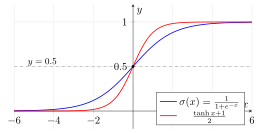
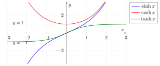

# 第5章 指数函数

> **一例速记**：
> **六条运算律**：$a^x \cdot a^y = a^{x+y}$；$a^x / a^y = a^{x-y}$；$(a^x)^y = a^{xy}$；$(ab)^x = a^x b^x$；$a^{-x} = 1/a^x$；$a^0 = 1$。
> **自然底 $e$**：$(e^x)' = e^x$（导数等于自身，唯一）；$e^x = \sum_{n=0}^\infty x^n/n!$；任意底 $a^x = e^{x\ln a}$。
> **三大等价定义**：$e = \lim_{n\to\infty}(1+1/n)^n$（极限）$= \sum 1/n!$（级数）$=$ 满足 $y'=y, y(0)=1$ 的函数（ODE）。
> **压倒增长**：$a^x$ 增长压倒所有幂函数；$a^x \to 0$ 以 $y = 0$ 为水平渐近线（$a > 1, x \to -\infty$）。
> **应用热点**：Sigmoid $\sigma(x) = 1/(1+e^{-x})$；指数型 ODE $y' = ky$ 通解 $y = Ce^{kx}$；EMA 动量更新 $m_t = \beta m_{t-1} + (1-\beta)g_t$。

---

## 思维路径还原（解题者的内心独白）

> "题目：解方程 $e^{2x} - 5e^x + 6 = 0$，再求极限 $\lim_{n\to\infty}(1 - 3/n)^{2n}$。
>
> **方程那问**：看到 $e^{2x}$ 和 $e^x$ 同时出现，立刻想换元：令 $t = e^x > 0$，则 $e^{2x} = t^2$。方程变成 $t^2 - 5t + 6 = 0$，即 $(t-2)(t-3) = 0$，所以 $t = 2$ 或 $t = 3$。还原：$e^x = 2 \Rightarrow x = \ln 2$；$e^x = 3 \Rightarrow x = \ln 3$。两个都满足 $t > 0$ 的约束，所以两个都是解。
>
> **极限那问**：认出这是 $e^x$ 极限定义的变形。目标：把 $\lim(1+\square)^\square$ 凑成 $\lim_{m\to\infty}(1+1/m)^m = e$ 的形式。
>
> $(1 - 3/n)^{2n}$，括号内是 $1 + (-3/n)$，指数是 $2n$。把指数拆成两层：$[(1 + (-3/n))^{n/(-3)}]^{(-3)\cdot 2} = [(1+(-3/n))^{n/(-3)}]^{-6}$。令 $m = n/(-3) \to -\infty$（$n \to +\infty$），内层 $(1 + 1/m)^m \to e$。所以极限 $= e^{-6}$。
>
> **关键模式**：含阶乘或指数的方程 → 换元；$\lim(1 + \alpha/n)^{\beta n}$ 型极限 → 配凑后 $\to e^{\alpha\beta}$。"

---

## 学习目标

通过本章学习，你将能够：

- 理解指数函数为什么是“按比例增长/衰减”这一普遍现象的自然描述，并掌握自然底 $e$ 在微积分中的特殊地位
- 用三种等价方式定义 $e^x$：极限定义、级数定义、微分方程定义，并理解它们之间的等价性
- 从定义域、值域、单调性、凹凸性、渐近行为和图像变换角度系统分析指数函数
- 熟练使用指数运算律进行化简、解方程、解不等式，掌握指数与对数互相消去的标准技巧
- 理解指数函数为何在极限、导数、积分中具有最简洁的形式，掌握 $e^x$ 的 Taylor 展开
- 建立指数函数与概率分布、激活函数、梯度下降、学习率调度、动量更新等深度学习核心组件之间的联系

---

## 5.1 为什么微积分需要指数函数

指数函数刻画的是一类极为普遍的过程：**变化率正比于自身**。当一个量越大、变化越快（或越小、变化越慢），它就遵循指数规律。

例如：

- 连续复利、人口增长、细菌繁殖、放射性衰变都满足 $\frac{dN}{dt}=kN$；
- RC 电路充放电、温度趋近环境温度（牛顿冷却）都是指数衰减；
- 概率论中的正态分布、指数分布、Boltzmann 分布都建立在 $e^x$ 之上；
- 深度学习中的 Softmax、Sigmoid、Gaussian、注意力分数都依赖 $e^x$；
- 学习率调度（指数衰减、warmup）、动量更新（指数加权平均）也都是指数族。

因此本章不仅要会运算，更要掌握三个核心思想：

1. **指数运算律“乘变加、幂变乘”是其他一切公式的基础**；
2. **自然底 $e$ 让 $(e^x)'=e^x$，是微积分中唯一“形状不变”的非零函数**；
3. **凡是“变化率正比于自身”的现象都必然导致指数函数**。

> **资料参考**：OpenStax Calculus Volume 1 通过极限和反函数引入 $e^x$；OpenStax Precalculus 系统介绍指数函数、图像与应用；Paul's Online Math Notes 与 Khan Academy 提供大量化简、方程与图像练习。

---

## 5.2 指数函数的定义

### 5.2.1 一般指数函数

固定底数 $a>0$ 且 $a\ne1$，**指数函数**定义为

$$
y=a^x,\qquad x\in\mathbb R.
$$

定义过程分四步：

1. **正整数次幂**：$a^n=\underbrace{a\cdot a\cdots a}_{n\text{ 个}}$；
2. **零与负整数次幂**：$a^0=1$，$a^{-n}=\frac1{a^n}$；
3. **有理数次幂**：$a^{p/q}=\sqrt[q]{a^p}$（$q\in\mathbb Z^+$）；
4. **无理数次幂**：用有理数逼近 $x$ 的极限定义 $a^x$，并要求 $a^x$ 关于 $x$ 连续。

排除 $a\le 0$ 和 $a=1$ 是为了避免病态情形：$a=0$ 时 $a^{-1}$ 无定义；$a<0$ 时 $a^{1/2}=\sqrt a$ 不是实数；$a=1$ 时 $a^x\equiv 1$ 退化为常数函数。

### 5.2.2 指数运算律

对 $a,b>0$ 与 $x,y\in\mathbb R$：

$$
a^x\cdot a^y=a^{x+y},
\qquad
\frac{a^x}{a^y}=a^{x-y},
\qquad
(a^x)^y=a^{xy},
$$

$$
(ab)^x=a^x b^x,
\qquad
\left(\frac{a}{b}\right)^x=\frac{a^x}{b^x},
\qquad
a^{-x}=\frac1{a^x}.
$$

这六条运算律完全决定了指数函数的代数性质。

### 5.2.3 自然底 $e$ 的三种等价定义

自然底数 $e$（约 $2.71828\ldots$）有三种常用的等价定义：

**定义一（极限定义）**：

$$
e=\lim_{n\to\infty}\left(1+\frac1n\right)^n.
$$

更一般地：

$$
e^x=\lim_{n\to\infty}\left(1+\frac{x}{n}\right)^n.
$$

**定义二（级数定义）**：

$$
e^x=\sum_{n=0}^\infty\frac{x^n}{n!}=1+x+\frac{x^2}{2!}+\frac{x^3}{3!}+\cdots,\qquad x\in\mathbb R.
$$

**定义三（微分方程定义）**：$e^x$ 是初值问题

$$
y'=y,\qquad y(0)=1
$$

的唯一解。

> **三种定义为什么等价？** 把级数 $\sum\frac{x^n}{n!}$ 逐项求导，得到自身，且 $x=0$ 时值为 $1$，符合定义三；级数在 $x=1$ 处求和恰好等于极限 $\left(1+\frac1n\right)^n$ 的极限值，符合定义一。

### 5.2.4 任意底数转写为 $e$ 的指数

由 $a=e^{\ln a}$，对任意 $a>0$：

$$
a^x=e^{x\ln a}.
$$

这把所有指数函数统一为 $e$ 的指数函数。后续求导、积分时只需对 $e^x$ 处理，其他底数通过链式法则自动获得：

$$
(a^x)'=a^x\ln a.
$$

---

## 5.3 指数函数的基本性质

### 5.3.1 定义域与值域

| 函数 | 定义域 | 值域 | 关键点 |
|:---:|:---:|:---:|:---:|
| $a^x\ (a>1)$ | $\mathbb R$ | $(0,+\infty)$ | $(0,1),(1,a)$ |
| $a^x\ (0<a<1)$ | $\mathbb R$ | $(0,+\infty)$ | $(0,1),(1,a)$ |
| $e^x$ | $\mathbb R$ | $(0,+\infty)$ | $(0,1),(1,e)$ |

注意：**指数函数恒正**，故 $a^x>0$ 对所有 $x$ 成立。

### 5.3.2 单调性

- 当 $a>1$：$a^x$ 在 $\mathbb R$ 上严格单调**递增**；
- 当 $0<a<1$：$a^x$ 在 $\mathbb R$ 上严格单调**递减**；
- 自然指数 $e^x$ 严格递增。

由单调性，指数方程 $a^x=a^y$ 等价于 $x=y$（前提 $a>0,\ a\ne1$）。

### 5.3.3 凹凸性

由二阶导数 $(a^x)''=a^x(\ln a)^2\ge 0$ 可知：**所有指数函数都是凸函数**（在整个 $\mathbb R$ 上下凹向上）。这意味着对任意 $x_1,x_2$ 与 $\lambda\in[0,1]$：

$$
a^{\lambda x_1+(1-\lambda)x_2}\le \lambda a^{x_1}+(1-\lambda)a^{x_2}.
$$

凸性是 Jensen 不等式、对数似然下界（ELBO）等许多机器学习推导的基础。

### 5.3.4 渐近行为

当 $a>1$ 时：

$$
\lim_{x\to+\infty}a^x=+\infty,
\qquad
\lim_{x\to-\infty}a^x=0^+.
$$

当 $0<a<1$ 时方向相反。无论哪种情形，$y=0$ 都是水平渐近线。

进一步，对任意正多项式 $P(x)$ 与 $a>1$：

$$
\lim_{x\to+\infty}\frac{P(x)}{a^x}=0.
$$

即**指数增长压倒任意多项式增长**。这是后续洛必达法则与渐近分析的常用结论。

### 5.3.5 奇偶性

指数函数**既不是奇函数也不是偶函数**。但有两个常见的对称变形：

- $\sinh x=\frac{e^x-e^{-x}}{2}$ 是奇函数（双曲正弦）；
- $\cosh x=\frac{e^x+e^{-x}}{2}$ 是偶函数（双曲余弦）。

它们满足 $\cosh^2x-\sinh^2x=1$，是双曲三角恒等式的核心。

### 5.3.6 图像与参数变换

函数

$$
y=A\,a^{B(x-h)}+k
$$

可由 $y=a^x$ 经过以下变换得到：

| 参数 | 作用 |
|:---:|:---|
| $\|A\|$ | 竖直伸缩；$A<0$ 翻转 |
| $\|B\|$ | 横向伸缩；$B<0$ 左右翻转 |
| $h$ | 向右平移 $h$ |
| $k$ | 向上平移 $k$，水平渐近线为 $y=k$ |

> **例题 5.1** 分析函数 $y=2e^{-x/2}+1$ 的渐近线、单调性以及由 $y=e^x$ 得到的变换。

**解**：

- 由 $y=e^x$ 先横向以 $-\frac12$ 缩放（同时左右翻转、横向拉伸为 $2$ 倍），得到 $e^{-x/2}$；
- 再竖直拉伸为原来的 $2$ 倍，得到 $2e^{-x/2}$；
- 最后向上平移 $1$。

由于横向系数 $-\frac12<0$，函数严格单调递减；当 $x\to+\infty$ 时 $y\to 1$，水平渐近线为 $y=1$。

---

## 5.4 指数恒等式与对数互逆

指数恒等式本质上是 5.2.2 节六条运算律的具体应用。结合对数的反函数关系，能高效解决化简、求值、证明问题。

### 5.4.1 指数与对数互相消去

$$
e^{\ln x}=x\quad(x>0),
\qquad
\ln(e^x)=x\quad(x\in\mathbb R),
$$

$$
a^{\log_a x}=x\quad(x>0),
\qquad
\log_a(a^x)=x\quad(x\in\mathbb R).
$$

这两组等式是统一其他指对数变形的“轴”。

### 5.4.2 任意幂的标准写法

对 $x>0$ 与任意 $r\in\mathbb R$：

$$
x^r=e^{r\ln x}.
$$

更一般地，对 $f(x)>0$：

$$
f(x)^{g(x)}=e^{g(x)\ln f(x)}.
$$

这一恒等式是处理 $x^x$、$(1+\frac1n)^n$、$f(x)^{g(x)}$ 等表达式（**对数求导法**与极限计算）的标准入口。

### 5.4.3 双曲函数恒等式

由

$$
\sinh x=\frac{e^x-e^{-x}}{2},
\qquad
\cosh x=\frac{e^x+e^{-x}}{2},
$$

可直接代入验证：

$$
\cosh^2 x-\sinh^2 x=1,
$$

$$
\sinh(x+y)=\sinh x\cosh y+\cosh x\sinh y,
$$

$$
\cosh(x+y)=\cosh x\cosh y+\sinh x\sinh y.
$$

这些恒等式在悬链线、洛伦兹变换以及深度学习中的 $\tanh$ 激活函数中都会出现。

### 5.4.4 恒等式证明策略

证明含指数的恒等式时常用策略：

1. **统一底数**：用 $a^x=e^{x\ln a}$ 把所有指数化为以 $e$ 为底；
2. **合并指数**：用 $a^x\cdot a^y=a^{x+y}$ 合并；
3. **必要时取对数**：把指数方程转成对数等式；
4. **引入辅助变量**：例如令 $t=a^x$，把高阶指数化为代数表达式。

> **例题 5.2** 证明 $\cosh^2 x-\sinh^2 x=1$。

**解**：直接代入定义：

$$
\begin{aligned}
\cosh^2 x-\sinh^2 x
&=\left(\frac{e^x+e^{-x}}{2}\right)^2-\left(\frac{e^x-e^{-x}}{2}\right)^2\\
&=\frac{(e^x+e^{-x})^2-(e^x-e^{-x})^2}{4}\\
&=\frac{4 e^x e^{-x}}{4}\\
&=1.
\end{aligned}
$$

证毕。 $\square$

---

## 5.5 指数方程与不等式入门

### 5.5.1 基本方程

**指数方程** $a^x=b$（$a>0,\ a\ne1$）：

- 若 $b>0$：唯一解 $x=\log_a b=\dfrac{\ln b}{\ln a}$；
- 若 $b\le 0$：无解（因为 $a^x>0$）。

### 5.5.2 解题策略

1. **化同底**：例如 $9^x=27^{x-1}$，两边写成 $3$ 的幂；
2. **两边取对数**：把 $a^{f(x)}=b^{g(x)}$ 化为 $f(x)\ln a=g(x)\ln b$；
3. **辅助变量替换**：例如令 $t=a^x>0$ 把 $a^{2x}+a^x-6=0$ 化为二次方程；
4. **指对结合**：用 $a^{\log_a x}=x$ 化简。

> **例题 5.3** 解方程 $4^x-2^{x+1}-8=0$。

**解**：令 $t=2^x>0$。由 $4^x=t^2$、$2^{x+1}=2t$，方程化为

$$
t^2-2t-8=0\Rightarrow (t-4)(t+2)=0.
$$

由 $t>0$ 舍去 $t=-2$，得 $t=4$，所以 $2^x=4$，$x=2$。

### 5.5.3 不等式

由单调性：当 $a>1$ 时，

$$
a^{f(x)}>a^{g(x)}\Longleftrightarrow f(x)>g(x).
$$

当 $0<a<1$ 时，不等号方向反转。

> **例题 5.4** 解不等式 $\left(\dfrac13\right)^{x-1}\ge\dfrac19$。

**解**：写成 $\left(\dfrac13\right)^{x-1}\ge\left(\dfrac13\right)^{2}$。因为底 $\dfrac13<1$，函数递减，所以

$$
x-1\le 2\Rightarrow x\le 3.
$$

---

## 5.6 自然指数 $e^x$ 与重要极限

### 5.6.1 自然指数的核心性质

$e^x$ 是**形状不变**的函数：

$$
(e^x)'=e^x,
\qquad
\int e^x\,dx=e^x+C.
$$

它的 Taylor 展开就是其级数定义：

$$
e^x=1+x+\frac{x^2}{2!}+\frac{x^3}{3!}+\cdots,\qquad x\in\mathbb R.
$$

### 5.6.2 Euler 公式与复指数

把 $e^x$ 的级数展开形式应用到 $x=i\theta$（$i$ 是虚数单位）：

$$
e^{i\theta}=\cos\theta+i\sin\theta.
$$

这就是著名的 **Euler 公式**，它把指数、三角函数与复数统一起来。特别地，$\theta=\pi$ 时

$$
e^{i\pi}+1=0,
$$

把五个最基本的常数 $e,i,\pi,1,0$ 关联在一个等式中。

### 5.6.3 与 $e$ 相关的两个重要极限

后面学习极限时会证明：

$$
\lim_{n\to\infty}\left(1+\frac1n\right)^n=e,
\qquad
\lim_{x\to0}\frac{e^x-1}{x}=1.
$$

第二个极限说明在 $x=0$ 附近 $e^x\approx 1+x$，是导数公式 $(e^x)'=e^x$ 的极限定义形式。

> **例题 5.5** 求 $\displaystyle\lim_{n\to\infty}\left(1-\frac{3}{n}\right)^{2n}$。

**解**：

$$
\left(1-\frac{3}{n}\right)^{2n}
=\left[\left(1+\frac{-3}{n}\right)^{n/(-3)}\right]^{-6}.
$$

由极限定义 $\left(1+\frac{1}{m}\right)^m\to e$（令 $m=\frac{n}{-3}\to-\infty$ 时同样成立），内层趋近于 $e$，所以原极限等于 $e^{-6}$。

---

## 5.7 与微积分的连接

本章是后续微积分中许多重要结论的前置基础。

### 5.7.1 导数与积分

基本导数公式：

$$
(e^x)'=e^x,
\qquad
(a^x)'=a^x\ln a,
\qquad
(e^{f(x)})'=e^{f(x)}f'(x).
$$

基本积分公式：

$$
\int e^x\,dx=e^x+C,
\qquad
\int a^x\,dx=\frac{a^x}{\ln a}+C,
$$

$$
\int e^{kx}\,dx=\frac{e^{kx}}{k}+C\quad(k\ne0).
$$

### 5.7.2 指数型微分方程

最简单的微分方程

$$
\frac{dy}{dx}=ky
$$

的通解是 $y=Ce^{kx}$。它统一了：放射性衰变（$k<0$）、连续复利（$k>0$）、RC 电路、牛顿冷却定律、生物种群初期增长、神经网络中指数加权平均的离散类比等等。

更一般地，方程

$$
y'=ky+b
$$

的通解为 $y=Ce^{kx}-\dfrac{b}{k}$，水平渐近线为 $y=-\dfrac{b}{k}$。

### 5.7.3 对数求导法

形如 $y=f(x)^{g(x)}$ 的函数无法直接套用幂法则或指数法则，标准做法是把它写成 $e$ 的指数：

$$
y=e^{g(x)\ln f(x)}.
$$

求导得

$$
y'=y\cdot\left[g'(x)\ln f(x)+g(x)\cdot\frac{f'(x)}{f(x)}\right].
$$

例如对 $y=x^x$（$x>0$）：

$$
y=e^{x\ln x},
\qquad
y'=x^x(\ln x+1).
$$

---

## 5.8 深度学习应用

指数函数在现代深度学习中是核心工具，以下介绍三个最常见的场景。

### 5.8.1 Sigmoid 与 Tanh 激活函数

最早的非线性激活函数 **Sigmoid** 定义为

$$
\sigma(x)=\frac{1}{1+e^{-x}}.
$$

它把任意实数压到 $(0,1)$ 区间，常作为二分类的概率输出。它的导数有非常简洁的形式：

$$
\sigma'(x)=\sigma(x)\bigl(1-\sigma(x)\bigr),
$$

这是反向传播链式法则展开时复用 $\sigma(x)$ 自身的关键。

类似地，**Tanh** 激活函数

$$
\tanh x=\frac{e^x-e^{-x}}{e^x+e^{-x}}=\frac{\sinh x}{\cosh x}
$$

把实数压到 $(-1,1)$，是 Sigmoid 的中心化版本，满足

$$
\tanh'(x)=1-\tanh^2 x.
$$

### 5.8.2 高斯分布与注意力分数

正态分布的概率密度函数

$$
p(x)=\frac{1}{\sqrt{2\pi}\sigma}e^{-(x-\mu)^2/(2\sigma^2)}
$$

直接由 $e^x$ 构造，是连续概率密度中最常用的形式。

Transformer 的自注意力把 query-key 内积通过 Softmax（$e^x$ 归一化）得到注意力权重：

$$
\mathrm{Attention}(Q,K,V)=\mathrm{softmax}\!\left(\frac{QK^\top}{\sqrt{d_k}}\right)V.
$$

指数函数把任意实数得分单调地映射到正数，并放大相对差异，自然地实现“高分关注更高”。

### 5.8.3 指数加权移动平均与优化器

许多优化算法和学习率调度都使用 **指数加权移动平均（EMA）**：

$$
m_t=\beta m_{t-1}+(1-\beta)g_t.
$$

展开后得

$$
m_t=(1-\beta)\sum_{k=0}^{t-1}\beta^k g_{t-k},
$$

权重 $\beta^k$ 随时间指数衰减——越近的样本权重越大。Adam、RMSProp、Momentum SGD、BatchNorm 中的 running mean 与 var 都使用这一更新方式。

类似地，**指数学习率衰减**

$$
\eta_t=\eta_0\cdot\gamma^t
$$

让学习率随训练步数指数下降，是稳定后期训练的常用技巧。

### 代码示例：Sigmoid 与数值稳定的实现

```python
import math

import torch


def sigmoid_naive(x: torch.Tensor) -> torch.Tensor:
    """直接实现，x 很负时 e^{-x} 上溢。"""
    return 1.0 / (1.0 + torch.exp(-x))


def sigmoid_stable(x: torch.Tensor) -> torch.Tensor:
    """数值稳定的 sigmoid：分别处理 x>=0 与 x<0。"""
    pos_mask = x >= 0
    neg_mask = ~pos_mask
    out = torch.empty_like(x)
    out[pos_mask] = 1.0 / (1.0 + torch.exp(-x[pos_mask]))
    exp_x = torch.exp(x[neg_mask])
    out[neg_mask] = exp_x / (1.0 + exp_x)
    return out


x = torch.tensor([-1000.0, 0.0, 1000.0])
print(sigmoid_stable(x))   # tensor([0., 0.5, 1.])
# print(sigmoid_naive(x))  # 在 -1000 处会上溢为 inf
```

技巧的核心是对 $x<0$ 用恒等式

$$
\frac{1}{1+e^{-x}}=\frac{e^x}{1+e^x}
$$

把分母中的大指数项替换掉，从而避免上溢。

---

## 本章小结

1. **指数函数 $a^x$** 描述按比例增长/衰减，定义需经过整数 → 有理数 → 实数的逐层扩展。
2. **六条指数运算律**（乘、除、幂、积底、商底、负幂）是后续一切公式的代数基础。
3. **自然底 $e$** 有三种等价定义（极限、级数、微分方程），$(e^x)'=e^x$ 让它在微积分中具有最简形式。
4. **基本性质**包括恒正、严格单调、凸、过 $(0,1)$ 与 $(1,a)$，以及水平渐近线 $y=0$。
5. **方程与不等式**的核心策略是化同底、取对数、辅助变量替换，利用单调性确定不等号方向。
6. **微积分连接**包括 $(e^x)'=e^x$、指数型 ODE $y'=ky$ 的通解 $y=Ce^{kx}$、对数求导法以及 $e^{i\theta}=\cos\theta+i\sin\theta$。
7. **深度学习应用**覆盖 Sigmoid/Tanh 激活、Softmax 注意力、高斯分布以及指数加权移动平均与学习率衰减。

---

## 资料与延伸阅读

- [OpenStax Calculus Volume 1, Section 1.5: Exponential and Logarithmic Functions](https://openstax.org/books/calculus-volume-1/pages/1-5-exponential-and-logarithmic-functions)。重点参考自然底 $e$、指数函数定义与基本极限。
- [OpenStax Precalculus 2e, Chapter 4: Exponential and Logarithmic Functions](https://openstax.org/books/precalculus-2e/pages/4-introduction-to-exponential-and-logarithmic-functions)。重点参考图像、运算律、方程与应用建模。
- [Paul's Online Math Notes, Algebra: Exponential Functions](https://tutorial.math.lamar.edu/Classes/Alg/ExpFunctions.aspx)。重点参考化简、解方程与常见误区。
- [Khan Academy: Exponential growth & decay](https://www.khanacademy.org/math/algebra2/x2ec2f6f830c9fb89:exp-growth-decay)。重点参考指数增长建模与图像变换的交互式练习。
- Goodfellow, Bengio, Courville. *Deep Learning*, Chapter 3 & 6。重点参考 Sigmoid/Tanh、Softmax、高斯分布与数值稳定性讨论。

---

## 练习题

**1.** ⭐ 化简下列表达式：
   (a) $2^3\cdot 2^{-5}$　　(b) $\dfrac{3^{2x}}{3^{x-1}}$　　(c) $(e^2)^3\cdot e^{-5}$　　(d) $\sqrt[3]{8^{2x}}$

**2.** ⭐ 用 $e$ 的指数形式重写下列表达式：
   (a) $3^x$　　(b) $5^{2x-1}$　　(c) $x^{\sqrt 2}\ (x>0)$　　(d) $(1+x)^x\ (x>0)$

**3.** ⭐ 解下列方程：
   (a) $2^{x+1}=16$　　(b) $9^x=27^{x-1}$　　(c) $e^{2x}-5e^x+6=0$

**4.** ⭐⭐ 证明 $\cosh^2 x-\sinh^2 x=1$，其中 $\cosh x=\dfrac{e^x+e^{-x}}{2},\ \sinh x=\dfrac{e^x-e^{-x}}{2}$。

**5.** ⭐⭐ 解不等式 $\left(\dfrac13\right)^{x-1}\ge\dfrac19$，并写出解集。

**6.** ⭐⭐ 已知 $y=2e^{-x/2}+1$。求它的水平渐近线、单调性，并说明其图像由 $y=e^x$ 经过哪些变换得到。

**7.** ⭐⭐⭐ 求极限
$$
\lim_{n\to\infty}\left(1-\frac{3}{n}\right)^{2n}.
$$

**8.** ⭐⭐⭐ 证明 Sigmoid 函数 $\sigma(x)=\dfrac{1}{1+e^{-x}}$ 满足

$$
\sigma'(x)=\sigma(x)\bigl(1-\sigma(x)\bigr),
$$

并解释为什么实现时对 $x<0$ 改用 $\sigma(x)=\dfrac{e^x}{1+e^x}$ 在数值上更稳定。

---

## 练习答案

<details>
<summary>点击展开答案</summary>

**1.**
(a) $2^3\cdot 2^{-5}=2^{-2}=\dfrac14$。

(b) $\dfrac{3^{2x}}{3^{x-1}}=3^{2x-(x-1)}=3^{x+1}$。

(c) $(e^2)^3\cdot e^{-5}=e^{6-5}=e$。

(d) $\sqrt[3]{8^{2x}}=8^{2x/3}=(2^3)^{2x/3}=2^{2x}$。

---

**2.**
(a) $3^x=e^{x\ln 3}$。

(b) $5^{2x-1}=e^{(2x-1)\ln 5}$。

(c) $x^{\sqrt 2}=e^{\sqrt 2\ln x}$（$x>0$）。

(d) $(1+x)^x=e^{x\ln(1+x)}$（$x>0$）。

---

**3.**
(a) $16=2^4$，$2^{x+1}=2^4$，$x=3$。

(b) $9^x=3^{2x}$，$27^{x-1}=3^{3(x-1)}$，所以 $2x=3(x-1)$，$x=3$。

(c) 令 $t=e^x>0$，方程化为 $t^2-5t+6=0$，$(t-2)(t-3)=0$，所以 $t=2$ 或 $t=3$，即 $x=\ln 2$ 或 $x=\ln 3$。

---

**4.** 直接代入：

$$
\begin{aligned}
\cosh^2 x-\sinh^2 x
&=\left(\frac{e^x+e^{-x}}{2}\right)^2-\left(\frac{e^x-e^{-x}}{2}\right)^2\\
&=\frac{(e^x+e^{-x})^2-(e^x-e^{-x})^2}{4}\\
&=\frac{4 e^x e^{-x}}{4}=1.
\end{aligned}
$$

证毕。 $\square$

---

**5.** 写成 $\left(\dfrac13\right)^{x-1}\ge\left(\dfrac13\right)^2$。底 $\dfrac13<1$ 函数递减，不等号反向：

$$
x-1\le 2\Rightarrow x\le 3.
$$

解集为 $(-\infty,3]$。

---

**6.** $y=2e^{-x/2}+1$。

- **水平渐近线**：当 $x\to+\infty$ 时 $e^{-x/2}\to 0$，$y\to 1$，渐近线为 $y=1$。
- **单调性**：指数系数 $-\dfrac12<0$ 且外层 $2>0$，函数严格单调递减。
- **图像变换**：由 $y=e^x$ 先以 $-\dfrac12$ 横向缩放（先关于 $y$ 轴翻转再横向拉伸为 $2$ 倍），得到 $e^{-x/2}$；再竖直拉伸 $2$ 倍得到 $2e^{-x/2}$；最后向上平移 $1$。

---

**7.** 改写为

$$
\left(1-\frac{3}{n}\right)^{2n}
=\left[\left(1+\frac{-3}{n}\right)^{n/(-3)}\right]^{-6}.
$$

令 $m=\dfrac{n}{-3}\to-\infty$（$n\to+\infty$），内层 $\left(1+\dfrac{1}{m}\right)^m\to e$。所以原极限 $=e^{-6}$。

---

**8.** 先求导：

$$
\sigma'(x)=\frac{d}{dx}\frac{1}{1+e^{-x}}
=\frac{-(-e^{-x})}{(1+e^{-x})^2}
=\frac{e^{-x}}{(1+e^{-x})^2}.
$$

注意

$$
1-\sigma(x)=1-\frac{1}{1+e^{-x}}=\frac{e^{-x}}{1+e^{-x}},
$$

所以

$$
\sigma(x)(1-\sigma(x))=\frac{1}{1+e^{-x}}\cdot\frac{e^{-x}}{1+e^{-x}}=\frac{e^{-x}}{(1+e^{-x})^2}=\sigma'(x).
$$

证毕。

**数值稳定性**：当 $x$ 非常负（如 $-1000$）时，$e^{-x}=e^{1000}$ 会上溢为 `inf`，使 $\dfrac{1}{1+\text{inf}}$ 退化或产生 NaN。改写为

$$
\sigma(x)=\frac{e^x}{1+e^x},
$$

此时 $x<0\Rightarrow e^x<1$，分子分母都在 $[0,1]$ 与 $[1,2]$ 内，既不上溢也不下溢。因此实现时根据 $x$ 的符号分支选择形式，可以保证全区间数值稳定。

</details>

---

## 几何示意





---

## 思考路标（条件反射）

- 看到 $a^x \cdot a^y$ → $a^{x+y}$（同底相加）
- 看到 $(a^x)^y$ → $a^{xy}$
- 看到 $a^x / a^y$ → $a^{x-y}$
- 看到 $e^x$ 的导数 → 自身 $e^x$（自然底的标志）
- 看到 $\lim_{n\to\infty}(1+1/n)^n$ → $e$
- 看到 sigmoid $\sigma(x) = 1/(1+e^{-x})$ → 数值稳定要分 $x > 0$ vs $x \leq 0$
- 看到双曲函数 $\sinh, \cosh, \tanh$ → 与三角对偶（hyperbolic identity）
- 看到 EMA $\beta y_t + (1-\beta) x_t$ → 想几何加权平均（$\beta$ 越大记忆越长）

## 易错点

1. **$a^x$ 中底数限制 $a > 0$**；负底数 $a^x$（如 $(-1)^{1/2}$）无定义为实函数。
2. **$0^0$ 在不同上下文有不同约定**：组合数学常约定 $= 1$；连续极限可能不存在。
3. **$e^x$ 的级数收敛于所有实数**：$\sum x^k/k!$ 对任意 $x$ 收敛。
4. **sigmoid 上溢 / 下溢**：$\sigma(1000)$ 直接算 $e^{-1000}$ 下溢为 0 → $\sigma \approx 1$；$\sigma(-1000)$ 直接算 $e^{1000}$ 上溢 → 实际需分支处理。
5. **$\tanh x = (e^x - e^{-x})/(e^x + e^{-x})$**，注意是减法分子。学生常写反加减。

---

## 抽象成方法（套路总结）

### 指数函数核心速查

| 类别 | 公式 | 关键约束 |
|---|---|---|
| 运算律 | $a^x \cdot a^y = a^{x+y}$；$(a^x)^y = a^{xy}$ | $a > 0, a \neq 1$ |
| 统一底 | $a^x = e^{x\ln a}$ | 后续导数全靠此 |
| 导数 | $(e^x)' = e^x$；$(a^x)' = a^x\ln a$ | $e$ 是唯一"形不变"底 |
| 重要极限 | $e^x \approx 1+x$（$x \to 0$）；$\lim (1+1/n)^n = e$ | 极限计算利器 |
| ODE | $y' = ky \Rightarrow y = Ce^{kx}$ | 增长/衰减建模 |
| 双曲 | $\cosh^2 x - \sinh^2 x = 1$；$\sinh x = (e^x-e^{-x})/2$ | 与三角类比 |

### 指数方程解题流程

1. **统一底数**：所有项化为同一底（若涉及 $2^x, 4^x$，可化为 $2$ 的幂）；
2. **换元**：令 $t = a^x > 0$，化为关于 $t$ 的代数方程；
3. **解代数方程**，舍去 $t \leq 0$ 的根；
4. **还原**：$a^x = t \Rightarrow x = \log_a t$。

---

## 方法变形

### 变形 1：$e^x$ 配凑极限

$\lim_{n\to\infty}(1 + \alpha/n)^{\beta n}$ 型极限：令 $m = n/\alpha$，内层配凑为 $(1+1/m)^m \to e$，整体 $\to e^{\alpha\beta}$。

### 变形 2：幂函数型 $f(x)^{g(x)}$

$y = f(x)^{g(x)}$ 统一写成 $e^{g(x)\ln f(x)}$，再对 $x$ 求导（对数求导法）。例 $y = x^x = e^{x\ln x}$，$y' = x^x(\ln x + 1)$。

### 变形 3：双曲函数对照

$\sinh$ 是奇函数，$\cosh$ 是偶函数，恒等式 $\cosh^2 - \sinh^2 = 1$ 与三角 $\cos^2 + \sin^2 = 1$ 对照（注意差号）。$\tanh$ 是 Sigmoid 的平移：$\tanh x = 2\sigma(2x) - 1$。

### 变形 4：指数不等式注意方向

$a^{f(x)} > a^{g(x)}$：$a > 1$ 时 $f(x) > g(x)$；$0 < a < 1$ 时 $f(x) < g(x)$。**底数改变不等号方向**。

---

## 典型应用例题

### 例 1：指数方程换元

> **题目**：解方程 $9^x - 4 \cdot 3^x + 3 = 0$。

【思路】令 $t = 3^x > 0$，$9^x = t^2$，化为二次方程。

【解】令 $t = 3^x > 0$，方程变为

$$t^2 - 4t + 3 = 0 \Rightarrow (t-1)(t-3) = 0.$$

$t = 1 \Rightarrow 3^x = 1 \Rightarrow x = 0$；$t = 3 \Rightarrow 3^x = 3 \Rightarrow x = 1$。

【答案】$\boxed{x = 0 \text{ 或 } x = 1}$。

### 例 2：$e$ 的极限配凑

> **题目**：求 $\displaystyle\lim_{n\to\infty}\left(1 + \frac{2}{n}\right)^{3n}$。

【思路】认出 $(1 + \alpha/n)^{\beta n}$ 型，套公式 $e^{\alpha\beta}$。

【解】

$$\left(1+\frac{2}{n}\right)^{3n} = \left[\left(1+\frac{2}{n}\right)^{n/2}\right]^{6}.$$

令 $m = n/2$，内层 $(1+1/m)^m \to e$，故原极限 $= e^6$。

【答案】$\boxed{e^6}$。

### 例 3：Sigmoid 导数与数值稳定

> **题目**：(1) 证明 $\sigma'(x) = \sigma(x)(1-\sigma(x))$；(2) 解释当 $x = -1000$ 时，直接计算 $1/(1+e^{1000})$ 会出什么问题，如何修复。

【思路】(1) 链式法则；(2) $e^{1000}$ 上溢，改用恒等变形。

【解】

(1) $\sigma'(x) = \dfrac{e^{-x}}{(1+e^{-x})^2} = \dfrac{1}{1+e^{-x}} \cdot \dfrac{e^{-x}}{1+e^{-x}} = \sigma(x)(1-\sigma(x))$。

(2) $e^{1000}$ 在浮点数中上溢为 `inf`，$1/(1+\text{inf}) = 0$（错误：正确值 $\approx 5 \times 10^{-435}$ 极小但不为 $0$）。修复：当 $x < 0$ 时用等价形式

$$\sigma(x) = \frac{e^x}{1+e^x},$$

此时 $e^{-1000} \approx 0$，分子分母均可正常计算。

【答案】导数公式 $\sigma'(x) = \sigma(x)(1-\sigma(x))$；数值修复：分 $x \geq 0$ 和 $x < 0$ 两分支。

---

## 自测题

**自测 1**　化简 $(2^3 \cdot 2^{-5}) \div 2^{-4}$。

> 💡 提示：$= 2^{3-5+4} = 2^2 = 4$。

**自测 2**　解方程 $2^{2x} - 6 \cdot 2^x + 8 = 0$。

> 💡 提示：令 $t = 2^x$，$(t-2)(t-4) = 0$，$t = 2$ 或 $4$，故 $x = 1$ 或 $x = 2$。

**自测 3**　求 $\lim_{n\to\infty}\left(1 - \dfrac{1}{n}\right)^{2n}$。

> 💡 提示：$\alpha = -1$，$\beta = 2$，极限 $= e^{-2}$。

**自测 4**　$y = x^{\sin x}$（$x > 0$）。用对数求导法求 $y'$。

> 💡 提示：$\ln y = \sin x \cdot \ln x$，两边对 $x$ 求导：$y'/y = \cos x \cdot \ln x + \sin x/x$，故 $y' = x^{\sin x}(\cos x \ln x + \sin x/x)$。

**自测 5**　EMA 更新 $m_t = \beta m_{t-1} + (1-\beta)g_t$ 中，历史梯度 $g_{t-k}$ 的权重是 $\beta^k(1-\beta)$。当 $\beta = 0.9$ 时，有效记忆步长（权重衰减到 $1/e$ 时的步数 $k$）大约是多少？

> 💡 提示：$0.9^k = 1/e$，取对数 $k \ln 0.9 = -1$，$k \approx 1/(-\ln 0.9) \approx 1/0.105 \approx 9.5$。与 $1/(1-\beta) = 10$ 吻合——"有效步长约 $1/(1-\beta)$"的来源。

---

**回头看一眼"一例速记"**：

> 六条运算律；$a^x = e^{x\ln a}$；$(e^x)' = e^x$；$e = \lim(1+1/n)^n$；ODE $y'=ky$ 通解 $Ce^{kx}$。

如果现在不看笔记，能独立完成例 1 + 例 2 + 自测 4——本章，你拿下了。
