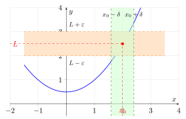
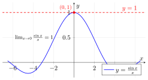
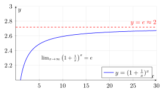

# 第5章 函数极限

> **一例速记**：
> $\varepsilon$-$\delta$ 三步证明：① 设 $\varepsilon > 0$ ② **反向估计** $|f(x)-L|<\varepsilon$ 解出 $\delta$ ③ 验证。
> **两个重要极限**：$\lim_{x\to 0}\dfrac{\sin x}{x}=1$；$\lim_{x\to\infty}\left(1+\dfrac{1}{x}\right)^x=e$。
> **海涅定理**：$\lim_{x\to x_0} f(x)=L \iff$ 对**任意**趋于 $x_0$ 的数列 $\{x_n\}$（$x_n\neq x_0$），有 $\lim f(x_n)=L$。

---

## 引入：用 $\varepsilon$-$\delta$ 证明线性极限

> **题目**：用 $\varepsilon$-$\delta$ 定义证明 $\lim_{x\to 2}(3x - 1) = 5$。

请先停下来想一想：$\varepsilon$-$\delta$ 证明的"难点"在哪？不在"会不会用定义"，而在**怎么找出 $\delta$**——很多学生会卡在这一步。

**关键观察**：$\delta$ 不是凭空猜出来的，而是**从结论反向解出来的**。我们想要的目标是 $|f(x) - L| < \varepsilon$，把这个不等式当成"关于 $|x - x_0|$ 的不等式"求解，解出来的上界就是 $\delta$。下面把内心独白完整还原。

---

## 思维路径还原（解题者的内心独白）

> "看到 $\varepsilon$-$\delta$ 证明，立刻准备三步：**设、找、验**。
>
> **第 1 步：设 $\varepsilon > 0$ 任意给定。**（标准开头，没什么悬念。）
>
> **第 2 步：反向找 $\delta$。** 这才是真正的工作。我要让结论 $|f(x) - L| < \varepsilon$ 成立，把它写成 $|(3x - 1) - 5| < \varepsilon$，化简：
> $$|3x - 6| < \varepsilon \implies 3|x - 2| < \varepsilon \implies |x - 2| < \dfrac{\varepsilon}{3}.$$
> 这就是 $\delta$！取 $\delta = \varepsilon / 3$。
>
> **第 3 步：验证。** 假设 $0 < |x - 2| < \delta = \varepsilon/3$，则
> $$|f(x) - L| = |3x - 6| = 3|x - 2| < 3 \cdot \dfrac{\varepsilon}{3} = \varepsilon \;\checkmark$$
>
> 完成！这是**最简单的线性情形**。如果换成 $\lim_{x\to x_0}(ax + b) = ax_0 + b$，同样的方法得 $\delta = \varepsilon/|a|$（注意 $a$ 可能负，要取绝对值）。
>
> **进阶**：若 $f$ 不是线性的，比如 $\lim_{x\to 2} x^2 = 4$？反向估计 $|x^2 - 4| = |x-2|\cdot|x+2|$。$|x+2|$ 不是常数——需要**先要求** $|x - 2| < 1$（即 $1 < x < 3$，从而 $|x+2| < 5$），再处理：$|x^2 - 4| < 5|x - 2|$，所以 $|x - 2| < \varepsilon/5$ 足够。最后取 $\delta = \min(1, \varepsilon/5)$。
>
> **大原则**：含非线性项时，**先用某个固定值（如 1）限制 $|x-x_0|$**，再处理结果不等式。"

---

## 学习目标

通过本章学习，你将能够：

- 理解函数极限的直观含义，掌握自变量趋于有限值和无穷时的极限概念
- 深刻理解函数极限的 $\varepsilon$-$\delta$ 定义，能用定义证明简单极限
- 理解海涅定理，掌握函数极限与数列极限的内在联系
- 熟练运用极限的四则运算法则和复合函数极限法则
- 掌握两个重要极限并能灵活应用
- 理解无穷小量的比较，熟练运用等价无穷小替换求极限

---

## 5.1 函数极限的概念

### 5.1.1 自变量趋于有限值时的极限

设函数 $f(x)$ 在点 $x_0$ 的某个**去心邻域**内有定义（即在 $0 < |x - x_0| < \delta_0$ 内有定义，但在 $x_0$ 处可以没有定义）。

**直观理解**：当 $x$ 从两侧无限接近 $x_0$ 时，如果 $f(x)$ 无限接近某个确定的值 $L$，就说 $L$ 是 $f(x)$ 当 $x \to x_0$ 时的极限。

> **例题 5.1** 观察函数 $f(x) = \dfrac{x^2 - 1}{x - 1}$ 在 $x = 1$ 附近的行为。

**解**：注意 $f(x)$ 在 $x = 1$ 处没有定义。但当 $x \neq 1$ 时：
$$f(x) = \frac{x^2 - 1}{x - 1} = \frac{(x-1)(x+1)}{x-1} = x + 1$$

当 $x$ 接近 $1$ 时（无论从左侧还是右侧），$f(x) = x + 1$ 接近 $2$。

因此 $\lim_{x \to 1} \dfrac{x^2 - 1}{x - 1} = 2$。

**关键观察**：极限关注的是 $x$ **趋近于** $x_0$ 时的行为，而不是在 $x_0$ **处**的函数值。即使函数在该点没有定义，极限也可能存在。

### 5.1.2 自变量趋于无穷时的极限

当自变量 $x$ 无限增大（或无限减小）时，函数值趋近于某个确定值的情况。

**三种情形**：
- $x \to +\infty$：$x$ 沿正方向无限增大
- $x \to -\infty$：$x$ 沿负方向无限减小
- $x \to \infty$：$|x|$ 无限增大（不考虑方向）

> **例题 5.2** 求 $\lim_{x \to +\infty} \dfrac{1}{x}$ 和 $\lim_{x \to +\infty} e^{-x}$。

**解**：
(1) 当 $x \to +\infty$ 时，$\dfrac{1}{x} \to 0$。

(2) 当 $x \to +\infty$ 时，$e^{-x} = \dfrac{1}{e^x} \to 0$（因为 $e^x \to +\infty$）。

### 5.1.3 左极限与右极限

有时我们需要区分 $x$ 从左侧还是右侧趋近于 $x_0$。

**左极限**：$x$ 从**左侧**趋近于 $x_0$（即 $x < x_0$ 且 $x \to x_0$），记作
$$\lim_{x \to x_0^-} f(x) = L \quad \text{或} \quad f(x_0^-) = L$$

**右极限**：$x$ 从**右侧**趋近于 $x_0$（即 $x > x_0$ 且 $x \to x_0$），记作
$$\lim_{x \to x_0^+} f(x) = L \quad \text{或} \quad f(x_0^+) = L$$

**定理**：$\lim_{x \to x_0} f(x) = L$ 的充要条件是 $\lim_{x \to x_0^-} f(x) = \lim_{x \to x_0^+} f(x) = L$。

> **例题 5.3** 讨论符号函数 $\text{sgn}(x) = \begin{cases} 1, & x > 0 \\ 0, & x = 0 \\ -1, & x < 0 \end{cases}$ 在 $x = 0$ 处的极限。

**解**：
$$\lim_{x \to 0^+} \text{sgn}(x) = 1, \quad \lim_{x \to 0^-} \text{sgn}(x) = -1$$

由于左极限 $\neq$ 右极限，所以 $\lim_{x \to 0} \text{sgn}(x)$ **不存在**。

---

## 5.2 函数极限的 ε-δ 定义

### 5.2.1 严格的 ε-δ 定义

**定义**（$x \to x_0$ 时的极限）：设函数 $f(x)$ 在点 $x_0$ 的某去心邻域内有定义。若对于**任意给定的** $\varepsilon > 0$，**都存在** $\delta > 0$，使得当 $0 < |x - x_0| < \delta$ 时，有
$$|f(x) - L| < \varepsilon$$
则称 $L$ 为函数 $f(x)$ 当 $x \to x_0$ 时的极限，记作
$$\lim_{x \to x_0} f(x) = L$$

**用逻辑符号表述**：
$$\lim_{x \to x_0} f(x) = L \iff \forall \varepsilon > 0, \exists \delta > 0, \forall x: 0 < |x - x_0| < \delta \Rightarrow |f(x) - L| < \varepsilon$$

**几何解释**：无论给定多小的 $\varepsilon$（纵向精度），总能找到足够小的 $\delta$（横向范围），使得在 $(x_0 - \delta, x_0 + \delta)$ 去心邻域内的所有点，其函数值都落在 $(L - \varepsilon, L + \varepsilon)$ 内。

> **例题 5.4** 用 $\varepsilon$-$\delta$ 定义证明：$\lim_{x \to 2} (3x - 1) = 5$。

**解**：设 $\varepsilon > 0$ 是任意给定的正数。我们需要找到 $\delta > 0$，使得当 $0 < |x - 2| < \delta$ 时，有 $|(3x - 1) - 5| < \varepsilon$。

计算：
$$|(3x - 1) - 5| = |3x - 6| = 3|x - 2|$$

要使 $3|x - 2| < \varepsilon$，只需 $|x - 2| < \dfrac{\varepsilon}{3}$。

因此，取 $\delta = \dfrac{\varepsilon}{3}$，则当 $0 < |x - 2| < \delta$ 时：
$$|(3x - 1) - 5| = 3|x - 2| < 3\delta = \varepsilon$$

这就证明了 $\lim_{x \to 2} (3x - 1) = 5$。 $\square$

> **例题 5.5** 用 $\varepsilon$-$\delta$ 定义证明：$\lim_{x \to 1} x^2 = 1$。

**解**：设 $\varepsilon > 0$。我们需要找 $\delta$，使得当 $0 < |x - 1| < \delta$ 时，$|x^2 - 1| < \varepsilon$。

计算：
$$|x^2 - 1| = |x - 1||x + 1|$$

为了控制 $|x + 1|$，先限定 $|x - 1| < 1$，则 $0 < x < 2$，从而 $|x + 1| < 3$。

此时 $|x^2 - 1| = |x - 1||x + 1| < 3|x - 1|$。

要使 $3|x - 1| < \varepsilon$，需要 $|x - 1| < \dfrac{\varepsilon}{3}$。

取 $\delta = \min\left\{1, \dfrac{\varepsilon}{3}\right\}$，则当 $0 < |x - 1| < \delta$ 时：
$$|x^2 - 1| < 3|x - 1| < 3\delta \leq \varepsilon$$

因此 $\lim_{x \to 1} x^2 = 1$。 $\square$

**其他类型极限的 $\varepsilon$-$\delta$ 定义**：

- **$x \to \infty$**：$\forall \varepsilon > 0, \exists X > 0$，当 $|x| > X$ 时，$|f(x) - L| < \varepsilon$
- **$x \to x_0^+$**：$\forall \varepsilon > 0, \exists \delta > 0$，当 $0 < x - x_0 < \delta$ 时，$|f(x) - L| < \varepsilon$
- **$x \to x_0^-$**：$\forall \varepsilon > 0, \exists \delta > 0$，当 $0 < x_0 - x < \delta$ 时，$|f(x) - L| < \varepsilon$

### 5.2.2 与数列极限的关系（海涅定理）

函数极限与数列极限之间存在深刻的联系。

**定理**（海涅定理 / 归结原则）：$\lim_{x \to x_0} f(x) = L$ 的充要条件是：对于**任意**满足 $x_n \neq x_0$ 且 $\lim_{n \to \infty} x_n = x_0$ 的数列 $\{x_n\}$，都有
$$\lim_{n \to \infty} f(x_n) = L$$

**海涅定理的应用**：

1. **证明极限存在**：如果对所有趋于 $x_0$ 的数列，$f(x_n)$ 都趋于同一个值，则函数极限存在。

2. **证明极限不存在**：如果能找到两个趋于 $x_0$ 的数列 $\{x_n\}$ 和 $\{y_n\}$，使得 $\lim f(x_n) \neq \lim f(y_n)$，则函数极限不存在。

> **例题 5.6** 证明 $\lim_{x \to 0} \sin\dfrac{1}{x}$ 不存在。

**解**：取数列 $x_n = \dfrac{1}{n\pi}$，则 $x_n \to 0$，而 $\sin\dfrac{1}{x_n} = \sin(n\pi) = 0$。

取数列 $y_n = \dfrac{1}{\frac{\pi}{2} + 2n\pi} = \dfrac{1}{(4n+1)\frac{\pi}{2}}$，则 $y_n \to 0$，而 $\sin\dfrac{1}{y_n} = \sin\left(\dfrac{\pi}{2} + 2n\pi\right) = 1$。

由于 $\lim_{n \to \infty} \sin\dfrac{1}{x_n} = 0 \neq 1 = \lim_{n \to \infty} \sin\dfrac{1}{y_n}$，由海涅定理，$\lim_{x \to 0} \sin\dfrac{1}{x}$ 不存在。 $\square$

---

## 5.3 极限的性质与运算

### 5.3.1 局部有界性

**定理**：若 $\lim_{x \to x_0} f(x) = L$，则存在 $\delta > 0$ 和 $M > 0$，使得当 $0 < |x - x_0| < \delta$ 时，$|f(x)| \leq M$。

**证明**：取 $\varepsilon = 1$，则存在 $\delta > 0$，当 $0 < |x - x_0| < \delta$ 时，$|f(x) - L| < 1$。

从而 $|f(x)| \leq |f(x) - L| + |L| < 1 + |L|$。

取 $M = 1 + |L|$ 即可。 $\square$

### 5.3.2 保号性

**定理**：若 $\lim_{x \to x_0} f(x) = L > 0$，则存在 $\delta > 0$，使得当 $0 < |x - x_0| < \delta$ 时，$f(x) > 0$。

**推论**：若在 $x_0$ 的某去心邻域内 $f(x) \geq 0$（或 $\leq 0$），且 $\lim_{x \to x_0} f(x) = L$，则 $L \geq 0$（或 $\leq 0$）。

### 5.3.3 四则运算法则

**定理**：设 $\lim_{x \to x_0} f(x) = A$，$\lim_{x \to x_0} g(x) = B$，则：

1. $\lim_{x \to x_0} [f(x) \pm g(x)] = A \pm B$
2. $\lim_{x \to x_0} [f(x) \cdot g(x)] = A \cdot B$
3. $\lim_{x \to x_0} \dfrac{f(x)}{g(x)} = \dfrac{A}{B}$（要求 $B \neq 0$）

> **例题 5.7** 求 $\lim_{x \to 2} \dfrac{x^2 - 4}{x^2 - 3x + 2}$。

**解**：直接代入会得到 $\dfrac{0}{0}$ 型不定式。先因式分解：
$$\frac{x^2 - 4}{x^2 - 3x + 2} = \frac{(x-2)(x+2)}{(x-2)(x-1)} = \frac{x+2}{x-1} \quad (x \neq 2)$$

因此：
$$\lim_{x \to 2} \frac{x^2 - 4}{x^2 - 3x + 2} = \lim_{x \to 2} \frac{x+2}{x-1} = \frac{4}{1} = 4$$

### 5.3.4 复合函数的极限

**定理**：设 $\lim_{x \to x_0} g(x) = u_0$，$\lim_{u \to u_0} f(u) = L$，且在 $x_0$ 的某去心邻域内 $g(x) \neq u_0$，则：
$$\lim_{x \to x_0} f(g(x)) = L$$

简言之，在适当条件下，极限运算可以"穿入"复合函数。

> **例题 5.8** 求 $\lim_{x \to 0} \sqrt{1 + x^2}$。

**解**：设 $u = 1 + x^2$，当 $x \to 0$ 时，$u \to 1$。

$$\lim_{x \to 0} \sqrt{1 + x^2} = \sqrt{\lim_{x \to 0} (1 + x^2)} = \sqrt{1} = 1$$

---

## 5.4 两个重要极限

### 5.4.1 第一个重要极限

$$\lim_{x \to 0} \frac{\sin x}{x} = 1$$

**几何证明**：设 $0 < x < \dfrac{\pi}{2}$，在单位圆中考虑圆心角为 $x$（弧度）的扇形。

比较三个面积：
- 内接三角形面积：$S_1 = \dfrac{1}{2} \sin x$
- 扇形面积：$S_2 = \dfrac{1}{2} x$
- 外切三角形面积：$S_3 = \dfrac{1}{2} \tan x$

由几何关系，$S_1 < S_2 < S_3$，即：
$$\frac{1}{2} \sin x < \frac{1}{2} x < \frac{1}{2} \tan x$$

除以 $\dfrac{1}{2} \sin x$（$\sin x > 0$）：
$$1 < \frac{x}{\sin x} < \frac{1}{\cos x}$$

取倒数（不等号方向改变）：
$$\cos x < \frac{\sin x}{x} < 1$$

当 $x \to 0^+$ 时，$\cos x \to 1$，由夹逼定理：
$$\lim_{x \to 0^+} \frac{\sin x}{x} = 1$$

由于 $\dfrac{\sin x}{x}$ 是偶函数，同理可得 $\lim_{x \to 0^-} \dfrac{\sin x}{x} = 1$。

因此 $\lim_{x \to 0} \dfrac{\sin x}{x} = 1$。 $\square$

**重要推论**：
$$\lim_{x \to 0} \frac{\tan x}{x} = 1, \quad \lim_{x \to 0} \frac{\arcsin x}{x} = 1, \quad \lim_{x \to 0} \frac{1 - \cos x}{x^2} = \frac{1}{2}$$

> **例题 5.9** 求 $\lim_{x \to 0} \dfrac{\sin 3x}{x}$。

**解**：令 $t = 3x$，当 $x \to 0$ 时，$t \to 0$。
$$\lim_{x \to 0} \frac{\sin 3x}{x} = \lim_{t \to 0} \frac{\sin t}{t/3} = 3 \lim_{t \to 0} \frac{\sin t}{t} = 3 \times 1 = 3$$

或直接：$\lim_{x \to 0} \dfrac{\sin 3x}{x} = \lim_{x \to 0} \dfrac{\sin 3x}{3x} \cdot 3 = 1 \cdot 3 = 3$。

### 5.4.2 第二个重要极限

$$\lim_{x \to \infty} \left(1 + \frac{1}{x}\right)^x = e$$

等价形式（令 $t = \dfrac{1}{x}$）：
$$\lim_{t \to 0} (1 + t)^{1/t} = e$$

**证明思路**：利用数列极限 $\lim_{n \to \infty} \left(1 + \dfrac{1}{n}\right)^n = e$（见第4章）和夹逼定理。

对于 $x > 0$，设 $n \leq x < n + 1$，则：
$$\left(1 + \frac{1}{n+1}\right)^n < \left(1 + \frac{1}{x}\right)^x < \left(1 + \frac{1}{n}\right)^{n+1}$$

左右两边当 $n \to \infty$ 时都趋于 $e$，由夹逼定理得结论。 $\square$

> **例题 5.10** 求 $\lim_{x \to \infty} \left(1 + \dfrac{2}{x}\right)^x$。

**解**：令 $t = \dfrac{x}{2}$，当 $x \to \infty$ 时，$t \to \infty$。
$$\lim_{x \to \infty} \left(1 + \frac{2}{x}\right)^x = \lim_{t \to \infty} \left(1 + \frac{1}{t}\right)^{2t} = \left[\lim_{t \to \infty} \left(1 + \frac{1}{t}\right)^t\right]^2 = e^2$$

> **例题 5.11** 求 $\lim_{x \to 0} (1 + 2x)^{1/x}$。

**解**：令 $t = 2x$，当 $x \to 0$ 时，$t \to 0$。
$$\lim_{x \to 0} (1 + 2x)^{1/x} = \lim_{t \to 0} (1 + t)^{2/t} = \left[\lim_{t \to 0} (1 + t)^{1/t}\right]^2 = e^2$$

---

## 5.5 无穷小与无穷大

### 5.5.1 无穷小的定义与性质

**定义**：若 $\lim_{x \to x_0} f(x) = 0$，则称 $f(x)$ 为当 $x \to x_0$ 时的**无穷小量**（或无穷小）。

> **注意**：无穷小是一个**变量**，不是一个很小的数。$0$ 是唯一一个既是常数又是无穷小的数。

**性质**：
1. 有限个无穷小的和、差、积仍是无穷小
2. 有界量与无穷小的乘积是无穷小
3. $\lim f(x) = L \iff f(x) = L + \alpha(x)$，其中 $\alpha(x)$ 是无穷小

### 5.5.2 无穷小的比较

设 $\lim \alpha(x) = 0$，$\lim \beta(x) = 0$，且 $\beta(x) \neq 0$。

- 若 $\lim \dfrac{\alpha}{\beta} = 0$，称 $\alpha$ 是 $\beta$ 的**高阶无穷小**，记作 $\alpha = o(\beta)$
- 若 $\lim \dfrac{\alpha}{\beta} = c \neq 0$，称 $\alpha$ 与 $\beta$ 是**同阶无穷小**
- 若 $\lim \dfrac{\alpha}{\beta} = 1$，称 $\alpha$ 与 $\beta$ 是**等价无穷小**，记作 $\alpha \sim \beta$
- 若 $\lim \dfrac{\alpha}{\beta^k} = c \neq 0$（$k > 0$），称 $\alpha$ 是 $\beta$ 的 **$k$ 阶无穷小**

**常用等价无穷小**（当 $x \to 0$ 时）：

$$\sin x \sim x, \quad \tan x \sim x, \quad \arcsin x \sim x, \quad \arctan x \sim x$$
$$1 - \cos x \sim \frac{x^2}{2}, \quad e^x - 1 \sim x, \quad \ln(1+x) \sim x$$
$$(1+x)^\alpha - 1 \sim \alpha x \quad (\alpha \neq 0)$$

### 5.5.3 等价无穷小替换

**定理**：设 $\alpha \sim \alpha'$，$\beta \sim \beta'$，且 $\lim \dfrac{\alpha'}{\beta'}$ 存在，则：
$$\lim \frac{\alpha}{\beta} = \lim \frac{\alpha'}{\beta'}$$

> **重要提示**：等价无穷小替换只能在**乘除**关系中使用，在**加减**关系中一般不能使用。

> **重要警告：等价无穷小替换只能用于乘除，不能用于加减**
>
> 考虑极限 $\lim_{x\to 0}\dfrac{\sin x - \tan x}{x^3}$。
>
> **错误做法**：将 $\sin x$ 替换为 $x$、$\tan x$ 替换为 $x$，得到 $\dfrac{x - x}{x^3} = 0$。这是**错误**的！
>
> **正确做法**：使用 Taylor 展开。$\sin x = x - \dfrac{x^3}{6} + o(x^3)$，$\tan x = x + \dfrac{x^3}{3} + o(x^3)$，故
> $$\sin x - \tan x = -\frac{x^3}{6} - \frac{x^3}{3} + o(x^3) = -\frac{x^3}{2} + o(x^3)$$
>
> 因此 $\lim_{x\to 0}\dfrac{\sin x - \tan x}{x^3} = -\dfrac{1}{2}$。
>
> **原因**：在加减运算中，等价无穷小替换会丢失高阶项的信息，而这些高阶项在相减后可能成为主项。正确的处理方式是使用 **Taylor 展开**，保留到足够高的阶数。

> **例题 5.12** 求 $\lim_{x \to 0} \dfrac{\tan x - \sin x}{x^3}$。

**解**：
$$\frac{\tan x - \sin x}{x^3} = \frac{\sin x \left(\frac{1}{\cos x} - 1\right)}{x^3} = \frac{\sin x \cdot \frac{1 - \cos x}{\cos x}}{x^3}$$

当 $x \to 0$ 时，$\sin x \sim x$，$1 - \cos x \sim \dfrac{x^2}{2}$，$\cos x \to 1$。

$$\lim_{x \to 0} \frac{\tan x - \sin x}{x^3} = \lim_{x \to 0} \frac{x \cdot \frac{x^2/2}{1}}{x^3} = \lim_{x \to 0} \frac{x^3/2}{x^3} = \frac{1}{2}$$

> **例题 5.13** 求 $\lim_{x \to 0} \dfrac{e^x - e^{-x}}{\sin x}$。

**解**：当 $x \to 0$ 时，$e^x - 1 \sim x$，$e^{-x} - 1 \sim -x$，$\sin x \sim x$。

$$e^x - e^{-x} = (e^x - 1) - (e^{-x} - 1) \sim x - (-x) = 2x$$

因此：
$$\lim_{x \to 0} \frac{e^x - e^{-x}}{\sin x} = \lim_{x \to 0} \frac{2x}{x} = 2$$

### 5.5.4 无穷大

**定义**：若当 $x \to x_0$ 时，$|f(x)|$ 无限增大，则称 $f(x)$ 为当 $x \to x_0$ 时的**无穷大量**，记作
$$\lim_{x \to x_0} f(x) = \infty$$

若 $f(x)$ 始终为正且无限增大，记作 $\lim f(x) = +\infty$；若始终为负且绝对值无限增大，记作 $\lim f(x) = -\infty$。

**无穷大与无穷小的关系**：若 $\lim f(x) = \infty$，则 $\lim \dfrac{1}{f(x)} = 0$；反之，若 $\lim f(x) = 0$ 且 $f(x) \neq 0$，则 $\lim \dfrac{1}{f(x)} = \infty$。

---

## 本章小结

1. **函数极限的概念**：
   - $x \to x_0$：自变量趋于有限值时的极限
   - $x \to \infty$：自变量趋于无穷时的极限
   - 左极限与右极限：极限存在当且仅当左右极限都存在且相等

2. **$\varepsilon$-$\delta$ 定义**：$\lim_{x \to x_0} f(x) = L$ 意味着对任意 $\varepsilon > 0$，存在 $\delta > 0$，当 $0 < |x - x_0| < \delta$ 时，$|f(x) - L| < \varepsilon$。

3. **海涅定理**：将函数极限与数列极限联系起来，是证明极限存在或不存在的有力工具。

4. **极限的性质与运算**：
   - 局部有界性、保号性
   - 四则运算法则、复合函数极限法则

5. **两个重要极限**：
   - $\lim_{x \to 0} \dfrac{\sin x}{x} = 1$
   - $\lim_{x \to \infty} \left(1 + \dfrac{1}{x}\right)^x = e$

6. **无穷小量的比较**：高阶、同阶、等价无穷小。等价无穷小替换是求极限的重要技巧。

---

## 深度学习应用

函数极限的思想在深度学习中有广泛的实际应用，尤其体现在数值稳定性分析和网络训练动力学中。

### 梯度消失与梯度爆炸

**Sigmoid 函数的导数上界**

Sigmoid 激活函数定义为 $\sigma(x) = \dfrac{1}{1 + e^{-x}}$，其导数为：
$$\sigma'(x) = \sigma(x)(1 - \sigma(x)) \leq \frac{1}{4} = 0.25$$

这一不等式由 AM-GM 不等式得出：对任意 $p \in (0, 1)$，有 $p(1-p) \leq \dfrac{1}{4}$。

**深层网络中的梯度连乘**

设网络有 $L$ 层，损失函数 $L$ 关于第 $1$ 层权重的梯度通过链式法则展开：
$$\frac{\partial \mathcal{L}}{\partial W_1} = \prod_{l=1}^{L} \frac{\partial h_l}{\partial h_{l-1}} \cdot \frac{\partial \mathcal{L}}{\partial h_L}$$

当 $L \to \infty$，若每一项 $\left|\dfrac{\partial h_l}{\partial h_{l-1}}\right| < 1$（如 Sigmoid），则连乘积趋于 $0$，导致**梯度消失**；若每一项 $> 1$，则连乘积趋于 $\infty$，导致**梯度爆炸**：
$$\lim_{L \to \infty} \prod_{l=1}^{L} \frac{\partial h_l}{\partial h_{l-1}} = \begin{cases} 0 & \text{（梯度消失）} \\ \infty & \text{（梯度爆炸）} \end{cases}$$

这正是深度网络难以训练的根本原因，也促使了 ReLU、残差连接等技术的提出。

### 数值稳定性

**Softmax 的数值稳定实现**

Softmax 函数定义为 $\text{softmax}(x_i) = \dfrac{e^{x_i}}{\sum_j e^{x_j}}$。当 $x_i$ 很大时，$e^{x_i}$ 可能溢出（超出浮点数范围）。利用极限的平移不变性：

$$\text{softmax}(x_i) = \frac{e^{x_i - c}}{\sum_j e^{x_j - c}}, \quad c = \max_j x_j$$

减去最大值 $c$ 后，指数项均不超过 $1$，完全消除上溢风险，且函数值不变。

**LogSumExp 技巧**

在计算交叉熵损失时，需要 $\log \sum_j e^{x_j}$。LogSumExp 的稳定计算为：
$$\log \sum_j e^{x_j} = c + \log \sum_j e^{x_j - c}, \quad c = \max_j x_j$$

**无穷小量的处理**

在计算对数概率时，为防止 $\log 0 = -\infty$ 引发数值错误，加入无穷小量 $\varepsilon$：
$$\log(p + \varepsilon), \quad \varepsilon \to 0^+$$

当 $p > 0$ 时，$\lim_{\varepsilon \to 0^+} \log(p + \varepsilon) = \log p$，数值上用 $\varepsilon = 10^{-8}$ 等小量来保证计算稳定。

### Softmax 温度参数的极限行为

设 logits 为 $z_1,\dots,z_K$，带温度参数 $\tau$ 的 softmax 为

$$
\mathrm{softmax}_\tau(z_i)=\frac{e^{z_i/\tau}}{\sum_j e^{z_j/\tau}}.
$$

它有两个非常重要的极限：

1. 当 $\tau\to 0^+$ 时，最大 logit 的指数项会压倒其它项，输出趋向 one-hot。
2. 当 $\tau\to+\infty$ 时，所有指数项都趋向 $1$，输出趋向均匀分布。

这说明温度参数控制了“选择有多硬”：

- 大温度：输出更平滑，适合知识蒸馏中的软标签
- 小温度：输出更尖锐，更接近硬分类
- Gumbel-Softmax 正是利用 $\tau\to 0$ 的极限来逼近离散采样

### 两个重要极限的应用

**Sinc 函数与信号处理**

第一个重要极限 $\lim_{x \to 0} \dfrac{\sin x}{x} = 1$ 给出了 Sinc 函数的定义：
$$\text{sinc}(x) = \frac{\sin(\pi x)}{\pi x}$$

Sinc 函数是理想低通滤波器的冲激响应，在信号采样与重建中起核心作用。深度学习中的卷积操作与 Sinc 插值也有密切联系。

**指数学习率衰减**

第二个重要极限 $\lim_{x \to \infty} \left(1 + \dfrac{1}{x}\right)^x = e$ 揭示了指数函数的极限本质。深度学习中常用的指数学习率衰减方案：
$$\eta_t = \eta_0 \cdot e^{-\lambda t}$$

可理解为连续复利模型的极限形式：每个训练步将学习率乘以 $\left(1 - \dfrac{\lambda}{n}\right)$ 并令步数 $n \to \infty$，就得到上述连续衰减公式。

### 代码示例

```python
import torch
import torch.nn.functional as F

# 数值稳定的 Softmax
def stable_softmax(x):
    x_max = x.max(dim=-1, keepdim=True).values
    exp_x = torch.exp(x - x_max)  # 避免溢出
    return exp_x / exp_x.sum(dim=-1, keepdim=True)

# 数值稳定的交叉熵
def stable_cross_entropy(logits, targets):
    # 使用 LogSumExp 技巧
    log_softmax = logits - torch.logsumexp(logits, dim=-1, keepdim=True)
    return -log_softmax.gather(-1, targets.unsqueeze(-1)).mean()

# 梯度消失演示
x = torch.linspace(-10, 10, 100)
sigmoid = torch.sigmoid(x)
sigmoid_grad = sigmoid * (1 - sigmoid)
print(f"Sigmoid导数最大值: {sigmoid_grad.max():.4f}")  # ≈ 0.25
```

---

## 练习题

**1.** ⭐ 用 $\varepsilon$-$\delta$ 定义证明：$\lim_{x \to 3} (2x + 1) = 7$。

**2.** ⭐ 求极限：$\lim_{x \to 1} \dfrac{x^3 - 1}{x^2 - 1}$。

**3.** ⭐ 求极限：$\lim_{x \to 0} \dfrac{\sin 5x}{\sin 3x}$。

**4.** ⭐⭐ 求极限：$\lim_{x \to 0} \dfrac{\sqrt{1+x} - 1}{x}$。

**5.** ⭐⭐ 求极限：$\lim_{x \to 0} \dfrac{e^{2x} - 1}{\tan x}$。

**6.** ⭐⭐ 求极限：
$$
\lim_{\tau\to+\infty}\frac{e^{z_i/\tau}}{\sum_{j=1}^K e^{z_j/\tau}}.
$$

**7.** ⭐⭐⭐ 设 $z_m=\max_j z_j$ 且唯一，说明为什么
$$
\lim_{\tau\to 0^+}\mathrm{softmax}_\tau(z_m)=1.
$$

**8.** ⭐⭐⭐ 解释为什么在计算 softmax 时，先减去 $\max_j z_j$ 不会改变结果。

---

## 练习答案

<details>
<summary>点击展开答案</summary>

**1.** 设 $\varepsilon > 0$ 是任意给定的正数。计算：
$$|(2x + 1) - 7| = |2x - 6| = 2|x - 3|$$

要使 $2|x - 3| < \varepsilon$，需要 $|x - 3| < \dfrac{\varepsilon}{2}$。

取 $\delta = \dfrac{\varepsilon}{2}$，则当 $0 < |x - 3| < \delta$ 时：
$$|(2x + 1) - 7| = 2|x - 3| < 2\delta = \varepsilon$$

因此 $\lim_{x \to 3} (2x + 1) = 7$。 $\square$

---

**2.** 因式分解：
$$\frac{x^3 - 1}{x^2 - 1} = \frac{(x-1)(x^2+x+1)}{(x-1)(x+1)} = \frac{x^2+x+1}{x+1} \quad (x \neq 1)$$

因此：
$$\lim_{x \to 1} \frac{x^3 - 1}{x^2 - 1} = \lim_{x \to 1} \frac{x^2+x+1}{x+1} = \frac{1+1+1}{1+1} = \frac{3}{2}$$

---

**3.** 利用第一个重要极限：
$$\lim_{x \to 0} \frac{\sin 5x}{\sin 3x} = \lim_{x \to 0} \frac{\sin 5x}{5x} \cdot \frac{3x}{\sin 3x} \cdot \frac{5}{3} = 1 \cdot 1 \cdot \frac{5}{3} = \frac{5}{3}$$

或用等价无穷小：当 $x \to 0$ 时，$\sin 5x \sim 5x$，$\sin 3x \sim 3x$，故原式 $= \dfrac{5x}{3x} = \dfrac{5}{3}$。

---

**4.** 分子有理化：
$$\frac{\sqrt{1+x} - 1}{x} = \frac{(\sqrt{1+x} - 1)(\sqrt{1+x} + 1)}{x(\sqrt{1+x} + 1)} = \frac{(1+x) - 1}{x(\sqrt{1+x} + 1)} = \frac{1}{\sqrt{1+x} + 1}$$

因此：
$$\lim_{x \to 0} \frac{\sqrt{1+x} - 1}{x} = \lim_{x \to 0} \frac{1}{\sqrt{1+x} + 1} = \frac{1}{1 + 1} = \frac{1}{2}$$

或用等价无穷小：$(1+x)^{1/2} - 1 \sim \dfrac{1}{2}x$，故原式 $= \dfrac{x/2}{x} = \dfrac{1}{2}$。

---

**5.** 当 $x \to 0$ 时，$e^{2x} - 1 \sim 2x$，$\tan x \sim x$。

因此：
$$\lim_{x \to 0} \frac{e^{2x} - 1}{\tan x} = \lim_{x \to 0} \frac{2x}{x} = 2$$

---

**6.** 当 $\tau\to+\infty$ 时，对每个 $j$ 都有 $z_j/\tau\to 0$，故

$$
e^{z_j/\tau}\to 1.
$$

因此

$$
\lim_{\tau\to+\infty}\frac{e^{z_i/\tau}}{\sum_{j=1}^K e^{z_j/\tau}}
= \frac{1}{K}.
$$

---

**7.** 若 $z_m$ 唯一最大，则对任意 $j\neq m$，都有 $z_j-z_m<0$。于是

$$
\mathrm{softmax}_\tau(z_m)
= \frac{1}{1+\sum_{j\neq m} e^{(z_j-z_m)/\tau}}.
$$

当 $\tau\to 0^+$ 时，每项 $e^{(z_j-z_m)/\tau}\to 0$，因此

$$
\lim_{\tau\to 0^+}\mathrm{softmax}_\tau(z_m)=1.
$$

---

**8.** 记 $c=\max_j z_j$，则

$$
\frac{e^{z_i-c}}{\sum_j e^{z_j-c}}
= \frac{e^{-c}e^{z_i}}{e^{-c}\sum_j e^{z_j}}
= \frac{e^{z_i}}{\sum_j e^{z_j}}.
$$

分子分母同时乘了同一个非零常数，所以结果不变。但由于 $z_i-c\leq 0$，指数项都不超过 $1$，从而避免数值溢出。

</details>


## 几何示意







---

## 思考路标（条件反射）

- 看到 $\varepsilon$-$\delta$ 证明 → 三步：设 $\varepsilon$ → 反向估计找 $\delta$ → 验证
- 看到 $\lim_{x\to 0}\dfrac{\sin x}{x}$ → $= 1$（第一重要极限）
- 看到 $\lim_{x\to\infty}\left(1 + \dfrac{1}{x}\right)^x$ → $= e$（第二重要极限）
- 看到 $\sin x / x$ 变形（如 $\sin(3x)/x$）→ 凑系数变 $\sin(3x)/(3x) \cdot 3$
- 看到 $1^\infty$ 待定型 → 想第二重要极限或取 $\ln$
- 看到等价无穷小 → **乘除可用 / 加减需谨慎**（详见 toolkit/02）
- 看到 $0/0$ 待定 → 因式分解 / 等价无穷小 / 罗必达
- 看到 $\infty/\infty$ → 同除最高次 / 罗必达
- 看到海涅定理 → 函数极限 ⇔ 任意数列极限（用于证不存在：找两个数列极限不同）

## 易错点

1. **$\lim_{x\to x_0} f(x)$ 与 $f(x_0)$ 无关**：极限只看 $x_0$ 的去心邻域。$f(x_0)$ 可以无定义。
2. **左右极限不等 → $\lim$ 不存在**：如 $\lim_{x\to 0}|x|/x$，左 $-1$ 右 $+1$。
3. **等价无穷小不能用于加减**：$\lim_{x\to 0}(\sin x - \tan x)/x^3$，若各自换 $x$ 得 $0$，错；正确用 Taylor 得 $-1/2$。
4. **$1^\infty$ 不是 $1$**：是待定型，可能任何值。$\lim(1+x)^{1/x} = e$ 是经典反例。
5. **$\lim$ 与连续函数交换有前提**：必须**外函数在内极限处连续**才能换。

---

## 抽象成方法（套路总结）

### 5 大核心公式速查

| 名称 | 公式 | 关键细节 |
|---|---|---|
| **$\varepsilon$-$\delta$ 定义** | $\forall\varepsilon>0,\exists\delta>0,0<\vert x-x_0\vert <\delta\Rightarrow\vert f(x)-L\vert <\varepsilon$ | $\delta$ 从 $\vert f(x)-L\vert <\varepsilon$ **反向**解出；含非线性项先限制 $\vert x-x_0\vert <1$ |
| **第一重要极限** | $\lim_{x\to 0}\dfrac{\sin x}{x}=1$ | 推广：$\lim_{x\to 0}\dfrac{\sin\alpha x}{\alpha x}=1$；同型：$\tan x\sim x$，$\arcsin x\sim x$ |
| **第二重要极限** | $\lim_{x\to\infty}\left(1+\dfrac{1}{x}\right)^x=e$；等价形式 $\lim_{t\to 0}(1+t)^{1/t}=e$ | 识别 $1^\infty$ 型：底 $\to 1$，指数 $\to\infty$ |
| **等价无穷小** | $x\to 0$：$\sin x\sim x$，$e^x-1\sim x$，$\ln(1+x)\sim x$，$1-\cos x\sim x^2/2$ | **只能用于乘除**，加减中需 Taylor 展开 |
| **海涅定理** | $\lim_{x\to x_0}f(x)=L\iff$ 对任意 $x_n\to x_0$（$x_n\neq x_0$），$f(x_n)\to L$ | 证极限**不存在**：找两个数列极限不同 |

### 求函数极限标准 4 步流程

**第 1 步：代入检验。**
- 代入 $x_0$ 是否直接得值？若 $f(x_0)$ 有定义且 $f$ 连续，直接得答案。

**第 2 步：识别待定型。**
- $0/0$：因式分解 / 等价无穷小 / 有理化 / 罗必达
- $\infty/\infty$：同除最高次（多项式）/ 罗必达
- $1^\infty$：化为 $e^{\lim(\text{底}-1)\cdot\text{指数}}$
- $0\cdot\infty$：转化为 $0/0$ 或 $\infty/\infty$

**第 3 步：选工具并化简。**
- 等价无穷小：用于乘除，替换后直接约分
- 夹逼：用于含绝对值 / 振荡项
- Taylor 展开：加减型精度要求高时

**第 4 步：验证结果。**
- 检查分母非零、等价替换是否只在乘除中使用

---

## 方法变形

### 变形 1：$0/0$ 型——因式分解 + 约分

最常见于多项式比。因式分解消去公因子，再代入。

**模板**：$\dfrac{x^n-a^n}{x-a}\to na^{n-1}$（$x\to a$）。

### 变形 2：$\infty/\infty$ 型——同除最高次

多项式或根式组合，同除自变量的最高次，低次项 $\to 0$。

**模板**：$\dfrac{a\sqrt{x}+b}{c\sqrt{x}+d}\to a/c$（$x\to+\infty$）。

### 变形 3：$1^\infty$ 型——凑 $e$ 极限

识别 $(1+\alpha(x))^{\beta(x)}$ 且 $\alpha\to 0$，$\beta\to\infty$，直接写 $e^{\lim\alpha\beta}$。

**口诀**：底减 $1$ 乘指数，取极限作指数，$e$ 为底。

### 变形 4：夹逼——含绝对值 / $\sin$ / $\cos$

$-1\le\sin(\cdot)\le 1$ 或 $-g\le f\le g$，乘以趋于 $0$ 的因子后夹逼。

**模板**：$x^2\sin(1/x)$，$x\to 0$：$-x^2\le x^2\sin(1/x)\le x^2$，夹逼得 $0$。

---

## 典型应用例题

### 例 1：$0/0$ 型——因式分解

> **题目**：求 $\lim_{x\to 3}\dfrac{x^2-9}{x^2-5x+6}$。

【思路】直接代入得 $0/0$，因式分解消去公因子。

【解】
$$\frac{x^2-9}{x^2-5x+6} = \frac{(x-3)(x+3)}{(x-3)(x-2)} = \frac{x+3}{x-2}\quad(x\neq 3).$$
$$\lim_{x\to 3}\frac{x+3}{x-2} = \frac{6}{1} = 6.$$

【答案】$\boxed{6}$

【注】分子分母公因子 $(x-3)$ 只能约分是因为极限只关心 $x\to 3$（$x\neq 3$），函数值在该点可以无定义。

### 例 2：等价无穷小替换

> **题目**：求 $\lim_{x\to 0}\dfrac{e^{3x}-1}{\sin 2x}$。

【思路】$x\to 0$ 时，$e^{3x}-1\sim 3x$，$\sin 2x\sim 2x$（等价无穷小在乘除中合法）。

【解】
$$\lim_{x\to 0}\frac{e^{3x}-1}{\sin 2x} = \lim_{x\to 0}\frac{3x}{2x} = \frac{3}{2}.$$

【答案】$\boxed{\dfrac{3}{2}}$

【注】若改成 $\dfrac{e^{3x}-1-\sin 2x}{x^2}$（加减型），等价替换会失效，必须用 Taylor 展开到 $x^2$ 项。

### 例 3：$1^\infty$ 型

> **题目**：求 $\lim_{x\to 0}(1+3x)^{2/x}$。

【思路】底 $1+3x\to 1$，指数 $2/x\to\infty$，是 $1^\infty$ 型，用 $e$ 极限。

【解】令 $t=3x$，$x\to 0$ 时 $t\to 0$：
$$(1+3x)^{2/x} = \left[(1+t)^{1/t}\right]^{6}\to e^6.$$
或直接：$\lim_{x\to 0}(1+3x)^{2/x} = e^{\lim_{x\to 0}(3x)\cdot(2/x)} = e^6$。

【答案】$\boxed{e^6}$

【注】公式：$(1+\alpha)^{\beta}\to e^{\lim\alpha\beta}$（$\alpha\to 0$，$\beta\to\infty$）。核心是"底减 $1$ 乘指数"。

---

## 自测题

**自测 1**　求 $\lim_{x\to 2}\dfrac{x^3-8}{x^2-4}$。

> 💡 提示：因式分解 $x^3-8=(x-2)(x^2+2x+4)$，$x^2-4=(x-2)(x+2)$，约去 $(x-2)$，代 $x=2$ 得 $12/4=3$。答案 $3$。

**自测 2**　求 $\lim_{x\to 0}\dfrac{\ln(1+2x)}{\arctan 3x}$。

> 💡 提示：$x\to 0$ 时 $\ln(1+2x)\sim 2x$，$\arctan 3x\sim 3x$，故答案 $2/3$。

**自测 3**　求 $\lim_{x\to+\infty}\left(1-\dfrac{2}{x}\right)^x$。

> 💡 提示：$\left(1-\dfrac{2}{x}\right)^x=\left[\left(1+\dfrac{1}{-x/2}\right)^{-x/2}\right]^{-2}\to e^{-2}$。答案 $e^{-2}$。

**自测 4**　用海涅定理证明 $\lim_{x\to 0}x\sin(1/x) = 0$。

> 💡 提示：对任意 $x_n\to 0$（$x_n\neq 0$），$\vert x_n\sin(1/x_n)\vert \le\vert x_n\vert \to 0$，故 $f(x_n)\to 0$。由海涅定理极限为 $0$。

**自测 5**　求 $\lim_{x\to 0}\dfrac{1-\cos x}{x\sin x}$。

> 💡 提示：$1-\cos x\sim x^2/2$，$x\sin x\sim x\cdot x=x^2$，故极限为 $\dfrac{x^2/2}{x^2}=\dfrac{1}{2}$。答案 $\dfrac{1}{2}$。

