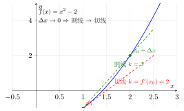
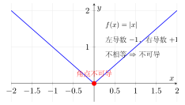

# 第7章 导数的概念

> **一例速记**：
> **导数定义**：$f'(x_0)=\lim_{h\to 0}\frac{f(x_0+h)-f(x_0)}{h}$（差商极限）。
> **几何意义**：切线斜率；**物理意义**：瞬时变化率。
> **可导 $\Rightarrow$ 连续**，但连续 $\not\Rightarrow$ 可导（$|x|$ 在 $x=0$ 是经典反例）。
> **核心公式**：$(x^n)'=nx^{n-1}$，$(e^x)'=e^x$，$(\ln x)'=\frac{1}{x}$，$(\sin x)'=\cos x$，$(\cos x)'=-\sin x$。

---

## 引入：一道"看似简单却陷阱满布"的切线题

> **题目**：曲线 $y = x^3 - x$ 在哪些点处的切线斜率为 $2$？写出这些切线方程。

请先停下来想一想：**"切线斜率"和"导数"是什么关系？** 很多同学第一反应是把 $y = 2$ 代入 $x^3 - x = 2$ 求解——这是把斜率当成函数值，犯了概念混淆。

正确路径：**切线斜率 = 导数值**，所以应该先求 $y'$，再令 $y' = 2$ 求 $x$。

---

## 思维路径还原（解题者的内心独白）

> "看到"切线斜率为 $2$"，立刻条件反射：**斜率 $k = f'(x_0)$**——不是 $f(x_0)$，也不是方程 $f = 2$。
>
> **第一步：求 $f'(x)$**。$y = x^3 - x$，逐项套幂函数法则：
> $$y' = 3x^2 - 1.$$
>
> **第二步：令 $y' = 2$**。解 $3x^2 - 1 = 2$，得 $x^2 = 1$，即 $x = \pm 1$。
>
> **第三步：求对应 $y$ 值**。$x=1$ 时 $y = 1-1 = 0$；$x=-1$ 时 $y=-1+1=0$。两个切点都在 $x$ 轴上！（这是个有趣的巧合，值得验证。）
>
> **第四步：写切线方程**。过 $(1, 0)$、斜率 $2$：$y - 0 = 2(x - 1)$，即 $y = 2x - 2$。过 $(-1, 0)$、斜率 $2$：$y = 2(x+1)$，即 $y = 2x+2$。
>
> **验证**：$y = 2x-2$ 与 $y = x^3-x$ 联立：$x^3-x=2x-2$，即 $x^3-3x+2=0$。分解 $(x-1)^2(x+2)=0$，$x=1$（切点，重根）与 $x=-2$（另一交点），符合"切线"定义的极限意义。✓
>
> 关键洞察：**"切线斜率 = 导数"是本章的核心桥梁**。不管题目如何包装，涉及斜率的计算一定先走"求导"这条路。"

---

## 学习目标

通过本章学习，你将能够：

- 从切线问题和瞬时速度问题理解导数的直观意义
- 掌握导数的极限定义，能用定义计算简单函数的导数
- 理解左导数与右导数的概念，判断函数在某点的可导性
- 掌握导数的几何意义（切线斜率）和物理意义（瞬时变化率）
- 理解可导与连续的关系，能举出连续但不可导的反例
- 熟记基本初等函数的导数公式

---

## 7.1 导数的定义

### 7.1.1 从切线问题引入

如何确定曲线 $y = f(x)$ 在点 $P(x_0, f(x_0))$ 处的切线？

古希腊数学家将切线定义为"与曲线只有一个交点的直线"，但这个定义并不总是正确。例如，$y = x^3$ 在原点的切线 $y = 0$ 与曲线有三个交点。

**现代定义**：切线是割线的极限位置。

设 $Q(x_0 + h, f(x_0 + h))$ 是曲线上靠近 $P$ 的另一点，则割线 $PQ$ 的斜率为：

$$k_{PQ} = \frac{f(x_0 + h) - f(x_0)}{h}$$

当 $Q$ 沿曲线趋近于 $P$（即 $h \to 0$）时，如果割线斜率趋于一个确定的极限值，这个极限值就是切线的斜率。

### 7.1.2 从瞬时速度引入

设质点沿直线运动，位置函数为 $s = s(t)$。在时间段 $[t_0, t_0 + \Delta t]$ 内，质点的**平均速度**为：

$$\bar{v} = \frac{s(t_0 + \Delta t) - s(t_0)}{\Delta t}$$

当 $\Delta t \to 0$ 时，平均速度的极限就是 $t_0$ 时刻的**瞬时速度**：

$$v(t_0) = \lim_{\Delta t \to 0} \frac{s(t_0 + \Delta t) - s(t_0)}{\Delta t}$$

这与切线斜率的计算形式完全一致。

### 7.1.3 导数的极限定义

上述两个问题引出了同一种极限形式，这就是导数的定义。

**定义**（导数）：设函数 $f(x)$ 在点 $x_0$ 的某邻域内有定义。如果极限

$$\lim_{h \to 0} \frac{f(x_0 + h) - f(x_0)}{h}$$

存在，则称 $f(x)$ 在点 $x_0$ 处**可导**，此极限值称为 $f(x)$ 在 $x_0$ 处的**导数**，记作

$$f'(x_0) \quad \text{或} \quad \frac{df}{dx}\bigg|_{x=x_0} \quad \text{或} \quad \left.\frac{dy}{dx}\right|_{x=x_0}$$

**等价形式**：令 $x = x_0 + h$，则 $h = x - x_0$，$h \to 0$ 等价于 $x \to x_0$。导数定义可写成：

$$f'(x_0) = \lim_{x \to x_0} \frac{f(x) - f(x_0)}{x - x_0}$$

比值 $\dfrac{f(x_0 + h) - f(x_0)}{h}$ 称为**差商**，$f(x_0 + h) - f(x_0)$ 称为函数的**增量**，$h$ 称为自变量的**增量**。

> **例题 7.1** 用导数定义求 $f(x) = x^2$ 在 $x = 3$ 处的导数。

**解**：

$$f'(3) = \lim_{h \to 0} \frac{f(3 + h) - f(3)}{h} = \lim_{h \to 0} \frac{(3+h)^2 - 9}{h}$$

$$= \lim_{h \to 0} \frac{9 + 6h + h^2 - 9}{h} = \lim_{h \to 0} \frac{6h + h^2}{h} = \lim_{h \to 0} (6 + h) = 6$$

因此 $f'(3) = 6$。

> **例题 7.2** 用导数定义求 $f(x) = \sqrt{x}$ 在 $x = x_0 > 0$ 处的导数。

**解**：

$$f'(x_0) = \lim_{h \to 0} \frac{\sqrt{x_0 + h} - \sqrt{x_0}}{h}$$

分子有理化：

$$= \lim_{h \to 0} \frac{(\sqrt{x_0 + h} - \sqrt{x_0})(\sqrt{x_0 + h} + \sqrt{x_0})}{h(\sqrt{x_0 + h} + \sqrt{x_0})}$$

$$= \lim_{h \to 0} \frac{(x_0 + h) - x_0}{h(\sqrt{x_0 + h} + \sqrt{x_0})} = \lim_{h \to 0} \frac{1}{\sqrt{x_0 + h} + \sqrt{x_0}}$$

$$= \frac{1}{2\sqrt{x_0}}$$

因此 $(\sqrt{x})'|_{x=x_0} = \dfrac{1}{2\sqrt{x_0}}$，即 $(\sqrt{x})' = \dfrac{1}{2\sqrt{x}}$。

### 7.1.4 左导数与右导数

类似于左极限与右极限，我们可以定义单侧导数。

**定义**：

- **左导数**：$f'_-(x_0) = \lim_{h \to 0^-} \dfrac{f(x_0 + h) - f(x_0)}{h}$

- **右导数**：$f'_+(x_0) = \lim_{h \to 0^+} \dfrac{f(x_0 + h) - f(x_0)}{h}$

**定理**：$f(x)$ 在 $x_0$ 处可导当且仅当左导数与右导数都存在且相等。

> **例题 7.3** 讨论 $f(x) = |x|$ 在 $x = 0$ 处的可导性。

**解**：

$$f'_+(0) = \lim_{h \to 0^+} \frac{|h| - 0}{h} = \lim_{h \to 0^+} \frac{h}{h} = 1$$

$$f'_-(0) = \lim_{h \to 0^-} \frac{|h| - 0}{h} = \lim_{h \to 0^-} \frac{-h}{h} = -1$$

由于 $f'_+(0) = 1 \neq -1 = f'_-(0)$，故 $f(x) = |x|$ 在 $x = 0$ 处**不可导**。

> **几何解释**：$y = |x|$ 的图像在原点有一个"尖角"，左右两侧的切线斜率不同。

---

## 7.2 导数的几何意义与物理意义

### 7.2.1 切线斜率

**几何意义**：$f'(x_0)$ 是曲线 $y = f(x)$ 在点 $(x_0, f(x_0))$ 处切线的斜率。

- 若 $f'(x_0) > 0$，切线向右上方倾斜
- 若 $f'(x_0) < 0$，切线向右下方倾斜
- 若 $f'(x_0) = 0$，切线是水平线

### 7.2.2 瞬时变化率

**物理意义**：$f'(x_0)$ 表示函数 $f(x)$ 在 $x_0$ 处的**瞬时变化率**。

导数描述了函数值相对于自变量变化的快慢程度：

- $|f'(x_0)|$ 越大，函数在该点变化越剧烈
- $|f'(x_0)|$ 越小，函数在该点变化越平缓
- $f'(x_0) = 0$ 时，函数在该点"瞬间静止"

**物理应用**：

| 原函数 | 导数的含义 |
|:---:|:---:|
| 位移 $s(t)$ | 速度 $v(t) = s'(t)$ |
| 速度 $v(t)$ | 加速度 $a(t) = v'(t)$ |
| 电量 $Q(t)$ | 电流 $I(t) = Q'(t)$ |
| 质量 $m(x)$ | 线密度 $\rho(x) = m'(x)$ |

### 7.2.3 切线方程与法线方程

**切线方程**：曲线 $y = f(x)$ 在点 $(x_0, y_0)$ 处的切线方程为：

$$y - y_0 = f'(x_0)(x - x_0)$$

**法线方程**：法线是过切点且与切线垂直的直线。当 $f'(x_0) \neq 0$ 时，法线方程为：

$$y - y_0 = -\frac{1}{f'(x_0)}(x - x_0)$$

> **例题 7.4** 求曲线 $y = x^3$ 在点 $(1, 1)$ 处的切线方程和法线方程。

**解**：$f(x) = x^3$，$f'(x) = 3x^2$（由幂函数求导公式），$f'(1) = 3$。

**切线方程**：$y - 1 = 3(x - 1)$，即 $y = 3x - 2$

**法线方程**：$y - 1 = -\dfrac{1}{3}(x - 1)$，即 $y = -\dfrac{1}{3}x + \dfrac{4}{3}$

> **例题 7.5** 求曲线 $y = e^x$ 上使切线过原点的点。

**解**：设切点为 $(a, e^a)$。由于 $(e^x)' = e^x$，切线斜率为 $e^a$。

切线方程：$y - e^a = e^a(x - a)$

切线过原点 $(0, 0)$：$0 - e^a = e^a(0 - a)$

$$-e^a = -ae^a \Rightarrow 1 = a$$

因此切点为 $(1, e)$，切线方程为 $y = ex$。

---

## 7.3 可导与连续的关系

### 7.3.1 可导必连续

**定理**：若 $f(x)$ 在 $x_0$ 处可导，则 $f(x)$ 在 $x_0$ 处连续。

**证明**：设 $f(x)$ 在 $x_0$ 处可导，则 $f'(x_0) = \lim_{x \to x_0} \dfrac{f(x) - f(x_0)}{x - x_0}$ 存在。

计算：

$$\lim_{x \to x_0} [f(x) - f(x_0)] = \lim_{x \to x_0} \frac{f(x) - f(x_0)}{x - x_0} \cdot (x - x_0)$$

$$= f'(x_0) \cdot 0 = 0$$

因此 $\lim_{x \to x_0} f(x) = f(x_0)$，即 $f(x)$ 在 $x_0$ 处连续。 $\square$

**逆否命题**：若 $f(x)$ 在 $x_0$ 处不连续，则 $f(x)$ 在 $x_0$ 处必不可导。

### 7.3.2 连续不一定可导

**反例 1**：$f(x) = |x|$

$f(x) = |x|$ 在 $x = 0$ 处连续（因为 $\lim_{x \to 0} |x| = 0 = f(0)$），但在 $x = 0$ 处不可导（左右导数不等）。

**反例 2**：$f(x) = x^{1/3}$

$f(x) = x^{1/3}$ 在 $x = 0$ 处连续。计算导数：

$$\lim_{h \to 0} \frac{h^{1/3} - 0}{h} = \lim_{h \to 0} \frac{1}{h^{2/3}} = +\infty$$

极限不存在（为无穷大），故 $f(x)$ 在 $x = 0$ 处不可导。

**几何解释**：$y = x^{1/3}$ 在原点有垂直切线，切线斜率无穷大。

**反例 3**：Weierstrass 函数（处处连续，处处不可导）

$$W(x) = \sum_{n=0}^{\infty} a^n \cos(b^n \pi x)$$

其中 $0 < a < 1$，$b$ 为正奇数，且 $ab > 1 + \dfrac{3\pi}{2}$。

这个函数在每一点都连续，但在每一点都不可导，说明连续性与可导性有本质区别。

**总结**：

| 关系 | 结论 |
|:---:|:---:|
| 可导 $\Rightarrow$ 连续 | 成立 |
| 连续 $\Rightarrow$ 可导 | 不成立 |
| 不连续 $\Rightarrow$ 不可导 | 成立 |
| 不可导 $\Rightarrow$ 不连续 | 不成立 |

---

## 7.4 基本初等函数的导数

### 7.4.1 常数函数的导数

**定理**：$(c)' = 0$，其中 $c$ 为常数。

**证明**：

$$\lim_{h \to 0} \frac{c - c}{h} = \lim_{h \to 0} 0 = 0 \quad \square$$

**几何解释**：常数函数的图像是水平直线，切线斜率处处为零。

### 7.4.2 幂函数的导数

**定理**：$(x^n)' = nx^{n-1}$，其中 $n$ 为实数。

**证明**（$n$ 为正整数时）：利用二项式定理，

$$(x + h)^n = x^n + nx^{n-1}h + \binom{n}{2}x^{n-2}h^2 + \cdots + h^n$$

因此：

$$\lim_{h \to 0} \frac{(x+h)^n - x^n}{h} = \lim_{h \to 0} \left[nx^{n-1} + \binom{n}{2}x^{n-2}h + \cdots + h^{n-1}\right] = nx^{n-1} \quad \square$$

**常用幂函数导数**：

- $(x)' = 1$
- $(x^2)' = 2x$
- $(x^3)' = 3x^2$
- $(\sqrt{x})' = (x^{1/2})' = \dfrac{1}{2}x^{-1/2} = \dfrac{1}{2\sqrt{x}}$
- $\left(\dfrac{1}{x}\right)' = (x^{-1})' = -x^{-2} = -\dfrac{1}{x^2}$

### 7.4.3 指数函数的导数

**定理**：$(e^x)' = e^x$

**证明**：

$$\lim_{h \to 0} \frac{e^{x+h} - e^x}{h} = e^x \lim_{h \to 0} \frac{e^h - 1}{h} = e^x \cdot 1 = e^x$$

（利用重要极限 $\lim_{h \to 0} \dfrac{e^h - 1}{h} = 1$） $\square$

**一般指数函数**：$(a^x)' = a^x \ln a$（$a > 0$，$a \neq 1$）

### 7.4.4 对数函数的导数

**定理**：$(\ln x)' = \dfrac{1}{x}$

**证明**：

$$\lim_{h \to 0} \frac{\ln(x+h) - \ln x}{h} = \lim_{h \to 0} \frac{1}{h} \ln\frac{x+h}{x} = \lim_{h \to 0} \frac{1}{h} \ln\left(1 + \frac{h}{x}\right)$$

令 $t = \dfrac{h}{x}$，则 $h = tx$，当 $h \to 0$ 时 $t \to 0$：

$$= \lim_{t \to 0} \frac{1}{tx} \ln(1 + t) = \frac{1}{x} \lim_{t \to 0} \frac{\ln(1+t)}{t} = \frac{1}{x} \cdot 1 = \frac{1}{x}$$

（利用重要极限 $\lim_{t \to 0} \dfrac{\ln(1+t)}{t} = 1$） $\square$

**一般对数函数**：$(\log_a x)' = \dfrac{1}{x \ln a}$

### 7.4.5 三角函数的导数

**定理**：

- $(\sin x)' = \cos x$
- $(\cos x)' = -\sin x$
- $(\tan x)' = \sec^2 x = \dfrac{1}{\cos^2 x}$
- $(\cot x)' = -\csc^2 x = -\dfrac{1}{\sin^2 x}$
- $(\sec x)' = \sec x \tan x$
- $(\csc x)' = -\csc x \cot x$

**证明**（正弦函数）：

$$(\sin x)' = \lim_{h \to 0} \frac{\sin(x+h) - \sin x}{h}$$

利用和差化积公式 $\sin A - \sin B = 2\cos\dfrac{A+B}{2}\sin\dfrac{A-B}{2}$：

$$= \lim_{h \to 0} \frac{2\cos(x + \frac{h}{2})\sin\frac{h}{2}}{h} = \lim_{h \to 0} \cos\left(x + \frac{h}{2}\right) \cdot \frac{\sin\frac{h}{2}}{\frac{h}{2}}$$

$$= \cos x \cdot 1 = \cos x \quad \square$$

### 7.4.6 反三角函数的导数

**定理**：

- $(\arcsin x)' = \dfrac{1}{\sqrt{1-x^2}}$，$|x| < 1$
- $(\arccos x)' = -\dfrac{1}{\sqrt{1-x^2}}$，$|x| < 1$
- $(\arctan x)' = \dfrac{1}{1+x^2}$
- $(\text{arccot}\, x)' = -\dfrac{1}{1+x^2}$

### 7.4.7 导数公式表

| 函数 $f(x)$ | 导数 $f'(x)$ |
|:---:|:---:|
| $c$（常数） | $0$ |
| $x^n$ | $nx^{n-1}$ |
| $e^x$ | $e^x$ |
| $a^x$ | $a^x \ln a$ |
| $\ln x$ | $\dfrac{1}{x}$ |
| $\log_a x$ | $\dfrac{1}{x \ln a}$ |
| $\sin x$ | $\cos x$ |
| $\cos x$ | $-\sin x$ |
| $\tan x$ | $\sec^2 x$ |
| $\cot x$ | $-\csc^2 x$ |
| $\arcsin x$ | $\dfrac{1}{\sqrt{1-x^2}}$ |
| $\arccos x$ | $-\dfrac{1}{\sqrt{1-x^2}}$ |
| $\arctan x$ | $\dfrac{1}{1+x^2}$ |

---

## 7.5 常用导数公式的完整推导

本节把所有"基本初等函数 + 四则运算 + 复合 + 反函数"的导数公式按照**依赖关系**逐条推出，避免循环论证。整体结构是：

1. 先证四则运算法则（基于差商）；
2. 再证复合法则与反函数法则（基于差商 + 连续性）；
3. 由极限定义证 $(x^n)'$（正整数 $n$）、$(\sin x)'$、$(\cos x)'$、$(e^x)'$、$(\ln x)'$；
4. 由这五条核心 + 法则推出其余所有公式。

> **使用的重要极限**：
> $$
> \lim_{x\to 0}\frac{\sin x}{x}=1,\quad
> \lim_{x\to 0}\frac{1-\cos x}{x}=0,
> $$
> $$
> \lim_{x\to 0}\frac{e^x-1}{x}=1,\quad
> \lim_{x\to 0}\frac{\ln(1+x)}{x}=1.
> $$
> 这四个极限将在第 5 章证明，此处直接使用。

### 7.5.1 求导法则的推导

**法则 1（线性性）**：若 $f,g$ 在 $x$ 可导，$\alpha,\beta\in\mathbb R$，则

$$
(\alpha f+\beta g)'(x)=\alpha f'(x)+\beta g'(x).
$$

**证明**：由差商极限的线性性，

$$
\begin{aligned}
\lim_{h\to 0}\frac{[\alpha f(x+h)+\beta g(x+h)]-[\alpha f(x)+\beta g(x)]}{h}
&=\alpha\lim_{h\to 0}\frac{f(x+h)-f(x)}{h}+\beta\lim_{h\to 0}\frac{g(x+h)-g(x)}{h}\\
&=\alpha f'(x)+\beta g'(x).\ \square
\end{aligned}
$$

**法则 2（乘法法则 / Leibniz 法则）**：

$$
(fg)'(x)=f'(x)g(x)+f(x)g'(x).
$$

**证明**：在分子加减 $f(x+h)g(x)$，

$$
\begin{aligned}
\frac{f(x+h)g(x+h)-f(x)g(x)}{h}
&=\frac{f(x+h)-f(x)}{h}\,g(x+h)+f(x)\,\frac{g(x+h)-g(x)}{h}.
\end{aligned}
$$

因为 $g$ 在 $x$ 可导故连续，$g(x+h)\to g(x)$。令 $h\to 0$ 得 $f'(x)g(x)+f(x)g'(x)$。 $\square$

**法则 3（除法法则）**：若 $g(x)\ne 0$，

$$
\left(\frac{f}{g}\right)'(x)=\frac{f'(x)g(x)-f(x)g'(x)}{g(x)^2}.
$$

**证明**：先证 $\left(\dfrac1g\right)'=-\dfrac{g'}{g^2}$。

$$
\frac{1}{h}\left[\frac{1}{g(x+h)}-\frac{1}{g(x)}\right]
=\frac{g(x)-g(x+h)}{h\,g(x+h)g(x)}
\xrightarrow{h\to 0}\frac{-g'(x)}{g(x)^2}.
$$

再用乘法法则：$\left(\dfrac{f}{g}\right)'=\left(f\cdot\dfrac1g\right)'=f'\cdot\dfrac1g+f\cdot\left(-\dfrac{g'}{g^2}\right)=\dfrac{f'g-fg'}{g^2}$。 $\square$

**法则 4（链式法则）**：若 $u=g(x)$ 在 $x$ 可导，$y=f(u)$ 在 $u=g(x)$ 可导，则

$$
\bigl(f\circ g\bigr)'(x)=f'\!\bigl(g(x)\bigr)\cdot g'(x).
$$

**证明**（标准 Carathéodory 形式以避免 $g(x+h)=g(x)$ 时分母为零的问题）：

由 $f$ 在 $u_0=g(x)$ 可导，存在在 $u_0$ 连续的函数 $\varphi$ 使

$$
f(u)-f(u_0)=\varphi(u)(u-u_0),\qquad \varphi(u_0)=f'(u_0).
$$

代入 $u=g(x+h)$、$u_0=g(x)$：

$$
\frac{f(g(x+h))-f(g(x))}{h}=\varphi(g(x+h))\cdot\frac{g(x+h)-g(x)}{h}.
$$

由 $g$ 可导（故连续）与 $\varphi$ 在 $u_0$ 连续，令 $h\to 0$ 得 $f'(g(x))\cdot g'(x)$。 $\square$

**法则 5（反函数法则）**：设 $y=f(x)$ 在 $x_0$ 可导且 $f'(x_0)\ne 0$，$f$ 在 $x_0$ 邻域严格单调连续。记 $x=f^{-1}(y)$，则

$$
\bigl(f^{-1}\bigr)'(y_0)=\frac{1}{f'(x_0)},\qquad y_0=f(x_0).
$$

**证明**：由严格单调连续，$y\ne y_0\Leftrightarrow x\ne x_0$ 且 $y\to y_0\Leftrightarrow x\to x_0$。于是

$$
\lim_{y\to y_0}\frac{f^{-1}(y)-f^{-1}(y_0)}{y-y_0}
=\lim_{x\to x_0}\frac{x-x_0}{f(x)-f(x_0)}
=\frac{1}{f'(x_0)}.\ \square
$$

### 7.5.2 幂函数 $(x^n)'$

**推导一（正整数 $n$，二项式定理）**：

$$
(x+h)^n=\sum_{k=0}^n\binom{n}{k}x^{n-k}h^k=x^n+nx^{n-1}h+\binom{n}{2}x^{n-2}h^2+\cdots+h^n.
$$

所以

$$
\frac{(x+h)^n-x^n}{h}=nx^{n-1}+\binom{n}{2}x^{n-2}h+\cdots+h^{n-1}\xrightarrow{h\to 0}nx^{n-1}.
$$

**推导二（负整数 $n=-m$，$m>0$）**：用除法法则于 $\dfrac{1}{x^m}$：

$$
\left(\frac{1}{x^m}\right)'=\frac{0\cdot x^m-1\cdot mx^{m-1}}{x^{2m}}=-mx^{-m-1}=nx^{n-1}.
$$

**推导三（有理数 $n=p/q$，$q\in\mathbb Z^+$，$x>0$）**：令 $y=x^{p/q}$，则 $y^q=x^p$。两边对 $x$ 求导（隐函数 + 链式法则）：

$$
qy^{q-1}\,y'=px^{p-1}
\Rightarrow y'=\frac{p}{q}\,\frac{x^{p-1}}{y^{q-1}}=\frac{p}{q}\,x^{p-1-\frac{p}{q}(q-1)}=\frac{p}{q}x^{p/q-1}=nx^{n-1}.
$$

**推导四（实数 $n\in\mathbb R$，$x>0$）**：写 $x^n=e^{n\ln x}$，由链式法则与后面 7.5.4、7.5.5：

$$
(x^n)'=e^{n\ln x}\cdot\frac{n}{x}=x^n\cdot\frac{n}{x}=nx^{n-1}.\ \square
$$

**特例**：

- $(x)'=1$；
- $(\sqrt x)'=\tfrac12 x^{-1/2}=\dfrac{1}{2\sqrt x}$；
- $\bigl(\tfrac1x\bigr)'=-x^{-2}=-\dfrac{1}{x^2}$。

### 7.5.3 三角函数

**$\sin x$ 与 $\cos x$**：由和差化积，

$$
\sin(x+h)-\sin x=2\cos\!\left(x+\tfrac{h}{2}\right)\sin\tfrac{h}{2}.
$$

所以

$$
\frac{\sin(x+h)-\sin x}{h}=\cos\!\left(x+\tfrac{h}{2}\right)\cdot\frac{\sin(h/2)}{h/2}\xrightarrow{h\to 0}\cos x\cdot 1=\cos x.
$$

类似地用 $\cos(x+h)-\cos x=-2\sin\!\left(x+\tfrac{h}{2}\right)\sin\tfrac{h}{2}$ 得 $(\cos x)'=-\sin x$。

**或者直接用和角公式**：

$$
\frac{\sin(x+h)-\sin x}{h}=\sin x\cdot\frac{\cos h-1}{h}+\cos x\cdot\frac{\sin h}{h}\to \sin x\cdot 0+\cos x\cdot 1=\cos x.
$$

**$\tan x$**：用除法法则，

$$
(\tan x)'=\left(\frac{\sin x}{\cos x}\right)'=\frac{\cos x\cdot\cos x-\sin x\cdot(-\sin x)}{\cos^2 x}=\frac{1}{\cos^2 x}=\sec^2 x.
$$

**$\cot x$**：

$$
(\cot x)'=\left(\frac{\cos x}{\sin x}\right)'=\frac{-\sin^2 x-\cos^2 x}{\sin^2 x}=-\frac{1}{\sin^2 x}=-\csc^2 x.
$$

**$\sec x$**：$\sec x=\dfrac{1}{\cos x}$，

$$
(\sec x)'=\left(\frac{1}{\cos x}\right)'=\frac{\sin x}{\cos^2 x}=\sec x\tan x.
$$

**$\csc x$**：

$$
(\csc x)'=\left(\frac{1}{\sin x}\right)'=-\frac{\cos x}{\sin^2 x}=-\csc x\cot x.
$$

### 7.5.4 指数函数

**$(e^x)'$**：

$$
\frac{e^{x+h}-e^x}{h}=e^x\cdot\frac{e^h-1}{h}\xrightarrow{h\to 0}e^x\cdot 1=e^x.
$$

**$(a^x)'$**（$a>0,\ a\ne 1$）：$a^x=e^{x\ln a}$，由链式法则

$$
(a^x)'=e^{x\ln a}\cdot\ln a=a^x\ln a.
$$

### 7.5.5 对数函数

**$(\ln x)'$**（$x>0$）：

$$
\frac{\ln(x+h)-\ln x}{h}=\frac{1}{h}\ln\!\left(1+\frac{h}{x}\right).
$$

令 $t=h/x$，

$$
=\frac{1}{x}\cdot\frac{\ln(1+t)}{t}\xrightarrow{t\to 0}\frac{1}{x}\cdot 1=\frac{1}{x}.
$$

**$(\log_a x)'$**：由换底 $\log_a x=\dfrac{\ln x}{\ln a}$，

$$
(\log_a x)'=\frac{1}{x\ln a}.
$$

**$(\ln|x|)'=\dfrac{1}{x}$**（$x\ne 0$）：$x<0$ 时用 $\ln|x|=\ln(-x)$ 并由链式法则 $(\ln(-x))'=\dfrac{-1}{-x}=\dfrac{1}{x}$。

### 7.5.6 反三角函数

**$(\arcsin x)'$**（$|x|<1$）：设 $y=\arcsin x$，则 $\sin y=x$，$y\in[-\tfrac\pi2,\tfrac\pi2]$。两边对 $x$ 求导：

$$
\cos y\cdot y'=1\Rightarrow y'=\frac{1}{\cos y}.
$$

由于 $y\in[-\tfrac\pi2,\tfrac\pi2]$ 有 $\cos y\ge 0$，所以 $\cos y=\sqrt{1-\sin^2 y}=\sqrt{1-x^2}$。故

$$
(\arcsin x)'=\frac{1}{\sqrt{1-x^2}}.
$$

**$(\arccos x)'$**：由 $\arcsin x+\arccos x=\dfrac\pi2$ 直接得

$$
(\arccos x)'=-\frac{1}{\sqrt{1-x^2}}.
$$

**$(\arctan x)'$**：设 $y=\arctan x$，则 $\tan y=x$，$y\in(-\tfrac\pi2,\tfrac\pi2)$。两边求导：

$$
\sec^2 y\cdot y'=1\Rightarrow y'=\frac{1}{\sec^2 y}=\frac{1}{1+\tan^2 y}=\frac{1}{1+x^2}.
$$

**$(\operatorname{arccot} x)'$**：由 $\arctan x+\operatorname{arccot}x=\dfrac\pi2$ 得 $-\dfrac{1}{1+x^2}$。

**$(\operatorname{arcsec}x)'$**（$|x|>1$）：设 $y=\operatorname{arcsec}x$，$\sec y=x$，

$$
\sec y\tan y\cdot y'=1\Rightarrow y'=\frac{1}{\sec y\tan y}=\frac{1}{|x|\sqrt{x^2-1}}.
$$

绝对值的出现是因为主值约定下 $\sec y\tan y$ 总取正号。

### 7.5.7 双曲函数与反双曲函数

由 $\sinh x=\dfrac{e^x-e^{-x}}{2}$、$\cosh x=\dfrac{e^x+e^{-x}}{2}$ 直接求导：

$$
(\sinh x)'=\frac{e^x+e^{-x}}{2}=\cosh x,
\qquad
(\cosh x)'=\frac{e^x-e^{-x}}{2}=\sinh x.
$$

$$
(\tanh x)'=\left(\frac{\sinh x}{\cosh x}\right)'=\frac{\cosh^2 x-\sinh^2 x}{\cosh^2 x}=\frac{1}{\cosh^2 x}=\operatorname{sech}^2 x=1-\tanh^2 x.
$$

反双曲函数（用反函数法则，过程同反三角）：

$$
(\operatorname{arsinh}x)'=\frac{1}{\sqrt{1+x^2}},
\quad
(\operatorname{arcosh}x)'=\frac{1}{\sqrt{x^2-1}}\ (x>1),
\quad
(\operatorname{artanh}x)'=\frac{1}{1-x^2}\ (|x|<1).
$$

### 7.5.8 对数求导法与一般幂指函数

对 $y=f(x)^{g(x)}$（$f>0$），两边取对数 $\ln y=g(x)\ln f(x)$，对 $x$ 求导：

$$
\frac{y'}{y}=g'(x)\ln f(x)+g(x)\frac{f'(x)}{f(x)},
$$

所以

$$
\bigl(f^g\bigr)'=f(x)^{g(x)}\!\left[g'(x)\ln f(x)+\frac{g(x)f'(x)}{f(x)}\right].
$$

**特例**：

- $g$ 是常数：退化为 $(f^n)'=nf^{n-1}f'$（广义幂法则）；
- $f$ 是常数：退化为 $(a^{g(x)})'=a^{g(x)}\ln a\cdot g'(x)$；
- $f=g=x$：$(x^x)'=x^x(\ln x+1)$。

### 7.5.9 完整公式表（含基础导数）

下表把上述所有推导汇总，按"输入函数 → 导数 → 适用条件"组织，可作为后续章节的查阅参考。

| 函数 | 导数 | 条件 |
|:---:|:---:|:---:|
| $c$ | $0$ | $c$ 为常数 |
| $x^n$ | $nx^{n-1}$ | $n\in\mathbb R$（$x>0$ 时对所有实数 $n$ 成立） |
| $e^x$ | $e^x$ | — |
| $a^x$ | $a^x\ln a$ | $a>0,\ a\ne 1$ |
| $\ln x$ | $\dfrac{1}{x}$ | $x>0$ |
| $\ln\|x\|$ | $\dfrac{1}{x}$ | $x\ne 0$ |
| $\log_a x$ | $\dfrac{1}{x\ln a}$ | $x>0$ |
| $\sin x$ | $\cos x$ | — |
| $\cos x$ | $-\sin x$ | — |
| $\tan x$ | $\sec^2 x$ | $\cos x\ne 0$ |
| $\cot x$ | $-\csc^2 x$ | $\sin x\ne 0$ |
| $\sec x$ | $\sec x\tan x$ | $\cos x\ne 0$ |
| $\csc x$ | $-\csc x\cot x$ | $\sin x\ne 0$ |
| $\arcsin x$ | $\dfrac{1}{\sqrt{1-x^2}}$ | $\|x\|<1$ |
| $\arccos x$ | $-\dfrac{1}{\sqrt{1-x^2}}$ | $\|x\|<1$ |
| $\arctan x$ | $\dfrac{1}{1+x^2}$ | — |
| $\operatorname{arccot}x$ | $-\dfrac{1}{1+x^2}$ | — |
| $\operatorname{arcsec}x$ | $\dfrac{1}{\|x\|\sqrt{x^2-1}}$ | $\|x\|>1$ |
| $\sinh x$ | $\cosh x$ | — |
| $\cosh x$ | $\sinh x$ | — |
| $\tanh x$ | $1-\tanh^2 x$ | — |
| $\operatorname{arsinh}x$ | $\dfrac{1}{\sqrt{1+x^2}}$ | — |
| $\operatorname{arcosh}x$ | $\dfrac{1}{\sqrt{x^2-1}}$ | $x>1$ |
| $\operatorname{artanh}x$ | $\dfrac{1}{1-x^2}$ | $\|x\|<1$ |
| $f(x)^{g(x)}$ | $f^g\!\left[g'\ln f+\dfrac{gf'}{f}\right]$ | $f>0$ |

---

## 本章小结

1. **导数的定义**：$f'(x_0) = \lim_{h \to 0} \dfrac{f(x_0+h) - f(x_0)}{h}$。导数是差商的极限，体现了函数在一点的瞬时变化率。

2. **导数的几何意义**：$f'(x_0)$ 是曲线 $y = f(x)$ 在点 $(x_0, f(x_0))$ 处切线的斜率。切线方程为 $y - f(x_0) = f'(x_0)(x - x_0)$。

3. **导数的物理意义**：$f'(x_0)$ 表示函数在 $x_0$ 处的瞬时变化率。速度是位移对时间的导数，加速度是速度对时间的导数。

4. **可导与连续的关系**：
   - 可导必连续（可导是比连续更强的条件）
   - 连续不一定可导（反例：$|x|$ 在 $x=0$ 处连续但不可导）

5. **基本初等函数的导数**：熟记导数公式表是学习求导法则的基础。特别重要的是：
   - $(x^n)' = nx^{n-1}$
   - $(e^x)' = e^x$
   - $(\ln x)' = \dfrac{1}{x}$
   - $(\sin x)' = \cos x$，$(\cos x)' = -\sin x$

---

## 深度学习应用

导数不仅是数学工具，更是现代深度学习的核心基础。本节通过导数视角理解神经网络训练的数学本质。

### 梯度的意义

对于多元函数 $L(\theta)$（如神经网络的损失函数），**梯度** $\nabla L(\theta)$ 是各偏导数组成的向量：

$$\nabla L(\theta) = \left(\frac{\partial L}{\partial \theta_1},\ \frac{\partial L}{\partial \theta_2},\ \ldots,\ \frac{\partial L}{\partial \theta_n}\right)$$

梯度有两个关键性质：

- **梯度方向**是函数增长最快的方向
- **负梯度方向**是函数下降最快的方向，即损失减小最快的方向

**梯度下降算法**正是沿负梯度方向迭代更新参数：

$$\theta_{n+1} = \theta_n - \eta \nabla L(\theta_n)$$

其中 $\eta > 0$ 为**学习率**，控制每次更新的步长。学习率过大可能导致震荡，过小则收敛缓慢。

### 反向传播的数学基础

神经网络由多个函数复合而成。设 $y = g(x)$，$L = f(y)$，则由**链式法则**：

$$\frac{\partial L}{\partial x} = \frac{\partial L}{\partial y} \cdot \frac{\partial y}{\partial x}$$

**反向传播**（Backpropagation）本质上就是对计算图逐层应用链式法则：

- **前向传播**：输入 $\to$ 逐层计算输出，得到损失值 $L$
- **反向传播**：从 $L$ 出发，反向逐层计算各参数的偏导数（局部梯度）

计算图中每个节点只需存储其局部梯度 $\dfrac{\partial y}{\partial x}$，反向传播时将上游梯度 $\dfrac{\partial L}{\partial y}$ 乘以局部梯度，即得下游梯度 $\dfrac{\partial L}{\partial x}$。

### 导数与模型训练

**可导性是使用梯度下降的前提**。若损失函数在某点不可导，标准梯度下降失效。实践中的处理方式：

- **ReLU 激活函数** $f(x) = \max(0, x)$ 在 $x = 0$ 处不可导，通常约定该点导数为 $0$
- 对于一般的不可导点，使用**次梯度**（Subgradient）替代导数，次梯度是该点所有切线斜率的集合中任取一个值

函数是否可导直接影响优化器的选择和训练稳定性，这也是为何深度学习中激活函数的设计需要兼顾非线性表达能力与可微性。

### 代码示例：手动实现梯度下降

以下示例用 PyTorch 演示如何利用导数（自动微分）实现梯度下降，最小化 $f(x) = x^2$（最优解为 $x = 0$）：

```python
import torch

# 手动梯度下降示例
def gradient_descent_demo():
    # 目标：最小化 f(x) = x^2
    x = torch.tensor([5.0], requires_grad=True)
    lr = 0.1

    for i in range(20):
        # 前向传播
        loss = x ** 2

        # 计算梯度 (导数)
        loss.backward()

        # 梯度下降更新
        with torch.no_grad():
            x -= lr * x.grad  # x_new = x - η * f'(x)
            x.grad.zero_()

        if i % 5 == 0:
            print(f"Step {i}: x = {x.item():.4f}, f(x) = {(x**2).item():.4f}")

gradient_descent_demo()
```

**运行结果**（$x$ 从 $5.0$ 逐步收敛到 $0$）：

```
Step 0:  x = 4.0000, f(x) = 16.0000
Step 5:  x = 2.0972, f(x) =  4.3982
Step 10: x = 1.1053, f(x) =  1.2217
Step 15: x = 0.5822, f(x) =  0.3389
```

每次更新时，`loss.backward()` 自动计算 $\dfrac{d(x^2)}{dx} = 2x$，对应本章所学的幂函数求导公式 $(x^2)' = 2x$。梯度下降沿 $-2x$ 方向更新参数，使损失持续减小。

---

## 练习题

**1.** ⭐ 用导数定义求下列函数在指定点的导数：
   (a) $f(x) = x^2 - 3x$ 在 $x = 2$ 处
   (b) $f(x) = \dfrac{1}{x}$ 在 $x = 1$ 处

**2.** ⭐ 讨论下列函数在 $x = 0$ 处的可导性：
   (a) $f(x) = x|x|$
   (b) $f(x) = \begin{cases} x^2, & x \geq 0 \\ -x^2, & x < 0 \end{cases}$

**3.** ⭐ 求曲线 $y = \ln x$ 在点 $(e, 1)$ 处的切线方程和法线方程。

**4.** ⭐⭐ 设 $f(x)$ 在 $x = 1$ 处可导，且 $\lim_{h \to 0} \dfrac{f(1+2h) - f(1)}{h} = 4$，求 $f'(1)$。

**5.** ⭐⭐ 设 $f(x) = \begin{cases} x^2 \sin\dfrac{1}{x}, & x \neq 0 \\ 0, & x = 0 \end{cases}$，证明 $f(x)$ 在 $x = 0$ 处可导，并求 $f'(0)$。

**6.** ⭐⭐ 讨论函数 $f(x)=|x|$ 在 $x=0$ 处的可导性。

**7.** ⭐⭐⭐ 用导数定义证明：函数 $f(x)=x^3$ 在任意点 $x=a$ 处的导数为 $f'(a)=3a^2$。

**8.** ⭐⭐⭐ 在梯度检查中，常用中心差分
$$
\frac{L(w+h)-L(w-h)}{2h}
$$
近似 $L'(w)$。对损失函数 $L(w)=w^2$，证明该中心差分在任意 $w$ 处都恰好等于真导数。

---

## 练习答案

<details>
<summary>点击展开答案</summary>

**1.**
(a) $f(x) = x^2 - 3x$

$$f'(2) = \lim_{h \to 0} \frac{[(2+h)^2 - 3(2+h)] - [4 - 6]}{h} = \lim_{h \to 0} \frac{(4 + 4h + h^2 - 6 - 3h) - (-2)}{h}$$

$$= \lim_{h \to 0} \frac{h^2 + h}{h} = \lim_{h \to 0} (h + 1) = 1$$

因此 $f'(2) = 1$。

(b) $f(x) = \dfrac{1}{x}$

$$f'(1) = \lim_{h \to 0} \frac{\frac{1}{1+h} - 1}{h} = \lim_{h \to 0} \frac{1 - (1+h)}{h(1+h)} = \lim_{h \to 0} \frac{-1}{1+h} = -1$$

因此 $f'(1) = -1$。

---

**2.**
(a) $f(x) = x|x| = \begin{cases} x^2, & x \geq 0 \\ -x^2, & x < 0 \end{cases}$

$$f'_+(0) = \lim_{h \to 0^+} \frac{h^2 - 0}{h} = \lim_{h \to 0^+} h = 0$$

$$f'_-(0) = \lim_{h \to 0^-} \frac{-h^2 - 0}{h} = \lim_{h \to 0^-} (-h) = 0$$

左右导数都等于 $0$，故 $f(x)$ 在 $x = 0$ 处**可导**，$f'(0) = 0$。

(b) 与 (a) 相同的函数，结论相同：在 $x = 0$ 处可导，$f'(0) = 0$。

---

**3.** $f(x) = \ln x$，$f'(x) = \dfrac{1}{x}$，$f'(e) = \dfrac{1}{e}$。

**切线方程**：$y - 1 = \dfrac{1}{e}(x - e)$，即 $y = \dfrac{x}{e}$，或 $x - ey = 0$。

**法线方程**：$y - 1 = -e(x - e)$，即 $y = -ex + e^2 + 1$。

---

**4.** 由于

$$\lim_{h \to 0} \frac{f(1+2h) - f(1)}{h} = \lim_{h \to 0} \frac{f(1+2h) - f(1)}{2h} \cdot 2 = 2f'(1) = 4$$

因此 $f'(1) = 2$。

---

**5.** 计算 $f'(0)$：

$$f'(0) = \lim_{h \to 0} \frac{f(h) - f(0)}{h} = \lim_{h \to 0} \frac{h^2 \sin\frac{1}{h}}{h} = \lim_{h \to 0} h \sin\frac{1}{h}$$

由于 $\left|h \sin\dfrac{1}{h}\right| \leq |h| \to 0$，由夹逼定理：

$$\lim_{h \to 0} h \sin\frac{1}{h} = 0$$

因此 $f(x)$ 在 $x = 0$ 处可导，且 $f'(0) = 0$。 $\square$

---

**6.** 计算左右导数：

$$
f'_+(0)=\lim_{h\to 0^+}\frac{|h|-0}{h}=1,
$$

$$
f'_-(0)=\lim_{h\to 0^-}\frac{|h|-0}{h}=-1.
$$

由于左右导数不相等，所以 $f(x)=|x|$ 在 $x=0$ 处不可导。

---

**7.** 由导数定义，
$$
f'(a)=\lim_{h\to 0}\frac{(a+h)^3-a^3}{h}.
$$

展开：
$$
(a+h)^3=a^3+3a^2h+3ah^2+h^3.
$$

因此
$$
f'(a)=\lim_{h\to 0}\frac{3a^2h+3ah^2+h^3}{h}
=\lim_{h\to 0}(3a^2+3ah+h^2)=3a^2.
$$

故 $f(x)=x^3$ 在任意点 $a$ 处可导，且
$$
f'(a)=3a^2.
$$

---

**8.** 对 $L(w)=w^2$，中心差分为
$$
\frac{L(w+h)-L(w-h)}{2h}
=\frac{(w+h)^2-(w-h)^2}{2h}.
$$

展开：
$$
(w+h)^2=w^2+2wh+h^2,\qquad (w-h)^2=w^2-2wh+h^2.
$$

相减得
$$
(w+h)^2-(w-h)^2=4wh.
$$

于是
$$
\frac{L(w+h)-L(w-h)}{2h}
=\frac{4wh}{2h}=2w.
$$

而真导数为
$$
L'(w)=(w^2)'=2w.
$$

所以中心差分在任意 $w$ 处都与真导数完全一致。这也是数值梯度检查在二次损失附近特别稳定的原因。 $\square$

</details>


## 几何示意





---

## 思考路标（条件反射）

- 看到"导数定义" → $f'(x_0)=\lim_{\Delta x\to 0}\frac{f(x_0+\Delta x)-f(x_0)}{\Delta x}$
- 看到"切线斜率" → $k=f'(x_0)$
- 看到"瞬时变化率 / 速度 / 加速度" → 导数 / 二阶导
- 看到 $|f(x)|$ 在 $f(x_0)=0$ 处 → 检查左右导数是否相等
- 看到分段函数边界点 → 用左右导数定义验证
- 看到"光滑曲线" → 处处可导（甚至 $C^k$ 或 $C^\infty$）
- 看到"高阶导" → 一阶一阶反复求
- 看到 ML 中"梯度" → 多元情形的导数向量（详见 Part 6）

## 易错点

1. **可导必连续，连续不必可导**：$|x|$ 在 0 连续但不可导（角点）。
2. **左右导数都存在且相等 ⇔ 可导**：分段函数处必须验证。
3. **导数是局部性质**：$f'(x_0)$ 只看 $x_0$ 附近，与远处无关。
4. **"导数为 0"≠"极值点"**：$y=x^3$ 在 $x=0$ 处 $f'=0$ 但不是极值（鞍点）。
5. **$\frac{dy}{dx}$ 不是分数**：但在某些情形下可像分数般使用（链式法则、微分）—— 这是 Leibniz 记号的便利与陷阱。

---

## 抽象成方法（套路总结）

### 导数概念 5 大核心公式速查

| 名称 | 公式 / 结论 | 使用场景 |
|---|---|---|
| **导数定义** | $f'(x_0)=\lim_{h\to 0}\frac{f(x_0+h)-f(x_0)}{h}$ | 定义法求导、验证可导性 |
| **等价形式** | $f'(x_0)=\lim_{x\to x_0}\frac{f(x)-f(x_0)}{x-x_0}$ | 换元后更清晰的情形 |
| **切线方程** | $y - f(x_0) = f'(x_0)(x - x_0)$ | 几何意义 → 写方程 |
| **法线方程** | $y - f(x_0) = -\frac{1}{f'(x_0)}(x - x_0)$ | $f'(x_0)\ne 0$ 时垂直切线 |
| **可导 $\Rightarrow$ 连续** | $\lim_{x\to x_0}f(x)=f(x_0)$ | 反驳"连续 $\Rightarrow$ 可导" |

### 解题标准 4 步流程（导数概念题）

1. **判断是否可导**：先看定义域，分段点用左右导数定义各算一次，比较是否相等。
2. **用定义求导**（若题目要求"由定义"）：写差商 $\frac{f(x_0+h)-f(x_0)}{h}$，化简后令 $h\to 0$。
3. **求切线 / 法线**：导数值即斜率，代入点斜式写方程。
4. **检验可导必连续**：反例路线——先验连续（$\lim f(x) = f(x_0)$），再算左右导数（左 $\ne$ 右 → 不可导）。

### 常用初等函数导数速查（本章重点）

| 函数 | 导数 | 记忆口诀 |
|---|---|---|
| $x^n$ | $nx^{n-1}$ | 指数下移，幂减一 |
| $e^x$ | $e^x$ | 自身不变 |
| $\ln x$ | $\frac{1}{x}$ | 对数变倒数 |
| $\sin x$ | $\cos x$ | 正弦变余弦 |
| $\cos x$ | $-\sin x$ | 余弦变负正弦 |
| $\arctan x$ | $\frac{1}{1+x^2}$ | 反正切变有理式 |

---

## 方法变形

### 变形 1：差商极限形式识别

题目可能不直接写 $f'(x_0)$，而是写成：
$$\lim_{x\to a}\frac{f(x)-f(a)}{x-a},\quad \lim_{h\to 0}\frac{f(a+2h)-f(a)}{h},\quad \lim_{n\to\infty}n\!\left[f\!\left(a+\frac{1}{n}\right)-f(a)\right]$$

标准处理：凑成 $\frac{f(a+\Delta)-f(a)}{\Delta}$ 的形式，辨识 $\Delta$ 是什么，再换算系数：$\frac{f(a+2h)-f(a)}{h} = 2\cdot\frac{f(a+2h)-f(a)}{2h} \to 2f'(a)$。

### 变形 2：分段函数在分界点的可导性

在分界点 $x_0$ 处，必须用**左右导数定义**（不能用求导法则），逐侧计算差商极限，再判断是否相等。**高频陷阱**：连续是可导的必要条件，先验连续再验导数。

### 变形 3：含绝对值函数

$|g(x)|$ 在 $g(x_0)=0$ 处通常不可导（角点），但 $g(x_0)\ne 0$ 时可直接用 $|g|' = \frac{g}{|g|}\cdot g'$。验证 $g(x_0)=0$ 处用左右差商。

### 变形 4：高阶导数的归纳

对 $(e^x)', (\sin x)', (\cos x)'$ 等反复求导找规律；对 $(x^n)'$ 用数学归纳；对乘积高阶导用 Leibniz 公式（下一章详述）。

---

## 典型应用例题

### 例 1：用定义求导 + 切线方程

> **题目**：设 $f(x) = \sqrt{2x+1}$，用导数定义求 $f'(4)$，并写出曲线在 $(4, 3)$ 处的切线方程。

【思路】差商有理化消根号，再代点。

【解】差商
$$\frac{f(4+h)-f(4)}{h}=\frac{\sqrt{2(4+h)+1}-3}{h}=\frac{\sqrt{2h+9}-3}{h}$$

有理化：
$$=\frac{(2h+9)-9}{h(\sqrt{2h+9}+3)}=\frac{2}{\sqrt{2h+9}+3}\xrightarrow{h\to 0}\frac{2}{3+3}=\frac{1}{3}$$

故 $f'(4)=\dfrac{1}{3}$。切线方程：$y-3=\dfrac{1}{3}(x-4)$，即 $\boxed{y=\dfrac{x}{3}+\dfrac{5}{3}}$。

【注】有理化是 $\sqrt{\cdot}$ 型导数计算的标准操作，不做有理化差商分母含根号无法化简。

### 例 2：分段函数可导性

> **题目**：$f(x) = \begin{cases} x^2\sin\frac{1}{x}, & x\ne 0 \\ 0, & x=0\end{cases}$。判断 $f$ 在 $x=0$ 处是否可导，若可导求 $f'(0)$。

【思路】$x=0$ 是分段点，用定义。注意 $x=0$ 时 $f(0)=0$。

【解】
$$f'(0)=\lim_{h\to 0}\frac{f(h)-f(0)}{h}=\lim_{h\to 0}\frac{h^2\sin\frac{1}{h}}{h}=\lim_{h\to 0}h\sin\frac{1}{h}$$

由 $\left|h\sin\frac{1}{h}\right|\le|h|\to 0$，夹逼得极限 $=0$。

故 $f$ 在 $x=0$ 处**可导**，$\boxed{f'(0)=0}$。

【注】$f'(0)=0$ 但 $f'(x)\ne 0$（$x\ne 0$），说明导函数在 $x=0$ 处不连续——这是一个"可导但导函数不连续"的典型例子。

### 例 3：连续但不可导

> **题目**：设 $f(x)=|x^2-1|$。求 $f$ 在哪些点处不可导，并说明理由。

【思路】$f(x) = |g(x)|$，$g(x)=x^2-1$，零点为 $x=\pm 1$。先在零点处验连续，再验左右导数。

【解】$g(\pm 1)=0$，所以 $f$ 在 $x=1$ 和 $x=-1$ 处取值 $0$，连续。

在 $x=1$：
$$f'_+(1)=\lim_{h\to 0^+}\frac{|(1+h)^2-1|-0}{h}=\lim_{h\to 0^+}(h+2)=2$$
$$f'_-(1)=\lim_{h\to 0^-}\frac{|(1+h)^2-1|}{h}=\lim_{h\to 0^-}\frac{-(2h+h^2)}{h}=-2$$

左右导数不等，$f$ 在 $x=1$ 处**不可导**（对称地，$x=-1$ 处也不可导）。

$\boxed{f \text{ 在 } x=\pm 1 \text{ 处不可导，其余点均可导}}$。

---

## 自测题

**自测 1**　用导数定义求 $f(x)=x^3$ 在 $x=2$ 处的导数。

> 💡 提示：差商展开 $(2+h)^3=8+12h+6h^2+h^3$，约去 $h$ 后令 $h\to 0$，得 $f'(2)=12$。

**自测 2**　$f(x)=\begin{cases}2x+1,& x\le 1\\ x^2+2,& x>1\end{cases}$。在 $x=1$ 处是否可导？

> 💡 提示：先验连续：$f(1^-)=3=f(1^+)=3$，连续。左导 $f'_-(1)=2$，右导 $f'_+(1)=2$，左右相等，**可导**，$f'(1)=2$。

**自测 3**　曲线 $y=x^2-3x$ 上哪一点的切线平行于直线 $y=x+5$？写出该切线方程。

> 💡 提示：平行 $\Rightarrow$ 斜率 $k=1$。令 $y'=2x-3=1$，得 $x=2$，$y=-2$，切点 $(2,-2)$。切线 $y=x-4$。

**自测 4**　设 $\lim_{h\to 0}\frac{f(3+2h)-f(3)}{h}=6$，求 $f'(3)$。

> 💡 提示：原式 $=2\cdot\frac{f(3+2h)-f(3)}{2h}\to 2f'(3)=6$，故 $f'(3)=3$。

**自测 5**　$f(x)=x|x|$。证明 $f$ 在 $x=0$ 处可导，求 $f'(0)$，并求 $f'(x)$（$x\ne 0$）。

> 💡 提示：定义法 $f'(0)=\lim_{h\to 0}\frac{h|h|}{h}=\lim|h|=0$。$x>0$ 时 $f=x^2$，$f'=2x$；$x<0$ 时 $f=-x^2$，$f'=-2x=2|x|$。综合 $f'(x)=2|x|$。

---

**回头看一眼"一例速记"**：

> 导数定义：差商极限 $f'(x_0)=\lim_{h\to 0}\frac{f(x_0+h)-f(x_0)}{h}$。
> 切线斜率 $=$ 导数值，可导 $\Rightarrow$ 连续（反之不成立）。
> 分段点：左右导数各算一次，相等才可导。

如果现在不看笔记，能独立完成例 1 + 例 2 + 自测 3 + 自测 4——本章，你拿下了。

---

## 融合版说明

本版 = **原版（严格大学教材 + 深度学习应用）** + **重写版（高中模板 D 速记 / 套路 / 例题 / 自测）** 融合：

| 段落 | 来源 | 价值 |
|---|---|---|
| 一例速记 + 引入 + 思维路径还原 | 重写版（前置） | 建立直觉 / 反射 |
| 学习目标 + 7.1–7.5 严格正文 | 原版 | 完整推导 |
| 几何示意（图） | 配图 | 可视化 |
| 抽象成方法 + 方法变形 | 重写版（中间） | 套路总结 |
| 本章小结 | 原版 | 公式速查 |
| 思考路标 + 易错点 | 融合两版 | 条件反射 |
| 典型应用例题 3 例 | 重写版 | 演练 |
| 深度学习应用 + 代码 | 原版 | 工业实战 |
| 练习题 + 详解 | 原版 | 巩固 |
| 自测题 5 题 | 重写版 | 额外训练 |

**适用**：一站式学习——先速记建立直觉，看严格推导，做套路总结，看代码实战，做习题巩固，自测验收。
