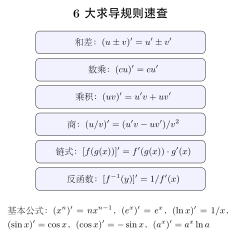

# 第8章 求导法则

> **一例速记**：
> **6 大求导法则**：和差 / 数乘 / 乘积 $f'g+fg'$ / 商 $(f'g-fg')/g^2$ / 链式 $f'(g)\cdot g'$ / 反函数 $1/g'(y)$。
> **对数求导法**：含 $x^x$、多因子积、$f^g$ → 两边取 $\ln$ 再求导。
> **隐函数 / 参数式**：含 $y(x)$ 项求导用链式 $(y^2)' = 2yy'$；参数式 $\frac{dy}{dx}=\frac{dy/dt}{dx/dt}$。

---

## 引入：复合求导的"剥洋葱"

> **题目**：求 $y=\sin(\ln(x^2+1))$ 的导数。

请先停下来想一想：链式法则"内套外"看似简单，但**多层嵌套**时极易漏中间层。这道题有 3 层：最外是 $\sin$，中间是 $\ln$，最内是 $x^2+1$。

**关键观察**：链式法则就是"**从外向内逐层乘**"——每剥一层皮，乘上该层对其自变量的导数。下面把内心独白完整还原。

---

## 思维路径还原（解题者的内心独白）

> "看到 $y=\sin(\ln(x^2+1))$，立刻心里**剥洋葱**：从外到内三层。
>
> **第 1 层（最外）**：$\sin(\cdot)$。它的导数是 $\cos(\cdot)$，先写下来。但 $\cos$ 的"自变量"是中间那层 $\ln(x^2+1)$，**不能立刻代入 $x$**。
>
> **第 2 层（中间）**：$\ln(\cdot)$。它的导数是 $\frac{1}{(\cdot)}$，对应里面是 $x^2+1$，所以这一层贡献 $\frac{1}{x^2+1}$。
>
> **第 3 层（最内）**：$x^2+1$。这是显式表达式，求导得 $2x$。
>
> **总装**：把三层"内导"按链式乘起来：
> $$y' = \cos(\ln(x^2+1)) \cdot \frac{1}{x^2+1} \cdot 2x = \frac{2x\cos(\ln(x^2+1))}{x^2+1}.$$
>
> 关键洞察：链式法则的本质是**逐层映射的速率相乘**——这与神经网络反向传播完全一致（loss 对参数的导数 = 各层导数相乘）。**toolkit/12 中详述**这一对应。
>
> **常见错误**：写到第一层 $\cos(\ln(x^2+1))$ 就停，忘记乘内层。修正：每完成一层都问自己"内层是显式变量吗？不是就继续剥。""

---

## 学习目标

通过本章学习，你将能够：

- 掌握导数的四则运算法则：和差法则、积的法则、商的法则
- 理解并熟练运用链式法则求复合函数的导数
- 掌握反函数求导法则，能推导反三角函数的导数
- 掌握隐函数求导法和对数求导法
- 学会参数方程的求导方法，包括二阶导数的计算
- 理解高阶导数的概念，掌握莱布尼茨公式和常见函数的 $n$ 阶导数

---

## 8.0 求导法则全景导览

求导法则可分为 **5 大类**，按依赖层级排列：

```
第 0 层（基础）：导数定义 f'(x) = lim_{h→0} (f(x+h)-f(x))/h
   ↓
第 1 层（线性）：和差法则 (f±g)' = f'±g'，数乘 (cf)' = cf'
   ↓
第 2 层（双线性）：乘积法则 (fg)' = f'g+fg'
   ↓                商法则  (f/g)' = (f'g-fg')/g²
   ↓
第 3 层（复合）：链式法则 [f(g(x))]' = f'(g(x))·g'(x)
   ↓
第 4 层（衍生）：反函数法则、隐函数求导、对数求导、参数式求导
   ↓
第 5 层（高阶）：Leibniz 公式 / Faà di Bruno 高阶链式
```

每条法则都源于**导数定义 + 极限的代数性质 + 连续性**。下面按层级逐条给出**不跳步**的完整推导。

---

## 8.1 导数的四则运算（线性 + 双线性）

### 8.1.1 和差法则

**定理**（和差法则）：若 $f(x)$ 和 $g(x)$ 在点 $x$ 处可导，则 $f(x) \pm g(x)$ 也在 $x$ 处可导，且

$$(f \pm g)'(x) = f'(x) \pm g'(x)$$

**证明**：由导数定义，

$$\lim_{h \to 0} \frac{[f(x+h) \pm g(x+h)] - [f(x) \pm g(x)]}{h} = \lim_{h \to 0} \frac{f(x+h) - f(x)}{h} \pm \lim_{h \to 0} \frac{g(x+h) - g(x)}{h} = f'(x) \pm g'(x)$$

$\square$

**推广**：对于有限个可导函数的和差，有

$$(f_1 \pm f_2 \pm \cdots \pm f_n)' = f_1' \pm f_2' \pm \cdots \pm f_n'$$

> **例题 8.1** 求 $y = x^3 + 2x^2 - 5x + 1$ 的导数。

**解**：

$$y' = (x^3)' + (2x^2)' - (5x)' + (1)' = 3x^2 + 4x - 5$$

### 8.1.2 积的法则（Leibniz 法则）

**定理**（乘积法则 / Leibniz 法则）：若 $f, g$ 在 $x$ 处可导，则 $fg$ 在 $x$ 处可导，且

$$(fg)'(x) = f'(x)g(x) + f(x)g'(x).$$

#### 不跳步的完整推导

**第一步**（写定义）：
$$(fg)'(x) = \lim_{h\to 0}\frac{f(x+h)g(x+h) - f(x)g(x)}{h}.$$

**第二步**（关键代数技巧——"加一减一"）：在分子中加入 $\pm f(x)g(x+h)$：

$$f(x+h)g(x+h) - f(x)g(x) = \underbrace{[f(x+h)-f(x)]g(x+h)}_{\text{差分 }f \text{ 乘以 }g\text{ 的新值}} + \underbrace{f(x)[g(x+h)-g(x)]}_{f\text{ 的旧值乘以差分 }g}.$$

> **直觉**：把 $fg$ 的变化拆成"先变 $f$ 后看 $g$"+"$f$ 不变只变 $g$"两部分——正是积分中的"乘积变化分解"。

**第三步**（除以 $h$ 并分项取极限）：
$$\frac{f(x+h)g(x+h)-f(x)g(x)}{h} = \frac{f(x+h)-f(x)}{h}\cdot g(x+h) + f(x)\cdot\frac{g(x+h)-g(x)}{h}.$$

**第四步**（利用可导 → 连续）：因 $g$ 在 $x$ 可导，$g$ 在 $x$ 连续，故 $\lim_{h\to 0}g(x+h) = g(x)$。

**第五步**（极限的乘积法则）：
$$\lim_{h\to 0}\frac{f(x+h)-f(x)}{h}\cdot \lim_{h\to 0}g(x+h) + f(x)\cdot \lim_{h\to 0}\frac{g(x+h)-g(x)}{h} = f'(x)g(x) + f(x)g'(x).$$

$\square$

**推论 1**（数乘）：$(cf)' = cf'$。
**证明**：在乘积法则中取 $g(x) \equiv c$，则 $g'(x) = 0$。$\square$

**推论 2**（三函数乘积）：$(fgh)' = f'gh + fg'h + fgh'$。

**证明**（视 $fg$ 为一个函数）：
$$(fgh)' = ((fg)h)' = (fg)'h + (fg)h' = (f'g + fg')h + fgh' = f'gh + fg'h + fgh'.\quad\square$$

**推论 3**（$n$ 函数乘积，归纳）：

$$\left(\prod_{i=1}^n f_i\right)' = \sum_{i=1}^n f_1\cdots f_{i-1}\cdot f_i'\cdot f_{i+1}\cdots f_n.$$

**证明**（数学归纳）：$n=2$ 即乘积法则。设对 $n-1$ 个函数成立，则
$$\left(\prod_{i=1}^n f_i\right)' = \left(\Big(\prod_{i=1}^{n-1}f_i\Big)\cdot f_n\right)' = \left(\prod_{i=1}^{n-1}f_i\right)'\cdot f_n + \left(\prod_{i=1}^{n-1}f_i\right)\cdot f_n'.$$

把归纳假设代入第一项即得。$\square$

> **例题 8.2** 求 $y = x^2 e^x$ 的导数。

**解**：$y' = (x^2)'e^x + x^2(e^x)' = 2xe^x + x^2 e^x = (x^2+2x)e^x.\quad\square$

> **例题 8.2'** 求 $y = x\sin x\cos x$ 的导数。

**解**（三函数乘积法则）：
$$y' = \sin x\cos x + x\cos x\cos x + x\sin x(-\sin x) = \sin x\cos x + x(\cos^2 x - \sin^2 x) = \frac{1}{2}\sin 2x + x\cos 2x.\quad\square$$

### 8.1.3 商的法则

**定理**（商法则）：若 $f, g$ 在 $x$ 处可导，且 $g(x)\neq 0$，则 $\dfrac{f}{g}$ 在 $x$ 处可导，且

$$\left(\frac{f}{g}\right)'(x) = \frac{f'(x)g(x) - f(x)g'(x)}{[g(x)]^2}.$$

#### 不跳步的完整推导

**第一步**（写定义）：
$$\left(\frac{f}{g}\right)'(x) = \lim_{h\to 0}\frac{1}{h}\left[\frac{f(x+h)}{g(x+h)} - \frac{f(x)}{g(x)}\right].$$

**第二步**（通分）：
$$\frac{f(x+h)}{g(x+h)} - \frac{f(x)}{g(x)} = \frac{f(x+h)g(x) - f(x)g(x+h)}{g(x+h)g(x)}.$$

**第三步**（"加一减一" $\pm f(x)g(x)$，与乘积法则同款技巧）：

$$f(x+h)g(x) - f(x)g(x+h) = [f(x+h) - f(x)]g(x) - f(x)[g(x+h) - g(x)].$$

**第四步**（除 $h$ 并分项）：
$$\frac{1}{h}\left[\frac{f(x+h)}{g(x+h)} - \frac{f(x)}{g(x)}\right] = \frac{1}{g(x+h)g(x)}\left[\frac{f(x+h)-f(x)}{h}g(x) - f(x)\frac{g(x+h)-g(x)}{h}\right].$$

**第五步**（取极限，用 $g$ 在 $x$ 连续）：当 $h\to 0$，$g(x+h)\to g(x)$，所以 $g(x+h)g(x)\to [g(x)]^2$（由 $g(x)\neq 0$ 保证不为 0），两个差商分别趋于 $f'(x), g'(x)$：

$$\left(\frac{f}{g}\right)'(x) = \frac{f'(x)g(x) - f(x)g'(x)}{[g(x)]^2}.\quad\square$$

**记忆口诀**：分子"**先正后负**"——**导分子**乘分母 减 分子乘**导分母**，再除以**分母平方**。颠倒一定错。

**特例 1**（倒数法则）：$\left(\dfrac{1}{g}\right)' = -\dfrac{g'}{g^2}$。**证明**：取 $f\equiv 1$，$f' = 0$，代入得证。$\square$

**特例 2**（商法则 = 乘积法则 + 倒数法则）：$\dfrac{f}{g} = f\cdot \dfrac{1}{g}$，对 $f\cdot g^{-1}$ 用乘积法则即得商法则——展示**法则之间不是孤立的**。

> **例题 8.3** 求 $y = \tan x$ 的导数。

**解**：

$$(\tan x)' = \left(\frac{\sin x}{\cos x}\right)' = \frac{(\sin x)' \cos x - \sin x (\cos x)'}{\cos^2 x} = \frac{\cos^2 x + \sin^2 x}{\cos^2 x} = \frac{1}{\cos^2 x} = \sec^2 x$$

---

## 8.2 链式法则

### 8.2.1 复合函数的导数

**定理**（链式法则）：设 $y = f(u)$，$u = g(x)$。若 $g$ 在 $x_0$ 处可导，$f$ 在 $u_0 = g(x_0)$ 处可导，则 $y = f(g(x))$ 在 $x_0$ 处可导，且

$$\boxed{\frac{dy}{dx}\bigg|_{x_0} = f'(g(x_0))\cdot g'(x_0) = \frac{dy}{du}\bigg|_{u_0}\cdot \frac{du}{dx}\bigg|_{x_0}.}$$

#### 朴素推导（演示思路，但有漏洞）

记 $\Delta u = g(x_0 + \Delta x) - g(x_0)$，$\Delta y = f(u_0+\Delta u) - f(u_0)$。若 $\Delta u \neq 0$，则
$$\frac{\Delta y}{\Delta x} = \frac{\Delta y}{\Delta u}\cdot \frac{\Delta u}{\Delta x}.$$

令 $\Delta x\to 0$，由 $g$ 连续 $\Delta u\to 0$，故 $\Delta y/\Delta u\to f'(u_0)$，$\Delta u/\Delta x\to g'(x_0)$，得结论。

**但有漏洞**：当 $\Delta x$ 很小时，$\Delta u$ 可能恰为 $0$（例如 $g(x)\equiv\text{常数}$ 附近），此时 $\Delta y/\Delta u$ 没定义。下面给出严格证明，**完美绕开这一漏洞**。

#### 不跳步的严格证明（Carathéodory 写法）

**第一步**（构造辅助函数）：对 $u$ 在 $u_0$ 附近，定义

$$\varphi(u) = \begin{cases} \dfrac{f(u) - f(u_0)}{u - u_0}, & u\neq u_0, \\ f'(u_0), & u = u_0. \end{cases}$$

**第二步**（验证 $\varphi$ 在 $u_0$ 处连续）：由 $f$ 在 $u_0$ 可导的定义，
$$\lim_{u\to u_0}\varphi(u) = \lim_{u\to u_0}\frac{f(u)-f(u_0)}{u-u_0} = f'(u_0) = \varphi(u_0).$$

故 $\varphi$ 在 $u_0$ 连续。

**第三步**（关键恒等式）：对**所有** $u$（无论 $u = u_0$ 与否）：
$$f(u) - f(u_0) = \varphi(u)\cdot (u - u_0).$$

（当 $u = u_0$，两端都为 0；当 $u\neq u_0$，由 $\varphi$ 定义直接成立。）

**第四步**（代入 $u = g(x), u_0 = g(x_0)$）：
$$f(g(x)) - f(g(x_0)) = \varphi(g(x))\cdot [g(x) - g(x_0)].$$

**这一步无论 $g(x) = g(x_0)$ 与否都成立**——避开了朴素推导的漏洞。

**第五步**（除以 $x - x_0$ 取极限）：
$$\frac{f(g(x)) - f(g(x_0))}{x - x_0} = \varphi(g(x))\cdot \frac{g(x) - g(x_0)}{x - x_0}.$$

令 $x\to x_0$：
- $g(x)\to g(x_0) = u_0$（$g$ 连续），$\varphi$ 在 $u_0$ 连续 $\Rightarrow \varphi(g(x))\to \varphi(u_0) = f'(u_0)$。
- $\dfrac{g(x) - g(x_0)}{x - x_0} \to g'(x_0)$。

故
$$[f\circ g]'(x_0) = f'(g(x_0))\cdot g'(x_0).\quad\square$$

**为什么这个证明优雅？** 它把"商可能除以 0"的麻烦封装到了 $\varphi$ 的定义里（在 $u_0$ 处用极限值补上），从而恒等式 $f(u)-f(u_0) = \varphi(u)(u-u_0)$ 对所有 $u$ 成立。这种"用辅助函数消除奇点"的思路在分析里反复出现。

#### Leibniz 记号的优势

$$\frac{dy}{dx} = \frac{dy}{du}\cdot \frac{du}{dx}.$$

形式上像"分数约分"——但这只是**记号上的便利**，本质是上面那个严格证明。然而它确实方便：多层复合 $y\to u\to v\to w\to x$ 可立即写成
$$\frac{dy}{dx} = \frac{dy}{du}\cdot\frac{du}{dv}\cdot\frac{dv}{dw}\cdot\frac{dw}{dx}.$$

### 8.2.2 链式法则的直观理解

链式法则可以这样理解：如果 $u$ 关于 $x$ 的变化率是 $g'(x)$，而 $y$ 关于 $u$ 的变化率是 $f'(u)$，那么 $y$ 关于 $x$ 的变化率就是这两个变化率的乘积。

> **例题 8.4** 求 $y = \sin(x^2)$ 的导数。

**解**：令 $u = x^2$，则 $y = \sin u$。

$$\frac{dy}{dx} = \frac{dy}{du} \cdot \frac{du}{dx} = \cos u \cdot 2x = 2x \cos(x^2)$$

> **例题 8.5** 求 $y = e^{\sin x}$ 的导数。

**解**：令 $u = \sin x$，则 $y = e^u$。

$$y' = e^u \cdot (\sin x)' = e^{\sin x} \cdot \cos x$$

### 8.2.3 多重复合

对于多重复合函数，链式法则可以逐层应用。

设 $y = f(u)$，$u = g(v)$，$v = h(x)$，则

$$\frac{dy}{dx} = \frac{dy}{du} \cdot \frac{du}{dv} \cdot \frac{dv}{dx} = f'(u) \cdot g'(v) \cdot h'(x)$$

> **例题 8.6** 求 $y = \ln(\cos(e^x))$ 的导数。

**解**：设 $u = \cos(e^x)$，$v = e^x$，则

$$y' = \frac{1}{u} \cdot (-\sin v) \cdot e^x = \frac{-\sin(e^x) \cdot e^x}{\cos(e^x)} = -e^x \tan(e^x)$$

> ⚠️ **常见陷阱**
> 链式法则里最容易漏掉的是"中间变量本身还依赖 $x$"。尤其在多路径依赖里，$\dfrac{\partial f}{\partial x}$ 与 $\dfrac{df}{dx}$ 不是一回事：若还有其它变量依赖于 $x$，全导数必须把所有路径贡献都加上。

### 8.2.4 多元链式法则（全导数）（★进阶·选读，可先跳过）

**定理**（多元链式法则）：设 $z = f(u, v)$ 在 $(u_0, v_0)$ 处可微，$u = u(t), v = v(t)$ 在 $t_0$ 处可导，$u(t_0)=u_0, v(t_0)=v_0$。则 $z(t) = f(u(t), v(t))$ 在 $t_0$ 处可导，且

$$\frac{dz}{dt} = \frac{\partial f}{\partial u}\cdot \frac{du}{dt} + \frac{\partial f}{\partial v}\cdot \frac{dv}{dt}.$$

#### 推导（要点）

**第一步**（多元函数可微性的定义）：$f$ 在 $(u_0, v_0)$ 可微意味着存在 $f_u(u_0,v_0), f_v(u_0,v_0)$ 和"小 $o$"项 $\varepsilon(\Delta u,\Delta v)$，使得

$$\Delta f = f_u(u_0,v_0)\Delta u + f_v(u_0,v_0)\Delta v + \varepsilon(\Delta u,\Delta v),$$

其中 $\varepsilon = o(\sqrt{\Delta u^2 + \Delta v^2})$（即 $\dfrac{|\varepsilon|}{\sqrt{\Delta u^2+\Delta v^2}}\to 0$）。

**第二步**：令 $\Delta u = u(t_0+\Delta t) - u_0$，$\Delta v = v(t_0+\Delta t) - v_0$。除以 $\Delta t$：

$$\frac{\Delta f}{\Delta t} = f_u\cdot \frac{\Delta u}{\Delta t} + f_v\cdot \frac{\Delta v}{\Delta t} + \frac{\varepsilon}{\Delta t}.$$

**第三步**（估计余项）：由 $\Delta u, \Delta v = O(\Delta t)$，所以 $\sqrt{\Delta u^2+\Delta v^2} = O(\Delta t)$，从而 $\varepsilon = o(\Delta t)$，故 $\varepsilon/\Delta t\to 0$。

**第四步**：取 $\Delta t\to 0$ 极限即得定理。$\square$

**特例**：若 $z = f(x, y)$ 且 $y = y(x)$（即 $x$ 既是直接变量、又通过 $y$ 间接影响 $z$）：

$$\frac{dz}{dx} = \frac{\partial f}{\partial x} + \frac{\partial f}{\partial y}\cdot \frac{dy}{dx}.$$

注意 $\dfrac{\partial f}{\partial x}$（偏导，把 $y$ 当常数）与 $\dfrac{dz}{dx}$（全导，承认 $y$ 依赖 $x$）的区别——这是链式法则最容易混淆的地方，第 16 章会深入。

---

## 8.3 反函数求导法则

### 8.3.1 反函数求导定理

**定理 8.1**（反函数求导法则）：设函数 $y = f(x)$ 在区间 $I$ 上严格单调且可导，且 $f'(x) \neq 0$，则其反函数 $x = f^{-1}(y)$ 在对应区间上也可导，且

$$[f^{-1}]'(y) = \frac{1}{f'(x)}$$

或等价地写成

$$\frac{dx}{dy} = \frac{1}{\dfrac{dy}{dx}}$$

**证明**：由于 $f(x)$ 严格单调且连续（可导蕴含连续），由反函数存在性定理，反函数 $x = f^{-1}(y)$ 存在且连续。

设 $y$ 有增量 $\Delta y \neq 0$，对应 $x$ 有增量 $\Delta x = f^{-1}(y + \Delta y) - f^{-1}(y)$。由 $f$ 的严格单调性知 $\Delta x \neq 0$，且当 $\Delta y \to 0$ 时，由 $f^{-1}$ 的连续性知 $\Delta x \to 0$。

于是

$$[f^{-1}]'(y) = \lim_{\Delta y \to 0} \frac{\Delta x}{\Delta y} = \lim_{\Delta x \to 0} \frac{1}{\dfrac{\Delta y}{\Delta x}} = \frac{1}{\lim_{\Delta x \to 0} \dfrac{\Delta y}{\Delta x}} = \frac{1}{f'(x)}$$

$\square$

**直观理解**：若 $y$ 关于 $x$ 的变化率为 $f'(x)$，那么 $x$ 关于 $y$ 的变化率自然是其倒数 $\dfrac{1}{f'(x)}$。条件 $f'(x) \neq 0$ 保证了倒数有意义。

#### 推导补全：为什么需要 $f'(x)\neq 0$ ？

**第一**（必要性）：若 $f'(x_0) = 0$，则切线水平，反函数在 $y_0 = f(x_0)$ 处切线竖直，即 $[f^{-1}]'(y_0) = \infty$，无定义。例如 $f(x) = x^3$ 在 $x=0$ 处 $f'(0)=0$，反函数 $f^{-1}(y) = y^{1/3}$ 在 $y=0$ 处确实不可导。

**第二**（充分性的"另证"——用链式法则推导）：在 $f^{-1}(f(x)) = x$ 两边对 $x$ 求导，左边用链式法则：

$$[f^{-1}]'(f(x))\cdot f'(x) = 1 \quad\Longrightarrow\quad [f^{-1}]'(y) = \frac{1}{f'(x)}.$$

这是一行得到反函数法则——**但前提是已知 $f^{-1}$ 可导**。原始证明（用 $\Delta y \to 0 \Leftrightarrow \Delta x \to 0$）才是建立可导性的根本。

#### 应用拓展：双曲函数的反函数

### 8.3.2 应用：反三角函数的导数

利用反函数求导法则，可以系统地推导反三角函数的导数。

**（1）$(\arcsin x)' = \dfrac{1}{\sqrt{1-x^2}}$（$|x| < 1$）**

设 $y = \arcsin x$，则 $x = \sin y$，其中 $y \in \left(-\dfrac{\pi}{2}, \dfrac{\pi}{2}\right)$。

由反函数求导法则：

$$(\arcsin x)' = \frac{1}{(\sin y)'} = \frac{1}{\cos y}$$

在 $y \in \left(-\dfrac{\pi}{2}, \dfrac{\pi}{2}\right)$ 上，$\cos y > 0$，故

$$\cos y = \sqrt{1 - \sin^2 y} = \sqrt{1 - x^2}$$

因此

$$(\arcsin x)' = \frac{1}{\sqrt{1 - x^2}}$$

**（2）$(\arccos x)' = -\dfrac{1}{\sqrt{1-x^2}}$（$|x| < 1$）**

设 $y = \arccos x$，则 $x = \cos y$，其中 $y \in (0, \pi)$。

$$(\arccos x)' = \frac{1}{(\cos y)'} = \frac{1}{-\sin y}$$

在 $y \in (0, \pi)$ 上，$\sin y > 0$，故

$$\sin y = \sqrt{1 - \cos^2 y} = \sqrt{1 - x^2}$$

因此

$$(\arccos x)' = -\frac{1}{\sqrt{1 - x^2}}$$

**注**：$(\arcsin x)' + (\arccos x)' = 0$，这与恒等式 $\arcsin x + \arccos x = \dfrac{\pi}{2}$ 一致。

**（3）$(\arctan x)' = \dfrac{1}{1+x^2}$**

设 $y = \arctan x$，则 $x = \tan y$，其中 $y \in \left(-\dfrac{\pi}{2}, \dfrac{\pi}{2}\right)$。

$$(\arctan x)' = \frac{1}{(\tan y)'} = \frac{1}{\sec^2 y} = \frac{1}{1 + \tan^2 y} = \frac{1}{1 + x^2}$$

> **例题 8.7** 求 $y = \arcsin(2x - 1)$ 的导数。

**解**：利用链式法则和 $\arcsin$ 的导数公式：

$$y' = \frac{1}{\sqrt{1 - (2x-1)^2}} \cdot (2x - 1)' = \frac{2}{\sqrt{1 - (2x - 1)^2}}$$

化简根号内部：$1 - (2x-1)^2 = 1 - 4x^2 + 4x - 1 = 4x - 4x^2 = 4x(1-x)$，故

$$y' = \frac{2}{\sqrt{4x(1-x)}} = \frac{2}{2\sqrt{x(1-x)}} = \frac{1}{\sqrt{x(1-x)}} \quad (0 < x < 1)$$

> **例题 8.8** 求 $y = \arctan\dfrac{1}{x}$（$x \neq 0$）的导数。

**解**：

$$y' = \frac{1}{1 + \left(\dfrac{1}{x}\right)^2} \cdot \left(-\frac{1}{x^2}\right) = \frac{1}{\dfrac{x^2 + 1}{x^2}} \cdot \left(-\frac{1}{x^2}\right) = \frac{x^2}{x^2 + 1} \cdot \left(-\frac{1}{x^2}\right) = -\frac{1}{x^2 + 1}$$

**注**：当 $x > 0$ 时，$\arctan x + \arctan\dfrac{1}{x} = \dfrac{\pi}{2}$，两边求导即得上述结果。

### 8.3.3 反三角函数导数完整速查表

| 函数 | 导数 | 定义域 |
|---|---|---|
| $\arcsin x$ | $\dfrac{1}{\sqrt{1-x^2}}$ | $\vert x\vert<1$ |
| $\arccos x$ | $-\dfrac{1}{\sqrt{1-x^2}}$ | $\vert x\vert<1$ |
| $\arctan x$ | $\dfrac{1}{1+x^2}$ | $\mathbb{R}$ |
| $\operatorname{arccot} x$ | $-\dfrac{1}{1+x^2}$ | $\mathbb{R}$ |
| $\operatorname{arcsec} x$ | $\dfrac{1}{\vert x\vert\sqrt{x^2-1}}$ | $\vert x\vert>1$ |
| $\operatorname{arccsc} x$ | $-\dfrac{1}{\vert x\vert\sqrt{x^2-1}}$ | $\vert x\vert>1$ |

**记忆要点**：成对出现的反三角函数（$\arcsin/\arccos$、$\arctan/\operatorname{arccot}$、$\operatorname{arcsec}/\operatorname{arccsc}$）的导数互为相反数——因为它们的和恒为 $\pi/2$。

---

## 8.4 隐函数求导

### 8.4.1 隐函数的概念

**显函数**：$y = f(x)$ 的形式，$y$ 明确地表示为 $x$ 的函数。

**隐函数**：由方程 $F(x, y) = 0$ 确定的函数关系，$y$ 没有明确表示为 $x$ 的函数。

例如，方程 $x^2 + y^2 = 1$ 确定了隐函数 $y = y(x)$（在上半圆为 $y = \sqrt{1-x^2}$，在下半圆为 $y = -\sqrt{1-x^2}$）。

### 8.4.2 隐函数求导法

**方法**：将方程 $F(x, y) = 0$ 两边对 $x$ 求导，把 $y$ 看作 $x$ 的函数，利用链式法则，然后解出 $\dfrac{dy}{dx}$。

#### 为什么可以这样做？——隐函数定理（直觉版）

**隐函数定理**（简化版）：设 $F(x, y)$ 在 $(x_0, y_0)$ 邻域有连续偏导数，且 $F(x_0, y_0) = 0$，$F_y(x_0, y_0) \neq 0$，则方程 $F(x, y) = 0$ 在 $x_0$ 附近确定唯一连续可导函数 $y = y(x)$，且

$$\frac{dy}{dx} = -\frac{F_x(x, y)}{F_y(x, y)}.$$

**公式推导**（不跳步）：

**第一步**：在 $F(x, y(x)) = 0$ 两边对 $x$ 求导。注意 $y$ 依赖 $x$，用多元链式法则（即 8.2.4）：
$$\frac{d}{dx}F(x, y(x)) = F_x(x, y) + F_y(x, y)\cdot \frac{dy}{dx} = 0.$$

**第二步**：解 $\dfrac{dy}{dx}$（需 $F_y\neq 0$）：
$$\frac{dy}{dx} = -\frac{F_x(x, y)}{F_y(x, y)}.\quad\square$$

> **例**：$x^2 + y^2 = 1 \Rightarrow F = x^2+y^2-1$，$F_x = 2x, F_y = 2y$，故 $y' = -x/y$，与例题 8.9 一致。

**实际做题**：可直接用"两边对 $x$ 求导 + 链式"，不必先写 $F$。理论支持来自隐函数定理。

> **例题 8.9** 设 $x^2 + y^2 = 1$，求 $\dfrac{dy}{dx}$。

**解**：方程两边对 $x$ 求导：

$$2x + 2y \cdot \frac{dy}{dx} = 0$$

解得：

$$\frac{dy}{dx} = -\frac{x}{y} \quad (y \neq 0)$$

> **例题 8.10** 设 $e^y + xy - e = 0$，求 $y'(0)$。

**解**：首先，将 $x = 0$ 代入方程：$e^y - e = 0$，得 $y = 1$。

方程两边对 $x$ 求导：

$$e^y \cdot y' + y + x \cdot y' = 0$$

将 $x = 0$，$y = 1$ 代入：

$$e \cdot y'(0) + 1 + 0 = 0$$

解得：$y'(0) = -\dfrac{1}{e}$

### 8.4.3 对数求导法

对于形如 $y = f(x)^{g(x)}$ 或多个因式乘除的函数，可以先取对数再求导。

#### 理论依据（为什么对数求导法成立）

**第一**：$\ln$ 是严格单调可导函数，$y = e^{\ln y}$ 是恒等变换（$y > 0$）。

**第二**：$\ln y$ 把"乘除变加减、幂变乘积"——这是对数的代数性质：
- $\ln(fg) = \ln f + \ln g$（乘 → 加）
- $\ln(f/g) = \ln f - \ln g$（除 → 减）
- $\ln(f^g) = g\ln f$（幂 → 乘）

**第三**：对 $\ln y$ 求导用链式法则，得 $\dfrac{1}{y}\cdot y'$，所以一旦得到 $\ln y$ 的导数，乘回 $y$ 即得 $y'$。

**第四**（关键洞察）：对 $y = f^g$，**直接**用幂法则 $(x^n)' = nx^{n-1}$ 是**错的**——因为指数 $g$ 不是常数。同样**直接**用指数法则 $(a^x)' = a^x\ln a$ 也是**错的**——因为底数 $f$ 不是常数。**两者都变**时只能取对数。

**步骤**：
1. 两边取对数：$\ln y = g(x) \ln f(x)$
2. 两边对 $x$ 求导：$\dfrac{y'}{y} = \ldots$
3. 解出 $y'$

#### 等价做法：写成 $e^{g\ln f}$ 再链式

$y = f^g = e^{g\ln f}$，则
$$y' = e^{g\ln f}\cdot \left(g\ln f\right)' = f^g\cdot \left(g'\ln f + g\cdot \frac{f'}{f}\right).$$

与对数求导法所得结果**完全一致**——只是计算路径不同。

> **例题 8.11** 求 $y = x^x$（$x > 0$）的导数。

**解**：两边取对数：

$$\ln y = x \ln x$$

两边对 $x$ 求导：

$$\frac{y'}{y} = \ln x + x \cdot \frac{1}{x} = \ln x + 1$$

因此：

$$y' = y(\ln x + 1) = x^x(\ln x + 1)$$

> **例题 8.12** 求 $y = \dfrac{x \sqrt{1-x^2}}{(1+x^2)^2}$（$|x| < 1$）的导数。

**解**：取对数：

$$\ln|y| = \ln|x| + \frac{1}{2}\ln(1-x^2) - 2\ln(1+x^2)$$

两边求导：

$$\frac{y'}{y} = \frac{1}{x} + \frac{-2x}{2(1-x^2)} - \frac{4x}{1+x^2} = \frac{1}{x} - \frac{x}{1-x^2} - \frac{4x}{1+x^2}$$

通分化简：

$$\frac{y'}{y} = \frac{(1-x^2)(1+x^2) - x^2(1+x^2) - 4x^2(1-x^2)}{x(1-x^2)(1+x^2)} = \frac{1 - 6x^2 + x^4}{x(1-x^4)}$$

因此 $y' = y \cdot \dfrac{1 - 6x^2 + x^4}{x(1-x^4)}$。

---

## 8.5 参数方程求导

### 8.5.1 参数方程的导数

设曲线由参数方程给出：

$$\begin{cases} x = \varphi(t) \\ y = \psi(t) \end{cases}$$

若 $\varphi(t)$ 和 $\psi(t)$ 可导，且 $\varphi'(t) \neq 0$，则

$$\frac{dy}{dx} = \frac{dy/dt}{dx/dt} = \frac{\psi'(t)}{\varphi'(t)}$$

> **例题 8.13** 椭圆的参数方程为 $x = a\cos t$，$y = b\sin t$，求 $\dfrac{dy}{dx}$。

**解**：

$$\frac{dy}{dx} = \frac{(b\sin t)'}{(a\cos t)'} = \frac{b\cos t}{-a\sin t} = -\frac{b}{a}\cot t$$

> **例题 8.14** 摆线的参数方程为 $x = a(t - \sin t)$，$y = a(1 - \cos t)$，求 $\dfrac{dy}{dx}$。

**解**：

$$\frac{dx}{dt} = a(1 - \cos t), \quad \frac{dy}{dt} = a\sin t$$

$$\frac{dy}{dx} = \frac{a\sin t}{a(1 - \cos t)} = \frac{\sin t}{1 - \cos t} = \frac{2\sin\frac{t}{2}\cos\frac{t}{2}}{2\sin^2\frac{t}{2}} = \cot\frac{t}{2}$$

### 8.5.2 参数方程的二阶导数

**核心思路**：把 $\dfrac{dy}{dx}$ 视为 $t$ 的函数 $p(t) = \psi'(t)/\varphi'(t)$，再对 $x$ 求导——但 $x$ 也是 $t$ 的函数，所以再用一次参数式求导公式：

$$\frac{d^2y}{dx^2} = \frac{d}{dx}\left(\frac{dy}{dx}\right) = \frac{d}{dx}\,p(t) = \frac{dp/dt}{dx/dt}.$$

#### 化简公式的完整推导

**第一步**（求 $dp/dt$，用商法则）：
$$\frac{dp}{dt} = \frac{d}{dt}\frac{\psi'(t)}{\varphi'(t)} = \frac{\psi''(t)\varphi'(t) - \psi'(t)\varphi''(t)}{[\varphi'(t)]^2}.$$

**第二步**（除以 $dx/dt = \varphi'(t)$）：
$$\frac{d^2y}{dx^2} = \frac{1}{\varphi'(t)}\cdot \frac{\psi''(t)\varphi'(t) - \psi'(t)\varphi''(t)}{[\varphi'(t)]^2} = \frac{\psi''(t)\varphi'(t) - \psi'(t)\varphi''(t)}{[\varphi'(t)]^3}.$$

**最容易错的点**：忘了**再除一次 $\varphi'(t)$**——直接把 $\dfrac{dp}{dt}$ 当成 $\dfrac{d^2y}{dx^2}$。**记住**：每一次对 $x$ 求导都要除一次 $\dfrac{dx}{dt}$。

> **例题 8.15** 对于摆线 $x = a(t - \sin t)$，$y = a(1 - \cos t)$，求 $\dfrac{d^2y}{dx^2}$。

**解**：由例题 8.14，$\dfrac{dy}{dx} = \cot\dfrac{t}{2}$。

$$\frac{d}{dt}\left(\frac{dy}{dx}\right) = -\frac{1}{2}\csc^2\frac{t}{2}$$

$$\frac{d^2y}{dx^2} = \frac{-\frac{1}{2}\csc^2\frac{t}{2}}{a(1 - \cos t)} = \frac{-\frac{1}{2}\csc^2\frac{t}{2}}{2a\sin^2\frac{t}{2}} = -\frac{1}{4a\sin^4\frac{t}{2}}$$

---

## 8.6 高阶导数

### 8.6.1 高阶导数的定义

**定义**：若 $f'(x)$ 可导，则称 $(f'(x))'$ 为 $f(x)$ 的**二阶导数**，记为

$$f''(x), \quad y'', \quad \frac{d^2y}{dx^2}, \quad \frac{d^2f}{dx^2}$$

一般地，$f(x)$ 的 $n$ 阶导数定义为 $(n-1)$ 阶导数的导数：

$$f^{(n)}(x) = \left(f^{(n-1)}(x)\right)'$$

记号：$f^{(n)}(x)$，$y^{(n)}$，$\dfrac{d^ny}{dx^n}$

> **例题 8.16** 求 $y = e^x$ 的 $n$ 阶导数。

**解**：$y' = e^x$，$y'' = e^x$，...，归纳得

$$(e^x)^{(n)} = e^x$$

> **例题 8.17** 求 $y = \sin x$ 的 $n$ 阶导数。

**解**：
- $y' = \cos x = \sin(x + \frac{\pi}{2})$
- $y'' = -\sin x = \sin(x + \pi) = \sin(x + \frac{2\pi}{2})$
- $y''' = -\cos x = \sin(x + \frac{3\pi}{2})$
- $y^{(4)} = \sin x = \sin(x + 2\pi) = \sin(x + \frac{4\pi}{2})$

归纳得：

$$(\sin x)^{(n)} = \sin\left(x + \frac{n\pi}{2}\right)$$

类似地：

$$(\cos x)^{(n)} = \cos\left(x + \frac{n\pi}{2}\right)$$

### 8.6.2 莱布尼茨公式

**定理**（Leibniz 公式）：若 $f, g$ 都有 $n$ 阶导数，则

$$(fg)^{(n)} = \sum_{k=0}^{n}\binom{n}{k} f^{(k)}(x)\, g^{(n-k)}(x),$$

其中 $\binom{n}{k} = \dfrac{n!}{k!(n-k)!}$，$f^{(0)} = f$。

#### 不跳步的归纳证明

**基础情形** $n = 1$：即乘积法则 $(fg)' = f'g + fg' = \binom{1}{0}f^{(0)}g^{(1)} + \binom{1}{1}f^{(1)}g^{(0)}$，✓。

**归纳假设**：设 $(fg)^{(n)} = \sum_{k=0}^n \binom{n}{k}f^{(k)}g^{(n-k)}$ 成立。

**归纳步**：对 $(fg)^{(n)}$ 再求一次导：
$$(fg)^{(n+1)} = \sum_{k=0}^n \binom{n}{k}\left[f^{(k+1)}g^{(n-k)} + f^{(k)}g^{(n-k+1)}\right].$$

把求和拆成两部分：

$$= \underbrace{\sum_{k=0}^n \binom{n}{k}f^{(k+1)}g^{(n-k)}}_{S_1} + \underbrace{\sum_{k=0}^n \binom{n}{k}f^{(k)}g^{(n-k+1)}}_{S_2}.$$

**在 $S_1$ 中作 $j = k+1$**（$k=0\Rightarrow j=1$；$k=n\Rightarrow j=n+1$）：
$$S_1 = \sum_{j=1}^{n+1}\binom{n}{j-1}f^{(j)}g^{(n+1-j)}.$$

**在 $S_2$ 中保持 $j = k$**：
$$S_2 = \sum_{j=0}^n \binom{n}{j}f^{(j)}g^{(n+1-j)}.$$

**合并**（把 $S_2$ 的 $j=0$ 项 $\binom{n}{0}f g^{(n+1)} = f g^{(n+1)}$ 和 $S_1$ 的 $j=n+1$ 项 $\binom{n}{n}f^{(n+1)}g = f^{(n+1)}g$ 单独取出，中间 $j=1,\ldots,n$ 项合并）：

$$(fg)^{(n+1)} = fg^{(n+1)} + \sum_{j=1}^n\left[\binom{n}{j-1} + \binom{n}{j}\right]f^{(j)}g^{(n+1-j)} + f^{(n+1)}g.$$

**用 Pascal 恒等式** $\binom{n}{j-1} + \binom{n}{j} = \binom{n+1}{j}$：

$$(fg)^{(n+1)} = \binom{n+1}{0}fg^{(n+1)} + \sum_{j=1}^n \binom{n+1}{j}f^{(j)}g^{(n+1-j)} + \binom{n+1}{n+1}f^{(n+1)}g = \sum_{j=0}^{n+1}\binom{n+1}{j}f^{(j)}g^{(n+1-j)}.$$

即对 $n+1$ 成立。由归纳法定理得证。$\square$

**记忆要点**：Leibniz 公式与**二项式定理** $(a+b)^n = \sum\binom{n}{k}a^k b^{n-k}$ 形式上完全一致——把 $a, b$ 换成 $f$ 的 $k$ 阶导和 $g$ 的 $n-k$ 阶导即可。

展开形式：

$$(fg)^{(n)} = f^{(n)}g + nf^{(n-1)}g' + \frac{n(n-1)}{2!}f^{(n-2)}g'' + \cdots + fg^{(n)}.$$

#### 高阶链式：Faà di Bruno 公式（进阶）

对一阶链式 $[f(g(x))]' = f'(g)\cdot g'$，二阶就复杂了：
$$[f(g(x))]'' = f''(g)\cdot (g')^2 + f'(g)\cdot g''.$$

三阶：
$$[f(g(x))]''' = f'''(g)\cdot (g')^3 + 3 f''(g)\cdot g'\cdot g'' + f'(g)\cdot g'''.$$

**Faà di Bruno 公式**（一般形式）：

$$[f(g(x))]^{(n)} = \sum \frac{n!}{m_1!m_2!\cdots m_n!}\, f^{(m_1+m_2+\cdots+m_n)}(g)\prod_{k=1}^n\left(\frac{g^{(k)}}{k!}\right)^{m_k},$$

求和范围是所有非负整数解 $(m_1,\ldots,m_n)$ 满足 $\sum_{k=1}^n k m_k = n$。

> **直觉**：每项对应 $n$ 元素的一种**分拆方式**——把 $n$ 阶导按"先做几个一阶层、几个二阶层、…"的方式拼装。$m_k$ 表示选取 $k$ 阶导数的次数。

> **实践提示**：考试中通常 $n\le 3$，不必死背公式——按"再求一次导，每个 $f^{(k)}(g)$ 项再用一次链式"逐次得到即可。

> **例题 8.18** 求 $y = x^2 e^x$ 的 $n$ 阶导数（$n \geq 2$）。

**解**：设 $f(x) = e^x$，$g(x) = x^2$。

$g' = 2x$，$g'' = 2$，$g^{(k)} = 0$（$k \geq 3$）

由莱布尼茨公式：

$$y^{(n)} = e^x \cdot x^2 + n \cdot e^x \cdot 2x + \frac{n(n-1)}{2} \cdot e^x \cdot 2 = e^x(x^2 + 2nx + n^2 - n)$$

### 8.6.3 常见函数的 $n$ 阶导数

| 函数 | $n$ 阶导数 |
|:---:|:---:|
| $e^{ax}$ | $a^n e^{ax}$ |
| $a^x$ | $a^x (\ln a)^n$ |
| $\sin(ax+b)$ | $a^n \sin(ax + b + \frac{n\pi}{2})$ |
| $\cos(ax+b)$ | $a^n \cos(ax + b + \frac{n\pi}{2})$ |
| $\ln(ax+b)$ | $\dfrac{(-1)^{n-1}(n-1)! \cdot a^n}{(ax+b)^n}$ |
| $(ax+b)^\alpha$ | $\alpha(\alpha-1)\cdots(\alpha-n+1) \cdot a^n \cdot (ax+b)^{\alpha-n}$ |
| $\dfrac{1}{ax+b}$ | $\dfrac{(-1)^n n! \cdot a^n}{(ax+b)^{n+1}}$ |

---

## 8.7 微分及其运算规则

到目前为止，我们一直在讨论"导数"——函数变化率的精确值。本节引入与导数密切相关、但概念上**独立**的对象：**微分**。微分回答的不是"变化率多大"，而是"在 $x$ 处给定一个微小自变量增量 $dx$，函数会近似变化多少 $dy$"。

> **核心关系**：$\boxed{dy = f'(x)\, dx.}$ 微分是导数与自变量增量的乘积。导数是**比率**（斜率），微分是**乘积**（线性增量）。

下面我们从定义、几何意义、运算规则、形式不变性、应用五个角度系统讲解。

---

### 8.7.1 微分的定义

**定义**（可微）：设 $y = f(x)$ 在 $x_0$ 的邻域有定义。给 $x_0$ 一个增量 $\Delta x$，对应函数增量 $\Delta y = f(x_0 + \Delta x) - f(x_0)$。若存在与 $\Delta x$ **无关**的常数 $A$，使得

$$\Delta y = A\cdot \Delta x + o(\Delta x)\quad (\Delta x\to 0),$$

则称 $f$ 在 $x_0$ 处**可微**，并称 $A\cdot \Delta x$ 为 $f$ 在 $x_0$ 处对应于增量 $\Delta x$ 的**微分**，记作

$$dy\big|_{x_0} = A\cdot \Delta x.$$

其中 $o(\Delta x)$ 表示比 $\Delta x$ 更高阶的无穷小，即 $\lim_{\Delta x\to 0}\dfrac{o(\Delta x)}{\Delta x} = 0$。

#### 可微 ⇔ 可导（一元函数）

**定理**：一元函数 $f$ 在 $x_0$ 可微 $\iff$ $f$ 在 $x_0$ 可导，且 $A = f'(x_0)$。

**完整推导**：

**（⇒）** 设可微，即 $\Delta y = A\Delta x + o(\Delta x)$。两边除以 $\Delta x$：

$$\frac{\Delta y}{\Delta x} = A + \frac{o(\Delta x)}{\Delta x}.$$

取 $\Delta x\to 0$：右端第二项 $\to 0$，故 $\lim_{\Delta x\to 0}\dfrac{\Delta y}{\Delta x} = A$，即 $f'(x_0) = A$ 存在。

**（⇐）** 设可导，$f'(x_0) = \lim_{\Delta x\to 0}\dfrac{\Delta y}{\Delta x}$。记 $\alpha(\Delta x) = \dfrac{\Delta y}{\Delta x} - f'(x_0)$，则 $\alpha\to 0$（$\Delta x\to 0$），且

$$\Delta y = f'(x_0)\Delta x + \alpha(\Delta x)\cdot \Delta x.$$

第二项是 $o(\Delta x)$（因为 $\alpha\to 0$），故可微，$A = f'(x_0)$。$\square$

**结论**：一元函数下"可微"与"可导"是**同一回事**，只是侧重点不同——可导强调"导数存在"，可微强调"局部线性近似"。多元函数则不等价（可微 ⇒ 可偏导，反之不真，见第 16 章）。

#### 自变量的微分

约定 $dx := \Delta x$（自变量的"微分"就是它自己的增量）。这样微分公式统一写成

$$\boxed{dy = f'(x)\, dx,}$$

进而得到

$$\boxed{f'(x) = \frac{dy}{dx}.}$$

这正是 **Leibniz 记号**的来源——$\dfrac{dy}{dx}$ 真的可以理解为"两个微分之比"。

---

### 8.7.2 微分的几何意义

考察曲线 $y = f(x)$ 上点 $P(x_0, f(x_0))$ 的切线 $T$，斜率为 $f'(x_0)$。

| 量 | 含义 | 表达式 |
|---|---|---|
| $\Delta x$ | 自变量增量 | $dx$ |
| $\Delta y$ | **函数值**真实增量 | $f(x_0+\Delta x) - f(x_0)$ |
| $dy$ | **切线**纵坐标增量 | $f'(x_0)\cdot \Delta x$ |
| $\Delta y - dy$ | 真实曲线与切线偏差 | $o(\Delta x)$ |

**几何图景**：在 $P$ 点附近，切线 $T$ 紧贴曲线。当 $\Delta x$ 足够小时，曲线的纵坐标增量 $\Delta y$ 几乎等于切线的纵坐标增量 $dy$——二者只差一个高阶无穷小。

> **直观比喻**：在足够小的尺度下，**曲线被切线代替**——这就是"局部线性化"。整个微积分（特别是泰勒展开、牛顿法、神经网络优化）都建立在这个思想之上。

---

### 8.7.3 微分的运算规则（完整推导）

由 $dy = f'(x)\,dx$，每条求导规则都自动给出一条微分规则。下面逐条推导。

#### (1) 基本微分公式表

由基本求导公式直接平移：

| 函数 | 微分 |
|---|---|
| $y = C$（常数） | $dy = 0$ |
| $y = x^\alpha$ | $dy = \alpha x^{\alpha-1}\,dx$ |
| $y = a^x$ | $dy = a^x\ln a\,dx$ |
| $y = e^x$ | $dy = e^x\,dx$ |
| $y = \log_a x$ | $dy = \dfrac{1}{x\ln a}\,dx$ |
| $y = \ln x$ | $dy = \dfrac{1}{x}\,dx$ |
| $y = \sin x$ | $dy = \cos x\,dx$ |
| $y = \cos x$ | $dy = -\sin x\,dx$ |
| $y = \tan x$ | $dy = \sec^2 x\,dx$ |
| $y = \arcsin x$ | $dy = \dfrac{1}{\sqrt{1-x^2}}\,dx$ |
| $y = \arctan x$ | $dy = \dfrac{1}{1+x^2}\,dx$ |

#### (2) 微分四则运算法则

设 $u = u(x), v = v(x)$ 可微，$C$ 为常数：

| 法则 | 公式 | 推导依据 |
|---|---|---|
| **常数因子** | $d(Cu) = C\,du$ | $(Cu)' = Cu'$，两边乘 $dx$ |
| **和差** | $d(u\pm v) = du \pm dv$ | $(u\pm v)' = u' \pm v'$ |
| **乘积** | $d(uv) = u\,dv + v\,du$ | $(uv)' = u'v + uv'$ |
| **商** | $d\!\left(\dfrac{u}{v}\right) = \dfrac{v\,du - u\,dv}{v^2}$（$v\neq 0$） | 商法则 |

**乘积法则的微分形式推导**（不跳步）：

**第一步**：由乘积法则 $(uv)' = u'v + uv'$。

**第二步**：两边乘 $dx$：
$$(uv)'\,dx = u'v\,dx + uv'\,dx.$$

**第三步**：根据微分定义 $du = u'\,dx$，$dv = v'\,dx$，$d(uv) = (uv)'\,dx$：
$$d(uv) = v\cdot u'\,dx + u\cdot v'\,dx = v\,du + u\,dv.\quad\square$$

**商法则微分形式**类推（两边乘 $dx$ 即得）。

#### (3) 一阶微分形式的不变性（核心性质）

**定理**（一阶微分形式不变性）：无论 $u$ 是**自变量**还是**中间变量**（即 $u = g(x)$），微分公式

$$dy = f'(u)\,du$$

**形式上完全相同**。

#### 不跳步推导

**情形 A**（$u$ 是自变量）：根据微分定义，$dy = f'(u)\,du$，这是定义。

**情形 B**（$u = g(x)$ 是中间变量）：复合函数 $y = f(g(x))$。

**第一步**：用链式法则求 $y$ 对 $x$ 的导数：
$$\frac{dy}{dx} = f'(g(x))\cdot g'(x) = f'(u)\cdot g'(x).$$

**第二步**：由微分定义 $dy = \dfrac{dy}{dx}\,dx$：
$$dy = f'(u)\cdot g'(x)\,dx.$$

**第三步**：注意 $g'(x)\,dx = du$（$u = g(x)$ 的微分）：
$$dy = f'(u)\,du.$$

**两个情形结果完全相同**——这就是"形式不变性"。$\square$

> **直觉**：写出 $dy = f'(u)\,du$ 时，**不必关心 $u$ 是不是自变量**——链式法则已经"自动"把内层导数 $g'(x)\,dx$ 折叠到了 $du$ 里。

> **威力示范**：求 $y = \sin(3x+1)$ 的微分。
> - 套用 $d(\sin u) = \cos u\,du$（不管 $u$ 是不是 $x$）；
> - $u = 3x+1 \Rightarrow du = 3\,dx$；
> - 代回：$dy = \cos(3x+1)\cdot 3\,dx = 3\cos(3x+1)\,dx$。
>
> **整个过程不显式写"链式法则"——它隐藏在了 $du$ 里**。这是不定积分"凑微分"的理论基础。

#### (4) 微分形式不变性 → 凑微分法的等价性

不定积分的"凑微分法"（第一类换元）本质就是反向使用形式不变性：

$$\int f(u(x))\cdot u'(x)\,dx = \int f(u)\,du.$$

把 $u'(x)\,dx$ "凑"成 $du$，即用了 $du = u'(x)\,dx$ 这条规则。这一推导链条在 12.4.2 节有完整展开。

#### (5) 多层复合的微分链式

复合 $y = f(u), u = g(v), v = h(x)$：

$$dy = f'(u)\,du = f'(u)\,g'(v)\,dv = f'(u)\,g'(v)\,h'(x)\,dx.$$

**形式上**就像分数连乘 $\dfrac{dy}{du}\cdot \dfrac{du}{dv}\cdot \dfrac{dv}{dx}$——又一次证实 Leibniz 记号的优雅。

---

### 8.7.4 高阶微分（简介）

二阶微分定义为 $d^2 y = d(dy)$。注意：高阶微分**没有形式不变性**！

**当 $x$ 是自变量**（$dx$ 是常数）：
$$d^2 y = d(f'(x)\,dx) = f''(x)\,dx\cdot dx = f''(x)\,(dx)^2.$$

记作 $d^2 y = f''(x)\,dx^2$（约定 $dx^2 := (dx)^2$，不要与 $d(x^2) = 2x\,dx$ 混淆）。

**当 $u = g(x)$ 是中间变量**（$du$ 不再是常数，依赖 $x$）：
$$d^2 y = d(f'(u)\,du) = d(f'(u))\,du + f'(u)\,d^2 u = f''(u)\,(du)^2 + f'(u)\,d^2 u.$$

多出一项 $f'(u)\,d^2 u$——所以**二阶微分形式不再不变**。这正是 Faà di Bruno 公式（见 8.6.2 末）反映的事实。

---

### 8.7.5 微分的应用：线性近似与误差估计

#### (1) 函数值的线性近似

由 $\Delta y \approx dy = f'(x_0)\,\Delta x$：

$$\boxed{f(x_0 + \Delta x)\approx f(x_0) + f'(x_0)\,\Delta x.}$$

这是**一阶 Taylor 展开**（第 10 章）。

> **例题 8.18'** 估算 $\sqrt{4.05}$。

**解**：取 $f(x) = \sqrt{x}$，$x_0 = 4$，$\Delta x = 0.05$。$f'(x) = \dfrac{1}{2\sqrt{x}}$，$f'(4) = \dfrac{1}{4}$。

$$\sqrt{4.05}\approx \sqrt{4} + \frac{1}{4}\cdot 0.05 = 2 + 0.0125 = 2.0125.$$

真实值 $\sqrt{4.05}\approx 2.01246$——误差不到 $4\times 10^{-5}$。$\square$

#### (2) 误差传播

若一个量 $y = f(x)$，而 $x$ 的测量有绝对误差 $\Delta x$，则 $y$ 的绝对误差近似为

$$|\Delta y|\approx |f'(x)|\cdot |\Delta x|.$$

**相对误差**：$\dfrac{|\Delta y|}{|y|}\approx \left|\dfrac{f'(x)\cdot x}{f(x)}\right|\cdot \dfrac{|\Delta x|}{|x|}$，系数 $\left|\dfrac{f'(x)x}{f(x)}\right|$ 称为 $f$ 在 $x$ 的**弹性系数**（经济学常用）。

> **例题 8.18''** 测量圆球半径 $r$ 有 1% 的相对误差，问体积 $V = \dfrac{4}{3}\pi r^3$ 的相对误差大约多少？

**解**：$dV = 4\pi r^2\,dr$，故 $\dfrac{dV}{V} = \dfrac{4\pi r^2\,dr}{\dfrac{4}{3}\pi r^3} = 3\cdot\dfrac{dr}{r}$。所以体积的相对误差约为 $3\times 1\% = 3\%$。$\square$

---

### 8.7.6 与导数的概念区别（总结）

| 角度 | 导数 $f'(x)$ | 微分 $dy$ |
|---|---|---|
| 类型 | 标量（变化率） | 线性函数 $\Delta x \mapsto f'(x)\Delta x$ |
| 几何 | 切线斜率 | 切线纵坐标增量 |
| 单位 | $[y]/[x]$ | $[y]$（与 $y$ 同单位） |
| 记号 | $f'(x), \dfrac{dy}{dx}, Df$ | $dy$ |
| 计算 | 极限 $\lim \Delta y/\Delta x$ | $f'(x)\,dx$ |

**核心口诀**：**导数是斜率，微分是切线纵坐标增量；导数是数，微分是线性映射**。

---

## 本章小结

1. **四则运算法则**：
   - 和差法则：$(f \pm g)' = f' \pm g'$
   - 积的法则：$(fg)' = f'g + fg'$
   - 商的法则：$\left(\dfrac{f}{g}\right)' = \dfrac{f'g - fg'}{g^2}$

2. **链式法则**：$(f \circ g)'(x) = f'(g(x)) \cdot g'(x)$，即 $\dfrac{dy}{dx} = \dfrac{dy}{du} \cdot \dfrac{du}{dx}$

3. **反函数求导法则**：$[f^{-1}]'(y) = \dfrac{1}{f'(x)}$，由此推导反三角函数的导数

4. **隐函数求导**：方程两边对 $x$ 求导，$y$ 视为 $x$ 的函数，解出 $y'$

5. **对数求导法**：先取对数，再求导，适用于幂指函数和复杂乘除式

6. **参数方程求导**：$\dfrac{dy}{dx} = \dfrac{dy/dt}{dx/dt}$，二阶导数需要再除以 $\dfrac{dx}{dt}$

7. **高阶导数**：逐次求导，常用莱布尼茨公式处理乘积的高阶导数

---

## 8.8 深度学习应用

### 8.8.1 链式法则与反向传播

深度学习中最核心的训练算法——反向传播（Backpropagation）——其数学本质正是多重复合函数的链式法则。

对于一个深度神经网络，损失函数 $L$ 是关于各层输出的复合函数。设

$$L = f(g(h(x)))$$

则损失函数关于输入 $x$ 的梯度为：

$$\frac{\partial L}{\partial x} = \frac{\partial L}{\partial f} \cdot \frac{\partial f}{\partial g} \cdot \frac{\partial g}{\partial h} \cdot \frac{\partial h}{\partial x}$$

反向传播算法从输出层开始，逐层向后计算每个参数对损失的偏导数，这正是链式法则的逐层应用。每一层只需知道来自上一层的梯度，再乘以本层的局部导数，即可得到本层的梯度。

**反向传播的计算流程**：

1. **前向传播**：依次计算 $h = h(x)$，$g = g(h)$，$f = f(g)$，得到 $L$
2. **反向传播**：依次计算 $\dfrac{\partial L}{\partial f}$，$\dfrac{\partial L}{\partial g} = \dfrac{\partial L}{\partial f} \cdot \dfrac{\partial f}{\partial g}$，$\dfrac{\partial L}{\partial h} = \dfrac{\partial L}{\partial g} \cdot \dfrac{\partial g}{\partial h}$，$\dfrac{\partial L}{\partial x} = \dfrac{\partial L}{\partial h} \cdot \dfrac{\partial h}{\partial x}$

### 8.8.2 自动微分（AutoDiff）

手动推导梯度公式既繁琐又容易出错，自动微分技术通过程序化地追踪计算过程来自动求导。

**前向模式 vs 反向模式**：

- **前向模式**（Forward Mode）：与函数求值同步，逐步计算 $\dfrac{\partial \text{输出}}{\partial \text{某个输入}}$。适合输入维度远小于输出维度的情况。
- **反向模式**（Reverse Mode）：先完成前向计算，再从输出反向追踪，一次性计算损失关于所有参数的梯度。深度学习中几乎都使用反向模式，因为参数数量（百万级以上）远大于损失的维度（通常为标量）。

**PyTorch 的 autograd 机制**：

PyTorch 通过构建**计算图**（Computational Graph）来实现反向模式自动微分。每次进行张量运算时，PyTorch 记录该运算及其输入，形成一张有向无环图（DAG）。调用 `.backward()` 时，沿计算图反向遍历，依链式法则累积梯度。

关键概念：
- `requires_grad=True`：标记需要追踪梯度的张量
- `.backward()`：触发反向传播，计算所有叶节点的梯度
- `.grad`：存储累积梯度
- `create_graph=True`：保留计算图以支持高阶导数

### 8.8.3 高阶导数在深度学习中的应用

**Hessian 矩阵与二阶优化**：

函数 $f(\mathbf{x})$ 的 Hessian 矩阵 $\mathbf{H}$ 由所有二阶偏导数构成：

$$H_{ij} = \frac{\partial^2 f}{\partial x_i \partial x_j}$$

二阶优化方法（如牛顿法）利用 Hessian 矩阵描述损失曲面的**曲率**，从而自适应调整步长：

$$\mathbf{x}_{t+1} = \mathbf{x}_t - \mathbf{H}^{-1} \nabla f(\mathbf{x}_t)$$

在曲率大的方向（梯度变化快）步长小，在曲率小的方向步长大，比纯梯度下降更高效。

**Fisher 信息矩阵**：

Fisher 信息矩阵 $\mathbf{F}$ 是对数似然函数的期望 Hessian 矩阵的负值，衡量模型参数对分布的敏感程度：

$$\mathbf{F} = \mathbb{E}\left[\nabla \log p(x|\theta) \cdot \nabla \log p(x|\theta)^\top\right]$$

自然梯度法（Natural Gradient）使用 Fisher 信息矩阵代替 Hessian，在参数空间的黎曼几何意义下进行最优化，在强化学习（如 TRPO、PPO）和变分推断中有重要应用。

### 8.8.4 代码示例：自动微分演示

```python
import torch

# 自动微分：链式法则的自动应用
x = torch.tensor([2.0], requires_grad=True)

# 复合函数 f(g(h(x))) = sin(exp(x^2))
h = x ** 2        # h(x) = x^2
g = torch.exp(h)  # g(h) = e^h
f = torch.sin(g)  # f(g) = sin(g)

# 反向传播：自动应用链式法则
f.backward()

# 手动验证：df/dx = cos(e^(x^2)) * e^(x^2) * 2x
manual_grad = torch.cos(torch.exp(x**2)) * torch.exp(x**2) * 2 * x
print(f"自动微分: {x.grad.item():.6f}")
print(f"手动计算: {manual_grad.item():.6f}")

# 计算二阶导数（Hessian）
x = torch.tensor([2.0], requires_grad=True)
y = x ** 3
grad1 = torch.autograd.grad(y, x, create_graph=True)[0]
grad2 = torch.autograd.grad(grad1, x)[0]
print(f"二阶导数 d²(x³)/dx² = 6x = {grad2.item():.1f}")
```

> **注**：上述代码在 $x = 2$ 处计算 $\sin(e^{x^2})$ 的导数。由链式法则，结果为 $\cos(e^4) \cdot e^4 \cdot 4$，自动微分与手动计算应完全一致。对于 $y = x^3$，二阶导数 $\dfrac{d^2y}{dx^2} = 6x$，在 $x=2$ 处值为 $12$。

---

## 练习题

**1.** ⭐ 求下列函数的导数：
   (a) $y = x^3 \ln x$
   (b) $y = \dfrac{e^x}{1 + x^2}$
   (c) $y = \sin^3(2x)$

**2.** ⭐ 设 $x^3 + y^3 = 3xy$，求 $\dfrac{dy}{dx}$。

**3.** ⭐ 求 $y = (\sin x)^x$（$0 < x < \pi$）的导数。

**4.** ⭐⭐ 设 $x = \ln(1 + t^2)$，$y = t - \arctan t$，求 $\dfrac{dy}{dx}$ 和 $\dfrac{d^2y}{dx^2}$。

**5.** ⭐⭐ 求 $y = x^2 \sin x$ 的 $n$ 阶导数（$n \geq 2$）。

**6.** ⭐⭐ 设 $z=f(x,y)$，其中 $y=y(x)$，写出 $\dfrac{dz}{dx}$ 的链式法则。

**7.** ⭐⭐⭐ 求 $y=(1+x)^{\sin x}$ 的导数。

**8.** ⭐⭐⭐ 解释为什么反向传播本质上是链式法则在多层复合函数上的系统应用。

---

## 练习答案

<details>
<summary>点击展开答案</summary>

**1.**

(a) $y = x^3 \ln x$

$$y' = 3x^2 \ln x + x^3 \cdot \frac{1}{x} = 3x^2 \ln x + x^2 = x^2(3\ln x + 1)$$

(b) $y = \dfrac{e^x}{1 + x^2}$

$$y' = \frac{e^x(1 + x^2) - e^x \cdot 2x}{(1 + x^2)^2} = \frac{e^x(1 + x^2 - 2x)}{(1 + x^2)^2} = \frac{e^x(1 - x)^2}{(1 + x^2)^2}$$

(c) $y = \sin^3(2x)$

设 $u = \sin(2x)$，则 $y = u^3$。

$$y' = 3u^2 \cdot u' = 3\sin^2(2x) \cdot \cos(2x) \cdot 2 = 6\sin^2(2x)\cos(2x)$$

或用二倍角公式：$y' = 3\sin(4x)\sin(2x)$

---

**2.** 方程 $x^3 + y^3 = 3xy$ 两边对 $x$ 求导：

$$3x^2 + 3y^2 \cdot y' = 3y + 3x \cdot y'$$

整理：

$$3y^2 y' - 3xy' = 3y - 3x^2$$

$$y'(y^2 - x) = y - x^2$$

$$\frac{dy}{dx} = \frac{y - x^2}{y^2 - x} \quad (y^2 \neq x)$$

---

**3.** $y = (\sin x)^x$

取对数：$\ln y = x \ln(\sin x)$

两边求导：

$$\frac{y'}{y} = \ln(\sin x) + x \cdot \frac{\cos x}{\sin x} = \ln(\sin x) + x\cot x$$

因此：

$$y' = (\sin x)^x \left[\ln(\sin x) + x\cot x\right]$$

---

**4.** $x = \ln(1 + t^2)$，$y = t - \arctan t$

$$\frac{dx}{dt} = \frac{2t}{1 + t^2}, \quad \frac{dy}{dt} = 1 - \frac{1}{1 + t^2} = \frac{t^2}{1 + t^2}$$

$$\frac{dy}{dx} = \frac{dy/dt}{dx/dt} = \frac{\frac{t^2}{1 + t^2}}{\frac{2t}{1 + t^2}} = \frac{t^2}{2t} = \frac{t}{2} \quad (t \neq 0)$$

对 $\dfrac{dy}{dx} = \dfrac{t}{2}$ 关于 $t$ 求导，再除以 $\dfrac{dx}{dt}$：

$$\frac{d^2y}{dx^2} = \frac{\frac{d}{dt}\left(\frac{t}{2}\right)}{\frac{dx}{dt}} = \frac{\frac{1}{2}}{\frac{2t}{1+t^2}} = \frac{1+t^2}{4t}$$

---

**5.** $y = x^2 \sin x$

设 $f(x) = \sin x$，$g(x) = x^2$。

$f^{(k)}(x) = \sin\left(x + \dfrac{k\pi}{2}\right)$

$g(x) = x^2$，$g'(x) = 2x$，$g''(x) = 2$，$g^{(k)} = 0$（$k \geq 3$）

由莱布尼茨公式（$n \geq 2$）：

$$y^{(n)} = \sin\left(x + \frac{n\pi}{2}\right) \cdot x^2 + n \sin\left(x + \frac{(n-1)\pi}{2}\right) \cdot 2x + \frac{n(n-1)}{2} \sin\left(x + \frac{(n-2)\pi}{2}\right) \cdot 2$$

化简：

$$y^{(n)} = x^2 \sin\left(x + \frac{n\pi}{2}\right) + 2nx \sin\left(x + \frac{(n-1)\pi}{2}\right) + n(n-1) \sin\left(x + \frac{(n-2)\pi}{2}\right)$$

利用 $\sin\left(x + \dfrac{(n-1)\pi}{2}\right) = \cos\left(x + \dfrac{(n-2)\pi}{2}\right)$ 和 $\sin\left(x + \dfrac{(n-2)\pi}{2}\right) = -\cos\left(x + \dfrac{(n-1)\pi}{2}\right)$，可进一步化简为：

$$y^{(n)} = (x^2 - n^2 + n) \sin\left(x + \frac{n\pi}{2}\right) + 2nx \cos\left(x + \frac{n\pi}{2}\right)$$

---

**6.** 若 $z=f(x,y)$ 且 $y=y(x)$，则 $z$ 既直接依赖 $x$，也通过 $y$ 间接依赖 $x$。因此全导数为

$$
\frac{dz}{dx}
=
\frac{\partial z}{\partial x}
 +
 \frac{\partial z}{\partial y}\frac{dy}{dx}.
$$

这正是“偏导 + 链式法则”的组合形式。

---

**7.** $y=(1+x)^{\sin x}$。

取对数：

$$
\ln y=\sin x\cdot \ln(1+x).
$$

两边求导：

$$
\frac{y'}{y}
=
\cos x\ln(1+x)+\sin x\cdot \frac{1}{1+x}.
$$

因此

$$
y'
=
(1+x)^{\sin x}\left[\cos x\ln(1+x)+\frac{\sin x}{1+x}\right].
$$

---

**8.** 设多层网络的损失写成

$$
L = f_m\bigl(f_{m-1}(\cdots f_2(f_1(x))\cdots)\bigr).
$$

若要求某一层参数 $\theta_k$ 对损失的影响，就必须沿着“参数 $\to$ 当前层输出 $\to$ 后续层输出 $\to$ 损失”的整条路径逐层相乘：

$$
\frac{\partial L}{\partial \theta_k}
=
\frac{\partial L}{\partial h_m}
\cdot \frac{\partial h_m}{\partial h_{m-1}}
\cdot \cdots
\cdot \frac{\partial h_{k+1}}{\partial h_k}
\cdot \frac{\partial h_k}{\partial \theta_k}.
$$

这正是链式法则。所谓反向传播，只是把这种多层复合函数的求导过程系统化、程序化：从输出层开始，把“上游梯度”逐层乘以本层的局部导数，再传回前一层。因此它的数学本质不是新的法则，而是链式法则在计算图上的高效实现。

</details>


## 几何示意



---

## 思考路标（条件反射）

- 看到 $(f\pm g)'$ → 各自求导加减
- 看到 $(fg)'$ → 乘积法则 $f'g+fg'$
- 看到 $(f/g)'$ → 商法则 $\frac{f'g-fg'}{g^2}$（**分子分母顺序不可颠倒**）
- 看到 $f(g(x))'$ → 链式 $f'(g(x))\cdot g'(x)$
- 看到 $y=x^x$ 或多因子积 → 对数求导法
- 看到隐函数 $F(x,y)=0$ → 两边对 $x$ 求导，解出 $y'$
- 看到参数式 $x=x(t), y=y(t)$ → $\frac{dy}{dx}=\frac{dy/dt}{dx/dt}$
- 看到高阶 Leibniz $(uv)^{(n)}$ → 二项展开 $\sum_k C_n^k u^{(k)}v^{(n-k)}$

## 易错点

1. **链式法则别漏内层导数**：$(\sin(2x))' = \cos(2x) \cdot 2$，不是 $\cos(2x)$。
2. **商法则分子顺序**：$f'g - fg'$（先正后负），不是反过来。
3. **$(\ln |x|)' = 1/x$**：对负数也成立，因为绝对值使定义域对称。
4. **$(a^x)' = a^x \ln a$**：不是 $a^x \cdot a^{x-1}$，更不是 $x \cdot a^{x-1}$。
5. **隐函数求导漏 $y'$**：含 $y(x)$ 项求导要写链式，如 $(y^2)' = 2yy'$ 不是 $2y$。

---

## 抽象成方法（套路总结）

### 求导法则 5 大核心公式速查

| 法则 | 公式 | 适用场景 |
|---|---|---|
| **乘积法则** | $(fg)'=f'g+fg'$ | 两函数相乘 |
| **商法则** | $\left(\frac{f}{g}\right)'=\frac{f'g-fg'}{g^2}$ | 分式型，分子**先正后负** |
| **链式法则** | $(f(g(x)))'=f'(g(x))\cdot g'(x)$ | 复合函数，"从外向内逐层乘" |
| **反函数法则** | $[f^{-1}]'(y)=\frac{1}{f'(x)}$ | 反三角函数求导的基础 |
| **对数求导法** | 两边取 $\ln$，再对 $x$ 求导解出 $y'$ | $f^g$ 型 / 多因子积 |

### 解题标准 4 步流程（求导题）

1. **识别函数结构**：是加减？乘除？复合？隐函数？参数式？（判断走哪条路线）
2. **选择法则**：简单加减直接分拆；乘除用乘积 / 商法则；复合用链式（"剥洋葱"）；$y=f^g$ 用对数求导。
3. **逐步展开**：对于多层复合，明确标记每层的"外函数""内函数"，防止漏乘。
4. **化简验证**：合并同类项，用 $\sin^2+\cos^2=1$、$1+\tan^2=\sec^2$ 等恒等式化简。

### 隐函数 / 参数式标准流程速查

| 类型 | 操作 | 关键注意 |
|---|---|---|
| **隐函数** $F(x,y)=0$ | 两边对 $x$ 求导，$y$ 的项加链式 $\cdot y'$，解出 $y'$ | $(y^n)'=ny^{n-1}y'$，勿忘 $y'$ |
| **参数式** $x=\varphi(t),y=\psi(t)$ | $\frac{dy}{dx}=\frac{\psi'(t)}{\varphi'(t)}$ | 二阶：$\frac{d^2y}{dx^2}=\frac{(dy/dx)'_t}{x'_t}$ |
| **对数求导** $y=f^g$ | $\ln y=g\ln f$，两边对 $x$ 求导，$\frac{y'}{y}=\ldots$，最后乘回 $y$ | 结果乘回 $y=f^g$ |

---

## 方法变形

### 变形 1：多层链式不要漏层

$y=\sin^3(e^{x^2})$ 分 3 层：最外 $u^3$（导 $3u^2$）→ 中层 $\sin(\cdot)$（导 $\cos(\cdot)$）→ 内层 $e^{x^2}$（导 $e^{x^2}\cdot 2x$）。全部相乘。

**口诀**：每写完一层，问自己"内层是不是 $x$？不是就继续剥"。

### 变形 2：隐函数 + 链式组合

若方程含 $\sin y, e^y, y^3$ 等，求导时必须逐项加上 $\cdot y'$：
$$(\sin y)' = \cos y \cdot y',\quad (e^y)'=e^y\cdot y',\quad (y^3)'=3y^2\cdot y'$$
最后把所有含 $y'$ 的项移到一侧，解出 $y'$。

### 变形 3：对数求导法处理多因子积

$y=\dfrac{\sqrt{x+1}\cdot(x-2)^3}{(x^2+1)^2}$ 直接求导很繁，取对数 $\ln y = \frac{1}{2}\ln(x+1)+3\ln|x-2|-2\ln(x^2+1)$，再逐项求导，最后乘回 $y$。

### 变形 4：参数式二阶导的"再除 $x'_t$"

参数式二阶导最高频错误：把 $\frac{d^2y}{dx^2}$ 误写成 $\psi''(t)/\varphi''(t)$。正确做法：先算 $p=dy/dx=\psi'/\varphi'$，再 $d^2y/dx^2 = p'_t / \varphi'(t)$（仍需除 $x'_t$）。

---

## 典型应用例题

### 例 1：三层复合链式

> **题目**：求 $y=\ln\!\left(\sin\!\left(x^2+1\right)\right)$ 的导数。

【思路】3 层：最外 $\ln(\cdot)$，中层 $\sin(\cdot)$，内层 $x^2+1$。

【解】从外向内：
$$y'=\frac{1}{\sin(x^2+1)}\cdot\cos(x^2+1)\cdot 2x=\frac{2x\cos(x^2+1)}{\sin(x^2+1)}=2x\cot(x^2+1)$$

$\boxed{y'=2x\cot(x^2+1)}$

【注】最外层 $(\ln u)'=1/u$，中层 $(\sin u)'=\cos u$，内层 $(x^2+1)'=2x$，逐层相乘，不漏不错。

### 例 2：隐函数求导

> **题目**：曲线 $x^2+xy+y^2=3$，求过点 $(1,1)$ 处的切线方程。

【思路】隐函数两边对 $x$ 求导，注意 $(xy)'=x'y+xy'=y+xy'$，$(y^2)'=2yy'$。

【解】两边对 $x$ 求导：
$$2x+y+xy'+2yy'=0$$
整理：$y'(x+2y)=-(2x+y)$，故 $y'=-\dfrac{2x+y}{x+2y}$。

代入 $(1,1)$：$y'=-\dfrac{2+1}{1+2}=-1$。

切线方程：$y-1=-1\cdot(x-1)$，即 $\boxed{y=-x+2}$。

【注】隐函数求导时 $(xy)'$ 需要乘积法则，$(y^2)'=2yy'$ 需链式，两处最容易漏。

### 例 3：对数求导法

> **题目**：求 $y=x^{\sin x}$（$x>0$）的导数。

【思路】$x^{\sin x}$ 是幂指函数 $f^g$，指数和底数都含 $x$，用对数求导法。

【解】两边取对数：$\ln y = \sin x \cdot \ln x$。

两边对 $x$ 求导：
$$\frac{y'}{y}=\cos x\cdot\ln x + \sin x\cdot\frac{1}{x}$$

故：
$$y'=x^{\sin x}\!\left(\cos x\cdot\ln x+\frac{\sin x}{x}\right)$$

$\boxed{y'=x^{\sin x}\!\left(\ln x\cdot\cos x+\dfrac{\sin x}{x}\right)}$

【注】幂指函数 $f^g$ 的关键步骤：**不能**用 $g\cdot f^{g-1}$（错误！），必须取对数或写成 $e^{g\ln f}$ 再用链式。

---

## 自测题

**自测 1**　求 $y=(x^2+1)\arctan x$ 的导数。

> 💡 提示：乘积法则。$y'=2x\arctan x+(x^2+1)\cdot\frac{1}{1+x^2}=2x\arctan x+1$。

**自测 2**　求 $y=\dfrac{e^x\sin x}{x^2+1}$ 的导数（不化简）。

> 💡 提示：商法则，分子 $(e^x\sin x)'=e^x\sin x+e^x\cos x=e^x(\sin x+\cos x)$，分母导数 $2x$。代入商法则即得。

**自测 3**　设 $y^3+xy=2$，求 $\frac{dy}{dx}\bigg|_{(1,1)}$。

> 💡 提示：两边求导 $3y^2y'+y+xy'=0$，解出 $y'=\frac{-y}{3y^2+x}$，代入 $(1,1)$ 得 $y'=-\frac{1}{4}$。

**自测 4**　参数方程 $x=t^2-1,\ y=t^3+t$，求 $\frac{dy}{dx}$ 和 $\frac{d^2y}{dx^2}$（以 $t$ 表示）。

> 💡 提示：$\frac{dy}{dx}=\frac{3t^2+1}{2t}$。再对 $t$ 求导 $\left(\frac{3t^2+1}{2t}\right)'_t=\frac{3t^2-1}{2t^2}$，除 $x'_t=2t$，得 $\frac{d^2y}{dx^2}=\frac{3t^2-1}{4t^3}$。

**自测 5**　求 $y=(\cos x)^x$（$0<x<\pi/2$）的导数。

> 💡 提示：对数求导，$\ln y=x\ln\cos x$，$\frac{y'}{y}=\ln\cos x+x\cdot\frac{-\sin x}{\cos x}=\ln\cos x-x\tan x$。故 $y'=(\cos x)^x(\ln\cos x-x\tan x)$。

---

**回头看一眼"一例速记"**：

> 6 大法则：和差线性 / 乘积 $f'g+fg'$ / 商 $(f'g-fg')/g^2$ / 链式从外向内逐层乘 / 反函数取倒数 / 对数求导法。
> 隐函数：两边对 $x$ 求导，$y$ 的项加 $y'$；参数式：$dy/dx = (dy/dt)/(dx/dt)$。

如果现在不看笔记，能独立完成例 2 + 例 3 + 自测 3 + 自测 5——本章，你拿下了。
