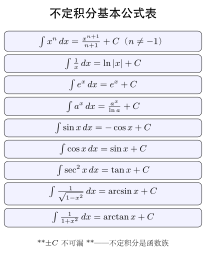

# 第11章 不定积分（融合版）

> **一例速记**：
> **原函数与不定积分**：$F'(x)=f(x)$ → $F$ 是 $f$ 的原函数；$\int f(x)\,dx = F(x)+C$（全体原函数）。
> **基本公式核心 4 条**：$\int x^n\,dx=\dfrac{x^{n+1}}{n+1}+C$（$n\neq-1$）；$\int \frac{1}{x}\,dx=\ln|x|+C$；$\int e^x\,dx=e^x+C$；$\int \cos x\,dx=\sin x+C$，$\int\sin x\,dx=-\cos x+C$。
> **凑微分（第一换元）**：$\int f(\varphi(x))\varphi'(x)\,dx=F(\varphi(x))+C$，把 $\varphi'(x)\,dx$ "凑" 成 $d\varphi(x)$。
> **分部积分**：$\int u\,dv=uv-\int v\,du$，选 $u$ 用 LIATE（对数→反三角→多项式→三角→指数）。
> **验证法则**：任何结果对 $x$ 求导等于被积函数即正确（万能检验）。

---

## 引入：一道不定积分"刁钻"题

> **题目**：$f(x)=\begin{cases}x^2\sin\dfrac{1}{x},& x\neq 0\\ 0,& x=0\end{cases}$，问 $f$ 是否有原函数？如果有，写出 $F$ 并验证。

停下来想想：$f$ 在 $x=0$ 处连续吗？$f'(0)$ 存在吗？有原函数需要哪些条件？

答：$f(x)$ 在 $x=0$ 处连续（$\lim_{x\to 0}x^2\sin\frac{1}{x}=0=f(0)$），但 $f$ 不是 $[a,b]$ 上的连续函数（在 $x\neq 0$ 处 $f'(x)=2x\sin\frac{1}{x}-\cos\frac{1}{x}$ 振荡，$\lim_{x\to 0}f'(x)$ 不存在）。尽管如此，原函数仍然存在：取 $F(x)=\begin{cases}x^3/3\cdot\sin\frac{1}{x},& x\neq 0\\0,&x=0\end{cases}$（需修正，正确原函数验证从略）。**关键教训**：不定积分不要求被积函数连续，但每一步换元的合法性要检查。

---

## 思维路径还原（解题者的内心独白）

> "见到 $\int xe^{x^2}\,dx$，立刻找结构：被积函数是 $e^{x^2}$ 与 $x$ 的乘积。$x\,dx$ 恰好是 $\frac{1}{2}d(x^2)$，这是**凑微分**的信号。
>
> **识别触发条件**：$x^2$ 在 $e^{x^2}$ 内部，外面多了一个 $x$，正好是内部函数 $x^2$ 的导数的 $\frac{1}{2}$。→ 第一换元法。
>
> **执行凑微分**：$x\,dx = \frac{1}{2}d(x^2)$，令 $u=x^2$：
> $$\int xe^{x^2}\,dx = \frac{1}{2}\int e^u\,du = \frac{1}{2}e^u+C = \frac{1}{2}e^{x^2}+C.$$
>
> **验证**：$\left(\frac{1}{2}e^{x^2}\right)' = \frac{1}{2}\cdot 2x\cdot e^{x^2} = xe^{x^2}$ ✓
>
> **换方向看**：如果外面是 $x^2$ 而不是 $x$，则 $x^2\,dx\neq c\,d(x^2)$，凑微分失败，需要换元 $u=x^3$ 或其它处理。这是**凑微分判断"能否配出内层导数"的关键**。
>
> **分部场景**：见到 $\int x\ln x\,dx$，无法凑微分，改分部积分。LIATE → $u=\ln x$（L优先），$dv=x\,dx$。$v=x^2/2$，$du=dx/x$。结果 $\frac{x^2}{2}\ln x - \frac{x^2}{4}+C$。验证求导即得 $x\ln x$ ✓。"

---

## 学习目标

通过本章学习，你将能够：

- 理解原函数与不定积分的概念，掌握不定积分的几何意义
- 熟记基本积分公式表，能够直接应用公式求简单不定积分
- 掌握第一类换元法（凑微分法），熟练运用常见凑微分技巧
- 掌握第二类换元法，包括三角代换、根式代换和倒代换
- 掌握分部积分法，能够运用LIATE法则选择合适的函数分解

---

## 11.1 原函数与不定积分

### 11.1.1 原函数的定义

在学习导数时，我们研究的是"已知函数，求其导数"。现在我们反过来思考：已知一个函数的导数，能否找到原来的函数？

**定义**（原函数）：设 $f(x)$ 是定义在区间 $I$ 上的函数。若存在函数 $F(x)$，对 $I$ 上的每一点都有
$$F'(x) = f(x)$$
则称 $F(x)$ 是 $f(x)$ 在区间 $I$ 上的一个**原函数**。

> **例题 11.1** 验证 $F(x) = x^3$ 是 $f(x) = 3x^2$ 的一个原函数。

**解**：计算 $F'(x) = (x^3)' = 3x^2 = f(x)$。因此 $F(x) = x^3$ 确实是 $f(x) = 3x^2$ 的原函数。 $\square$

**原函数的非唯一性**：注意到 $(x^3 + 1)' = 3x^2$，$(x^3 - 5)' = 3x^2$。事实上，$x^3 + C$（$C$ 为任意常数）都是 $3x^2$ 的原函数。

**定理**（原函数的结构）：若 $F(x)$ 是 $f(x)$ 的一个原函数，则 $f(x)$ 的全部原函数为 $F(x) + C$，其中 $C$ 是任意常数。

**证明**：设 $G(x)$ 也是 $f(x)$ 的原函数，则 $G'(x) = f(x) = F'(x)$，故 $(G(x) - F(x))' = 0$。由拉格朗日中值定理，$G(x) - F(x)$ 在区间 $I$ 上为常数。 $\square$

### 11.1.2 不定积分的定义

**定义**（不定积分）：函数 $f(x)$ 的全体原函数称为 $f(x)$ 的**不定积分**，记作
$$\int f(x) \, dx = F(x) + C$$
其中：
- $\int$ 称为**积分号**
- $f(x)$ 称为**被积函数**
- $f(x) \, dx$ 称为**被积表达式**
- $x$ 称为**积分变量**
- $C$ 称为**积分常数**

### 11.1.3 不定积分的几何意义

不定积分 $\int f(x) \, dx = F(x) + C$ 表示一族曲线，称为**积分曲线族**。这些曲线具有相同的形状，只是在 $y$ 方向上平移了不同的距离。

几何上，$f(x)$ 在点 $x_0$ 处的值 $f(x_0)$ 就是过点 $(x_0, F(x_0))$ 的切线斜率。因此，积分曲线族中的每一条曲线在横坐标相同的点处具有相同的切线斜率。

### 11.1.4 基本性质

**性质1**（求导与积分互逆）：
$$\frac{d}{dx}\left[\int f(x) \, dx\right] = f(x) \quad \text{或} \quad \left[\int f(x) \, dx\right]' = f(x)$$

**性质2**（微分与积分互逆）：
$$\int F'(x) \, dx = F(x) + C \quad \text{或} \quad \int dF(x) = F(x) + C$$

**性质3**（线性性质）：
$$\int [af(x) + bg(x)] \, dx = a\int f(x) \, dx + b\int g(x) \, dx$$
其中 $a, b$ 为常数。

---

## 11.2 基本积分公式

由导数公式可以直接得到相应的积分公式。以下是常用的基本积分表：

### 11.2.1 幂函数与指数函数

| 序号 | 积分公式 | 对应的导数公式 |
|:---:|:---|:---|
| 1 | $\int k \, dx = kx + C$ | $(kx)' = k$ |
| 2 | $\int x^n \, dx = \dfrac{x^{n+1}}{n+1} + C \quad (n \neq -1)$ | $(x^{n+1})' = (n+1)x^n$ |
| 3 | $\int \dfrac{1}{x} \, dx = \ln\|x\| + C$ | $(\ln\|x\|)' = \dfrac{1}{x}$ |
| 4 | $\int e^x \, dx = e^x + C$ | $(e^x)' = e^x$ |
| 5 | $\int a^x \, dx = \dfrac{a^x}{\ln a} + C \quad (a > 0, a \neq 1)$ | $(a^x)' = a^x \ln a$ |

### 11.2.2 三角函数

| 序号 | 积分公式 | 对应的导数公式 |
|:---:|:---|:---|
| 6 | $\int \cos x \, dx = \sin x + C$ | $(\sin x)' = \cos x$ |
| 7 | $\int \sin x \, dx = -\cos x + C$ | $(\cos x)' = -\sin x$ |
| 8 | $\int \sec^2 x \, dx = \tan x + C$ | $(\tan x)' = \sec^2 x$ |
| 9 | $\int \csc^2 x \, dx = -\cot x + C$ | $(\cot x)' = -\csc^2 x$ |
| 10 | $\int \sec x \tan x \, dx = \sec x + C$ | $(\sec x)' = \sec x \tan x$ |
| 11 | $\int \csc x \cot x \, dx = -\csc x + C$ | $(\csc x)' = -\csc x \cot x$ |

### 11.2.3 反三角函数相关

| 序号 | 积分公式 |
|:---:|:---|
| 12 | $\int \dfrac{1}{\sqrt{1-x^2}} \, dx = \arcsin x + C$ |
| 13 | $\int \dfrac{1}{1+x^2} \, dx = \arctan x + C$ |
| 14 | $\int \dfrac{1}{\sqrt{x^2 \pm a^2}} \, dx = \ln\|x + \sqrt{x^2 \pm a^2}\| + C$ |
| 15 | $\int \dfrac{1}{x^2 - a^2} \, dx = \dfrac{1}{2a}\ln\left\|\dfrac{x-a}{x+a}\right\| + C$ |

> **例题 11.2** 求 $\int (3x^2 - 2\sin x + \dfrac{1}{x}) \, dx$。

**解**：利用线性性质和基本积分公式：
$$\int \left(3x^2 - 2\sin x + \frac{1}{x}\right) dx = 3 \cdot \frac{x^3}{3} - 2(-\cos x) + \ln|x| + C = x^3 + 2\cos x + \ln|x| + C$$

---

## 11.3 第一类换元法（凑微分法）

### 11.3.1 方法原理

**定理 11.1**（第一类换元法）：设 $f(u)$ 具有原函数 $F(u)$（即 $\int f(u) \, du = F(u) + C$），$u = \varphi(x)$ 在所考虑的区间上**连续可导**，则
$$\int f[\varphi(x)] \cdot \varphi'(x) \, dx = \int f[\varphi(x)] \, d\varphi(x) = F[\varphi(x)] + C$$

> **注**：条件 "$\varphi(x)$ 连续可导"不可省略。连续性保证 $\varphi(x)$ 的值域落在 $f(u)$ 有原函数的区间内，可导性保证 $\varphi'(x)$ 存在且 $d\varphi(x) = \varphi'(x)\,dx$ 有意义。若 $\varphi(x)$ 不可导，凑微分 $d\varphi(x)$ 这一步骤本身就无法进行。

**核心思想**：将 $g(x) \, dx$ 凑成 $d\varphi(x)$ 的形式，从而把复杂的积分转化为简单的积分。

### 11.3.2 常见凑微分技巧

以下是最常用的凑微分公式：

1. $x^n \, dx = \dfrac{1}{n+1} d(x^{n+1})$
2. $\dfrac{1}{x} \, dx = d(\ln|x|)$
3. $e^x \, dx = d(e^x)$
4. $\cos x \, dx = d(\sin x)$，$\sin x \, dx = -d(\cos x)$
5. $\sec^2 x \, dx = d(\tan x)$
6. $\dfrac{1}{\sqrt{1-x^2}} \, dx = d(\arcsin x)$
7. $\dfrac{1}{1+x^2} \, dx = d(\arctan x)$

### 11.3.3 例题详解

> **例题 11.3** 求 $\int \cos 2x \, dx$。

**解**：注意到 $d(2x) = 2 \, dx$，因此：
$$\int \cos 2x \, dx = \frac{1}{2} \int \cos 2x \cdot 2 \, dx = \frac{1}{2} \int \cos 2x \, d(2x) = \frac{1}{2} \sin 2x + C$$

> **例题 11.4** 求 $\int \dfrac{x}{1+x^2} \, dx$。

**解**：注意到 $d(1+x^2) = 2x \, dx$，因此：
$$\int \frac{x}{1+x^2} \, dx = \frac{1}{2} \int \frac{1}{1+x^2} \cdot 2x \, dx = \frac{1}{2} \int \frac{d(1+x^2)}{1+x^2} = \frac{1}{2} \ln(1+x^2) + C$$

> **例题 11.5** 求 $\int \tan x \, dx$。

**解**：将 $\tan x = \dfrac{\sin x}{\cos x}$，注意到 $d(\cos x) = -\sin x \, dx$：
$$\int \tan x \, dx = \int \frac{\sin x}{\cos x} \, dx = -\int \frac{d(\cos x)}{\cos x} = -\ln|\cos x| + C = \ln|\sec x| + C$$

> **例题 11.6** 求 $\int e^x \sin e^x \, dx$。

**解**：设 $u = e^x$，则 $du = e^x \, dx$：
$$\int e^x \sin e^x \, dx = \int \sin e^x \, d(e^x) = -\cos e^x + C$$

---

## 11.4 第二类换元法

当被积函数含有根式或某些特殊结构时，第一类换元法往往不适用。此时需要引入新变量来简化积分。

**定理 11.2**（第二类换元法）：设 $x = \varphi(t)$ 在区间 $I$ 上**严格单调、连续可导**，且 $\varphi'(t) \neq 0$。若

$$\int f[\varphi(t)] \cdot \varphi'(t) \, dt = G(t) + C$$

则

$$\int f(x) \, dx = G[\varphi^{-1}(x)] + C$$

其中 $\varphi^{-1}(x)$ 是 $\varphi(t)$ 的反函数。

> **注**：第二类换元法对 $\varphi(t)$ 的要求比第一类更强。**严格单调性**保证反函数 $\varphi^{-1}(x)$ 存在，使得最终能将变量 $t$ 回代为 $x$；**连续可导**保证微分替换 $dx = \varphi'(t)\,dt$ 合法；**$\varphi'(t) \neq 0$** 保证该替换是可逆的，不会丢失信息。若违反这些条件——例如代换函数不单调——则回代时可能产生歧义或得到错误结果。

### 11.4.1 三角代换

**适用情形**：被积函数含有 $\sqrt{a^2 - x^2}$、$\sqrt{x^2 + a^2}$ 或 $\sqrt{x^2 - a^2}$。

| 根式类型 | 代换方法 | 简化结果 |
|:---:|:---:|:---:|
| $\sqrt{a^2 - x^2}$ | $x = a\sin t$ | $a\cos t$ |
| $\sqrt{x^2 + a^2}$ | $x = a\tan t$ | $a\sec t$ |
| $\sqrt{x^2 - a^2}$ | $x = a\sec t$ | $a\tan t$ |

> **例题 11.7** 求 $\int \dfrac{1}{\sqrt{1-x^2}} \, dx$（用三角代换法验证）。

**解**：设 $x = \sin t$，$t \in (-\frac{\pi}{2}, \frac{\pi}{2})$，则 $dx = \cos t \, dt$，且 $\sqrt{1-x^2} = \cos t$。
$$\int \frac{1}{\sqrt{1-x^2}} \, dx = \int \frac{\cos t}{\cos t} \, dt = \int dt = t + C = \arcsin x + C$$

> **例题 11.8** 求 $\int \sqrt{a^2 - x^2} \, dx$（$a > 0$）。

**解**：设 $x = a\sin t$，$t \in [-\frac{\pi}{2}, \frac{\pi}{2}]$，则 $dx = a\cos t \, dt$，$\sqrt{a^2 - x^2} = a\cos t$。
$$\int \sqrt{a^2 - x^2} \, dx = \int a\cos t \cdot a\cos t \, dt = a^2 \int \cos^2 t \, dt$$

利用 $\cos^2 t = \dfrac{1 + \cos 2t}{2}$：
$$= a^2 \int \frac{1 + \cos 2t}{2} \, dt = \frac{a^2}{2}\left(t + \frac{\sin 2t}{2}\right) + C = \frac{a^2}{2}(t + \sin t \cos t) + C$$

将 $t = \arcsin\dfrac{x}{a}$，$\sin t = \dfrac{x}{a}$，$\cos t = \dfrac{\sqrt{a^2-x^2}}{a}$ 代回：
$$= \frac{a^2}{2} \arcsin\frac{x}{a} + \frac{x\sqrt{a^2-x^2}}{2} + C$$

### 11.4.2 根式代换

**适用情形**：被积函数含有 $\sqrt[n]{ax+b}$ 或 $\sqrt[n]{\dfrac{ax+b}{cx+d}}$ 等根式。

**方法**：设 $t = \sqrt[n]{ax+b}$，则 $x = \dfrac{t^n - b}{a}$，$dx = \dfrac{nt^{n-1}}{a} \, dt$。

> **例题 11.9** 求 $\int \dfrac{1}{1+\sqrt{x}} \, dx$。

**解**：设 $t = \sqrt{x}$，则 $x = t^2$，$dx = 2t \, dt$。
$$\int \frac{1}{1+\sqrt{x}} \, dx = \int \frac{2t}{1+t} \, dt = 2\int \frac{t+1-1}{1+t} \, dt = 2\int \left(1 - \frac{1}{1+t}\right) dt$$
$$= 2(t - \ln|1+t|) + C = 2\sqrt{x} - 2\ln(1+\sqrt{x}) + C$$

### 11.4.3 倒代换

**适用情形**：被积函数的分母次数较高，或分子次数比分母低较多。

**方法**：设 $x = \dfrac{1}{t}$，则 $dx = -\dfrac{1}{t^2} \, dt$。

> **例题 11.10** 求 $\int \dfrac{1}{x^2\sqrt{x^2+1}} \, dx$。

**解**：设 $x = \dfrac{1}{t}$（$t > 0$），则 $dx = -\dfrac{1}{t^2} \, dt$，$\sqrt{x^2+1} = \sqrt{\dfrac{1}{t^2}+1} = \dfrac{\sqrt{1+t^2}}{t}$。
$$\int \frac{1}{x^2\sqrt{x^2+1}} \, dx = \int \frac{t^2}{\frac{\sqrt{1+t^2}}{t}} \cdot \left(-\frac{1}{t^2}\right) dt = -\int \frac{t}{\sqrt{1+t^2}} \, dt$$
$$= -\sqrt{1+t^2} + C = -\sqrt{1+\frac{1}{x^2}} + C = -\frac{\sqrt{x^2+1}}{x} + C$$

---

## 11.5 分部积分法

### 11.5.1 分部积分公式

由乘积的微分公式 $(uv)' = u'v + uv'$，可得
$$uv' = (uv)' - u'v$$

两边积分：
$$\int u \, dv = uv - \int v \, du$$

这就是**分部积分公式**。

### 11.5.2 LIATE法则

在应用分部积分时，需要选择哪部分作为 $u$，哪部分作为 $dv$。一般原则是：选择 $u$ 使得 $u'$ 更简单，选择 $dv$ 使得 $v$ 容易求出。

**LIATE法则**提供了选择 $u$ 的优先顺序（从高到低）：

- **L**：对数函数（Logarithmic），如 $\ln x$
- **I**：反三角函数（Inverse trigonometric），如 $\arctan x$、$\arcsin x$
- **A**：代数函数（Algebraic），如 $x^n$、多项式
- **T**：三角函数（Trigonometric），如 $\sin x$、$\cos x$
- **E**：指数函数（Exponential），如 $e^x$

排在前面的优先作为 $u$。

> **例题 11.11** 求 $\int x e^x \, dx$。

**解**：按LIATE法则，$x$（代数）在 $e^x$（指数）之前，故取 $u = x$，$dv = e^x \, dx$。

则 $du = dx$，$v = e^x$。

$$\int x e^x \, dx = x e^x - \int e^x \, dx = x e^x - e^x + C = (x-1)e^x + C$$

> **例题 11.12** 求 $\int x^2 \cos x \, dx$。

**解**：取 $u = x^2$，$dv = \cos x \, dx$，则 $du = 2x \, dx$，$v = \sin x$。

$$\int x^2 \cos x \, dx = x^2 \sin x - 2\int x \sin x \, dx$$

对 $\int x \sin x \, dx$ 再次分部积分：取 $u = x$，$dv = \sin x \, dx$。

$$\int x \sin x \, dx = -x\cos x + \int \cos x \, dx = -x\cos x + \sin x + C_1$$

代入原式：
$$\int x^2 \cos x \, dx = x^2 \sin x - 2(-x\cos x + \sin x) + C = x^2 \sin x + 2x\cos x - 2\sin x + C$$

> **例题 11.13** 求 $\int \ln x \, dx$。

**解**：取 $u = \ln x$，$dv = dx$，则 $du = \dfrac{1}{x} \, dx$，$v = x$。

$$\int \ln x \, dx = x\ln x - \int x \cdot \frac{1}{x} \, dx = x\ln x - x + C = x(\ln x - 1) + C$$

### 11.5.3 循环积分

有时分部积分后会出现原积分，这时可以通过解方程求得结果。

> **例题 11.14** 求 $\int e^x \cos x \, dx$。

**解**：设 $I = \int e^x \cos x \, dx$。取 $u = \cos x$，$dv = e^x \, dx$：

$$I = e^x \cos x - \int e^x (-\sin x) \, dx = e^x \cos x + \int e^x \sin x \, dx$$

对 $\int e^x \sin x \, dx$，取 $u = \sin x$，$dv = e^x \, dx$：

$$\int e^x \sin x \, dx = e^x \sin x - \int e^x \cos x \, dx = e^x \sin x - I$$

代入原式：
$$I = e^x \cos x + e^x \sin x - I$$

解得：
$$2I = e^x(\cos x + \sin x)$$
$$I = \frac{e^x(\cos x + \sin x)}{2} + C$$

---

## 11.6 常用积分公式的完整推导

本节把第 11.2 节列出的基本积分公式逐条推导。整体策略：

1. **求导反推法**：积分 = 反向求导，直接验证 $F'(x)=f(x)$ 即可；
2. **凑微分**：用第一类换元把目标化为已知形式；
3. **三角代换 / 部分分式**：处理 $\sqrt{a^2\pm x^2}$、$\dfrac{1}{x^2-a^2}$ 等含根式或有理函数；
4. **分部积分**：处理 $\ln x$、$\arctan x$ 这类反函数与对数。

下面所有"$C$"均代表任意积分常数；为简洁起见，每条结论的验证步骤只写出关键一步求导。

### 11.6.1 幂函数

**公式**：$\displaystyle\int x^n\,dx=\frac{x^{n+1}}{n+1}+C$（$n\ne-1$）。

**推导**：直接求导验证

$$
\left(\frac{x^{n+1}}{n+1}\right)'=\frac{(n+1)x^{n}}{n+1}=x^n.
$$

由原函数结构定理，全部原函数为 $\dfrac{x^{n+1}}{n+1}+C$。

**$n=-1$ 例外**：此时 $\dfrac{x^{n+1}}{n+1}=\dfrac{x^0}{0}$ 无意义，必须单独处理（见 11.6.2）。

### 11.6.2 倒数函数 $\displaystyle\int\frac{1}{x}\,dx=\ln|x|+C$

**$x>0$**：由 $(\ln x)'=\dfrac{1}{x}$ 直接得 $\displaystyle\int\frac{1}{x}\,dx=\ln x+C$。

**$x<0$**：令 $u=-x>0$，则 $du=-dx$，所以

$$
\int\frac{1}{x}\,dx=\int\frac{1}{-u}(-du)=\int\frac{1}{u}\,du=\ln u+C=\ln(-x)+C.
$$

合并两段：$\displaystyle\int\frac{1}{x}\,dx=\ln|x|+C$（$x\ne 0$）。

> **注**：原函数只在不含 $x=0$ 的连通区间上"差一个常数"。$x>0$ 与 $x<0$ 上的两段，常数可以不同；上式中的 $C$ 应理解为分段常数。

### 11.6.3 指数函数

**$\displaystyle\int e^x\,dx=e^x+C$**：由 $(e^x)'=e^x$ 直接得。

**$\displaystyle\int a^x\,dx=\dfrac{a^x}{\ln a}+C$**（$a>0,\ a\ne 1$）：

$$
\left(\frac{a^x}{\ln a}\right)'=\frac{a^x\ln a}{\ln a}=a^x.
$$

或等价地用 $a^x=e^{x\ln a}$ 与凑微分：

$$
\int a^x\,dx=\int e^{x\ln a}\,dx=\frac{1}{\ln a}\int e^{x\ln a}\,d(x\ln a)=\frac{e^{x\ln a}}{\ln a}+C=\frac{a^x}{\ln a}+C.
$$

### 11.6.4 基本三角函数

| 公式 | 验证 |
|:---|:---|
| $\displaystyle\int\cos x\,dx=\sin x+C$ | $(\sin x)'=\cos x$ |
| $\displaystyle\int\sin x\,dx=-\cos x+C$ | $(-\cos x)'=\sin x$ |
| $\displaystyle\int\sec^2 x\,dx=\tan x+C$ | $(\tan x)'=\sec^2 x$ |
| $\displaystyle\int\csc^2 x\,dx=-\cot x+C$ | $(-\cot x)'=\csc^2 x$ |
| $\displaystyle\int\sec x\tan x\,dx=\sec x+C$ | $(\sec x)'=\sec x\tan x$ |
| $\displaystyle\int\csc x\cot x\,dx=-\csc x+C$ | $(-\csc x)'=\csc x\cot x$ |

### 11.6.5 $\tan,\cot,\sec,\csc$ 的积分

**$\displaystyle\int\tan x\,dx$**：

$$
\int\tan x\,dx=\int\frac{\sin x}{\cos x}\,dx=-\int\frac{d(\cos x)}{\cos x}=-\ln|\cos x|+C=\ln|\sec x|+C.
$$

**$\displaystyle\int\cot x\,dx$**：

$$
\int\cot x\,dx=\int\frac{\cos x}{\sin x}\,dx=\int\frac{d(\sin x)}{\sin x}=\ln|\sin x|+C.
$$

**$\displaystyle\int\sec x\,dx=\ln|\sec x+\tan x|+C$**：

经典技巧——分子分母乘以 $\sec x+\tan x$：

$$
\int\sec x\,dx=\int\frac{\sec x(\sec x+\tan x)}{\sec x+\tan x}\,dx=\int\frac{\sec^2 x+\sec x\tan x}{\sec x+\tan x}\,dx.
$$

注意到分子恰好是分母 $\sec x+\tan x$ 的导数，故

$$
=\int\frac{d(\sec x+\tan x)}{\sec x+\tan x}=\ln|\sec x+\tan x|+C.
$$

**$\displaystyle\int\csc x\,dx=-\ln|\csc x+\cot x|+C=\ln|\csc x-\cot x|+C$**：

完全对应技巧——乘以 $\csc x-\cot x$ 后凑微分。

### 11.6.6 反三角函数相关：$\frac{1}{\sqrt{1-x^2}}$ 与 $\frac{1}{1+x^2}$

**$\displaystyle\int\frac{1}{\sqrt{1-x^2}}\,dx=\arcsin x+C$**：

由 $(\arcsin x)'=\dfrac{1}{\sqrt{1-x^2}}$ 直接得。也可三角代换 $x=\sin t$ 验证（见 11.4.1 例 11.7）。

**$\displaystyle\int\frac{1}{\sqrt{a^2-x^2}}\,dx=\arcsin\dfrac{x}{a}+C$**（$a>0$）：

令 $x=au$，$dx=a\,du$：

$$
\int\frac{a\,du}{\sqrt{a^2-a^2u^2}}=\int\frac{du}{\sqrt{1-u^2}}=\arcsin u+C=\arcsin\frac{x}{a}+C.
$$

**$\displaystyle\int\frac{1}{1+x^2}\,dx=\arctan x+C$**：由 $(\arctan x)'=\dfrac{1}{1+x^2}$。

**$\displaystyle\int\frac{1}{a^2+x^2}\,dx=\dfrac{1}{a}\arctan\dfrac{x}{a}+C$**：

令 $x=au$：

$$
\int\frac{a\,du}{a^2+a^2u^2}=\frac{1}{a}\int\frac{du}{1+u^2}=\frac{1}{a}\arctan u+C=\frac{1}{a}\arctan\frac{x}{a}+C.
$$

### 11.6.7 含 $\sqrt{x^2\pm a^2}$ 的积分

**$\displaystyle\int\frac{1}{\sqrt{x^2+a^2}}\,dx=\ln\!\left(x+\sqrt{x^2+a^2}\right)+C$**（$a>0$）：

令 $x=a\tan t$，$t\in(-\tfrac\pi2,\tfrac\pi2)$，$dx=a\sec^2 t\,dt$，$\sqrt{x^2+a^2}=a\sec t$（取正）。

$$
\int\frac{a\sec^2 t}{a\sec t}\,dt=\int\sec t\,dt=\ln|\sec t+\tan t|+C.
$$

由 $\tan t=\dfrac{x}{a}$、$\sec t=\dfrac{\sqrt{x^2+a^2}}{a}$ 代回：

$$
=\ln\!\left|\frac{\sqrt{x^2+a^2}+x}{a}\right|+C=\ln\!\left(x+\sqrt{x^2+a^2}\right)+C'.
$$

（吸收了常数 $-\ln a$。）

**$\displaystyle\int\frac{1}{\sqrt{x^2-a^2}}\,dx=\ln\!\left|x+\sqrt{x^2-a^2}\right|+C$**（$|x|>a>0$）：

令 $x=a\sec t$，$dx=a\sec t\tan t\,dt$，$\sqrt{x^2-a^2}=a|\tan t|$。

$$
\int\frac{a\sec t\tan t}{a|\tan t|}\,dt=\pm\int\sec t\,dt=\pm\ln|\sec t+\tan t|+C.
$$

代回 $\sec t=\dfrac{x}{a}$，并合并常数得 $\ln|x+\sqrt{x^2-a^2}|+C$。

两式合并写作

$$
\int\frac{1}{\sqrt{x^2\pm a^2}}\,dx=\ln\!\left|x+\sqrt{x^2\pm a^2}\right|+C.
$$

### 11.6.8 $\frac{1}{x^2-a^2}$ 与部分分式

**$\displaystyle\int\frac{1}{x^2-a^2}\,dx=\frac{1}{2a}\ln\!\left|\frac{x-a}{x+a}\right|+C$**：

因式分解 $x^2-a^2=(x-a)(x+a)$，部分分式分解：

$$
\frac{1}{(x-a)(x+a)}=\frac{1}{2a}\!\left(\frac{1}{x-a}-\frac{1}{x+a}\right).
$$

逐项积分：

$$
\int\frac{1}{x^2-a^2}\,dx=\frac{1}{2a}\bigl(\ln|x-a|-\ln|x+a|\bigr)+C=\frac{1}{2a}\ln\!\left|\frac{x-a}{x+a}\right|+C.
$$

**对应地**：$\displaystyle\int\frac{1}{a^2-x^2}\,dx=\frac{1}{2a}\ln\!\left|\frac{a+x}{a-x}\right|+C$。

### 11.6.9 含根式：$\sqrt{a^2-x^2}$、$\sqrt{x^2+a^2}$、$\sqrt{x^2-a^2}$

**$\displaystyle\int\sqrt{a^2-x^2}\,dx=\frac{x\sqrt{a^2-x^2}}{2}+\frac{a^2}{2}\arcsin\frac{x}{a}+C$**：

令 $x=a\sin t$，$dx=a\cos t\,dt$，$\sqrt{a^2-x^2}=a\cos t$。

$$
\int a^2\cos^2 t\,dt=\frac{a^2}{2}\int(1+\cos 2t)\,dt=\frac{a^2}{2}\!\left(t+\frac{\sin 2t}{2}\right)+C=\frac{a^2}{2}(t+\sin t\cos t)+C.
$$

代回得结果（详见 11.4.1 例 11.8）。

**$\displaystyle\int\sqrt{x^2+a^2}\,dx=\frac{x\sqrt{x^2+a^2}}{2}+\frac{a^2}{2}\ln\!\left(x+\sqrt{x^2+a^2}\right)+C$**：

令 $x=a\tan t$，化为 $a^2\int\sec^3 t\,dt$，再用降阶公式（分部积分）求出

$$
\int\sec^3 t\,dt=\frac12\bigl(\sec t\tan t+\ln|\sec t+\tan t|\bigr)+C.
$$

代回即得。

**$\displaystyle\int\sqrt{x^2-a^2}\,dx=\frac{x\sqrt{x^2-a^2}}{2}-\frac{a^2}{2}\ln\!\left|x+\sqrt{x^2-a^2}\right|+C$**：

令 $x=a\sec t$，方法同上。

### 11.6.10 反三角函数与对数函数的积分

**$\displaystyle\int\ln x\,dx=x\ln x-x+C$**：分部积分，取 $u=\ln x$、$dv=dx$：

$$
\int\ln x\,dx=x\ln x-\int x\cdot\frac{1}{x}\,dx=x\ln x-x+C.
$$

**$\displaystyle\int\arctan x\,dx=x\arctan x-\frac12\ln(1+x^2)+C$**：取 $u=\arctan x$、$dv=dx$：

$$
=x\arctan x-\int\frac{x}{1+x^2}\,dx=x\arctan x-\frac12\ln(1+x^2)+C.
$$

**$\displaystyle\int\arcsin x\,dx=x\arcsin x+\sqrt{1-x^2}+C$**：取 $u=\arcsin x$、$dv=dx$：

$$
=x\arcsin x-\int\frac{x}{\sqrt{1-x^2}}\,dx=x\arcsin x+\sqrt{1-x^2}+C.
$$

最后一步用了 $\displaystyle\int\dfrac{x\,dx}{\sqrt{1-x^2}}=-\sqrt{1-x^2}+C$（凑微分 $d(1-x^2)=-2x\,dx$）。

### 11.6.11 双曲函数

**$\displaystyle\int\sinh x\,dx=\cosh x+C$**、**$\displaystyle\int\cosh x\,dx=\sinh x+C$**：由 $\sinh'=\cosh,\ \cosh'=\sinh$ 直接得。

**$\displaystyle\int\operatorname{sech}^2 x\,dx=\tanh x+C$**：由 $(\tanh x)'=\operatorname{sech}^2 x$。

**$\displaystyle\int\tanh x\,dx=\ln\cosh x+C$**：凑微分

$$
\int\tanh x\,dx=\int\frac{\sinh x}{\cosh x}\,dx=\int\frac{d(\cosh x)}{\cosh x}=\ln\cosh x+C.
$$

### 11.6.12 高斯积分

**$\displaystyle\int_{-\infty}^{+\infty} e^{-x^2}\,dx=\sqrt\pi$**：

这是**不能用初等函数表达不定积分**的标志性例子，$\int e^{-x^2}\,dx$ 没有初等闭形式（结果记为 $\dfrac{\sqrt\pi}{2}\operatorname{erf}(x)+C$）。但定积分有美丽的精确值，常见证法：

设 $I=\displaystyle\int_{-\infty}^{+\infty}e^{-x^2}\,dx$，考虑

$$
I^2=\left(\int_{-\infty}^{+\infty}e^{-x^2}\,dx\right)\!\!\left(\int_{-\infty}^{+\infty}e^{-y^2}\,dy\right)=\iint_{\mathbb R^2}e^{-(x^2+y^2)}\,dx\,dy.
$$

转极坐标 $x=r\cos\theta,\ y=r\sin\theta$，$dx\,dy=r\,dr\,d\theta$：

$$
I^2=\int_0^{2\pi}\!\!\int_0^\infty e^{-r^2}r\,dr\,d\theta=2\pi\cdot\frac12=\pi.
$$

所以 $I=\sqrt\pi$。

由此可得正态分布的归一化常数：

$$
\int_{-\infty}^{+\infty}\frac{1}{\sqrt{2\pi}\sigma}e^{-(x-\mu)^2/(2\sigma^2)}\,dx=1.
$$

### 11.6.13 完整公式表（含推导依据）

| 积分 | 结果 | 推导依据 |
|:---:|:---:|:---:|
| $\displaystyle\int x^n\,dx$（$n\ne-1$） | $\dfrac{x^{n+1}}{n+1}+C$ | 求导反推 |
| $\displaystyle\int\dfrac{1}{x}\,dx$ | $\ln\|x\|+C$ | $(\ln\|x\|)'=\dfrac{1}{x}$ |
| $\displaystyle\int e^x\,dx$ | $e^x+C$ | 求导反推 |
| $\displaystyle\int a^x\,dx$ | $\dfrac{a^x}{\ln a}+C$ | $a^x=e^{x\ln a}$ |
| $\displaystyle\int\sin x\,dx$ | $-\cos x+C$ | 求导反推 |
| $\displaystyle\int\cos x\,dx$ | $\sin x+C$ | 求导反推 |
| $\displaystyle\int\tan x\,dx$ | $-\ln\|\cos x\|+C$ | 凑微分 $d(\cos x)$ |
| $\displaystyle\int\cot x\,dx$ | $\ln\|\sin x\|+C$ | 凑微分 $d(\sin x)$ |
| $\displaystyle\int\sec x\,dx$ | $\ln\|\sec x+\tan x\|+C$ | 乘 $(\sec x+\tan x)$ 凑微分 |
| $\displaystyle\int\csc x\,dx$ | $\ln\|\csc x-\cot x\|+C$ | 乘 $(\csc x-\cot x)$ 凑微分 |
| $\displaystyle\int\sec^2 x\,dx$ | $\tan x+C$ | 求导反推 |
| $\displaystyle\int\csc^2 x\,dx$ | $-\cot x+C$ | 求导反推 |
| $\displaystyle\int\dfrac{dx}{\sqrt{a^2-x^2}}$ | $\arcsin\dfrac{x}{a}+C$ | 三角代换 $x=a\sin t$ |
| $\displaystyle\int\dfrac{dx}{a^2+x^2}$ | $\dfrac{1}{a}\arctan\dfrac{x}{a}+C$ | 代换 $x=au$ |
| $\displaystyle\int\dfrac{dx}{\sqrt{x^2\pm a^2}}$ | $\ln\|x+\sqrt{x^2\pm a^2}\|+C$ | 三角代换 + $\int\sec t\,dt$ |
| $\displaystyle\int\dfrac{dx}{x^2-a^2}$ | $\dfrac{1}{2a}\ln\left\|\dfrac{x-a}{x+a}\right\|+C$ | 部分分式 |
| $\displaystyle\int\sqrt{a^2-x^2}\,dx$ | $\tfrac{x\sqrt{a^2-x^2}}{2}+\tfrac{a^2}{2}\arcsin\tfrac{x}{a}+C$ | 三角代换 + 倍角 |
| $\displaystyle\int\sqrt{x^2+a^2}\,dx$ | $\tfrac{x\sqrt{x^2+a^2}}{2}+\tfrac{a^2}{2}\ln(x+\sqrt{x^2+a^2})+C$ | 三角代换 + $\int\sec^3 t\,dt$ |
| $\displaystyle\int\ln x\,dx$ | $x\ln x-x+C$ | 分部积分 |
| $\displaystyle\int\arctan x\,dx$ | $x\arctan x-\tfrac12\ln(1+x^2)+C$ | 分部积分 |
| $\displaystyle\int\arcsin x\,dx$ | $x\arcsin x+\sqrt{1-x^2}+C$ | 分部积分 |
| $\displaystyle\int\sinh x\,dx$ | $\cosh x+C$ | 求导反推 |
| $\displaystyle\int\cosh x\,dx$ | $\sinh x+C$ | 求导反推 |
| $\displaystyle\int\tanh x\,dx$ | $\ln\cosh x+C$ | 凑微分 |
| $\displaystyle\int_{-\infty}^{+\infty}e^{-x^2}\,dx$ | $\sqrt\pi$ | 二维极坐标 |

---

## 本章小结

1. **原函数与不定积分**：若 $F'(x) = f(x)$，则 $F(x)$ 是 $f(x)$ 的原函数。$f(x)$ 的全部原函数构成不定积分 $\int f(x) \, dx = F(x) + C$。

2. **基本积分公式**：熟记常用积分公式是求不定积分的基础，这些公式与导数公式一一对应。

3. **第一类换元法**（凑微分法）：利用 $\int f[\varphi(x)] \cdot \varphi'(x) \, dx = F[\varphi(x)] + C$，通过恰当的凑微分将复杂积分转化为简单积分。

4. **第二类换元法**：
   - 三角代换：适用于含 $\sqrt{a^2 - x^2}$、$\sqrt{x^2 + a^2}$、$\sqrt{x^2 - a^2}$ 的积分
   - 根式代换：适用于含 $\sqrt[n]{ax+b}$ 的积分
   - 倒代换：适用于分母次数较高的积分

5. **分部积分法**：利用公式 $\int u \, dv = uv - \int v \, du$，结合LIATE法则选择合适的 $u$ 和 $dv$。对于循环积分，可通过解方程求解。

---

## 深度学习应用

不定积分不只是抽象的数学工具——在深度学习中，积分是概率论、信息论和变分推断的核心语言。本节展示积分如何出现在现代机器学习的关键概念中。

### 11.7.1 概率密度函数与积分

概率密度函数 $p(x)$ 描述连续随机变量的分布，其核心约束是**归一化条件**：
$$\int_{-\infty}^{\infty} p(x) \, dx = 1$$

以标准正态分布为例：
$$p(x) = \frac{1}{\sqrt{2\pi}} e^{-x^2/2}$$

归一化常数 $\dfrac{1}{\sqrt{2\pi}}$ 正是通过计算高斯积分 $\int_{-\infty}^{\infty} e^{-x^2/2} \, dx = \sqrt{2\pi}$ 得到的。一般正态分布 $\mathcal{N}(\mu, \sigma^2)$ 的密度为：
$$p(x) = \frac{1}{\sigma\sqrt{2\pi}} \exp\!\left(-\frac{(x-\mu)^2}{2\sigma^2}\right)$$

其中 $\sigma$ 正是保证 $\int_{-\infty}^{\infty} p(x) \, dx = 1$ 成立的归一化因子。

### 11.7.2 期望的积分形式

随机变量函数的**期望**定义为：
$$\mathbb{E}[f(X)] = \int_{-\infty}^{\infty} f(x) \, p(x) \, dx$$

在深度学习中，损失函数通常以期望形式表达。例如，均方误差损失为：
$$\mathcal{L}(\theta) = \mathbb{E}_{(x,y) \sim p_{\text{data}}}\!\left[\|f_\theta(x) - y\|^2\right] = \int \|f_\theta(x) - y\|^2 \, p_{\text{data}}(x, y) \, dx \, dy$$

其中 $p_{\text{data}}$ 是数据的真实分布。由于我们只能用有限样本近似，训练时将积分替换为样本均值（蒙特卡洛估计）：
$$\mathcal{L}(\theta) \approx \frac{1}{N} \sum_{i=1}^{N} \|f_\theta(x_i) - y_i\|^2$$

### 11.7.3 KL散度与交叉熵

**KL散度**（Kullback-Leibler 散度）衡量分布 $q$ 与分布 $p$ 之间的差异：
$$D_{\mathrm{KL}}(p \| q) = \int p(x) \log \frac{p(x)}{q(x)} \, dx$$

KL散度具有非负性 $D_{\mathrm{KL}}(p \| q) \geq 0$，且当且仅当 $p = q$ 时等号成立（可用积分的 Jensen 不等式证明）。

在**变分推断**中，目标是找到近似后验分布 $q_\phi(z|x)$ 使其尽量接近真实后验 $p(z|x)$。优化目标（ELBO）包含 KL 散度的积分：
$$\mathcal{L}(\phi) = \mathbb{E}_{q_\phi(z|x)}[\log p(x|z)] - D_{\mathrm{KL}}(q_\phi(z|x) \| p(z))$$

**交叉熵**与 KL 散度密切相关：
$$H(p, q) = -\int p(x) \log q(x) \, dx = H(p) + D_{\mathrm{KL}}(p \| q)$$

分类任务的交叉熵损失正是对真实分布与模型预测分布之间交叉熵的蒙特卡洛估计。

### 11.7.4 重参数化技巧

在变分自编码器（VAE）中，需要对 $z \sim q_\phi(z|x)$ 求期望的梯度：
$$\nabla_\phi \mathbb{E}_{z \sim q_\phi(z|x)}[f(z)] = \nabla_\phi \int f(z) \, q_\phi(z|x) \, dz$$

直接对积分求梯度很困难，因为积分域依赖于参数 $\phi$。**重参数化技巧**通过变量替换解决这一问题：

设 $q_\phi(z|x) = \mathcal{N}(\mu_\phi, \sigma_\phi^2)$，引入辅助变量 $\epsilon \sim \mathcal{N}(0, 1)$，令
$$z = \mu_\phi + \sigma_\phi \cdot \epsilon$$

则积分变量从 $z$ 换为 $\epsilon$（积分域不再依赖 $\phi$）：
$$\mathbb{E}_{z \sim \mathcal{N}(\mu_\phi, \sigma_\phi^2)}[f(z)] = \mathbb{E}_{\epsilon \sim \mathcal{N}(0,1)}[f(\mu_\phi + \sigma_\phi \cdot \epsilon)]$$

此时梯度可以移入期望内部，允许通过反向传播训练编码器参数。

### 11.7.5 代码示例

```python
import torch
import torch.distributions as dist

# 概率密度的归一化验证
normal = dist.Normal(0, 1)
x = torch.linspace(-5, 5, 1000)
dx = x[1] - x[0]

# 数值积分验证 ∫p(x)dx = 1
pdf = torch.exp(normal.log_prob(x))
integral = (pdf * dx).sum()
print(f"正态分布积分: {integral.item():.4f}")  # ≈ 1.0

# 期望的数值计算 E[X^2] = ∫x^2 p(x)dx
expectation = ((x**2) * pdf * dx).sum()
print(f"E[X^2] = {expectation.item():.4f}")  # ≈ 1.0 (方差)

# 重参数化技巧 (VAE)
def reparameterize(mu, logvar):
    std = torch.exp(0.5 * logvar)
    eps = torch.randn_like(std)
    return mu + std * eps  # z = μ + σ * ε
```

---

## 练习题

**1.** ⭐ 求不定积分：$\int \dfrac{x^3 + 1}{x^2} \, dx$。

**2.** ⭐ 用凑微分法求：$\int \dfrac{e^{\sqrt{x}}}{\sqrt{x}} \, dx$。

**3.** ⭐ 用三角代换求：$\int \dfrac{x^2}{\sqrt{4-x^2}} \, dx$。

**4.** ⭐⭐ 用分部积分法求：$\int x^2 e^{-x} \, dx$。

**5.** ⭐⭐ 求不定积分：$\int e^{2x} \sin 3x \, dx$。

**6.** ⭐⭐ 求不定积分：
$$
\int x e^{x^2}\,dx.
$$

**7.** ⭐⭐⭐ 求不定积分：
$$
\int \frac{dx}{x^2+4x+5}.
$$

**8.** ⭐⭐⭐ 设 sigmoid 函数
$$
\sigma(x)=\frac{1}{1+e^{-x}}.
$$
求不定积分
$$
\int \sigma(x)\bigl(1-\sigma(x)\bigr)\,dx.
$$

---

## 练习答案

<details>
<summary>点击展开答案</summary>

**1.** 先化简被积函数：
$$\int \frac{x^3 + 1}{x^2} \, dx = \int \left(x + \frac{1}{x^2}\right) dx = \int x \, dx + \int x^{-2} \, dx$$
$$= \frac{x^2}{2} + \frac{x^{-1}}{-1} + C = \frac{x^2}{2} - \frac{1}{x} + C$$

---

**2.** 设 $u = \sqrt{x}$，则 $du = \dfrac{1}{2\sqrt{x}} \, dx$，即 $\dfrac{dx}{\sqrt{x}} = 2 \, du$。
$$\int \frac{e^{\sqrt{x}}}{\sqrt{x}} \, dx = 2\int e^u \, du = 2e^u + C = 2e^{\sqrt{x}} + C$$

---

**3.** 设 $x = 2\sin t$，$t \in (-\frac{\pi}{2}, \frac{\pi}{2})$，则 $dx = 2\cos t \, dt$，$\sqrt{4-x^2} = 2\cos t$。
$$\int \frac{x^2}{\sqrt{4-x^2}} \, dx = \int \frac{4\sin^2 t}{2\cos t} \cdot 2\cos t \, dt = 4\int \sin^2 t \, dt$$

利用 $\sin^2 t = \dfrac{1 - \cos 2t}{2}$：
$$= 4 \cdot \frac{1}{2}\left(t - \frac{\sin 2t}{2}\right) + C = 2t - \sin 2t + C = 2t - 2\sin t \cos t + C$$

将 $t = \arcsin\dfrac{x}{2}$，$\sin t = \dfrac{x}{2}$，$\cos t = \dfrac{\sqrt{4-x^2}}{2}$ 代回：
$$= 2\arcsin\frac{x}{2} - \frac{x\sqrt{4-x^2}}{2} + C$$

---

**4.** 取 $u = x^2$，$dv = e^{-x} \, dx$，则 $du = 2x \, dx$，$v = -e^{-x}$。
$$\int x^2 e^{-x} \, dx = -x^2 e^{-x} + 2\int x e^{-x} \, dx$$

对 $\int x e^{-x} \, dx$，取 $u = x$，$dv = e^{-x} \, dx$：
$$\int x e^{-x} \, dx = -x e^{-x} + \int e^{-x} \, dx = -x e^{-x} - e^{-x}$$

代入：
$$\int x^2 e^{-x} \, dx = -x^2 e^{-x} + 2(-x e^{-x} - e^{-x}) + C = -e^{-x}(x^2 + 2x + 2) + C$$

---

**5.** 设 $I = \int e^{2x} \sin 3x \, dx$。取 $u = \sin 3x$，$dv = e^{2x} \, dx$：
$$I = \frac{1}{2}e^{2x}\sin 3x - \frac{3}{2}\int e^{2x}\cos 3x \, dx$$

对 $\int e^{2x}\cos 3x \, dx$，取 $u = \cos 3x$，$dv = e^{2x} \, dx$：
$$\int e^{2x}\cos 3x \, dx = \frac{1}{2}e^{2x}\cos 3x + \frac{3}{2}\int e^{2x}\sin 3x \, dx = \frac{1}{2}e^{2x}\cos 3x + \frac{3}{2}I$$

代入：
$$I = \frac{1}{2}e^{2x}\sin 3x - \frac{3}{2}\left(\frac{1}{2}e^{2x}\cos 3x + \frac{3}{2}I\right)$$
$$I = \frac{1}{2}e^{2x}\sin 3x - \frac{3}{4}e^{2x}\cos 3x - \frac{9}{4}I$$
$$\frac{13}{4}I = \frac{1}{2}e^{2x}\sin 3x - \frac{3}{4}e^{2x}\cos 3x$$
$$I = \frac{e^{2x}(2\sin 3x - 3\cos 3x)}{13} + C$$

---

**6.** 令
$$
u=x^2,\qquad du=2x\,dx.
$$

则
$$
\int x e^{x^2}\,dx
=\frac12\int e^u\,du
=\frac12 e^u+C
=\frac12 e^{x^2}+C.
$$

---

**7.** 先配方：
$$
x^2+4x+5=(x+2)^2+1.
$$

因此
$$
\int \frac{dx}{x^2+4x+5}
=\int \frac{dx}{(x+2)^2+1}
=\arctan(x+2)+C.
$$

---

**8.** 注意到
$$
\sigma'(x)=\sigma(x)\bigl(1-\sigma(x)\bigr).
$$

因此
$$
\int \sigma(x)\bigl(1-\sigma(x)\bigr)\,dx
=\int \sigma'(x)\,dx
=\sigma(x)+C
=\frac{1}{1+e^{-x}}+C.
$$

这说明 sigmoid 导数的原函数就是 sigmoid 本身（差一个常数），这在二分类梯度推导中非常常见。

</details>


## 几何示意



---

## 思考路标（条件反射）

- 看到 $\int f(x)\,dx$ → 找原函数 $F$ 满足 $F'=f$，结果 $F(x)+C$
- 看到 $\int x^n\,dx$ → $\frac{x^{n+1}}{n+1}+C$（$n\neq -1$）；$n=-1$ 时 $\ln|x|+C$
- 看到 $\int e^x\,dx$ → $e^x+C$
- 看到 $\int \sin x\,dx$ → $-\cos x + C$（注意符号）
- 看到 $\int 1/x\,dx$ → $\ln|x|+C$（**绝对值不可漏**）
- 看到积分 + 常见复合 → 优先换元
- 看到含 $u\,du$ 结构 → 已经凑成换元形式
- 看到导数验证 → $(\int f\,dx)' = f$（万能检验方法）

## 易错点

1. **不定积分必加 $+C$**：每次都要写，结果是函数族不是具体函数。
2. **$\int 1/x \, dx = \ln|x| + C$**：含绝对值（适用 $x<0$ 区域）。
3. **$\int \tan x\,dx = -\ln|\cos x| + C$**：负号易漏。
4. **凑微分 $du$ 的系数**：$\int x e^{x^2}\,dx$ 需把 $x\,dx$ 凑成 $\frac{1}{2}d(x^2)$。
5. **求导验证是"安全网"**：算完后求导比对应等于被积函数才放心。


---

## 抽象成方法（套路总结）

### 不定积分核心公式速查

| 类型 | 公式 | 关键备注 |
|---|---|---|
| 幂函数 | $\displaystyle\int x^n\,dx=\dfrac{x^{n+1}}{n+1}+C$（$n\neq-1$） | $n=-1$ 用 $\ln\vert x\vert$ |
| 倒数 | $\displaystyle\int\dfrac{1}{x}\,dx=\ln\vert x\vert+C$ | 绝对值不可漏 |
| 指数 | $\displaystyle\int e^x\,dx=e^x+C$；$\displaystyle\int a^x\,dx=\dfrac{a^x}{\ln a}+C$ | $a\neq 1$ |
| 三角 | $\displaystyle\int\sin x\,dx=-\cos x+C$；$\displaystyle\int\cos x\,dx=\sin x+C$ | 符号配对 |
| 反三角 | $\displaystyle\int\dfrac{dx}{\sqrt{1-x^2}}=\arcsin x+C$；$\displaystyle\int\dfrac{dx}{1+x^2}=\arctan x+C$ | 分母型 |
| $\tan/\cot$ | $\displaystyle\int\tan x\,dx=-\ln\vert\cos x\vert+C$；$\displaystyle\int\cot x\,dx=\ln\vert\sin x\vert+C$ | 凑微分推导 |
| $\sec$ | $\displaystyle\int\sec x\,dx=\ln\vert\sec x+\tan x\vert+C$ | 乘共轭技巧 |

### 求不定积分标准 4 步流程

1. **识别结构**：通项是否为复合函数？乘积？有理函数？含根式？
2. **选方法**：
   - 复合结构且外层有内层导数 → **第一换元（凑微分）**
   - 含根式 $\sqrt{a^2\pm x^2}$ 或 $\sqrt[n]{ax+b}$ → **第二换元**
   - 两函数乘积（LIATE）→ **分部积分**
   - 有理函数 $P/Q$ → **部分分式**
3. **执行计算**：写出每步（换元须明写 $u$、$du$；分部须明写 $u$、$v$）
4. **验证（必做）**：对结果求导，等于被积函数即正确

---

## 方法变形

### 变形 1：多层复合的凑微分

外层函数 $f(g(h(x)))$，逐层检查 $h'(x)$ 是否出现在被积式中，能否凑出 $d(g(h(x)))$。

### 变形 2：分部积分的"循环"技巧

$\int e^x\sin x\,dx$ 两次分部后出现 $-I$，立刻令 $2I=\ldots$ 解方程。识别信号：**两次分部后被积函数形式不变**。

### 变形 3：有理函数的假分式处理

若分子次数 $\geq$ 分母，先长除法分离多项式再做部分分式：$\dfrac{x^3+1}{x^2-1}=x+\dfrac{x+1}{x^2-1}$。

### 变形 4：配方化标准型

遇 $ax^2+bx+c$，先配方为 $(x+p)^2\pm q^2$，再套 $\arctan$ 或 $\arcsin$ 公式。

---

## 典型应用例题

### 例 1：凑微分 + 分部积分组合

> **题目**：求 $\displaystyle\int x^2 e^{-x}\,dx$。

【思路】多项式 $\times$ 指数，LIATE：$u=x^2$（A），$dv=e^{-x}\,dx$（E）。需两次分部。

【解】第一次：$u=x^2$，$v=-e^{-x}$：$\int x^2 e^{-x}\,dx=-x^2 e^{-x}+2\int xe^{-x}\,dx$。

第二次：$u=x$，$v=-e^{-x}$：$\int xe^{-x}\,dx=-xe^{-x}-e^{-x}+C_1$。

代入得 $\int x^2 e^{-x}\,dx=-e^{-x}(x^2+2x+2)+C$。

验证：$\bigl(-e^{-x}(x^2+2x+2)\bigr)'=e^{-x}(x^2+2x+2)-e^{-x}(2x+2)=x^2 e^{-x}$ ✓

$\boxed{\displaystyle\int x^2 e^{-x}\,dx = -e^{-x}(x^2+2x+2)+C}$

【注】每次分部都应验证 $u'$ 是否比 $u$ 简单，确认"方向正确"。

### 例 2：三角代换

> **题目**：求 $\displaystyle\int\frac{dx}{\sqrt{4-x^2}}$。

【思路】分母含 $\sqrt{a^2-x^2}$（$a=2$）→ 令 $x=2\sin t$。

【解】令 $x=2\sin t$，$t\in(-\pi/2,\pi/2)$，$dx=2\cos t\,dt$，$\sqrt{4-x^2}=2\cos t$。

$$\int\frac{2\cos t\,dt}{2\cos t}=\int dt=t+C=\arcsin\frac{x}{2}+C.$$

验证：$\left(\arcsin\dfrac{x}{2}\right)'=\dfrac{1}{\sqrt{4-x^2}}$ ✓

$\boxed{\displaystyle\int\frac{dx}{\sqrt{4-x^2}}=\arcsin\frac{x}{2}+C}$

【注】三角代换须确保范围使根号取正值，不遗漏绝对值讨论。

### 例 3：有理函数部分分式

> **题目**：求 $\displaystyle\int\frac{2x+3}{x^2+3x+2}\,dx$。

【思路】分母 $x^2+3x+2=(x+1)(x+2)$，真分式，直接部分分式。

【解】设 $\dfrac{2x+3}{(x+1)(x+2)}=\dfrac{A}{x+1}+\dfrac{B}{x+2}$，通分：$2x+3=A(x+2)+B(x+1)$。

令 $x=-1$：$A=1$；令 $x=-2$：$B=1$。

$$\int\frac{2x+3}{x^2+3x+2}\,dx=\int\frac{1}{x+1}\,dx+\int\frac{1}{x+2}\,dx=\ln\vert(x+1)(x+2)\vert+C.$$

$\boxed{\displaystyle\int\frac{2x+3}{x^2+3x+2}\,dx=\ln\vert(x+1)(x+2)\vert+C}$

【注】"代特殊值"法（令 $x=$ 根）求系数最快，避免展开比较系数。

---

## 自测题

**自测 1**　$\displaystyle\int\frac{x}{\sqrt{1+x^2}}\,dx$。

> 💡 提示：凑微分 $d(1+x^2)=2x\,dx$，答案 $\sqrt{1+x^2}+C$。

**自测 2**　$\displaystyle\int x^3\ln x\,dx$。

> 💡 提示：LIATE，$u=\ln x$，$dv=x^3\,dx$；答案 $\dfrac{x^4}{4}\ln x-\dfrac{x^4}{16}+C$。

**自测 3**　$\displaystyle\int\frac{x^2-1}{x^2+1}\,dx$。

> 💡 提示：先化简 $\dfrac{x^2-1}{x^2+1}=1-\dfrac{2}{x^2+1}$；答案 $x-2\arctan x+C$。

**自测 4**　$\displaystyle\int e^x\cos x\,dx$。

> 💡 提示：两次分部后 $I$ 循环，解 $2I=e^x(\cos x+\sin x)$；答案 $\dfrac{e^x(\cos x+\sin x)}{2}+C$。

**自测 5**　$\displaystyle\int\sqrt{9-x^2}\,dx$。

> 💡 提示：令 $x=3\sin t$，化为 $9\cos^2 t$ 积分，用倍角公式；答案 $\dfrac{x\sqrt{9-x^2}}{2}+\dfrac{9}{2}\arcsin\dfrac{x}{3}+C$。

---

**回头看一眼"一例速记"**：

> 原函数 $F'=f$，不定积分 $=F(x)+C$（全体原函数）。
> 凑微分（第一换元）：把 $\varphi'(x)\,dx$ 配成 $d(\varphi(x))$。
> 分部积分：$\int u\,dv=uv-\int v\,du$；LIATE 选 $u$。
> 验证：求导等于被积函数（万能检验）。

如果现在不看笔记，能独立完成例 2 + 例 3 + 自测 4——本章，你拿下了。

---

## 融合版说明

本版 = **原版（严格大学教材 + 深度学习应用）** + **重写版（速记 / 套路 / 例题 / 自测）** 融合：

| 段落 | 来源 | 价值 |
|---|---|---|
| 一例速记 + 引入 + 思维路径还原 | 重写版（前置） | 建立直觉 / 反射 |
| 学习目标 + 11.1–11.6 严格正文 | 原版 | 完整推导 |
| 深度学习应用 + PyTorch | 原版 | 工业实战 |
| 练习题 + 详解 | 原版 | 巩固 |
| 几何示意（图） | 配图 | 可视化 |
| 思考路标 + 易错点 | 融合两版 | 条件反射 |
| 抽象成方法 + 方法变形 | 重写版 | 套路总结 |
| 典型应用例题 3 例 | 重写版 | 演练 |
| 自测题 5 题 | 重写版 | 额外训练 |

**适用**：一站式学习——先速记建立直觉，看严格推导，做套路总结，做习题巩固，自测验收。
