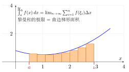
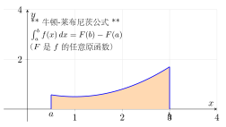
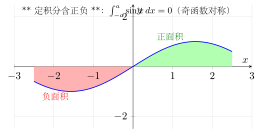

# 第12章 定积分

> **一例速记**：
> **Newton-Leibniz 公式**：若 $F'(x)=f(x)$，则 $\displaystyle\int_a^b f(x)\,dx = F(b)-F(a)$。
> **微积分第一基本定理**：$\dfrac{d}{dx}\displaystyle\int_a^x f(t)\,dt = f(x)$（$f$ 连续）。
> **对称性**：$\displaystyle\int_{-a}^a f = 0$（奇函数），$= 2\int_0^a f$（偶函数）。
> **几何意义**：定积分 = 曲线下（有向）面积；面积 $=\int_a^b\vert f\vert$（取绝对值）。

---

## 引入：从"面积"到精确定义——Riemann 和的内心独白

> **题目**：估计 $\displaystyle\int_0^1 x^2\,dx$ 的值，并用定义验证。

直觉上，$y=x^2$ 在 $[0,1]$ 之下的面积应当在 0 和 1 之间。但精确值是多少？

**关键观察**：把 $[0,1]$ 等分 $n$ 段，每段 $\Delta x=1/n$，取右端点 $\xi_i=i/n$：

$$S_n = \sum_{i=1}^n \left(\frac{i}{n}\right)^2 \cdot \frac{1}{n} = \frac{1}{n^3}\cdot\frac{n(n+1)(2n+1)}{6} = \frac{(n+1)(2n+1)}{6n^2}\to\frac{1}{3}.$$

精确值 $1/3$——下面把内心独白完整还原。

---

## 思维路径还原（解题者的内心独白）

> "看到 $\int_0^1 x^2\,dx$，第一反应：**Newton-Leibniz 公式**，直接求原函数。
>
> $x^2$ 的原函数是 $x^3/3$，所以 $\int_0^1 x^2\,dx = [x^3/3]_0^1 = 1/3 - 0 = 1/3$。
>
> 用时不到 5 秒。但为什么成立？因为微积分基本定理说：连续函数的变上限积分的导数恰好等于被积函数本身——积分和求导互为逆运算。
>
> **如果题目是 $\dfrac{d}{dx}\int_0^{x^2}\cos t\,dt$**：不要直接套，先认出是**变上限积分 + 复合函数**，需链式法则：
>
> $$\frac{d}{dx}\int_0^{x^2}\cos t\,dt = \cos(x^2)\cdot(x^2)' = 2x\cos(x^2).$$
>
> 关键：**上限是 $x^2$ 不是 $x$**，乘以上限对 $x$ 的导数。
>
> **如果题目是 $\int_{-1}^1 (x^3+x^4)\,dx$**：识别 $x^3$ 是奇函数，$x^4$ 是偶函数，立刻利用对称性：
>
> $$\int_{-1}^1 x^3\,dx = 0;\quad \int_{-1}^1 x^4\,dx = 2\int_0^1 x^4\,dx = 2/5.$$
>
> 结果 $2/5$，免去完整计算。这正是**定积分对称性最大价值**：节省一半计算。"

---


## 学习目标

通过本章学习，你将能够：

- 理解定积分的几何背景，掌握Riemann和与定积分的定义
- 掌握定积分的基本性质，包括线性性、区间可加性、保号性和积分中值定理
- 深刻理解微积分基本定理，熟练运用Newton-Leibniz公式计算定积分
- 掌握定积分的换元法和分部积分法，会利用对称性简化计算
- 能够应用定积分求平面图形的面积、旋转体的体积和曲线的弧长

---

## 12.1 定积分的概念

### 12.1.1 从面积问题引入

如何计算由曲线 $y = f(x)$（$f(x) \geq 0$）、直线 $x = a$、$x = b$ 及 $x$ 轴所围成的曲边梯形的面积？

**基本思想**："分割、近似、求和、取极限"

1. **分割**：将区间 $[a, b]$ 分成 $n$ 个小区间 $[x_{i-1}, x_i]$，其中 $a = x_0 < x_1 < \cdots < x_n = b$
2. **近似**：在每个小区间上取一点 $\xi_i \in [x_{i-1}, x_i]$，用小矩形面积 $f(\xi_i) \Delta x_i$ 近似曲边梯形的面积
3. **求和**：总面积近似为 $\sum_{i=1}^{n} f(\xi_i) \Delta x_i$
4. **取极限**：令分割越来越细，即 $\lambda = \max\{\Delta x_i\} \to 0$，得到精确面积

### 12.1.2 Riemann和的定义

**定义**（Riemann和）：设函数 $f(x)$ 在区间 $[a, b]$ 上有定义，对 $[a, b]$ 作分割 $P$：
$$a = x_0 < x_1 < x_2 < \cdots < x_n = b$$

记 $\Delta x_i = x_i - x_{i-1}$，$\lambda = \max_{1 \leq i \leq n}\{\Delta x_i\}$。在每个小区间 $[x_{i-1}, x_i]$ 上任取一点 $\xi_i$，则和式
$$S_n = \sum_{i=1}^{n} f(\xi_i) \Delta x_i$$
称为函数 $f(x)$ 在区间 $[a, b]$ 上的一个 **Riemann和**（或积分和）。

### 12.1.3 定积分的定义

**定义**（定积分）：设函数 $f(x)$ 在区间 $[a, b]$ 上有定义。若存在常数 $I$，对于任意给定的 $\varepsilon > 0$，总存在 $\delta > 0$，使得对 $[a, b]$ 的任意分割 $P$（只要 $\lambda < \delta$）以及任意选取的点 $\xi_i \in [x_{i-1}, x_i]$，都有
$$\left| \sum_{i=1}^{n} f(\xi_i) \Delta x_i - I \right| < \varepsilon$$
则称函数 $f(x)$ 在区间 $[a, b]$ 上**可积**，$I$ 称为 $f(x)$ 在 $[a, b]$ 上的**定积分**，记作
$$I = \int_a^b f(x) \, dx$$

其中：$a$ 称为**积分下限**，$b$ 称为**积分上限**，$[a, b]$ 称为**积分区间**。

**可积的充分条件**：
- 若 $f(x)$ 在 $[a, b]$ 上连续，则 $f(x)$ 在 $[a, b]$ 上可积
- 若 $f(x)$ 在 $[a, b]$ 上有界且只有有限个间断点，则 $f(x)$ 在 $[a, b]$ 上可积

> **例题 12.1** 利用定义计算 $\int_0^1 x^2 \, dx$。

**解**：将 $[0, 1]$ 等分为 $n$ 份，取 $x_i = \dfrac{i}{n}$，$\Delta x_i = \dfrac{1}{n}$，$\xi_i = x_i = \dfrac{i}{n}$。

Riemann和为：
$$S_n = \sum_{i=1}^{n} \left(\frac{i}{n}\right)^2 \cdot \frac{1}{n} = \frac{1}{n^3} \sum_{i=1}^{n} i^2 = \frac{1}{n^3} \cdot \frac{n(n+1)(2n+1)}{6}$$

$$= \frac{(n+1)(2n+1)}{6n^2} = \frac{2n^2 + 3n + 1}{6n^2}$$

取极限：
$$\int_0^1 x^2 \, dx = \lim_{n \to \infty} S_n = \lim_{n \to \infty} \frac{2n^2 + 3n + 1}{6n^2} = \frac{1}{3}$$

$\square$

**约定**：
- 当 $a = b$ 时，$\int_a^a f(x) \, dx = 0$
- 当 $a > b$ 时，$\int_a^b f(x) \, dx = -\int_b^a f(x) \, dx$

---

## 12.2 定积分的性质

### 12.2.1 线性性质

**性质1**（线性性）：设 $f(x)$、$g(x)$ 在 $[a, b]$ 上可积，$k_1$、$k_2$ 为常数，则
$$\int_a^b [k_1 f(x) + k_2 g(x)] \, dx = k_1 \int_a^b f(x) \, dx + k_2 \int_a^b g(x) \, dx$$

### 12.2.2 区间可加性

**性质2**（区间可加性）：设 $f(x)$ 在包含 $a$、$b$、$c$ 的区间上可积，则无论 $a$、$b$、$c$ 的相对位置如何，都有
$$\int_a^b f(x) \, dx = \int_a^c f(x) \, dx + \int_c^b f(x) \, dx$$

### 12.2.3 保号性与估值定理

**性质3**（保号性）：若 $f(x) \geq 0$ 在 $[a, b]$ 上成立，则
$$\int_a^b f(x) \, dx \geq 0$$

**推论**：若 $f(x) \geq g(x)$ 在 $[a, b]$ 上成立，则
$$\int_a^b f(x) \, dx \geq \int_a^b g(x) \, dx$$

**性质4**（估值定理）：设 $f(x)$ 在 $[a, b]$ 上可积，且 $m \leq f(x) \leq M$，则
$$m(b-a) \leq \int_a^b f(x) \, dx \leq M(b-a)$$

**性质5**（绝对值不等式）：若 $f(x)$ 在 $[a, b]$ 上可积，则 $|f(x)|$ 也可积，且
$$\left| \int_a^b f(x) \, dx \right| \leq \int_a^b |f(x)| \, dx$$

### 12.2.4 积分中值定理

**定理**（积分中值定理）：设 $f(x)$ 在 $[a, b]$ 上连续，则至少存在一点 $\xi \in [a, b]$，使得
$$\int_a^b f(x) \, dx = f(\xi)(b - a)$$

**几何意义**：曲边梯形的面积等于以 $[a, b]$ 为底、$f(\xi)$ 为高的矩形面积。

**证明**：由估值定理，设 $m$、$M$ 分别为 $f(x)$ 在 $[a, b]$ 上的最小值和最大值，则
$$m \leq \frac{1}{b-a} \int_a^b f(x) \, dx \leq M$$

由连续函数的介值定理，存在 $\xi \in [a, b]$，使得
$$f(\xi) = \frac{1}{b-a} \int_a^b f(x) \, dx$$

即 $\int_a^b f(x) \, dx = f(\xi)(b - a)$。$\square$

> **例题 12.2** 估计积分 $\int_0^1 e^{-x^2} \, dx$ 的值。

**解**：在 $[0, 1]$ 上，$0 \leq x^2 \leq 1$，故 $e^{-1} \leq e^{-x^2} \leq 1$。

由估值定理：
$$e^{-1} \cdot (1 - 0) \leq \int_0^1 e^{-x^2} \, dx \leq 1 \cdot (1 - 0)$$

即 $\dfrac{1}{e} \leq \int_0^1 e^{-x^2} \, dx \leq 1$，约为 $0.368 \leq I \leq 1$。$\square$

---

## 12.3 微积分基本定理

### 12.3.1 变上限积分函数

**定义**（变上限积分）：设 $f(x)$ 在 $[a, b]$ 上可积，定义函数
$$\Phi(x) = \int_a^x f(t) \, dt, \quad x \in [a, b]$$
称为 $f(x)$ 的**变上限积分函数**（或积分上限函数）。

注意：积分变量 $t$ 是哑变量，$\Phi(x)$ 是关于上限 $x$ 的函数。

### 12.3.2 微积分第一基本定理

**定理**（微积分第一基本定理）：设 $f(x)$ 在 $[a, b]$ 上连续，则变上限积分函数
$$\Phi(x) = \int_a^x f(t) \, dt$$
在 $[a, b]$ 上可导，且
$$\Phi'(x) = \frac{d}{dx} \int_a^x f(t) \, dt = f(x)$$

**证明**：对任意 $x \in [a, b)$，考虑增量
$$\Phi(x + \Delta x) - \Phi(x) = \int_a^{x+\Delta x} f(t) \, dt - \int_a^x f(t) \, dt = \int_x^{x+\Delta x} f(t) \, dt$$

由积分中值定理，存在 $\xi$ 介于 $x$ 与 $x + \Delta x$ 之间，使得
$$\int_x^{x+\Delta x} f(t) \, dt = f(\xi) \cdot \Delta x$$

因此
$$\frac{\Phi(x + \Delta x) - \Phi(x)}{\Delta x} = f(\xi)$$

当 $\Delta x \to 0$ 时，$\xi \to x$，由 $f$ 的连续性，$f(\xi) \to f(x)$。故
$$\Phi'(x) = \lim_{\Delta x \to 0} \frac{\Phi(x + \Delta x) - \Phi(x)}{\Delta x} = f(x)$$

$\square$

**推论**：若 $f(x)$ 连续，则 $\int_a^x f(t) \, dt$ 是 $f(x)$ 的一个原函数。

> **例题 12.3** 求 $\dfrac{d}{dx} \int_0^{x^2} \sin t \, dt$。

**解**：设 $u = x^2$，则
$$\frac{d}{dx} \int_0^{x^2} \sin t \, dt = \frac{d}{du} \int_0^u \sin t \, dt \cdot \frac{du}{dx} = \sin u \cdot 2x = 2x \sin x^2$$

$\square$

> **例题 12.4** 求 $\lim_{x \to 0} \dfrac{\int_0^x t e^{t^2} \, dt}{x^2}$。

**解**：这是 $\dfrac{0}{0}$ 型极限，用L'Hospital法则：
$$\lim_{x \to 0} \frac{\int_0^x t e^{t^2} \, dt}{x^2} = \lim_{x \to 0} \frac{x e^{x^2}}{2x} = \lim_{x \to 0} \frac{e^{x^2}}{2} = \frac{1}{2}$$

$\square$

### 12.3.3 微积分第二基本定理（Newton-Leibniz公式）

**定理**（Newton-Leibniz公式）：设 $f(x)$ 在 $[a, b]$ 上连续，$F(x)$ 是 $f(x)$ 的任意一个原函数，则
$$\int_a^b f(x) \, dx = F(b) - F(a) \triangleq F(x) \Big|_a^b$$

**证明**：由微积分第一基本定理，$\Phi(x) = \int_a^x f(t) \, dt$ 是 $f(x)$ 的一个原函数。

由原函数的结构定理，$F(x) = \Phi(x) + C$，其中 $C$ 为某常数。

因此：
$$F(b) - F(a) = [\Phi(b) + C] - [\Phi(a) + C] = \Phi(b) - \Phi(a)$$
$$= \int_a^b f(t) \, dt - \int_a^a f(t) \, dt = \int_a^b f(x) \, dx$$

$\square$

**Newton-Leibniz公式的意义**：它将定积分的计算转化为求原函数的问题，使得定积分的计算变得简便。这是微积分中最重要的公式之一。

> **例题 12.5** 计算 $\int_0^{\pi/2} \cos x \, dx$。

**解**：$\cos x$ 的一个原函数是 $\sin x$，由Newton-Leibniz公式：
$$\int_0^{\pi/2} \cos x \, dx = \sin x \Big|_0^{\pi/2} = \sin\frac{\pi}{2} - \sin 0 = 1 - 0 = 1$$

$\square$

> **例题 12.6** 计算 $\int_1^e \dfrac{1}{x} \, dx$。

**解**：$\dfrac{1}{x}$ 的一个原函数是 $\ln x$（$x > 0$）：
$$\int_1^e \frac{1}{x} \, dx = \ln x \Big|_1^e = \ln e - \ln 1 = 1 - 0 = 1$$

$\square$

---

## 12.4 定积分的计算

### 12.4.1 换元法

**定理**（定积分的换元法）：设 $f(x)$ 在 $[a, b]$ 上连续，若函数 $x = \varphi(t)$ 满足：
1. $\varphi(\alpha) = a$，$\varphi(\beta) = b$
2. $\varphi(t)$ 在 $[\alpha, \beta]$（或 $[\beta, \alpha]$）上有连续导数，且值域包含于 $[a, b]$

则
$$\int_a^b f(x) \, dx = \int_\alpha^\beta f[\varphi(t)] \varphi'(t) \, dt$$

**注意**：换元后，积分限也要相应改变；计算完毕后无需换回原变量。

> **例题 12.7** 计算 $\int_0^4 \sqrt{x}(1 + \sqrt{x}) \, dx$。

**解**：设 $t = \sqrt{x}$，则 $x = t^2$，$dx = 2t \, dt$。当 $x = 0$ 时 $t = 0$，当 $x = 4$ 时 $t = 2$。
$$\int_0^4 \sqrt{x}(1 + \sqrt{x}) \, dx = \int_0^2 t(1 + t) \cdot 2t \, dt = 2\int_0^2 (t^2 + t^3) \, dt$$
$$= 2\left[\frac{t^3}{3} + \frac{t^4}{4}\right]_0^2 = 2\left(\frac{8}{3} + 4\right) = 2 \cdot \frac{20}{3} = \frac{40}{3}$$

$\square$

> **例题 12.8** 计算 $\int_0^1 \sqrt{1 - x^2} \, dx$。

**解**：设 $x = \sin t$，则 $dx = \cos t \, dt$，$\sqrt{1 - x^2} = \cos t$。当 $x = 0$ 时 $t = 0$，当 $x = 1$ 时 $t = \dfrac{\pi}{2}$。
$$\int_0^1 \sqrt{1 - x^2} \, dx = \int_0^{\pi/2} \cos t \cdot \cos t \, dt = \int_0^{\pi/2} \cos^2 t \, dt$$
$$= \int_0^{\pi/2} \frac{1 + \cos 2t}{2} \, dt = \frac{1}{2}\left[t + \frac{\sin 2t}{2}\right]_0^{\pi/2} = \frac{1}{2} \cdot \frac{\pi}{2} = \frac{\pi}{4}$$

几何意义：这正是单位圆在第一象限部分的面积。$\square$

### 12.4.2 分部积分法

**定理**（定积分的分部积分法）：设 $u(x)$、$v(x)$ 在 $[a, b]$ 上有连续导数，则
$$\int_a^b u \, dv = uv \Big|_a^b - \int_a^b v \, du$$

> **例题 12.9** 计算 $\int_0^1 x e^x \, dx$。

**解**：取 $u = x$，$dv = e^x \, dx$，则 $du = dx$，$v = e^x$。
$$\int_0^1 x e^x \, dx = x e^x \Big|_0^1 - \int_0^1 e^x \, dx = e - (e^x \Big|_0^1) = e - (e - 1) = 1$$

$\square$

> **例题 12.10** 计算 $\int_0^{\pi/2} e^x \sin x \, dx$。

**解**：设 $I = \int_0^{\pi/2} e^x \sin x \, dx$。分部积分两次：

第一次：$u = \sin x$，$dv = e^x \, dx$
$$I = e^x \sin x \Big|_0^{\pi/2} - \int_0^{\pi/2} e^x \cos x \, dx = e^{\pi/2} - \int_0^{\pi/2} e^x \cos x \, dx$$

第二次：$u = \cos x$，$dv = e^x \, dx$
$$\int_0^{\pi/2} e^x \cos x \, dx = e^x \cos x \Big|_0^{\pi/2} + \int_0^{\pi/2} e^x \sin x \, dx = -1 + I$$

代入：$I = e^{\pi/2} - (-1 + I) = e^{\pi/2} + 1 - I$

解得：$I = \dfrac{e^{\pi/2} + 1}{2}$ $\square$

### 12.4.3 对称性的利用

**定理**（奇偶函数的定积分）：设 $f(x)$ 在 $[-a, a]$ 上连续，则：

1. 若 $f(x)$ 为**偶函数**，则 $\int_{-a}^a f(x) \, dx = 2\int_0^a f(x) \, dx$
2. 若 $f(x)$ 为**奇函数**，则 $\int_{-a}^a f(x) \, dx = 0$

**证明**：由区间可加性，$\int_{-a}^a f(x) \, dx = \int_{-a}^0 f(x) \, dx + \int_0^a f(x) \, dx$

对 $\int_{-a}^0 f(x) \, dx$，设 $x = -t$，则
$$\int_{-a}^0 f(x) \, dx = -\int_a^0 f(-t) \, dt = \int_0^a f(-t) \, dt$$

若 $f$ 为偶函数，$f(-t) = f(t)$，则 $\int_{-a}^0 f(x) \, dx = \int_0^a f(t) \, dt$，故 $\int_{-a}^a f(x) \, dx = 2\int_0^a f(x) \, dx$。

若 $f$ 为奇函数，$f(-t) = -f(t)$，则 $\int_{-a}^0 f(x) \, dx = -\int_0^a f(t) \, dt$，故 $\int_{-a}^a f(x) \, dx = 0$。$\square$

> **例题 12.11** 计算 $\int_{-1}^1 (x^3 + x^4) \, dx$。

**解**：$x^3$ 是奇函数，$x^4$ 是偶函数。
$$\int_{-1}^1 (x^3 + x^4) \, dx = \int_{-1}^1 x^3 \, dx + \int_{-1}^1 x^4 \, dx = 0 + 2\int_0^1 x^4 \, dx = 2 \cdot \frac{x^5}{5}\Big|_0^1 = \frac{2}{5}$$

$\square$

---

## 12.5 定积分的应用（几何）

### 12.5.1 平面图形的面积

**情形1**：由曲线 $y = f(x) \geq 0$、$x = a$、$x = b$ 及 $x$ 轴围成的面积：
$$S = \int_a^b f(x) \, dx$$

**情形2**：由曲线 $y = f(x)$ 与 $y = g(x)$（$f(x) \geq g(x)$）及 $x = a$、$x = b$ 围成的面积：
$$S = \int_a^b [f(x) - g(x)] \, dx$$

**情形3**：由参数方程 $x = x(t)$，$y = y(t)$（$\alpha \leq t \leq \beta$）所围成的面积：
$$S = \int_\alpha^\beta |y(t) x'(t)| \, dt$$

> **例题 12.12** 求由抛物线 $y = x^2$ 与直线 $y = x$ 所围成的面积。

**解**：先求交点：$x^2 = x$，得 $x = 0$ 或 $x = 1$。在 $[0, 1]$ 上，$x \geq x^2$。
$$S = \int_0^1 (x - x^2) \, dx = \left[\frac{x^2}{2} - \frac{x^3}{3}\right]_0^1 = \frac{1}{2} - \frac{1}{3} = \frac{1}{6}$$

$\square$

### 12.5.2 旋转体的体积

**绕 $x$ 轴旋转**：由曲线 $y = f(x)$、$x = a$、$x = b$ 及 $x$ 轴围成的图形绕 $x$ 轴旋转所得旋转体的体积：
$$V_x = \pi \int_a^b [f(x)]^2 \, dx$$

**绕 $y$ 轴旋转**（圆柱壳法）：
$$V_y = 2\pi \int_a^b x |f(x)| \, dx$$

> **例题 12.13** 求由 $y = \sqrt{x}$、$x = 1$ 及 $x$ 轴围成的图形绕 $x$ 轴旋转所得旋转体的体积。

**解**：
$$V_x = \pi \int_0^1 (\sqrt{x})^2 \, dx = \pi \int_0^1 x \, dx = \pi \cdot \frac{x^2}{2}\Big|_0^1 = \frac{\pi}{2}$$

$\square$

> **例题 12.14** 求由 $y = \sin x$（$0 \leq x \leq \pi$）与 $x$ 轴围成的图形绕 $y$ 轴旋转所得旋转体的体积。

**解**：用圆柱壳法：
$$V_y = 2\pi \int_0^\pi x \sin x \, dx$$

分部积分：取 $u = x$，$dv = \sin x \, dx$，则 $du = dx$，$v = -\cos x$。
$$\int_0^\pi x \sin x \, dx = -x \cos x \Big|_0^\pi + \int_0^\pi \cos x \, dx = \pi + \sin x \Big|_0^\pi = \pi$$

故 $V_y = 2\pi \cdot \pi = 2\pi^2$。$\square$

### 12.5.3 曲线的弧长

**直角坐标形式**：曲线 $y = f(x)$（$a \leq x \leq b$）的弧长为：
$$L = \int_a^b \sqrt{1 + [f'(x)]^2} \, dx$$

**参数形式**：曲线 $x = x(t)$，$y = y(t)$（$\alpha \leq t \leq \beta$）的弧长为：
$$L = \int_\alpha^\beta \sqrt{[x'(t)]^2 + [y'(t)]^2} \, dt$$

> **例题 12.15** 求曲线 $y = \dfrac{2}{3}x^{3/2}$ 从 $x = 0$ 到 $x = 1$ 的弧长。

**解**：$y' = x^{1/2}$，$1 + (y')^2 = 1 + x$。
$$L = \int_0^1 \sqrt{1 + x} \, dx = \frac{2}{3}(1 + x)^{3/2}\Big|_0^1 = \frac{2}{3}(2\sqrt{2} - 1)$$

$\square$

### 12.5.4 旋转曲面的面积

当曲线 $y = f(x)$（$a \leq x \leq b$，$f(x) \geq 0$）绕 $x$ 轴旋转时，所得旋转曲面的面积可以用定积分来计算。

**公式推导**：取曲线上一小段弧，弧长微元为 $ds = \sqrt{1 + [f'(x)]^2} \, dx$。这段小弧绕 $x$ 轴旋转形成一个窄带，近似为一个圆台侧面。当弧段足够小时，圆台退化为圆环带，其面积约为

$$dS = 2\pi f(x) \, ds = 2\pi f(x) \sqrt{1 + [f'(x)]^2} \, dx$$

对整条曲线积分，得到**旋转曲面面积公式**：

$$S = 2\pi \int_a^b |f(x)| \sqrt{1 + [f'(x)]^2} \, dx$$

> **几何直观**：$2\pi f(x)$ 是旋转半径对应的圆周长，$\sqrt{1 + [f'(x)]^2} \, dx$ 是弧长微元，两者的乘积即为旋转面的面积微元。

> **例题 12.16** 求曲线 $y = \sqrt{x}$（$0 \leq x \leq 1$）绕 $x$ 轴旋转所得旋转曲面的面积。

**解**：$f(x) = \sqrt{x}$，$f'(x) = \dfrac{1}{2\sqrt{x}}$，$1 + [f'(x)]^2 = 1 + \dfrac{1}{4x}= \dfrac{4x + 1}{4x}$。

$$S = 2\pi \int_0^1 \sqrt{x} \cdot \sqrt{\frac{4x + 1}{4x}} \, dx = 2\pi \int_0^1 \sqrt{x} \cdot \frac{\sqrt{4x + 1}}{2\sqrt{x}} \, dx = \pi \int_0^1 \sqrt{4x + 1} \, dx$$

设 $u = 4x + 1$，$du = 4 \, dx$：

$$S = \pi \cdot \frac{1}{4} \int_1^5 \sqrt{u} \, du = \frac{\pi}{4} \cdot \frac{2}{3} u^{3/2} \Big|_1^5 = \frac{\pi}{6}(5\sqrt{5} - 1)$$

$\square$

> **例题 12.17** 求球体 $x^2 + y^2 + z^2 = R^2$ 的表面积。

**解**：球面可视为上半圆 $y = \sqrt{R^2 - x^2}$（$-R \leq x \leq R$）绕 $x$ 轴旋转得到。

$$f(x) = \sqrt{R^2 - x^2}, \quad f'(x) = \frac{-x}{\sqrt{R^2 - x^2}}$$

$$1 + [f'(x)]^2 = 1 + \frac{x^2}{R^2 - x^2} = \frac{R^2}{R^2 - x^2}$$

$$S = 2\pi \int_{-R}^{R} \sqrt{R^2 - x^2} \cdot \frac{R}{\sqrt{R^2 - x^2}} \, dx = 2\pi \int_{-R}^{R} R \, dx = 2\pi R \cdot 2R = 4\pi R^2$$

这正是球的表面积公式。$\square$

### 12.5.5 极坐标下的定积分应用

**极坐标面积公式**

设平面曲线以极坐标方程 $r = r(\theta)$（$\alpha \leq \theta \leq \beta$）表示，则由射线 $\theta = \alpha$、$\theta = \beta$ 及曲线 $r = r(\theta)$ 所围成的扇形区域的面积为：

$$S = \frac{1}{2} \int_\alpha^\beta r^2(\theta) \, d\theta$$

> **推导**：将区间 $[\alpha, \beta]$ 分割为小角度 $d\theta$，每个小扇形的面积近似为 $\dfrac{1}{2} r^2(\theta) \, d\theta$（半径为 $r(\theta)$ 的圆的扇形面积），累加取极限即得。

> **例题 12.18** 求心形线 $r = a(1 + \cos\theta)$（$a > 0$）所围区域的面积。

**解**：心形线关于极轴对称，$\theta$ 从 $0$ 到 $\pi$ 扫过上半部分。

$$S = 2 \cdot \frac{1}{2} \int_0^{\pi} [a(1 + \cos\theta)]^2 \, d\theta = a^2 \int_0^{\pi} (1 + \cos\theta)^2 \, d\theta$$

展开：

$$(1 + \cos\theta)^2 = 1 + 2\cos\theta + \cos^2\theta = 1 + 2\cos\theta + \frac{1 + \cos 2\theta}{2} = \frac{3}{2} + 2\cos\theta + \frac{\cos 2\theta}{2}$$

$$S = a^2 \int_0^{\pi} \left(\frac{3}{2} + 2\cos\theta + \frac{\cos 2\theta}{2}\right) d\theta = a^2 \left[\frac{3}{2}\theta + 2\sin\theta + \frac{\sin 2\theta}{4}\right]_0^{\pi} = a^2 \cdot \frac{3\pi}{2} = \frac{3\pi a^2}{2}$$

$\square$

**极坐标弧长公式**

设曲线的极坐标方程为 $r = r(\theta)$（$\alpha \leq \theta \leq \beta$），则曲线的弧长为：

$$L = \int_\alpha^\beta \sqrt{r^2(\theta) + [r'(\theta)]^2} \, d\theta$$

> **推导**：将极坐标转化为直角坐标 $x = r\cos\theta$，$y = r\sin\theta$，利用参数形式的弧长公式 $L = \int \sqrt{x'^2 + y'^2} \, d\theta$，其中 $x' = r'\cos\theta - r\sin\theta$，$y' = r'\sin\theta + r\cos\theta$，化简后 $x'^2 + y'^2 = r'^2 + r^2$。

> **例题 12.19** 求阿基米德螺旋线 $r = a\theta$（$0 \leq \theta \leq 2\pi$，$a > 0$）的弧长。

**解**：$r = a\theta$，$r' = a$。

$$L = \int_0^{2\pi} \sqrt{a^2\theta^2 + a^2} \, d\theta = a\int_0^{2\pi} \sqrt{\theta^2 + 1} \, d\theta$$

设 $\theta = \tan u$，$d\theta = \sec^2 u \, du$，$\sqrt{\theta^2 + 1} = \sec u$：

$$L = a\int_0^{\arctan 2\pi} \sec^3 u \, du$$

利用公式 $\int \sec^3 u \, du = \dfrac{1}{2}(\sec u \tan u + \ln|\sec u + \tan u|) + C$：

$$L = \frac{a}{2}\left[\theta\sqrt{\theta^2 + 1} + \ln(\theta + \sqrt{\theta^2 + 1})\right]_0^{2\pi}$$

$$= \frac{a}{2}\left[2\pi\sqrt{4\pi^2 + 1} + \ln(2\pi + \sqrt{4\pi^2 + 1})\right]$$

$\square$

### 12.5.6 参数方程下的应用公式

当曲线以参数方程 $x = x(t)$，$y = y(t)$（$\alpha \leq t \leq \beta$）给出时，各几何量的计算公式可以统一表述。

**参数形式的面积**：由曲线 $x = x(t), y = y(t)$、$x$ 轴及直线 $x = a, x = b$ 围成的面积为

$$S = \int_\alpha^\beta |y(t) \cdot x'(t)| \, dt$$

其中 $x(\alpha) = a$，$x(\beta) = b$（或反向，视参数方向而定）。

**参数形式的弧长**（已在 12.5.3 中给出）：

$$L = \int_\alpha^\beta \sqrt{[x'(t)]^2 + [y'(t)]^2} \, dt$$

**参数形式的旋转体体积**：曲线绕 $x$ 轴旋转的体积为

$$V_x = \pi \int_\alpha^\beta [y(t)]^2 |x'(t)| \, dt$$

**参数形式的旋转曲面面积**：

$$S = 2\pi \int_\alpha^\beta |y(t)| \sqrt{[x'(t)]^2 + [y'(t)]^2} \, dt$$

> **例题 12.20** 求摆线 $x = a(t - \sin t)$，$y = a(1 - \cos t)$（$0 \leq t \leq 2\pi$）的一拱弧长。

**解**：$x'(t) = a(1 - \cos t)$，$y'(t) = a\sin t$。

$$[x'(t)]^2 + [y'(t)]^2 = a^2(1 - \cos t)^2 + a^2\sin^2 t = a^2(1 - 2\cos t + \cos^2 t + \sin^2 t) = 2a^2(1 - \cos t)$$

利用半角公式 $1 - \cos t = 2\sin^2\dfrac{t}{2}$：

$$\sqrt{[x']^2 + [y']^2} = a\sqrt{2 \cdot 2\sin^2\frac{t}{2}} = 2a\left|\sin\frac{t}{2}\right| = 2a\sin\frac{t}{2} \quad (0 \leq t \leq 2\pi)$$

$$L = \int_0^{2\pi} 2a\sin\frac{t}{2} \, dt = 2a \cdot \left[-2\cos\frac{t}{2}\right]_0^{2\pi} = 2a \cdot [(-2)(-1) - (-2)(1)] = 2a \cdot 4 = 8a$$

$\square$

---

## 12.6 数值积分简介

### 12.6.1 矩形法则、梯形法则与 Simpson 法则

在很多场景里，被积函数没有初等原函数，或者虽然理论上可积，但直接手算成本太高。这时就需要**数值积分**。

设区间 $[a,b]$ 被等分为 $n$ 段，步长为

$$
h=\frac{b-a}{n}.
$$

记节点为 $x_k=a+kh$。

**矩形法则**：

- 左矩形法
  $$
  \int_a^b f(x)\,dx \approx h\sum_{k=0}^{n-1} f(x_k)
  $$
- 右矩形法
  $$
  \int_a^b f(x)\,dx \approx h\sum_{k=1}^{n} f(x_k)
  $$
- 中点法
  $$
  \int_a^b f(x)\,dx \approx h\sum_{k=0}^{n-1} f\left(x_k+\frac{h}{2}\right)
  $$

**梯形法则**：

$$
\int_a^b f(x)\,dx \approx
\frac{h}{2}\left[f(x_0)+2\sum_{k=1}^{n-1}f(x_k)+f(x_n)\right].
$$

**Simpson 法则**（要求 $n$ 为偶数）：

$$
\int_a^b f(x)\,dx \approx
\frac{h}{3}\left[
f(x_0)
+4\sum_{k\ \text{奇}} f(x_k)
+2\sum_{k\ \text{偶},\, 2\le k\le n-2} f(x_k)
+f(x_n)
\right].
$$

在足够光滑条件下，误差阶大致为：

- 矩形法：$O(h)$
- 梯形法：$O(h^2)$
- Simpson 法：$O(h^4)$

这说明：步长缩小一半时，高阶方法的精度提升通常更明显。

> **例题 12.21** 用梯形法则和 Simpson 法则近似计算
> $$
> \int_0^1 e^{-x^2}\,dx
> $$
> 并比较思路。

**解**：这个积分没有初等原函数，因此特别适合数值积分。

- 若只需快速粗略近似，可用梯形法
- 若函数足够光滑且允许取偶数个小区间，Simpson 法通常更准

本题重点不在手工展开长公式，而在认识：很多重要积分并非“算不出”，而是“适合数值算”。$\square$

### 12.6.2 AI 中的数值积分

机器学习里大量“期望”本质上都在做数值积分或其高维版本：

$$
\mathbb E[L(X)] = \int L(x)p(x)\,dx.
$$

在数据驱动场景中，我们常用样本平均来近似这个积分：

$$
\frac{1}{N}\sum_{i=1}^N L(x_i).
$$

从这个角度看：

- 低维确定性积分常用梯形法、Simpson 法、自适应求积
- 高维积分更常使用 Monte Carlo
- “批量训练”本质上就是连续期望的离散近似

**梯度累积 = 离散积分**

设小批量梯度为

$$
g_i=\frac{\partial L(x_i,\theta)}{\partial \theta},
$$

累积 $K$ 步得到

$$
G=\sum_{i=1}^K g_i.
$$

若取平均，则

$$
\frac{1}{K}G \approx \mathbb E[g].
$$

它可以看作对真实梯度期望的离散积分近似。当显存不足以直接增大 batch size 时，梯度累积本质上是在用更多“矩形小块”逼近同一个积分。

> ⚠️ **常见陷阱**
> 变上限积分求导时，很多人会直接把上限当常数处理，忘记再乘以上限的导数。类似地，在实际训练里做梯度累积时，也要分清“累加”与“取平均”这两个不同的数值近似对象。

---

## 本章小结

1. **定积分的定义**：定积分是Riemann和的极限，即 $\int_a^b f(x) \, dx = \lim_{\lambda \to 0} \sum_{i=1}^n f(\xi_i) \Delta x_i$。它源于面积问题，体现了"分割、近似、求和、取极限"的思想。

2. **定积分的性质**：
   - 线性性：$\int_a^b [k_1 f + k_2 g] \, dx = k_1 \int_a^b f \, dx + k_2 \int_a^b g \, dx$
   - 区间可加性：$\int_a^b f \, dx = \int_a^c f \, dx + \int_c^b f \, dx$
   - 积分中值定理：存在 $\xi \in [a, b]$ 使 $\int_a^b f(x) \, dx = f(\xi)(b - a)$

3. **微积分基本定理**：
   - 第一基本定理：$\dfrac{d}{dx} \int_a^x f(t) \, dt = f(x)$（连接微分与积分）
   - 第二基本定理（Newton-Leibniz公式）：$\int_a^b f(x) \, dx = F(b) - F(a)$

4. **计算方法**：
   - 换元法：换元后积分限相应改变，结果无需换回
   - 分部积分法：$\int_a^b u \, dv = uv \Big|_a^b - \int_a^b v \, du$
   - 利用对称性：奇函数在对称区间上积分为零，偶函数可简化为两倍

5. **几何应用**：
   - 面积：$S = \int_a^b |f(x) - g(x)| \, dx$
   - 旋转体体积：$V_x = \pi \int_a^b [f(x)]^2 \, dx$
   - 弧长：$L = \int_a^b \sqrt{1 + [f'(x)]^2} \, dx$
   - 旋转曲面面积：$S = 2\pi \int_a^b |f(x)| \sqrt{1 + [f'(x)]^2} \, dx$
   - 极坐标面积：$S = \dfrac{1}{2} \int_\alpha^\beta r^2(\theta) \, d\theta$
   - 极坐标弧长：$L = \int_\alpha^\beta \sqrt{r^2 + r'^2} \, d\theta$

6. **数值积分**：
   - 矩形法、梯形法、Simpson 法分别对应不同精度等级
   - 样本平均、梯度累积可以看作连续期望的离散积分近似

---

## 12.7 深度学习应用

定积分不仅是几何工具，在深度学习和机器学习中也有重要的理论与实践意义。

### 12.7.1 损失函数的积分形式

在有监督学习中，损失函数衡量模型预测与真实值之间的差距。

**经验风险**（基于有限样本）：
$$\hat{R}(f) = \frac{1}{n}\sum_{i=1}^n L(f(x_i), y_i)$$

这是对有限样本点的求和，本质上是对真实期望的估计。

**期望风险**（基于数据的真实分布）：
$$R(f) = \int L(f(x), y)\, p(x,y)\, dx\, dy$$

其中 $p(x, y)$ 是输入-输出对 $(x, y)$ 的联合概率密度函数。

**关系**：经验风险是期望风险的 Monte Carlo 估计，当 $n \to \infty$ 时，
$$\hat{R}(f) \xrightarrow{a.s.} R(f)$$

由大数定律保证收敛，这正是 Riemann 和收敛到定积分的随机版本。

### 12.7.2 ROC 曲线下面积（AUC）

ROC（Receiver Operating Characteristic）曲线描述二分类器在不同阈值下的性能，横轴为假正率（FPR），纵轴为真正率（TPR）。

**AUC 的积分定义**：

$$\text{AUC} = \int_0^1 \text{TPR}\!\left(\text{FPR}^{-1}(t)\right) dt$$

即以 FPR 为积分变量，对 TPR 求定积分。AUC = 1 表示完美分类，AUC = 0.5 对应随机猜测。

**梯形法则近似**：实践中，AUC 通过 $n$ 个离散阈值下的 (FPR, TPR) 点对，用梯形法则（数值积分）计算：
$$\text{AUC} \approx \sum_{i=1}^{n-1} \frac{(\text{FPR}_{i+1} - \text{FPR}_i)(\text{TPR}_i + \text{TPR}_{i+1})}{2}$$

这正是定积分数值计算的直接应用。

### 12.7.3 积分在正则化中的应用

**权重衰减的路径积分解释**

L2 正则化（权重衰减）在贝叶斯框架下等价于对参数施加高斯先验 $p(\theta) \propto e^{-\lambda \|\theta\|^2}$。

后验分布满足：
$$p(\theta | \mathcal{D}) \propto p(\mathcal{D} | \theta)\, p(\theta)$$

对 $\theta$ 的边际化需要计算积分：
$$p(\mathcal{D}) = \int p(\mathcal{D} | \theta)\, p(\theta)\, d\theta$$

**函数空间正则化（Sobolev 正则化）**

另一类正则化直接限制函数的"光滑程度"，通过限制其导数的积分来实现：
$$\Omega(f) = \int \left[f''(x)\right]^2 dx$$

这是一个以导数的平方为被积函数的定积分，鼓励模型选择曲率较小的函数。

### 12.7.4 Newton-Leibniz 公式与自动微分

**变上限积分与自动微分**

微积分第一基本定理揭示了积分与微分的互逆关系：
$$\frac{d}{dx} \int_a^x f(t)\, dt = f(x)$$

在深度学习的自动微分（Autograd）框架中，这一原理被直接利用：若将数值积分 $F(x) = \int_a^x f(t)\, dt$ 视为一个计算节点，则其反向传播梯度即为被积函数在上限处的值 $f(x)$。

**神经 ODE（Neural ODE）**

Neural ODE 将神经网络的前向传播建模为常微分方程的解：
$$\mathbf{h}(T) = \mathbf{h}(0) + \int_0^T f_\theta(\mathbf{h}(t), t)\, dt$$

其中 $f_\theta$ 是参数化的神经网络。训练时，梯度通过**伴随方法**（adjoint method）高效计算，本质上是对 ODE 做反向积分，避免了存储中间状态的开销。

### 12.7.5 代码示例

```python
import torch
from sklearn.metrics import roc_auc_score, roc_curve
import numpy as np

# AUC 的积分计算
def compute_auc_manual(y_true, y_score):
    """手动计算 AUC = ∫TPR d(FPR)"""
    fpr, tpr, _ = roc_curve(y_true, y_score)
    # 梯形法则积分
    auc = np.trapz(tpr, fpr)
    return auc

# 示例
y_true = np.array([0, 0, 1, 1, 1])
y_score = np.array([0.1, 0.4, 0.35, 0.8, 0.9])

auc_sklearn = roc_auc_score(y_true, y_score)
auc_manual = compute_auc_manual(y_true, y_score)
print(f"sklearn AUC: {auc_sklearn:.4f}")
print(f"手动积分 AUC: {auc_manual:.4f}")

# 变上限积分函数的求导（利用 PyTorch 自动微分）
# F(t) = ∫_0^t e^{-s^2} ds 的数值近似及其导数
def F(t, n=1000):
    """数值计算变上限积分 F(t) = ∫_0^t e^{-s^2} ds"""
    s = torch.linspace(0, t, n)
    return torch.trapz(torch.exp(-s**2), s)

# 在 t=1 处验证 F'(1) ≈ e^{-1}
t = torch.tensor(1.0, requires_grad=True)
val = F(t)
val.backward()
print(f"F'(1) 数值结果: {t.grad.item():.6f}")
print(f"e^{{-1}} 理论值: {np.exp(-1):.6f}")
```

**关键联系**：
- `np.trapz` 实现的梯形法则对应定积分的数值近似
- `torch.trapz` + `backward()` 利用微积分第一基本定理自动计算变上限积分的导数
- AUC 的计算本质是 ROC 曲线下方面积的定积分

---

## 练习题

**1.** ⭐ 利用定积分的性质，证明：$\int_0^{\pi/2} \sin^n x \, dx = \int_0^{\pi/2} \cos^n x \, dx$。

**2.** ⭐ 计算定积分：$\int_0^2 x\sqrt{4 - x^2} \, dx$。

**3.** ⭐ 计算定积分：$\int_0^1 x^2 e^x \, dx$。

**4.** ⭐⭐ 求由曲线 $y = e^x$、$y = e^{-x}$ 与直线 $x = 1$ 所围成图形的面积。

**5.** ⭐⭐ 求由曲线 $y = x^2$ 与 $y = \sqrt{x}$ 围成的图形绕 $x$ 轴旋转所得旋转体的体积。

**6.** ⭐⭐ 求曲线 $y = x^3$（$0 \leq x \leq 1$）绕 $x$ 轴旋转所得旋转曲面的面积。

**7.** ⭐⭐⭐ 求双纽线 $r^2 = 2a^2\cos 2\theta$ 所围区域的面积。

**8.** ⭐⭐⭐ 求心形线 $r = 1 + \cos\theta$ 的全长。

---

## 练习答案

<details>
<summary>点击展开答案</summary>

**1.** 设 $x = \dfrac{\pi}{2} - t$，则 $dx = -dt$。当 $x = 0$ 时 $t = \dfrac{\pi}{2}$，当 $x = \dfrac{\pi}{2}$ 时 $t = 0$。

$$\int_0^{\pi/2} \sin^n x \, dx = \int_{\pi/2}^0 \sin^n\left(\frac{\pi}{2} - t\right) \cdot (-dt) = \int_0^{\pi/2} \cos^n t \, dt$$

故 $\int_0^{\pi/2} \sin^n x \, dx = \int_0^{\pi/2} \cos^n x \, dx$。$\square$

---

**2.** 设 $u = 4 - x^2$，则 $du = -2x \, dx$，即 $x \, dx = -\dfrac{1}{2} du$。当 $x = 0$ 时 $u = 4$，当 $x = 2$ 时 $u = 0$。

$$\int_0^2 x\sqrt{4 - x^2} \, dx = -\frac{1}{2}\int_4^0 \sqrt{u} \, du = \frac{1}{2}\int_0^4 u^{1/2} \, du$$
$$= \frac{1}{2} \cdot \frac{2}{3} u^{3/2}\Big|_0^4 = \frac{1}{3} \cdot 8 = \frac{8}{3}$$

---

**3.** 两次分部积分。取 $u = x^2$，$dv = e^x \, dx$：

$$\int_0^1 x^2 e^x \, dx = x^2 e^x \Big|_0^1 - 2\int_0^1 x e^x \, dx = e - 2\int_0^1 x e^x \, dx$$

对 $\int_0^1 x e^x \, dx$，取 $u = x$，$dv = e^x \, dx$：

$$\int_0^1 x e^x \, dx = x e^x \Big|_0^1 - \int_0^1 e^x \, dx = e - (e - 1) = 1$$

代入：$\int_0^1 x^2 e^x \, dx = e - 2 \cdot 1 = e - 2$

---

**4.** 在 $x \in [0, 1]$ 上，$e^x \geq e^{-x}$。两曲线在 $x = 0$ 处交于 $(0, 1)$。

$$S = \int_0^1 (e^x - e^{-x}) \, dx = (e^x + e^{-x})\Big|_0^1 = (e + e^{-1}) - (1 + 1) = e + \frac{1}{e} - 2$$

---

**5.** 两曲线的交点：$x^2 = \sqrt{x}$ 得 $x^4 = x$，即 $x(x^3 - 1) = 0$，所以 $x = 0$ 或 $x = 1$。

在 $[0, 1]$ 上，$\sqrt{x} \geq x^2$。

$$V = \pi \int_0^1 \left[(\sqrt{x})^2 - (x^2)^2\right] dx = \pi \int_0^1 (x - x^4) \, dx$$
$$= \pi \left[\frac{x^2}{2} - \frac{x^5}{5}\right]_0^1 = \pi \left(\frac{1}{2} - \frac{1}{5}\right) = \frac{3\pi}{10}$$

---

**6.** $f(x) = x^3$，$f'(x) = 3x^2$，$1 + [f'(x)]^2 = 1 + 9x^4$。

$$S = 2\pi \int_0^1 x^3 \sqrt{1 + 9x^4} \, dx$$

设 $u = 1 + 9x^4$，$du = 36x^3 \, dx$：

$$S = 2\pi \cdot \frac{1}{36} \int_1^{10} \sqrt{u} \, du = \frac{\pi}{18} \cdot \frac{2}{3} u^{3/2}\Big|_1^{10} = \frac{\pi}{27}(10\sqrt{10} - 1)$$

---

**7.** 双纽线由 $r^2 = 2a^2\cos 2\theta$ 定义，仅在 $\cos 2\theta \geq 0$ 时存在，即 $\theta \in [-\pi/4, \pi/4]$ 和 $\theta \in [3\pi/4, 5\pi/4]$。利用对称性：

$$S = 4 \cdot \frac{1}{2} \int_0^{\pi/4} 2a^2\cos 2\theta \, d\theta = 4a^2 \left[\frac{\sin 2\theta}{2}\right]_0^{\pi/4} = 4a^2 \cdot \frac{1}{2} = 2a^2$$

---

**8.** $r = 1 + \cos\theta$，$r' = -\sin\theta$。利用对称性，全长 $= 2 \int_0^{\pi} \sqrt{r^2 + r'^2} \, d\theta$。

$$r^2 + r'^2 = (1 + \cos\theta)^2 + \sin^2\theta = 2 + 2\cos\theta = 4\cos^2\frac{\theta}{2}$$

$$L = 2\int_0^{\pi} 2\cos\frac{\theta}{2} \, d\theta = 4 \left[2\sin\frac{\theta}{2}\right]_0^{\pi} = 4 \cdot 2 = 8$$

</details>


## 几何示意







---

## 思考路标（条件反射）

- 看到 $\int_a^b f(x)\,dx$ → 牛顿-莱布尼茨 $F(b)-F(a)$
- 看到"曲边梯形面积" → 定积分几何意义（含正负）
- 看到 $\int_a^a$ → 直接 $0$
- 看到 $\int_a^b + \int_b^c = \int_a^c$ → 区间可加
- 看到 $\int_a^b f\,dx = -\int_b^a f\,dx$ → 上下限交换变号
- 看到定积分含变上限 $\int_a^x f(t)\,dt$ → 求导得 $f(x)$（微积分基本定理）
- 看到对称区间 $\int_{-a}^a$ → 奇函数为 0，偶函数为 $2\int_0^a$
- 看到含 $\sin^n, \cos^n$ 在 $[0, \pi/2]$ → Wallis 公式

## 易错点

1. **变上限积分 $F(x)=\int_a^x f(t)\,dt$ 的导数是 $f(x)$**（不是 $f(t)$）。
2. **定积分与不定积分区别**：前者是数，后者是函数族。
3. **被积函数与积分变量混淆**：$\int_a^b f(t)\,dt$ 中 $t$ 是哑变量，与外层 $x$ 无关。
4. **几何面积 vs 定积分**：$\int_a^b f$ 可正可负；总面积要 $\int|f|$。
5. **变上限 + 复合**：$\frac{d}{dx}\int_a^{g(x)} f(t)\,dt = f(g(x))\cdot g'(x)$（含链式）。

---

## 抽象成方法（套路总结）

### 定积分核心公式速查

| 名称 | 公式 | 备注 |
|---|---|---|
| **Newton-Leibniz** | $\displaystyle\int_a^b f(x)\,dx = F(b)-F(a)$ | $F'=f$；是定积分计算的主公式 |
| **微积分第一基本定理** | $\dfrac{d}{dx}\int_a^x f(t)\,dt = f(x)$ | $f$ 连续；上限复合需乘链式导数 |
| **面积公式** | $S = \displaystyle\int_a^b\vert f(x)-g(x)\vert\,dx$ | 先找交点定上下函数 |
| **旋转体体积（绕 $x$ 轴）** | $V = \pi\displaystyle\int_a^b [f(x)]^2\,dx$ | 圆盘法 |
| **弧长** | $L = \displaystyle\int_a^b\sqrt{1+[f'(x)]^2}\,dx$ | 直角坐标 |
| **对称性（奇/偶）** | $\int_{-a}^a f = 0$（奇）；$=2\int_0^a f$（偶） | $[-a,a]$ 区间 |
| **区间再现** | $\int_0^\pi xf(\sin x)\,dx = \dfrac{\pi}{2}\int_0^\pi f(\sin x)\,dx$ | 令 $t=\pi-x$ |

### 计算定积分标准 4 步流程

1. **验证连续性**：若被积函数在 $[a,b]$ 不连续，检查是否为广义积分
2. **求原函数**：套基本公式 / 凑微分 / 分部积分
3. **代入上下限**：$F(b)-F(a)$；换元时上下限同步变换
4. **利用对称**：检查奇偶性或区间再现，能简化则先简化再算

---

## 方法变形

### 变形 1：变上限积分求导 + 链式法则

上限不是 $x$ 而是 $g(x)$ 时：$\dfrac{d}{dx}\int_a^{g(x)}f(t)\,dt = f(g(x))\cdot g'(x)$。常见错误：忘乘 $g'$。

### 变形 2：含参数的定积分

用 L'Hospital 处理 $\lim_{x\to 0}\dfrac{\int_0^x f(t)\,dt}{x^n}$——分子求导即 $f(x)$，分母求导即 $nx^{n-1}$。

### 变形 3：面积 vs 有向积分

图形面积 = $\int_a^b\vert f(x)\vert\,dx$，需先找 $f$ 的零点将区间分段。而定积分 $\int_a^b f\,dx$ 含正负，不是面积。

### 变形 4：旋转体绕 $y$ 轴（圆柱壳法）

$V_y = 2\pi\displaystyle\int_a^b x\,\vert f(x)\vert\,dx$（$0\leq a < b$）。与圆盘法区别：一个对 $x$ 积分，一个对 $y$ 积分。

---

## 典型应用例题

### 例 1：变上限积分求导 + L'Hospital

> **题目**：求 $\displaystyle\lim_{x\to 0}\frac{\int_0^x \sin t^2\,dt}{x^3}$。

【思路】$0/0$ 型，L'Hospital；分子对 $x$ 求导用微积分第一基本定理。

【解】

$$\lim_{x\to 0}\frac{\int_0^x\sin t^2\,dt}{x^3} \overset{L'H}{=} \lim_{x\to 0}\frac{\sin x^2}{3x^2}.$$

令 $u=x^2$，$u\to 0$：$\dfrac{\sin u}{3u}\to\dfrac{1}{3}$。

$\boxed{\dfrac{1}{3}}$

【注】变上限积分求导后立即化简，不要再次用 L'Hospital——$\sin u / u \to 1$ 是等价无穷小，更快。

### 例 2：对称性简化 + Newton-Leibniz

> **题目**：计算 $\displaystyle\int_{-2}^{2}(x^5+3x^3+x^2+1)\,dx$。

【思路】区间 $[-2,2]$ 对称，拆奇偶部分。

【解】$x^5+3x^3$ 是奇函数，$\int_{-2}^2(\cdot)=0$；$x^2+1$ 是偶函数。

$$\int_{-2}^2(x^2+1)\,dx = 2\int_0^2(x^2+1)\,dx = 2\left[\frac{x^3}{3}+x\right]_0^2 = 2\cdot\frac{14}{3} = \frac{28}{3}.$$

$\boxed{\dfrac{28}{3}}$

【注】拆奇偶是 $[-a,a]$ 区间最高效技巧，优先于直接积分。

### 例 3：定积分的几何应用——面积

> **题目**：求由曲线 $y=\sin x$（$0\leq x\leq 2\pi$）与 $x$ 轴围成的图形面积。

【思路】$\sin x$ 在 $[0,\pi]$ 为正，在 $[\pi,2\pi]$ 为负；面积 = $\int_0^{2\pi}\vert\sin x\vert\,dx$。

【解】

$$S = \int_0^\pi\sin x\,dx + \int_\pi^{2\pi}(-\sin x)\,dx = [-\cos x]_0^\pi + [\cos x]_\pi^{2\pi}.$$

$$= (-\cos\pi+\cos 0)+(\cos 2\pi-\cos\pi) = 2 + 2 = 4.$$

$\boxed{S = 4}$

【注】$\int_0^{2\pi}\sin x\,dx = 0$（有向积分），但面积为 4——两者不同，切勿混淆。

---

## 自测题

**自测 1**　$\displaystyle\frac{d}{dx}\int_{\sqrt{x}}^{x^2}\ln(1+t)\,dt$。

> 💡 提示：第一基本定理 + 链式：$\ln(1+x^2)\cdot 2x - \ln(1+\sqrt{x})\cdot\dfrac{1}{2\sqrt{x}}$。

**自测 2**　计算 $\displaystyle\int_0^{\pi/2}\sin^3 x\,dx$。

> 💡 提示：凑微分 $\sin^3 x=\sin x(1-\cos^2 x)$；答案 $2/3$。

**自测 3**　求 $y=x^2$ 与 $y=2x$ 围成图形的面积。

> 💡 提示：交点 $x=0,2$；$\int_0^2(2x-x^2)\,dx=4/3$。

**自测 4**　计算 $\displaystyle\int_{-3}^3(x^4+\cos x)\,dx$。

> 💡 提示：$x^4$ 偶、$\cos x$ 偶，均用 $2\int_0^3$；答案 $2(3^5/5+\sin 3)$。

**自测 5**　求 $y=\sqrt{x}$（$0\leq x\leq 4$）绕 $x$ 轴旋转体的体积。

> 💡 提示：$V=\pi\int_0^4 x\,dx=8\pi$。

---

**回头看一眼"一例速记"**：

> Newton-Leibniz：$\int_a^b f = F(b)-F(a)$；第一基本定理：$(\int_a^x f)' = f(x)$。
> 对称性：奇函数在 $[-a,a]$ 积分为 0；偶函数折半。
> 面积 $\neq$ 定积分：前者 $\int\vert f\vert$，后者有正负。

如果现在不看笔记，能独立完成例 1 + 例 3 + 自测 3——本章，你拿下了。

---

## 融合版说明

本版 = **原版（严格大学教材 + 深度学习应用）** + **重写版（速记 / 套路 / 例题 / 自测）** 融合：

| 段落 | 来源 | 价值 |
|---|---|---|
| 一例速记 + 引入 + 思维路径还原 | 重写版（前置，新增） | 建立直觉 / 反射 |
| 学习目标 + 12.1–12.7 严格正文 | 原版 | 完整推导 |
| 几何示意（图） | 配图 | 可视化 |
| 思考路标 + 易错点 | 融合两版 | 条件反射 |
| 抽象成方法 + 方法变形 | 重写版（新增） | 套路总结 |
| 典型应用例题 3 例 | 重写版（新增） | 演练 |
| 深度学习应用 + 代码 | 原版 | 工业实战 |
| 练习题 + 详解 | 原版 | 巩固 |
| 自测题 5 题 | 重写版（新增） | 额外训练 |

**适用**：一站式学习——先速记建立直觉，看严格推导，做套路总结，看代码实战，做习题巩固，自测验收。
