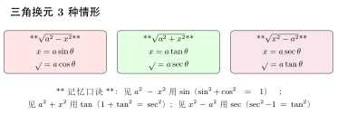
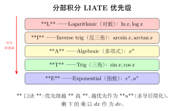
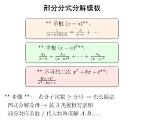

# 第13章 积分技巧

> **一例速记**：
> **分部积分** $\int u\,dv = uv - \int v\,du$；选 $u$ 用 **LIATE**：对数 → 反三角 → 多项式 → 三角 → 指数，优先级越高越优先作 $u$。
> **三角换元**：$\sqrt{a^2-x^2}$ → $x=a\sin\theta$；$\sqrt{a^2+x^2}$ → $x=a\tan\theta$；$\sqrt{x^2-a^2}$ → $x=a\sec\theta$。
> **部分分式**：有理函数 $P(x)/Q(x)$（先化真分式）→ 按 $Q$ 的因式分解写成简单分式之和。

---

## 引入：分部积分的"LIATE 实战"

> **题目**：求 $\int x \ln x \, dx$。

请先停下来想一想：见 $x\ln x$ 乘积，立刻准备**分部积分**。但**谁作 $u$ 谁作 $dv$**？

**关键观察**：用 LIATE 口诀——**L**ogarithmic（对数 $\ln x$）优先级最高，应作 $u$；剩下的 $x\,dx$ 作 $dv$。这样 $du = (1/x)\,dx$ 简化为 $1/x$（消去 $\ln$），$v = x^2/2$ 也可控。下面把内心独白完整还原。

---

## 思维路径还原（解题者的内心独白）

> "看到 $\int x \ln x\,dx$，立刻识别：**两个不同类型函数的乘积**。这是分部积分的标志。
>
> **选 $u, dv$**：用 LIATE。$\ln x$ 是 **L**，$x$ 是 **A**（多项式）。L 优先级 > A，所以 $u = \ln x$，$dv = x\,dx$。
>
> **算 $du, v$**：
> $$du = \frac{1}{x}\,dx, \quad v = \frac{x^2}{2}.$$
>
> **套公式**：
> $$\int x\ln x\,dx = uv - \int v\,du = \frac{x^2}{2}\ln x - \int \frac{x^2}{2}\cdot\frac{1}{x}\,dx = \frac{x^2}{2}\ln x - \int \frac{x}{2}\,dx.$$
>
> **算剩余积分**：$\int (x/2)\,dx = x^2/4$。所以
> $$\int x\ln x\,dx = \frac{x^2}{2}\ln x - \frac{x^2}{4} + C.$$
>
> **验证（万能武器）**：求导
> $$\left(\frac{x^2}{2}\ln x - \frac{x^2}{4}\right)' = x\ln x + \frac{x^2}{2}\cdot\frac{1}{x} - \frac{x}{2} = x\ln x + \frac{x}{2} - \frac{x}{2} = x\ln x \checkmark$$
>
> 关键洞察：**LIATE 选错会让积分变更复杂**（甚至循环）——比如若选 $u=x, dv=\ln x\,dx$，则 $v=\int\ln x\,dx$ 本身就是另一个分部积分，得不偿失。
>
> **"反例" $\int e^x\sin x\,dx$**：L、I 都没有，A 也没有，只有 T 和 E。两次分部后会"循环回原积分"，但**可解方程求出**。这是分部积分的"封口"技巧（详见正文 13.x 节）。"

---

## 学习目标

通过本章学习，你将能够：

- 掌握有理函数的积分方法，熟练运用部分分式分解
- 掌握三角函数的各类积分，包括万能代换和特殊技巧
- 掌握无理函数的积分方法，包括三角代换和欧拉代换
- 学会利用定积分的对称性和特殊公式简化计算
- 熟练运用华里士公式和区间再现公式

---

## 13.1 有理函数的积分

### 13.1.1 有理函数的概念

**定义**（有理函数）：两个多项式的商 $R(x) = \dfrac{P(x)}{Q(x)}$ 称为**有理函数**，其中 $P(x)$、$Q(x)$ 是多项式。

若 $\deg P(x) < \deg Q(x)$，称为**真分式**；若 $\deg P(x) \geq \deg Q(x)$，称为**假分式**。

假分式总可以通过多项式除法化为一个多项式与一个真分式之和：
$$\frac{P(x)}{Q(x)} = S(x) + \frac{R(x)}{Q(x)}$$

其中 $S(x)$ 是多项式，$\dfrac{R(x)}{Q(x)}$ 是真分式。

### 13.1.2 部分分式分解

**基本原理**：任何真分式都可以分解为若干**最简分式**之和。

设 $Q(x)$ 已分解为不可约因式的乘积：
$$Q(x) = (x - a_1)^{k_1} \cdots (x - a_r)^{k_r} (x^2 + p_1 x + q_1)^{l_1} \cdots (x^2 + p_s x + q_s)^{l_s}$$

则真分式 $\dfrac{P(x)}{Q(x)}$ 可分解为以下形式的最简分式之和：

**一次因式**：$(x - a)^k$ 对应
$$\frac{A_1}{x-a} + \frac{A_2}{(x-a)^2} + \cdots + \frac{A_k}{(x-a)^k}$$

**二次因式**：$(x^2 + px + q)^l$（判别式 $p^2 - 4q < 0$）对应
$$\frac{B_1 x + C_1}{x^2 + px + q} + \frac{B_2 x + C_2}{(x^2 + px + q)^2} + \cdots + \frac{B_l x + C_l}{(x^2 + px + q)^l}$$

### 13.1.3 最简分式的积分

**类型1**：$\int \dfrac{A}{x-a} \, dx = A \ln|x - a| + C$

**类型2**：$\int \dfrac{A}{(x-a)^n} \, dx = \dfrac{A}{(1-n)(x-a)^{n-1}} + C$（$n \geq 2$）

**类型3**：$\int \dfrac{Bx + C}{x^2 + px + q} \, dx$

先配方：$x^2 + px + q = \left(x + \dfrac{p}{2}\right)^2 + q - \dfrac{p^2}{4}$

设 $u = x + \dfrac{p}{2}$，$a^2 = q - \dfrac{p^2}{4} > 0$，则
$$\int \frac{Bx + C}{x^2 + px + q} \, dx = \frac{B}{2}\ln(x^2 + px + q) + \frac{C - \frac{Bp}{2}}{a}\arctan\frac{x + \frac{p}{2}}{a} + C$$

### 13.1.4 例题详解

> **例题 13.1** 求 $\int \dfrac{x + 1}{x^2 - 5x + 6} \, dx$。

**解**：首先分解分母：$x^2 - 5x + 6 = (x-2)(x-3)$。

设部分分式：
$$\frac{x + 1}{(x-2)(x-3)} = \frac{A}{x-2} + \frac{B}{x-3}$$

通分得 $x + 1 = A(x-3) + B(x-2)$。

令 $x = 2$：$3 = A(-1)$，得 $A = -3$。

令 $x = 3$：$4 = B(1)$，得 $B = 4$。

因此：
$$\int \frac{x + 1}{x^2 - 5x + 6} \, dx = \int \left(\frac{-3}{x-2} + \frac{4}{x-3}\right) dx = -3\ln|x-2| + 4\ln|x-3| + C$$

$\square$

> **例题 13.2** 求 $\int \dfrac{x^2}{(x-1)(x+1)^2} \, dx$。

**解**：设部分分式：
$$\frac{x^2}{(x-1)(x+1)^2} = \frac{A}{x-1} + \frac{B}{x+1} + \frac{C}{(x+1)^2}$$

通分得 $x^2 = A(x+1)^2 + B(x-1)(x+1) + C(x-1)$。

令 $x = 1$：$1 = 4A$，得 $A = \dfrac{1}{4}$。

令 $x = -1$：$1 = -2C$，得 $C = -\dfrac{1}{2}$。

比较 $x^2$ 系数：$1 = A + B$，得 $B = \dfrac{3}{4}$。

因此：
$$\int \frac{x^2}{(x-1)(x+1)^2} \, dx = \frac{1}{4}\ln|x-1| + \frac{3}{4}\ln|x+1| + \frac{1}{2(x+1)} + C$$

$\square$

> **例题 13.3** 求 $\int \dfrac{1}{x^2 + 2x + 5} \, dx$。

**解**：配方：$x^2 + 2x + 5 = (x+1)^2 + 4$。

设 $u = x + 1$，则：
$$\int \frac{1}{x^2 + 2x + 5} \, dx = \int \frac{1}{u^2 + 4} \, du = \frac{1}{2}\arctan\frac{u}{2} + C = \frac{1}{2}\arctan\frac{x+1}{2} + C$$

$\square$

---

## 13.2 三角函数的积分

### 13.2.1 $\sin^m x \cos^n x$ 型积分

**情形1**：$m$ 或 $n$ 为奇数

若 $m = 2k+1$（奇数），则
$$\int \sin^{2k+1}x \cos^n x \, dx = -\int (1-\cos^2 x)^k \cos^n x \, d(\cos x)$$

若 $n = 2k+1$（奇数），则
$$\int \sin^m x \cos^{2k+1} x \, dx = \int \sin^m x (1-\sin^2 x)^k \, d(\sin x)$$

> **例题 13.4** 求 $\int \sin^3 x \cos^2 x \, dx$。

**解**：$m = 3$ 为奇数，分离一个 $\sin x$：
$$\int \sin^3 x \cos^2 x \, dx = -\int \sin^2 x \cos^2 x \, d(\cos x) = -\int (1 - \cos^2 x)\cos^2 x \, d(\cos x)$$

设 $u = \cos x$：
$$= -\int (u^2 - u^4) \, du = -\frac{u^3}{3} + \frac{u^5}{5} + C = -\frac{\cos^3 x}{3} + \frac{\cos^5 x}{5} + C$$

$\square$

**情形2**：$m$ 和 $n$ 都为偶数

利用降幂公式：
$$\sin^2 x = \frac{1 - \cos 2x}{2}, \quad \cos^2 x = \frac{1 + \cos 2x}{2}$$

> **例题 13.5** 求 $\int \sin^2 x \cos^2 x \, dx$。

**解**：利用 $\sin x \cos x = \dfrac{1}{2}\sin 2x$：
$$\int \sin^2 x \cos^2 x \, dx = \int \frac{\sin^2 2x}{4} \, dx = \frac{1}{4}\int \frac{1 - \cos 4x}{2} \, dx$$
$$= \frac{1}{8}\left(x - \frac{\sin 4x}{4}\right) + C = \frac{x}{8} - \frac{\sin 4x}{32} + C$$

$\square$

### 13.2.2 $\tan^m x \sec^n x$ 型积分

**情形1**：$n$ 为偶数（$n \geq 2$）

分离 $\sec^2 x$ 作为 $d(\tan x)$，其余用 $\sec^2 x = 1 + \tan^2 x$ 化为 $\tan x$ 的函数。

> **例题 13.6** 求 $\int \tan^2 x \sec^4 x \, dx$。

**解**：
$$\int \tan^2 x \sec^4 x \, dx = \int \tan^2 x \sec^2 x \cdot \sec^2 x \, dx = \int \tan^2 x (1 + \tan^2 x) \, d(\tan x)$$

设 $u = \tan x$：
$$= \int (u^2 + u^4) \, du = \frac{u^3}{3} + \frac{u^5}{5} + C = \frac{\tan^3 x}{3} + \frac{\tan^5 x}{5} + C$$

$\square$

**情形2**：$m$ 为奇数

分离 $\sec x \tan x$ 作为 $d(\sec x)$，其余用 $\tan^2 x = \sec^2 x - 1$ 化为 $\sec x$ 的函数。

> **例题 13.7** 求 $\int \tan^3 x \sec x \, dx$。

**解**：
$$\int \tan^3 x \sec x \, dx = \int \tan^2 x \cdot \sec x \tan x \, dx = \int (\sec^2 x - 1) \, d(\sec x)$$

设 $u = \sec x$：
$$= \int (u^2 - 1) \, du = \frac{u^3}{3} - u + C = \frac{\sec^3 x}{3} - \sec x + C$$

$\square$

**特殊积分**：
$$\int \sec x \, dx = \ln|\sec x + \tan x| + C$$
$$\int \sec^3 x \, dx = \frac{1}{2}(\sec x \tan x + \ln|\sec x + \tan x|) + C$$

### 13.2.3 万能代换

**万能代换**：设 $t = \tan\dfrac{x}{2}$，则
$$\sin x = \frac{2t}{1+t^2}, \quad \cos x = \frac{1-t^2}{1+t^2}, \quad dx = \frac{2}{1+t^2} \, dt$$

这种代换可将任何三角有理式的积分化为有理函数的积分。

> **例题 13.8** 求 $\int \dfrac{1}{1 + \sin x} \, dx$。

**解**：设 $t = \tan\dfrac{x}{2}$，则 $\sin x = \dfrac{2t}{1+t^2}$，$dx = \dfrac{2}{1+t^2} \, dt$。

$$\int \frac{1}{1 + \sin x} \, dx = \int \frac{1}{1 + \frac{2t}{1+t^2}} \cdot \frac{2}{1+t^2} \, dt = \int \frac{2}{1+t^2+2t} \, dt$$
$$= \int \frac{2}{(1+t)^2} \, dt = -\frac{2}{1+t} + C = -\frac{2}{1 + \tan\frac{x}{2}} + C$$

$\square$

> **例题 13.9** 求 $\int \dfrac{1}{3 + 5\cos x} \, dx$。

**解**：设 $t = \tan\dfrac{x}{2}$，则 $\cos x = \dfrac{1-t^2}{1+t^2}$，$dx = \dfrac{2}{1+t^2} \, dt$。

$$\int \frac{1}{3 + 5\cos x} \, dx = \int \frac{1}{3 + 5 \cdot \frac{1-t^2}{1+t^2}} \cdot \frac{2}{1+t^2} \, dt = \int \frac{2}{3(1+t^2) + 5(1-t^2)} \, dt$$
$$= \int \frac{2}{8 - 2t^2} \, dt = \int \frac{1}{4 - t^2} \, dt = \frac{1}{4}\ln\left|\frac{2+t}{2-t}\right| + C$$

将 $t = \tan\dfrac{x}{2}$ 代回：
$$= \frac{1}{4}\ln\left|\frac{2 + \tan\frac{x}{2}}{2 - \tan\frac{x}{2}}\right| + C$$

$\square$

---

## 13.3 无理函数的积分

### 13.3.1 简单根式代换

对于含有 $\sqrt[n]{ax + b}$ 的积分，设 $t = \sqrt[n]{ax + b}$。

> **例题 13.10** 求 $\int \dfrac{1}{x + \sqrt{x}} \, dx$。

**解**：设 $t = \sqrt{x}$，则 $x = t^2$，$dx = 2t \, dt$。

$$\int \frac{1}{x + \sqrt{x}} \, dx = \int \frac{2t}{t^2 + t} \, dt = \int \frac{2}{t + 1} \, dt = 2\ln|t + 1| + C = 2\ln(\sqrt{x} + 1) + C$$

$\square$

对于含有 $\sqrt[n]{\dfrac{ax + b}{cx + d}}$ 的积分，设 $t = \sqrt[n]{\dfrac{ax + b}{cx + d}}$。

> **例题 13.11** 求 $\int \dfrac{1}{1 + \sqrt[3]{\frac{x+1}{x}}} \, dx$。

**解**：设 $t = \sqrt[3]{\dfrac{x+1}{x}} = \sqrt[3]{1 + \dfrac{1}{x}}$，则 $t^3 = 1 + \dfrac{1}{x}$，$x = \dfrac{1}{t^3 - 1}$。

$$dx = \frac{-3t^2}{(t^3 - 1)^2} \, dt$$

$$\int \frac{1}{1 + \sqrt[3]{\frac{x+1}{x}}} \, dx = \int \frac{1}{1 + t} \cdot \frac{-3t^2}{(t^3 - 1)^2} \, dt$$

注意到 $t^3 - 1 = (t-1)(t^2 + t + 1)$：
$$= -3\int \frac{t^2}{(1+t)(t-1)^2(t^2+t+1)^2} \, dt$$

此积分较为复杂，需用部分分式分解。$\square$

### 13.3.2 三角代换详解

| 根式类型 | 代换方法 | 简化结果 | 适用条件 |
|:---:|:---:|:---:|:---:|
| $\sqrt{a^2 - x^2}$ | $x = a\sin t$ | $a\cos t$ | $t \in [-\frac{\pi}{2}, \frac{\pi}{2}]$ |
| $\sqrt{x^2 + a^2}$ | $x = a\tan t$ | $a\sec t$ | $t \in (-\frac{\pi}{2}, \frac{\pi}{2})$ |
| $\sqrt{x^2 - a^2}$ | $x = a\sec t$ | $a|\tan t|$ | $t \in [0, \frac{\pi}{2}) \cup (\frac{\pi}{2}, \pi]$ |

> **例题 13.12** 求 $\int \dfrac{x^2}{\sqrt{x^2 + 4}} \, dx$。

**解**：设 $x = 2\tan t$，$t \in \left(-\dfrac{\pi}{2}, \dfrac{\pi}{2}\right)$，则 $dx = 2\sec^2 t \, dt$，$\sqrt{x^2 + 4} = 2\sec t$。

$$\int \frac{x^2}{\sqrt{x^2 + 4}} \, dx = \int \frac{4\tan^2 t}{2\sec t} \cdot 2\sec^2 t \, dt = 4\int \tan^2 t \sec t \, dt$$
$$= 4\int (\sec^2 t - 1)\sec t \, dt = 4\int (\sec^3 t - \sec t) \, dt$$

利用 $\int \sec^3 t \, dt = \dfrac{1}{2}(\sec t \tan t + \ln|\sec t + \tan t|) + C_1$ 和 $\int \sec t \, dt = \ln|\sec t + \tan t| + C_2$：

$$= 4 \cdot \frac{1}{2}(\sec t \tan t + \ln|\sec t + \tan t|) - 4\ln|\sec t + \tan t| + C$$
$$= 2\sec t \tan t - 2\ln|\sec t + \tan t| + C$$

将 $\tan t = \dfrac{x}{2}$，$\sec t = \dfrac{\sqrt{x^2 + 4}}{2}$ 代回：
$$= \frac{x\sqrt{x^2 + 4}}{2} - 2\ln\left|\frac{\sqrt{x^2 + 4} + x}{2}\right| + C = \frac{x\sqrt{x^2 + 4}}{2} - 2\ln|x + \sqrt{x^2 + 4}| + C'$$

$\square$

> **例题 13.13** 求 $\int \dfrac{\sqrt{x^2 - 9}}{x} \, dx$。

**解**：设 $x = 3\sec t$，$t \in \left[0, \dfrac{\pi}{2}\right)$（设 $x > 3$），则 $dx = 3\sec t \tan t \, dt$，$\sqrt{x^2 - 9} = 3\tan t$。

$$\int \frac{\sqrt{x^2 - 9}}{x} \, dx = \int \frac{3\tan t}{3\sec t} \cdot 3\sec t \tan t \, dt = 3\int \tan^2 t \, dt$$
$$= 3\int (\sec^2 t - 1) \, dt = 3(\tan t - t) + C$$

将 $\sec t = \dfrac{x}{3}$，$\tan t = \dfrac{\sqrt{x^2 - 9}}{3}$，$t = \text{arcsec}\dfrac{x}{3}$ 代回：
$$= \sqrt{x^2 - 9} - 3\text{arcsec}\frac{x}{3} + C = \sqrt{x^2 - 9} - 3\arccos\frac{3}{x} + C$$

$\square$

### 13.3.3 欧拉代换（选讲）

对于形如 $\int R(x, \sqrt{ax^2 + bx + c}) \, dx$ 的积分（其中 $R$ 是有理函数，$a \neq 0$），当三角代换不便时，可用**欧拉代换**将其化为有理函数的积分。

**欧拉代换的核心思想**：通过适当的代换，将无理式 $\sqrt{ax^2 + bx + c}$ 有理化。根据 $a$、$c$ 的符号和判别式的情况，分为三种代换，它们覆盖了所有可能的情形。

---

**第一欧拉代换**

**适用条件**：$a > 0$（二次项系数为正）。

**代换方法**：设 $\sqrt{ax^2 + bx + c} = t \pm \sqrt{a} \cdot x$。

**原理**：当 $x \to \pm\infty$ 时，$\sqrt{ax^2 + bx + c} \approx \sqrt{a}\,|x|$，因此 $\sqrt{ax^2 + bx + c} - \sqrt{a}\,x$ 是有界量，可以用 $t$ 来参数化。

两边平方：$ax^2 + bx + c = t^2 - 2\sqrt{a}\,tx + ax^2$，消去 $ax^2$ 后解得

$$x = \frac{t^2 - c}{b + 2\sqrt{a}\,t}$$

从而 $dx$ 和 $\sqrt{ax^2 + bx + c}$ 都可以表示为 $t$ 的有理式。

---

**第二欧拉代换**

**适用条件**：$c > 0$（常数项为正）。

**代换方法**：设 $\sqrt{ax^2 + bx + c} = xt + \sqrt{c}$。

**原理**：当 $x = 0$ 时，$\sqrt{c}$ 是确定的值，代换在 $x = 0$ 附近的行为良好。

两边平方：$ax^2 + bx + c = x^2t^2 + 2\sqrt{c}\,xt + c$，消去 $c$ 后除以 $x$（设 $x \neq 0$）：

$$ax + b = x t^2 + 2\sqrt{c}\,t$$

解得

$$x = \frac{b - 2\sqrt{c}\,t}{t^2 - a}$$

从而 $dx$ 和 $\sqrt{ax^2 + bx + c}$ 都可以表示为 $t$ 的有理式。

---

**第三欧拉代换**

**适用条件**：$ax^2 + bx + c$ 有两个实根 $x_1$、$x_2$，即 $ax^2 + bx + c = a(x - x_1)(x - x_2)$，且判别式 $b^2 - 4ac \geq 0$。

**代换方法**：设 $\sqrt{ax^2 + bx + c} = t(x - x_1)$。

**原理**：在实根 $x_1$ 处，$\sqrt{ax^2 + bx + c} = 0$，代换 $t(x - x_1)$ 在该处自然地等于零。

两边平方：$a(x - x_1)(x - x_2) = t^2(x - x_1)^2$，两边除以 $(x - x_1)$（设 $x \neq x_1$）：

$$a(x - x_2) = t^2(x - x_1)$$

解得

$$x = \frac{ax_2 - t^2 x_1}{a - t^2}$$

从而 $dx$ 和 $\sqrt{ax^2 + bx + c}$ 都可以表示为 $t$ 的有理式。

---

**三种代换的选择标准汇总**：

| 代换类型 | 适用条件 | 代换形式 |
|:---:|:---:|:---:|
| 第一欧拉代换 | $a > 0$ | $\sqrt{ax^2 + bx + c} = t - \sqrt{a}\,x$ |
| 第二欧拉代换 | $c > 0$ | $\sqrt{ax^2 + bx + c} = xt + \sqrt{c}$ |
| 第三欧拉代换 | $b^2 - 4ac \geq 0$（有实根 $x_1, x_2$） | $\sqrt{ax^2 + bx + c} = t(x - x_1)$ |

**注**：对于任何二次三项式 $ax^2 + bx + c$（$a \neq 0$，且使根号下非负），上述三种代换中至少有一种可以使用。实际计算时，应根据具体情况选择使运算最简便的代换。

---

> **例题 13.14** 用第一欧拉代换求 $\int \dfrac{1}{\sqrt{x^2 + 1}} \, dx$。

**解**：因 $a = 1 > 0$，用第一欧拉代换，设 $\sqrt{x^2 + 1} = t - x$。

则 $x^2 + 1 = t^2 - 2tx + x^2$，解得 $x = \dfrac{t^2 - 1}{2t}$，$dx = \dfrac{t^2 + 1}{2t^2} \, dt$。

且 $\sqrt{x^2 + 1} = t - x = t - \dfrac{t^2 - 1}{2t} = \dfrac{t^2 + 1}{2t}$。

$$\int \frac{1}{\sqrt{x^2 + 1}} \, dx = \int \frac{2t}{t^2 + 1} \cdot \frac{t^2 + 1}{2t^2} \, dt = \int \frac{1}{t} \, dt = \ln|t| + C$$

将 $t = x + \sqrt{x^2 + 1}$ 代回：
$$= \ln|x + \sqrt{x^2 + 1}| + C$$

$\square$

> **例题 13.15** 用第二欧拉代换求 $\int \dfrac{1}{\sqrt{x^2 + x + 1}} \, dx$。

**解**：此处 $a = 1 > 0$，$c = 1 > 0$，可用第一或第二欧拉代换。选用第二欧拉代换：设 $\sqrt{x^2 + x + 1} = xt + 1$。

两边平方：$x^2 + x + 1 = x^2 t^2 + 2xt + 1$，消去常数项 $1$，除以 $x$（$x \neq 0$）：

$$x + 1 = xt^2 + 2t$$

解得

$$x = \frac{1 - 2t}{t^2 - 1} = \frac{2t - 1}{1 - t^2}$$

$$dx = \frac{2(1 - t^2) - (2t - 1)(-2t)}{(1 - t^2)^2} \, dt = \frac{2 - 2t^2 + 4t^2 - 2t}{(1 - t^2)^2} \, dt = \frac{2t^2 - 2t + 2}{(1 - t^2)^2} \, dt$$

又 $\sqrt{x^2 + x + 1} = xt + 1 = \dfrac{(2t - 1)t}{1 - t^2} + 1 = \dfrac{2t^2 - t + 1 - t^2}{1 - t^2} = \dfrac{t^2 - t + 1}{1 - t^2}$

（注意取绝对值和符号后），代入积分化为有理函数积分，最终利用部分分式可求得结果。

对于此题，实际上第一欧拉代换或先配方再用三角代换更简便。此例旨在展示第二欧拉代换的操作流程。$\square$

> **例题 13.16** 用第三欧拉代换求 $\int \dfrac{dx}{\sqrt{(x - 1)(3 - x)}}$。

**解**：被积函数中 $ax^2 + bx + c = -(x^2 - 4x + 3) = -(x - 1)(x - 3)$。

注意到根号下需非负，故要求 $1 \leq x \leq 3$。二次式有两个实根 $x_1 = 1$，$x_2 = 3$。

改写：$(x - 1)(3 - x) = -(x - 1)(x - 3)$，设 $\sqrt{(x-1)(3-x)} = t(x - 1)$。

两边平方：$(x - 1)(3 - x) = t^2(x - 1)^2$。当 $x \neq 1$ 时，除以 $(x - 1)$：

$$3 - x = t^2(x - 1)$$

$$3 = x(1 + t^2) - t^2$$

$$x = \frac{3 + t^2}{1 + t^2}$$

$$dx = \frac{2t(1 + t^2) - (3 + t^2) \cdot 2t}{(1 + t^2)^2} \, dt = \frac{2t + 2t^3 - 6t - 2t^3}{(1 + t^2)^2} \, dt = \frac{-4t}{(1 + t^2)^2} \, dt$$

又 $x - 1 = \dfrac{3 + t^2}{1 + t^2} - 1 = \dfrac{2}{1 + t^2}$，故

$$\sqrt{(x-1)(3-x)} = t(x - 1) = \frac{2t}{1 + t^2}$$

代入积分：

$$\int \frac{dx}{\sqrt{(x-1)(3-x)}} = \int \frac{1}{\dfrac{2t}{1 + t^2}} \cdot \frac{-4t}{(1 + t^2)^2} \, dt = \int \frac{1 + t^2}{2t} \cdot \frac{-4t}{(1 + t^2)^2} \, dt$$

$$= \int \frac{-2}{1 + t^2} \, dt = -2\arctan t + C$$

将 $t = \dfrac{\sqrt{(x-1)(3-x)}}{x - 1}$ 代回，得

$$\int \frac{dx}{\sqrt{(x-1)(3-x)}} = -2\arctan\frac{\sqrt{(x-1)(3-x)}}{x - 1} + C$$

$\square$

---

## 13.4 定积分的特殊技巧

### 13.4.1 利用对称性（奇偶函数）

**回顾**：设 $f(x)$ 在 $[-a, a]$ 上连续，则：
- 若 $f(x)$ 为偶函数：$\int_{-a}^a f(x) \, dx = 2\int_0^a f(x) \, dx$
- 若 $f(x)$ 为奇函数：$\int_{-a}^a f(x) \, dx = 0$

> **例题 13.17** 计算 $\int_{-\pi}^{\pi} \dfrac{x^2 \sin x}{1 + x^4} \, dx$。

**解**：设 $f(x) = \dfrac{x^2 \sin x}{1 + x^4}$。

检验奇偶性：$f(-x) = \dfrac{(-x)^2 \sin(-x)}{1 + (-x)^4} = \dfrac{x^2 (-\sin x)}{1 + x^4} = -f(x)$

因此 $f(x)$ 是奇函数，故 $\int_{-\pi}^{\pi} \dfrac{x^2 \sin x}{1 + x^4} \, dx = 0$。$\square$

> **例题 13.18** 计算 $\int_{-1}^{1} \dfrac{x^4}{1 + e^x} \, dx$。

**解**：设 $f(x) = \dfrac{x^4}{1 + e^x}$，$g(x) = \dfrac{x^4}{1 + e^{-x}}$。

注意到 $g(x) = \dfrac{x^4}{1+e^{-x}} = f(-x)$，且 $\dfrac{1}{1+e^x} + \dfrac{1}{1+e^{-x}} = \dfrac{1}{1+e^x} + \dfrac{e^x}{e^x+1} = 1$，故 $f(x) + f(-x) = x^4$。

因此：
$$\int_{-1}^{1} f(x) \, dx = \frac{1}{2}\int_{-1}^{1} [f(x) + f(-x)] \, dx = \frac{1}{2}\int_{-1}^{1} x^4 \, dx = \frac{1}{2} \cdot 2\int_0^1 x^4 \, dx = \frac{x^5}{5}\Big|_0^1 = \frac{1}{5}$$

$\square$

### 13.4.2 华里士公式（Wallis）

**华里士公式**：
$$I_n = \int_0^{\pi/2} \sin^n x \, dx = \int_0^{\pi/2} \cos^n x \, dx$$

其递推关系为：$I_n = \dfrac{n-1}{n} I_{n-2}$（$n \geq 2$），其中 $I_0 = \dfrac{\pi}{2}$，$I_1 = 1$。

展开得：
$$I_n = \begin{cases}
\dfrac{(n-1)!!}{n!!} \cdot \dfrac{\pi}{2}, & n \text{ 为偶数} \\[2mm]
\dfrac{(n-1)!!}{n!!}, & n \text{ 为奇数}
\end{cases}$$

其中 $n!! = n(n-2)(n-4)\cdots$ 表示**双阶乘**。

**推导**：利用分部积分
$$I_n = \int_0^{\pi/2} \sin^n x \, dx = -\int_0^{\pi/2} \sin^{n-1}x \, d(\cos x)$$
$$= -\sin^{n-1}x \cos x \Big|_0^{\pi/2} + (n-1)\int_0^{\pi/2} \sin^{n-2}x \cos^2 x \, dx$$
$$= (n-1)\int_0^{\pi/2} \sin^{n-2}x (1 - \sin^2 x) \, dx = (n-1)(I_{n-2} - I_n)$$

解得 $I_n = \dfrac{n-1}{n} I_{n-2}$。

> **例题 13.19** 计算 $\int_0^{\pi/2} \sin^6 x \, dx$。

**解**：由华里士公式（$n = 6$ 为偶数）：
$$I_6 = \frac{5!!}{6!!} \cdot \frac{\pi}{2} = \frac{5 \cdot 3 \cdot 1}{6 \cdot 4 \cdot 2} \cdot \frac{\pi}{2} = \frac{15}{48} \cdot \frac{\pi}{2} = \frac{5\pi}{32}$$

$\square$

> **例题 13.20** 计算 $\int_0^{\pi/2} \cos^5 x \, dx$。

**解**：由华里士公式（$n = 5$ 为奇数）：
$$I_5 = \frac{4!!}{5!!} = \frac{4 \cdot 2}{5 \cdot 3 \cdot 1} = \frac{8}{15}$$

$\square$

### 13.4.3 区间再现公式

**区间再现公式**：设 $f(x)$ 在 $[a, b]$ 上连续，则
$$\int_a^b f(x) \, dx = \int_a^b f(a + b - x) \, dx$$

**证明**：设 $t = a + b - x$，则 $dt = -dx$。当 $x = a$ 时 $t = b$，当 $x = b$ 时 $t = a$。
$$\int_a^b f(a + b - x) \, dx = -\int_b^a f(t) \, dt = \int_a^b f(t) \, dt$$

$\square$

**重要推论**：
$$\int_0^{\pi} xf(\sin x) \, dx = \frac{\pi}{2}\int_0^{\pi} f(\sin x) \, dx$$

> **例题 13.21** 计算 $\int_0^{\pi} \dfrac{x \sin x}{1 + \cos^2 x} \, dx$。

**解**：设 $I = \int_0^{\pi} \dfrac{x \sin x}{1 + \cos^2 x} \, dx$。

利用区间再现，设 $t = \pi - x$：
$$I = \int_0^{\pi} \frac{(\pi - t) \sin t}{1 + \cos^2 t} \, dt = \pi\int_0^{\pi} \frac{\sin t}{1 + \cos^2 t} \, dt - I$$

因此 $2I = \pi\int_0^{\pi} \dfrac{\sin x}{1 + \cos^2 x} \, dx$。

设 $u = \cos x$，$du = -\sin x \, dx$。当 $x = 0$ 时 $u = 1$，当 $x = \pi$ 时 $u = -1$。
$$\int_0^{\pi} \frac{\sin x}{1 + \cos^2 x} \, dx = -\int_1^{-1} \frac{1}{1 + u^2} \, du = \int_{-1}^{1} \frac{1}{1 + u^2} \, du = \arctan u \Big|_{-1}^{1} = \frac{\pi}{4} - \left(-\frac{\pi}{4}\right) = \frac{\pi}{2}$$

故 $I = \dfrac{\pi}{2} \cdot \dfrac{\pi}{2} = \dfrac{\pi^2}{4}$。$\square$

> **例题 13.22** 计算 $\int_0^{\pi/2} \dfrac{\sin x}{\sin x + \cos x} \, dx$。

**解**：设 $I = \int_0^{\pi/2} \dfrac{\sin x}{\sin x + \cos x} \, dx$。

利用区间再现，设 $t = \dfrac{\pi}{2} - x$：
$$I = \int_0^{\pi/2} \frac{\sin(\frac{\pi}{2} - t)}{\sin(\frac{\pi}{2} - t) + \cos(\frac{\pi}{2} - t)} \, dt = \int_0^{\pi/2} \frac{\cos t}{\cos t + \sin t} \, dt$$

因此：
$$2I = \int_0^{\pi/2} \frac{\sin x}{\sin x + \cos x} \, dx + \int_0^{\pi/2} \frac{\cos x}{\sin x + \cos x} \, dx = \int_0^{\pi/2} 1 \, dx = \frac{\pi}{2}$$

故 $I = \dfrac{\pi}{4}$。$\square$

---

## 本章小结

1. **有理函数的积分**：
   - 假分式先化为多项式与真分式之和
   - 真分式用部分分式分解为最简分式
   - 最简分式直接积分或配方后积分

2. **三角函数的积分**：
   - $\sin^m x \cos^n x$ 型：奇次幂时凑微分，偶次幂时用降幂公式
   - $\tan^m x \sec^n x$ 型：$n$ 为偶数凑 $d(\tan x)$，$m$ 为奇数凑 $d(\sec x)$
   - 万能代换 $t = \tan\dfrac{x}{2}$ 可处理所有三角有理式

3. **无理函数的积分**：
   - 简单根式代换：设 $t = \sqrt[n]{ax + b}$
   - 三角代换：$\sqrt{a^2 - x^2}$ 用正弦，$\sqrt{x^2 + a^2}$ 用正切，$\sqrt{x^2 - a^2}$ 用正割
   - 欧拉代换：处理一般二次根式

4. **定积分的特殊技巧**：
   - 奇偶函数性质简化对称区间上的积分
   - 华里士公式：$\int_0^{\pi/2} \sin^n x \, dx$ 的递推计算
   - 区间再现公式：$\int_a^b f(x) \, dx = \int_a^b f(a+b-x) \, dx$

---

## 深度学习应用

积分技巧在深度学习中有广泛的应用，从概率分布的归一化到生成模型的密度估计，都离不开本章所学的方法。

### 高斯积分与正态分布

**高斯积分**是概率与统计的基石：

$$\int_{-\infty}^{\infty} e^{-x^2} \, dx = \sqrt{\pi}$$

**推导**（二重积分法）：设 $I = \int_{-\infty}^{\infty} e^{-x^2} \, dx$，则

$$I^2 = \int_{-\infty}^{\infty} e^{-x^2} \, dx \cdot \int_{-\infty}^{\infty} e^{-y^2} \, dy = \iint_{\mathbb{R}^2} e^{-(x^2 + y^2)} \, dx \, dy$$

转为极坐标 $x = r\cos\theta$，$y = r\sin\theta$：

$$I^2 = \int_0^{2\pi} \int_0^{\infty} e^{-r^2} r \, dr \, d\theta = 2\pi \cdot \frac{1}{2} = \pi$$

故 $I = \sqrt{\pi}$。

**正态分布归一化常数**：正态分布 $\mathcal{N}(\mu, \sigma^2)$ 的概率密度函数

$$p(x) = \frac{1}{\sqrt{2\pi}\sigma} e^{-\frac{(x-\mu)^2}{2\sigma^2}}$$

其归一化常数 $\dfrac{1}{\sqrt{2\pi}\sigma}$ 正是由高斯积分保证 $\int_{-\infty}^{\infty} p(x) \, dx = 1$。对高斯积分作换元 $x \to \dfrac{x - \mu}{\sqrt{2}\sigma}$ 即可验证。

**Xavier/He 初始化中的方差计算**：初始化权重 $W \sim \mathcal{N}(0, \sigma^2)$ 时，需要计算方差使得前向传播的信号方差保持稳定。

设输入 $x_i \sim \mathcal{N}(0, 1)$，第 $j$ 个神经元的输出为 $y_j = \sum_{i=1}^{n} w_{ij} x_i$，则

$$\text{Var}(y_j) = n \cdot \text{Var}(w_{ij}) \cdot \text{Var}(x_i)$$

- **Xavier 初始化**（适用于 $\tanh$ 激活）：$\sigma^2 = \dfrac{2}{n_{\text{in}} + n_{\text{out}}}$
- **He 初始化**（适用于 ReLU 激活）：$\sigma^2 = \dfrac{2}{n_{\text{in}}}$

其中方差推导依赖于 $\int_{-\infty}^{\infty} x^2 \cdot \dfrac{1}{\sqrt{2\pi}\sigma} e^{-x^2/(2\sigma^2)} \, dx = \sigma^2$，这正是高斯积分的直接推论。

### 换元法与坐标变换：Normalizing Flows

**Normalizing Flows** 是生成模型的重要框架，其核心是**换元积分公式**（变量替换定理）。

设 $f: \mathbb{R}^d \to \mathbb{R}^d$ 是可逆变换，$X = f^{-1}(Z)$，则密度变换公式为：

$$p_Z(z) = p_X(f^{-1}(z)) \cdot |\det J_{f^{-1}}(z)|$$

其中 $J_{f^{-1}}(z)$ 是 $f^{-1}$ 在 $z$ 处的雅可比矩阵，$\det$ 表示行列式。

这是一维换元公式

$$\int_a^b f(g(t)) g'(t) \, dt = \int_{g(a)}^{g(b)} f(x) \, dx$$

的高维推广，$|g'(t)|$ 对应高维情形的 $|\det J|$。

**对数概率形式**（用于数值稳定的训练）：

$$\log p_Z(z) = \log p_X(f^{-1}(z)) + \log |\det J_{f^{-1}}(z)|$$

通过复合多个简单可逆变换 $f = f_K \circ \cdots \circ f_1$，可以将简单基础分布（如标准正态）变换为复杂分布，而每步的雅可比行列式可以高效计算。

### 分部积分与信息几何：Fisher 信息

**Fisher 信息**衡量参数 $\theta$ 对分布 $p(x; \theta)$ 的影响，定义为：

$$\mathcal{I}(\theta) = \mathbb{E}\left[\left(\frac{\partial}{\partial \theta} \log p(X; \theta)\right)^2\right] = \int_{-\infty}^{\infty} \left(\frac{\partial \log p(x; \theta)}{\partial \theta}\right)^2 p(x; \theta) \, dx$$

利用分部积分可以证明其等价形式：

$$\mathcal{I}(\theta) = -\mathbb{E}\left[\frac{\partial^2}{\partial \theta^2} \log p(X; \theta)\right] = -\int_{-\infty}^{\infty} \frac{\partial^2 \log p(x; \theta)}{\partial \theta^2} p(x; \theta) \, dx$$

**推导**：对 $\int p(x; \theta) \, dx = 1$ 关于 $\theta$ 求导，并利用分部积分即可建立上述等价关系。

Fisher 信息在自然梯度下降（Natural Gradient Descent）中用于定义参数空间中的黎曼度量，使优化过程对参数化方式不变，这正是信息几何的核心思想。

### 代码示例

```python
import torch
import torch.nn as nn
import math

# 高斯积分验证
x = torch.linspace(-10, 10, 10000)
dx = x[1] - x[0]
gaussian = torch.exp(-x**2)
integral = (gaussian * dx).sum()
print(f"∫e^(-x²)dx = {integral.item():.4f}, √π = {math.sqrt(math.pi):.4f}")

# Xavier 初始化：基于高斯积分的方差推导
class XavierDemo(nn.Module):
    def __init__(self, fan_in, fan_out):
        super().__init__()
        # Var(W) = 2/(fan_in + fan_out)
        std = math.sqrt(2.0 / (fan_in + fan_out))
        self.weight = nn.Parameter(torch.randn(fan_out, fan_in) * std)

# Normalizing Flow 示意：换元积分
def flow_log_prob(z, flow_layers):
    """计算 log p(z) 通过换元公式"""
    log_prob = torch.zeros(z.shape[0])
    for layer in flow_layers:
        z, log_det = layer(z)  # log_det = log|det(J)|
        log_prob -= log_det
    # 基础分布
    base_log_prob = -0.5 * (z**2).sum(dim=1) - 0.5 * z.shape[1] * math.log(2*math.pi)
    return base_log_prob + log_prob
```

---

## 练习题

**1.** ⭐ 求不定积分：$\int \dfrac{x^2 + 1}{x(x-1)^2} \, dx$。

**2.** ⭐ 求不定积分：$\int \sin^4 x \cos^3 x \, dx$。

**3.** ⭐ 求不定积分：$\int \dfrac{1}{2 + \sin x} \, dx$。

**4.** ⭐⭐ 计算定积分：$\int_0^{\pi/2} \sin^4 x \cos^2 x \, dx$。

**5.** ⭐⭐ 计算定积分：$\int_0^{\pi} \dfrac{x}{1 + \sin x} \, dx$。

**6.** ⭐⭐ 求不定积分：
$$
\int \frac{dx}{x^2-1}.
$$

**7.** ⭐⭐⭐ 求不定积分：
$$
\int \frac{dx}{1+\sin x}.
$$

**8.** ⭐⭐⭐ softplus 函数定义为
$$
\operatorname{softplus}(x)=\ln(1+e^x).
$$
利用积分技巧计算
$$
\int \frac{1}{1+e^{-x}}\,dx.
$$
并说明它与 softplus 的关系。

---

## 练习答案

<details>
<summary>点击展开答案</summary>

**1.** 先做部分分式分解。设
$$\frac{x^2 + 1}{x(x-1)^2} = \frac{A}{x} + \frac{B}{x-1} + \frac{C}{(x-1)^2}$$

通分得 $x^2 + 1 = A(x-1)^2 + Bx(x-1) + Cx$。

令 $x = 0$：$1 = A$，得 $A = 1$。

令 $x = 1$：$2 = C$，得 $C = 2$。

比较 $x^2$ 系数：$1 = A + B$，得 $B = 0$。

因此：
$$\int \frac{x^2 + 1}{x(x-1)^2} \, dx = \int \left(\frac{1}{x} + \frac{2}{(x-1)^2}\right) dx = \ln|x| - \frac{2}{x-1} + C$$

---

**2.** 因为 $\cos x$ 的次数为奇数，分离一个 $\cos x$：
$$\int \sin^4 x \cos^3 x \, dx = \int \sin^4 x \cos^2 x \, d(\sin x) = \int \sin^4 x (1 - \sin^2 x) \, d(\sin x)$$

设 $u = \sin x$：
$$= \int (u^4 - u^6) \, du = \frac{u^5}{5} - \frac{u^7}{7} + C = \frac{\sin^5 x}{5} - \frac{\sin^7 x}{7} + C$$

---

**3.** 使用万能代换，设 $t = \tan\dfrac{x}{2}$，则 $\sin x = \dfrac{2t}{1+t^2}$，$dx = \dfrac{2}{1+t^2} \, dt$。

$$\int \frac{1}{2 + \sin x} \, dx = \int \frac{1}{2 + \frac{2t}{1+t^2}} \cdot \frac{2}{1+t^2} \, dt = \int \frac{2}{2(1+t^2) + 2t} \, dt = \int \frac{1}{t^2 + t + 1} \, dt$$

配方：$t^2 + t + 1 = \left(t + \dfrac{1}{2}\right)^2 + \dfrac{3}{4}$。

$$= \int \frac{1}{(t + \frac{1}{2})^2 + (\frac{\sqrt{3}}{2})^2} \, dt = \frac{2}{\sqrt{3}}\arctan\frac{t + \frac{1}{2}}{\frac{\sqrt{3}}{2}} + C = \frac{2\sqrt{3}}{3}\arctan\frac{2\tan\frac{x}{2} + 1}{\sqrt{3}} + C$$

---

**4.** 利用华里士公式的推广。先化简被积函数：
$$\sin^4 x \cos^2 x = \sin^4 x (1 - \sin^2 x) = \sin^4 x - \sin^6 x$$

由华里士公式：
$$\int_0^{\pi/2} \sin^4 x \, dx = \frac{3!!}{4!!} \cdot \frac{\pi}{2} = \frac{3 \cdot 1}{4 \cdot 2} \cdot \frac{\pi}{2} = \frac{3\pi}{16}$$
$$\int_0^{\pi/2} \sin^6 x \, dx = \frac{5!!}{6!!} \cdot \frac{\pi}{2} = \frac{5 \cdot 3 \cdot 1}{6 \cdot 4 \cdot 2} \cdot \frac{\pi}{2} = \frac{5\pi}{32}$$

因此：
$$\int_0^{\pi/2} \sin^4 x \cos^2 x \, dx = \frac{3\pi}{16} - \frac{5\pi}{32} = \frac{6\pi - 5\pi}{32} = \frac{\pi}{32}$$

---

**5.** 设 $I = \int_0^{\pi} \dfrac{x}{1 + \sin x} \, dx$。

利用区间再现，设 $t = \pi - x$：
$$I = \int_0^{\pi} \frac{\pi - t}{1 + \sin(\pi - t)} \, dt = \int_0^{\pi} \frac{\pi - t}{1 + \sin t} \, dt = \pi\int_0^{\pi} \frac{1}{1 + \sin x} \, dx - I$$

因此 $2I = \pi\int_0^{\pi} \dfrac{1}{1 + \sin x} \, dx$。

对 $\int_0^{\pi} \dfrac{1}{1 + \sin x} \, dx$，用万能代换 $t = \tan\dfrac{x}{2}$：
$$\int_0^{\pi} \frac{1}{1 + \sin x} \, dx = \int_0^{+\infty} \frac{1}{1 + \frac{2t}{1+t^2}} \cdot \frac{2}{1+t^2} \, dt = \int_0^{+\infty} \frac{2}{(1+t)^2} \, dt = -\frac{2}{1+t}\Big|_0^{+\infty} = 2$$

故 $I = \dfrac{\pi \cdot 2}{2} = \pi$。

---

**6.** 作部分分式分解：
$$
\frac{1}{x^2-1}=\frac{1}{(x-1)(x+1)}=\frac{A}{x-1}+\frac{B}{x+1}.
$$

通分得
$$
1=A(x+1)+B(x-1).
$$

令 $x=1$，得 $A=\dfrac12$；令 $x=-1$，得 $B=-\dfrac12$。

所以
$$
\int \frac{dx}{x^2-1}
=\frac12\int \frac{dx}{x-1}-\frac12\int \frac{dx}{x+1}
=\frac12\ln|x-1|-\frac12\ln|x+1|+C.
$$

即
$$
\int \frac{dx}{x^2-1}
=\frac12\ln\left|\frac{x-1}{x+1}\right|+C.
$$

---

**7.** 乘以共轭式：
$$
\frac{1}{1+\sin x}
=\frac{1-\sin x}{1-\sin^2 x}
=\frac{1-\sin x}{\cos^2 x}
=\sec^2 x-\sec x\tan x.
$$

因此
$$
\int \frac{dx}{1+\sin x}
=\int (\sec^2 x-\sec x\tan x)\,dx
=\tan x-\sec x+C.
$$

---

**8.** 注意
$$
\frac{1}{1+e^{-x}}=\frac{e^x}{1+e^x}.
$$

令
$$
u=1+e^x,\qquad du=e^x\,dx.
$$

则
$$
\int \frac{1}{1+e^{-x}}\,dx
=\int \frac{e^x}{1+e^x}\,dx
=\int \frac{du}{u}
=\ln|u|+C.
$$

由于 $1+e^x>0$，所以
$$
\int \frac{1}{1+e^{-x}}\,dx
=\ln(1+e^x)+C.
$$

这正是 softplus 函数加一个常数：
$$
\operatorname{softplus}(x)=\ln(1+e^x).
$$

因此 softplus 可以看作 sigmoid 的一个原函数。

</details>


## 几何示意







---

## 思考路标（条件反射）

- 看到 $\int u\,dv$ → 分部积分：$\int u\,dv = uv - \int v\,du$
- 选 $u$ → 用 **LIATE**（对数 / 反三角 / 多项式 / 三角 / 指数 优先级）
- 看到 $\sqrt{a^2-x^2}$ → $x=a\sin\theta$
- 看到 $\sqrt{a^2+x^2}$ → $x=a\tan\theta$
- 看到 $\sqrt{x^2-a^2}$ → $x=a\sec\theta$
- 看到有理函数 $P(x)/Q(x)$ → 部分分式分解
- 看到 $R(\sin x, \cos x)$ 有理 → 万能代换 $t=\tan(x/2)$
- 看到 $1/x^n$ 在分母 → 倒代换 $x=1/t$

## 易错点

1. **LIATE 是"$u$ 优先级"不是"$dv$"**：$u$ 求导后简化越好越优先。
2. **分部积分易"循环"**：选错 $u, dv$ 可能转回原积分；正确选法可恰好"封口"（如 $\int e^x \sin x\,dx$）。
3. **三角换元别忘 $dx$ 换算**：$x=a\sin\theta$ → $dx=a\cos\theta\,d\theta$。
4. **部分分式分解必须先化为真分式**：若分子次数 $\geq$ 分母，先做长除法。
5. **换元后回代时**：要把 $\theta$ 表达式换回 $x$（用反三角或直接代回）。


---

## 抽象成方法（套路总结）

### 积分技巧核心公式速查

| 技巧 | 适用场景 | 关键操作 |
|---|---|---|
| **分部积分** | 两类函数乘积 | $\int u\,dv=uv-\int v\,du$；LIATE 选 $u$ |
| **三角换元** $x=a\sin\theta$ | $\sqrt{a^2-x^2}$ | 消去根号；回代用 $\arcsin$ |
| **三角换元** $x=a\tan\theta$ | $\sqrt{a^2+x^2}$ | 消去根号；回代用 $\arctan$ |
| **三角换元** $x=a\sec\theta$ | $\sqrt{x^2-a^2}$ | 消去根号；注意 $\vert\tan\theta\vert$ |
| **部分分式** | 有理函数 $P/Q$ | 先化真分式；按因式分解型展开 |
| **万能代换** $t=\tan(x/2)$ | 三角有理式 | $\sin x=\frac{2t}{1+t^2}$，$\cos x=\frac{1-t^2}{1+t^2}$ |
| **华里士公式** | $\int_0^{\pi/2}\sin^m\cos^n$ | 双阶乘公式 $I_{m,n}=\frac{(m-1)!!·(n-1)!!}{(m+n)!!}·[\pi/2]$ |

### 选技巧的标准 4 步流程

1. **识别结构**：含根式？两函数乘积？三角有理式？纯有理函数？
2. **选主技巧**：
   - 含 $\sqrt{a^2-x^2}$ 等 → 三角换元
   - 乘积（LIATE 排列）→ 分部积分
   - $P(x)/Q(x)$ → 部分分式（先检查是否真分式）
   - $R(\sin x,\cos x)$ → 万能代换（或对称性）
3. **执行换元**：明写 $u = \ldots$，$du = \ldots$，**$dx$ 的替换不可漏**
4. **回代验证**：最终结果求导等于被积函数

---

## 方法变形

### 变形 1：分部积分的"LIATE 失效"补救

某些情形 LIATE 无法直接排出优先级（如 $\int\sec^3 x\,dx$），这时尝试**自身乘积分拆**：$\sec^3 x=\sec x\cdot\sec^2 x$，令 $u=\sec x$，$dv=\sec^2 x\,dx$，得到 $I = \sec x\tan x - \int\tan^2 x\sec x\,dx$，利用 $\tan^2=\sec^2-1$ 后出现 $-I$，解方程得封闭形式。

### 变形 2：奇次三角的凑微分

$\sin^m x\cos^n x$ 中若 $m$ 奇（或 $n$ 奇），分离一个 $\sin x\,dx = -d(\cos x)$（或 $\cos x\,dx = d(\sin x)$），剩余部分用 $\sin^2=1-\cos^2$ 转化——无需三角换元。

### 变形 3：复杂根式的欧拉代换

当 $\sqrt{ax^2+bx+c}$ 且 $a>0$，令 $\sqrt{ax^2+bx+c}=\sqrt{a}\,x+t$，可有理化（欧拉第一代换）。三角代换为特例。

### 变形 4：区间再现法

$\int_0^\pi f(x)\sin x\,dx$ 型：令 $t=\pi-x$，再与原积分求和，消去 $x$ 因子——常见于含 $x/(\sin x)$ 的定积分。

---

## 典型应用例题

### 例 1：部分分式 + 对数

> **题目**：求 $\displaystyle\int\frac{x+2}{x^2-x-2}\,dx$。

【思路】分母 $x^2-x-2=(x-2)(x+1)$，真分式，部分分式分解。

【解】设 $\dfrac{x+2}{(x-2)(x+1)}=\dfrac{A}{x-2}+\dfrac{B}{x+1}$。通分：$x+2=A(x+1)+B(x-2)$。

令 $x=2$：$4=3A$，$A=4/3$；令 $x=-1$：$1=-3B$，$B=-1/3$。

$$\int\frac{x+2}{x^2-x-2}\,dx=\frac{4}{3}\ln\vert x-2\vert-\frac{1}{3}\ln\vert x+1\vert+C=\frac{1}{3}\ln\left\vert\frac{(x-2)^4}{x+1}\right\vert+C.$$

$\boxed{\dfrac{4}{3}\ln\vert x-2\vert-\dfrac{1}{3}\ln\vert x+1\vert+C}$

【注】验证：$\left(\frac{4}{3}\ln\vert x-2\vert-\frac{1}{3}\ln\vert x+1\vert\right)'=\frac{4}{3(x-2)}-\frac{1}{3(x+1)}=\frac{x+2}{(x-2)(x+1)}$ ✓

### 例 2：三角换元 + 分部积分

> **题目**：求 $\displaystyle\int\frac{x^2}{\sqrt{1-x^2}}\,dx$。

【思路】分母含 $\sqrt{1-x^2}$，令 $x=\sin\theta$（$a=1$）。

【解】令 $x=\sin\theta$，$dx=\cos\theta\,d\theta$，$\sqrt{1-x^2}=\cos\theta$。

$$\int\frac{\sin^2\theta}{\cos\theta}\cdot\cos\theta\,d\theta=\int\sin^2\theta\,d\theta=\int\frac{1-\cos 2\theta}{2}\,d\theta=\frac{\theta}{2}-\frac{\sin 2\theta}{4}+C.$$

回代 $\theta=\arcsin x$，$\sin 2\theta=2\sin\theta\cos\theta=2x\sqrt{1-x^2}$：

$$= \frac{\arcsin x}{2}-\frac{x\sqrt{1-x^2}}{2}+C.$$

$\boxed{\dfrac{\arcsin x}{2}-\dfrac{x\sqrt{1-x^2}}{2}+C}$

【注】回代时 $\cos\theta = \sqrt{1-x^2}\geq 0$（因为 $\theta\in[-\pi/2,\pi/2]$），无需加绝对值。

### 例 3：分部积分 + 循环

> **题目**：计算 $\displaystyle\int_0^{\pi/4} x\sec^2 x\,dx$。

【思路】乘积型，$u=x$（A），$dv=\sec^2 x\,dx$（T）；$v=\tan x$。定积分直接代限。

【解】

$$\int_0^{\pi/4} x\sec^2 x\,dx = \left[x\tan x\right]_0^{\pi/4} - \int_0^{\pi/4}\tan x\,dx.$$

$$= \frac{\pi}{4}\cdot 1 - [-\ln\vert\cos x\vert]_0^{\pi/4} = \frac{\pi}{4} - \ln\frac{1}{\cos(\pi/4)} = \frac{\pi}{4} - \frac{\ln 2}{2}.$$

$\boxed{\dfrac{\pi}{4}-\dfrac{\ln 2}{2}}$

【注】定积分的分部积分 $\int_a^b u\,dv = [uv]_a^b - \int_a^b v\,du$，无需回代变量，直接代限即可。

---

## 自测题

**自测 1**　$\displaystyle\int\frac{3}{(x-1)(x+2)}\,dx$。

> 💡 提示：部分分式，$A=1,B=-1$；答案 $\ln\vert x-1\vert-\ln\vert x+2\vert+C$。

**自测 2**　$\displaystyle\int_0^{\pi/2}\sin^5 x\,dx$。

> 💡 提示：奇次分离 $\sin x$，用 $\sin^4=(1-\cos^2)^2$；答案 $8/15$。

**自测 3**　$\displaystyle\int\frac{dx}{\sqrt{x^2+9}}$。

> 💡 提示：$x=3\tan\theta$；答案 $\ln\vert x+\sqrt{x^2+9}\vert+C$。

**自测 4**　$\displaystyle\int_0^1 \arctan x\,dx$。

> 💡 提示：LIATE，$u=\arctan x$，$dv=dx$；答案 $\pi/4-\ln 2/2$（参考 $\int\frac{x}{1+x^2}dx$）。

**自测 5**　$\displaystyle\int\frac{1}{3+2\cos x}\,dx$。

> 💡 提示：万能代换 $t=\tan(x/2)$，化为 $\int\frac{2}{5t^2+1}\,dt$；答案 $\dfrac{2}{\sqrt{5}}\arctan\left(\sqrt{5}\tan\dfrac{x}{2}\right)+C$。

---

**回头看一眼"一例速记"**：

> 分部积分：$\int u\,dv=uv-\int v\,du$；LIATE 选 $u$；循环时解方程。
> 三角换元：$\sqrt{a^2-x^2}\to x=a\sin$；$\sqrt{a^2+x^2}\to x=a\tan$；$\sqrt{x^2-a^2}\to x=a\sec$。
> 有理函数：先真分式，再按因子类型写部分分式。

如果现在不看笔记，能独立完成例 1 + 例 3 + 自测 2——本章，你拿下了。
