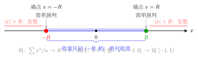
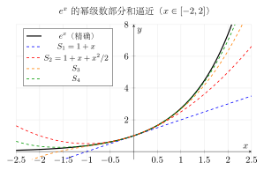
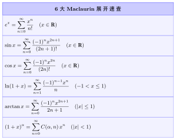

# 第16章 幂级数

> **一例速记**：
> **收敛域三步走**：① 用比值/根值法求收敛半径 $R$ → ② 写出开区间 $(-R,R)$ → ③ **单独验端点**（代入看数项级数是否收敛）。
> **逐项导/积不改 $R$**：在 $(-R,R)$ 内自由求导/积分，但端点需重新验。

---

## 引入：求收敛域的标准流程

> **题目**：求 $\displaystyle\sum_{n=1}^{\infty}\frac{x^n}{n}$ 的收敛域。

请先停下来想一想：见到 $\sum a_n x^n$ 求**收敛域**，标准动作是先用比值法求 $R$，再单独验端点。

**关键观察**：系数 $a_n = 1/n$，端点处分别得到调和级数（发散）和交错调和级数（收敛），需要分别判断。下面把内心独白完整还原。

---

## 思维路径还原（解题者的内心独白）

> "见到 $\sum x^n/n$，先求**收敛半径 $R$**。
>
> **比值法**：$\lim|a_{n+1}/a_n| = \lim n/(n+1) = 1$，故 $R = 1/1 = 1$。
>
> **收敛区间**：$(-1, 1)$（开区间，端点待定）。
>
> **验端点 $x=1$**：$\sum 1/n$——调和级数，**发散**。
>
> **验端点 $x=-1$**：$\sum (-1)^n/n$——交错调和级数，Leibniz 判别法，$1/n\downarrow 0$，**收敛**。
>
> **结论**：收敛域为 $[-1, 1)$（含左端点，不含右端点）。
>
> **反思**：为什么右端点发散？因为 $x=1$ 使各项恒正（调和级数），而 $x=-1$ 引入交错符号，Leibniz 条件满足。这个例子是'端点不对称'的典型。"

---

## 学习目标

通过本章学习，你将能够：

- 理解幂级数的概念，掌握收敛半径与收敛域的定义
- 熟练运用比值法和根值法求收敛半径
- 掌握幂级数在收敛域内的逐项求导和逐项积分性质
- 熟练将函数展开为幂级数（Taylor展开与间接展开法）
- 掌握常见函数的幂级数展开式
- 能够运用幂级数求和、近似计算及求解微分方程

---

## 16.1 幂级数的概念

### 16.1.1 幂级数的定义

**定义**：形如

$$\sum_{n=0}^{\infty} a_n x^n = a_0 + a_1 x + a_2 x^2 + \cdots + a_n x^n + \cdots$$

的函数项级数称为**幂级数**，其中 $a_0, a_1, a_2, \ldots$ 称为幂级数的**系数**。

更一般地，形如

$$\sum_{n=0}^{\infty} a_n (x - x_0)^n = a_0 + a_1(x - x_0) + a_2(x - x_0)^2 + \cdots$$

的级数称为在 $x_0$ 处展开的幂级数。通过变量替换 $t = x - x_0$，可将其化为标准形式，因此我们主要讨论 $\sum_{n=0}^{\infty} a_n x^n$。

### 16.1.2 收敛半径与收敛域

对于幂级数 $\sum_{n=0}^{\infty} a_n x^n$，给定 $x$ 的值，它就成为一个数项级数。使幂级数收敛的 $x$ 的全体构成的集合称为**收敛域**。

**Abel定理**：对于幂级数 $\sum_{n=0}^{\infty} a_n x^n$：

1. 若在 $x = x_0$（$x_0 \neq 0$）处收敛，则对满足 $|x| < |x_0|$ 的一切 $x$，幂级数绝对收敛。
2. 若在 $x = x_0$ 处发散，则对满足 $|x| > |x_0|$ 的一切 $x$，幂级数发散。

**证明**（第一部分）：设 $\sum a_n x_0^n$ 收敛，由收敛的必要条件知 $\{a_n x_0^n\}$ 有界，即存在 $M > 0$，使 $|a_n x_0^n| \leq M$。

对 $|x| < |x_0|$，设 $q = \left|\dfrac{x}{x_0}\right| < 1$，则

$$|a_n x^n| = |a_n x_0^n| \cdot \left|\frac{x}{x_0}\right|^n \leq M q^n$$

由于 $\sum M q^n$ 是收敛的几何级数，由比较判别法，$\sum |a_n x^n|$ 收敛，即 $\sum a_n x^n$ 绝对收敛。$\square$

**收敛半径**：由Abel定理可知，幂级数的收敛域具有区间结构。存在非负实数 $R$（可以是 $+\infty$），使得：

- 当 $|x| < R$ 时，幂级数绝对收敛
- 当 $|x| > R$ 时，幂级数发散
- 当 $|x| = R$ 时，需要单独讨论

这个 $R$ 称为幂级数的**收敛半径**，区间 $(-R, R)$ 称为**收敛区间**。

> **注**：收敛域可能是 $(-R, R)$、$[-R, R)$、$(-R, R]$ 或 $[-R, R]$，取决于端点处的收敛情况。

> **例题 16.1** 说明幂级数 $\sum_{n=0}^{\infty} x^n$ 的收敛域。

**解**：这是几何级数。当 $|x| < 1$ 时收敛于 $\dfrac{1}{1-x}$，当 $|x| \geq 1$ 时发散。

因此收敛半径 $R = 1$，收敛域为 $(-1, 1)$。

---

## 16.2 收敛半径的求法

### 16.2.1 比值法

**定理**：设幂级数 $\sum_{n=0}^{\infty} a_n x^n$，若

$$\lim_{n \to \infty} \left|\frac{a_{n+1}}{a_n}\right| = \rho$$

则收敛半径

$$R = \begin{cases} \dfrac{1}{\rho}, & 0 < \rho < +\infty \\ +\infty, & \rho = 0 \\ 0, & \rho = +\infty \end{cases}$$

**推导**：对 $\sum a_n x^n$ 应用比值判别法：

$$\lim_{n \to \infty} \left|\frac{a_{n+1} x^{n+1}}{a_n x^n}\right| = |x| \cdot \lim_{n \to \infty} \left|\frac{a_{n+1}}{a_n}\right| = \rho |x|$$

当 $\rho |x| < 1$ 即 $|x| < \dfrac{1}{\rho}$ 时收敛，当 $\rho |x| > 1$ 即 $|x| > \dfrac{1}{\rho}$ 时发散。

> **例题 16.2** 求幂级数 $\sum_{n=1}^{\infty} \dfrac{x^n}{n}$ 的收敛半径和收敛域。

**解**：设 $a_n = \dfrac{1}{n}$，则

$$\left|\frac{a_{n+1}}{a_n}\right| = \frac{n}{n+1} \to 1$$

故收敛半径 $R = 1$，收敛区间为 $(-1, 1)$。

**端点讨论**：
- $x = 1$：$\sum \dfrac{1}{n}$ 是调和级数，发散。
- $x = -1$：$\sum \dfrac{(-1)^n}{n}$ 是交错调和级数，由莱布尼茨判别法收敛。

因此，收敛域为 $[-1, 1)$。

### 16.2.2 根值法

**定理**：设幂级数 $\sum_{n=0}^{\infty} a_n x^n$，若

$$\lim_{n \to \infty} \sqrt[n]{|a_n|} = \rho$$

则收敛半径 $R = \dfrac{1}{\rho}$（约定 $\dfrac{1}{0} = +\infty$，$\dfrac{1}{+\infty} = 0$）。

> **例题 16.3** 求幂级数 $\sum_{n=1}^{\infty} \dfrac{x^n}{n^n}$ 的收敛半径。

**解**：设 $a_n = \dfrac{1}{n^n}$，则

$$\sqrt[n]{|a_n|} = \sqrt[n]{\frac{1}{n^n}} = \frac{1}{n} \to 0$$

故 $\rho = 0$，收敛半径 $R = +\infty$。即该幂级数对所有 $x \in \mathbb{R}$ 收敛。

### 16.2.3 端点的讨论

确定收敛半径后，需要单独检验端点 $x = \pm R$ 处的收敛性。

> **例题 16.4** 求幂级数 $\sum_{n=1}^{\infty} \dfrac{x^n}{n \cdot 2^n}$ 的收敛域。

**解**：设 $a_n = \dfrac{1}{n \cdot 2^n}$，则

$$\left|\frac{a_{n+1}}{a_n}\right| = \frac{n \cdot 2^n}{(n+1) \cdot 2^{n+1}} = \frac{n}{2(n+1)} \to \frac{1}{2}$$

故收敛半径 $R = 2$。

**端点讨论**：
- $x = 2$：$\sum \dfrac{2^n}{n \cdot 2^n} = \sum \dfrac{1}{n}$，发散。
- $x = -2$：$\sum \dfrac{(-2)^n}{n \cdot 2^n} = \sum \dfrac{(-1)^n}{n}$，收敛。

因此，收敛域为 $[-2, 2)$。

---

## 16.3 幂级数的运算

### 16.3.1 四则运算

设 $\sum_{n=0}^{\infty} a_n x^n$ 的收敛半径为 $R_1$，$\sum_{n=0}^{\infty} b_n x^n$ 的收敛半径为 $R_2$，令 $R = \min(R_1, R_2)$，则在 $(-R, R)$ 内：

**加减法**：

$$\sum_{n=0}^{\infty} a_n x^n \pm \sum_{n=0}^{\infty} b_n x^n = \sum_{n=0}^{\infty} (a_n \pm b_n) x^n$$

**乘法**（柯西乘积）：

$$\left(\sum_{n=0}^{\infty} a_n x^n\right) \cdot \left(\sum_{n=0}^{\infty} b_n x^n\right) = \sum_{n=0}^{\infty} c_n x^n$$

其中 $c_n = \sum_{k=0}^{n} a_k b_{n-k}$。

### 16.3.2 逐项求导

**定理**：幂级数 $\sum_{n=0}^{\infty} a_n x^n$ 在其收敛区间 $(-R, R)$ 内可以逐项求导，且

$$\left(\sum_{n=0}^{\infty} a_n x^n\right)' = \sum_{n=1}^{\infty} n a_n x^{n-1}$$

求导后的幂级数与原级数有相同的收敛半径。

> **注**：逐项求导可以反复进行，幂级数在收敛区间内无穷次可微。

> **例题 16.5** 利用几何级数的逐项求导，求 $\sum_{n=1}^{\infty} n x^{n-1}$ 的和。

**解**：由 $\sum_{n=0}^{\infty} x^n = \dfrac{1}{1-x}$（$|x| < 1$），两边对 $x$ 求导：

$$\sum_{n=1}^{\infty} n x^{n-1} = \frac{1}{(1-x)^2}$$

### 16.3.3 逐项积分

**定理**：幂级数 $\sum_{n=0}^{\infty} a_n x^n$ 在其收敛区间 $(-R, R)$ 内可以逐项积分，且

$$\int_0^x \left(\sum_{n=0}^{\infty} a_n t^n\right) dt = \sum_{n=0}^{\infty} \frac{a_n}{n+1} x^{n+1}$$

积分后的幂级数与原级数有相同的收敛半径。

> **例题 16.6** 利用几何级数的逐项积分，求 $\ln(1+x)$ 的幂级数展开。

**解**：由 $\dfrac{1}{1+t} = \sum_{n=0}^{\infty} (-t)^n = \sum_{n=0}^{\infty} (-1)^n t^n$（$|t| < 1$），两边从 $0$ 到 $x$ 积分：

$$\ln(1+x) = \int_0^x \frac{1}{1+t} dt = \sum_{n=0}^{\infty} (-1)^n \frac{x^{n+1}}{n+1} = \sum_{n=1}^{\infty} \frac{(-1)^{n-1} x^n}{n}$$

即

$$\ln(1+x) = x - \frac{x^2}{2} + \frac{x^3}{3} - \frac{x^4}{4} + \cdots \quad (-1 < x \leq 1)$$

---

## 16.4 函数展开为幂级数

### 16.4.1 直接展开法（Taylor展开）

**Taylor级数**：若函数 $f(x)$ 在 $x_0$ 的某邻域内有任意阶导数，则形式上可写成

$$f(x) = \sum_{n=0}^{\infty} \frac{f^{(n)}(x_0)}{n!}(x - x_0)^n$$

这称为 $f(x)$ 在 $x_0$ 处的**Taylor级数**。当 $x_0 = 0$ 时，也称为**Maclaurin级数**：

$$f(x) = \sum_{n=0}^{\infty} \frac{f^{(n)}(0)}{n!} x^n = f(0) + f'(0)x + \frac{f''(0)}{2!}x^2 + \cdots$$

**Taylor级数收敛的条件**：Taylor级数收敛于 $f(x)$ 的充要条件是余项 $R_n(x) \to 0$（$n \to \infty$）。

> **例题 16.7** 将 $e^x$ 展开为Maclaurin级数。

**解**：$f(x) = e^x$，则 $f^{(n)}(x) = e^x$，$f^{(n)}(0) = 1$。

Taylor级数为

$$e^x = \sum_{n=0}^{\infty} \frac{x^n}{n!} = 1 + x + \frac{x^2}{2!} + \frac{x^3}{3!} + \cdots$$

**验证收敛**：使用Lagrange余项

$$R_n(x) = \frac{e^\xi}{(n+1)!} x^{n+1}$$

其中 $\xi$ 介于 $0$ 与 $x$ 之间。对任意固定的 $x$，$|R_n(x)| \leq \dfrac{e^{|x|}}{(n+1)!} |x|^{n+1} \to 0$。

因此 $e^x = \sum_{n=0}^{\infty} \dfrac{x^n}{n!}$ 对所有 $x \in \mathbb{R}$ 成立。

### 16.4.2 间接展开法

利用已知的幂级数展开，通过变量替换、求导、积分等方法得到新函数的展开。

> **例题 16.8** 求 $\dfrac{1}{1+x^2}$ 和 $\arctan x$ 的幂级数展开。

**解**：由 $\dfrac{1}{1-t} = \sum_{n=0}^{\infty} t^n$（$|t| < 1$），令 $t = -x^2$：

$$\frac{1}{1+x^2} = \sum_{n=0}^{\infty} (-x^2)^n = \sum_{n=0}^{\infty} (-1)^n x^{2n} \quad (|x| < 1)$$

逐项积分：

$$\arctan x = \int_0^x \frac{1}{1+t^2} dt = \sum_{n=0}^{\infty} \frac{(-1)^n x^{2n+1}}{2n+1}$$

即

$$\arctan x = x - \frac{x^3}{3} + \frac{x^5}{5} - \frac{x^7}{7} + \cdots \quad (-1 \leq x \leq 1)$$

### 16.4.3 常见函数的幂级数展开

以下是常用的Maclaurin展开（均在标注的收敛域内成立）：

**1. 指数函数**：

$$e^x = \sum_{n=0}^{\infty} \frac{x^n}{n!} = 1 + x + \frac{x^2}{2!} + \frac{x^3}{3!} + \cdots \quad (x \in \mathbb{R})$$

**2. 三角函数**：

$$\sin x = \sum_{n=0}^{\infty} \frac{(-1)^n x^{2n+1}}{(2n+1)!} = x - \frac{x^3}{3!} + \frac{x^5}{5!} - \cdots \quad (x \in \mathbb{R})$$

$$\cos x = \sum_{n=0}^{\infty} \frac{(-1)^n x^{2n}}{(2n)!} = 1 - \frac{x^2}{2!} + \frac{x^4}{4!} - \cdots \quad (x \in \mathbb{R})$$

**3. 对数函数**：

$$\ln(1+x) = \sum_{n=1}^{\infty} \frac{(-1)^{n-1} x^n}{n} = x - \frac{x^2}{2} + \frac{x^3}{3} - \cdots \quad (-1 < x \leq 1)$$

**4. 反三角函数**：

$$\arctan x = \sum_{n=0}^{\infty} \frac{(-1)^n x^{2n+1}}{2n+1} = x - \frac{x^3}{3} + \frac{x^5}{5} - \cdots \quad (-1 \leq x \leq 1)$$

**5. 二项展开**（广义二项级数）：

$$(1+x)^\alpha = \sum_{n=0}^{\infty} \binom{\alpha}{n} x^n = 1 + \alpha x + \frac{\alpha(\alpha-1)}{2!}x^2 + \cdots \quad (|x| < 1)$$

其中 $\binom{\alpha}{n} = \dfrac{\alpha(\alpha-1)\cdots(\alpha-n+1)}{n!}$。

特别地，当 $\alpha = -1$ 时：

$$\frac{1}{1+x} = \sum_{n=0}^{\infty} (-1)^n x^n \quad (|x| < 1)$$

---

## 16.5 幂级数的应用

### 16.5.1 求和

利用已知函数的幂级数展开，可以求某些数项级数的和。

> **例题 16.9** 求级数 $\sum_{n=1}^{\infty} \dfrac{1}{n \cdot 2^n}$ 的和。

**解**：由 $\ln(1+x) = \sum_{n=1}^{\infty} \dfrac{(-1)^{n-1} x^n}{n}$，令 $x = 1$：

$$\ln 2 = \sum_{n=1}^{\infty} \frac{(-1)^{n-1}}{n} = 1 - \frac{1}{2} + \frac{1}{3} - \frac{1}{4} + \cdots$$

再考虑 $\ln(1-x) = -\sum_{n=1}^{\infty} \dfrac{x^n}{n}$，令 $x = \dfrac{1}{2}$：

$$\ln\frac{1}{2} = -\sum_{n=1}^{\infty} \frac{1}{n \cdot 2^n}$$

因此

$$\sum_{n=1}^{\infty} \frac{1}{n \cdot 2^n} = -\ln\frac{1}{2} = \ln 2$$

> **例题 16.10** 求级数 $\sum_{n=0}^{\infty} \dfrac{n}{2^n}$ 的和。

**解**：由 $\sum_{n=0}^{\infty} x^n = \dfrac{1}{1-x}$（$|x| < 1$），两边求导：

$$\sum_{n=1}^{\infty} n x^{n-1} = \frac{1}{(1-x)^2}$$

两边乘以 $x$：

$$\sum_{n=1}^{\infty} n x^n = \frac{x}{(1-x)^2}$$

令 $x = \dfrac{1}{2}$：

$$\sum_{n=1}^{\infty} \frac{n}{2^n} = \frac{\frac{1}{2}}{(1-\frac{1}{2})^2} = \frac{\frac{1}{2}}{\frac{1}{4}} = 2$$

### 16.5.2 近似计算

幂级数可用于函数值的近似计算。由于幂级数的部分和是多项式，便于计算。

> **例题 16.11** 用幂级数计算 $\sqrt{e}$ 的近似值（精确到 $0.001$）。

**解**：$\sqrt{e} = e^{1/2} = \sum_{n=0}^{\infty} \dfrac{(1/2)^n}{n!}$。

计算各项：

- $n=0$：$1$
- $n=1$：$\dfrac{1}{2} = 0.5$
- $n=2$：$\dfrac{1}{8} = 0.125$
- $n=3$：$\dfrac{1}{48} \approx 0.0208$
- $n=4$：$\dfrac{1}{384} \approx 0.0026$
- $n=5$：$\dfrac{1}{3840} \approx 0.0003$

部分和 $S_5 \approx 1 + 0.5 + 0.125 + 0.0208 + 0.0026 + 0.0003 = 1.6487$。

由于余项估计，$\sqrt{e} \approx 1.649$（精确到 $0.001$）。

### 16.5.3 求解微分方程

幂级数可用于求解某些微分方程。设解为幂级数形式，代入方程确定系数。

> **例题 16.12** 用幂级数方法求解 $y' = y$，$y(0) = 1$。

**解**：设 $y = \sum_{n=0}^{\infty} a_n x^n$，则 $y' = \sum_{n=1}^{\infty} n a_n x^{n-1} = \sum_{n=0}^{\infty} (n+1) a_{n+1} x^n$。

由 $y' = y$，比较系数：

$$(n+1) a_{n+1} = a_n \quad \Rightarrow \quad a_{n+1} = \frac{a_n}{n+1}$$

由 $y(0) = 1$ 得 $a_0 = 1$，递推得 $a_n = \dfrac{1}{n!}$。

因此 $y = \sum_{n=0}^{\infty} \dfrac{x^n}{n!} = e^x$。

---

## 本章小结

1. **幂级数** $\sum a_n x^n$ 的收敛域由**Abel定理**确定：存在**收敛半径** $R$，使幂级数在 $|x| < R$ 内绝对收敛，在 $|x| > R$ 处发散。

2. **收敛半径的求法**：
   - **比值法**：$R = \lim_{n \to \infty} \left|\dfrac{a_n}{a_{n+1}}\right|$
   - **根值法**：$R = \dfrac{1}{\lim_{n \to \infty} \sqrt[n]{|a_n|}}$
   - 端点需单独讨论

3. **幂级数的运算性质**：在收敛区间内，幂级数可以进行四则运算、逐项求导、逐项积分，且收敛半径不变。

4. **函数展开为幂级数**：
   - **直接法**：计算Taylor系数 $a_n = \dfrac{f^{(n)}(0)}{n!}$
   - **间接法**：利用已知展开通过变量替换、求导、积分得到

5. **幂级数的应用**：求级数和、近似计算、求解微分方程。

---

## 16.6 深度学习应用

幂级数理论在深度学习中有广泛而深刻的应用：从激活函数的多项式近似，到神经网络的通用逼近能力，再到注意力机制的线性化，都与幂级数的收敛性和逼近精度密切相关。

### 16.6.1 激活函数的幂级数展开

深度神经网络中的激活函数通常是非线性的，但在分析其性质或设计高效近似时，幂级数展开是重要工具。

**tanh 的幂级数展开**

双曲正切函数 $\tanh(x) = \dfrac{e^x - e^{-x}}{e^x + e^{-x}}$ 是早期神经网络的常用激活函数，其Maclaurin展开为

$$\tanh(x) = x - \frac{x^3}{3} + \frac{2x^5}{15} - \frac{17x^7}{315} + \frac{62x^9}{2835} - \cdots$$

系数通过 Bernoulli 数给出。该展开的**收敛半径为 $R = \dfrac{\pi}{2}$**，因为 $\tanh(x)$ 在复平面上最近的奇点为 $x = \pm \dfrac{\pi i}{2}$（$e^x + e^{-x} = 0$ 的根）。

因此，当 $|x| \geq \dfrac{\pi}{2} \approx 1.57$ 时，展开不收敛，直接截断会引入数值误差。

**GELU 和 Swish 的多项式近似**

现代激活函数如 GELU（Gaussian Error Linear Unit）和 Swish 没有简单的闭合幂级数，通常采用多项式拟合：

$$\text{GELU}(x) \approx 0.5x \left(1 + \tanh\!\left(\sqrt{\frac{2}{\pi}}\left(x + 0.044715 x^3\right)\right)\right)$$

其中内层 $\tanh$ 的参数 $x + 0.044715 x^3$ 本身就是一个截断幂级数近似，用于逼近 $\Phi(x)$（标准正态CDF）。

### 16.6.2 神经网络的多项式近似能力

**Stone-Weierstrass 定理**

> **定理（Weierstrass逼近定理）**：设 $f(x)$ 是 $[a, b]$ 上的连续函数，则对任意 $\varepsilon > 0$，存在多项式 $p(x)$，使得
>
> $$\max_{x \in [a,b]} |f(x) - p(x)| < \varepsilon$$

这一定理保证了在有界区间上，任意连续函数都可以被多项式任意精确地逼近。

**与神经网络的联系**

神经网络的**通用逼近定理**（Universal Approximation Theorem）可视为 Stone-Weierstrass 定理在函数空间上的推广：具有非线性激活函数的单隐层网络能够以任意精度逼近紧集上的任意连续函数。

具体而言，若激活函数 $\sigma$ 可展开为幂级数，网络的输出可近似表示为

$$f_\theta(x) \approx \sum_{k=0}^{K} c_k x^k$$

这与多项式逼近的形式完全一致。

### 16.6.3 收敛半径与数值稳定性

幂级数展开在深度学习中的一个关键挑战是**数值稳定性**：当输入值超出收敛半径时，截断展开误差急剧增大。

**典型问题场景**

以 $\tanh$ 为例，在 $|x| < 1$ 范围内5项展开的误差极小；但当 $|x|$ 接近或超过 $\dfrac{\pi}{2}$ 时，余项不再趋于零，截断展开完全失效。

常见的应对策略包括：

1. **分段近似**：在小值区域使用幂级数展开，在大值区域利用 $\tanh(x) \approx \text{sgn}(x)$ 等渐近行为。
2. **缩放后展开**：将输入归一化到收敛区域内，再进行展开。
3. **Padé近似**：用有理函数（分子分母均为多项式）代替截断幂级数，往往在更大范围内保持精度。

### 16.6.4 幂级数与注意力机制

**Softmax 的幂级数展开**

Transformer 模型的注意力机制核心是 Softmax：

$$\text{softmax}(x_i) = \frac{e^{x_i}}{\sum_j e^{x_j}}$$

利用 $e^x$ 的幂级数 $e^x = 1 + x + \dfrac{x^2}{2!} + \cdots$，可以得到 Softmax 的多项式展开，这为设计高效注意力算法提供了理论基础。

**Linear Attention 的多项式核**

标准自注意力的计算复杂度为 $O(n^2)$（$n$ 为序列长度）。Linear Attention 的核心思想是用一个特征映射 $\varphi: \mathbb{R}^d \to \mathbb{R}^r$ 来近似 $e^{q^\top k / \sqrt{d}}$，使得

$$\text{Attention}(Q, K, V) = \frac{\varphi(Q)\varphi(K)^\top V}{\varphi(Q) \sum_j \varphi(K_j)^\top}$$

由于矩阵乘法的结合律，计算顺序变为 $\varphi(Q)[\varphi(K)^\top V]$，复杂度降至 $O(n)$。

常见的特征映射正是利用 $e^x$ 的幂级数截断：

$$\varphi(x) = \left(1, x_1, x_2, \ldots, x_d, x_1^2, x_1 x_2, \ldots\right)$$

即将输入映射到其幂次组合（多项式核），从而在保留非线性表达能力的同时实现线性复杂度。

### 16.6.5 代码示例

```python
import torch
import math

# tanh 的幂级数近似
def tanh_taylor(x, n_terms=5):
    """tanh(x) ≈ x - x³/3 + 2x⁵/15 - 17x⁷/315 + ...

    系数由 Bernoulli 数给出，收敛半径 R = π/2 ≈ 1.5708
    """
    result = torch.zeros_like(x)
    # 与 Bernoulli 数相关的系数
    coeffs = [1, -1/3, 2/15, -17/315, 62/2835]
    for i, c in enumerate(coeffs[:n_terms]):
        result += c * x**(2*i + 1)
    return result

x = torch.linspace(-1, 1, 100)
tanh_exact = torch.tanh(x)
tanh_approx = tanh_taylor(x, n_terms=5)

# 收敛半径内误差很小
error = (tanh_exact - tanh_approx).abs().max()
print(f"|x| < 1 时的最大误差: {error.item():.6f}")

# 超出收敛半径时误差迅速增大
x_large = torch.linspace(-3, 3, 100)
error_large = (torch.tanh(x_large) - tanh_taylor(x_large, n_terms=5)).abs().max()
print(f"|x| < 3 时的最大误差: {error_large.item():.6f}")  # 误差极大

# Linear Attention: 用多项式核替代 softmax，将复杂度从 O(n²) 降至 O(n)
def linear_attention(Q, K, V, feature_map=lambda x: torch.relu(x) + 1):
    """线性注意力: φ(Q)φ(K)ᵀV / φ(Q)Σφ(K)ᵀ

    参数:
        Q, K, V: shape (batch, seq_len, dim)
        feature_map: 多项式核特征映射 φ，替代 exp(·)
    返回:
        注意力输出，shape (batch, seq_len, dim)
    """
    Q_prime = feature_map(Q)  # φ(Q)，shape: (batch, n, d)
    K_prime = feature_map(K)  # φ(K)，shape: (batch, n, d)

    # 利用结合律先算 φ(K)ᵀV，复杂度 O(n)
    KV = torch.einsum('bnd,bnv->bdv', K_prime, V)   # (batch, d, dim_v)
    Z  = K_prime.sum(dim=1, keepdim=True)            # (batch, 1, d)，归一化项

    # 输出：φ(Q) @ KV，除以归一化因子
    out = torch.einsum('bnd,bdv->bnv', Q_prime, KV)  # (batch, n, dim_v)
    norm = (Q_prime @ Z.transpose(-1, -2))            # (batch, n, 1)
    return out / norm
```

> **核心要点**：幂级数的收敛半径决定了多项式近似的有效输入范围。在设计深度学习算法时，必须确保输入落在收敛域内，或采用分段、归一化等策略以保证数值稳定性。

---

## 练习题

**1.** ⭐ 求幂级数 $\sum_{n=1}^{\infty} \dfrac{x^n}{n^2}$ 的收敛半径和收敛域。

**2.** ⭐ 求幂级数 $\sum_{n=0}^{\infty} \dfrac{n!}{n^n} x^n$ 的收敛半径。

**3.** ⭐ 将函数 $f(x) = \dfrac{1}{1-x-x^2}$ 在 $x=0$ 处展开为幂级数（提示：分解为部分分式）。

**4.** ⭐⭐ 利用幂级数求级数 $\sum_{n=1}^{\infty} \dfrac{n^2}{2^n}$ 的和。

**5.** ⭐⭐ 用幂级数方法求微分方程 $y'' + y = 0$，$y(0) = 0$，$y'(0) = 1$ 的解。

**6.** ⭐⭐ 求函数
$$
\frac{1}{(1+x)^2}
$$
在 $x=0$ 处的幂级数展开，并写出收敛半径。

**7.** ⭐⭐⭐ 用幂级数方法求微分方程
$$
y'=y,\qquad y(0)=1
$$
的解。

**8.** ⭐⭐⭐ 在温度 softmax 中，二分类概率可写为
$$
p_1(\tau)=\frac{e^{z_1/\tau}}{e^{z_1/\tau}+e^{z_2/\tau}}.
$$
利用指数函数的幂级数展开说明：当 $\tau\to+\infty$ 时，$p_1(\tau)\to \dfrac12$。

---

## 练习答案

<details>
<summary>点击展开答案</summary>

**1.** 设 $a_n = \dfrac{1}{n^2}$，则

$$\left|\frac{a_{n+1}}{a_n}\right| = \frac{n^2}{(n+1)^2} \to 1$$

故收敛半径 $R = 1$。

**端点讨论**：
- $x = 1$：$\sum \dfrac{1}{n^2}$ 是 $p = 2 > 1$ 的p级数，收敛。
- $x = -1$：$\sum \dfrac{(-1)^n}{n^2}$ 绝对收敛。

收敛域为 $[-1, 1]$。

---

**2.** 设 $a_n = \dfrac{n!}{n^n}$，则

$$\frac{a_{n+1}}{a_n} = \frac{(n+1)!}{(n+1)^{n+1}} \cdot \frac{n^n}{n!} = \frac{n^n}{(n+1)^n} = \left(\frac{n}{n+1}\right)^n \to \frac{1}{e}$$

故收敛半径 $R = e$。

---

**3.** 分解 $1-x-x^2 = -(x-\alpha)(x-\beta)$，其中 $\alpha = \dfrac{-1+\sqrt{5}}{2}$，$\beta = \dfrac{-1-\sqrt{5}}{2}$。

利用部分分式：

$$\frac{1}{1-x-x^2} = \frac{1}{\sqrt{5}}\left(\frac{1}{1-x/\alpha} - \frac{1}{1-x/\beta}\right)$$

展开为几何级数并整理，得到

$$\frac{1}{1-x-x^2} = \sum_{n=0}^{\infty} F_{n+1} x^n$$

其中 $F_n$ 是Fibonacci数列：$F_1 = F_2 = 1$，$F_{n+2} = F_{n+1} + F_n$。

即 $\dfrac{1}{1-x-x^2} = 1 + x + 2x^2 + 3x^3 + 5x^4 + 8x^5 + \cdots$

收敛半径 $R = \dfrac{\sqrt{5}-1}{2}$（黄金分割的倒数）。

---

**4.** 由 $\sum_{n=0}^{\infty} x^n = \dfrac{1}{1-x}$，求导得 $\sum_{n=1}^{\infty} nx^{n-1} = \dfrac{1}{(1-x)^2}$。

乘以 $x$：$\sum_{n=1}^{\infty} nx^n = \dfrac{x}{(1-x)^2}$

再求导：$\sum_{n=1}^{\infty} n^2 x^{n-1} = \dfrac{1+x}{(1-x)^3}$

乘以 $x$：$\sum_{n=1}^{\infty} n^2 x^n = \dfrac{x(1+x)}{(1-x)^3}$

令 $x = \dfrac{1}{2}$：

$$\sum_{n=1}^{\infty} \frac{n^2}{2^n} = \frac{\frac{1}{2} \cdot \frac{3}{2}}{(\frac{1}{2})^3} = \frac{\frac{3}{4}}{\frac{1}{8}} = 6$$

---

**5.** 设 $y = \sum_{n=0}^{\infty} a_n x^n$，则

$$y' = \sum_{n=1}^{\infty} n a_n x^{n-1}, \quad y'' = \sum_{n=2}^{\infty} n(n-1) a_n x^{n-2}$$

由 $y'' + y = 0$：

$$\sum_{n=2}^{\infty} n(n-1) a_n x^{n-2} + \sum_{n=0}^{\infty} a_n x^n = 0$$

令 $m = n-2$，第一项变为 $\sum_{m=0}^{\infty} (m+2)(m+1) a_{m+2} x^m$。

比较系数：$(n+2)(n+1) a_{n+2} + a_n = 0$，即

$$a_{n+2} = -\frac{a_n}{(n+2)(n+1)}$$

由初始条件 $y(0) = 0$，$y'(0) = 1$，得 $a_0 = 0$，$a_1 = 1$。

递推：
- $a_0 = 0 \Rightarrow a_2 = a_4 = a_6 = \cdots = 0$
- $a_1 = 1$，$a_3 = -\dfrac{1}{3!}$，$a_5 = \dfrac{1}{5!}$，$a_7 = -\dfrac{1}{7!}$，...

因此

$$y = \sum_{n=0}^{\infty} \frac{(-1)^n x^{2n+1}}{(2n+1)!} = \sin x$$

---

**6.** 由几何级数
$$
\frac{1}{1-t}=\sum_{n=0}^{\infty} t^n,\qquad |t|<1,
$$
令 $t=-x$，得
$$
\frac{1}{1+x}=\sum_{n=0}^{\infty}(-1)^n x^n,\qquad |x|<1.
$$

两边求导：
$$
-\frac{1}{(1+x)^2}=\sum_{n=1}^{\infty} n(-1)^n x^{n-1}.
$$

再乘以 $-1$ 并调整指标，得到
$$
\frac{1}{(1+x)^2}
=\sum_{n=0}^{\infty}(n+1)(-1)^n x^n,\qquad |x|<1.
$$

因此收敛半径为
$$
R=1.
$$

---

**7.** 设
$$
y=\sum_{n=0}^{\infty} a_n x^n,
\qquad
y'=\sum_{n=1}^{\infty} n a_n x^{n-1}.
$$

由方程 $y'=y$，把 $y'$ 改写为同次幂形式：
$$
\sum_{n=0}^{\infty}(n+1)a_{n+1}x^n=\sum_{n=0}^{\infty} a_n x^n.
$$

比较系数得
$$
(n+1)a_{n+1}=a_n,
\qquad
a_{n+1}=\frac{a_n}{n+1}.
$$

由初值条件 $y(0)=1$，得 $a_0=1$。于是
$$
a_1=1,\quad a_2=\frac{1}{2!},\quad a_3=\frac{1}{3!},\ \ldots,\ a_n=\frac{1}{n!}.
$$

故
$$
y=\sum_{n=0}^{\infty}\frac{x^n}{n!}=e^x.
$$

---

**8.** 当 $\tau$ 很大时，$\dfrac{z_1}{\tau},\dfrac{z_2}{\tau}$ 都很小。由指数函数展开：
$$
e^{z_1/\tau}=1+\frac{z_1}{\tau}+O(\tau^{-2}),
\qquad
e^{z_2/\tau}=1+\frac{z_2}{\tau}+O(\tau^{-2}).
$$

代入可得
$$
p_1(\tau)
=
\frac{1+\frac{z_1}{\tau}+O(\tau^{-2})}
{\left(1+\frac{z_1}{\tau}+O(\tau^{-2})\right)+\left(1+\frac{z_2}{\tau}+O(\tau^{-2})\right)}.
$$

分母趋于
$$
2+\frac{z_1+z_2}{\tau}+O(\tau^{-2}).
$$

因此当 $\tau\to+\infty$ 时，分子趋于 $1$，分母趋于 $2$，故
$$
\lim_{\tau\to+\infty}p_1(\tau)=\frac12.
$$

这说明高温 softmax 会把类别分布“抹平”，趋向均匀分布。

</details>

---

## 几何示意

**图 16-1**：幂级数收敛区间 + 端点示意



**图 16-2**：$e^x$ 幂级数部分和逼近



**图 16-3**：6 大 Maclaurin 展开速查



---

## 思考路标（条件反射）

- 看到幂级数 $\sum a_n x^n$ → 先求收敛半径 $R$
- 看到 $R=1/\lim|a_{n+1}/a_n|$ → 比值法求 $R$
- 看到 $R=1/\limsup\sqrt[n]{|a_n|}$ → 根值法求 $R$
- 看到收敛半径 $R$ → 收敛区间 $(-R, R)$，端点单独验
- 看到幂级数逐项求导 / 积分 → 在收敛区间内成立，半径不变
- 看到 $\sum x^n$ → $1/(1-x)$（$|x|<1$）
- 看到展开成幂级数 → 6 大 Maclaurin 表
- 看到 Abel 定理 → 端点收敛 → 函数在端点单侧连续

## 易错点

1. **收敛半径 vs 收敛区间**：$R$ 是数，收敛区间是 $(-R, R)$ 加可能的端点。
2. **端点必须单独判**：$R$ 公式不告诉端点行为。
3. **逐项求导 / 积分在端点不一定成立**：仅保证 $(-R, R)$ 内。
4. **泰勒级数收敛不等于收敛到 $f$**：极少数函数（如 $f(x)=e^{-1/x^2}, x\neq 0$）泰勒级数收敛但 $\neq f$。
5. **$R$ 是上极限**：用 $\limsup\sqrt[n]{|a_n|}$ 不是 $\lim$（后者可能不存在）。

---

## 抽象成方法（套路总结）

### 6 大 Maclaurin 展开速查表

| 函数 | 展开式 | 收敛域 |
|---|---|---|
| $e^x$ | $\displaystyle\sum_{n=0}^{\infty}\dfrac{x^n}{n!}$ | $x\in\mathbb{R}$ |
| $\sin x$ | $\displaystyle\sum_{n=0}^{\infty}\dfrac{(-1)^n x^{2n+1}}{(2n+1)!}$ | $x\in\mathbb{R}$ |
| $\cos x$ | $\displaystyle\sum_{n=0}^{\infty}\dfrac{(-1)^n x^{2n}}{(2n)!}$ | $x\in\mathbb{R}$ |
| $\dfrac{1}{1-x}$ | $\displaystyle\sum_{n=0}^{\infty}x^n$ | $\vert x\vert <1$ |
| $\ln(1+x)$ | $\displaystyle\sum_{n=1}^{\infty}\dfrac{(-1)^{n-1}x^n}{n}$ | $-1<x\leq 1$ |
| $\arctan x$ | $\displaystyle\sum_{n=0}^{\infty}\dfrac{(-1)^n x^{2n+1}}{2n+1}$ | $\vert x\vert \leq 1$ |

### 收敛半径求法速查

| 条件 | 公式 | 备注 |
|---|---|---|
| $\lim\vert a_{n+1}/a_n\vert =\rho$ | $R=1/\rho$ | 比值法（含阶乘首选）|
| $\lim\sqrt[n]{\vert a_n\vert }=\rho$ | $R=1/\rho$ | 根值法（$n$ 次幂首选）|
| 缺项幂级数（如 $\sum a_n x^{2n}$）| 先换元 $t=x^2$，求 $t$ 的 $R_t$，再还原 | 不能直接套公式 |

### 求数项级数和的标准 4 步

1. **辨认**：目标级数 $\sum c_n$ 的通项与哪个已知 Maclaurin 展开的系数对应
2. **构造**：写出 $S(x) = \sum c_n x^n$（或类似结构）
3. **求和函数**：逐项求导 / 积分化简，利用已知公式
4. **代值**：令 $x=x_0$ 得所求数值

---

## 方法变形

### 变形 1：缺项幂级数

系数含 $0$（仅偶次或奇次项），如 $\sum a_n x^{2n}$。**不要把 $x^{2n}$ 拆成 $x^{2n}$ 再套公式**——先令 $t = x^2$，对 $\sum a_n t^n$ 求 $R_t$，再得 $R_x = \sqrt{R_t}$。

**例**：$\sum n x^{2n}$ 的 $R$。令 $t=x^2$，$a_n = n$，$\lim n/(n+1)=1$，$R_t=1$，故 $R_x = 1$。

### 变形 2：展开点不为 $0$

$\sum a_n(x-a)^n$ 先令 $t=x-a$，在 $t=0$ 处求半径 $R$，收敛区间为 $(a-R, a+R)$，再验端点 $x=a\pm R$。

### 变形 3：和函数求导后求和

目标 $\sum n c_n x^n$——**先积分**得 $\sum c_n x^n$（常见）；目标 $\sum c_n x^n/n$——**先求导**，再还原。逐项导 / 积均不改 $R$，端点需重新判。

### 变形 4：利用展开求积分极限

如 $\lim_{x\to 0}(\sin x - x)/x^3$：展开 $\sin x = x - x^3/6 + O(x^5)$，直接取主项 $= -1/6$。比 L'Hôpital 更快捷。

---

## 典型应用例题

### 例 1：求收敛域（含缺项）

> **题目**：求 $\displaystyle\sum_{n=0}^{\infty}(-1)^n\dfrac{x^{2n}}{2n+1}$ 的收敛域。

【思路】缺奇次项 → 令 $t = x^2$，转化为 $\sum(-1)^n t^n/(2n+1)$，再还原。

【解】令 $t = x^2$，通项 $a_n = 1/(2n+1)$，比值法：$\lim a_{n+1}/a_n = (2n+1)/(2n+3) \to 1$，$R_t = 1$，故收敛区间为 $\vert t\vert < 1$，即 $\vert x\vert < 1$。

验端点 $x = \pm 1$（即 $t=1$）：$\sum (-1)^n/(2n+1)$ — Leibniz 判别法（$1/(2n+1)\downarrow 0$），**收敛**。

注意到 $\sum_{n=0}^{\infty}(-1)^n x^{2n+1}/(2n+1) = \arctan x$，故所求级数 $= (\arctan x)/x$（$x\neq 0$），$x=0$ 时 $=1$。

【答案】收敛域 $\boxed{[-1, 1]}$，和函数 $S(x) = \arctan(x)/x$（$x\neq 0$），$S(0)=1$。

### 例 2：数项级数求和

> **题目**：求 $\displaystyle\sum_{n=1}^{\infty}\dfrac{n}{2^n}$ 的和。

【思路】通项含 $n$ 与 $1/2^n$，联想 $\sum nx^n = x/(1-x)^2$，令 $x=1/2$。

【解】由 $\dfrac{1}{1-x} = \sum_{n=0}^\infty x^n$（$\vert x\vert <1$），两边求导得 $\dfrac{1}{(1-x)^2} = \sum_{n=1}^\infty nx^{n-1}$，乘以 $x$：

$$\sum_{n=1}^\infty nx^n = \frac{x}{(1-x)^2}$$

令 $x = 1/2$：$\displaystyle\sum_{n=1}^\infty\dfrac{n}{2^n} = \dfrac{1/2}{(1/2)^2} = 2$。

【答案】$\boxed{2}$。

### 例 3：函数展开 → 近似积分

> **题目**：用幂级数估计 $\displaystyle\int_0^{0.5}\dfrac{\sin x}{x}\,dx$，精度 $10^{-4}$。

【思路】$\sin(x)/x$ 在 $x=0$ 处无定义，但用幂级数展开可消去"奇性"，再逐项积分。

【解】$\sin x = x - x^3/6 + x^5/120 - \cdots$，故

$$\frac{\sin x}{x} = 1 - \frac{x^2}{6} + \frac{x^4}{120} - \frac{x^6}{5040} + \cdots$$

逐项积分：

$$\int_0^{0.5}\frac{\sin x}{x}\,dx = \left[x - \frac{x^3}{18} + \frac{x^5}{600} - \frac{x^7}{35280}+\cdots\right]_0^{0.5}$$

各项：$0.5 - 0.5^3/18 + 0.5^5/600 - \cdots \approx 0.5 - 0.006944 + 0.000052 - 0.0000002\approx 0.49311$。

第三项 $0.5^5/600 \approx 5.2\times 10^{-5} < 10^{-4}$，故取前两项已满足精度。

【答案】$\displaystyle\int_0^{0.5}\dfrac{\sin x}{x}\,dx \approx \boxed{0.4931}$。

---

## 自测题

**自测 1**　求 $\displaystyle\sum_{n=0}^{\infty}\dfrac{(x-1)^n}{n+1}$ 的收敛域。

> 💡 提示：令 $t=x-1$，$R_t=1$，收敛区间 $(-1,1)$；端点 $t=1$ 时 $\sum 1/(n+1)$ 散，$t=-1$ 时 $\sum (-1)^n/(n+1)$ 收敛（Leibniz）。故收敛域 $\boxed{[0, 2)}$。

**自测 2**　利用 Maclaurin 展开，求 $\lim_{x\to 0}\dfrac{e^x - 1 - x}{x^2}$。

> 💡 提示：$e^x = 1 + x + x^2/2! + O(x^3)$，分子 $\sim x^2/2$，故极限 $= \boxed{1/2}$。（比 L'Hôpital 快）

**自测 3**　求 $\displaystyle\sum_{n=2}^{\infty}n(n-1)x^{n-2}$ 的和函数（$\vert x\vert <1$）。

> 💡 提示：注意到 $\dfrac{d^2}{dx^2}\dfrac{1}{1-x} = \sum_{n=2}^\infty n(n-1)x^{n-2}$。故和函数 $= \dfrac{2}{(1-x)^3}$。

**自测 4**　求 $\displaystyle\sum_{n=1}^{\infty}\dfrac{(-1)^{n-1}}{n\cdot 2^n}$（数项级数）的值。

> 💡 提示：联想 $\ln(1+x) = \sum_{n=1}^\infty(-1)^{n-1}x^n/n$，令 $x=1/2$：$\sum = \ln(3/2)$。答 $\boxed{\ln(3/2)}$。

**自测 5**　$f(x) = e^{x^2}$ 的 Maclaurin 展开是什么？$R=?$

> 💡 提示：用 $e^t = \sum t^n/n!$，令 $t=x^2$：$e^{x^2} = \sum_{n=0}^\infty x^{2n}/n!$，$R = +\infty$（对所有 $x\in\mathbb{R}$ 成立）。

---

**回头看一眼"一例速记"**：

> 收敛域三步走：① 比值 / 根值求 $R$ → ② 写开区间 $(-R, R)$ → ③ 单独验两端点。
> 逐项导 / 积不改 $R$，但端点重验；6 大 Maclaurin 表是间接展开的基础。

如果现在不看笔记，能独立完成例 2 + 例 3 + 自测 1 + 自测 4——本章，你拿下了。

---

## 融合版说明

本版 = **原版（严格大学教材 + 深度学习应用）** + **重写版（高中模板 D 速记 / 套路 / 例题 / 自测）** 融合：

| 段落 | 来源 | 价值 |
|---|---|---|
| 一例速记 + 引入 + 思维路径还原 | 重写版（前置） | 建立直觉 / 反射 |
| 学习目标 + 16.1–16.5 严格正文 | 原版 | 完整推导 |
| 几何示意（图） | 配图 | 可视化 |
| 抽象成方法 + 方法变形 | 重写版（中间） | 套路总结 |
| 本章小结 | 原版 | 公式速查 |
| 思考路标 + 易错点 | 融合两版 | 条件反射 |
| 典型应用例题 3 例 | 重写版 | 演练 |
| 深度学习应用 + 代码 | 原版 | 工业实战 |
| 练习题 + 详解 | 原版 | 巩固 |
| 自测题 5 题 | 重写版 | 额外训练 |

**适用**：一站式学习——先速记建立直觉，看严格推导，做套路总结，看代码实战，做习题巩固，自测验收。
