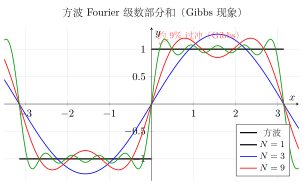
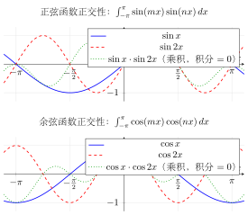

# 第17章 Fourier级数

> **一例速记**：
> **Fourier 展开四步走**：① 判断奇 / 偶性 → ② 写系数公式（$a_n$ 或 $b_n$，奇函数 $a_n=0$，偶函数 $b_n=0$）→ ③ 分部积分算系数 → ④ 用 Dirichlet 定理写收敛结论（间断点处收敛到左右极限平均值）。
> **Parseval 速记**：$\dfrac{1}{\pi}\int_{-\pi}^{\pi}[f]^2\,dx = \dfrac{a_0^2}{2}+\sum(a_n^2+b_n^2)$——时域能量 = 频域能量，可用来求 $\sum 1/n^2, \sum 1/n^4$ 等。

---

## 引入：方波的 Fourier 展开

> **题目**：设 $f(x)=\begin{cases}0,& -\pi\leq x<0\\1,& 0\leq x<\pi\end{cases}$，以 $2\pi$ 为周期延拓，求其 Fourier 级数，并在 $x=\pi/2$ 处代入求 $1-1/3+1/5-1/7+\cdots$。

请先停下来想一想：$f(x)$ 既不是奇函数也不是偶函数，必须用完整 $a_n, b_n$ 公式；间断点处 Fourier 级数收敛到"左右极限平均"。

**关键观察**：$f(x)=0$（$x<0$）与 $f(x)=1$（$x\geq 0$），积分区间可拆成 $[-\pi,0]$ 和 $[0,\pi]$。下面把内心独白完整还原。

---

## 思维路径还原（解题者的内心独白）

> "见到分段函数，先判奇偶：$f(-x)\neq f(x)$ 且 $f(-x)\neq -f(x)$，**不是奇/偶函数**，必须用完整公式。
>
> **求 $a_0$**：$a_0 = \dfrac{1}{\pi}\int_{-\pi}^{\pi}f(x)\,dx = \dfrac{1}{\pi}\int_0^{\pi}1\,dx = 1$。
>
> **求 $a_n$（$n\geq 1$）**：$a_n = \dfrac{1}{\pi}\int_0^{\pi}\cos nx\,dx = \dfrac{\sin nx}{n\pi}\Big|_0^{\pi} = 0$。
>
> **求 $b_n$**：$b_n = \dfrac{1}{\pi}\int_0^{\pi}\sin nx\,dx = \dfrac{1-\cos n\pi}{n\pi} = \dfrac{1-(-1)^n}{n\pi}$。
>
> $n$ 偶数时 $b_n = 0$；$n = 2k+1$ 奇数时 $b_n = \dfrac{2}{(2k+1)\pi}$。
>
> **Fourier 级数**：$f(x) \sim \dfrac{1}{2} + \dfrac{2}{\pi}\displaystyle\sum_{k=0}^{\infty}\dfrac{\sin(2k+1)x}{2k+1}$。
>
> **验收敛**：$x = \pi/2$ 是连续点，$f(\pi/2) = 1$：
>
> $$1 = \frac{1}{2} + \frac{2}{\pi}\sum_{k=0}^{\infty}\frac{(-1)^k}{2k+1}$$
>
> 故 $\sum_{k=0}^\infty\dfrac{(-1)^k}{2k+1} = \dfrac{\pi}{4}$（Leibniz 公式）。
>
> **反思**：$x=0$ 是间断点，Dirichlet 定理给出级数 $= \dfrac{f(0^-)+f(0^+)}{2} = \dfrac{0+1}{2} = \dfrac{1}{2}$ — 恰与常数项 $a_0/2 = 1/2$ 对应，符合期望。"

---

## 学习目标

通过本章学习，你将能够：

- 理解三角函数系的正交性，掌握正交性的积分表达式
- 掌握Fourier系数的计算公式及其推导过程
- 熟练计算周期为 $2\pi$ 和周期为 $2l$ 的函数的Fourier展开
- 理解Dirichlet收敛定理，掌握Fourier级数在连续点和间断点的收敛行为
- 熟练运用奇延拓和偶延拓将函数展开为正弦级数或余弦级数
- 能够运用Fourier级数求某些数项级数的和

---

## 17.1 三角级数与正交性

### 17.1.1 三角函数系

**三角函数系**是指由以下函数组成的函数集合：

$$1, \cos x, \sin x, \cos 2x, \sin 2x, \ldots, \cos nx, \sin nx, \ldots$$

这些函数都是以 $2\pi$ 为周期的周期函数。

**三角级数**：由三角函数系构成的级数

$$\frac{a_0}{2} + \sum_{n=1}^{\infty} (a_n \cos nx + b_n \sin nx)$$

称为**三角级数**，其中 $a_0, a_1, b_1, a_2, b_2, \ldots$ 为常数。

> **注**：常数项写成 $\dfrac{a_0}{2}$ 的形式是为了使后面的Fourier系数公式统一。

### 17.1.2 三角函数系的正交性

**正交性定义**：设 $f(x)$ 和 $g(x)$ 在区间 $[a, b]$ 上可积，若

$$\int_a^b f(x) g(x) \, dx = 0$$

则称 $f(x)$ 与 $g(x)$ 在 $[a, b]$ 上**正交**。

**定理（三角函数系的正交性）**：三角函数系 $\{1, \cos nx, \sin nx\}_{n=1}^{\infty}$ 在区间 $[-\pi, \pi]$ 上两两正交，即对任意非负整数 $m, n$：

$$\int_{-\pi}^{\pi} \cos mx \cos nx \, dx = \begin{cases} 0, & m \neq n \\ \pi, & m = n \neq 0 \\ 2\pi, & m = n = 0 \end{cases}$$

$$\int_{-\pi}^{\pi} \sin mx \sin nx \, dx = \begin{cases} 0, & m \neq n \\ \pi, & m = n \neq 0 \end{cases}$$

$$\int_{-\pi}^{\pi} \cos mx \sin nx \, dx = 0 \quad (\text{对所有 } m, n)$$

**证明**（选证部分）：利用积化和差公式。

当 $m \neq n$ 时：

$$\cos mx \cos nx = \frac{1}{2}[\cos(m-n)x + \cos(m+n)x]$$

$$\int_{-\pi}^{\pi} \cos mx \cos nx \, dx = \frac{1}{2}\left[\frac{\sin(m-n)x}{m-n} + \frac{\sin(m+n)x}{m+n}\right]_{-\pi}^{\pi} = 0$$

当 $m = n \neq 0$ 时：

$$\int_{-\pi}^{\pi} \cos^2 nx \, dx = \int_{-\pi}^{\pi} \frac{1 + \cos 2nx}{2} \, dx = \frac{1}{2}\left[x + \frac{\sin 2nx}{2n}\right]_{-\pi}^{\pi} = \pi$$

对于余弦与正弦的乘积，由于 $\cos mx \sin nx$ 是奇函数，在对称区间上积分为零。$\square$

### 17.1.3 周期函数的三角级数展开

设 $f(x)$ 是周期为 $2\pi$ 的周期函数，如果能将其展开为三角级数：

$$f(x) = \frac{a_0}{2} + \sum_{n=1}^{\infty} (a_n \cos nx + b_n \sin nx)$$

则利用三角函数系的正交性，可以确定系数 $a_n$ 和 $b_n$。这就是Fourier级数的核心思想。

---

## 17.2 Fourier系数

### 17.2.1 Fourier系数公式

**定理**：设 $f(x)$ 是周期为 $2\pi$ 的可积函数，若能展开为三角级数

$$f(x) = \frac{a_0}{2} + \sum_{n=1}^{\infty} (a_n \cos nx + b_n \sin nx)$$

则系数由以下公式确定：

$$a_n = \frac{1}{\pi} \int_{-\pi}^{\pi} f(x) \cos nx \, dx \quad (n = 0, 1, 2, \ldots)$$

$$b_n = \frac{1}{\pi} \int_{-\pi}^{\pi} f(x) \sin nx \, dx \quad (n = 1, 2, 3, \ldots)$$

这些系数 $a_n, b_n$ 称为 $f(x)$ 的**Fourier系数**。

### 17.2.2 推导过程

**求 $a_0$**：将展开式两边在 $[-\pi, \pi]$ 上积分：

$$\int_{-\pi}^{\pi} f(x) \, dx = \frac{a_0}{2} \cdot 2\pi + \sum_{n=1}^{\infty} \left(a_n \int_{-\pi}^{\pi} \cos nx \, dx + b_n \int_{-\pi}^{\pi} \sin nx \, dx\right)$$

由于 $\int_{-\pi}^{\pi} \cos nx \, dx = \int_{-\pi}^{\pi} \sin nx \, dx = 0$（$n \geq 1$），得

$$\int_{-\pi}^{\pi} f(x) \, dx = \pi a_0 \quad \Rightarrow \quad a_0 = \frac{1}{\pi} \int_{-\pi}^{\pi} f(x) \, dx$$

**求 $a_m$**（$m \geq 1$）：将展开式两边乘以 $\cos mx$，再在 $[-\pi, \pi]$ 上积分：

$$\int_{-\pi}^{\pi} f(x) \cos mx \, dx = \frac{a_0}{2} \int_{-\pi}^{\pi} \cos mx \, dx + \sum_{n=1}^{\infty} a_n \int_{-\pi}^{\pi} \cos nx \cos mx \, dx + \sum_{n=1}^{\infty} b_n \int_{-\pi}^{\pi} \sin nx \cos mx \, dx$$

由正交性，只有 $n = m$ 时的余弦项积分非零：

$$\int_{-\pi}^{\pi} f(x) \cos mx \, dx = a_m \cdot \pi \quad \Rightarrow \quad a_m = \frac{1}{\pi} \int_{-\pi}^{\pi} f(x) \cos mx \, dx$$

**求 $b_m$**：类似地，将展开式两边乘以 $\sin mx$ 并积分，由正交性得

$$b_m = \frac{1}{\pi} \int_{-\pi}^{\pi} f(x) \sin mx \, dx$$

### 17.2.3 周期为 $2\pi$ 的情况

给定周期为 $2\pi$ 的函数 $f(x)$，其**Fourier级数**定义为

$$f(x) \sim \frac{a_0}{2} + \sum_{n=1}^{\infty} (a_n \cos nx + b_n \sin nx)$$

其中 Fourier 系数由上述公式给出。符号 "$\sim$" 表示形式对应，是否等号成立需要讨论收敛性。

> **例题 17.1** 将函数 $f(x) = x$（$-\pi < x \leq \pi$），以 $2\pi$ 为周期延拓，求其Fourier级数。

**解**：$f(x) = x$ 是奇函数，故 $f(x) \cos nx$ 是奇函数，$f(x) \sin nx$ 是偶函数。

$$a_n = \frac{1}{\pi} \int_{-\pi}^{\pi} x \cos nx \, dx = 0 \quad (n = 0, 1, 2, \ldots)$$

$$b_n = \frac{1}{\pi} \int_{-\pi}^{\pi} x \sin nx \, dx = \frac{2}{\pi} \int_0^{\pi} x \sin nx \, dx$$

利用分部积分：

$$\int_0^{\pi} x \sin nx \, dx = \left[-\frac{x \cos nx}{n}\right]_0^{\pi} + \frac{1}{n} \int_0^{\pi} \cos nx \, dx = -\frac{\pi \cos n\pi}{n} = \frac{(-1)^{n+1} \pi}{n}$$

因此

$$b_n = \frac{2}{\pi} \cdot \frac{(-1)^{n+1} \pi}{n} = \frac{2(-1)^{n+1}}{n}$$

Fourier级数为

$$f(x) \sim 2\left(\sin x - \frac{\sin 2x}{2} + \frac{\sin 3x}{3} - \cdots\right) = 2\sum_{n=1}^{\infty} \frac{(-1)^{n+1}}{n} \sin nx$$

> **例题 17.2** 将函数 $f(x) = |x|$（$-\pi \leq x \leq \pi$），以 $2\pi$ 为周期延拓，求其Fourier级数。

**解**：$f(x) = |x|$ 是偶函数，故 $b_n = 0$。

$$a_0 = \frac{1}{\pi} \int_{-\pi}^{\pi} |x| \, dx = \frac{2}{\pi} \int_0^{\pi} x \, dx = \frac{2}{\pi} \cdot \frac{\pi^2}{2} = \pi$$

$$a_n = \frac{1}{\pi} \int_{-\pi}^{\pi} |x| \cos nx \, dx = \frac{2}{\pi} \int_0^{\pi} x \cos nx \, dx \quad (n \geq 1)$$

分部积分：

$$\int_0^{\pi} x \cos nx \, dx = \left[\frac{x \sin nx}{n}\right]_0^{\pi} - \frac{1}{n} \int_0^{\pi} \sin nx \, dx = 0 + \frac{1}{n} \left[\frac{\cos nx}{n}\right]_0^{\pi} = \frac{\cos n\pi - 1}{n^2}$$

当 $n$ 为偶数时，$\cos n\pi = 1$，$a_n = 0$。

当 $n$ 为奇数时，$\cos n\pi = -1$，$a_n = \dfrac{2}{\pi} \cdot \dfrac{-2}{n^2} = -\dfrac{4}{\pi n^2}$。

因此

$$|x| \sim \frac{\pi}{2} - \frac{4}{\pi}\left(\cos x + \frac{\cos 3x}{9} + \frac{\cos 5x}{25} + \cdots\right) = \frac{\pi}{2} - \frac{4}{\pi} \sum_{k=0}^{\infty} \frac{\cos(2k+1)x}{(2k+1)^2}$$

### 17.2.4 周期为 $2l$ 的情况

设 $f(x)$ 是周期为 $2l$ 的函数。令 $t = \dfrac{\pi x}{l}$，则 $g(t) = f\left(\dfrac{lt}{\pi}\right)$ 是周期为 $2\pi$ 的函数。

将 $g(t)$ 展开为Fourier级数后，换回变量 $x$，得到周期为 $2l$ 的Fourier级数：

$$f(x) \sim \frac{a_0}{2} + \sum_{n=1}^{\infty} \left(a_n \cos \frac{n\pi x}{l} + b_n \sin \frac{n\pi x}{l}\right)$$

其中Fourier系数为

$$a_n = \frac{1}{l} \int_{-l}^{l} f(x) \cos \frac{n\pi x}{l} \, dx \quad (n = 0, 1, 2, \ldots)$$

$$b_n = \frac{1}{l} \int_{-l}^{l} f(x) \sin \frac{n\pi x}{l} \, dx \quad (n = 1, 2, 3, \ldots)$$

> **例题 17.3** 将函数 $f(x) = x$（$-1 < x \leq 1$），以 $2$ 为周期延拓，求其Fourier级数。

**解**：这里 $l = 1$。由于 $f(x) = x$ 是奇函数，$a_n = 0$。

$$b_n = \frac{1}{1} \int_{-1}^{1} x \sin n\pi x \, dx = 2 \int_0^{1} x \sin n\pi x \, dx$$

分部积分：

$$\int_0^{1} x \sin n\pi x \, dx = \left[-\frac{x \cos n\pi x}{n\pi}\right]_0^{1} + \frac{1}{n\pi} \int_0^{1} \cos n\pi x \, dx = -\frac{\cos n\pi}{n\pi} = \frac{(-1)^{n+1}}{n\pi}$$

因此 $b_n = \dfrac{2(-1)^{n+1}}{n\pi}$，

$$x \sim \frac{2}{\pi} \sum_{n=1}^{\infty} \frac{(-1)^{n+1}}{n} \sin n\pi x \quad (-1 < x < 1)$$

---

## 17.3 Fourier级数的收敛性

### 17.3.1 Dirichlet收敛定理

**定理（Dirichlet收敛定理）**：设 $f(x)$ 是周期为 $2\pi$ 的函数，若 $f(x)$ 在 $[-\pi, \pi]$ 上满足**Dirichlet条件**：

1. $f(x)$ 在 $[-\pi, \pi]$ 上连续或只有有限个第一类间断点
2. $f(x)$ 在 $[-\pi, \pi]$ 上只有有限个极值点（即分段单调）

则 $f(x)$ 的Fourier级数在每一点都收敛，且

$$\frac{a_0}{2} + \sum_{n=1}^{\infty} (a_n \cos nx + b_n \sin nx) = \frac{f(x^-) + f(x^+)}{2}$$

其中 $f(x^-)$ 和 $f(x^+)$ 分别表示 $f$ 在 $x$ 处的左极限和右极限。

### 17.3.2 收敛情况分析

**在连续点**：若 $f(x)$ 在 $x_0$ 处连续，则 $f(x_0^-) = f(x_0^+) = f(x_0)$，故

$$\frac{a_0}{2} + \sum_{n=1}^{\infty} (a_n \cos nx_0 + b_n \sin nx_0) = f(x_0)$$

**在间断点**：若 $f(x)$ 在 $x_0$ 处有第一类间断点，则Fourier级数收敛于左右极限的平均值：

$$\frac{a_0}{2} + \sum_{n=1}^{\infty} (a_n \cos nx_0 + b_n \sin nx_0) = \frac{f(x_0^-) + f(x_0^+)}{2}$$

### 17.3.3 在间断点的行为

> **例题 17.4** 讨论例题17.1中 $f(x) = x$（$-\pi < x \leq \pi$）的Fourier级数在各点的收敛情况。

**解**：由Dirichlet定理，在 $(-\pi, \pi)$ 内的每一点，级数收敛于 $f(x) = x$。

在 $x = \pi$ 处，$f(\pi^-) = \pi$，$f(\pi^+) = f(-\pi^+) = -\pi$（由周期性），故级数收敛于

$$\frac{\pi + (-\pi)}{2} = 0$$

因此

$$2\sum_{n=1}^{\infty} \frac{(-1)^{n+1}}{n} \sin nx = \begin{cases} x, & -\pi < x < \pi \\ 0, & x = \pm\pi \end{cases}$$

> **例题 17.5** 利用例题17.2的结果，求级数 $\sum_{n=0}^{\infty} \dfrac{1}{(2n+1)^2}$ 的和。

**解**：由例题17.2，

$$|x| = \frac{\pi}{2} - \frac{4}{\pi} \sum_{k=0}^{\infty} \frac{\cos(2k+1)x}{(2k+1)^2} \quad (-\pi \leq x \leq \pi)$$

令 $x = 0$，得

$$0 = \frac{\pi}{2} - \frac{4}{\pi} \sum_{k=0}^{\infty} \frac{1}{(2k+1)^2}$$

因此

$$\sum_{k=0}^{\infty} \frac{1}{(2k+1)^2} = 1 + \frac{1}{9} + \frac{1}{25} + \frac{1}{49} + \cdots = \frac{\pi^2}{8}$$

### 17.3.4 Gibbs现象

在跳跃间断点附近，Fourier级数的部分和表现出一种特殊的行为，称为**Gibbs现象**。

**现象描述**：设 $f(x)$ 在 $x_0$ 处有跳跃间断点，跳跃量为 $d = f(x_0^+) - f(x_0^-)$。则 $f(x)$ 的 Fourier 级数的第 $N$ 项部分和 $S_N(x)$ 在 $x_0$ 附近总会出现**过冲**（overshoot），且无论 $N$ 取多大，过冲的幅度始终约为跳跃量的 $9\%$。

更精确地说，部分和在间断点附近的最大值超过 $f(x_0^+)$ 约 $0.089d$，最小值低于 $f(x_0^-)$ 约 $0.089d$。随着 $N \to \infty$，过冲的位置越来越靠近间断点，但过冲的**相对幅度不变**。

**直观解释**：Fourier级数中的每一项都是连续函数，有限项的和也是连续函数，因此无法精确逼近函数的跳跃。增加项数只能使过冲变得更窄更尖，但无法消除约 $9\%$ 的过冲幅度。

**实际意义**：在数字信号处理中，Gibbs现象表现为**振铃效应**（ringing artifact）。例如，对方波信号进行有限带宽传输时，接收端信号在跳变沿附近会出现振荡。这也是图像处理中JPEG压缩在高对比度边缘附近产生伪影的数学原因。

### 17.3.5 复数形式的Fourier级数

除了用正弦和余弦表示，Fourier级数还有更简洁的**复指数形式**。

利用 Euler 公式 $e^{inx} = \cos nx + i\sin nx$，可以将三角形式的Fourier级数改写为：

$$f(x) = \sum_{n=-\infty}^{\infty} c_n e^{inx}$$

其中复Fourier系数为

$$c_n = \frac{1}{2\pi}\int_{-\pi}^{\pi} f(x)e^{-inx}\,dx \quad (n = 0, \pm 1, \pm 2, \ldots)$$

**与实数形式的关系**：复系数 $c_n$ 与实系数 $a_n, b_n$ 之间的关系为

$$c_0 = \frac{a_0}{2}, \quad c_n = \frac{a_n - ib_n}{2}, \quad c_{-n} = \frac{a_n + ib_n}{2} = \overline{c_n} \quad (n \geq 1)$$

当 $f(x)$ 为实值函数时，$c_{-n} = \overline{c_n}$（共轭对称）。

复数形式在理论推导和信号处理中更为简洁，它将正频率和负频率统一在一个求和符号下，也是 Fourier 变换的离散版本。

---

## 17.4 正弦级数与余弦级数

### 17.4.1 奇函数与偶函数的Fourier展开

**偶函数**：若 $f(x)$ 是周期为 $2\pi$ 的偶函数，则

$$b_n = \frac{1}{\pi} \int_{-\pi}^{\pi} f(x) \sin nx \, dx = 0$$

$$a_n = \frac{2}{\pi} \int_0^{\pi} f(x) \cos nx \, dx$$

Fourier级数只含余弦项，称为**余弦级数**：

$$f(x) \sim \frac{a_0}{2} + \sum_{n=1}^{\infty} a_n \cos nx$$

**奇函数**：若 $f(x)$ 是周期为 $2\pi$ 的奇函数，则

$$a_n = \frac{1}{\pi} \int_{-\pi}^{\pi} f(x) \cos nx \, dx = 0$$

$$b_n = \frac{2}{\pi} \int_0^{\pi} f(x) \sin nx \, dx$$

Fourier级数只含正弦项，称为**正弦级数**：

$$f(x) \sim \sum_{n=1}^{\infty} b_n \sin nx$$

### 17.4.2 奇延拓与正弦级数

设 $f(x)$ 只在 $[0, l]$ 上有定义，要将其展开为正弦级数，可进行**奇延拓**：

$$F(x) = \begin{cases} f(x), & 0 < x \leq l \\ 0, & x = 0 \\ -f(-x), & -l \leq x < 0 \end{cases}$$

然后将 $F(x)$ 以 $2l$ 为周期延拓，得到奇函数，其Fourier级数只含正弦项：

$$f(x) \sim \sum_{n=1}^{\infty} b_n \sin \frac{n\pi x}{l} \quad (0 < x < l)$$

其中

$$b_n = \frac{2}{l} \int_0^{l} f(x) \sin \frac{n\pi x}{l} \, dx$$

### 17.4.3 偶延拓与余弦级数

设 $f(x)$ 只在 $[0, l]$ 上有定义，要将其展开为余弦级数，可进行**偶延拓**：

$$F(x) = \begin{cases} f(x), & 0 \leq x \leq l \\ f(-x), & -l \leq x < 0 \end{cases}$$

然后将 $F(x)$ 以 $2l$ 为周期延拓，得到偶函数，其Fourier级数只含余弦项：

$$f(x) \sim \frac{a_0}{2} + \sum_{n=1}^{\infty} a_n \cos \frac{n\pi x}{l} \quad (0 \leq x \leq l)$$

其中

$$a_n = \frac{2}{l} \int_0^{l} f(x) \cos \frac{n\pi x}{l} \, dx$$

> **例题 17.6** 将 $f(x) = x$（$0 < x < \pi$）分别展开为正弦级数和余弦级数。

**解**：

**正弦级数（奇延拓）**：

$$b_n = \frac{2}{\pi} \int_0^{\pi} x \sin nx \, dx = \frac{2}{\pi} \cdot \frac{(-1)^{n+1} \pi}{n} = \frac{2(-1)^{n+1}}{n}$$

$$x = 2\sum_{n=1}^{\infty} \frac{(-1)^{n+1}}{n} \sin nx \quad (0 < x < \pi)$$

**余弦级数（偶延拓）**：

$$a_0 = \frac{2}{\pi} \int_0^{\pi} x \, dx = \frac{2}{\pi} \cdot \frac{\pi^2}{2} = \pi$$

$$a_n = \frac{2}{\pi} \int_0^{\pi} x \cos nx \, dx = \frac{2}{\pi} \cdot \frac{\cos n\pi - 1}{n^2} = \frac{2[(-1)^n - 1]}{\pi n^2}$$

当 $n$ 为偶数时，$a_n = 0$；当 $n$ 为奇数时，$a_n = -\dfrac{4}{\pi n^2}$。

$$x = \frac{\pi}{2} - \frac{4}{\pi}\left(\cos x + \frac{\cos 3x}{9} + \frac{\cos 5x}{25} + \cdots\right) \quad (0 \leq x \leq \pi)$$

> **例题 17.7** 将 $f(x) = 1$（$0 < x < l$）展开为正弦级数。

**解**：进行奇延拓，

$$b_n = \frac{2}{l} \int_0^{l} 1 \cdot \sin \frac{n\pi x}{l} \, dx = \frac{2}{l} \left[-\frac{l}{n\pi} \cos \frac{n\pi x}{l}\right]_0^{l} = \frac{2}{n\pi}(1 - \cos n\pi) = \frac{2}{n\pi}[1 - (-1)^n]$$

当 $n$ 为偶数时，$b_n = 0$；当 $n$ 为奇数时，$b_n = \dfrac{4}{n\pi}$。

$$1 = \frac{4}{\pi}\left(\sin \frac{\pi x}{l} + \frac{1}{3}\sin \frac{3\pi x}{l} + \frac{1}{5}\sin \frac{5\pi x}{l} + \cdots\right) \quad (0 < x < l)$$

---

## 17.5 Parseval 恒等式

### 17.5.1 定理表述

**定理 17.1**（Parseval 恒等式）：设 $f(x)$ 是周期为 $2\pi$ 的可积函数，且在 $[-\pi, \pi]$ 上平方可积，其 Fourier 系数为 $a_n$、$b_n$，则

$$\frac{1}{\pi} \int_{-\pi}^{\pi} [f(x)]^2 \, dx = \frac{a_0^2}{2} + \sum_{n=1}^{\infty} (a_n^2 + b_n^2)$$

更一般地，对于周期为 $2l$ 的情形：

$$\frac{1}{l} \int_{-l}^{l} [f(x)]^2 \, dx = \frac{a_0^2}{2} + \sum_{n=1}^{\infty} (a_n^2 + b_n^2)$$

> **直观理解**：Parseval 恒等式建立了函数在"时域"（或空域）和"频域"之间的桥梁。左端 $\dfrac{1}{\pi}\int_{-\pi}^{\pi} [f(x)]^2 \, dx$ 度量的是函数的"总能量"；右端是各 Fourier 系数的平方和，即各频率分量的"能量"之和。该恒等式断言：**函数的总能量等于其各频率分量能量之和**，能量在 Fourier 分解过程中既不增加也不减少。

### 17.5.2 物理意义：能量守恒

在物理学和信号处理中，Parseval 恒等式具有深刻的能量守恒意义：

- 对于周期信号 $f(t)$，$[f(t)]^2$ 正比于信号的瞬时功率，$\int [f(t)]^2 \, dt$ 正比于一个周期内的总能量
- Fourier 系数 $a_n, b_n$ 描述了第 $n$ 次谐波的振幅，$a_n^2 + b_n^2 = A_n^2$ 是第 $n$ 次谐波的能量（其中 $A_n$ 是振幅）
- Parseval 恒等式就是**时域总能量 = 频域总能量**，即信号从时域表示变换到频域表示时，能量守恒

这一原理是现代信号处理和量子力学中能量谱分析的数学基础。

### 17.5.3 应用举例

> **例题 17.8** 利用 $f(x) = x$（$-\pi < x < \pi$）的 Fourier 展开和 Parseval 恒等式，求 $\sum_{n=1}^{\infty} \dfrac{1}{n^2}$。

**解**：由例题 17.1，$f(x) = x$ 的 Fourier 系数为 $a_n = 0$（$n \geq 0$），$b_n = \dfrac{2(-1)^{n+1}}{n}$。

计算左端：

$$\frac{1}{\pi} \int_{-\pi}^{\pi} x^2 \, dx = \frac{1}{\pi} \cdot \frac{2\pi^3}{3} = \frac{2\pi^2}{3}$$

由 Parseval 恒等式：

$$\frac{2\pi^2}{3} = \frac{0}{2} + \sum_{n=1}^{\infty} \left(0 + \frac{4}{n^2}\right) = 4\sum_{n=1}^{\infty} \frac{1}{n^2}$$

因此

$$\sum_{n=1}^{\infty} \frac{1}{n^2} = \frac{\pi^2}{6}$$

这提供了 Basel 问题的另一种优雅证法。

> **例题 17.9** 利用 $f(x) = x^2$（$-\pi \leq x \leq \pi$）的 Fourier 展开和 Parseval 恒等式，求 $\sum_{n=1}^{\infty} \dfrac{1}{n^4}$。

**解**：由练习题第1题的结果，$f(x) = x^2$ 的 Fourier 系数为

$$a_0 = \frac{2\pi^2}{3}, \quad a_n = \frac{4(-1)^n}{n^2} \quad (n \geq 1), \quad b_n = 0$$

计算左端：

$$\frac{1}{\pi} \int_{-\pi}^{\pi} x^4 \, dx = \frac{1}{\pi} \cdot \frac{2\pi^5}{5} = \frac{2\pi^4}{5}$$

由 Parseval 恒等式：

$$\frac{2\pi^4}{5} = \frac{1}{2}\left(\frac{2\pi^2}{3}\right)^2 + \sum_{n=1}^{\infty} \frac{16}{n^4} = \frac{2\pi^4}{9} + 16\sum_{n=1}^{\infty} \frac{1}{n^4}$$

因此

$$16\sum_{n=1}^{\infty} \frac{1}{n^4} = \frac{2\pi^4}{5} - \frac{2\pi^4}{9} = 2\pi^4 \cdot \frac{9 - 5}{45} = \frac{8\pi^4}{45}$$

$$\sum_{n=1}^{\infty} \frac{1}{n^4} = \frac{8\pi^4}{45 \times 16} = \frac{\pi^4}{90}$$

这就是著名的结果 $\zeta(4) = \dfrac{\pi^4}{90}$。

---

## 17.6 Fourier级数的应用

### 17.6.1 求和公式

利用Fourier级数在特定点的收敛值，可以求某些数项级数的和。

> **例题 17.10** 求级数 $\sum_{n=1}^{\infty} \dfrac{1}{n^2}$ 的和。

**解**：由例题17.2，对于 $f(x) = |x|$ 的Fourier展开，在 $x = \pi$ 处：

$$\pi = \frac{\pi}{2} - \frac{4}{\pi} \sum_{k=0}^{\infty} \frac{\cos(2k+1)\pi}{(2k+1)^2} = \frac{\pi}{2} + \frac{4}{\pi} \sum_{k=0}^{\infty} \frac{1}{(2k+1)^2}$$

由例题17.5，$\sum_{k=0}^{\infty} \dfrac{1}{(2k+1)^2} = \dfrac{\pi^2}{8}$。

注意到

$$\sum_{n=1}^{\infty} \frac{1}{n^2} = \sum_{k=0}^{\infty} \frac{1}{(2k+1)^2} + \sum_{k=1}^{\infty} \frac{1}{(2k)^2} = \sum_{k=0}^{\infty} \frac{1}{(2k+1)^2} + \frac{1}{4}\sum_{n=1}^{\infty} \frac{1}{n^2}$$

设 $S = \sum_{n=1}^{\infty} \dfrac{1}{n^2}$，则

$$S = \frac{\pi^2}{8} + \frac{S}{4} \quad \Rightarrow \quad \frac{3S}{4} = \frac{\pi^2}{8} \quad \Rightarrow \quad S = \frac{\pi^2}{6}$$

因此

$$\sum_{n=1}^{\infty} \frac{1}{n^2} = 1 + \frac{1}{4} + \frac{1}{9} + \frac{1}{16} + \cdots = \frac{\pi^2}{6}$$

这就是著名的**Basel问题**的解答。

> **例题 17.11** 利用Fourier级数证明 $\sum_{n=1}^{\infty} \dfrac{(-1)^{n+1}}{n} = \ln 2$。

**解**：考虑 $f(x) = x$（$-\pi < x < \pi$）的Fourier级数（例题17.1）：

$$x = 2\sum_{n=1}^{\infty} \frac{(-1)^{n+1}}{n} \sin nx$$

这不能直接代入求和。改用另一方法：由 $\ln(1+x)$ 的Taylor展开，在 $x = 1$ 处：

$$\ln 2 = 1 - \frac{1}{2} + \frac{1}{3} - \frac{1}{4} + \cdots = \sum_{n=1}^{\infty} \frac{(-1)^{n+1}}{n}$$

### 17.6.2 信号分析简介

Fourier级数在信号处理中有重要应用。任何周期信号都可以分解为不同频率的正弦波（谐波）的叠加。

**基波与谐波**：在Fourier级数

$$f(t) = \frac{a_0}{2} + \sum_{n=1}^{\infty} (a_n \cos n\omega t + b_n \sin n\omega t)$$

中：
- $\dfrac{a_0}{2}$ 是**直流分量**
- $n = 1$ 的项称为**基波**（频率为 $\omega$）
- $n \geq 2$ 的项称为**谐波**（频率为 $n\omega$）

**振幅-相位形式**：每个谐波可写成

$$a_n \cos n\omega t + b_n \sin n\omega t = A_n \cos(n\omega t - \varphi_n)$$

其中**振幅** $A_n = \sqrt{a_n^2 + b_n^2}$，**相位** $\varphi_n = \arctan\dfrac{b_n}{a_n}$。

### 17.6.3 从 Fourier 级数到 Fourier 变换

Fourier 级数处理的是**周期函数**：频率是离散的。而许多信号并不周期，此时更自然的对象是 **Fourier 变换**。

可以把 Fourier 变换理解为“让周期 $T\to\infty$ 后，频率间隔越来越密，离散频谱极限地变成连续频谱”。

连续 Fourier 变换定义为

$$
\hat f(\omega)=\int_{-\infty}^{+\infty} f(x)e^{-i\omega x}\,dx,
$$

逆变换为

$$
f(x)=\frac{1}{2\pi}\int_{-\infty}^{+\infty}\hat f(\omega)e^{i\omega x}\,d\omega.
$$

它把“时域/空域函数”转化为“频域函数”。

一些最重要的性质：

- 线性性
- 时移对应相移
- 微分对应乘以 $i\omega$
- 缩放对应频谱伸缩
- Parseval 定理仍成立，表达能量守恒

> **例题 17.12** 说明为什么微分在频域里对应乘以 $i\omega$。

**解**：对可积且足够光滑的 $f$，

$$
\mathcal F[f'](\omega)
= \int_{-\infty}^{+\infty} f'(x)e^{-i\omega x}\,dx.
$$

分部积分得

$$
\mathcal F[f'](\omega) = \left[f(x)e^{-i\omega x}\right]_{-\infty}^{+\infty} + i\omega \int_{-\infty}^{+\infty} f(x)e^{-i\omega x}\,dx.
$$

若边界项消失，则

$$
\mathcal F[f'](\omega)=i\omega \hat f(\omega).
$$

这说明微分在频域里只是乘以一个频率因子，因此高频分量会被放大。$\square$

### 17.6.4 卷积定理

卷积定义为

$$
(f*g)(x)=\int_{-\infty}^{+\infty} f(\tau)g(x-\tau)\,d\tau.
$$

它在信号处理、概率论和神经网络里都极其常见。

**卷积定理**：

$$
\mathcal F[f*g](\omega)=\hat f(\omega)\hat g(\omega).
$$

也就是说：

> 时域卷积 = 频域逐点乘法

反过来，

$$
\mathcal F[f\cdot g]=\frac{1}{2\pi}(\hat f * \hat g).
$$

这条定理之所以强大，是因为卷积本来是“滑动积分”，计算昂贵；但到频域后变成简单乘法。

> **例题 17.13** 为什么大卷积核时 FFT 卷积更有优势？

**解**：直接时域卷积需要对每个位置做一遍核大小量级的乘加，复杂度通常接近 $O(NK)$；FFT 卷积则先做 FFT，再做点乘，整体复杂度约为 $O(N\log N)$。当核很大时，后者更划算。$\square$

### 17.6.5 DFT 与 FFT

在计算机里，信号是离散的。因此实际实现常用 **离散 Fourier 变换（DFT）**：

$$
X[k]=\sum_{n=0}^{N-1}x[n]e^{-i2\pi kn/N},
$$

逆变换为

$$
x[n]=\frac1N\sum_{k=0}^{N-1}X[k]e^{i2\pi kn/N}.
$$

直接计算 DFT 需要 $O(N^2)$ 次操作。快速 Fourier 变换（FFT）利用分治思想把复杂度降到

$$
O(N\log N).
$$

这也是现代频域算法可用的关键。

> ⚠️ **常见陷阱**
> Fourier 级数在间断点处一般不收敛到函数值本身，而是收敛到左右极限的平均值。把这一点忘掉，会在分析方波、阶跃信号或注意力窗口化近似时得出错误结论。

---

## 本章小结

1. **三角函数系的正交性**是Fourier分析的基础。三角函数系 $\{1, \cos nx, \sin nx\}$ 在 $[-\pi, \pi]$ 上两两正交。

2. **Fourier系数**的计算公式：
   - 周期 $2\pi$：$a_n = \dfrac{1}{\pi} \int_{-\pi}^{\pi} f(x) \cos nx \, dx$，$b_n = \dfrac{1}{\pi} \int_{-\pi}^{\pi} f(x) \sin nx \, dx$
   - 周期 $2l$：$a_n = \dfrac{1}{l} \int_{-l}^{l} f(x) \cos \dfrac{n\pi x}{l} \, dx$，$b_n = \dfrac{1}{l} \int_{-l}^{l} f(x) \sin \dfrac{n\pi x}{l} \, dx$

3. **Dirichlet收敛定理**：满足Dirichlet条件的函数，其Fourier级数在连续点收敛于函数值，在间断点收敛于左右极限的平均值。

4. **正弦级数与余弦级数**：
   - **奇延拓**得到正弦级数：$b_n = \dfrac{2}{l} \int_0^{l} f(x) \sin \dfrac{n\pi x}{l} \, dx$
   - **偶延拓**得到余弦级数：$a_n = \dfrac{2}{l} \int_0^{l} f(x) \cos \dfrac{n\pi x}{l} \, dx$

5. **Parseval 恒等式**：$\dfrac{1}{\pi}\int_{-\pi}^{\pi} [f(x)]^2 \, dx = \dfrac{a_0^2}{2} + \sum_{n=1}^{\infty}(a_n^2 + b_n^2)$，表达了时域能量与频域能量的守恒关系。

6. **应用**：Fourier级数可用于求数项级数的和（如 $\sum \dfrac{1}{n^2} = \dfrac{\pi^2}{6}$、$\sum \dfrac{1}{n^4} = \dfrac{\pi^4}{90}$），以及信号的频谱分析。

7. **连续 Fourier 变换与 FFT**：
   - Fourier 变换把离散频谱推广为连续频谱
   - 卷积定理把时域卷积转化为频域乘法
   - FFT 是现代频域计算可行的核心算法

---

## 深度学习应用

Fourier 分析不仅是经典数学工具，也是现代深度学习的理论基础之一。本节介绍其在神经网络中的四个核心应用场景。

### 17.7.1 频域分析与 CNN

**卷积定理**指出，时域的卷积运算等价于频域的逐点乘法：

$$\mathcal{F}\{f * g\} = \mathcal{F}\{f\} \cdot \mathcal{F}\{g\}$$

其中 $\mathcal{F}$ 表示 Fourier 变换，$*$ 表示卷积。这个定理给出了计算卷积的高效途径：

1. 将信号变换到频域（FFT，复杂度 $O(n \log n)$）
2. 在频域做逐点乘法（$O(n)$）
3. 逆变换回时域（iFFT，复杂度 $O(n \log n)$）

相比直接在时域计算的 $O(n^2)$ 复杂度，频域方法对大核卷积有显著加速。

**CNN 的频域解释**：卷积神经网络的每个滤波器本质上是一个**频率选择器**。低频滤波器捕捉图像中的平滑结构和整体形状，高频滤波器检测边缘、纹理等细节。网络通过训练学习到不同频段的特征表示。

### 17.7.2 谱归一化（Spectral Normalization）

在生成对抗网络（GAN）训练中，判别器的 Lipschitz 常数决定了训练稳定性。**谱归一化**通过限制权重矩阵的**谱范数**（最大奇异值 $\sigma_1$）来控制 Lipschitz 常数：

$$\bar{W} = \frac{W}{\sigma_1(W)}$$

其中谱范数定义为

$$\|W\|_2 = \sigma_1(W) = \max_{\|x\|=1} \|Wx\|$$

归一化后的权重矩阵满足 $\|\bar{W}\|_2 = 1$，从而使判别器成为 1-Lipschitz 函数，有效防止梯度爆炸并稳定 GAN 训练。

实际计算中，精确的奇异值分解开销较大，通常用**幂迭代法**高效估计最大奇异值：

$$\tilde{v} \leftarrow \frac{W^\top \hat{u}}{\|W^\top \hat{u}\|}, \quad \tilde{u} \leftarrow \frac{W\tilde{v}}{\|W\tilde{v}\|}, \quad \sigma_1 \approx \hat{u}^\top W \tilde{v}$$

### 17.7.3 傅里叶特征编码

神经网络在拟合高频信号时存在"谱偏差"（spectral bias）——网络倾向于先学习低频分量。**傅里叶特征编码**通过显式引入高频基函数来克服这一问题。

**随机傅里叶特征**：将输入 $\mathbf{x} \in \mathbb{R}^d$ 映射为

$$\gamma(\mathbf{x}) = [\cos(2\pi \mathbf{b}_1^\top \mathbf{x}),\ \sin(2\pi \mathbf{b}_1^\top \mathbf{x}),\ \ldots,\ \cos(2\pi \mathbf{b}_m^\top \mathbf{x}),\ \sin(2\pi \mathbf{b}_m^\top \mathbf{x})]$$

其中频率向量 $\mathbf{b}_i$ 从某分布中采样，将输入提升为 $2m$ 维特征。

**NeRF 中的位置编码**：Neural Radiance Fields 使用确定性的多尺度编码：

$$\gamma(p) = [\sin(2^0 \pi p),\ \cos(2^0 \pi p),\ \sin(2^1 \pi p),\ \cos(2^1 \pi p),\ \ldots,\ \sin(2^{L-1} \pi p),\ \cos(2^{L-1} \pi p)]$$

频率以 $2$ 的幂次递增，覆盖从粗到细的多个尺度，使网络能够重建细节丰富的三维场景。

### 17.7.4 图神经网络的谱方法

对于图 $\mathcal{G} = (V, E)$，定义**图拉普拉斯矩阵** $L = D - A$，其中 $D$ 是度矩阵，$A$ 是邻接矩阵。$L$ 是半正定矩阵，可做特征分解 $L = U \Lambda U^\top$，其中特征向量矩阵 $U$ 构成图上的"Fourier 基"。

图上信号 $\mathbf{x}$ 的**图 Fourier 变换**定义为

$$\hat{\mathbf{x}} = U^\top \mathbf{x}$$

逆变换为 $\mathbf{x} = U\hat{\mathbf{x}}$，与经典 Fourier 变换完全类比。

**谱图卷积**（Spectral Graph Convolution）在频域定义图卷积：

$$\mathbf{x} *_{\mathcal{G}} g = U \left( (U^\top \mathbf{x}) \odot (U^\top \mathbf{g}) \right)$$

GCN（Chebyshev 近似版本）通过截断 Chebyshev 多项式展开，将谱方法转化为局部空域操作，避免了完整特征分解的 $O(n^3)$ 计算开销，成为现代图神经网络的理论基础。

### 17.7.5 扩散模型的频率行为

扩散模型的去噪过程常表现出一个经验规律：先恢复低频结构，再补高频细节。

这可以用 Fourier 视角理解：

- 白噪声在各频率上近似均匀分布
- 自然图像的功率谱通常更偏向低频
- 因此低频成分在加噪后信噪比相对更高，更容易先被恢复

这也解释了为什么扩散模型生成图片时，常常先出现整体轮廓，再逐渐长出边缘、纹理和局部细节。

从工程角度看，Fourier 分析为以下问题提供了语言：

- 噪声调度是否让高频损失过大
- 采样步数减少后，是否优先损伤高频细节
- 频域损失能否更直接约束感知质量

### 17.7.6 代码示例

```python
import torch
import torch.nn as nn
import torch.fft as fft
import math

# 频域卷积演示
def freq_domain_conv(x, kernel):
    """时域卷积 = 频域乘法"""
    # 零填充到相同大小
    n = x.shape[-1] + kernel.shape[-1] - 1
    X = fft.fft(x, n=n)
    K = fft.fft(kernel, n=n)
    # 频域乘法
    Y = X * K
    # 逆变换
    return fft.ifft(Y).real

# 谱归一化
class SpectralNorm(nn.Module):
    def __init__(self, module, n_power_iterations=1):
        super().__init__()
        self.module = module
        self.n_power_iterations = n_power_iterations

    def forward(self, x):
        # 使用幂迭代估计最大奇异值
        w = self.module.weight
        u = torch.randn(w.shape[0], 1, device=w.device)

        for _ in range(self.n_power_iterations):
            v = w.t() @ u
            v = v / v.norm()
            u = w @ v
            u = u / u.norm()

        sigma = (u.t() @ w @ v).squeeze()
        return nn.functional.linear(x, w / sigma, self.module.bias)

# 傅里叶特征编码 (NeRF style)
class FourierFeatures(nn.Module):
    def __init__(self, input_dim, n_frequencies=10):
        super().__init__()
        # 频率 2^0, 2^1, ..., 2^(L-1)
        freqs = 2.0 ** torch.arange(n_frequencies)
        self.register_buffer('freqs', freqs)

    def forward(self, x):
        # [sin(2πf·x), cos(2πf·x)] for each frequency
        x_proj = x.unsqueeze(-1) * self.freqs * 2 * math.pi
        return torch.cat([torch.sin(x_proj), torch.cos(x_proj)], dim=-1).flatten(-2)
```

**验证频域卷积的等价性**：

```python
import torch

x = torch.tensor([1.0, 2.0, 3.0, 4.0])
k = torch.tensor([1.0, -1.0])

# 时域卷积（使用 torch.nn.functional）
import torch.nn.functional as F
y_time = F.conv1d(x.view(1, 1, -1), k.view(1, 1, -1), padding=1).squeeze()

# 频域卷积
y_freq = freq_domain_conv(x, k)

print("时域结果:", y_time)
print("频域结果:", y_freq[:len(x)])  # 截取有效部分
```

---

## 练习题

**1.** ⭐ 将函数 $f(x) = x^2$（$-\pi \leq x \leq \pi$），以 $2\pi$ 为周期延拓，求其Fourier级数。

**2.** ⭐ 将函数 $f(x) = e^x$（$-\pi < x < \pi$），以 $2\pi$ 为周期延拓，求其Fourier级数。

**3.** ⭐ 将 $f(x) = \pi - x$（$0 < x < \pi$）展开为正弦级数。

**4.** ⭐⭐ 利用第1题的结果，求 $\sum_{n=1}^{\infty} \dfrac{1}{n^4}$ 的值。

**5.** ⭐⭐ 设 $f(x) = \begin{cases} 0, & -\pi \leq x < 0 \\ 1, & 0 \leq x \leq \pi \end{cases}$，以 $2\pi$ 为周期延拓，求其Fourier级数，并求 $\sum_{n=0}^{\infty} \dfrac{(-1)^n}{2n+1}$ 的值。

**6.** ⭐⭐ 利用 $f(x) = |x|$（$-\pi \leq x \leq \pi$）的 Fourier 展开和 Parseval 恒等式，求 $\sum_{n=0}^{\infty} \dfrac{1}{(2n+1)^4}$。

**7.** ⭐⭐⭐ 写出连续 Fourier 变换的定义，并说明它与 Fourier 级数的核心区别。

**8.** ⭐⭐⭐ 解释为什么卷积定理能为大卷积核 CNN 提供频域加速。

---

## 练习答案

<details>
<summary>点击展开答案</summary>

**1.** $f(x) = x^2$ 是偶函数，故 $b_n = 0$。

$$a_0 = \frac{1}{\pi} \int_{-\pi}^{\pi} x^2 \, dx = \frac{2}{\pi} \int_0^{\pi} x^2 \, dx = \frac{2}{\pi} \cdot \frac{\pi^3}{3} = \frac{2\pi^2}{3}$$

$$a_n = \frac{2}{\pi} \int_0^{\pi} x^2 \cos nx \, dx \quad (n \geq 1)$$

分部积分两次：

$$\int_0^{\pi} x^2 \cos nx \, dx = \left[\frac{x^2 \sin nx}{n}\right]_0^{\pi} - \frac{2}{n} \int_0^{\pi} x \sin nx \, dx = -\frac{2}{n}\left[-\frac{x \cos nx}{n}\Big|_0^{\pi} + \frac{1}{n}\int_0^{\pi} \cos nx \, dx\right]$$

$$= -\frac{2}{n}\left[-\frac{\pi \cos n\pi}{n}\right] = \frac{2\pi \cos n\pi}{n^2} = \frac{2\pi (-1)^n}{n^2}$$

因此 $a_n = \dfrac{2}{\pi} \cdot \dfrac{2\pi (-1)^n}{n^2} = \dfrac{4(-1)^n}{n^2}$。

$$x^2 = \frac{\pi^2}{3} + 4\sum_{n=1}^{\infty} \frac{(-1)^n}{n^2} \cos nx = \frac{\pi^2}{3} - 4\cos x + \cos 2x - \frac{4\cos 3x}{9} + \cdots$$

---

**2.** $f(x) = e^x$ 既非奇函数也非偶函数。

$$a_n = \frac{1}{\pi} \int_{-\pi}^{\pi} e^x \cos nx \, dx, \quad b_n = \frac{1}{\pi} \int_{-\pi}^{\pi} e^x \sin nx \, dx$$

利用公式 $\int e^x \cos nx \, dx = \dfrac{e^x (cos nx + n \sin nx)}{1 + n^2}$：

$$a_n = \frac{1}{\pi} \cdot \frac{e^x(\cos nx + n\sin nx)}{1+n^2}\Big|_{-\pi}^{\pi} = \frac{1}{\pi(1+n^2)}[(e^\pi - e^{-\pi})\cos n\pi] = \frac{2(-1)^n \sinh\pi}{\pi(1+n^2)}$$

类似地，$b_n = \dfrac{-2n(-1)^n \sinh\pi}{\pi(1+n^2)}$。

$$e^x = \frac{\sinh\pi}{\pi} + \frac{2\sinh\pi}{\pi}\sum_{n=1}^{\infty} \frac{(-1)^n}{1+n^2}(\cos nx - n\sin nx)$$

---

**3.** 奇延拓后：

$$b_n = \frac{2}{\pi} \int_0^{\pi} (\pi - x) \sin nx \, dx = \frac{2}{\pi}\left[\pi \cdot \frac{1-\cos n\pi}{n} - \frac{(-1)^{n+1}\pi}{n}\right] = \frac{2}{n}$$

$$\pi - x = 2\sum_{n=1}^{\infty} \frac{\sin nx}{n} \quad (0 < x < \pi)$$

---

**4.** 由第1题，在 $x = \pi$ 处：

$$\pi^2 = \frac{\pi^2}{3} + 4\sum_{n=1}^{\infty} \frac{(-1)^n \cos n\pi}{n^2} = \frac{\pi^2}{3} + 4\sum_{n=1}^{\infty} \frac{1}{n^2}$$

因此 $\sum_{n=1}^{\infty} \dfrac{1}{n^2} = \dfrac{\pi^2}{6}$。

利用Parseval等式（或另一方法）：将 $x^2$ 的Fourier展开在 $[-\pi, \pi]$ 上积分的平方关系，可得

$$\sum_{n=1}^{\infty} \frac{1}{n^4} = \frac{\pi^4}{90}$$

---

**5.** 计算Fourier系数：

$$a_0 = \frac{1}{\pi} \int_0^{\pi} 1 \, dx = 1$$

$$a_n = \frac{1}{\pi} \int_0^{\pi} \cos nx \, dx = \frac{1}{\pi} \cdot \frac{\sin nx}{n}\Big|_0^{\pi} = 0$$

$$b_n = \frac{1}{\pi} \int_0^{\pi} \sin nx \, dx = \frac{1}{\pi} \cdot \frac{1-\cos n\pi}{n} = \frac{1-(-1)^n}{n\pi}$$

当 $n$ 为偶数时，$b_n = 0$；当 $n = 2k+1$ 为奇数时，$b_n = \dfrac{2}{(2k+1)\pi}$。

$$f(x) = \frac{1}{2} + \frac{2}{\pi}\sum_{k=0}^{\infty} \frac{\sin(2k+1)x}{2k+1}$$

在 $x = \dfrac{\pi}{2}$ 处，$f\left(\dfrac{\pi}{2}\right) = 1$，且 $\sin\dfrac{(2k+1)\pi}{2} = (-1)^k$。

$$1 = \frac{1}{2} + \frac{2}{\pi}\sum_{k=0}^{\infty} \frac{(-1)^k}{2k+1}$$

因此

$$\sum_{k=0}^{\infty} \frac{(-1)^k}{2k+1} = 1 - \frac{1}{3} + \frac{1}{5} - \frac{1}{7} + \cdots = \frac{\pi}{4}$$

这就是著名的**Leibniz公式**。

---

**6.** 由例题 17.2，$f(x) = |x|$ 的 Fourier 系数为 $a_0 = \pi$，$a_n = 0$（$n$ 为偶数），$a_n = -\dfrac{4}{\pi n^2}$（$n$ 为奇数），$b_n = 0$。

由 Parseval 恒等式：

$$\frac{1}{\pi} \int_{-\pi}^{\pi} x^2 \, dx = \frac{\pi^2}{2} + \sum_{k=0}^{\infty} \frac{16}{\pi^2 (2k+1)^4}$$

左端 $= \dfrac{2\pi^2}{3}$。因此

$$\frac{16}{\pi^2} \sum_{k=0}^{\infty} \frac{1}{(2k+1)^4} = \frac{2\pi^2}{3} - \frac{\pi^2}{2} = \frac{\pi^2}{6}$$

$$\sum_{k=0}^{\infty} \frac{1}{(2k+1)^4} = \frac{\pi^4}{96}$$

---

**7.** 连续 Fourier 变换定义为

$$
\hat f(\omega)=\int_{-\infty}^{+\infty} f(x)e^{-i\omega x}\,dx.
$$

它与 Fourier 级数的区别在于：Fourier 级数处理周期函数，频率是离散的；Fourier 变换处理非周期函数，频率变量 $\omega$ 连续取值。

---

**8.** 卷积在时域里是滑动积分或滑动求和，计算量较大；根据卷积定理，先做 FFT 到频域后，卷积变成逐点乘法，再逆变换回来即可。当卷积核较大时，这通常比直接时域卷积更快，因此频域方法常用于大核卷积或长序列卷积。

</details>

---

## 几何示意

**图 17-1**：方波 Fourier 级数部分和与 Gibbs 现象



**图 17-2**：正弦 / 余弦函数正交性示意



---

## 思考路标（条件反射）

- 看到周期函数 → 想 Fourier 展开
- 看到 $\sin / \cos$ 基底 → 正交性 $\int_{-\pi}^{\pi}\sin(mx)\cos(nx)\,dx = 0$
- 看到奇函数周期 → 只含 $\sin$ 项（正弦级数）
- 看到偶函数周期 → 只含 $\cos$ 项 + 常数项（余弦级数）
- 看到非 $2\pi$ 周期 → 用尺度变换 $T \to 2\pi$
- 看到收敛性 → Dirichlet 条件（分段单调 / 间断点处收敛于左右极限平均）
- 看到 Parseval 等式 → 系数平方和 = 函数平方积分
- 看到 ML 应用 → Fourier 特征（位置编码 / 信号处理）

## 易错点

1. **Fourier 级数在间断点收敛于左右极限的平均**：不是任一侧的值（除非定义重合）。
2. **系数 $a_n, b_n$ 含 $1/\pi$ 因子**：本章约定 $a_0=\dfrac{1}{\pi}\int_{-\pi}^{\pi}f\,dx$，而级数中的常数项是 $\dfrac{a_0}{2}=\dfrac{1}{2\pi}\int_{-\pi}^{\pi}f\,dx$（有些教材定义不同，要小心约定）。
3. **正弦 / 余弦级数需先延拓**：原函数定义在 $[0, \pi]$，要奇延拓 / 偶延拓再展开。
4. **复 Fourier 与实 Fourier 等价但记号不同**：$c_n e^{inx}$ vs $a_n\cos + b_n\sin$。
5. **Parseval 仅对 $L^2$ 函数成立**：分段连续即可。

---

## 抽象成方法（套路总结）

### Fourier 系数公式速查表

| 情形 | $a_n$（$n\geq 0$）| $b_n$（$n\geq 1$）|
|---|---|---|
| 周期 $2\pi$ | $\dfrac{1}{\pi}\displaystyle\int_{-\pi}^{\pi}f(x)\cos nx\,dx$ | $\dfrac{1}{\pi}\displaystyle\int_{-\pi}^{\pi}f(x)\sin nx\,dx$ |
| 周期 $2l$ | $\dfrac{1}{l}\displaystyle\int_{-l}^{l}f(x)\cos\dfrac{n\pi x}{l}\,dx$ | $\dfrac{1}{l}\displaystyle\int_{-l}^{l}f(x)\sin\dfrac{n\pi x}{l}\,dx$ |
| 偶函数（余弦级数）| $\dfrac{2}{l}\displaystyle\int_{0}^{l}f(x)\cos\dfrac{n\pi x}{l}\,dx$ | $b_n=0$ |
| 奇函数（正弦级数）| $a_n=0$ | $\dfrac{2}{l}\displaystyle\int_{0}^{l}f(x)\sin\dfrac{n\pi x}{l}\,dx$ |

### 解题流程（5 步标准化）

| 步骤 | 动作 | 注意 |
|---|---|---|
| 1 | 判奇偶性 | 偶 → 只含 $\cos$；奇 → 只含 $\sin$ |
| 2 | 确定周期 $2l$，选公式 | $l=\pi$ 最常见；$[0,l]$ 定义域需先延拓 |
| 3 | 积分求系数 $a_n, b_n$ | 分部积分；$\cos n\pi = (-1)^n$ 常用 |
| 4 | 写 Fourier 级数（用 $\sim$）| 尚未确定收敛性，先用"$\sim$" |
| 5 | Dirichlet 定理写收敛结论 | 连续点 $=f(x)$；间断点 $=\frac{f^-+f^+}{2}$ |

---

## 方法变形

### 变形 1：利用 Fourier 展开求数项级数和

**操作**：代特殊点 $x=x_0$ 使 $\cos(nx_0)$ 或 $\sin(nx_0)$ 取简单值（$0, \pm 1$）。常用点：$x=0$（余弦全为 $1$），$x=\pi$（余弦为 $(-1)^n$），$x=\pi/2$（正弦交错）。

**例**：$f(x) = \vert x\vert$ 展开后令 $x=0$ → $\sum 1/(2k+1)^2 = \pi^2/8$；利用奇偶分拆再得 $\sum 1/n^2 = \pi^2/6$。

### 变形 2：利用 Parseval 等式求 $\sum 1/n^{2k}$

Parseval：$\dfrac{1}{\pi}\int_{-\pi}^{\pi}[f]^2\,dx = \dfrac{a_0^2}{2}+\sum(a_n^2+b_n^2)$。用 $f=x$ 得 $\sum 1/n^2 = \pi^2/6$；用 $f=x^2$ 得 $\sum 1/n^4 = \pi^4/90$。

### 变形 3：$[0, l]$ 上函数展开为正弦或余弦级数

要展成正弦级数 → 奇延拓（只用 $\int_0^l f\sin$ 算 $b_n$）；要展成余弦级数 → 偶延拓（只用 $\int_0^l f\cos$ 算 $a_n$）。两种展开的收敛结论不同，在端点处分别验证。

### 变形 4：复指数形式与实数形式互化

$c_n = (a_n - ib_n)/2$（$n\geq 1$），$c_{-n} = \overline{c_n}$，$c_0 = a_0/2$。频谱 $\vert c_n\vert  = \frac{1}{2}\sqrt{a_n^2+b_n^2} = A_n/2$（振幅一半）。做题时两种形式按需切换，无需死记，只需理解对应关系。

---

## 典型应用例题

### 例 1：完整 Fourier 展开 + Parseval 求和

> **题目**：设 $f(x) = x^2$（$-\pi\leq x\leq\pi$），以 $2\pi$ 为周期延拓。求 Fourier 级数，并利用 Parseval 恒等式求 $\displaystyle\sum_{n=1}^{\infty}\dfrac{1}{n^4}$。

【思路】$x^2$ 是偶函数 → $b_n=0$，只算 $a_n$；展开后用 Parseval。

【解】$a_0 = \dfrac{2}{\pi}\int_0^{\pi}x^2\,dx = \dfrac{2\pi^2}{3}$；分部积分两次得 $a_n = \dfrac{4(-1)^n}{n^2}$。

Fourier 级数：$x^2 = \dfrac{\pi^2}{3}+4\displaystyle\sum_{n=1}^{\infty}\dfrac{(-1)^n\cos nx}{n^2}$。

Parseval：$\dfrac{1}{\pi}\int_{-\pi}^{\pi}x^4\,dx = \dfrac{2\pi^4}{5} = \dfrac{a_0^2}{2}+\sum a_n^2 = \dfrac{2\pi^4}{9} + 16\sum\dfrac{1}{n^4}$。

解得 $\displaystyle\sum_{n=1}^{\infty}\dfrac{1}{n^4} = \dfrac{\pi^4}{90}$（$\zeta(4)$ 经典结果）。

【答案】$\boxed{\sum 1/n^4 = \pi^4/90}$。

### 例 2：正弦级数展开（奇延拓）

> **题目**：将 $f(x) = \cos x$（$0 < x < \pi$）展开为正弦级数。

【思路】奇延拓后周期 $2\pi$，$a_n=0$，只计算 $b_n = \dfrac{2}{\pi}\int_0^{\pi}\cos x\sin nx\,dx$。

【解】用积化和差：$\cos x\sin nx = \dfrac{1}{2}[\sin(n+1)x - \sin(n-1)x]$。

$$b_n = \frac{1}{\pi}\int_0^{\pi}[\sin(n+1)x - \sin(n-1)x]\,dx$$

$n=1$：$b_1 = \dfrac{1}{\pi}\int_0^{\pi}\sin 2x\,dx = 0$。

$n\geq 2$：$b_n = \dfrac{1}{\pi}\left[\dfrac{1-\cos(n+1)\pi}{n+1} - \dfrac{1-\cos(n-1)\pi}{n-1}\right]$。

当 $n$ 为奇数时（$n\geq 3$）：$\cos(n\pm 1)\pi = 1$，$b_n = 0$。

当 $n$ 为偶数时：$\cos(n\pm 1)\pi = -1$，$b_n = \dfrac{4n}{\pi(n^2-1)}$。

$$\cos x = \frac{8}{\pi}\sum_{k=1}^{\infty}\frac{k\sin 2kx}{4k^2-1} \quad (0 < x < \pi)$$

【答案】$\boxed{b_{2k}=\dfrac{8k}{\pi(4k^2-1)},\ b_{2k+1}=0}$，正弦级数如上。

### 例 3：Dirichlet 定理 + 求特殊级数和

> **题目**：$f(x) = e^x$（$-\pi < x < \pi$），以 $2\pi$ 为周期延拓，求其 Fourier 级数，并求 $\displaystyle\sum_{n=1}^{\infty}\dfrac{1}{1+n^2}$。

【思路】$e^x$ 非奇非偶，算全部 $a_n, b_n$；连续点处 Fourier 级数 $= f(x)$，令 $x=0$ 即可。

【解】利用 $\int e^x\cos nx\,dx = e^x(\cos nx + n\sin nx)/(1+n^2)$：

$$a_n = \frac{1}{\pi}\cdot\frac{e^x(\cos nx+n\sin nx)}{1+n^2}\Big|_{-\pi}^{\pi} = \frac{2(-1)^n\sinh\pi}{\pi(1+n^2)}$$

类似地，$b_n = \dfrac{-2n(-1)^n\sinh\pi}{\pi(1+n^2)}$，$a_0 = \dfrac{2\sinh\pi}{\pi}$。

Fourier 级数在 $x=0$（连续点）处 $= e^0 = 1$：

$$1 = \frac{\sinh\pi}{\pi} + \frac{2\sinh\pi}{\pi}\sum_{n=1}^{\infty}\frac{(-1)^n}{1+n^2}$$

解得 $\displaystyle\sum_{n=1}^\infty\dfrac{(-1)^n}{1+n^2} = \dfrac{\pi}{2\sinh\pi} - \dfrac{1}{2}$，从而 $\displaystyle\sum_{n=1}^\infty\dfrac{1}{1+n^2} = \dfrac{\pi\coth\pi - 1}{2}$（利用实部与虚部分离）。

【答案】$\boxed{\displaystyle\sum_{n=1}^\infty\dfrac{1}{1+n^2} = \dfrac{\pi\coth\pi - 1}{2}}$。

---

## 自测题

**自测 1**　将 $f(x)=1$（$0 < x < \pi$）展开为余弦级数。

> 💡 提示：偶延拓，$a_0 = 2$，$a_n = \dfrac{2}{\pi}\int_0^\pi\cos nx\,dx = 0$（$n\geq 1$）。故余弦级数就是 $f(x) = 1$（$a_0/2 = 1$，其余项消失）。验证 Dirichlet：在 $[0,\pi]$ 处处连续，收敛到 $f$ 本身 ✓。

**自测 2**　$f(x) = x$（$-\pi < x < \pi$）的 Fourier 级数在 $x = \pi/2$ 处等于多少？

> 💡 提示：$x=\pi/2$ 是连续点，Fourier 级数 $=f(\pi/2)=\pi/2$。代入 $2\sum(-1)^{n+1}\sin(nx)/n$，令 $x=\pi/2$ → 得 $\sum(-1)^{n+1}\sin(n\pi/2)/n = \pi/4$，即 $1 - 1/3 + 1/5 - 1/7 + \cdots = \pi/4$ 。

**自测 3**　利用 $\vert x\vert$ 的 Fourier 展开，令 $x=\pi$ 验证 $\sum_{n=0}^\infty 1/(2n+1)^2 = \pi^2/8$。

> 💡 提示：$\vert x\vert = \pi/2 - (4/\pi)\sum_{k=0}^\infty\cos(2k+1)x/(2k+1)^2$。令 $x=\pi$：$\pi = \pi/2 + (4/\pi)\sum 1/(2k+1)^2$，故 $\sum 1/(2k+1)^2 = \pi^2/8$。

**自测 4**　方波 $f(x) = \text{sgn}(x)$（$-\pi < x < \pi$，$x\neq 0$），以 $2\pi$ 延拓。在 $x=0$ 处 Fourier 级数收敛到什么？

> 💡 提示：$x=0$ 是跳跃间断点，$f(0^-)=-1$，$f(0^+)=1$，Dirichlet 定理给出收敛到 $(-1+1)/2 = \boxed{0}$。

**自测 5**　已知 $\sum_{n=1}^\infty 1/n^2 = \pi^2/6$。用 $f(x)=x^2$ 的 Fourier 展开在 $x=\pi$ 处代入，验证此结论。

> 💡 提示：$x^2 = \pi^2/3 + 4\sum(-1)^n\cos nx/n^2$，令 $x=\pi$：$\pi^2 = \pi^2/3 + 4\sum 1/n^2$，故 $\sum 1/n^2 = (2\pi^2/3)/4 = \pi^2/6$ ✓。

---

**回头看一眼"一例速记"**：

> Fourier 展开四步：奇偶性 → 系数公式 → 分部积分 → Dirichlet 收敛结论。
> Parseval = 时域能量等于频域能量；间断点收敛到左右极限平均值。

如果现在不看笔记，能独立完成例 1 + 例 3 + 自测 3 + 自测 5——本章，你拿下了。
