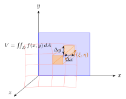
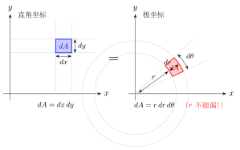
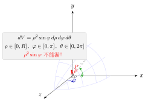
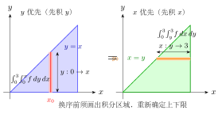

# 第19章 重积分

> **一例速记**：
> **双重积分套路**：识别积分区域形状 → 选直角或极坐标 → 确定积分上下限 → 化为两次单变量积分。
> **极坐标换元**：$x=r\cos\theta$，$y=r\sin\theta$，$dA = r\,dr\,d\theta$（**不能丢掉 $r$**）。
> **球坐标换元**：$x=\rho\sin\varphi\cos\theta$，$y=\rho\sin\varphi\sin\theta$，$z=\rho\cos\varphi$，$dV=\rho^2\sin\varphi\,d\rho\,d\varphi\,d\theta$（**不能丢掉 $\rho^2\sin\varphi$**）。
> **换序思路**：画出积分区域，从"$x$ 优先"换成"$y$ 优先"就是把区域描述方式转置。
> **Jacobian 本质**：换元 $(x,y)\to(u,v)$ 时，面积元素变换因子 $|J| = |\partial(x,y)/\partial(u,v)|$。

---

## 引入：极坐标下的 Gauss 积分

> **题目**：计算 $\displaystyle I = \iint_D e^{-(x^2+y^2)}\,dA$，其中 $D$ 是单位圆盘 $\{(x,y)\mid x^2+y^2\leq 1\}$。

请先停下来想一想：被积函数含 $x^2+y^2$，积分区域也是圆盘，这是**极坐标换元**的标准信号。

---

## 思维路径还原（解题者的内心独白）

> "看到 $e^{-(x^2+y^2)}$ 在圆盘上积分，第一反应：**极坐标**！$x^2+y^2 = r^2$，被积函数变 $e^{-r^2}$。
>
> **第一步：写出换元**。$x = r\cos\theta$，$y = r\sin\theta$，面积元素 $dA = r\,dr\,d\theta$。
>
> **第二步：确定范围**。$D$ 是单位圆盘 → $r \in [0, 1]$，$\theta \in [0, 2\pi]$。
>
> **第三步：化为累次积分**。
>
> $$I = \int_0^{2\pi}\int_0^1 e^{-r^2} \cdot r\,dr\,d\theta$$
>
> **第四步：先算内层**。令 $u = r^2$，$du = 2r\,dr$：
>
> $$\int_0^1 e^{-r^2} r\,dr = \frac{1}{2}\int_0^1 e^{-u}\,du = \frac{1}{2}\left[-e^{-u}\right]_0^1 = \frac{1}{2}(1 - e^{-1})$$
>
> **第五步：算外层**。$\theta$ 积分独立：
>
> $$I = \int_0^{2\pi} d\theta \cdot \frac{1}{2}(1 - e^{-1}) = 2\pi \cdot \frac{1 - e^{-1}}{2} = \pi(1 - e^{-1})$$
>
> **验证感觉**：若将 $D$ 改为全平面，则 $r\in[0,+\infty)$，内层积分变 $1/2$，结果 $\pi$。这正是经典 Gauss 积分 $\int_{-\infty}^\infty e^{-x^2}dx = \sqrt{\pi}$ 的平方。数值对上了！"

---

## 学习目标

通过本章学习，你将能够：

- 理解二重积分的概念，掌握其几何意义与物理意义
- 熟练运用累次积分计算二重积分，掌握交换积分次序的方法
- 掌握极坐标下二重积分的计算
- 理解三重积分的概念，掌握直角坐标、柱坐标、球坐标下的计算方法
- 理解重积分换元法的原理，掌握 Jacobi 行列式的计算
- 能够运用重积分求解曲面面积、质心、转动惯量等实际问题

---

## 19.1 二重积分的概念

### 19.1.1 从体积问题引入

设有一个以平面区域 $D$ 为底、以曲面 $z = f(x, y) \geq 0$ 为顶的曲顶柱体，如何求其体积？

**分割**：将区域 $D$ 分成 $n$ 个小区域 $\Delta\sigma_1, \Delta\sigma_2, \ldots, \Delta\sigma_n$，记各小区域的面积也为 $\Delta\sigma_i$。

**近似**：在每个小区域 $\Delta\sigma_i$ 上任取一点 $(\xi_i, \eta_i)$，以 $f(\xi_i, \eta_i)$ 为高的小柱体体积近似为 $f(\xi_i, \eta_i)\Delta\sigma_i$。

**求和**：曲顶柱体的体积近似为

$$V \approx \sum_{i=1}^{n} f(\xi_i, \eta_i)\Delta\sigma_i$$

**取极限**：令分割的最大直径 $\lambda = \max\{d_i\} \to 0$（其中 $d_i$ 是 $\Delta\sigma_i$ 的直径），体积为

$$V = \lim_{\lambda \to 0} \sum_{i=1}^{n} f(\xi_i, \eta_i)\Delta\sigma_i$$

### 19.1.2 二重积分的定义

**定义**：设 $f(x, y)$ 是有界闭区域 $D$ 上的有界函数。将 $D$ 任意分成 $n$ 个小区域 $\Delta\sigma_1, \Delta\sigma_2, \ldots, \Delta\sigma_n$，在每个 $\Delta\sigma_i$ 上任取一点 $(\xi_i, \eta_i)$，作和式

$$\sum_{i=1}^{n} f(\xi_i, \eta_i)\Delta\sigma_i$$

如果当各小区域的直径中的最大值 $\lambda \to 0$ 时，此和式的极限存在且与分割方式及点的取法无关，则称此极限为 $f(x, y)$ 在 $D$ 上的**二重积分**，记作

$$\iint_D f(x, y)\,d\sigma = \lim_{\lambda \to 0} \sum_{i=1}^{n} f(\xi_i, \eta_i)\Delta\sigma_i$$

其中 $f(x, y)$ 称为**被积函数**，$D$ 称为**积分区域**，$d\sigma$ 称为**面积元素**。

在直角坐标系中，$d\sigma = dx\,dy$，故二重积分也记作

$$\iint_D f(x, y)\,dx\,dy$$

**存在性定理**：若 $f(x, y)$ 在有界闭区域 $D$ 上连续，则二重积分 $\iint_D f(x, y)\,d\sigma$ 存在。

### 19.1.3 几何意义与物理意义

**几何意义**：
- 当 $f(x, y) > 0$ 时，$\iint_D f(x, y)\,d\sigma$ 表示以 $D$ 为底、以曲面 $z = f(x, y)$ 为顶的曲顶柱体的体积
- 当 $f(x, y)$ 有正有负时，积分值等于曲面上方体积减去曲面下方体积

**物理意义**：
- 若 $\rho(x, y)$ 表示平面薄板 $D$ 上的面密度，则 $\iint_D \rho(x, y)\,d\sigma$ 表示薄板的总质量
- 特别地，$\iint_D 1\,d\sigma = \iint_D d\sigma$ 等于区域 $D$ 的面积

**二重积分的性质**：

1. **线性性**：$\iint_D [af(x,y) + bg(x,y)]\,d\sigma = a\iint_D f\,d\sigma + b\iint_D g\,d\sigma$

2. **区域可加性**：若 $D = D_1 \cup D_2$，$D_1 \cap D_2$ 的面积为零，则
   $$\iint_D f\,d\sigma = \iint_{D_1} f\,d\sigma + \iint_{D_2} f\,d\sigma$$

3. **保号性**：若 $f(x,y) \geq 0$ 在 $D$ 上，则 $\iint_D f\,d\sigma \geq 0$

4. **估值定理**：若 $m \leq f(x,y) \leq M$ 在 $D$ 上，$S$ 为 $D$ 的面积，则
   $$mS \leq \iint_D f\,d\sigma \leq MS$$

5. **中值定理**：若 $f(x,y)$ 在有界闭区域 $D$ 上连续，则存在 $(\xi, \eta) \in D$ 使得
   $$\iint_D f(x,y)\,d\sigma = f(\xi, \eta) \cdot S$$

---

## 19.2 二重积分的计算

### 19.2.1 直角坐标下的计算（累次积分）

将二重积分化为两次定积分（累次积分）是计算的基本方法。

**X-型区域**：若区域 $D$ 可表示为

$$D = \{(x, y) \mid a \leq x \leq b, \, \varphi_1(x) \leq y \leq \varphi_2(x)\}$$

则二重积分化为先对 $y$ 后对 $x$ 的累次积分：

$$\iint_D f(x, y)\,dx\,dy = \int_a^b dx \int_{\varphi_1(x)}^{\varphi_2(x)} f(x, y)\,dy$$

**Y-型区域**：若区域 $D$ 可表示为

$$D = \{(x, y) \mid c \leq y \leq d, \, \psi_1(y) \leq x \leq \psi_2(y)\}$$

则二重积分化为先对 $x$ 后对 $y$ 的累次积分：

$$\iint_D f(x, y)\,dx\,dy = \int_c^d dy \int_{\psi_1(y)}^{\psi_2(y)} f(x, y)\,dx$$

> **例题 19.1** 计算 $\iint_D xy\,dx\,dy$，其中 $D$ 是由 $y = x$，$y = x^2$ 围成的区域。

**解**：两曲线交点为 $(0, 0)$ 和 $(1, 1)$。区域 $D$ 可表示为 X-型：

$$D = \{(x, y) \mid 0 \leq x \leq 1, \, x^2 \leq y \leq x\}$$

$$\iint_D xy\,dx\,dy = \int_0^1 dx \int_{x^2}^{x} xy\,dy = \int_0^1 x \left[\frac{y^2}{2}\right]_{x^2}^{x} dx$$

$$= \int_0^1 x \cdot \frac{1}{2}(x^2 - x^4)\,dx = \frac{1}{2}\int_0^1 (x^3 - x^5)\,dx$$

$$= \frac{1}{2}\left[\frac{x^4}{4} - \frac{x^6}{6}\right]_0^1 = \frac{1}{2}\left(\frac{1}{4} - \frac{1}{6}\right) = \frac{1}{2} \cdot \frac{1}{12} = \frac{1}{24}$$

### 19.2.2 交换积分次序

有时交换积分次序可以简化计算。关键是画出积分区域，然后用另一种方式表示。

> **例题 19.2** 交换积分次序：$\int_0^1 dx \int_x^1 f(x, y)\,dy$。

**解**：原积分区域为 $D = \{(x, y) \mid 0 \leq x \leq 1, \, x \leq y \leq 1\}$。

画图可知，这是由 $y = x$、$x = 0$、$y = 1$ 围成的三角形区域。

改写为 Y-型：$D = \{(x, y) \mid 0 \leq y \leq 1, \, 0 \leq x \leq y\}$。

交换后：$\int_0^1 dy \int_0^y f(x, y)\,dx$。

> **例题 19.3** 计算 $\int_0^1 dx \int_x^1 e^{y^2}\,dy$。

**解**：$e^{y^2}$ 没有初等原函数，无法直接积分。交换积分次序：

区域 $D = \{(x, y) \mid 0 \leq x \leq 1, \, x \leq y \leq 1\} = \{(x, y) \mid 0 \leq y \leq 1, \, 0 \leq x \leq y\}$

$$\int_0^1 dx \int_x^1 e^{y^2}\,dy = \int_0^1 dy \int_0^y e^{y^2}\,dx = \int_0^1 e^{y^2} \cdot y\,dy$$

$$= \frac{1}{2}\int_0^1 e^{y^2}\,d(y^2) = \frac{1}{2}\left[e^{y^2}\right]_0^1 = \frac{1}{2}(e - 1)$$

### 19.2.3 极坐标下的计算

当积分区域是圆形、扇形或被积函数含 $x^2 + y^2$ 时，使用极坐标往往更方便。

**坐标变换**：$x = r\cos\theta$，$y = r\sin\theta$

**面积元素**：$d\sigma = r\,dr\,d\theta$（注意多出的因子 $r$）

若积分区域为

$$D = \{(r, \theta) \mid \alpha \leq \theta \leq \beta, \, r_1(\theta) \leq r \leq r_2(\theta)\}$$

则

$$\iint_D f(x, y)\,dx\,dy = \int_\alpha^\beta d\theta \int_{r_1(\theta)}^{r_2(\theta)} f(r\cos\theta, r\sin\theta) \cdot r\,dr$$

> **例题 19.4** 计算 $\iint_D e^{-(x^2+y^2)}\,dx\,dy$，其中 $D = \{(x, y) \mid x^2 + y^2 \leq 1\}$。

**解**：区域 $D$ 是单位圆盘，极坐标下为 $0 \leq \theta \leq 2\pi$，$0 \leq r \leq 1$。

$$\iint_D e^{-(x^2+y^2)}\,dx\,dy = \int_0^{2\pi} d\theta \int_0^1 e^{-r^2} \cdot r\,dr$$

$$= 2\pi \int_0^1 re^{-r^2}\,dr = 2\pi \cdot \left[-\frac{1}{2}e^{-r^2}\right]_0^1 = 2\pi \cdot \frac{1}{2}(1 - e^{-1}) = \pi(1 - e^{-1})$$

---

## 19.3 三重积分

### 19.3.1 三重积分的定义

**定义**：设 $f(x, y, z)$ 是空间有界闭区域 $\Omega$ 上的有界函数。将 $\Omega$ 分成 $n$ 个小区域 $\Delta v_i$，在每个 $\Delta v_i$ 上任取一点 $(\xi_i, \eta_i, \zeta_i)$，若极限

$$\lim_{\lambda \to 0} \sum_{i=1}^{n} f(\xi_i, \eta_i, \zeta_i)\Delta v_i$$

存在，则称此极限为 $f(x, y, z)$ 在 $\Omega$ 上的**三重积分**，记作

$$\iiint_\Omega f(x, y, z)\,dv$$

在直角坐标系中，$dv = dx\,dy\,dz$。

**物理意义**：若 $\rho(x, y, z)$ 为空间物体 $\Omega$ 的体密度，则 $\iiint_\Omega \rho\,dv$ 为物体的总质量。

### 19.3.2 直角坐标下的计算

**投影法**：设区域 $\Omega$ 在 $xOy$ 面上的投影为 $D_{xy}$，且

$$\Omega = \{(x, y, z) \mid (x, y) \in D_{xy}, \, z_1(x, y) \leq z \leq z_2(x, y)\}$$

则

$$\iiint_\Omega f(x, y, z)\,dv = \iint_{D_{xy}} \left[\int_{z_1(x,y)}^{z_2(x,y)} f(x, y, z)\,dz\right] dx\,dy$$

> **例题 19.5** 计算 $\iiint_\Omega z\,dv$，其中 $\Omega$ 是由 $z = 0$，$z = 1 - x - y$，$x = 0$，$y = 0$ 围成的四面体。

**解**：在 $xOy$ 面上的投影 $D_{xy} = \{(x, y) \mid x \geq 0, y \geq 0, x + y \leq 1\}$。

$$\iiint_\Omega z\,dv = \iint_{D_{xy}} \left[\int_0^{1-x-y} z\,dz\right] dx\,dy = \iint_{D_{xy}} \frac{(1-x-y)^2}{2}\,dx\,dy$$

$$= \frac{1}{2}\int_0^1 dx \int_0^{1-x} (1-x-y)^2\,dy$$

令 $u = 1 - x - y$，则 $dy = -du$，当 $y = 0$ 时 $u = 1 - x$，当 $y = 1 - x$ 时 $u = 0$：

$$= \frac{1}{2}\int_0^1 dx \int_{1-x}^{0} u^2 \cdot (-du) = \frac{1}{2}\int_0^1 \left[\frac{u^3}{3}\right]_0^{1-x} dx = \frac{1}{6}\int_0^1 (1-x)^3\,dx$$

$$= \frac{1}{6} \cdot \left[-\frac{(1-x)^4}{4}\right]_0^1 = \frac{1}{6} \cdot \frac{1}{4} = \frac{1}{24}$$

### 19.3.3 柱坐标

**柱坐标**：$(r, \theta, z)$，其中

$$x = r\cos\theta, \quad y = r\sin\theta, \quad z = z$$

**体积元素**：$dv = r\,dr\,d\theta\,dz$

柱坐标适用于关于 $z$ 轴对称或含 $x^2 + y^2$ 的问题。

> **例题 19.6** 计算 $\iiint_\Omega (x^2 + y^2)\,dv$，其中 $\Omega$ 是由 $x^2 + y^2 = 1$，$z = 0$，$z = 2$ 围成的圆柱体。

**解**：用柱坐标，$\Omega$：$0 \leq r \leq 1$，$0 \leq \theta \leq 2\pi$，$0 \leq z \leq 2$。

$$\iiint_\Omega (x^2 + y^2)\,dv = \int_0^{2\pi} d\theta \int_0^1 r^2 \cdot r\,dr \int_0^2 dz$$

$$= 2\pi \cdot \left[\frac{r^4}{4}\right]_0^1 \cdot 2 = 2\pi \cdot \frac{1}{4} \cdot 2 = \pi$$

### 19.3.4 球坐标

**球坐标**：$(\rho, \varphi, \theta)$，其中

$$x = \rho\sin\varphi\cos\theta, \quad y = \rho\sin\varphi\sin\theta, \quad z = \rho\cos\varphi$$

这里 $\rho \geq 0$ 是到原点的距离，$\varphi \in [0, \pi]$ 是与 $z$ 轴正向的夹角，$\theta \in [0, 2\pi)$ 是在 $xOy$ 面上投影与 $x$ 轴正向的夹角。

**体积元素**：$dv = \rho^2 \sin\varphi\,d\rho\,d\varphi\,d\theta$

球坐标适用于球形区域或含 $x^2 + y^2 + z^2$ 的问题。

> **例题 19.7** 计算 $\iiint_\Omega \sqrt{x^2 + y^2 + z^2}\,dv$，其中 $\Omega$ 是球 $x^2 + y^2 + z^2 \leq R^2$。

**解**：用球坐标，$\Omega$：$0 \leq \rho \leq R$，$0 \leq \varphi \leq \pi$，$0 \leq \theta \leq 2\pi$。

$$\iiint_\Omega \sqrt{x^2 + y^2 + z^2}\,dv = \int_0^{2\pi} d\theta \int_0^{\pi} \sin\varphi\,d\varphi \int_0^R \rho \cdot \rho^2\,d\rho$$

$$= 2\pi \cdot [-\cos\varphi]_0^{\pi} \cdot \left[\frac{\rho^4}{4}\right]_0^R = 2\pi \cdot 2 \cdot \frac{R^4}{4} = \pi R^4$$

---

## 19.4 重积分的换元法

### 19.4.1 一般换元公式

设变换 $T: x = x(u, v)$，$y = y(u, v)$ 将 $uv$ 平面上的区域 $D'$ 一一映射到 $xy$ 平面上的区域 $D$，且变换具有连续偏导数。

**二重积分换元公式**：

$$\iint_D f(x, y)\,dx\,dy = \iint_{D'} f(x(u,v), y(u,v)) \cdot |J|\,du\,dv$$

### 19.4.2 Jacobi 行列式

**Jacobi 行列式**（雅可比行列式）定义为：

$$J = \frac{\partial(x, y)}{\partial(u, v)} = \begin{vmatrix} \dfrac{\partial x}{\partial u} & \dfrac{\partial x}{\partial v} \\[10pt] \dfrac{\partial y}{\partial u} & \dfrac{\partial y}{\partial v} \end{vmatrix}$$

**三重积分换元公式**：

$$\iiint_\Omega f(x, y, z)\,dx\,dy\,dz = \iiint_{\Omega'} f(x, y, z) \cdot |J|\,du\,dv\,dw$$

其中

$$J = \frac{\partial(x, y, z)}{\partial(u, v, w)} = \begin{vmatrix} \dfrac{\partial x}{\partial u} & \dfrac{\partial x}{\partial v} & \dfrac{\partial x}{\partial w} \\[10pt] \dfrac{\partial y}{\partial u} & \dfrac{\partial y}{\partial v} & \dfrac{\partial y}{\partial w} \\[10pt] \dfrac{\partial z}{\partial u} & \dfrac{\partial z}{\partial v} & \dfrac{\partial z}{\partial w} \end{vmatrix}$$

**常用坐标变换的 Jacobi 行列式**：

- 极坐标：$J = r$
- 柱坐标：$J = r$
- 球坐标：$J = \rho^2 \sin\varphi$

> **例题 19.8** 计算 $\iint_D e^{\frac{y-x}{y+x}}\,dx\,dy$，其中 $D$ 是由 $x = 0$，$y = 0$，$x + y = 1$ 围成的三角形。

**解**：令 $u = y - x$，$v = y + x$，则 $x = \dfrac{v - u}{2}$，$y = \dfrac{v + u}{2}$。

$$J = \frac{\partial(x, y)}{\partial(u, v)} = \begin{vmatrix} -\dfrac{1}{2} & \dfrac{1}{2} \\[8pt] \dfrac{1}{2} & \dfrac{1}{2} \end{vmatrix} = -\frac{1}{4} - \frac{1}{4} = -\frac{1}{2}$$

原区域边界变换：$x = 0 \Rightarrow u = v$；$y = 0 \Rightarrow u = -v$；$x + y = 1 \Rightarrow v = 1$。

新区域 $D' = \{(u, v) \mid 0 \leq v \leq 1, \, -v \leq u \leq v\}$。

$$\iint_D e^{\frac{y-x}{y+x}}\,dx\,dy = \iint_{D'} e^{\frac{u}{v}} \cdot \frac{1}{2}\,du\,dv = \frac{1}{2}\int_0^1 dv \int_{-v}^{v} e^{\frac{u}{v}}\,du$$

$$= \frac{1}{2}\int_0^1 \left[v \cdot e^{\frac{u}{v}}\right]_{-v}^{v} dv = \frac{1}{2}\int_0^1 v(e - e^{-1})\,dv = \frac{e - e^{-1}}{2} \cdot \frac{1}{2} = \frac{e - e^{-1}}{4}$$

### 19.4.3 重积分运算规则体系（完整推导）

到目前为止，本章使用了多条"运算规则"——线性性、区域可加性、Fubini 定理（累次积分）、极/柱/球坐标变换、一般 Jacobi 换元、对称性化简——但只给出了**结论**，未给出推导。本小节系统、不跳步地补全所有规则的论证。

#### 全景导览

```
第 0 层：Riemann 和定义 + 极限
   ↓
第 1 层（基本性质）：线性性 / 区域可加性 / 单调性 / 估值 / 中值
   ↓
第 2 层（化为累次积分）：Fubini–Tonelli 定理
   ↓
第 3 层（坐标变换）：换元公式 |J| du dv → 极/柱/球坐标
   ↓
第 4 层（对称化简）：奇偶对称、轮换对称
```

下面逐条不跳步推导。

---

#### 规则 1：二重积分的线性性

**定理**：设 $f, g$ 在 $D$ 上可积，$\alpha, \beta$ 为常数，则

$$\iint_D[\alpha f + \beta g]\,d\sigma = \alpha\iint_D f\,d\sigma + \beta\iint_D g\,d\sigma.$$

**推导**（直接从 Riemann 和定义）：

**第一步**：取任意分割 $\{\Delta\sigma_i\}$ 与样本点 $(\xi_i, \eta_i)$，记 Riemann 和：
$$S_{f}(\mathcal{P}) = \sum_i f(\xi_i,\eta_i)\Delta\sigma_i,\quad S_g(\mathcal{P}) = \sum_i g(\xi_i,\eta_i)\Delta\sigma_i.$$

**第二步**：对 $\alpha f + \beta g$ 的 Riemann 和直接展开：
$$S_{\alpha f + \beta g}(\mathcal{P}) = \sum_i [\alpha f(\xi_i,\eta_i) + \beta g(\xi_i,\eta_i)]\Delta\sigma_i = \alpha S_f(\mathcal{P}) + \beta S_g(\mathcal{P}).$$

**第三步**：取分割直径 $\lambda\to 0$，由极限线性性：
$$\iint_D(\alpha f+\beta g) = \alpha\iint_D f + \beta\iint_D g.\quad\square$$

---

#### 规则 2：区域可加性

**定理**：设 $D = D_1\cup D_2$，$D_1\cap D_2$ 面积为零，$f$ 在 $D$ 上可积，则
$$\iint_D f\,d\sigma = \iint_{D_1} f\,d\sigma + \iint_{D_2} f\,d\sigma.$$

**推导**：

**第一步**（构造特殊分割）：取 $D$ 的分割使每一小块要么完全落在 $D_1$ 内，要么完全落在 $D_2$ 内（边界小块面积可忽略，因 $D_1\cap D_2$ 面积为零）。

**第二步**（拆和）：把 Riemann 和按归属拆成两部分：
$$\sum_i f(\xi_i,\eta_i)\Delta\sigma_i = \sum_{i:\Delta\sigma_i\subset D_1} + \sum_{i:\Delta\sigma_i\subset D_2}.$$

**第三步**：每部分分别是 $D_1, D_2$ 上的 Riemann 和。取极限即得。$\square$

> **应用**：当区域形状复杂时（如 L 形、带洞），先把它拆成几个简单子区域再用 Fubini 定理。

---

#### 规则 3：单调性 / 估值 / 中值定理

**单调性**：若 $f\le g$ 在 $D$ 上成立，则 $\iint_D f \le \iint_D g$。

**推导**：每一项 Riemann 和满足 $f(\xi_i,\eta_i)\Delta\sigma_i \le g(\xi_i,\eta_i)\Delta\sigma_i$（$\Delta\sigma_i\ge 0$），求和后取极限保号。$\square$

**估值**：$m\le f\le M$ 时，$mS\le\iint_D f\le MS$（$S$ 为 $D$ 面积）。**推导**：用单调性，对 $f$ 上下夹估即可。

**中值定理**：$f$ 在有界闭区域 $D$ 上连续 $\Rightarrow$ 存在 $(\xi,\eta)\in D$，使 $\iint_D f\,d\sigma = f(\xi,\eta)\cdot S$。

**推导**：

**第一步**：由估值定理 $mS\le \iint_D f\le MS$，故
$$m\le \frac{1}{S}\iint_D f\,d\sigma\le M.$$

**第二步**：$m, M$ 分别是 $f$ 在 $D$ 上的最小、最大值。$f$ 连续 + $D$ 连通 $\Rightarrow$ 介值定理：存在 $(\xi,\eta)\in D$ 使 $f(\xi,\eta) = \dfrac{1}{S}\iint_D f$。$\square$

---

#### 规则 4：Fubini 定理——重积分 = 累次积分

**定理**（Fubini 定理 / 直角坐标版本）：设 $f(x,y)$ 在矩形 $R = [a,b]\times[c,d]$ 上连续，则
$$\iint_R f(x,y)\,d\sigma = \int_a^b\left[\int_c^d f(x,y)\,dy\right]dx = \int_c^d\left[\int_a^b f(x,y)\,dx\right]dy.$$

**直觉推导**（不跳步，几何 + Riemann 和视角）：

**第一步**（切片法）：把 $R$ 沿 $x$ 方向等分成 $m$ 列、$y$ 方向等分成 $n$ 行，得 $mn$ 个小矩形 $R_{ij} = [x_{i-1},x_i]\times[y_{j-1},y_j]$，面积 $\Delta x_i\Delta y_j$。

**第二步**（Riemann 和）：取样本点 $(\xi_i,\eta_j)$（行列交点），
$$S = \sum_{i=1}^m\sum_{j=1}^n f(\xi_i,\eta_j)\Delta x_i\Delta y_j.$$

**第三步**（按 $i$ 内层先求和）：固定 $i$，把 $j$ 的求和提到内层：
$$S = \sum_{i=1}^m\left[\sum_{j=1}^n f(\xi_i,\eta_j)\Delta y_j\right]\Delta x_i.$$

**第四步**（识别内层为对 $y$ 的 Riemann 和）：固定 $\xi_i$，内层 $\sum_j f(\xi_i,\eta_j)\Delta y_j$ 是一元函数 $y\mapsto f(\xi_i, y)$ 在 $[c,d]$ 上的 Riemann 和。$f$ 连续 $\Rightarrow$ 一元可积，当 $\max\Delta y_j\to 0$：
$$\sum_j f(\xi_i,\eta_j)\Delta y_j\to \int_c^d f(\xi_i, y)\,dy =: I(\xi_i).$$

**第五步**（外层取极限）：记 $I(x) = \int_c^d f(x,y)\,dy$。$f$ 连续蕴含 $I(x)$ 是 $x$ 的连续函数（一致连续性 + 控制收敛）。故
$$S\to \int_a^b I(x)\,dx = \int_a^b\left[\int_c^d f(x,y)\,dy\right]dx.$$

**第六步**：另一边同理（先 $x$ 后 $y$）。两次次序相等，因为它们都等于二重积分本身。$\square$

#### 一般区域上的 Fubini

对 X-型区域 $D = \{(x,y): a\le x\le b, \varphi_1(x)\le y\le \varphi_2(x)\}$，用"延拓 + 矩形 Fubini"技巧：

**第一步**：把 $f$ 延拓到包围 $D$ 的最小矩形 $R$，在 $R\setminus D$ 上定义为 $0$；记为 $\tilde f$。

**第二步**（关键）：$\iint_D f = \iint_R \tilde f$（在 $D$ 外被积函数为零）。

**第三步**：对 $\iint_R \tilde f$ 用矩形 Fubini，内层对 $y$ 积分时只有 $\varphi_1(x)\le y\le\varphi_2(x)$ 部分非零：
$$\iint_R \tilde f = \int_a^b\left[\int_{\varphi_1(x)}^{\varphi_2(x)} f(x,y)\,dy\right]dx.\quad\square$$

> **注意**：Fubini 定理对一般可积函数有连续性的要求；非连续情形（如带跳跃间断或瑕点）需更小心，参考 Lebesgue 理论中的 Fubini–Tonelli 定理。

---

#### 规则 5：换元公式的几何推导（二重积分版）

**定理**：设 $T:(u,v)\mapsto (x(u,v), y(u,v))$ 是 $D'$ 到 $D$ 的一一映射，$x, y$ 有连续偏导，$f$ 在 $D$ 上可积，则
$$\iint_D f(x,y)\,dx\,dy = \iint_{D'} f(x(u,v),y(u,v))\,|J(u,v)|\,du\,dv,$$
其中 $J = \dfrac{\partial(x,y)}{\partial(u,v)}$ 是 Jacobi 行列式。

**不跳步几何推导**：

**第一步**（小矩形像的形状）：在 $uv$ 平面取小矩形 $\Delta R = [u_0, u_0+\Delta u]\times[v_0, v_0+\Delta v]$。其顶点经 $T$ 映射到 $xy$ 平面的四点。**关键观察**：当 $\Delta u, \Delta v$ 很小时，像近似为**小平行四边形**。

**第二步**（用 Taylor 展开求像的顶点）：以 $P_0 = (x(u_0,v_0), y(u_0,v_0))$ 为基点，
- $T(u_0+\Delta u, v_0) - P_0 \approx (x_u, y_u)\,\Delta u$，
- $T(u_0, v_0+\Delta v) - P_0 \approx (x_v, y_v)\,\Delta v$。

故像近似平行四边形由两个向量
$$\vec{a} = (x_u\Delta u, y_u\Delta u),\quad \vec{b} = (x_v\Delta v, y_v\Delta v)$$
张成。

**第三步**（求平行四边形面积——叉积公式）：二维平面两向量 $\vec{a}, \vec{b}$ 张成的平行四边形面积为
$$\text{Area} = |a_1 b_2 - a_2 b_1| = |x_u\Delta u\cdot y_v\Delta v - y_u\Delta u\cdot x_v\Delta v| = |x_u y_v - x_v y_u|\,\Delta u\Delta v.$$

**第四步**（识别为 Jacobi 行列式）：
$$x_u y_v - x_v y_u = \det\begin{pmatrix} x_u & x_v \\ y_u & y_v\end{pmatrix} = J.$$

故像的面积 $\approx |J|\,\Delta u\Delta v$。

**第五步**（面积元的对应）：$dx\,dy = |J|\,du\,dv$，这就是**面积元变换公式**。

**第六步**（Riemann 和上代换）：把 $D$ 上的 Riemann 和按 $T$ 的逆映射改写——每个像小块面积 $\approx |J|\,\Delta u\Delta v$，被积函数值 $f(T(u,v))$ 不变：
$$\iint_D f\,dx\,dy = \lim\sum f(P_i)\Delta\sigma_i = \lim\sum f(T(u_i,v_i))\,|J(u_i,v_i)|\Delta u_i\Delta v_i = \iint_{D'} f\circ T\cdot |J|\,du\,dv.\quad\square$$

> **为什么需要绝对值** $|J|$ ？$J$ 的符号反映**定向**：$J>0$ 时 $T$ 保持定向，$J<0$ 时反转。但面积非负，故取绝对值。

---

#### 规则 6：极坐标 Jacobi $J = r$ 的不跳步推导

**变换**：$x = r\cos\theta, y = r\sin\theta$。

**第一步**（写出偏导）：
$$x_r = \cos\theta,\quad x_\theta = -r\sin\theta,\quad y_r = \sin\theta,\quad y_\theta = r\cos\theta.$$

**第二步**（行列式）：
$$J = \det\begin{pmatrix}\cos\theta & -r\sin\theta\\ \sin\theta & r\cos\theta\end{pmatrix} = \cos\theta\cdot r\cos\theta - (-r\sin\theta)\cdot\sin\theta = r(\cos^2\theta + \sin^2\theta) = r.$$

**第三步**（几何直观）：极坐标下小面积元由 $dr$ 与 $r\,d\theta$（圆弧长）围成的小矩形，面积 $= dr\cdot r\,d\theta = r\,dr\,d\theta$。两种方法殊途同归。

#### 几何法直接推 $dA = r\,dr\,d\theta$（避开 Jacobi 行列式）

在 $(r,\theta)$ 平面取小矩形 $[r, r+\Delta r]\times[\theta, \theta+\Delta\theta]$。它在 $xy$ 平面的像是**环扇形**：

**外环扇形面积** $= \frac{1}{2}(r+\Delta r)^2\Delta\theta$，**内环扇形面积** $= \frac{1}{2}r^2\Delta\theta$。

环扇形面积 $= \frac{1}{2}[(r+\Delta r)^2 - r^2]\Delta\theta = \frac{1}{2}(2r\Delta r + (\Delta r)^2)\Delta\theta = r\Delta r\Delta\theta + \frac{(\Delta r)^2}{2}\Delta\theta$。

当 $\Delta r, \Delta\theta\to 0$，主项为 $r\Delta r\Delta\theta$，高阶项 $(\Delta r)^2\Delta\theta$ 可略。故 $dA = r\,dr\,d\theta$。$\square$

---

#### 规则 7：柱坐标 Jacobi $J = r$ 的推导

**变换**：$x = r\cos\theta, y = r\sin\theta, z = z$。

**第一步**：写出 $3\times 3$ Jacobi 矩阵
$$\begin{pmatrix} \cos\theta & -r\sin\theta & 0\\ \sin\theta & r\cos\theta & 0\\ 0 & 0 & 1\end{pmatrix}.$$

**第二步**（按第三列展开）：第三列除 $(3,3)=1$ 外全为 $0$，按列展开
$$J = 1\cdot\det\begin{pmatrix}\cos\theta & -r\sin\theta\\ \sin\theta & r\cos\theta\end{pmatrix} = r.\quad\square$$

**直觉**：柱坐标 = 极坐标 + $z$ 方向不变，故体积元 $dV = (r\,dr\,d\theta)\cdot dz = r\,dr\,d\theta\,dz$。

---

#### 规则 8：球坐标 Jacobi $J = \rho^2\sin\varphi$ 的不跳步推导

**变换**：$x = \rho\sin\varphi\cos\theta, y = \rho\sin\varphi\sin\theta, z = \rho\cos\varphi$。

**第一步**（求 $9$ 个偏导）：
$$\begin{aligned}
x_\rho &= \sin\varphi\cos\theta, & x_\varphi &= \rho\cos\varphi\cos\theta, & x_\theta &= -\rho\sin\varphi\sin\theta,\\
y_\rho &= \sin\varphi\sin\theta, & y_\varphi &= \rho\cos\varphi\sin\theta, & y_\theta &= \rho\sin\varphi\cos\theta,\\
z_\rho &= \cos\varphi, & z_\varphi &= -\rho\sin\varphi, & z_\theta &= 0.
\end{aligned}$$

**第二步**（写 Jacobi 矩阵 $J$）：
$$J = \det\begin{pmatrix}
\sin\varphi\cos\theta & \rho\cos\varphi\cos\theta & -\rho\sin\varphi\sin\theta\\
\sin\varphi\sin\theta & \rho\cos\varphi\sin\theta & \rho\sin\varphi\cos\theta\\
\cos\varphi & -\rho\sin\varphi & 0
\end{pmatrix}.$$

**第三步**（沿第三行展开）：第三行 $(\cos\varphi, -\rho\sin\varphi, 0)$。
$$J = \cos\varphi\cdot M_{31} - (-\rho\sin\varphi)\cdot M_{32} + 0\cdot M_{33},$$
其中 $M_{3k}$ 是去掉第 $3$ 行第 $k$ 列后的 $2\times 2$ 子式。

**第四步**（计算 $M_{31}$）：
$$M_{31} = \det\begin{pmatrix}\rho\cos\varphi\cos\theta & -\rho\sin\varphi\sin\theta\\ \rho\cos\varphi\sin\theta & \rho\sin\varphi\cos\theta\end{pmatrix} = \rho^2\sin\varphi\cos\varphi(\cos^2\theta + \sin^2\theta) = \rho^2\sin\varphi\cos\varphi.$$

**第五步**（计算 $M_{32}$）：
$$M_{32} = \det\begin{pmatrix}\sin\varphi\cos\theta & -\rho\sin\varphi\sin\theta\\ \sin\varphi\sin\theta & \rho\sin\varphi\cos\theta\end{pmatrix} = \rho\sin^2\varphi(\cos^2\theta + \sin^2\theta) = \rho\sin^2\varphi.$$

**第六步**（合并）：
$$J = \cos\varphi\cdot \rho^2\sin\varphi\cos\varphi + \rho\sin\varphi\cdot \rho\sin^2\varphi = \rho^2\sin\varphi\cos^2\varphi + \rho^2\sin^3\varphi.$$

**第七步**（用 $\cos^2\varphi + \sin^2\varphi = 1$ 提取）：
$$J = \rho^2\sin\varphi(\cos^2\varphi + \sin^2\varphi) = \rho^2\sin\varphi.\quad\square$$

**几何直觉**：球坐标小立方体由三段长度
- $d\rho$（径向）
- $\rho\,d\varphi$（极角圆弧）
- $\rho\sin\varphi\,d\theta$（方位角圆弧，半径为 $\rho\sin\varphi$ 的圆周）

围成，正交相乘 $dV = \rho^2\sin\varphi\,d\rho\,d\varphi\,d\theta$。

> **常见错误**：把球坐标 $\theta$ 的圆弧半径写成 $\rho$ 而不是 $\rho\sin\varphi$——这就丢了 $\sin\varphi$ 因子。**记住**：$\theta$ 是在 $xy$ 投影面上的方位角，所在圆的半径是 $\rho\sin\varphi$（不是 $\rho$）。

---

#### 规则 9：对称性原理的严格推导

**定理（关于 $y$ 轴对称的二重积分）**：设 $D$ 关于 $y$ 轴对称（即 $(x,y)\in D\Leftrightarrow (-x,y)\in D$），$D^+ = \{(x,y)\in D: x\ge 0\}$。则：

- 若 $f(-x,y) = -f(x,y)$（关于 $x$ 奇），$\iint_D f = 0$。
- 若 $f(-x,y) = f(x,y)$（关于 $x$ 偶），$\iint_D f = 2\iint_{D^+}f$。

**完整推导**：

**第一步**：用区域可加性把 $D$ 拆为 $D^+$ 与 $D^- = \{(x,y)\in D: x\le 0\}$：
$$\iint_D f = \iint_{D^+} f + \iint_{D^-} f.$$

**第二步**（对 $D^-$ 上作变量替换 $u = -x, v = y$）：因 $D$ 关于 $y$ 轴对称，$(x,y)\in D^- \Leftrightarrow (u,v) = (-x,y)\in D^+$。Jacobi 行列式：
$$J = \det\begin{pmatrix}\partial x/\partial u & \partial x/\partial v\\ \partial y/\partial u & \partial y/\partial v\end{pmatrix} = \det\begin{pmatrix}-1 & 0\\ 0 & 1\end{pmatrix} = -1.$$

取绝对值 $|J| = 1$。故
$$\iint_{D^-} f(x,y)\,dx\,dy = \iint_{D^+} f(-u, v)\cdot 1\,du\,dv = \iint_{D^+} f(-x,y)\,dx\,dy.$$

（最后步换回 $x, y$ 哑变量。）

**第三步**：
- 奇：$f(-x,y) = -f(x,y) \Rightarrow \iint_{D^-} f = -\iint_{D^+}f \Rightarrow \iint_D f = 0$。
- 偶：$f(-x,y) = f(x,y) \Rightarrow \iint_{D^-} f = \iint_{D^+}f \Rightarrow \iint_D f = 2\iint_{D^+}f$。$\square$

**对称性的高维推广**（三重积分版）：若 $\Omega$ 关于 $xy$ 平面对称且 $f$ 关于 $z$ 为奇 $\Rightarrow \iiint_\Omega f\,dv = 0$。证法完全类似（用 $(x,y,z)\mapsto(x,y,-z)$ 的换元）。

#### 轮换对称性

若 $\Omega$ 在 $x\leftrightarrow y\leftrightarrow z$ 置换下不变（如球、立方体），则
$$\iiint_\Omega x^2\,dv = \iiint_\Omega y^2\,dv = \iiint_\Omega z^2\,dv = \frac{1}{3}\iiint_\Omega(x^2+y^2+z^2)\,dv.$$

**推导**：用变量替换 $(x,y,z)\to(y,x,z)$（Jacobi 绝对值 = 1）。$\square$

> **威力**：求 $\iiint_{x^2+y^2+z^2\le R^2} x^2\,dv$。直接算需积分 $r^2\sin^2\varphi\cos^2\theta$；用轮换对称得 $\dfrac{1}{3}\iiint(x^2+y^2+z^2)dv = \dfrac{1}{3}\int_0^{2\pi}\int_0^\pi\int_0^R\rho^2\cdot \rho^2\sin\varphi\,d\rho\,d\varphi\,d\theta = \dfrac{4\pi R^5}{15}$。

---

#### 规则 10：高维换元（一般 $n$ 重积分）

设 $T:U'\to U$ 是 $\mathbb{R}^n$ 中开集的可微一一映射，$|J| = |\det DT|\neq 0$，$f$ 可积，则

$$\int\cdots\int_U f(\mathbf{x})\,d\mathbf{x} = \int\cdots\int_{U'} f(T(\mathbf{u}))\,|J(\mathbf{u})|\,d\mathbf{u}.$$

**推导思路**（要点）：仿照二维几何推导——用 $T$ 的局部线性化 $DT(\mathbf{u}_0)$ 把小盒映为小平行多面体，其体积为 $|\det DT|\cdot$（原盒体积）。这是**线性变换的体积缩放因子 = 行列式绝对值**这一线性代数事实在微分几何上的应用。

> **应用提示**：维数 $n\ge 4$ 时几乎只出现在概率论 / 物理学的多维高斯积分；标准技巧仍是球面坐标的高维推广 + Jacobi 行列式。

---

#### 19.4.3 末：重积分计算的决策树

```
拿到 ∫∫f(x,y)dσ（或三重）
   ↓
第 0 步：被积函数有对称性吗？
   关于坐标轴/平面有奇偶 → 直接 0 或折半（规则 9）
   轮换对称 → 平均化（轮换规则）
   ↓
第 1 步：区域形状如何？
   矩形/X型/Y型      → 直接 Fubini，直角坐标累次积分（规则 4）
   圆/扇形/含 x²+y²   → 极坐标（规则 6）
   柱形/含 x²+y² + z无关 → 柱坐标（规则 7）
   球/含 x²+y²+z²     → 球坐标（规则 8）
   斜形/被积变量耦合 → 一般换元（规则 5），找合适 (u,v)
   ↓
第 2 步：积分次序难算？
   遇 e^{x²}, sin(x²) 等内层不可初等积分
   → 交换积分次序（用 Fubini 双向）
   ↓
第 3 步：复杂时拆区域（规则 2）→ 分段计算
   ↓
第 4 步：实在算不出 → 数值积分 / Monte Carlo（见 19.7）
```

---

## 19.5 利用对称性简化计算

在重积分计算中，合理利用积分区域和被积函数的对称性，可以大幅简化计算。

### 19.5.1 奇偶性的应用

**定理**：设积分区域 $D$ 关于 $x$ 轴对称（即 $(x, y) \in D \Leftrightarrow (x, -y) \in D$），则：

- 若 $f(x, y)$ 关于 $y$ 是**奇函数**（即 $f(x, -y) = -f(x, y)$），则 $\iint_D f(x, y)\,d\sigma = 0$
- 若 $f(x, y)$ 关于 $y$ 是**偶函数**（即 $f(x, -y) = f(x, y)$），则 $\iint_D f(x, y)\,d\sigma = 2\iint_{D_1} f(x, y)\,d\sigma$

其中 $D_1$ 是 $D$ 中 $y \geq 0$ 的部分。关于 $y$ 轴对称的情况类似。

**推广到三重积分**：若空间区域 $\Omega$ 关于某坐标平面对称，且被积函数关于对应变量为奇函数，则积分为零。

### 19.5.2 例题

> **例题 19.11** 计算 $\iint_D xy^2\,dx\,dy$，其中 $D$ 是圆域 $x^2 + y^2 \leq 1$。

**解**：区域 $D$ 关于 $y$ 轴对称（即关于 $x$ 对称）。被积函数 $f(x, y) = xy^2$ 关于 $x$ 是奇函数：

$$f(-x, y) = (-x)y^2 = -xy^2 = -f(x, y)$$

因此 $\iint_D xy^2\,dx\,dy = 0$。$\square$

**说明**：如果不利用对称性，该积分需要用极坐标或累次积分计算，过程远为繁琐。对称性分析应作为计算重积分前的**第一步检查**。

---

## 19.6 重积分的应用

### 19.6.1 曲面面积

设曲面 $S$ 由方程 $z = f(x, y)$ 给出，$(x, y) \in D$，且 $f$ 有连续偏导数。曲面面积为：

$$A = \iint_D \sqrt{1 + \left(\frac{\partial z}{\partial x}\right)^2 + \left(\frac{\partial z}{\partial y}\right)^2}\,dx\,dy$$

> **例题 19.9** 求球面 $x^2 + y^2 + z^2 = R^2$ 的表面积。

**解**：由对称性，只计算上半球面 $z = \sqrt{R^2 - x^2 - y^2}$ 的面积再乘以 $2$。

$$\frac{\partial z}{\partial x} = \frac{-x}{\sqrt{R^2 - x^2 - y^2}}, \quad \frac{\partial z}{\partial y} = \frac{-y}{\sqrt{R^2 - x^2 - y^2}}$$

$$\sqrt{1 + z_x^2 + z_y^2} = \sqrt{1 + \frac{x^2 + y^2}{R^2 - x^2 - y^2}} = \frac{R}{\sqrt{R^2 - x^2 - y^2}}$$

投影区域为 $D = \{(x, y) \mid x^2 + y^2 \leq R^2\}$，用极坐标：

$$A_{上半球} = \iint_D \frac{R}{\sqrt{R^2 - x^2 - y^2}}\,dx\,dy = \int_0^{2\pi} d\theta \int_0^R \frac{R}{\sqrt{R^2 - r^2}} \cdot r\,dr$$

$$= 2\pi R \int_0^R \frac{r}{\sqrt{R^2 - r^2}}\,dr = 2\pi R \left[-\sqrt{R^2 - r^2}\right]_0^R = 2\pi R \cdot R = 2\pi R^2$$

故球面总面积为 $A = 2 \times 2\pi R^2 = 4\pi R^2$。

### 19.6.2 质心与转动惯量

**平面薄板的质心**：设薄板占据区域 $D$，面密度为 $\rho(x, y)$，则质心坐标为

$$\bar{x} = \frac{\iint_D x\rho(x, y)\,d\sigma}{\iint_D \rho(x, y)\,d\sigma}, \quad \bar{y} = \frac{\iint_D y\rho(x, y)\,d\sigma}{\iint_D \rho(x, y)\,d\sigma}$$

**空间物体的质心**：设物体占据区域 $\Omega$，体密度为 $\rho(x, y, z)$，则

$$\bar{x} = \frac{\iiint_\Omega x\rho\,dv}{\iiint_\Omega \rho\,dv}, \quad \bar{y} = \frac{\iiint_\Omega y\rho\,dv}{\iiint_\Omega \rho\,dv}, \quad \bar{z} = \frac{\iiint_\Omega z\rho\,dv}{\iiint_\Omega \rho\,dv}$$

**转动惯量**：质点系对某轴的转动惯量定义为 $I = \sum m_i r_i^2$，其中 $r_i$ 是质点到轴的距离。

对于连续分布的物体，平面薄板对 $x$ 轴、$y$ 轴、原点的转动惯量分别为：

$$I_x = \iint_D y^2 \rho\,d\sigma, \quad I_y = \iint_D x^2 \rho\,d\sigma, \quad I_O = \iint_D (x^2 + y^2)\rho\,d\sigma$$

> **例题 19.10** 求均匀薄板（密度 $\rho = 1$）$D = \{(x, y) \mid 0 \leq x \leq 1, 0 \leq y \leq 1\}$ 的质心和对原点的转动惯量。

**解**：质量 $M = \iint_D 1\,d\sigma = 1$。

$$\bar{x} = \iint_D x\,d\sigma = \int_0^1 \int_0^1 x\,dx\,dy = \int_0^1 \frac{1}{2}\,dy = \frac{1}{2}$$

由对称性，$\bar{y} = \dfrac{1}{2}$。质心为 $\left(\dfrac{1}{2}, \dfrac{1}{2}\right)$。

$$I_O = \iint_D (x^2 + y^2)\,d\sigma = \int_0^1 \int_0^1 (x^2 + y^2)\,dx\,dy = \int_0^1 \left(\frac{1}{3} + y^2\right) dy = \frac{1}{3} + \frac{1}{3} = \frac{2}{3}$$

---

## 本章小结

1. **二重积分**是"分割、近似、求和、取极限"的结果，几何上表示曲顶柱体的体积。

2. **计算方法**：
   - 直角坐标：化为累次积分 $\int_a^b dx \int_{\varphi_1(x)}^{\varphi_2(x)} f(x,y)\,dy$
   - 极坐标：$d\sigma = r\,dr\,d\theta$，适用于圆形区域或含 $x^2 + y^2$ 的被积函数

3. **交换积分次序**：画出积分区域，重新用另一种方式表示，可简化某些积分的计算。

4. **三重积分**：
   - 直角坐标：投影法化为先一后二的累次积分
   - 柱坐标：$dv = r\,dr\,d\theta\,dz$
   - 球坐标：$dv = \rho^2\sin\varphi\,d\rho\,d\varphi\,d\theta$

5. **换元公式**：$\iint_D f(x,y)\,dx\,dy = \iint_{D'} f(x(u,v), y(u,v)) |J|\,du\,dv$，其中 $J$ 是 Jacobi 行列式。

6. **应用**：曲面面积 $A = \iint_D \sqrt{1 + z_x^2 + z_y^2}\,d\sigma$；质心、转动惯量的计算。

---

## 深度学习应用

重积分在深度学习中有广泛应用，主要体现在概率期望计算、蒙特卡洛采样、变分推断和生成模型中。

### 期望的多重积分形式

设 $(X, Y)$ 是联合分布为 $p(x, y)$ 的连续随机向量，则函数 $f(X, Y)$ 的期望定义为二重积分：

$$\mathbb{E}[f(X,Y)] = \iint f(x,y)\, p(x,y)\, dx\, dy$$

更一般地，对于 $n$ 维随机向量 $\mathbf{x} \sim p(\mathbf{x})$，有

$$\mathbb{E}[f(\mathbf{x})] = \int \cdots \int f(\mathbf{x})\, p(\mathbf{x})\, d\mathbf{x}$$

**示例**：设 $(X, Y)$ 服从二维标准正态分布 $p(x,y) = \frac{1}{2\pi}e^{-\frac{x^2+y^2}{2}}$，则

$$\mathbb{E}[X^2 + Y^2] = \iint (x^2 + y^2)\, p(x,y)\, dx\, dy = 2$$

（即两个独立标准正态变量方差之和。）

### 蒙特卡洛积分

高维积分在深度学习中往往难以解析计算，蒙特卡洛方法用采样代替精确积分：

$$\int f(x)\, p(x)\, dx \approx \frac{1}{N}\sum_{i=1}^{N} f(x_i), \quad x_i \sim p(x)$$

**收敛性**：由大数定律，当 $N \to \infty$ 时，右侧均值依概率收敛到期望值。误差量级为 $O(1/\sqrt{N})$，与维度无关，这正是蒙特卡洛方法在高维场景中优于数值积分的原因。

在深度学习中，蒙特卡洛积分用于：
- **变分自编码器（VAE）**中对隐变量的期望估计
- **策略梯度方法**中对回报期望的估计
- **贝叶斯神经网络**中对后验预测分布的近似

### 变分推断中的 ELBO

变分推断的核心目标是最大化证据下界（Evidence Lower BOund，ELBO）。由 Jensen 不等式和重积分运算可推导：

$$\log p(x) \geq \mathbb{E}_q[\log p(x, z)] - \mathbb{E}_q[\log q(z)] =: \mathcal{L}(q)$$

其中各期望均为对隐变量 $z$ 的积分：

$$\mathbb{E}_q[\log p(x, z)] = \int \log p(x, z)\, q(z)\, dz$$

$$\mathbb{E}_q[\log q(z)] = \int \log q(z)\, q(z)\, dz \quad \text{（即 } q \text{ 的负熵）}$$

ELBO 可改写为：

$$\mathcal{L}(q) = \mathbb{E}_q[\log p(x \mid z)] - D_{\mathrm{KL}}(q(z) \,\|\, p(z))$$

第一项用蒙特卡洛估计（重构期望），第二项在高斯先验假设下有解析形式。

### 换元积分与生成模型（Normalizing Flows）

归一化流（Normalizing Flows）利用换元公式构造复杂分布。设双射 $g: \mathbf{z} \mapsto \mathbf{x}$，$\mathbf{z} \sim p_z(\mathbf{z})$，则 $\mathbf{x} = g(\mathbf{z})$ 的密度为

$$p_x(\mathbf{x}) = p_z(g^{-1}(\mathbf{x})) \cdot \left|\det\frac{\partial g^{-1}}{\partial \mathbf{x}}\right|$$

这正是多重积分换元公式中 Jacobi 行列式的直接体现：

$$\int_D f(\mathbf{x})\, d\mathbf{x} = \int_{D'} f(g(\mathbf{z}))\, |\det J_g(\mathbf{z})|\, d\mathbf{z}$$

训练时最大化对数似然：

$$\log p_x(\mathbf{x}) = \log p_z(g^{-1}(\mathbf{x})) + \log\left|\det\frac{\partial g^{-1}}{\partial \mathbf{x}}\right|$$

设计 Normalizing Flows 的关键挑战就在于构造 Jacobi 行列式易于计算的变换 $g$（如 RealNVP、Glow 等架构）。

### 维度灾难的几何直觉

重积分在二维、三维时还相对可视，但一旦维度升高，几何直觉会迅速失效。

一个经典事实是：$n$ 维单位球的体积为

$$
V_n=\frac{\pi^{n/2}}{\Gamma(n/2+1)}.
$$

随着 $n\to\infty$，$V_n$ 反而趋于 $0$。这意味着：

- 高维空间里，“球心附近体积很大”的低维直觉是错的
- 大部分体积集中在壳层附近
- 用规则网格做高维积分几乎不可行

这就是所谓的**维度灾难**。它直接解释了为什么：

- 高维概率积分不能靠传统网格法
- Monte Carlo 尽管收敛慢，但维度扩展性更好
- 变分推断会用一个易处理的参数化分布去逼近难算的后验分布

对 AI 工程来说，这一点非常重要：不是我们“不愿意精确积分”，而是高维几何本身就把精确求积变得几乎不可能。

### 代码示例

```python
import torch
import torch.distributions as dist

# 蒙特卡洛积分
def monte_carlo_integration(f, distribution, n_samples=10000):
    """使用蒙特卡洛方法计算 E[f(X)]"""
    samples = distribution.sample((n_samples,))
    return f(samples).mean()

# 计算 E[X^2] where X ~ N(0,1)，理论值 = 1
normal = dist.Normal(0, 1)
expectation = monte_carlo_integration(lambda x: x**2, normal)
print(f"E[X²] ≈ {expectation.item():.4f}, 理论值 = 1.0")

# 二维积分: E[X·Y] where (X,Y) ~ N(0,I)
mvn = dist.MultivariateNormal(torch.zeros(2), torch.eye(2))
samples = mvn.sample((10000,))
xy_product = (samples[:, 0] * samples[:, 1]).mean()
print(f"E[XY] ≈ {xy_product.item():.4f}, 理论值 = 0 (独立)")
```

---

## 练习题

**1.** ⭐ 计算 $\iint_D (x + y)\,dx\,dy$，其中 $D$ 是由 $y = x$，$y = 2x$，$x = 1$ 围成的区域。

**2.** ⭐ 交换积分次序并计算：$\int_0^2 dy \int_y^2 x\sqrt{x^3 + 1}\,dx$。

**3.** ⭐ 用极坐标计算 $\iint_D \sqrt{x^2 + y^2}\,dx\,dy$，其中 $D = \{(x, y) \mid 1 \leq x^2 + y^2 \leq 4\}$。

**4.** ⭐⭐ 计算 $\iiint_\Omega xyz\,dv$，其中 $\Omega$ 是由 $x = 0$，$y = 0$，$z = 0$，$x + y + z = 1$ 围成的四面体。

**5.** ⭐⭐ 求抛物面 $z = x^2 + y^2$ 在 $0 \leq z \leq 1$ 部分的曲面面积。

**6.** ⭐⭐ 用单位球体积公式说明：维度增大时，单位球体积为什么不会一直增大。

**7.** ⭐⭐⭐ 解释为什么高维积分更适合 Monte Carlo 而不是规则网格。

**8.** ⭐⭐⭐ 说明 Normalizing Flow 中 Jacobian 行列式为什么是换元积分公式的核心。

---

## 练习答案

<details>
<summary>点击展开答案</summary>

**1.** 区域 $D = \{(x, y) \mid 0 \leq x \leq 1, x \leq y \leq 2x\}$。

$$\iint_D (x + y)\,dx\,dy = \int_0^1 dx \int_x^{2x} (x + y)\,dy = \int_0^1 \left[xy + \frac{y^2}{2}\right]_x^{2x} dx$$

$$= \int_0^1 \left(2x^2 + 2x^2 - x^2 - \frac{x^2}{2}\right) dx = \int_0^1 \frac{5x^2}{2}\,dx = \frac{5}{2} \cdot \frac{1}{3} = \frac{5}{6}$$

---

**2.** 原积分区域 $D = \{(x, y) \mid 0 \leq y \leq 2, y \leq x \leq 2\}$。

交换次序：$D = \{(x, y) \mid 0 \leq x \leq 2, 0 \leq y \leq x\}$。

$$\int_0^2 dy \int_y^2 x\sqrt{x^3 + 1}\,dx = \int_0^2 dx \int_0^x x\sqrt{x^3 + 1}\,dy = \int_0^2 x^2\sqrt{x^3 + 1}\,dx$$

令 $u = x^3 + 1$，则 $du = 3x^2\,dx$，即 $x^2\,dx = \dfrac{1}{3}\,du$；当 $x = 0$ 时 $u = 1$，当 $x = 2$ 时 $u = 9$。于是

$$\int_0^2 x^2\sqrt{x^3 + 1}\,dx = \frac{1}{3}\int_1^9 \sqrt{u}\,du = \frac{1}{3} \cdot \frac{2}{3}u^{3/2}\Big|_1^9 = \frac{2}{9}(27 - 1) = \frac{52}{9}$$

---

**3.** 区域为圆环 $1 \leq r \leq 2$，$0 \leq \theta \leq 2\pi$。

$$\iint_D \sqrt{x^2 + y^2}\,dx\,dy = \int_0^{2\pi} d\theta \int_1^2 r \cdot r\,dr = 2\pi \int_1^2 r^2\,dr = 2\pi \cdot \frac{r^3}{3}\Big|_1^2 = 2\pi \cdot \frac{7}{3} = \frac{14\pi}{3}$$

---

**4.** 四面体在 $xOy$ 面上的投影为 $D_{xy} = \{(x,y) \mid x \geq 0, y \geq 0, x + y \leq 1\}$。

$$\iiint_\Omega xyz\,dv = \int_0^1 dx \int_0^{1-x} dy \int_0^{1-x-y} xyz\,dz$$

$$= \int_0^1 dx \int_0^{1-x} xy \cdot \frac{(1-x-y)^2}{2}\,dy$$

令 $I = \int_0^{1-x} y(1-x-y)^2\,dy$。设 $t = 1 - x - y$，$y = 1 - x - t$，$dy = -dt$：

$$I = \int_{1-x}^0 (1-x-t)t^2 \cdot (-dt) = \int_0^{1-x} [(1-x)t^2 - t^3]\,dt$$

$$= (1-x)\frac{(1-x)^3}{3} - \frac{(1-x)^4}{4} = (1-x)^4\left(\frac{1}{3} - \frac{1}{4}\right) = \frac{(1-x)^4}{12}$$

$$\iiint_\Omega xyz\,dv = \frac{1}{2}\int_0^1 x \cdot \frac{(1-x)^4}{12}\,dx = \frac{1}{24}\int_0^1 x(1-x)^4\,dx$$

$$= \frac{1}{24}\int_0^1 [(1-x)^4 - (1-x)^5]\,dx = \frac{1}{24}\left[\frac{1}{5} - \frac{1}{6}\right] = \frac{1}{24} \cdot \frac{1}{30} = \frac{1}{720}$$

---

**5.** 曲面 $z = x^2 + y^2$，投影区域 $D = \{(x,y) \mid x^2 + y^2 \leq 1\}$。

$$\frac{\partial z}{\partial x} = 2x, \quad \frac{\partial z}{\partial y} = 2y$$

$$\sqrt{1 + z_x^2 + z_y^2} = \sqrt{1 + 4x^2 + 4y^2} = \sqrt{1 + 4(x^2 + y^2)}$$

用极坐标：

$$A = \int_0^{2\pi} d\theta \int_0^1 \sqrt{1 + 4r^2} \cdot r\,dr = 2\pi \int_0^1 r\sqrt{1 + 4r^2}\,dr$$

令 $u = 1 + 4r^2$，$du = 8r\,dr$：

$$= 2\pi \cdot \frac{1}{8}\int_1^5 \sqrt{u}\,du = \frac{\pi}{4} \cdot \frac{2}{3}u^{3/2}\Big|_1^5 = \frac{\pi}{6}(5\sqrt{5} - 1)$$

---

**6.** 单位球体积公式为

$$
V_n=\frac{\pi^{n/2}}{\Gamma(n/2+1)}.
$$

分子随维度增长，但分母中的 Gamma 函数增长得更快，因此 $V_n$ 不会一直增大，反而在某个维度后开始下降，并最终趋于 $0$。这说明高维空间中的“球”并不像低维直觉里那样占据大量体积。

---

**7.** 若每个维度取 $N$ 个网格点，则 $d$ 维总点数为 $N^d$，维度稍高就会爆炸；而 Monte Carlo 的误差阶约为 $O(N^{-1/2})$，对维度不那么敏感，因此在高维积分中更可行。

---

**8.** 因为变换变量时，体积元素会被局部拉伸或压缩，而这个变化率恰好由 Jacobian 行列式给出。若忽略它，就无法保持积分值和概率密度的正确对应关系，因此 Normalizing Flow 的对数似然里必须显式出现 $\log|\det J|$。

</details>

---

## 几何示意

**图 19-1**：二重积分立体几何意义（$z=f(x,y)$ 下方体积）



**图 19-2**：直角坐标 vs 极坐标面积元素 $dA$ 对比



**图 19-3**：球坐标体积元素 $dV$



**图 19-4**：二重积分换序示意（$y$ 优先 vs $x$ 优先）



---

## 思考路标（条件反射）

- 看到 $\iint_D f(x,y)\,dA$ → 先判断区域形状：圆形/扇形 → 极坐标；矩形/三角形 → 直角坐标
- 看到 $x^2+y^2$、圆盘、扇形区域 → 极坐标 $dA = r\,dr\,d\theta$（**必须加 $r$**）
- 看到三重积分，区域含 $x^2+y^2+z^2$ → 球坐标；含 $x^2+y^2$ 但不含 $z$ → 柱坐标
- 看到积分上下限互换（内外积分交叉） → 画出区域，重新决定积分次序
- 看到换元 $(x,y)\to(u,v)$ → 计算 Jacobian $|J| = |\partial(x,y)/\partial(u,v)|$，加入被积式
- 看到"体积 = $\iint_D f\,dA$"（$f>0$） → 二重积分就是曲顶柱体的体积
- 看到球坐标 → $\rho\in[0,R]$，$\varphi\in[0,\pi]$（天顶角），$\theta\in[0,2\pi]$（方位角）
- 看到对称区域上的奇函数 → 积分为零，善用对称性简化计算

## 易错点

1. **极坐标漏掉 $r$**：$dA = r\,dr\,d\theta$，$r$ 是 Jacobian 因子，不能省略，否则答案差一个量级。
2. **球坐标漏掉 $\rho^2\sin\varphi$**：$dV = \rho^2\sin\varphi\,d\rho\,d\varphi\,d\theta$，$\sin\varphi\geq 0$ 对 $\varphi\in[0,\pi]$ 自动成立，无需加绝对值。
3. **换序必须画区域**：不画图直接换序极易把上下限写反，导致积分区域错误。
4. **Jacobian 忘加绝对值**：$|J|$ 必须非负，若计算结果为负需取绝对值。
5. **柱坐标 $z$ 范围仍是直角坐标形式**：柱坐标 $(r,\theta,z)$ 中，$z$ 的上下限依赖具体曲面，不自动简化。

---

## 抽象成方法（套路总结）

### 6 大公式速查

| 坐标系 | 面积/体积元 | 适用场景 |
|---|---|---|
| 直角坐标（2D） | $dA = dx\,dy$ | 矩形、三角形、梯形区域 |
| 极坐标 | $dA = r\,dr\,d\theta$ | 圆形、扇形、含 $x^2+y^2$ |
| 直角坐标（3D） | $dV = dx\,dy\,dz$ | 长方体、四面体、一般区域 |
| 柱坐标 | $dV = r\,dr\,d\theta\,dz$ | 关于 $z$ 轴对称，含 $x^2+y^2$ |
| 球坐标 | $dV = \rho^2\sin\varphi\,d\rho\,d\varphi\,d\theta$ | 球形区域，含 $x^2+y^2+z^2$ |
| 换元公式 | $dA \to \vert J\vert \,du\,dv$ | 任意换元时乘 Jacobian 绝对值 |

### 解题流程（4 步判断法）

1. **识别区域**：画出积分区域（2D/3D），判断形状 → 决定坐标系。
2. **选坐标**：含 $r^2=x^2+y^2$ 或圆形 → 极/柱坐标；含 $\rho^2=x^2+y^2+z^2$ 或球形 → 球坐标；矩形/三角 → 直角。
3. **确定上下限**：从外层到内层逐一确定积分范围（内层上下限可含外层变量）。
4. **对称性优先**：若区域关于坐标轴/面对称，先检查被积函数奇偶性，能清零就清零。

---

## 方法变形

### 变形 1：积分次序交换

积分上下限相互交叉（内层含外层变量）时，画出区域，改变描述方式换序。**必须画图**，否则容易写反上下限。

### 变形 2：奇偶性化简

区域 $D$ 关于 $y$ 轴对称，$f(x,y)$ 关于 $x$ 是奇函数 → $\iint_D f = 0$。若偶函数 → $\iint_D f = 2\iint_{D_+} f$（$D_+$ 为 $x>0$ 半区域）。三维类似。

### 变形 3：换元法（一般坐标变换）

遇到椭圆区域 $x^2/a^2+y^2/b^2\leq 1$，令 $x=au$，$y=bv$，$J=ab$，变为单位圆盘再用极坐标：$u=r\cos\theta$，$v=r\sin\theta$，总 Jacobian $= ab\cdot r$。

### 变形 4：物理应用公式

质量 $M=\iint_D \rho\,dA$，质心 $\bar{x}=\iint_D x\rho\,dA/M$，转动惯量 $I_z = \iint_D (x^2+y^2)\rho\,dA$。三维类似（$\iiint_\Omega$）。

---

## 典型应用例题

### 例 1：极坐标二重积分

> **题目**：计算 $\iint_D \sqrt{x^2+y^2}\,dA$，其中 $D$ 是圆环 $1\leq x^2+y^2\leq 4$。

【思路】被积函数 $\sqrt{x^2+y^2}=r$，圆环区域 → 极坐标。

【解】$r\in[1,2]$，$\theta\in[0,2\pi]$，$dA=r\,dr\,d\theta$：

$$\iint_D \sqrt{x^2+y^2}\,dA = \int_0^{2\pi}d\theta\int_1^2 r\cdot r\,dr = 2\pi\cdot\frac{r^3}{3}\Big|_1^2 = 2\pi\cdot\frac{7}{3} = \frac{14\pi}{3}$$

【答案】$\boxed{14\pi/3}$。

### 例 2：交换积分次序化简

> **题目**：计算 $\int_0^1 dx\int_x^1 e^{y^2}\,dy$（$e^{y^2}$ 无初等原函数，先算内层不可行）。

【思路】先交换积分次序，使 $e^{y^2}$ 先对 $x$ 积分（简单）。

【解】区域 $D=\{0\leq x\leq 1,\, x\leq y\leq 1\}=\{0\leq y\leq 1,\, 0\leq x\leq y\}$（画图可见是三角形）。

$$\int_0^1 dx\int_x^1 e^{y^2}\,dy = \int_0^1 dy\int_0^y e^{y^2}\,dx = \int_0^1 ye^{y^2}\,dy = \frac{1}{2}[e^{y^2}]_0^1 = \frac{e-1}{2}$$

【答案】$\boxed{(e-1)/2}$。

### 例 3：球坐标三重积分

> **题目**：计算 $\iiint_\Omega (x^2+y^2+z^2)\,dV$，其中 $\Omega$ 是球 $x^2+y^2+z^2\leq R^2$。

【思路】被积函数 $= \rho^2$，球形区域 → 球坐标。

【解】$dV=\rho^2\sin\varphi\,d\rho\,d\varphi\,d\theta$，$\Omega$：$\rho\in[0,R]$，$\varphi\in[0,\pi]$，$\theta\in[0,2\pi]$：

$$\iiint_\Omega \rho^2\,dV = \int_0^{2\pi}d\theta\int_0^\pi\sin\varphi\,d\varphi\int_0^R \rho^2\cdot\rho^2\,d\rho = 2\pi\cdot 2\cdot\frac{R^5}{5} = \frac{4\pi R^5}{5}$$

【答案】$\boxed{4\pi R^5/5}$。

---

## 自测题

**自测 1**　计算 $\iint_D xy\,dA$，$D$ 由 $y=x$，$y=x^2$ 围成。

> 💡 提示：X 型区域 $0\leq x\leq 1$，$x^2\leq y\leq x$，内层先对 $y$ 积，答案 $1/24$。

**自测 2**　计算 $\iint_D e^{x^2+y^2}\,dA$，$D$ 是圆盘 $x^2+y^2\leq R^2$。

> 💡 提示：极坐标，内层 $\int_0^R re^{r^2}\,dr = (e^{R^2}-1)/2$，答案 $= \pi(e^{R^2}-1)$。

**自测 3**　计算 $\iiint_\Omega z\,dV$，$\Omega$ 是由 $z=0$，$z=1$，$x^2+y^2\leq 1$ 围成的柱体。

> 💡 提示：柱坐标，$z$ 积分独立，$\int_0^1 z\,dz=1/2$，乘以底面积 $\pi$，答案 $= \pi/2$。

**自测 4**　利用对称性：$\iint_D (x+y^2)\,dA$，$D$ 为圆盘 $x^2+y^2\leq 1$。

> 💡 提示：$D$ 关于 $y$ 轴对称，$x$ 是奇函数 → $\iint_D x\,dA=0$；$\iint_D y^2\,dA = \iint_D x^2\,dA$（对称），极坐标算 $\pi/4$，总答案 $= \pi/4$。

**自测 5**　用换元法计算 $\iint_D dA$，$D$ 为椭圆 $x^2/4+y^2/9\leq 1$。

> 💡 提示：令 $x=2u$，$y=3v$，$J=6$，$D'$ 为单位圆，$\iint_{D'}6\,du\,dv = 6\pi$（椭圆面积公式 $\pi ab=\pi\cdot 2\cdot 3=6\pi$ 验证）。

---

**回头看一眼"一例速记"**：

> 极坐标 $dA=r\,dr\,d\theta$（必须加 $r$）；球坐标 $dV=\rho^2\sin\varphi\,d\rho\,d\varphi\,d\theta$（必须加 $\rho^2\sin\varphi$）。
> 换序：画图重新描述区域；奇偶性：先判断再算。

如果现在不看笔记，能独立完成例 1 + 例 2 + 自测 4——本章，你拿下了。
