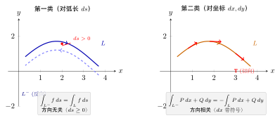
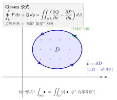
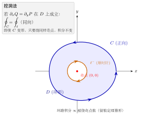
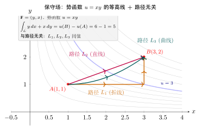
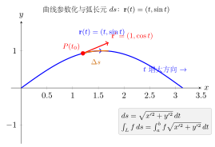
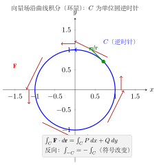

# 第20章 曲线积分

> **一例速记**：
> **第一类**（弧长型）：$\int_L f\,ds$，参数化后 $ds=\sqrt{x'^2+y'^2}\,dt$，与方向无关。
> **第二类**（坐标型）：$\int_L P\,dx+Q\,dy$，代入 $dx=x'(t)\,dt$，$dy=y'(t)\,dt$，**方向反向则结果变号**。
> **Green 公式**：$\oint_C P\,dx+Q\,dy = \iint_D(Q_x-P_y)\,dA$（$C$ 逆时针正向，$D$ 单连通）。
> **路径无关条件**：单连通区域内 $Q_x=P_y$ $\Leftrightarrow$ $P\,dx+Q\,dy$ 是全微分 $du$ $\Leftrightarrow$ 存在势函数 $u$。

---

## 引入：格林公式一步算出闭合积分

> **题目**：计算 $\oint_L (y^3-y)\,dx + (x+x^3)\,dy$，其中 $L$ 是矩形 $[0,1]\times[0,1]$ 的正向边界（逆时针）。

请先停下来想一想：闭合曲线 + 二维向量场，**Green 公式**的信号亮起，把曲线积分变成二重积分。

---

## 思维路径还原（解题者的内心独白）

> "看到 $\oint_L$（封闭曲线），$P = y^3-y$，$Q = x+x^3$。
>
> **第一步：验证 Green 条件**。$D$ 是单位正方形，单连通；$P,Q$ 在 $D$ 内有连续偏导。Green 定理可用。
>
> **第二步：计算 $Q_x - P_y$**：
>
> $$Q_x = \frac{\partial}{\partial x}(x+x^3) = 1+3x^2, \qquad P_y = \frac{\partial}{\partial y}(y^3-y) = 3y^2-1$$
>
> $$Q_x - P_y = (1+3x^2)-(3y^2-1) = 2+3x^2-3y^2$$
>
> **第三步：化为二重积分**：
>
> $$\oint_L = \iint_D (2+3x^2-3y^2)\,dA = \int_0^1\int_0^1 (2+3x^2-3y^2)\,dx\,dy$$
>
> **第四步：计算**。先对 $x$：
>
> $$\int_0^1 (2+3x^2-3y^2)\,dx = 2x+x^3-3y^2x\Big|_0^1 = 3-3y^2$$
>
> 再对 $y$：
>
> $$\int_0^1 (3-3y^2)\,dy = 3y-y^3\Big|_0^1 = 2$$
>
> **验证感觉**：若直接参数化四条边分别算，每条都有 $x$ 或 $y$ 的三次项，计算繁杂；Green 定理把它一步清零为 $2$，效率飞升。结果 $2$ 是合理的正数（区域内 $Q_x-P_y$ 平均大于零）。"

---

## 学习目标

通过本章学习，你将能够：

- 理解第一类曲线积分的定义，掌握其物理意义（曲线的质量）
- 掌握利用参数化计算第一类曲线积分的方法
- 理解第二类曲线积分的定义，掌握其物理意义（变力做功）
- 理解两类曲线积分之间的联系
- 掌握 Green 公式及其应用条件
- 理解路径无关的条件，掌握势函数的求法
- 能够运用曲线积分求解平面区域面积等实际问题

---

## 20.1 第一类曲线积分（对弧长的曲线积分）

### 20.1.1 物理背景：曲线的质量

设有一条平面曲线 $L$，其线密度为 $\rho(x, y)$（单位长度的质量）。如何求曲线的总质量？

**分割**：将曲线 $L$ 分成 $n$ 小段 $\Delta s_1, \Delta s_2, \ldots, \Delta s_n$。

**近似**：在每小段 $\Delta s_i$ 上任取一点 $(\xi_i, \eta_i)$，该小段的质量近似为 $\rho(\xi_i, \eta_i)\Delta s_i$。

**求和**：曲线的总质量近似为

$$M \approx \sum_{i=1}^{n} \rho(\xi_i, \eta_i)\Delta s_i$$

**取极限**：令分割的最大弧长 $\lambda = \max\{\Delta s_i\} \to 0$，得到

$$M = \lim_{\lambda \to 0} \sum_{i=1}^{n} \rho(\xi_i, \eta_i)\Delta s_i$$

### 20.1.2 第一类曲线积分的定义

**定义**：设 $L$ 是平面上的一条光滑曲线（或分段光滑曲线），$f(x, y)$ 是定义在 $L$ 上的有界函数。将 $L$ 任意分成 $n$ 小段，第 $i$ 段的弧长为 $\Delta s_i$，在其上任取一点 $(\xi_i, \eta_i)$，作和式

$$\sum_{i=1}^{n} f(\xi_i, \eta_i)\Delta s_i$$

如果当 $\lambda = \max\{\Delta s_i\} \to 0$ 时，此和式的极限存在且与分割方式及点的取法无关，则称此极限为 $f(x, y)$ 在曲线 $L$ 上的**第一类曲线积分**（或**对弧长的曲线积分**），记作

$$\int_L f(x, y)\,ds = \lim_{\lambda \to 0} \sum_{i=1}^{n} f(\xi_i, \eta_i)\Delta s_i$$

**存在性**：若 $f(x, y)$ 在光滑曲线 $L$ 上连续，则第一类曲线积分存在。

**性质**：

1. **线性性**：$\int_L [af + bg]\,ds = a\int_L f\,ds + b\int_L g\,ds$

2. **路径可加性**：若 $L = L_1 + L_2$，则 $\int_L f\,ds = \int_{L_1} f\,ds + \int_{L_2} f\,ds$

3. **与方向无关**：第一类曲线积分的值与曲线的方向无关

### 20.1.3 计算方法（参数化）

设曲线 $L$ 的参数方程为

$$\begin{cases} x = x(t) \\ y = y(t) \end{cases}, \quad t \in [\alpha, \beta]$$

其中 $x(t)$、$y(t)$ 具有连续导数，且 $[x'(t)]^2 + [y'(t)]^2 \neq 0$。

**弧长微元**：$ds = \sqrt{[x'(t)]^2 + [y'(t)]^2}\,dt$

**计算公式**：

$$\int_L f(x, y)\,ds = \int_\alpha^\beta f(x(t), y(t))\sqrt{[x'(t)]^2 + [y'(t)]^2}\,dt$$

**特殊情形**：

- 若曲线由 $y = y(x)$（$a \leq x \leq b$）给出，则 $ds = \sqrt{1 + [y'(x)]^2}\,dx$

$$\int_L f(x, y)\,ds = \int_a^b f(x, y(x))\sqrt{1 + [y'(x)]^2}\,dx$$

- 若曲线由极坐标 $r = r(\theta)$（$\alpha \leq \theta \leq \beta$）给出，则 $ds = \sqrt{r^2 + [r'(\theta)]^2}\,d\theta$

> **例题 20.1** 计算 $\int_L (x^2 + y^2)\,ds$，其中 $L$ 是圆周 $x^2 + y^2 = a^2$。

**解**：将圆周参数化：$x = a\cos t$，$y = a\sin t$，$t \in [0, 2\pi]$。

$$x'(t) = -a\sin t, \quad y'(t) = a\cos t$$

$$ds = \sqrt{a^2\sin^2 t + a^2\cos^2 t}\,dt = a\,dt$$

$$\int_L (x^2 + y^2)\,ds = \int_0^{2\pi} a^2 \cdot a\,dt = a^3 \int_0^{2\pi} dt = 2\pi a^3$$

> **例题 20.2** 计算 $\int_L y\,ds$，其中 $L$ 是抛物线 $y = x^2$ 从 $(0, 0)$ 到 $(1, 1)$ 的一段。

**解**：曲线由 $y = x^2$（$0 \leq x \leq 1$）给出。

$$ds = \sqrt{1 + (2x)^2}\,dx = \sqrt{1 + 4x^2}\,dx$$

$$\int_L y\,ds = \int_0^1 x^2\sqrt{1 + 4x^2}\,dx$$

令 $2x = \tan\theta$，则 $dx = \dfrac{1}{2}\sec^2\theta\,d\theta$，$\sqrt{1 + 4x^2} = \sec\theta$。

当 $x = 0$ 时 $\theta = 0$，当 $x = 1$ 时 $\theta = \arctan 2$。

$$= \int_0^{\arctan 2} \frac{\tan^2\theta}{4} \cdot \sec\theta \cdot \frac{1}{2}\sec^2\theta\,d\theta = \frac{1}{8}\int_0^{\arctan 2} \tan^2\theta\sec^3\theta\,d\theta$$

$$= \frac{1}{8}\int_0^{\arctan 2} (\sec^2\theta - 1)\sec^3\theta\,d\theta = \frac{1}{8}\int_0^{\arctan 2} (\sec^5\theta - \sec^3\theta)\,d\theta$$

利用递推公式 $\int\sec^3\theta\,d\theta = \dfrac{1}{2}(\sec\theta\tan\theta + \ln|\sec\theta+\tan\theta|)$ 与 $\int\sec^5\theta\,d\theta = \dfrac{1}{4}\sec^3\theta\tan\theta + \dfrac{3}{4}\int\sec^3\theta\,d\theta$，得

$$\int_0^{\arctan 2}(\sec^5\theta - \sec^3\theta)\,d\theta = \frac{1}{4}\sec^3\theta\tan\theta - \frac{1}{4}\cdot\frac{1}{2}(\sec\theta\tan\theta + \ln|\sec\theta+\tan\theta|)\Big|_0^{\arctan 2}$$

在 $\theta = \arctan 2$ 处 $\tan\theta = 2$，$\sec\theta = \sqrt{5}$；在 $\theta = 0$ 处 $\tan\theta = 0$，$\sec\theta = 1$，代入得

$$\int_0^{\arctan 2}(\sec^5\theta - \sec^3\theta)\,d\theta = \frac{1}{4}\cdot 10\sqrt{5} - \frac{1}{8}\left(2\sqrt{5} + \ln(2+\sqrt{5})\right) = \frac{9\sqrt{5}}{4} - \frac{\ln(2+\sqrt{5})}{8}$$

因此

$$\int_L y\,ds = \frac{1}{8}\left(\frac{9\sqrt{5}}{4} - \frac{\ln(2+\sqrt{5})}{8}\right) = \frac{9\sqrt{5}}{32} - \frac{\ln(2+\sqrt{5})}{64} = \frac{18\sqrt{5} - \ln(2+\sqrt{5})}{64}$$

---

## 20.2 第二类曲线积分（对坐标的曲线积分）

### 20.2.1 物理背景：变力做功

设质点在力场 $\mathbf{F}(x, y) = P(x, y)\mathbf{i} + Q(x, y)\mathbf{j}$ 的作用下，沿曲线 $L$ 从点 $A$ 移动到点 $B$。如何求力 $\mathbf{F}$ 所做的功？

**分割**：将曲线 $L$ 分成 $n$ 小段。

**近似**：在第 $i$ 小段上，力近似为常力 $\mathbf{F}(\xi_i, \eta_i)$，位移向量为 $(\Delta x_i, \Delta y_i)$，做功近似为

$$\Delta W_i \approx P(\xi_i, \eta_i)\Delta x_i + Q(\xi_i, \eta_i)\Delta y_i$$

**求和与取极限**：

$$W = \lim_{\lambda \to 0} \sum_{i=1}^{n} [P(\xi_i, \eta_i)\Delta x_i + Q(\xi_i, \eta_i)\Delta y_i]$$

### 20.2.2 第二类曲线积分的定义

**定义**：设 $L$ 是平面上从点 $A$ 到点 $B$ 的一条有向光滑曲线，$P(x, y)$、$Q(x, y)$ 是定义在 $L$ 上的有界函数。将 $L$ 任意分成 $n$ 小段，在第 $i$ 小段上任取一点 $(\xi_i, \eta_i)$，该小段在 $x$ 轴和 $y$ 轴上的投影分别为 $\Delta x_i$ 和 $\Delta y_i$。若极限

$$\lim_{\lambda \to 0} \sum_{i=1}^{n} P(\xi_i, \eta_i)\Delta x_i$$

存在，则称此极限为 $P(x, y)$ 在有向曲线 $L$ 上**对 $x$ 的曲线积分**，记作

$$\int_L P(x, y)\,dx$$

类似地定义 $\int_L Q(x, y)\,dy$。

**第二类曲线积分**的一般形式为：

$$\int_L P(x, y)\,dx + Q(x, y)\,dy = \int_L P\,dx + \int_L Q\,dy$$

也可写成向量形式：$\int_L \mathbf{F} \cdot d\mathbf{r}$，其中 $\mathbf{F} = (P, Q)$，$d\mathbf{r} = (dx, dy)$。

**性质**：

1. **线性性**：与第一类曲线积分类似

2. **路径可加性**：若 $L = L_1 + L_2$，则积分可加

3. **方向相关性**：若 $L^-$ 表示与 $L$ 方向相反的曲线，则
   $$\int_{L^-} P\,dx + Q\,dy = -\int_L P\,dx + Q\,dy$$

### 20.2.3 计算方法

设有向曲线 $L$ 的参数方程为 $x = x(t)$，$y = y(t)$，$t$ 从 $\alpha$ 变到 $\beta$（$\alpha < \beta$ 或 $\alpha > \beta$，取决于曲线方向）。

**计算公式**：

$$\int_L P\,dx + Q\,dy = \int_\alpha^\beta [P(x(t), y(t))x'(t) + Q(x(t), y(t))y'(t)]\,dt$$

> **例题 20.3** 计算 $\int_L y\,dx + x\,dy$，其中 $L$ 是从点 $(0, 0)$ 沿抛物线 $y = x^2$ 到点 $(1, 1)$。

**解**：以 $x$ 为参数，$y = x^2$，$x$ 从 $0$ 变到 $1$。

$$dy = 2x\,dx$$

$$\int_L y\,dx + x\,dy = \int_0^1 [x^2 + x \cdot 2x]\,dx = \int_0^1 3x^2\,dx = x^3\Big|_0^1 = 1$$

> **例题 20.4** 计算 $\int_L y\,dx + x\,dy$，其中 $L$ 是从点 $(0, 0)$ 沿直线 $y = x$ 到点 $(1, 1)$。

**解**：以 $x$ 为参数，$y = x$，$dy = dx$。

$$\int_L y\,dx + x\,dy = \int_0^1 [x + x]\,dx = \int_0^1 2x\,dx = x^2\Big|_0^1 = 1$$

**观察**：例题 20.3 和 20.4 中，沿不同路径但积分值相同，这与路径无关性有关（见 20.4 节）。



### 20.2.4 两类曲线积分的关系

设有向曲线 $L$ 在点 $(x, y)$ 处的单位切向量为 $\mathbf{T} = (\cos\alpha, \cos\beta)$，则

$$dx = \cos\alpha\,ds, \quad dy = \cos\beta\,ds$$

因此

$$\int_L P\,dx + Q\,dy = \int_L (P\cos\alpha + Q\cos\beta)\,ds$$

这表明第二类曲线积分可以化为第一类曲线积分。

---

## 20.3 Green 公式



### 20.3.1 公式陈述

**Green 公式**将平面区域上的二重积分与其边界曲线上的曲线积分联系起来。

**定理**（Green 公式）：设 $D$ 是平面上由分段光滑曲线 $L$ 围成的有界闭区域，函数 $P(x, y)$、$Q(x, y)$ 在 $D$ 上具有连续的一阶偏导数，则

$$\iint_D \left(\frac{\partial Q}{\partial x} - \frac{\partial P}{\partial y}\right) dx\,dy = \oint_L P\,dx + Q\,dy$$

其中 $L$ 取**正向**，即沿 $L$ 行走时区域 $D$ 始终在左侧（逆时针方向）。

### 20.3.2 证明思路

对于简单区域（既是 X-型又是 Y-型），分别证明：

$$\iint_D \frac{\partial P}{\partial y}\,dx\,dy = -\oint_L P\,dx$$

$$\iint_D \frac{\partial Q}{\partial x}\,dx\,dy = \oint_L Q\,dy$$

两式相减即得 Green 公式。

**第一个等式的证明**：设 $D = \{(x, y) \mid a \leq x \leq b, \, \varphi_1(x) \leq y \leq \varphi_2(x)\}$。

$$\iint_D \frac{\partial P}{\partial y}\,dx\,dy = \int_a^b dx \int_{\varphi_1(x)}^{\varphi_2(x)} \frac{\partial P}{\partial y}\,dy = \int_a^b [P(x, \varphi_2(x)) - P(x, \varphi_1(x))]\,dx$$

而 $\oint_L P\,dx$ 分为上下两段：

- 下边界 $L_1$：$y = \varphi_1(x)$，$x$ 从 $a$ 到 $b$，贡献 $\int_a^b P(x, \varphi_1(x))\,dx$
- 上边界 $L_2$：$y = \varphi_2(x)$，$x$ 从 $b$ 到 $a$（正向），贡献 $\int_b^a P(x, \varphi_2(x))\,dx = -\int_a^b P(x, \varphi_2(x))\,dx$

故 $\oint_L P\,dx = \int_a^b P(x, \varphi_1(x))\,dx - \int_a^b P(x, \varphi_2(x))\,dx = -\iint_D \frac{\partial P}{\partial y}\,dx\,dy$

### 20.3.3 应用条件

Green 公式要求：

1. **区域 $D$ 有界**，边界 $L$ 是分段光滑的闭曲线
2. **$P$、$Q$ 在 $D$（含边界）上有连续偏导数**
3. **$L$ 取正向**

**单连通区域**：区域内无"洞"，任何闭曲线都可以连续收缩为一点。

**复连通区域**：区域内有"洞"。此时需要引入割线将其化为单连通区域，或将积分分解到各边界上。

> **例题 20.5** 利用 Green 公式计算 $\oint_L (x^2 - y)\,dx + (y^2 + x)\,dy$，其中 $L$ 是圆周 $x^2 + y^2 = 1$ 的正向。

**解**：$P = x^2 - y$，$Q = y^2 + x$。

$$\frac{\partial Q}{\partial x} = 1, \quad \frac{\partial P}{\partial y} = -1$$

$$\frac{\partial Q}{\partial x} - \frac{\partial P}{\partial y} = 1 - (-1) = 2$$

由 Green 公式：

$$\oint_L (x^2 - y)\,dx + (y^2 + x)\,dy = \iint_D 2\,dx\,dy = 2 \cdot \pi \cdot 1^2 = 2\pi$$

### 20.3.4 利用 Green 公式计算面积

取 $P = -y$，$Q = x$，则 $\dfrac{\partial Q}{\partial x} - \dfrac{\partial P}{\partial y} = 1 + 1 = 2$。

由 Green 公式：

$$\iint_D 2\,dx\,dy = \oint_L -y\,dx + x\,dy$$

故**平面区域的面积**为：

$$S = \frac{1}{2}\oint_L x\,dy - y\,dx$$

> **例题 20.6** 求椭圆 $\dfrac{x^2}{a^2} + \dfrac{y^2}{b^2} = 1$ 围成区域的面积。

**解**：椭圆的参数方程为 $x = a\cos t$，$y = b\sin t$，$t \in [0, 2\pi]$（正向）。

$$S = \frac{1}{2}\oint_L x\,dy - y\,dx = \frac{1}{2}\int_0^{2\pi} [a\cos t \cdot b\cos t - b\sin t \cdot (-a\sin t)]\,dt$$

$$= \frac{1}{2}\int_0^{2\pi} ab(\cos^2 t + \sin^2 t)\,dt = \frac{ab}{2}\int_0^{2\pi} 1\,dt = \pi ab$$



### 20.3.5 多连通区域的 Green 公式

前面讨论的 Green 公式适用于单连通区域（无"洞"的区域）。对于**多连通区域**（有一个或多个洞的区域），需要将公式作适当推广。

**多连通区域的 Green 公式**：设 $D$ 是由外边界 $L_0$（正向，逆时针）和内边界 $L_1, L_2, \ldots, L_k$（正向，**顺时针**，即使区域 $D$ 始终在边界的左侧）所围成的多连通区域。若 $P$、$Q$ 在 $D$（含所有边界）上有连续的一阶偏导数，则

$$\iint_D \left(\frac{\partial Q}{\partial x} - \frac{\partial P}{\partial y}\right) dx\,dy = \oint_{L_0} P\,dx + Q\,dy + \sum_{i=1}^{k} \oint_{L_i} P\,dx + Q\,dy$$

其中所有边界曲线都取**正向**（区域 $D$ 在边界的左侧）。

**注意**：对于多连通区域的正向规定——外边界取逆时针方向，内边界取顺时针方向。

**割线法（挖洞法）的基本思想**：

当被积函数 $P$、$Q$ 在区域的"洞"内（即某个内边界包围的区域内）不满足条件（例如存在奇点）时，不能直接对整个区域应用 Green 公式。此时可用**割线法**：

1. 在区域内作一条（或多条）割线，连接外边界和内边界，将多连通区域切割为单连通区域
2. 对切割后的单连通区域应用 Green 公式
3. 由于割线被经过了两次（方向相反），其上的积分互相抵消

等价地，可以用另一种直观的方法：**挖洞法**。在奇点周围作一个包含奇点的小闭曲线 $l$（通常取以奇点为圆心的小圆），利用 Green 公式将原积分转化为在这个小曲线上的积分。

**几何直观**：割线法的实质是将多连通区域的"洞"用割线"缝合"，使之变为单连通区域，从而可以使用标准的 Green 公式。

> **例题 20.7** 计算 $\oint_C \dfrac{-y\,dx + x\,dy}{x^2+y^2}$，其中 $C$ 是包围原点的任意一条正向简单闭曲线。

**解**：设 $P = \dfrac{-y}{x^2+y^2}$，$Q = \dfrac{x}{x^2+y^2}$。

首先验证：当 $(x,y) \neq (0,0)$ 时，

$$\frac{\partial P}{\partial y} = \frac{-(x^2+y^2) + y \cdot 2y}{(x^2+y^2)^2} = \frac{y^2 - x^2}{(x^2+y^2)^2}$$

$$\frac{\partial Q}{\partial x} = \frac{(x^2+y^2) - x \cdot 2x}{(x^2+y^2)^2} = \frac{y^2 - x^2}{(x^2+y^2)^2}$$

故 $\dfrac{\partial Q}{\partial x} = \dfrac{\partial P}{\partial y}$（在原点之外）。

但 $P$、$Q$ 在原点没有定义（奇点），不能直接对 $C$ 围成的区域应用 Green 公式得出积分为零的结论。

**挖洞法**：以原点为圆心，取充分小的圆 $l: x^2 + y^2 = \varepsilon^2$（$\varepsilon > 0$ 足够小使 $l$ 完全在 $C$ 内部），取**顺时针方向**（即 $l$ 的正向，使环形区域 $D$ 在边界左侧）。

在环形区域 $D$（$C$ 与 $l$ 之间的区域）上，$P$、$Q$ 有连续偏导数且 $\dfrac{\partial Q}{\partial x} - \dfrac{\partial P}{\partial y} = 0$。

由多连通区域的 Green 公式：

$$0 = \iint_D 0\,dx\,dy = \oint_C P\,dx + Q\,dy + \oint_{l^-} P\,dx + Q\,dy$$

其中 $l^-$ 表示 $l$ 取顺时针方向。因此

$$\oint_C P\,dx + Q\,dy = -\oint_{l^-} P\,dx + Q\,dy = \oint_l P\,dx + Q\,dy$$

其中 $l$ 取逆时针方向。

现在计算小圆 $l$ 上的积分。将 $l$ 参数化为 $x = \varepsilon\cos t$，$y = \varepsilon\sin t$，$t$ 从 $0$ 到 $2\pi$（逆时针）：

$$dx = -\varepsilon\sin t\,dt, \quad dy = \varepsilon\cos t\,dt$$

$$P = \frac{-\varepsilon\sin t}{\varepsilon^2} = \frac{-\sin t}{\varepsilon}, \quad Q = \frac{\varepsilon\cos t}{\varepsilon^2} = \frac{\cos t}{\varepsilon}$$

$$\oint_l P\,dx + Q\,dy = \int_0^{2\pi} \left[\frac{-\sin t}{\varepsilon} \cdot (-\varepsilon\sin t) + \frac{\cos t}{\varepsilon} \cdot \varepsilon\cos t\right] dt$$

$$= \int_0^{2\pi} (\sin^2 t + \cos^2 t)\,dt = \int_0^{2\pi} 1\,dt = 2\pi$$

因此

$$\oint_C \frac{-y\,dx + x\,dy}{x^2+y^2} = 2\pi$$

**注**：此结果与 $C$ 的具体形状无关，只要 $C$ 包围原点。这是因为 $P\,dx + Q\,dy$ 在原点之外满足 $\dfrac{\partial Q}{\partial x} = \dfrac{\partial P}{\partial y}$，故在不包含原点的区域内，积分与路径无关。但若 $C$ 不包围原点，则 $C$ 围成的区域内处处有 $\dfrac{\partial Q}{\partial x} - \dfrac{\partial P}{\partial y} = 0$，由 Green 公式直接得到积分值为 $0$。

从势函数的角度看，$\dfrac{-y\,dx + x\,dy}{x^2+y^2} = d(\arctan\dfrac{y}{x})$，而 $\arctan\dfrac{y}{x}$ 是多值函数（辐角函数），沿包围原点的闭曲线绕一圈后增加 $2\pi$，这正是积分值 $2\pi$ 的来源。 $\square$

---

### 20.3.6 曲线积分运算规则体系（完整推导）

本章已介绍了第一类、第二类曲线积分的定义、参数化计算法、Green 公式等。本节系统、不跳步地补全所有运算规则的推导，包括两类积分之间的转换、参数化公式的来源、Green 公式的完整两步证明、与方向相关的化简等。

#### 全景导览

```
第 0 层：Riemann 和 + 极限
   ↓
第 1 层（基本性质）：线性 / 路径可加 / 方向（仅第二类）
   ↓
第 2 层（化为一元定积分）：参数化公式
   - 第一类：ds = √(x'² + y'²) dt
   - 第二类：dx = x'(t)dt, dy = y'(t)dt
   ↓
第 3 层（两类关系）：第二类 = ∫(P cosα + Q cosβ) ds
   ↓
第 4 层（区域-边界对偶）：Green 公式（连接二重积分与第二类曲线积分）
   ↓
第 5 层（路径无关）：保守场、势函数、全微分
```

下面逐条不跳步推导。

---

#### 规则 1：第一类曲线积分的参数化公式（不跳步推导）

**定理**：设光滑曲线 $L$ 的参数方程为 $x = x(t), y = y(t)$，$t\in[\alpha,\beta]$，$f$ 在 $L$ 上连续，则

$$\int_L f(x,y)\,ds = \int_\alpha^\beta f(x(t),y(t))\sqrt{[x'(t)]^2 + [y'(t)]^2}\,dt.$$

**完整推导**：

**第一步**（分割对应）：取 $[\alpha,\beta]$ 的分割 $\alpha = t_0 < t_1 < \cdots < t_n = \beta$。每段 $[t_{i-1}, t_i]$ 对应曲线上一段弧 $\Delta s_i$。

**第二步**（弧长微元的来源）：从 $t_{i-1}$ 到 $t_i$ 一段弧的长度为
$$\Delta s_i = \int_{t_{i-1}}^{t_i}\sqrt{[x'(t)]^2 + [y'(t)]^2}\,dt.$$

由积分中值定理，存在 $\tau_i\in[t_{i-1}, t_i]$ 使
$$\Delta s_i = \sqrt{[x'(\tau_i)]^2 + [y'(\tau_i)]^2}\cdot \Delta t_i.$$

**第三步**（样本点选取）：在第 $i$ 段弧上取样本点 $(\xi_i, \eta_i) = (x(\tau_i), y(\tau_i))$。

**第四步**（Riemann 和改写）：
$$\sum_i f(\xi_i,\eta_i)\Delta s_i = \sum_i f(x(\tau_i), y(\tau_i))\sqrt{[x'(\tau_i)]^2 + [y'(\tau_i)]^2}\,\Delta t_i.$$

**第五步**（识别为一元 Riemann 和并取极限）：右端正是函数
$$g(t) := f(x(t), y(t))\sqrt{[x'(t)]^2 + [y'(t)]^2}$$
在 $[\alpha,\beta]$ 上的一元 Riemann 和。$f, x', y'$ 连续 $\Rightarrow g$ 连续 $\Rightarrow$ 可积。取 $\max\Delta t_i\to 0$：
$$\int_L f\,ds = \int_\alpha^\beta g(t)\,dt.\quad\square$$

#### 弧长微元 $ds = \sqrt{x'^2 + y'^2}\,dt$ 的几何起源

考察两点 $(x(t), y(t))$ 与 $(x(t+dt), y(t+dt))$ 之间的"直线距离"（一阶近似为弧长）：

$$ds^2 \approx (dx)^2 + (dy)^2 = [x'(t)\,dt]^2 + [y'(t)\,dt]^2 = ([x']^2 + [y']^2)\,dt^2.$$

开方得 $ds = \sqrt{[x']^2 + [y']^2}\,dt$。这正是 Pythagoras 定理在微分意义下的应用。

---

#### 规则 2：第一类曲线积分与方向无关的严格证明

**定理**：设 $L$ 为一条光滑曲线，$L^-$ 为 $L$ 的反向。则
$$\int_{L^-} f\,ds = \int_L f\,ds.$$

**推导**：

**第一步**：设 $L$ 用 $t\in[\alpha,\beta]$ 参数化为 $(x(t), y(t))$。

**第二步**：$L^-$ 可用 $s = \alpha + \beta - t$ 反向参数化为 $(x(\alpha+\beta-s), y(\alpha+\beta-s))$，$s\in[\alpha,\beta]$。

**第三步**（计算反向弧长微元）：记 $\tilde x(s) = x(\alpha+\beta-s)$，链式法则 $\tilde x'(s) = -x'(\alpha+\beta-s)$，同理 $\tilde y'(s) = -y'(\alpha+\beta-s)$。故
$$\sqrt{\tilde x'^2 + \tilde y'^2} = \sqrt{x'^2 + y'^2}\quad(\text{平方消去负号}).$$

**第四步**（积分换元 $u = \alpha+\beta-s$）：
$$\int_{L^-}f\,ds = \int_\alpha^\beta f(\tilde x(s),\tilde y(s))\sqrt{\tilde x'^2 + \tilde y'^2}\,ds = \int_\alpha^\beta f(x(u),y(u))\sqrt{x'^2 + y'^2}\,du = \int_L f\,ds.\quad\square$$

**关键**：弧长微元 $\sqrt{x'^2+y'^2}$ **取平方根**——所以反向时的负号被消去；这是第一类积分"与方向无关"的根本原因。

---

#### 规则 3：第二类曲线积分的参数化公式

**定理**：设有向光滑曲线 $L$ 的参数方程为 $x = x(t), y = y(t)$，$t$ 从 $\alpha$ 单调变到 $\beta$（按 $L$ 的方向），$P, Q$ 在 $L$ 上连续，则
$$\int_L P\,dx + Q\,dy = \int_\alpha^\beta [P(x(t),y(t))\,x'(t) + Q(x(t),y(t))\,y'(t)]\,dt.$$

**不跳步推导**：

**第一步**（拆分）：分别对 $\int_L P\,dx$ 和 $\int_L Q\,dy$ 处理，再相加。

**第二步**（$\int_L P\,dx$ 的 Riemann 和）：取 $[\alpha,\beta]$ 分割 $\{t_i\}$，相应曲线上分段。第 $i$ 段在 $x$ 轴上投影为
$$\Delta x_i = x(t_i) - x(t_{i-1}).$$

由中值定理（$x(t)$ 可导），存在 $\tau_i\in[t_{i-1}, t_i]$ 使
$$\Delta x_i = x'(\tau_i)\,\Delta t_i.$$

**第三步**（取样本点 $(\xi_i,\eta_i) = (x(\tau_i), y(\tau_i))$）：
$$\sum_i P(\xi_i,\eta_i)\Delta x_i = \sum_i P(x(\tau_i),y(\tau_i))\,x'(\tau_i)\,\Delta t_i.$$

**第四步**（识别一元 Riemann 和 + 取极限）：右端是函数 $t\mapsto P(x(t),y(t))\,x'(t)$ 在 $[\alpha,\beta]$ 的 Riemann 和。连续可积，故
$$\int_L P\,dx = \int_\alpha^\beta P(x(t),y(t))\,x'(t)\,dt.$$

同理 $\int_L Q\,dy = \int_\alpha^\beta Q\,y'(t)\,dt$。相加即得公式。$\square$

**与方向的关系**：若 $L$ 反向，则 $t$ 从 $\beta$ 变到 $\alpha$。由定积分定义 $\int_\beta^\alpha = -\int_\alpha^\beta$，故 $\int_{L^-}P\,dx = -\int_L P\,dx$——这就是**第二类积分与方向相关**的根本原因。

> **第一类 vs 第二类的根本差别**：弧长微元 $ds = \sqrt{x'^2+y'^2}\,dt$ 始终非负（开平方），故方向无关；坐标微元 $dx = x'(t)\,dt$ 带符号（$x'$ 的符号即方向），故方向相关。

---

#### 规则 4：两类曲线积分的转换公式

**定理**：设 $L$ 为有向光滑曲线，单位切向量为 $\mathbf{T} = (\cos\alpha, \cos\beta)$（沿 $L$ 方向）。则
$$\int_L P\,dx + Q\,dy = \int_L (P\cos\alpha + Q\cos\beta)\,ds.$$

**完整推导**：

**第一步**（参数化下表示切向量）：在 $t$ 处切向量为 $(x'(t), y'(t))$，其模长 $\sqrt{x'^2+y'^2}$。故**单位切向量**：
$$\mathbf{T} = \left(\frac{x'(t)}{\sqrt{x'^2+y'^2}},\,\frac{y'(t)}{\sqrt{x'^2+y'^2}}\right) = (\cos\alpha, \cos\beta).$$

**第二步**（导出 $dx, dy$ 与 $ds$ 的关系）：$ds = \sqrt{x'^2+y'^2}\,dt$，故
$$dx = x'(t)\,dt = \cos\alpha\cdot \sqrt{x'^2+y'^2}\,dt = \cos\alpha\,ds.$$
同理 $dy = \cos\beta\,ds$。

**第三步**（直接代入）：
$$\int_L P\,dx + Q\,dy = \int_L P\cos\alpha\,ds + Q\cos\beta\,ds = \int_L(P\cos\alpha + Q\cos\beta)\,ds.\quad\square$$

> **应用**：转换为第一类积分后，可用第一类积分的对称性化简（例如周期性、轮换性）。

---

#### 规则 5：Green 公式的完整两步证明

**定理**：设 $D$ 是由分段光滑闭曲线 $L$（正向）围成的有界闭区域，$P, Q\in C^1$ 在 $D\cup L$ 上，则
$$\oint_L P\,dx + Q\,dy = \iint_D\left(\frac{\partial Q}{\partial x} - \frac{\partial P}{\partial y}\right)dx\,dy.$$

**不跳步证明**（X-型 + Y-型简单区域）：

##### A 部分：证明 $\displaystyle\iint_D\frac{\partial P}{\partial y}\,dx\,dy = -\oint_L P\,dx$

**第一步**（设 X-型区域）：$D = \{(x,y): a\le x\le b, \varphi_1(x)\le y\le\varphi_2(x)\}$。

**第二步**（Fubini 化为累次积分）：
$$\iint_D\frac{\partial P}{\partial y}\,dx\,dy = \int_a^b\left[\int_{\varphi_1(x)}^{\varphi_2(x)}\frac{\partial P}{\partial y}\,dy\right]dx.$$

**第三步**（内层用 N-L 公式）：$\dfrac{\partial P}{\partial y}$ 对 $y$ 的原函数即 $P$ 本身：
$$\int_{\varphi_1(x)}^{\varphi_2(x)}\frac{\partial P}{\partial y}\,dy = P(x,\varphi_2(x)) - P(x,\varphi_1(x)).$$

**第四步**（代回）：
$$\iint_D\frac{\partial P}{\partial y}\,dx\,dy = \int_a^b P(x,\varphi_2(x))\,dx - \int_a^b P(x,\varphi_1(x))\,dx.\quad(\star)$$

**第五步**（计算 $\oint_L P\,dx$）：边界 $L$ 由四段构成（正向 = 逆时针）：
- $L_1$：下边界 $y=\varphi_1(x)$，$x: a\to b$；
- $L_2$：右垂直边界 $x = b$，$y$ 变化（但 $dx = 0$，对 $\int P\,dx$ 无贡献）；
- $L_3$：上边界 $y=\varphi_2(x)$，$x: b\to a$（注意方向反！）；
- $L_4$：左垂直边界 $x = a$，$dx = 0$，无贡献。

故
$$\oint_L P\,dx = \int_a^b P(x,\varphi_1(x))\,dx + \int_b^a P(x,\varphi_2(x))\,dx = \int_a^b P(x,\varphi_1(x))\,dx - \int_a^b P(x,\varphi_2(x))\,dx.$$

**第六步**（与 ($\star$) 对比）：
$$\oint_L P\,dx = -\iint_D \frac{\partial P}{\partial y}\,dx\,dy.\quad\square_A$$

##### B 部分：证明 $\displaystyle\iint_D\frac{\partial Q}{\partial x}\,dx\,dy = \oint_L Q\,dy$

**第一步**（设 Y-型区域）：$D = \{(x,y): c\le y\le d, \psi_1(y)\le x\le\psi_2(y)\}$。

**第二步**（Fubini）：
$$\iint_D\frac{\partial Q}{\partial x}\,dx\,dy = \int_c^d\left[\int_{\psi_1(y)}^{\psi_2(y)}\frac{\partial Q}{\partial x}\,dx\right]dy = \int_c^d[Q(\psi_2(y),y) - Q(\psi_1(y),y)]\,dy.$$

**第三步**（边界曲线积分）：边界包含左右两段（$dy$ 非零部分）：
- 右边界 $x=\psi_2(y)$，$y: c\to d$（正向上行）；
- 左边界 $x=\psi_1(y)$，$y: d\to c$（正向下行）。

$$\oint_L Q\,dy = \int_c^d Q(\psi_2(y),y)\,dy + \int_d^c Q(\psi_1(y),y)\,dy = \int_c^d[Q(\psi_2(y),y) - Q(\psi_1(y),y)]\,dy.$$

**第四步**（对比）：
$$\oint_L Q\,dy = \iint_D\frac{\partial Q}{\partial x}\,dx\,dy.\quad\square_B$$

##### 合并 A + B

$$\oint_L P\,dx + Q\,dy = -\iint_D\frac{\partial P}{\partial y}\,dx\,dy + \iint_D\frac{\partial Q}{\partial x}\,dx\,dy = \iint_D\left(\frac{\partial Q}{\partial x} - \frac{\partial P}{\partial y}\right)dx\,dy.\quad\square$$

#### 推广：一般区域

对既非 X-型又非 Y-型的复杂区域，用**区域可加性**——将 $D$ 拆为若干同时是 X-型与 Y-型的简单子区域，分别应用 Green 公式。子区域间的公共边界被经过两次（方向相反），积分相互抵消，最终只剩外边界的贡献。$\square$

---

#### 规则 6：Green 公式的"挖洞"推广（多连通区域）

**问题**：$P, Q$ 在 $D$ 内某些点（"奇点"）不满足 $C^1$ 条件，Green 公式不能直接用。

**挖洞法的不跳步推导**：

**第一步**（构造环形区域）：设奇点 $z_0$ 在 $C$ 内部。以 $z_0$ 为圆心作小圆 $l$（半径 $\varepsilon$），使 $l$ 完全包含于 $C$ 内部。环形区域 $D = C$ 内部 $\setminus l$ 内部。

**第二步**（应用 Green 于环形 $D$）：环形边界由外 $C$（正向逆时针）+ 内 $l$（正向**顺时针**，使 $D$ 在左侧）组成。$P, Q$ 在 $D$（不含奇点）上 $C^1$：
$$\iint_D\left(\frac{\partial Q}{\partial x} - \frac{\partial P}{\partial y}\right)dx\,dy = \oint_C P\,dx + Q\,dy + \oint_{l^-} P\,dx + Q\,dy.$$

**第三步**（特殊情形 $Q_x - P_y\equiv 0$）：环形上二重积分为 $0$：
$$0 = \oint_C P\,dx + Q\,dy - \oint_l P\,dx + Q\,dy,$$

故 $\oint_C = \oint_l$。

**结论**：**当 $Q_x = P_y$ 在奇点外处处成立时，环路积分值只依赖于"被绕进的奇点数"**——这正是辐角函数 $\arctan(y/x)$ 沿绕原点闭路增加 $2\pi$ 的根本原因，也是复分析中**留数定理**的雏形。

---

#### 规则 7：路径无关的四等价条件——完整推导

**定理**：设 $D$ 单连通，$P, Q\in C^1(D)$。下列四条件等价：

1. $\int_L P\,dx + Q\,dy$ 路径无关。
2. 任意闭曲线 $C\subset D$ 上 $\oint_C = 0$。
3. $\dfrac{\partial Q}{\partial x} = \dfrac{\partial P}{\partial y}$ 在 $D$ 上处处成立。
4. 存在 $u\in C^2(D)$ 使 $du = P\,dx + Q\,dy$。

**循环证明**（$(1)\Rightarrow(2)\Rightarrow(3)\Rightarrow(4)\Rightarrow(1)$）：

**(1) ⇒ (2)**：取闭曲线 $C$ 上两点 $A, B$，将 $C$ 看作 $A\to B$ 两条不同路径 $L_1, L_2$ 的合并（$L_2$ 反向）：$\oint_C = \int_{L_1} - \int_{L_2} = 0$（路径无关）。$\square$

**(2) ⇒ (3)**：反证。若某点 $P_0$ 处 $Q_x - P_y \neq 0$（不妨设 $> 0$），由连续性，存在 $P_0$ 的小邻域 $U$ 上 $Q_x - P_y > 0$。取 $\partial U$ 为正向闭曲线：
$$\oint_{\partial U} P\,dx + Q\,dy = \iint_U(Q_x - P_y)\,dx\,dy > 0,$$
与 (2) 矛盾。$\square$

**(3) ⇒ (4)**：构造势函数。固定 $(x_0,y_0)\in D$，对任意 $(x,y)\in D$，定义
$$u(x,y) := \int_{(x_0,y_0)}^{(x,y)}P\,dx + Q\,dy,$$
积分沿**任意路径**（这里我们要证明路径无关，但暂时取一条折线路径 → 沿 $x$ 方向到 $(x,y_0)$，再沿 $y$ 方向到 $(x,y)$）：
$$u(x,y) = \int_{x_0}^x P(s,y_0)\,ds + \int_{y_0}^y Q(x,s)\,ds.$$

**求偏导**：
- 对 $y$：第一项不依赖 $y$，导数为 $0$；第二项用变上限积分求导，得 $Q(x,y)$。故 $\dfrac{\partial u}{\partial y} = Q$。✓
- 对 $x$：用 (3) 与 Leibniz 法则；第一项导数 $P(x,y_0)$，第二项 $\int_{y_0}^y \dfrac{\partial Q}{\partial x}\,ds = \int_{y_0}^y \dfrac{\partial P}{\partial y}\,ds = P(x,y) - P(x,y_0)$。合计 $P(x,y_0) + P(x,y) - P(x,y_0) = P(x,y)$。✓

故 $du = P\,dx + Q\,dy$。$\square$

**(4) ⇒ (1)**：若 $du = P\,dx + Q\,dy$，则
$$\int_L P\,dx + Q\,dy = \int_L du = u(B) - u(A),$$
仅依赖端点。$\square$

> **本节核心洞察**：**在单连通区域上，$Q_x = P_y$ 是势函数存在的充要条件**——这正是物理中"保守力⇔有势函数"的数学根据；在场论里被推广为 Poincaré 引理。

---

#### 规则 8：势函数求法的两种等价路线

(a) **折线法**：$u(x,y) = \int_{x_0}^x P(s,y_0)\,ds + \int_{y_0}^y Q(x,s)\,ds$（推导见 (3)⇒(4)）。

(b) **不定积分法**（与折线法等价）：

**第一步**：由 $u_x = P$，对 $x$ 不定积分得 $u(x,y) = \int P(x,y)\,dx + \varphi(y)$，$\varphi$ 待定。

**第二步**：对 $y$ 求偏导：$u_y = \int P_y\,dx + \varphi'(y) = Q$。由 (3) 知 $P_y = Q_x$，故 $\int P_y\,dx = \int Q_x\,dx + C(y)$。

**第三步**：解出 $\varphi'(y)$，再积分得 $\varphi(y)$。$\square$

**两路线等价性**：折线法对应"先在 $x$ 方向积满 $P$，再在 $y$ 方向积 $Q$"；不定积分法以同样的累积顺序整理代数表达式。

---

#### 20.3.6 末：曲线积分计算的决策树

```
看到 ∫_L 形式
   ↓
是 ∫_L f ds（弧长型）还是 ∫_L Pdx+Qdy（坐标型）?
   ↓
==【第一类】================
   • 参数化 → ds = √(x'² + y'²) dt → 一元定积分
   • 方向无关 → 可任意选参数化方向
   • 周期/对称 → 用第一类的对称性化简
==【第二类】================
   • 闭曲线 + P, Q 平面有 C¹ → Green 公式
       Q_x - P_y = 0 → 直接 0（路径无关）
       否则 → 化为二重积分
   • 非闭路径 + Q_x = P_y → 求势函数 u → u(B) - u(A)
   • 非闭路径 + 一般 → 参数化 + 一元积分
   • 闭曲线 + 内部含奇点 → 挖洞法（绕奇点小圆替代）
   • 形式有对称结构 → 转为第一类（cosα ds, cosβ ds）再化简
```

---

## 20.4 路径无关与保守场

### 20.4.1 路径无关的概念

**定义**：设 $D$ 是平面上的一个区域，$P(x, y)$、$Q(x, y)$ 在 $D$ 内有定义。如果对于 $D$ 内任意两点 $A$、$B$，曲线积分 $\int_L P\,dx + Q\,dy$ 的值只与 $A$、$B$ 的位置有关，而与连接 $A$、$B$ 的路径 $L$（在 $D$ 内）无关，则称该曲线积分在 $D$ 内**与路径无关**。

### 20.4.2 路径无关的等价条件

**定理**：设 $D$ 是平面上的**单连通区域**，$P(x, y)$、$Q(x, y)$ 在 $D$ 内有连续的一阶偏导数，则以下四个条件等价：

1. $\int_L P\,dx + Q\,dy$ 在 $D$ 内与路径无关

2. 对 $D$ 内任意闭曲线 $C$，$\oint_C P\,dx + Q\,dy = 0$

3. 在 $D$ 内处处有 $\dfrac{\partial Q}{\partial x} = \dfrac{\partial P}{\partial y}$

4. 存在函数 $u(x, y)$ 使得 $du = P\,dx + Q\,dy$（即 $P\,dx + Q\,dy$ 是**全微分**）

**证明要点**：

- $(1) \Leftrightarrow (2)$：由定义直接可得
- $(2) \Leftrightarrow (3)$：由 Green 公式
- $(3) \Leftrightarrow (4)$：$du = P\,dx + Q\,dy$ 意味着 $\dfrac{\partial u}{\partial x} = P$，$\dfrac{\partial u}{\partial y} = Q$，故 $\dfrac{\partial P}{\partial y} = \dfrac{\partial^2 u}{\partial y\partial x} = \dfrac{\partial^2 u}{\partial x\partial y} = \dfrac{\partial Q}{\partial x}$



### 20.4.3 势函数

**定义**：若 $P\,dx + Q\,dy = du$，即 $\dfrac{\partial u}{\partial x} = P$，$\dfrac{\partial u}{\partial y} = Q$，则称 $u(x, y)$ 为向量场 $\mathbf{F} = (P, Q)$ 的**势函数**（或原函数）。此时向量场 $\mathbf{F}$ 称为**保守场**（或有势场）。

**势函数的求法**：

**方法一（折线法）**：利用

$$u(x, y) = \int_{(x_0, y_0)}^{(x, y)} P\,dx + Q\,dy$$

选择方便的路径（如先沿 $x$ 方向，再沿 $y$ 方向）。

**方法二（不定积分法）**：

1. 由 $\dfrac{\partial u}{\partial x} = P$，得 $u = \int P\,dx + \varphi(y)$（对 $x$ 积分，$\varphi(y)$ 待定）

2. 对上式关于 $y$ 求偏导，令其等于 $Q$，解出 $\varphi(y)$

> **例题 20.8** 验证 $(2x + y)\,dx + (x + 2y)\,dy$ 是全微分，并求其势函数。

**解**：$P = 2x + y$，$Q = x + 2y$。

$$\frac{\partial P}{\partial y} = 1, \quad \frac{\partial Q}{\partial x} = 1$$

由于 $\dfrac{\partial P}{\partial y} = \dfrac{\partial Q}{\partial x}$，故 $P\,dx + Q\,dy$ 是全微分。

**求势函数**：

由 $\dfrac{\partial u}{\partial x} = 2x + y$，得

$$u = \int (2x + y)\,dx = x^2 + xy + \varphi(y)$$

对 $y$ 求偏导：

$$\frac{\partial u}{\partial y} = x + \varphi'(y) = Q = x + 2y$$

故 $\varphi'(y) = 2y$，$\varphi(y) = y^2 + C$。

因此势函数为 $u(x, y) = x^2 + xy + y^2 + C$。

### 20.4.4 全微分方程的求解

**全微分方程**：形如 $P(x, y)\,dx + Q(x, y)\,dy = 0$ 的方程，若 $P\,dx + Q\,dy$ 是全微分，则称为全微分方程（或恰当方程）。

**解法**：若 $du = P\,dx + Q\,dy$，则方程变为 $du = 0$，其通解为 $u(x, y) = C$。

> **例题 20.9** 解方程 $(3x^2 + 6xy^2)\,dx + (6x^2y + 4y^3)\,dy = 0$。

**解**：$P = 3x^2 + 6xy^2$，$Q = 6x^2y + 4y^3$。

$$\frac{\partial P}{\partial y} = 12xy, \quad \frac{\partial Q}{\partial x} = 12xy$$

验证：$\dfrac{\partial P}{\partial y} = \dfrac{\partial Q}{\partial x}$，故为全微分方程。

求势函数：

$$u = \int P\,dx = \int (3x^2 + 6xy^2)\,dx = x^3 + 3x^2y^2 + \varphi(y)$$

$$\frac{\partial u}{\partial y} = 6x^2y + \varphi'(y) = Q = 6x^2y + 4y^3$$

故 $\varphi'(y) = 4y^3$，$\varphi(y) = y^4$。

通解为 $x^3 + 3x^2y^2 + y^4 = C$。

---

## 本章小结

1. **第一类曲线积分**（对弧长）：$\int_L f(x, y)\,ds$
   - 物理意义：曲线的质量（当 $f$ 为线密度时）
   - 计算：参数化后 $\int_\alpha^\beta f(x(t), y(t))\sqrt{x'^2 + y'^2}\,dt$
   - 与曲线方向无关

2. **第二类曲线积分**（对坐标）：$\int_L P\,dx + Q\,dy$
   - 物理意义：变力做功
   - 计算：参数化后 $\int_\alpha^\beta [Px'(t) + Qy'(t)]\,dt$
   - 与曲线方向有关

3. **Green 公式**：
   $$\oint_L P\,dx + Q\,dy = \iint_D \left(\frac{\partial Q}{\partial x} - \frac{\partial P}{\partial y}\right) dx\,dy$$
   - 条件：$D$ 有界，$L$ 为正向边界，$P$、$Q$ 有连续偏导数
   - 应用：计算曲线积分、求面积 $S = \dfrac{1}{2}\oint_L x\,dy - y\,dx$

4. **路径无关的条件**（单连通区域）：
   $$\frac{\partial Q}{\partial x} = \frac{\partial P}{\partial y}$$

5. **势函数**：若 $du = P\,dx + Q\,dy$，则 $u$ 是势函数。
   - 积分与路径无关时：$\int_A^B P\,dx + Q\,dy = u(B) - u(A)$

6. **全微分方程**：$P\,dx + Q\,dy = 0$，通解为 $u(x, y) = C$。

---

## 深度学习应用

曲线积分的概念在深度学习的优化理论中有着直接的对应。理解这些联系有助于从数学上更深刻地把握梯度下降的本质。

### 优化路径与损失曲面

神经网络训练的本质是在参数空间中寻找损失函数 $L(\theta)$ 的最小值。训练过程中参数 $\theta$ 随时间的变化轨迹构成参数空间中的一条曲线 $\Gamma$：

$$\theta(t): \theta_0 \to \theta_1 \to \cdots \to \theta_T$$

这条优化路径上的总损失变化可以用曲线积分（第二类）表达：

$$\Delta L = \int_{\Gamma} \nabla L(\theta) \cdot d\theta = \int_0^T \nabla L(\theta(t)) \cdot \dot{\theta}(t)\,dt$$

对于梯度下降，$\dot{\theta}(t) = -\nabla L(\theta(t))$，代入得：

$$\Delta L = -\int_0^T \|\nabla L(\theta(t))\|^2\,dt \leq 0$$

这从曲线积分的角度严格说明了梯度下降每步都在减小损失。

### 保守场与可积性

**损失函数是势函数**。梯度场 $\mathbf{F}(\theta) = \nabla L(\theta)$ 是保守场，因为 $L(\theta)$ 就是它的势函数，满足：

$$\frac{\partial F_i}{\partial \theta_j} = \frac{\partial^2 L}{\partial \theta_i \partial \theta_j} = \frac{\partial F_j}{\partial \theta_i}$$

（即 Hessian 矩阵的对称性）。

**路径无关性**：由于梯度场是保守场，从 $\theta_A$ 到 $\theta_B$ 的损失变化只取决于端点，与路径无关：

$$\int_\Gamma \nabla L \cdot d\theta = L(\theta_B) - L(\theta_A)$$

这对应于 20.4 节的定理：在保守场中，曲线积分与路径无关。

### 路径无关性与全局最优

**凸函数的情形**：当损失曲面是凸函数时（如 MSE 损失），任何梯度下降路径都保证收敛到全局最优点 $\theta^*$。数学上，凸性等价于 Hessian 矩阵半正定 $\nabla^2 L \succeq 0$，此时损失曲面无鞍点和局部极小值，路径的终点唯一。

**非凸函数的情形**：深度神经网络的损失曲面通常是非凸的，存在多个局部极小值和鞍点。不同的初始化点 $\theta_0$ 和学习率会导致不同的优化路径，最终收敛到不同的局部解。路径选择（即优化算法的选择）对结果有显著影响，这与一般场中曲线积分的路径依赖性完全对应。

### 代码示例

下面的示例演示如何收集神经网络训练过程中的参数轨迹，即参数空间中的优化路径：

```python
import torch
import torch.nn as nn

# 优化路径的可视化数据收集
def collect_optimization_path(model, loss_fn, x, y, lr=0.01, steps=100):
    """收集优化过程中的参数轨迹"""
    optimizer = torch.optim.SGD(model.parameters(), lr=lr)

    path = []
    for _ in range(steps):
        # 记录当前参数位置
        params = torch.cat([p.flatten() for p in model.parameters()])
        path.append(params.detach().clone())

        # 梯度下降步
        optimizer.zero_grad()
        loss = loss_fn(model(x), y)
        loss.backward()
        optimizer.step()

    return torch.stack(path)  # [steps, n_params]

# 简单示例
model = nn.Linear(2, 1)
x = torch.randn(10, 2)
y = torch.randn(10, 1)
path = collect_optimization_path(model, nn.MSELoss(), x, y)
print(f"优化路径形状: {path.shape}")
```

`path` 张量的每一行是参数空间中的一个点，相邻行之间的差向量就是一步梯度下降对应的 $d\theta$，整个序列构成了参数空间中的离散化曲线。

**联系总结**：

| 曲线积分概念 | 深度学习对应 |
|---|---|
| 势函数 $u(x, y)$ | 损失函数 $L(\theta)$ |
| 保守场 $\nabla u$ | 梯度场 $\nabla L$ |
| 路径无关性 | 损失变化只取决于初末参数值 |
| 凸区域中路径积分 | 凸损失曲面上梯度下降收敛到全局最优 |
| 参数化曲线 | 参数随训练步数的轨迹 |

---

## 练习题

**1.** ⭐ 计算 $\int_L (x + y)\,ds$，其中 $L$ 是圆周 $x^2 + y^2 = 4$ 在第一象限的部分。

**2.** ⭐ 计算 $\int_L xy\,dx + (x^2 + y^2)\,dy$，其中 $L$ 是从点 $(0, 0)$ 沿抛物线 $y^2 = x$ 到点 $(1, 1)$。

**3.** ⭐ 利用 Green 公式计算 $\oint_L (x^2 + y^2)\,dx + (x^2 - y^2)\,dy$，其中 $L$ 是由 $y = x^2$ 和 $y = x$ 围成区域的正向边界。

**4.** ⭐⭐ 验证 $\dfrac{-y}{x^2 + y^2}\,dx + \dfrac{x}{x^2 + y^2}\,dy$ 在不包含原点的单连通区域内与路径无关，并求其势函数。

**5.** ⭐⭐ 解全微分方程 $(2xy + 3)\,dx + (x^2 + 4y)\,dy = 0$。

**6.** ⭐⭐ 判断向量场
$$
\mathbf{F}(x,y)=(2x+y,\ x+3y)
$$
是否为保守场；若是，求其势函数。

**7.** ⭐⭐⭐ 设
$$
\mathbf{F}(x,y)=(2x,2y).
$$
计算从 $(0,0)$ 到 $(1,2)$ 的任意光滑曲线 $L$ 上的线积分
$$
\int_L 2x\,dx+2y\,dy.
$$

**8.** ⭐⭐⭐ 在参数空间中，令损失函数
$$
\Phi(x,y)=x^2+y^2,
$$
对应下降方向场为
$$
\mathbf{F}=-\nabla \Phi=(-2x,-2y).
$$
计算单位圆 $x^2+y^2=1$ 逆时针一周上的闭合线积分
$$
\oint_C \mathbf{F}\cdot d\mathbf{r},
$$
并解释其物理意义。

---

## 练习答案

<details>
<summary>点击展开答案</summary>

**1.** 第一象限的圆弧参数化为 $x = 2\cos t$，$y = 2\sin t$，$t \in [0, \dfrac{\pi}{2}]$。

$$ds = 2\,dt$$

$$\int_L (x + y)\,ds = \int_0^{\pi/2} (2\cos t + 2\sin t) \cdot 2\,dt = 4\int_0^{\pi/2} (\cos t + \sin t)\,dt$$

$$= 4[\sin t - \cos t]_0^{\pi/2} = 4[(1 - 0) - (0 - 1)] = 4 \cdot 2 = 8$$

---

**2.** 曲线 $y^2 = x$ 参数化为 $x = t^2$，$y = t$，$t$ 从 $0$ 到 $1$。

$$dx = 2t\,dt, \quad dy = dt$$

$$\int_L xy\,dx + (x^2 + y^2)\,dy = \int_0^1 [t^2 \cdot t \cdot 2t + (t^4 + t^2) \cdot 1]\,dt$$

$$= \int_0^1 (2t^4 + t^4 + t^2)\,dt = \int_0^1 (3t^4 + t^2)\,dt = \left[\frac{3t^5}{5} + \frac{t^3}{3}\right]_0^1 = \frac{3}{5} + \frac{1}{3} = \frac{14}{15}$$

---

**3.** $P = x^2 + y^2$，$Q = x^2 - y^2$。

$$\frac{\partial Q}{\partial x} - \frac{\partial P}{\partial y} = 2x - 2y$$

区域 $D$ 由 $y = x^2$ 和 $y = x$（$0 \leq x \leq 1$）围成。

$$\oint_L P\,dx + Q\,dy = \iint_D (2x - 2y)\,dx\,dy = \int_0^1 dx \int_{x^2}^{x} (2x - 2y)\,dy$$

$$= \int_0^1 \left[2xy - y^2\right]_{x^2}^{x} dx = \int_0^1 [(2x^2 - x^2) - (2x^3 - x^4)]\,dx$$

$$= \int_0^1 (x^2 - 2x^3 + x^4)\,dx = \left[\frac{x^3}{3} - \frac{x^4}{2} + \frac{x^5}{5}\right]_0^1 = \frac{1}{3} - \frac{1}{2} + \frac{1}{5} = \frac{10 - 15 + 6}{30} = \frac{1}{30}$$

---

**4.** 设 $P = \dfrac{-y}{x^2 + y^2}$，$Q = \dfrac{x}{x^2 + y^2}$。

$$\frac{\partial P}{\partial y} = \frac{-(x^2 + y^2) + y \cdot 2y}{(x^2 + y^2)^2} = \frac{y^2 - x^2}{(x^2 + y^2)^2}$$

$$\frac{\partial Q}{\partial x} = \frac{(x^2 + y^2) - x \cdot 2x}{(x^2 + y^2)^2} = \frac{y^2 - x^2}{(x^2 + y^2)^2}$$

由于 $\dfrac{\partial P}{\partial y} = \dfrac{\partial Q}{\partial x}$（在 $(x, y) \neq (0, 0)$ 处），故在不包含原点的单连通区域内与路径无关。

**求势函数**：

$$u = \int Q\,dy = \int \frac{x}{x^2 + y^2}\,dy = \arctan\frac{y}{x} + \varphi(x)$$

$$\frac{\partial u}{\partial x} = \frac{-y/x^2}{1 + y^2/x^2} + \varphi'(x) = \frac{-y}{x^2 + y^2} + \varphi'(x) = P = \frac{-y}{x^2 + y^2}$$

故 $\varphi'(x) = 0$，$\varphi(x) = C$。

势函数为 $u = \arctan\dfrac{y}{x} + C$。

---

**5.** $P = 2xy + 3$，$Q = x^2 + 4y$。

$$\frac{\partial P}{\partial y} = 2x, \quad \frac{\partial Q}{\partial x} = 2x$$

验证：$\dfrac{\partial P}{\partial y} = \dfrac{\partial Q}{\partial x}$，是全微分方程。

求势函数：

$$u = \int P\,dx = \int (2xy + 3)\,dx = x^2y + 3x + \varphi(y)$$

$$\frac{\partial u}{\partial y} = x^2 + \varphi'(y) = Q = x^2 + 4y$$

故 $\varphi'(y) = 4y$，$\varphi(y) = 2y^2$。

通解为 $x^2y + 3x + 2y^2 = C$。

---

**6.** 设
$$
P=2x+y,\qquad Q=x+3y.
$$

则
$$
\frac{\partial P}{\partial y}=1,\qquad \frac{\partial Q}{\partial x}=1.
$$

由于两者在整个平面上相等，所以该向量场是保守场。

求势函数 $u$：
$$
u=\int (2x+y)\,dx=x^2+xy+\varphi(y).
$$

再由
$$
\frac{\partial u}{\partial y}=x+\varphi'(y)=Q=x+3y
$$
得
$$
\varphi'(y)=3y,\qquad \varphi(y)=\frac{3}{2}y^2.
$$

因此势函数可取
$$
u(x,y)=x^2+xy+\frac{3}{2}y^2+C.
$$

---

**7.** 注意到
$$
2x\,dx+2y\,dy=d(x^2+y^2).
$$

因此该线积分与路径无关，只与起点终点有关：
$$
\int_L 2x\,dx+2y\,dy=(x^2+y^2)\Big|_{(0,0)}^{(1,2)}.
$$

代入端点得
$$
(1^2+2^2)-(0^2+0^2)=5.
$$

故积分值为
$$
5.
$$

---

**8.** 因为
$$
\mathbf{F}=-\nabla \Phi,
\qquad
\Phi(x,y)=x^2+y^2,
$$
所以 $\mathbf{F}$ 是保守场。

保守场沿任意闭合曲线的线积分都为 $0$，因此
$$
\oint_C \mathbf{F}\cdot d\mathbf{r}=0.
$$

若直接参数化单位圆
$$
x=\cos t,\qquad y=\sin t,\qquad t\in[0,2\pi],
$$
则
$$
d\mathbf{r}=(-\sin t,\cos t)\,dt,
\qquad
\mathbf{F}=(-2\cos t,-2\sin t).
$$

于是
$$
\mathbf{F}\cdot d\mathbf{r}
=(-2\cos t)(-\sin t)+(-2\sin t)(\cos t)\,dt=0,
$$
积分自然也为 $0$。

物理上，这表示沿闭合回路绕一圈，下降场对参数不做净功；势函数只依赖起点终点，而闭合曲线的起终点相同，所以净变化为零。

</details>

---

## 几何示意

**图 20-1**：曲线参数化 + 弧长元 $ds$



**图 20-2**：向量场沿曲线积分（环量）



---

## 思考路标（条件反射）

- 看到"沿曲线的质量 / 弧长加权" → 第一类曲线积分 $\int_L f\,ds$，与方向无关
- 看到"变力做功 / 环量" → 第二类曲线积分 $\int_L P\,dx + Q\,dy$，**方向有关**
- 看到曲线参数化 $x=x(t)$，$y=y(t)$ → $ds = \sqrt{x'^2+y'^2}\,dt$；第二类则代入 $dx=x'(t)dt$，$dy=y'(t)dt$
- 看到封闭曲线 + 区域满足 Green 条件 → 优先考虑 Green 定理转化为二重积分
- 看到路径无关（$\partial P/\partial y = \partial Q/\partial x$）→ 求势函数 $u$，$\int_A^B = u(B)-u(A)$
- 看到曲线方向反向 → 第一类积分不变号，**第二类积分变号**
- 看到 Green 公式 → $\oint_C P\,dx+Q\,dy = \iint_D (Q_x - P_y)\,dA$（$C$ 逆时针正方向）
- 看到算面积的技巧 → $A = \frac{1}{2}\oint_C x\,dy - y\,dx$

## 易错点

1. **第一型 vs 第二型方向性**：第一类 $\int_L f\,ds$ 与曲线定向无关（弧长总正）；第二类 $\int_L \mathbf{F}\cdot d\mathbf{r}$ 方向相反则结果变号，$\int_{-L} = -\int_L$。
2. **Green 定理的方向约定**：$C$ 必须是 $D$ 的正方向边界（逆时针使区域在左侧），否则要加负号。
3. **参数化时 $t$ 的方向**：参数增大方向必须与曲线指定方向一致，否则积分符号出错。
4. **路径无关的验证**：$\partial P/\partial y = \partial Q/\partial x$ 必须在**单连通区域**内处处成立；若区域有洞（如去掉原点），则可能不成立。
5. **弧长元忘平方根**：$ds = \sqrt{(dx/dt)^2+(dy/dt)^2}\,dt$，不能简化为 $dt$。

---

## 抽象成方法（套路总结）

### 5 大公式速查

| 积分类型 | 公式 | 关键要点 |
|---|---|---|
| 第一类弧长 $\int_L f\,ds$ | $\int_\alpha^\beta f(x(t),y(t))\sqrt{x'^2+y'^2}\,dt$ | 与方向无关 |
| 第二类坐标 $\int_L P\,dx+Q\,dy$ | $\int_\alpha^\beta [P x'(t)+Q y'(t)]\,dt$ | 反向变号 |
| 弧长元（参数） | $ds=\sqrt{x'^2+y'^2}\,dt$ | 不能省根号 |
| Green 公式 | $\oint_C P\,dx+Q\,dy = \iint_D(Q_x-P_y)\,dA$ | $C$ 逆时针，$D$ 单连通 |
| 路径无关判据 | $Q_x = P_y$（单连通区域内处处成立） | 等价于存在势函数 $u$ |
| 面积公式 | $A = \frac{1}{2}\oint_C x\,dy - y\,dx$ | Green 的特例 |

### 解题流程（4 步判断法）

1. **是否封闭曲线？** 是 → 优先用 **Green 定理**转化二重积分（验单连通 + $P,Q$ 连续偏导）。
2. **是第一类还是第二类？** 有 $ds$ → 第一类（弧长型）；有 $dx, dy$ → 第二类（坐标型）。
3. **选参数**：给出方程 $y=y(x)$ → 以 $x$ 为参数；给出参数方程 → 直接用；圆弧 → $x=r\cos t$，$y=r\sin t$。
4. **路径无关检查**：若问"与路径无关"或"势函数" → 先验 $Q_x = P_y$，再用折线法或不定积分法求 $u$。

---

## 方法变形

### 变形 1：多段曲线分段处理

曲线 $L = L_1 + L_2 + \cdots$ 时，对每段分别参数化，相加。注意每段参数方向必须与整体方向一致。

### 变形 2：封闭但含奇点——挖洞法

若 $C$ 包围奇点（$P,Q$ 在某点无定义），在奇点周围作小圆 $l$，在环形区域用 Green 定理，得 $\oint_C = \oint_l$，再算小圆上的积分。

### 变形 3：三维曲线积分

空间曲线 $L$：$x=x(t),y=y(t),z=z(t)$，第一类 $ds=\sqrt{x'^2+y'^2+z'^2}\,dt$；第二类 $\int_L P\,dx+Q\,dy+R\,dz = \int_\alpha^\beta [Px'+Qy'+Rz']\,dt$。三维无 Green 定理——改用 Stokes 定理。

### 变形 4：全微分方程

$P\,dx+Q\,dy=0$，若 $Q_x=P_y$，则是全微分方程，势函数 $u$ 即通解：$u(x,y)=C$。

---

## 典型应用例题

### 例 1：第一类曲线积分

> **题目**：计算 $\int_L (x+y)\,ds$，其中 $L$ 是圆弧 $x^2+y^2=R^2$（$R>0$）的全圆。

【思路】圆弧参数化，利用对称性。

【解】参数化 $x=R\cos t$，$y=R\sin t$，$t\in[0,2\pi]$，$ds = R\,dt$。

$$\int_L (x+y)\,ds = \int_0^{2\pi} R(\cos t+\sin t)\cdot R\,dt = R^2\int_0^{2\pi}(\cos t+\sin t)\,dt = 0$$

【答案】$\boxed{0}$。注：$\cos t$ 和 $\sin t$ 在全周期上积分均为 $0$，对称性直接给出结论。

### 例 2：Green 公式计算闭合积分

> **题目**：计算 $\oint_C (e^x\sin y - my)\,dx + (e^x\cos y + x)\,dy$，其中 $C$ 是圆周 $x^2+y^2=a^2$ 逆时针方向，$m$ 为何值时积分最简？

【思路】Green 定理，计算 $Q_x - P_y$ 找简化条件。

【解】$Q_x = e^x\cos y + 1$，$P_y = e^x\cos y - m$，故 $Q_x - P_y = 1+m$。

$$\oint_C = \iint_D (1+m)\,dA = (1+m)\pi a^2$$

取 $m = -1$ 时积分为 $0$（被积量处处消去）。一般地，$\boxed{\oint_C = (1+m)\pi a^2}$。

### 例 3：求势函数并计算路径积分

> **题目**：设 $P = 2xe^y$，$Q = x^2e^y$。验证路径无关，求势函数 $u$，并计算 $\int_{(0,0)}^{(1,1)} P\,dx+Q\,dy$。

【思路】验 $Q_x=P_y$ → 求 $u$ → 用 $u(B)-u(A)$。

【解】$Q_x = 2xe^y = P_y$，路径无关。

由 $u_x = P = 2xe^y$ 积分：$u = x^2e^y + \varphi(y)$。

由 $u_y = x^2e^y + \varphi'(y) = Q = x^2e^y$，得 $\varphi'(y)=0$，$\varphi = C$。

故 $u = x^2e^y$，积分值 $= u(1,1)-u(0,0) = e - 0 = \boxed{e}$。

---

## 自测题

**自测 1**　计算 $\int_L x^2\,ds$，其中 $L$ 是线段从 $(0,0)$ 到 $(1,1)$。

> 💡 提示：参数化 $x=t,y=t$，$t\in[0,1]$，$ds=\sqrt{2}\,dt$。答案 $= \sqrt{2}/3$。

**自测 2**　用 Green 定理计算 $\oint_C x^2y\,dx - xy^2\,dy$，$C$ 为单位圆正向。

> 💡 提示：$Q_x-P_y = -y^2-x^2 = -(x^2+y^2)$，极坐标算得 $= -\pi/2$。

**自测 3**　判断 $(3x^2y+y^3)\,dx+(x^3+3xy^2)\,dy$ 是否是全微分；若是，求势函数。

> 💡 提示：$P_y = 3x^2+3y^2 = Q_x$，是全微分。$u = x^3y+xy^3+C$（对 $x$ 积分验证即可）。

**自测 4**　计算 $\int_L \mathbf{F}\cdot d\mathbf{r}$，$\mathbf{F}=(y,x)$，$L$ 为椭圆 $x^2/4+y^2=1$ 正向一圈。

> 💡 提示：$Q_x-P_y = 1-1=0$，故 $\oint = 0$（路径无关，闭合曲线积分为零）。

**自测 5**　第一类积分 $\int_L x\,ds$，$L$ 为半圆弧 $x^2+y^2=1$（$y\geq 0$）从 $(-1,0)$ 到 $(1,0)$。

> 💡 提示：$x=\cos t$，$t$ 从 $\pi$ 到 $0$，$ds=dt$（注意第一类与方向无关，可改为 $0$ 到 $\pi$）。$\int_0^\pi \cos t\,dt = 0$。

---

**回头看一眼"一例速记"**：

> 第一类 $\int_L f\,ds$：参数化 + $\sqrt{x'^2+y'^2}$，方向无关。
> 第二类 $\int_L P\,dx+Q\,dy$：参数化代入 $dx=x'dt$，方向反则变号。
> Green：闭合曲线 → $\iint_D(Q_x-P_y)\,dA$；路径无关 $\Leftrightarrow$ $Q_x=P_y$ $\Leftrightarrow$ 存在势函数。

如果现在不看笔记，能独立完成例 2 + 例 3 + 自测 2——本章，你拿下了。
