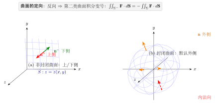
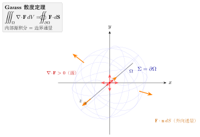
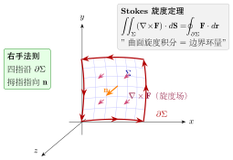
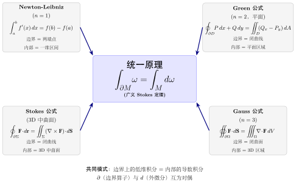
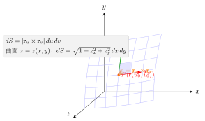
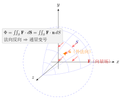

# 第21章 曲面积分

> **一例速记**：
> **第一类**（面积型）：$\iint_S f\,dS$，$z=z(x,y)$ 时 $dS=\sqrt{1+z_x^2+z_y^2}\,dx\,dy$，与法向无关。
> **第二类**（坐标型）：$\iint_\Sigma P\,dy\,dz+Q\,dz\,dx+R\,dx\,dy = \iint_\Sigma \mathbf{F}\cdot\mathbf{n}\,dS$，**法向反向则变号**。
> **Gauss 定理**：$\oiint_{\partial V}\mathbf{F}\cdot d\mathbf{S} = \iiint_V \nabla\cdot\mathbf{F}\,dV$（封闭曲面，外法向）。
> **Stokes 定理**：$\oint_{\partial S}\mathbf{F}\cdot d\mathbf{r} = \iint_S(\nabla\times\mathbf{F})\cdot d\mathbf{S}$（右手定则确定方向）。

---

## 引入：Gauss 定理一步算球面通量

> **题目**：计算向量场 $\mathbf{F} = (x^3, y^3, z^3)$ 穿过球面 $x^2+y^2+z^2=1$ 外侧的通量。

请先停下来想一想：封闭曲面 + 向量场通量 → **Gauss 定理**的信号。直接参数化球面算通量要分三个分量，极繁；Gauss 把它变成体积分。

---

## 思维路径还原（解题者的内心独白）

> "看到 $\oiint_S \mathbf{F}\cdot d\mathbf{S}$，$S$ 是封闭球面，立刻想 **Gauss 定理**。
>
> **第一步：计算散度**。$\nabla\cdot\mathbf{F} = \partial_x(x^3)+\partial_y(y^3)+\partial_z(z^3) = 3x^2+3y^2+3z^2$。
>
> **第二步：转化为体积分**。
>
> $$\oiint_S = \iiint_V 3(x^2+y^2+z^2)\,dV$$
>
> **第三步：用球坐标**。$V$ 是单位球，$x^2+y^2+z^2=\rho^2$，$dV=\rho^2\sin\varphi\,d\rho\,d\varphi\,d\theta$：
>
> $$= 3\int_0^{2\pi}d\theta\int_0^\pi\sin\varphi\,d\varphi\int_0^1\rho^2\cdot\rho^2\,d\rho = 3\cdot 2\pi\cdot 2\cdot\frac{1}{5} = \frac{12\pi}{5}$$
>
> **验证感觉**：散度 $3(x^2+y^2+z^2)$ 在单位球内平均值为 $3\cdot\frac{3}{5}=\frac{9}{5}$（球的 $\overline{r^2}=3/5$），乘以体积 $4\pi/3$ 得 $12\pi/5$。一致！"

---

## 学习目标

通过本章学习，你将能够：

- 理解第一类曲面积分的概念，掌握其几何意义与物理意义
- 熟练计算第一类曲面积分（对面积的曲面积分）
- 理解第二类曲面积分的概念，掌握曲面定向的方法
- 熟练计算第二类曲面积分（对坐标的曲面积分）
- 理解并掌握 Gauss 公式（散度定理），能够运用它简化计算
- 理解并掌握 Stokes 公式（旋度定理），理解其与 Green 公式的关系
- 能够运用曲面积分求解流量、质量等实际问题

---

## 21.1 第一类曲面积分（对面积的曲面积分）

### 21.1.1 定义与物理意义

**物理背景**：设有一曲面形薄片 $S$，其面密度为 $\rho(x, y, z)$，如何求薄片的总质量？

类似于曲线积分的思想，我们采用"分割、近似、求和、取极限"的方法。

**定义**：设 $f(x, y, z)$ 是定义在光滑曲面 $S$ 上的有界函数。将 $S$ 任意分成 $n$ 个小曲面片 $\Delta S_1, \Delta S_2, \ldots, \Delta S_n$，设 $\Delta S_i$ 的面积也记为 $\Delta S_i$。在每个 $\Delta S_i$ 上任取一点 $(\xi_i, \eta_i, \zeta_i)$，作和式

$$\sum_{i=1}^{n} f(\xi_i, \eta_i, \zeta_i) \Delta S_i$$

如果当各小曲面片的直径的最大值 $\lambda \to 0$ 时，此和式的极限存在且与分割方式及点的取法无关，则称此极限为 $f(x, y, z)$ 在曲面 $S$ 上的**第一类曲面积分**（或**对面积的曲面积分**），记作

$$\iint_S f(x, y, z)\,dS = \lim_{\lambda \to 0} \sum_{i=1}^{n} f(\xi_i, \eta_i, \zeta_i) \Delta S_i$$

**物理意义**：
- 若 $\rho(x, y, z)$ 表示曲面 $S$ 上的面密度，则 $\iint_S \rho(x, y, z)\,dS$ 表示曲面的总质量
- 特别地，$\iint_S 1\,dS = \iint_S dS$ 等于曲面 $S$ 的面积

### 21.1.2 计算方法

设曲面 $S$ 由方程 $z = z(x, y)$ 给出，$(x, y) \in D_{xy}$，且 $z(x, y)$ 有连续偏导数。

**面积元素**：

$$dS = \sqrt{1 + \left(\frac{\partial z}{\partial x}\right)^2 + \left(\frac{\partial z}{\partial y}\right)^2}\,dx\,dy$$

**计算公式**：

$$\iint_S f(x, y, z)\,dS = \iint_{D_{xy}} f(x, y, z(x,y)) \sqrt{1 + z_x^2 + z_y^2}\,dx\,dy$$

类似地，若曲面由 $x = x(y, z)$ 或 $y = y(x, z)$ 给出，可得类似公式。

> **例题 21.1** 计算 $\iint_S z\,dS$，其中 $S$ 是球面 $x^2 + y^2 + z^2 = a^2$ 位于 $z \geq 0$ 的上半部分。

**解**：上半球面方程为 $z = \sqrt{a^2 - x^2 - y^2}$，投影区域 $D_{xy} = \{(x,y) \mid x^2 + y^2 \leq a^2\}$。

$$\frac{\partial z}{\partial x} = \frac{-x}{\sqrt{a^2 - x^2 - y^2}}, \quad \frac{\partial z}{\partial y} = \frac{-y}{\sqrt{a^2 - x^2 - y^2}}$$

$$\sqrt{1 + z_x^2 + z_y^2} = \sqrt{1 + \frac{x^2 + y^2}{a^2 - x^2 - y^2}} = \frac{a}{\sqrt{a^2 - x^2 - y^2}}$$

$$\iint_S z\,dS = \iint_{D_{xy}} \sqrt{a^2 - x^2 - y^2} \cdot \frac{a}{\sqrt{a^2 - x^2 - y^2}}\,dx\,dy = a \iint_{D_{xy}} dx\,dy = a \cdot \pi a^2 = \pi a^3$$

> **例题 21.2** 求曲面 $S: z = x^2 + y^2$（$0 \leq z \leq 1$）的质量，设面密度 $\rho = z$。

**解**：投影区域 $D_{xy} = \{(x,y) \mid x^2 + y^2 \leq 1\}$。

$$z_x = 2x, \quad z_y = 2y, \quad \sqrt{1 + z_x^2 + z_y^2} = \sqrt{1 + 4(x^2 + y^2)}$$

$$M = \iint_S z\,dS = \iint_{D_{xy}} (x^2 + y^2)\sqrt{1 + 4(x^2 + y^2)}\,dx\,dy$$

用极坐标：$x = r\cos\theta$，$y = r\sin\theta$，$0 \leq r \leq 1$，$0 \leq \theta \leq 2\pi$。

$$M = \int_0^{2\pi} d\theta \int_0^1 r^2 \sqrt{1 + 4r^2} \cdot r\,dr = 2\pi \int_0^1 r^3 \sqrt{1 + 4r^2}\,dr$$

令 $u = 1 + 4r^2$，则 $du = 8r\,dr$，$r^2 = \dfrac{u-1}{4}$，当 $r = 0$ 时 $u = 1$，当 $r = 1$ 时 $u = 5$。

$$M = 2\pi \int_1^5 \frac{u-1}{4} \cdot \sqrt{u} \cdot \frac{du}{8} = \frac{\pi}{16} \int_1^5 (u^{3/2} - u^{1/2})\,du$$

$$= \frac{\pi}{16} \left[\frac{2u^{5/2}}{5} - \frac{2u^{3/2}}{3}\right]_1^5 = \frac{\pi}{16} \left[\frac{2 \cdot 25\sqrt{5}}{5} - \frac{2 \cdot 5\sqrt{5}}{3} - \frac{2}{5} + \frac{2}{3}\right]$$

$$= \frac{\pi}{16} \left[10\sqrt{5} - \frac{10\sqrt{5}}{3} + \frac{4}{15}\right] = \frac{\pi}{16} \left[\frac{20\sqrt{5}}{3} + \frac{4}{15}\right] = \frac{\pi(100\sqrt{5} + 4)}{240} = \frac{\pi(25\sqrt{5} + 1)}{60}$$

---

## 21.2 第二类曲面积分（对坐标的曲面积分）

### 21.2.1 定义与物理意义

**物理背景**：设流体以速度场 $\mathbf{v}(x, y, z) = P\mathbf{i} + Q\mathbf{j} + R\mathbf{k}$ 流动，$S$ 是流体中的一个曲面。单位时间内流过曲面 $S$ 的流体量（流量）是多少？

考虑曲面上的小面元 $\Delta S_i$，设其法向量为 $\mathbf{n}_i$，则流过该面元的流量近似为 $\mathbf{v} \cdot \mathbf{n}_i \Delta S_i$。

### 21.2.2 曲面的定向

**定向曲面**：如果曲面 $S$ 上每一点都有确定的单位法向量 $\mathbf{n}$，且 $\mathbf{n}$ 在曲面上连续变化，则称 $S$ 为**定向曲面**（或**可定向曲面**）。

对于封闭曲面（如球面），通常规定：
- **外侧**：法向量指向曲面外部
- **内侧**：法向量指向曲面内部

对于非封闭曲面 $z = z(x, y)$：
- **上侧**：法向量与 $z$ 轴正向夹角为锐角（$\cos\gamma > 0$）
- **下侧**：法向量与 $z$ 轴正向夹角为钝角（$\cos\gamma < 0$）



### 21.2.3 定义

**定义**：设 $\Sigma$ 是光滑的有向曲面，$\mathbf{n} = (\cos\alpha, \cos\beta, \cos\gamma)$ 是 $\Sigma$ 上指定侧的单位法向量，$\mathbf{F}(x, y, z) = P\mathbf{i} + Q\mathbf{j} + R\mathbf{k}$ 是定义在 $\Sigma$ 上的向量场。**第二类曲面积分**定义为

$$\iint_\Sigma \mathbf{F} \cdot d\mathbf{S} = \iint_\Sigma \mathbf{F} \cdot \mathbf{n}\,dS = \iint_\Sigma (P\cos\alpha + Q\cos\beta + R\cos\gamma)\,dS$$

也常写成

$$\iint_\Sigma P\,dy\,dz + Q\,dz\,dx + R\,dx\,dy$$

其中 $dy\,dz = \cos\alpha\,dS$，$dz\,dx = \cos\beta\,dS$，$dx\,dy = \cos\gamma\,dS$。

### 21.2.4 计算方法

设曲面 $\Sigma$ 由 $z = z(x, y)$（$(x,y) \in D_{xy}$）给出，取上侧（$\cos\gamma > 0$）。

$$\iint_\Sigma R(x, y, z)\,dx\,dy = \iint_{D_{xy}} R(x, y, z(x,y))\,dx\,dy$$

若取下侧，则

$$\iint_\Sigma R(x, y, z)\,dx\,dy = -\iint_{D_{xy}} R(x, y, z(x,y))\,dx\,dy$$

类似地可得 $\iint_\Sigma P\,dy\,dz$ 和 $\iint_\Sigma Q\,dz\,dx$ 的计算公式。

### 21.2.5 两类曲面积分的关系

$$\iint_\Sigma P\,dy\,dz + Q\,dz\,dx + R\,dx\,dy = \iint_\Sigma (P\cos\alpha + Q\cos\beta + R\cos\gamma)\,dS$$

> **例题 21.3** 计算 $\iint_\Sigma x^2\,dy\,dz + y^2\,dz\,dx + z^2\,dx\,dy$，其中 $\Sigma$ 是球面 $x^2 + y^2 + z^2 = 1$ 的外侧。

**解**：球面外侧的单位法向量 $\mathbf{n} = (x, y, z)$（因为是单位球）。

由对称性，$\iint_\Sigma x^2\,dy\,dz = \iint_\Sigma y^2\,dz\,dx = \iint_\Sigma z^2\,dx\,dy$。

所以原式 $= 3\iint_\Sigma z^2\,dx\,dy = 3\iint_\Sigma z^2 \cos\gamma\,dS = 3\iint_\Sigma z^3\,dS$。

利用球坐标：$x = \sin\varphi\cos\theta$，$y = \sin\varphi\sin\theta$，$z = \cos\varphi$，面积元素 $dS = \sin\varphi\,d\varphi\,d\theta$。

$$= 3\int_0^{2\pi} d\theta \int_0^{\pi} \cos^3\varphi \sin\varphi\,d\varphi = 6\pi \int_0^{\pi} \cos^3\varphi \sin\varphi\,d\varphi$$

令 $u = \cos\varphi$，$du = -\sin\varphi\,d\varphi$：

$$= 6\pi \int_1^{-1} u^3 \cdot (-du) = 6\pi \int_{-1}^{1} u^3\,du = 0$$

（由奇函数的对称性）

实际上用 Gauss 公式更简便（见下节）。

---

## 21.3 Gauss 公式（散度定理）

### 21.3.1 公式陈述

**Gauss 公式**：设空间区域 $\Omega$ 由分片光滑的封闭曲面 $\Sigma$ 围成，$P, Q, R$ 在 $\Omega$ 上有连续的一阶偏导数，则

$$\iiint_\Omega \left(\frac{\partial P}{\partial x} + \frac{\partial Q}{\partial y} + \frac{\partial R}{\partial z}\right) dv = \oiint_\Sigma P\,dy\,dz + Q\,dz\,dx + R\,dx\,dy$$

其中 $\Sigma$ 取外侧。

**向量形式**：设 $\mathbf{F} = P\mathbf{i} + Q\mathbf{j} + R\mathbf{k}$，定义**散度**

$$\text{div}\,\mathbf{F} = \nabla \cdot \mathbf{F} = \frac{\partial P}{\partial x} + \frac{\partial Q}{\partial y} + \frac{\partial R}{\partial z}$$

则 Gauss 公式可写为

$$\iiint_\Omega \text{div}\,\mathbf{F}\,dv = \oiint_\Sigma \mathbf{F} \cdot d\mathbf{S}$$

### 21.3.2 散度的物理意义

散度 $\text{div}\,\mathbf{F}$ 描述向量场 $\mathbf{F}$ 在某点的**源强度**：
- $\text{div}\,\mathbf{F} > 0$：该点是**源**（流出大于流入）
- $\text{div}\,\mathbf{F} < 0$：该点是**汇**（流入大于流出）
- $\text{div}\,\mathbf{F} = 0$：该点**无源**

Gauss 公式表明：向量场穿过封闭曲面的总通量等于曲面所围区域内的源强度之和。



### 21.3.3 应用

> **例题 21.4**（用 Gauss 公式重做例题 21.3）计算 $\iint_\Sigma x^2\,dy\,dz + y^2\,dz\,dx + z^2\,dx\,dy$，其中 $\Sigma$ 是球面 $x^2 + y^2 + z^2 = 1$ 的外侧。

**解**：$P = x^2$，$Q = y^2$，$R = z^2$。

$$\frac{\partial P}{\partial x} + \frac{\partial Q}{\partial y} + \frac{\partial R}{\partial z} = 2x + 2y + 2z$$

由 Gauss 公式：

$$\oiint_\Sigma = \iiint_\Omega 2(x + y + z)\,dv$$

由对称性，$\iiint_\Omega x\,dv = \iiint_\Omega y\,dv = \iiint_\Omega z\,dv = 0$（因为 $\Omega$ 关于三个坐标平面对称）。

故原式 $= 0$。

> **例题 21.5** 计算 $\oiint_\Sigma x^3\,dy\,dz + y^3\,dz\,dx + z^3\,dx\,dy$，其中 $\Sigma$ 是球面 $x^2 + y^2 + z^2 = R^2$ 的外侧。

**解**：$\dfrac{\partial P}{\partial x} = 3x^2$，$\dfrac{\partial Q}{\partial y} = 3y^2$，$\dfrac{\partial R}{\partial z} = 3z^2$。

$$\oiint_\Sigma = \iiint_\Omega 3(x^2 + y^2 + z^2)\,dv$$

用球坐标：

$$= 3\int_0^{2\pi} d\theta \int_0^{\pi} \sin\varphi\,d\varphi \int_0^R \rho^2 \cdot \rho^2\,d\rho = 3 \cdot 2\pi \cdot 2 \cdot \frac{R^5}{5} = \frac{12\pi R^5}{5}$$

---

## 21.4 Stokes 公式（旋度定理）

### 21.4.1 公式陈述

**Stokes 公式**：设 $\Sigma$ 是分片光滑的有向曲面，其边界 $\partial\Sigma$ 是分段光滑的有向闭曲线，$P, Q, R$ 在包含 $\Sigma$ 的空间区域上有连续的一阶偏导数，则

$$\iint_\Sigma \left(\frac{\partial R}{\partial y} - \frac{\partial Q}{\partial z}\right)dy\,dz + \left(\frac{\partial P}{\partial z} - \frac{\partial R}{\partial x}\right)dz\,dx + \left(\frac{\partial Q}{\partial x} - \frac{\partial P}{\partial y}\right)dx\,dy$$
$$= \oint_{\partial\Sigma} P\,dx + Q\,dy + R\,dz$$

其中 $\partial\Sigma$ 的方向与 $\Sigma$ 的定向符合**右手法则**：右手四指沿 $\partial\Sigma$ 的方向，拇指指向 $\Sigma$ 的正侧。



**向量形式**：定义**旋度**

$$\text{curl}\,\mathbf{F} = \nabla \times \mathbf{F} = \begin{vmatrix} \mathbf{i} & \mathbf{j} & \mathbf{k} \\ \dfrac{\partial}{\partial x} & \dfrac{\partial}{\partial y} & \dfrac{\partial}{\partial z} \\ P & Q & R \end{vmatrix}$$

$$= \left(\frac{\partial R}{\partial y} - \frac{\partial Q}{\partial z}\right)\mathbf{i} + \left(\frac{\partial P}{\partial z} - \frac{\partial R}{\partial x}\right)\mathbf{j} + \left(\frac{\partial Q}{\partial x} - \frac{\partial P}{\partial y}\right)\mathbf{k}$$

则 Stokes 公式可写为

$$\iint_\Sigma (\nabla \times \mathbf{F}) \cdot d\mathbf{S} = \oint_{\partial\Sigma} \mathbf{F} \cdot d\mathbf{r}$$

### 21.4.2 旋度的物理意义

旋度 $\text{curl}\,\mathbf{F}$ 描述向量场 $\mathbf{F}$ 在某点的**旋转强度**：
- $|\text{curl}\,\mathbf{F}|$ 表示旋转的强度
- $\text{curl}\,\mathbf{F}$ 的方向表示旋转轴的方向（右手法则）
- $\text{curl}\,\mathbf{F} = \mathbf{0}$：该点**无旋**

### 21.4.3 与 Green 公式的关系

当曲面 $\Sigma$ 退化为 $xOy$ 平面上的平面区域 $D$ 时，Stokes 公式退化为 **Green 公式**：

$$\iint_D \left(\frac{\partial Q}{\partial x} - \frac{\partial P}{\partial y}\right)dx\,dy = \oint_{\partial D} P\,dx + Q\,dy$$

因此，Green 公式是 Stokes 公式在平面上的特例。



**统一原理**：Newton-Leibniz、Green、Stokes、Gauss 四个公式都是**同一个深层定理在不同维度下的具体化**——广义 Stokes 定理 $\displaystyle\int_{\partial M}\omega = \int_M d\omega$，即"边界上低维积分 = 内部高一维的'外微分'积分"。这正是微积分体系最深刻、最简洁的统一表达。

> **例题 21.6** 用 Stokes 公式计算 $\oint_C y\,dx + z\,dy + x\,dz$，其中 $C$ 是平面 $x + y + z = 1$ 与三个坐标面围成的三角形边界，从 $z$ 轴正向看去为逆时针方向。

**解**：$P = y$，$Q = z$，$R = x$。

$$\text{curl}\,\mathbf{F} = \begin{vmatrix} \mathbf{i} & \mathbf{j} & \mathbf{k} \\ \partial_x & \partial_y & \partial_z \\ y & z & x \end{vmatrix} = (-1)\mathbf{i} + (-1)\mathbf{j} + (-1)\mathbf{k}$$

取曲面 $\Sigma$ 为平面 $x + y + z = 1$（$x, y, z \geq 0$）的上侧，其法向量 $\mathbf{n} = \dfrac{1}{\sqrt{3}}(1, 1, 1)$。

由 Stokes 公式：

$$\oint_C = \iint_\Sigma (-1, -1, -1) \cdot \mathbf{n}\,dS = \iint_\Sigma \frac{-3}{\sqrt{3}}\,dS = -\sqrt{3} \iint_\Sigma dS$$

三角形 $\Sigma$ 的顶点为 $(1,0,0)$，$(0,1,0)$，$(0,0,1)$，其面积为 $\dfrac{\sqrt{3}}{2}$。

$$\oint_C = -\sqrt{3} \cdot \frac{\sqrt{3}}{2} = -\frac{3}{2}$$

---

## 本章小结

1. **第一类曲面积分**（对面积的曲面积分）：
   - 定义：$\iint_S f(x,y,z)\,dS = \lim\limits_{\lambda \to 0} \sum f(\xi_i, \eta_i, \zeta_i)\Delta S_i$
   - 计算：$\iint_S f\,dS = \iint_{D_{xy}} f(x,y,z(x,y))\sqrt{1 + z_x^2 + z_y^2}\,dx\,dy$
   - 物理意义：曲面质量（面密度的积分）

2. **第二类曲面积分**（对坐标的曲面积分）：
   - 定义：$\iint_\Sigma \mathbf{F} \cdot d\mathbf{S} = \iint_\Sigma P\,dy\,dz + Q\,dz\,dx + R\,dx\,dy$
   - 需要指定曲面的定向（内外侧或上下侧）
   - 物理意义：流体流过曲面的通量

3. **Gauss 公式**（散度定理）：
   $$\iiint_\Omega \text{div}\,\mathbf{F}\,dv = \oiint_\Sigma \mathbf{F} \cdot d\mathbf{S}$$
   - 散度 $\text{div}\,\mathbf{F} = \dfrac{\partial P}{\partial x} + \dfrac{\partial Q}{\partial y} + \dfrac{\partial R}{\partial z}$ 表示源强度

4. **Stokes 公式**（旋度定理）：
   $$\iint_\Sigma (\nabla \times \mathbf{F}) \cdot d\mathbf{S} = \oint_{\partial\Sigma} \mathbf{F} \cdot d\mathbf{r}$$
   - 旋度 $\text{curl}\,\mathbf{F} = \nabla \times \mathbf{F}$ 表示旋转强度
   - Green 公式是 Stokes 公式在平面上的特例

5. **三大公式的统一**：Newton-Leibniz 公式、Green 公式、Gauss 公式、Stokes 公式都是"边界上的积分等于内部导数的积分"这一思想的体现。

---

## 深度学习应用

曲面积分与向量场的通量思想，在深度学习中有着深刻的类比。神经网络中的信息流动、Gauss 定理对应的守恒律、以及流形学习，都与本章的数学工具密切相关。

### 21.5.1 信息流与通量

**神经网络中的数据流动**

在神经网络中，数据从输入层经过逐层变换传递到输出层。类比向量场中流体流过曲面，我们可以将每一层的**激活值**视为"信息通量"——衡量信息穿过该层的强度。

设第 $l$ 层的激活值矩阵为 $\mathbf{A}^{(l)} \in \mathbb{R}^{n \times d_l}$，定义该层的**信息通量**为

$$\Phi^{(l)} = \frac{1}{n}\sum_{i=1}^{n} \|\mathbf{a}_i^{(l)}\|_2$$

其中 $\mathbf{a}_i^{(l)}$ 是第 $i$ 个样本在第 $l$ 层的激活向量，$n$ 为批量大小。

**激活值的"通量"解释**

类比第二类曲面积分 $\iint_\Sigma \mathbf{F} \cdot d\mathbf{S}$ 度量向量场穿过曲面的净流量：

- 通量增大（$\Phi^{(l+1)} > \Phi^{(l)}$）：该层是"源"，放大了信息
- 通量减小（$\Phi^{(l+1)} < \Phi^{(l)}$）：该层是"汇"，压缩了信息
- 通量稳定（$\Phi^{(l+1)} \approx \Phi^{(l)}$）：该层保持信息守恒

### 21.5.2 Gauss 定理与守恒律

**信息守恒：输入信息 = 输出信息 + 损失**

Gauss 公式（散度定理）建立了区域内部的"源"与边界通量的关系：

$$\iiint_\Omega \text{div}\,\mathbf{F}\,dv = \oiint_\Sigma \mathbf{F} \cdot d\mathbf{S}$$

对应到神经网络的**信息守恒律**：输入层携带的信息总量，等于输出层保留的信息加上中间层"损耗"的信息之和。形式上可写为

$$I_{\text{输入}} = I_{\text{输出}} + \sum_{l} \Delta I^{(l)}$$

其中 $\Delta I^{(l)} \geq 0$ 表示第 $l$ 层的信息损耗（由激活函数的非线性、dropout 等机制引入）。

**残差网络的信息传递**

残差连接（ResNet）的设计思想与 Gauss 定理中"散度为零时通量守恒"高度吻合。残差块的结构为

$$\mathbf{A}^{(l+1)} = \mathbf{A}^{(l)} + \mathcal{F}(\mathbf{A}^{(l)}; \mathbf{W}^{(l)})$$

当残差函数 $\mathcal{F} \approx \mathbf{0}$ 时，信息"无损"传递，类比无散度（$\text{div}\,\mathbf{F} = 0$）的向量场中通量保持不变。这解释了残差网络能够训练极深网络的数学本质：信息流的"散度"被控制在极小范围内。

### 21.5.3 曲面上的学习

**流形学习**

现实中的高维数据（图像、文本、语音）往往分布在高维空间中的低维**流形**上。例如，自然图像虽然像素维度极高，但其语义结构仅占据低维子空间。

类比曲面积分：高维数据流形 $\mathcal{M} \subset \mathbb{R}^D$ 上的积分

$$\iint_{\mathcal{M}} f(\mathbf{x})\,dS_{\mathcal{M}}$$

可以通过参数化将其化为低维参数空间上的积分，这正是流形学习算法（如 UMAP、t-SNE、Isomap）的核心思想：找到流形的局部参数化，将高维数据投影到低维空间，同时保持曲面上的几何结构（距离、曲率）。

**曲面上的神经网络**

传统卷积神经网络假设数据定义在平坦的欧氏空间（平面图像）上。而**图神经网络**（GNN）和**球面 CNN** 将神经网络推广到任意曲面：

- 球面数据（全景图、气候数据）：在球面 $S^2$ 上定义卷积，面积元素为 $dS = \sin\theta\,d\theta\,d\phi$
- 图结构数据（社交网络、分子结构）：利用离散 Laplace-Beltrami 算子替代欧氏空间中的 Laplace 算子

曲面上的信息传播可以用**热方程**描述：$\dfrac{\partial u}{\partial t} = \Delta_{\mathcal{M}} u$，其中 $\Delta_{\mathcal{M}}$ 是流形上的 Laplace-Beltrami 算子，这是图神经网络消息传递机制的连续极限。

### 21.5.4 代码示例

以下示例演示如何分析神经网络各层的激活值范数，从信息通量的角度理解信息在网络中的流动。

```python
import torch
import torch.nn as nn

# 信息流分析
def analyze_information_flow(model, x):
    """分析神经网络各层的激活值范数（信息流）"""
    activations = []

    def hook(module, input, output):
        activations.append(output.norm(dim=-1).mean().item())

    hooks = []
    for layer in model.modules():
        if isinstance(layer, (nn.Linear, nn.Conv2d)):
            hooks.append(layer.register_forward_hook(hook))

    with torch.no_grad():
        model(x)

    for h in hooks:
        h.remove()

    return activations

# 示例网络
model = nn.Sequential(
    nn.Linear(100, 64),
    nn.ReLU(),
    nn.Linear(64, 32),
    nn.ReLU(),
    nn.Linear(32, 10)
)

x = torch.randn(32, 100)
flow = analyze_information_flow(model, x)
print(f"各层激活值范数: {flow}")
```

运行结果给出各层的激活值范数列表，即信息通量序列 $(\Phi^{(1)}, \Phi^{(2)}, \Phi^{(3)})$。通过观察通量的变化趋势，可以诊断梯度消失（通量逐层递减趋零）或梯度爆炸（通量逐层指数增长）等训练问题。

---

## 练习题

**1.** ⭐ 计算 $\iint_S (x^2 + y^2)\,dS$，其中 $S$ 是锥面 $z = \sqrt{x^2 + y^2}$ 位于 $0 \leq z \leq 1$ 的部分。

**2.** ⭐ 计算 $\iint_\Sigma z\,dx\,dy$，其中 $\Sigma$ 是抛物面 $z = 1 - x^2 - y^2$（$z \geq 0$）的上侧。

**3.** ⭐ 用 Gauss 公式计算 $\oiint_\Sigma (x^2 + y)\,dy\,dz + (y^2 + z)\,dz\,dx + (z^2 + x)\,dx\,dy$，其中 $\Sigma$ 是立方体 $0 \leq x, y, z \leq 1$ 的表面外侧。

**4.** ⭐⭐ 用 Stokes 公式计算 $\oint_C (y - z)\,dx + (z - x)\,dy + (x - y)\,dz$，其中 $C$ 是球面 $x^2 + y^2 + z^2 = 1$ 与平面 $x + y + z = 0$ 的交线，从 $x$ 轴正向看去为逆时针方向。

**5.** ⭐⭐ 设 $\mathbf{F} = (2xy + z^3)\mathbf{i} + x^2\mathbf{j} + 3xz^2\mathbf{k}$，验证 $\text{curl}\,\mathbf{F} = \mathbf{0}$，并求 $\mathbf{F}$ 的势函数 $\varphi$ 使得 $\mathbf{F} = \nabla\varphi$。

**6.** ⭐⭐ 计算上半球面
$$
S:\ x^2+y^2+z^2=1,\ z\ge 0
$$
上的第一类曲面积分
$$
\iint_S z\,dS.
$$

**7.** ⭐⭐⭐ 设 $\mathbf{F}=(x,y,z)$，计算它穿过半径为 $R$ 的球面
$$
x^2+y^2+z^2=R^2
$$
外侧的通量。

**8.** ⭐⭐⭐ 在连续生成模型里，可把向量场
$$
\mathbf{F}(x,y,z)=-\lambda(x,y,z)\qquad (\lambda>0)
$$
看成把“概率质量”向原点收缩的流。计算它穿过半径为 $R$ 的球面外侧的通量，并解释符号的意义。

---

## 练习答案

<details>
<summary>点击展开答案</summary>

**1.** 锥面 $z = \sqrt{x^2 + y^2}$，投影区域 $D_{xy} = \{(x,y) \mid x^2 + y^2 \leq 1\}$。

$$z_x = \frac{x}{\sqrt{x^2 + y^2}}, \quad z_y = \frac{y}{\sqrt{x^2 + y^2}}$$

$$\sqrt{1 + z_x^2 + z_y^2} = \sqrt{1 + \frac{x^2 + y^2}{x^2 + y^2}} = \sqrt{2}$$

$$\iint_S (x^2 + y^2)\,dS = \sqrt{2} \iint_{D_{xy}} (x^2 + y^2)\,dx\,dy$$

用极坐标：

$$= \sqrt{2} \int_0^{2\pi} d\theta \int_0^1 r^2 \cdot r\,dr = \sqrt{2} \cdot 2\pi \cdot \frac{1}{4} = \frac{\sqrt{2}\pi}{2}$$

---

**2.** 抛物面上侧，投影区域 $D_{xy} = \{(x,y) \mid x^2 + y^2 \leq 1\}$，取上侧时 $\cos\gamma > 0$。

$$\iint_\Sigma z\,dx\,dy = \iint_{D_{xy}} (1 - x^2 - y^2)\,dx\,dy$$

用极坐标：

$$= \int_0^{2\pi} d\theta \int_0^1 (1 - r^2) \cdot r\,dr = 2\pi \left[\frac{r^2}{2} - \frac{r^4}{4}\right]_0^1 = 2\pi \cdot \frac{1}{4} = \frac{\pi}{2}$$

---

**3.** $P = x^2 + y$，$Q = y^2 + z$，$R = z^2 + x$。

$$\frac{\partial P}{\partial x} + \frac{\partial Q}{\partial y} + \frac{\partial R}{\partial z} = 2x + 2y + 2z$$

由 Gauss 公式：

$$\oiint_\Sigma = \iiint_\Omega 2(x + y + z)\,dv = 2\int_0^1\int_0^1\int_0^1 (x + y + z)\,dx\,dy\,dz$$

$$= 2\left[\int_0^1 x\,dx + \int_0^1 y\,dy + \int_0^1 z\,dz\right] = 2 \cdot 3 \cdot \frac{1}{2} = 3$$

---

**4.** $P = y - z$，$Q = z - x$，$R = x - y$。

$$\text{curl}\,\mathbf{F} = \begin{vmatrix} \mathbf{i} & \mathbf{j} & \mathbf{k} \\ \partial_x & \partial_y & \partial_z \\ y-z & z-x & x-y \end{vmatrix} = (-1-1)\mathbf{i} + (-1-1)\mathbf{j} + (-1-1)\mathbf{k} = -2(\mathbf{i} + \mathbf{j} + \mathbf{k})$$

取曲面 $\Sigma$ 为球面 $x^2 + y^2 + z^2 = 1$ 被平面 $x + y + z = 0$ 截得的圆盘（选法向量使其与曲线方向符合右手法则）。

圆盘的单位法向量 $\mathbf{n} = \dfrac{1}{\sqrt{3}}(1, 1, 1)$，面积 $S = \pi \cdot 1^2 = \pi$（因为截得的是过球心的大圆）。

$$\oint_C = \iint_\Sigma \text{curl}\,\mathbf{F} \cdot \mathbf{n}\,dS = -2(1+1+1) \cdot \frac{1}{\sqrt{3}} \cdot \pi = -2\sqrt{3}\pi$$

---

**5.** 计算旋度：

$$\text{curl}\,\mathbf{F} = \begin{vmatrix} \mathbf{i} & \mathbf{j} & \mathbf{k} \\ \partial_x & \partial_y & \partial_z \\ 2xy + z^3 & x^2 & 3xz^2 \end{vmatrix}$$

$$= (0 - 0)\mathbf{i} + (3z^2 - 3z^2)\mathbf{j} + (2x - 2x)\mathbf{k} = \mathbf{0}$$

由 $\nabla\varphi = \mathbf{F}$：

$$\frac{\partial\varphi}{\partial x} = 2xy + z^3 \Rightarrow \varphi = x^2y + xz^3 + g(y, z)$$

$$\frac{\partial\varphi}{\partial y} = x^2 + \frac{\partial g}{\partial y} = x^2 \Rightarrow \frac{\partial g}{\partial y} = 0 \Rightarrow g = h(z)$$

$$\frac{\partial\varphi}{\partial z} = 3xz^2 + h'(z) = 3xz^2 \Rightarrow h'(z) = 0 \Rightarrow h = C$$

故势函数为 $\varphi = x^2y + xz^3 + C$。

---

**6.** 采用球坐标参数化上半球：
$$
x=\sin\varphi\cos\theta,\quad y=\sin\varphi\sin\theta,\quad z=\cos\varphi,
$$
其中
$$
0\le \theta\le 2\pi,\qquad 0\le \varphi\le \frac{\pi}{2}.
$$

球面元为
$$
dS=\sin\varphi\,d\varphi\,d\theta.
$$

因此
$$
\iint_S z\,dS
=\int_0^{2\pi}\int_0^{\pi/2}\cos\varphi\sin\varphi\,d\varphi\,d\theta.
$$

先对 $\varphi$ 积分：
$$
\int_0^{\pi/2}\cos\varphi\sin\varphi\,d\varphi=\frac12.
$$

于是
$$
\iint_S z\,dS=2\pi\cdot \frac12=\pi.
$$

---

**7.** 用 Gauss 公式。对
$$
\mathbf{F}=(x,y,z),
$$
有
$$
\nabla\cdot \mathbf{F}=1+1+1=3.
$$

半径为 $R$ 的球体体积为
$$
V=\frac{4}{3}\pi R^3.
$$

故外侧通量
$$
\oiint_S \mathbf{F}\cdot d\mathbf{S}
=\iiint_V (\nabla\cdot \mathbf{F})\,dV
=3\cdot \frac{4}{3}\pi R^3
=4\pi R^3.
$$

---

**8.** 对向量场
$$
\mathbf{F}=-\lambda(x,y,z),
$$
有
$$
\nabla\cdot \mathbf{F}=-\lambda-\lambda-\lambda=-3\lambda.
$$

由 Gauss 公式，
$$
\oiint_S \mathbf{F}\cdot d\mathbf{S}
=\iiint_V (-3\lambda)\,dV
=-3\lambda\cdot \frac{4}{3}\pi R^3
=-4\pi\lambda R^3.
$$

结果为负，说明相对于外法向，净流量指向球内，也就是整个流场在把质量向原点收缩。这正符合扩散反演或收缩动力系统中的”向中心汇聚”直觉。

</details>

---

## 几何示意

**图 21-1**：曲面参数化 + 面积元 $dS$



**图 21-2**：向量场穿过曲面（通量）



---

## 思考路标（条件反射）

- 看到曲面质量 / 面积加权积分 → 第一类曲面积分 $\iint_S f\,dS$，与法向量方向无关
- 看到流量 / 向量场穿过曲面 → 第二类曲面积分 $\iint_S \mathbf{F}\cdot d\mathbf{S}$，**方向有关**
- 看到曲面 $z=z(x,y)$ → $dS = \sqrt{1+z_x^2+z_y^2}\,dx\,dy$
- 看到参数曲面 $\mathbf{r}(u,v)$ → 法向量 $\mathbf{n} = \mathbf{r}_u \times \mathbf{r}_v$，面积元 $dS = |\mathbf{r}_u\times\mathbf{r}_v|\,du\,dv$
- 看到封闭曲面 + 体积分 → 优先用 Gauss 定理：$\oiint_S \mathbf{F}\cdot d\mathbf{S} = \iiint_V \nabla\cdot\mathbf{F}\,dV$
- 看到曲面 + 边界曲线 → 考虑 Stokes 定理：$\iint_S (\nabla\times\mathbf{F})\cdot d\mathbf{S} = \oint_{\partial S} \mathbf{F}\cdot d\mathbf{r}$
- 看到法向量反向 → 第一类积分不变号，**第二类积分变号**
- 看到”上侧/外侧” → 确认法向量 $\mathbf{n}$ 朝向，外法向 $\mathbf{n}$ 的 $z$ 分量方向决定符号

## 易错点

1. **法向量方向影响符号**：第二类曲面积分 $\iint_S \mathbf{F}\cdot\mathbf{n}\,dS$ 的结果随法向量取向改变符号，翻转定向则结果变号。
2. **定向曲面 vs 无定向**：$dS$（面积元）无方向，$d\mathbf{S} = \mathbf{n}\,dS$（向量面积元）有方向；莫比乌斯带不可定向，不能做第二类积分。
3. **曲面参数化法向量方向**：$\mathbf{r}_u\times\mathbf{r}_v$ 的方向取决于参数顺序，若要外法向则需检查朝向，必要时取负。
4. **投影到 $xOy$ 面的符号**：若曲面上侧法向量 $z$ 分量为正，则 $\iint_S R\,dx\,dy = \iint_D R\,dx\,dy$；若下侧则加负号。
5. **Gauss 定理要求封闭曲面**：若曲面不封闭，需补充”盖子”曲面再用 Gauss，最后减去补充部分。

---

## 抽象成方法（套路总结）

### 5 大公式速查

| 积分类型 | 公式 | 关键要点 |
|---|---|---|
| 第一类面积 $\iint_S f\,dS$ | $\iint_D f(x,y,z(x,y))\sqrt{1+z_x^2+z_y^2}\,dx\,dy$ | 与法向无关 |
| 面积元（$z=z(x,y)$） | $dS=\sqrt{1+z_x^2+z_y^2}\,dx\,dy$ | 投影到 $xOy$ 面 |
| 第二类通量 $\iint_\Sigma R\,dx\,dy$ | 上侧 $=\iint_D R(x,y,z(x,y))\,dx\,dy$；下侧加 $-$ | 法向决定符号 |
| Gauss 定理 | $\oiint_S \mathbf{F}\cdot d\mathbf{S} = \iiint_V \nabla\cdot\mathbf{F}\,dV$ | 封闭面外法向 |
| Stokes 定理 | $\oint_{\partial S}\mathbf{F}\cdot d\mathbf{r} = \iint_S(\nabla\times\mathbf{F})\cdot d\mathbf{S}$ | 右手定则定向 |
| 散度 | $\nabla\cdot\mathbf{F} = P_x+Q_y+R_z$ | 源强度 |

### 解题流程（3 步判断法）

1. **是第一类还是第二类？** 有 $dS$（面积元无方向）→ 第一类；有 $dx\,dy$ 或 $\mathbf{F}\cdot d\mathbf{S}$ → 第二类（方向有关）。
2. **封闭曲面 + 体积分？** → 优先 **Gauss 定理**（算散度比算三个分量通量快得多）。
3. **曲面 + 边界曲线？** → 考虑 **Stokes 定理**（旋度换通量，或通量换环量）。

---

## 方法变形

### 变形 1：不封闭曲面用 Gauss——补盖法

曲面 $\Sigma$ 不封闭时，补充”盖子” $\Sigma_0$ 构成封闭曲面，用 Gauss：$\oiint = \iint_\Sigma + \iint_{\Sigma_0}$，故 $\iint_\Sigma = \oiint - \iint_{\Sigma_0}$。盖子通常选平面，计算简单。

### 变形 2：对称性消零

若封闭区域 $V$ 关于坐标平面对称，且被积量关于对应变量为奇函数，则积分为零。如 $\iiint_V x\,dV = 0$（球关于 $yOz$ 对称）。

### 变形 3：Stokes 转化曲面选取

Stokes 定理中，具有相同边界 $\partial S$ 的任何曲面 $S$（同侧定向）积分值相同。选计算最简单的曲面（如平面区域）代替复杂曲面。

### 变形 4：第一类曲面积分与面积公式

当 $f=1$ 时，$\iint_S dS$ 等于曲面面积 $A = \iint_D \sqrt{1+z_x^2+z_y^2}\,dx\,dy$。面密度为 $\rho$ 时质量 $= \iint_S \rho\,dS$。

---

## 典型应用例题

### 例 1：第一类曲面积分（面积型）

> **题目**：计算 $\iint_S z\,dS$，其中 $S$ 是平面 $x+y+z=1$ 在第一卦限（$x,y,z\geq 0$）的部分。

【思路】平面方程给出 $z = 1-x-y$，投影到 $xOy$，计算 $dS$。

【解】$z_x = -1$，$z_y = -1$，$\sqrt{1+z_x^2+z_y^2} = \sqrt{3}$。

投影区域 $D: x\geq 0,y\geq 0,x+y\leq 1$。

$$\iint_S z\,dS = \iint_D (1-x-y)\sqrt{3}\,dx\,dy = \sqrt{3}\int_0^1\int_0^{1-x}(1-x-y)\,dy\,dx$$

内层 $= \frac{(1-x)^2}{2}$，故 $= \sqrt{3}\int_0^1\frac{(1-x)^2}{2}\,dx = \sqrt{3}\cdot\frac{1}{6} = \frac{\sqrt{3}}{6}$。

【答案】$\boxed{\dfrac{\sqrt{3}}{6}}$。

### 例 2：Gauss 定理简化通量计算

> **题目**：计算 $\oiint_S (x^2+y)\,dy\,dz+(y^2+z)\,dz\,dx+(z^2+x)\,dx\,dy$，$S$ 是单位立方体 $[0,1]^3$ 的外侧。

【思路】封闭曲面 → Gauss 定理，散度比三分量通量容易算。

【解】$\nabla\cdot\mathbf{F} = 2x+2y+2z$。

$$\oiint_S = \iiint_V 2(x+y+z)\,dV = 2\int_0^1\int_0^1\int_0^1(x+y+z)\,dz\,dy\,dx = 2\cdot 3\cdot\frac{1}{2} = 3$$

【答案】$\boxed{3}$。

### 例 3：Stokes 定理转化

> **题目**：计算 $\oint_C z\,dx+x\,dy+y\,dz$，$C$ 是平面 $x+y+z=1$ 截单位球的圆（正方向使法向量指向 $(1,1,1)$ 方向）。

【思路】曲线积分 → Stokes 定理，将其转为曲面旋度积分。

【解】$\mathbf{F}=(z,x,y)$，旋度 $\nabla\times\mathbf{F} = (1-0,1-0,1-0) = (-1+1,...) $，直接计算：

$$\nabla\times\mathbf{F} = \begin{vmatrix}\mathbf{i}&\mathbf{j}&\mathbf{k}\\\partial_x&\partial_y&\partial_z\\z&x&y\end{vmatrix} = (1-0)\mathbf{i}+(1-0)\mathbf{j}+(1-0)\mathbf{k} = (1,1,1)$$

取曲面 $\Sigma$ 为圆盘（$x+y+z=1$ 截球），法向量单位向量 $\mathbf{n}=\frac{1}{\sqrt{3}}(1,1,1)$，$(\nabla\times\mathbf{F})\cdot\mathbf{n} = \frac{3}{\sqrt{3}}=\sqrt{3}$，圆盘面积 $A$。

圆盘是球面 $r=1$ 与平面 $x+y+z=1$ 的截面，圆心到平面距离 $d=\frac{1}{\sqrt{3}}$，半径 $r^2=1-\frac{1}{3}=\frac{2}{3}$，$A=\frac{2\pi}{3}$。

$$\oint_C = \iint_\Sigma \sqrt{3}\,dS = \sqrt{3}\cdot\frac{2\pi}{3} = \frac{2\sqrt{3}\pi}{3}$$

【答案】$\boxed{\dfrac{2\sqrt{3}\pi}{3}}$。

---

## 自测题

**自测 1**　计算 $\iint_S (x^2+y^2)\,dS$，$S$ 是锥面 $z=\sqrt{x^2+y^2}$（$0\leq z\leq 1$）。

> 💡 提示：$\sqrt{1+z_x^2+z_y^2}=\sqrt{2}$，极坐标积分，答案 $= \sqrt{2}\pi/2$。

**自测 2**　用 Gauss 定理计算 $\oiint_S x^2\,dy\,dz+y^2\,dz\,dx+z^2\,dx\,dy$，$S$ 为球面 $x^2+y^2+z^2=R^2$ 外侧。

> 💡 提示：散度 $=2(x+y+z)$，对称性 $\iiint_V x\,dV=0$，答案 $= 0$。

**自测 3**　计算 $\iint_S z\,dx\,dy$，$S$ 是下半球面 $z=-\sqrt{1-x^2-y^2}$ 取下侧（法向量朝下）。

> 💡 提示：下侧 $\iint_S R\,dx\,dy = -\iint_D R(x,y,z(x,y))\,dx\,dy = -\iint_D (-\sqrt{1-r^2})r\,dr\,d\theta$，极坐标积分得 $2\pi/3$。

**自测 4**　$\mathbf{F}=(x,y,z)$，计算其穿过单位球面外侧的总通量。

> 💡 提示：$\nabla\cdot\mathbf{F}=3$，$\iiint_V 3\,dV = 3\cdot\frac{4\pi}{3}=4\pi$。

**自测 5**　$\mathbf{F}=(y,-x,0)$，用 Stokes 定理计算 $\oint_C \mathbf{F}\cdot d\mathbf{r}$，$C$ 是 $z=0$ 平面上的单位圆（逆时针）。

> 💡 提示：$\nabla\times\mathbf{F} = (0,0,-1-1)=(0,0,-2)$，$d\mathbf{S}=(0,0,1)\,dA$（上侧），$\iint_D(-2)\,dA=-2\pi$。

---

**回头看一眼”一例速记”**：

> 第一类 $dS = \sqrt{1+z_x^2+z_y^2}\,dx\,dy$，与法向无关。
> Gauss：封闭曲面 → 散度体积分；Stokes：曲面边界 → 旋度面积分。
> 法向取向反则第二类积分变号。

如果现在不看笔记，能独立完成例 2 + 自测 2 + 自测 4——本章，你拿下了。

---

## 融合版说明

本版 = **原版（严格大学教材 + 深度学习应用）** + **重写版（速记 / 路径 / 套路 / 例题 / 自测）** 融合：

| 段落 | 来源 | 价值 |
|---|---|---|
| 一例速记 + 引入 + 思维路径还原 | 重写版（前置） | 建立直觉 / 反射 |
| 学习目标 + 21.1–21.4 严格正文 | 原版 | 完整推导 |
| 几何示意（图） | 配图 | 可视化 |
| 抽象成方法 + 方法变形 | 重写版（中间） | 套路总结 |
| 思考路标 + 易错点 | 融合两版 | 条件反射 |
| 典型应用例题 3 例 | 重写版 | 演练 |
| 深度学习应用 + 代码 | 原版 | 工业实战 |
| 练习题 + 详解 | 原版 | 巩固 |
| 自测题 5 题 | 重写版 | 额外训练 |

**适用**：一站式学习——先速记建立直觉，看严格推导，做套路总结，看代码实战，做习题巩固，自测验收。
