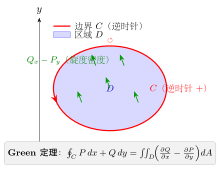
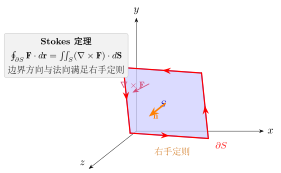
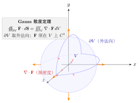
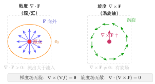

# 第22章 向量分析

> **一例速记**：
> **三大定理统一框架**：$\int_{\partial\Omega} = \int_\Omega d(\cdot)$，低维的"边界积分"等于高维的"微分积分"。
> **Green**（2D）：$\oint_C P\,dx+Q\,dy = \iint_D (Q_x-P_y)\,dA$。
> **Stokes**（3D 曲面）：$\oint_{\partial S}\mathbf{F}\cdot d\mathbf{r} = \iint_S (\nabla\times\mathbf{F})\cdot d\mathbf{S}$。
> **Gauss**（3D 体积）：$\oiint_{\partial V}\mathbf{F}\cdot d\mathbf{S} = \iiint_V \nabla\cdot\mathbf{F}\,dV$。
> **散度 = 源强度**；**旋度 = 涡旋强度**；梯度场无旋（$\nabla\times\nabla f = \mathbf{0}$）；旋度场无散（$\nabla\cdot\nabla\times\mathbf{F}=0$）。

---

## 引入：Green 定理简化环路积分

> **题目**：用 Green 定理计算 $\displaystyle\oint_C (x^2y\,dx + xy^2\,dy)$，其中 $C$ 是单位圆 $x^2+y^2=1$ 逆时针方向。

请先停下来想一想：封闭曲线 + 二维向量场 → **Green 定理**的标准信号。直接参数化算会很繁，Green 定理把它变成二重积分。

---

## 思维路径还原（解题者的内心独白）

> "看到 $\oint_C$ 沿闭合曲线的积分，$P = x^2y$，$Q = xy^2$。
>
> **第一步：验证 Green 条件**。$D$ 是单位圆盘，单连通区域；$P, Q$ 在 $D$ 内有连续偏导。Green 定理可用。
>
> **第二步：计算旋度密度** $Q_x - P_y$：
>
> $$Q_x = \frac{\partial(xy^2)}{\partial x} = y^2, \qquad P_y = \frac{\partial(x^2y)}{\partial y} = x^2$$
>
> $$Q_x - P_y = y^2 - x^2$$
>
> **第三步：应用 Green 定理**：
>
> $$\oint_C P\,dx + Q\,dy = \iint_D (y^2 - x^2)\,dA$$
>
> **第四步：对称性分析**。$D$ 关于 $x, y$ 轴对称，$y^2$ 和 $x^2$ 的积分值相同（由对称性），因此：
>
> $$\iint_D y^2\,dA = \iint_D x^2\,dA$$
>
> 所以 $\iint_D (y^2 - x^2)\,dA = 0$。
>
> **验证**：用极坐标也可直接算 $\int_0^{2\pi}\int_0^1 (r^2\sin^2\theta - r^2\cos^2\theta)r\,dr\,d\theta = \int_0^1 r^3\,dr\cdot\int_0^{2\pi}(-\cos 2\theta)\,d\theta = \frac{1}{4}\cdot 0 = 0$。结果一致！"

---

## 学习目标

通过本章学习，你将能够：

- 理解标量场和向量场的概念，掌握场的数学描述方法
- 掌握梯度、散度、旋度的定义和计算，理解其物理意义
- 熟练运用向量分析的恒等式进行计算和证明
- 深入理解 Green 公式、Gauss 公式、Stokes 公式之间的内在联系
- 认识微积分基本定理在高维空间的推广形式
- 能够将向量分析应用于电磁场、流体力学等物理问题

---

## 22.1 场论基础

### 22.1.1 标量场与向量场

在物理学和工程中，我们经常需要描述空间中各点的物理量分布。根据物理量的性质，可以分为两类场。

**定义**（标量场）：设 $D$ 是空间中的一个区域。如果对于 $D$ 中的每一点 $P$，都有一个确定的标量 $f(P)$ 与之对应，则称 $f$ 为定义在 $D$ 上的**标量场**。

常见的标量场包括：
- 温度场 $T(x, y, z)$：空间中各点的温度分布
- 压强场 $p(x, y, z)$：流体中各点的压强分布
- 电势场 $\varphi(x, y, z)$：电场中各点的电势

**定义**（向量场）：设 $D$ 是空间中的一个区域。如果对于 $D$ 中的每一点 $P$，都有一个确定的向量 $\mathbf{F}(P)$ 与之对应，则称 $\mathbf{F}$ 为定义在 $D$ 上的**向量场**。

向量场可以表示为分量形式：

$$\mathbf{F}(x, y, z) = P(x, y, z)\,\mathbf{i} + Q(x, y, z)\,\mathbf{j} + R(x, y, z)\,\mathbf{k}$$

常见的向量场包括：
- 速度场 $\mathbf{v}(x, y, z)$：流体中各点的速度分布
- 力场 $\mathbf{F}(x, y, z)$：如重力场、电场、磁场
- 电场强度 $\mathbf{E}(x, y, z)$、磁感应强度 $\mathbf{B}(x, y, z)$

### 22.1.2 等值面与场线

**等值面**：标量场 $f(x, y, z)$ 中，满足 $f(x, y, z) = c$（常数）的点构成的曲面称为**等值面**。

不同的常数 $c$ 对应不同的等值面，这些等值面构成一族曲面，覆盖整个场域。

> **例题 22.1** 求温度场 $T(x, y, z) = x^2 + y^2 + z^2$ 的等值面。

**解**：等值面方程为 $x^2 + y^2 + z^2 = c$（$c > 0$）。

这是一族以原点为球心、半径为 $\sqrt{c}$ 的同心球面。温度沿径向向外递增。

**场线**（向量线）：向量场 $\mathbf{F}$ 中的一条曲线，如果在其上每一点处，曲线的切线方向都与该点的向量 $\mathbf{F}$ 方向一致，则称此曲线为向量场的**场线**。

设场线的参数方程为 $\mathbf{r}(t) = (x(t), y(t), z(t))$，则场线满足微分方程：

$$\frac{dx}{P} = \frac{dy}{Q} = \frac{dz}{R}$$

其中 $\mathbf{F} = (P, Q, R)$。

> **例题 22.2** 求向量场 $\mathbf{F} = y\,\mathbf{i} - x\,\mathbf{j}$ 的场线。

**解**：场线方程为 $\dfrac{dx}{y} = \dfrac{dy}{-x}$，即 $x\,dx + y\,dy = 0$。

积分得 $x^2 + y^2 = c^2$（常数）。

场线是以原点为圆心的同心圆族。这个向量场描述了绕原点的旋转运动。

### 22.1.3 场的数学描述

为了统一描述场的微分运算，引入**哈密顿算子**（Nabla 算子）：

$$\nabla = \frac{\partial}{\partial x}\,\mathbf{i} + \frac{\partial}{\partial y}\,\mathbf{j} + \frac{\partial}{\partial z}\,\mathbf{k}$$

$\nabla$ 是一个向量微分算子，它可以作用于标量场或向量场，产生新的场。

---

## 22.2 梯度、散度、旋度

### 22.2.1 梯度（Gradient）

**定义**：设标量场 $f(x, y, z)$ 具有连续的一阶偏导数，则向量

$$\nabla f = \frac{\partial f}{\partial x}\,\mathbf{i} + \frac{\partial f}{\partial y}\,\mathbf{j} + \frac{\partial f}{\partial z}\,\mathbf{k}$$

称为 $f$ 的**梯度**，记作 $\nabla f$ 或 $\text{grad}\,f$。

**梯度的性质**：

1. 梯度的方向是函数 $f$ 增长最快的方向
2. 梯度的模 $|\nabla f|$ 等于最大方向导数
3. 梯度与等值面正交：$\nabla f$ 在每一点都垂直于过该点的等值面

**运算法则**：设 $f$、$g$ 为标量场，$c$ 为常数，则

$$\nabla(cf) = c\nabla f$$

$$\nabla(f + g) = \nabla f + \nabla g$$

$$\nabla(fg) = f\nabla g + g\nabla f$$

$$\nabla\left(\frac{f}{g}\right) = \frac{g\nabla f - f\nabla g}{g^2} \quad (g \neq 0)$$

> **例题 22.3** 设 $f(x, y, z) = x^2 + y^2 + z^2$，求 $\nabla f$ 并验证其与等值面正交。

**解**：

$$\nabla f = 2x\,\mathbf{i} + 2y\,\mathbf{j} + 2z\,\mathbf{k} = 2\mathbf{r}$$

其中 $\mathbf{r} = (x, y, z)$ 是位置向量。

等值面为球面 $x^2 + y^2 + z^2 = c$，球面在点 $(x_0, y_0, z_0)$ 处的法向量为 $(x_0, y_0, z_0)$。

$\nabla f = 2(x_0, y_0, z_0)$ 正是球面的外法向量，因此梯度与等值面正交。

### 22.2.2 散度（Divergence）

**定义**：设向量场 $\mathbf{F} = P\,\mathbf{i} + Q\,\mathbf{j} + R\,\mathbf{k}$ 具有连续的一阶偏导数，则标量

$$\nabla \cdot \mathbf{F} = \frac{\partial P}{\partial x} + \frac{\partial Q}{\partial y} + \frac{\partial R}{\partial z}$$

称为 $\mathbf{F}$ 的**散度**，记作 $\nabla \cdot \mathbf{F}$ 或 $\text{div}\,\mathbf{F}$。

**物理意义**：散度描述向量场在某点的"源"的强度。

- $\nabla \cdot \mathbf{F} > 0$：该点是场的**源**（如正电荷处电场发散）
- $\nabla \cdot \mathbf{F} < 0$：该点是场的**汇**（如负电荷处电场汇聚）
- $\nabla \cdot \mathbf{F} = 0$：该点无源无汇

若 $\nabla \cdot \mathbf{F} = 0$ 在整个区域成立，则称 $\mathbf{F}$ 为**无源场**或**管形场**。

**运算法则**：设 $\mathbf{F}$、$\mathbf{G}$ 为向量场，$f$ 为标量场，则

$$\nabla \cdot (f\mathbf{F}) = f(\nabla \cdot \mathbf{F}) + \mathbf{F} \cdot \nabla f$$

$$\nabla \cdot (\mathbf{F} + \mathbf{G}) = \nabla \cdot \mathbf{F} + \nabla \cdot \mathbf{G}$$

> **例题 22.4** 设速度场 $\mathbf{v} = x\,\mathbf{i} + y\,\mathbf{j} + z\,\mathbf{k}$，求其散度并解释物理意义。

**解**：

$$\nabla \cdot \mathbf{v} = \frac{\partial x}{\partial x} + \frac{\partial y}{\partial y} + \frac{\partial z}{\partial z} = 1 + 1 + 1 = 3$$

散度为正常数，说明流体在每一点都在膨胀（如气体从原点向外均匀扩散）。

### 22.2.3 旋度（Curl）

**定义**：设向量场 $\mathbf{F} = P\,\mathbf{i} + Q\,\mathbf{j} + R\,\mathbf{k}$ 具有连续的一阶偏导数，则向量

$$\nabla \times \mathbf{F} = \begin{vmatrix} \mathbf{i} & \mathbf{j} & \mathbf{k} \\[5pt] \dfrac{\partial}{\partial x} & \dfrac{\partial}{\partial y} & \dfrac{\partial}{\partial z} \\[10pt] P & Q & R \end{vmatrix}$$

展开为：

$$\nabla \times \mathbf{F} = \left(\frac{\partial R}{\partial y} - \frac{\partial Q}{\partial z}\right)\mathbf{i} + \left(\frac{\partial P}{\partial z} - \frac{\partial R}{\partial x}\right)\mathbf{j} + \left(\frac{\partial Q}{\partial x} - \frac{\partial P}{\partial y}\right)\mathbf{k}$$

称为 $\mathbf{F}$ 的**旋度**，记作 $\nabla \times \mathbf{F}$ 或 $\text{curl}\,\mathbf{F}$。

**物理意义**：旋度描述向量场在某点的"旋转"程度。

- 旋度的方向：按右手法则，表示旋转轴的方向
- 旋度的模：表示旋转的角速度大小

若 $\nabla \times \mathbf{F} = \mathbf{0}$ 在整个区域成立，则称 $\mathbf{F}$ 为**无旋场**或**保守场**。

**运算法则**：设 $\mathbf{F}$、$\mathbf{G}$ 为向量场，$f$ 为标量场，则

$$\nabla \times (f\mathbf{F}) = f(\nabla \times \mathbf{F}) + (\nabla f) \times \mathbf{F}$$

$$\nabla \times (\mathbf{F} + \mathbf{G}) = \nabla \times \mathbf{F} + \nabla \times \mathbf{G}$$

> **例题 22.5** 设 $\mathbf{F} = -y\,\mathbf{i} + x\,\mathbf{j}$，求其旋度。

**解**：这里 $P = -y$，$Q = x$，$R = 0$。

$$\nabla \times \mathbf{F} = \begin{vmatrix} \mathbf{i} & \mathbf{j} & \mathbf{k} \\[5pt] \dfrac{\partial}{\partial x} & \dfrac{\partial}{\partial y} & \dfrac{\partial}{\partial z} \\[10pt] -y & x & 0 \end{vmatrix}$$

$$= \left(\frac{\partial 0}{\partial y} - \frac{\partial x}{\partial z}\right)\mathbf{i} + \left(\frac{\partial(-y)}{\partial z} - \frac{\partial 0}{\partial x}\right)\mathbf{j} + \left(\frac{\partial x}{\partial x} - \frac{\partial(-y)}{\partial y}\right)\mathbf{k}$$

$$= 0\,\mathbf{i} + 0\,\mathbf{j} + (1 + 1)\,\mathbf{k} = 2\,\mathbf{k}$$

旋度为常向量 $2\,\mathbf{k}$，指向 $z$ 轴正向，说明该场描述绕 $z$ 轴的均匀旋转。

### 22.2.4 Laplace 算子

**定义**：对标量场 $f$ 施加两次梯度运算（先梯度后散度），得到 **Laplace 算子**：

$$\nabla^2 f = \nabla \cdot (\nabla f) = \frac{\partial^2 f}{\partial x^2} + \frac{\partial^2 f}{\partial y^2} + \frac{\partial^2 f}{\partial z^2}$$

也记作 $\Delta f$。

满足 $\nabla^2 f = 0$ 的函数称为**调和函数**，在物理中对应稳定状态的势函数。

---

## 22.3 向量分析的恒等式

### 22.3.1 基本恒等式

**恒等式 1**：梯度的旋度恒为零

$$\nabla \times (\nabla f) = \mathbf{0}$$

**证明**：设 $f$ 具有连续的二阶偏导数。

$$\nabla f = \frac{\partial f}{\partial x}\,\mathbf{i} + \frac{\partial f}{\partial y}\,\mathbf{j} + \frac{\partial f}{\partial z}\,\mathbf{k}$$

$$\nabla \times (\nabla f) = \begin{vmatrix} \mathbf{i} & \mathbf{j} & \mathbf{k} \\[5pt] \dfrac{\partial}{\partial x} & \dfrac{\partial}{\partial y} & \dfrac{\partial}{\partial z} \\[10pt] \dfrac{\partial f}{\partial x} & \dfrac{\partial f}{\partial y} & \dfrac{\partial f}{\partial z} \end{vmatrix}$$

其 $\mathbf{i}$ 分量为 $\dfrac{\partial^2 f}{\partial y \partial z} - \dfrac{\partial^2 f}{\partial z \partial y} = 0$（混合偏导数相等）。

类似地，$\mathbf{j}$、$\mathbf{k}$ 分量也为零。$\square$

**物理意义**：保守力场可以写成势函数的负梯度 $\mathbf{F} = -\nabla \varphi$，因此保守场必是无旋场。

**恒等式 2**：旋度的散度恒为零

$$\nabla \cdot (\nabla \times \mathbf{F}) = 0$$

**证明**：设 $\mathbf{F} = (P, Q, R)$，则

$$\nabla \times \mathbf{F} = \left(\frac{\partial R}{\partial y} - \frac{\partial Q}{\partial z}, \frac{\partial P}{\partial z} - \frac{\partial R}{\partial x}, \frac{\partial Q}{\partial x} - \frac{\partial P}{\partial y}\right)$$

$$\nabla \cdot (\nabla \times \mathbf{F}) = \frac{\partial}{\partial x}\left(\frac{\partial R}{\partial y} - \frac{\partial Q}{\partial z}\right) + \frac{\partial}{\partial y}\left(\frac{\partial P}{\partial z} - \frac{\partial R}{\partial x}\right) + \frac{\partial}{\partial z}\left(\frac{\partial Q}{\partial x} - \frac{\partial P}{\partial y}\right)$$

展开后，利用混合偏导数相等，各项相互抵消，结果为零。$\square$

**物理意义**：磁场 $\mathbf{B}$ 可以写成向量势的旋度 $\mathbf{B} = \nabla \times \mathbf{A}$，因此 $\nabla \cdot \mathbf{B} = 0$（磁场无源）。

### 22.3.2 其他常用恒等式

**恒等式 3**：

$$\nabla \times (\nabla \times \mathbf{F}) = \nabla(\nabla \cdot \mathbf{F}) - \nabla^2 \mathbf{F}$$

其中 $\nabla^2 \mathbf{F} = (\nabla^2 P, \nabla^2 Q, \nabla^2 R)$ 是对向量场各分量取 Laplace 算子。

**恒等式 4**：

$$\nabla \cdot (f\mathbf{F}) = f(\nabla \cdot \mathbf{F}) + \mathbf{F} \cdot \nabla f$$

**恒等式 5**：

$$\nabla \times (f\mathbf{F}) = f(\nabla \times \mathbf{F}) + (\nabla f) \times \mathbf{F}$$

**恒等式 6**：

$$\nabla(\mathbf{F} \cdot \mathbf{G}) = \mathbf{F} \times (\nabla \times \mathbf{G}) + \mathbf{G} \times (\nabla \times \mathbf{F}) + (\mathbf{F} \cdot \nabla)\mathbf{G} + (\mathbf{G} \cdot \nabla)\mathbf{F}$$

> **例题 22.6** 设 $r = |\mathbf{r}| = \sqrt{x^2 + y^2 + z^2}$，证明 $\nabla r = \dfrac{\mathbf{r}}{r}$，并求 $\nabla^2\left(\dfrac{1}{r}\right)$（$r \neq 0$）。

**解**：

$$\frac{\partial r}{\partial x} = \frac{x}{\sqrt{x^2 + y^2 + z^2}} = \frac{x}{r}$$

类似地，$\dfrac{\partial r}{\partial y} = \dfrac{y}{r}$，$\dfrac{\partial r}{\partial z} = \dfrac{z}{r}$。

因此 $\nabla r = \dfrac{1}{r}(x, y, z) = \dfrac{\mathbf{r}}{r}$，这是径向单位向量。

对于 $f = \dfrac{1}{r}$：

$$\nabla f = -\frac{1}{r^2}\nabla r = -\frac{\mathbf{r}}{r^3}$$

$$\nabla^2 f = \nabla \cdot \left(-\frac{\mathbf{r}}{r^3}\right) = -\frac{1}{r^3}(\nabla \cdot \mathbf{r}) - \mathbf{r} \cdot \nabla\left(\frac{1}{r^3}\right)$$

其中 $\nabla \cdot \mathbf{r} = 3$，$\nabla\left(\dfrac{1}{r^3}\right) = -\dfrac{3}{r^4}\cdot\dfrac{\mathbf{r}}{r} = -\dfrac{3\mathbf{r}}{r^5}$。

$$\nabla^2\left(\frac{1}{r}\right) = -\frac{3}{r^3} + \frac{3r^2}{r^5} = -\frac{3}{r^3} + \frac{3}{r^3} = 0 \quad (r \neq 0)$$

因此 $\dfrac{1}{r}$ 在 $r \neq 0$ 处是调和函数，这是电势理论的基础。

---

## 22.4 三大积分定理的统一

### 22.4.1 三大定理的回顾

**Green 公式**（平面）：设 $D$ 是平面上的有界闭区域，$\partial D$ 是其边界曲线（正向），则

$$\oint_{\partial D} (P\,dx + Q\,dy) = \iint_D \left(\frac{\partial Q}{\partial x} - \frac{\partial P}{\partial y}\right) dx\,dy$$

**Gauss 公式**（空间体积）：设 $\Omega$ 是空间有界闭区域，$\partial\Omega$ 是其边界曲面（外侧），则

$$\oiint_{\partial\Omega} \mathbf{F} \cdot d\mathbf{S} = \iiint_\Omega (\nabla \cdot \mathbf{F})\,dV$$

即 $\displaystyle\oiint_{\partial\Omega} (P\,dy\,dz + Q\,dz\,dx + R\,dx\,dy) = \iiint_\Omega \left(\frac{\partial P}{\partial x} + \frac{\partial Q}{\partial y} + \frac{\partial R}{\partial z}\right) dV$

**Stokes 公式**（曲面）：设 $S$ 是空间中的有向曲面，$\partial S$ 是其边界曲线（与曲面法向成右手系），则

$$\oint_{\partial S} \mathbf{F} \cdot d\mathbf{r} = \iint_S (\nabla \times \mathbf{F}) \cdot d\mathbf{S}$$

### 22.4.2 微积分基本定理的推广

这三个公式与一元微积分基本定理 $\displaystyle\int_a^b f'(x)\,dx = f(b) - f(a)$ 有着深刻的内在联系：

| 定理 | 维度 | 形式 | 区域 $\to$ 边界 |
|:---:|:---:|:---:|:---:|
| 微积分基本定理 | 1 | $\int_a^b df = f(b) - f(a)$ | 区间 $\to$ 端点 |
| Green 公式 | 2 | $\iint_D d\omega = \oint_{\partial D} \omega$ | 区域 $\to$ 曲线 |
| Gauss 公式 | 3 | $\iiint_\Omega (\nabla \cdot \mathbf{F})\,dV = \oiint_{\partial\Omega} \mathbf{F} \cdot d\mathbf{S}$ | 体积 $\to$ 曲面 |
| Stokes 公式 | 3 | $\iint_S (\nabla \times \mathbf{F}) \cdot d\mathbf{S} = \oint_{\partial S} \mathbf{F} \cdot d\mathbf{r}$ | 曲面 $\to$ 曲线 |

**统一观点**：这些公式都是**广义 Stokes 定理**的特例：

$$\int_M d\omega = \int_{\partial M} \omega$$

即"微分形式在流形上的积分等于它在边界上的积分"。

**三大积分定理对比**：

| 定理 | 维度 | 区域 $\to$ 边界 | 微分算子 | 适用条件 |
|:---:|:---:|:---:|:---:|:---:|
| Green | 2D | 平面区域 $\to$ 闭曲线 | $\dfrac{\partial Q}{\partial x}-\dfrac{\partial P}{\partial y}$ | 单连通区域，边界分段光滑 |
| Gauss | 3D | 空间体 $\to$ 闭曲面 | $\nabla\cdot\mathbf{F}$（散度） | 分片光滑封闭曲面 |
| Stokes | 3D | 曲面 $\to$ 边界曲线 | $\nabla\times\mathbf{F}$（旋度） | 曲面与边界满足右手定向，分片光滑 |

三者的共同本质：**区域内部的微分算子积分 $=$ 边界上的场量积分**。Green公式可以看作Stokes公式在平面上的特例，而三者都统一于广义Stokes定理。

### 22.4.3 物理应用

**电磁场中的 Maxwell 方程组**

Maxwell 方程组是电磁学的基础，可以用向量分析简洁地表达：

$$\nabla \cdot \mathbf{E} = \frac{\rho}{\varepsilon_0} \quad \text{（Gauss 电场定律）}$$

$$\nabla \cdot \mathbf{B} = 0 \quad \text{（Gauss 磁场定律，无磁单极子）}$$

$$\nabla \times \mathbf{E} = -\frac{\partial \mathbf{B}}{\partial t} \quad \text{（Faraday 电磁感应定律）}$$

$$\nabla \times \mathbf{B} = \mu_0 \mathbf{J} + \mu_0\varepsilon_0\frac{\partial \mathbf{E}}{\partial t} \quad \text{（Ampere-Maxwell 定律）}$$

由 $\nabla \cdot \mathbf{B} = 0$ 和恒等式 2，磁场可以写成 $\mathbf{B} = \nabla \times \mathbf{A}$（$\mathbf{A}$ 为向量势）。

**流体力学中的连续性方程**

设流体密度为 $\rho$，速度场为 $\mathbf{v}$，则质量守恒给出：

$$\frac{\partial \rho}{\partial t} + \nabla \cdot (\rho\mathbf{v}) = 0$$

对不可压缩流体（$\rho$ 为常数），简化为 $\nabla \cdot \mathbf{v} = 0$（无源场）。

> **例题 22.7** 用 Gauss 公式计算 $\displaystyle\oiint_S \mathbf{r} \cdot d\mathbf{S}$，其中 $S$ 是球面 $x^2 + y^2 + z^2 = R^2$ 的外侧，$\mathbf{r} = (x, y, z)$。

**解**：$\mathbf{F} = \mathbf{r} = x\,\mathbf{i} + y\,\mathbf{j} + z\,\mathbf{k}$

$$\nabla \cdot \mathbf{F} = \frac{\partial x}{\partial x} + \frac{\partial y}{\partial y} + \frac{\partial z}{\partial z} = 3$$

由 Gauss 公式：

$$\oiint_S \mathbf{r} \cdot d\mathbf{S} = \iiint_\Omega 3\,dV = 3 \cdot \frac{4}{3}\pi R^3 = 4\pi R^3$$

> **例题 22.8** 用 Stokes 公式计算 $\displaystyle\oint_C \mathbf{F} \cdot d\mathbf{r}$，其中 $\mathbf{F} = y\,\mathbf{i} + z\,\mathbf{j} + x\,\mathbf{k}$，$C$ 是平面 $x + y + z = 1$ 与坐标面围成的三角形边界（从 $z$ 轴正向看为逆时针）。

**解**：先求旋度：

$$\nabla \times \mathbf{F} = \begin{vmatrix} \mathbf{i} & \mathbf{j} & \mathbf{k} \\[5pt] \dfrac{\partial}{\partial x} & \dfrac{\partial}{\partial y} & \dfrac{\partial}{\partial z} \\[10pt] y & z & x \end{vmatrix} = (0 - 1)\mathbf{i} + (0 - 1)\mathbf{j} + (0 - 1)\mathbf{k} = -\mathbf{i} - \mathbf{j} - \mathbf{k}$$

曲面 $S$ 的法向量 $\mathbf{n} = \dfrac{1}{\sqrt{3}}(1, 1, 1)$（指向上方，与边界方向成右手系）。

曲面面积 $A = \dfrac{\sqrt{3}}{2}$（三角形，顶点 $(1,0,0)$、$(0,1,0)$、$(0,0,1)$）。

$$\oint_C \mathbf{F} \cdot d\mathbf{r} = \iint_S (\nabla \times \mathbf{F}) \cdot d\mathbf{S} = (-1, -1, -1) \cdot (1, 1, 1) \cdot \frac{1}{\sqrt{3}} \cdot \frac{\sqrt{3}}{2} = -3 \cdot \frac{1}{2} = -\frac{3}{2}$$

---

## 22.5 微分形式初步（选读）

### 22.5.1 为什么需要统一语言

到目前为止，我们已经见过几类看似不同的公式：

- 微积分基本定理：区间上的积分与端点有关
- Green 公式：平面区域上的积分与边界曲线有关
- Gauss / Stokes 公式：空间体或曲面上的积分与边界有关

它们的共同骨架都是：

> 区域内部某种“微分”的积分，等于边界上的积分。

微分形式（differential forms）正是用来把这些定理统一成一句话的工具：

$$
\int_{\partial \Omega}\omega=\int_\Omega d\omega.
$$

### 22.5.2 0-形式、1-形式与 2-形式

- **0-形式**：普通标量函数 $f$
- **1-形式**：例如
  $$
  \omega=P\,dx+Q\,dy+R\,dz
  $$
  它与线积分最接近
- **2-形式**：例如
  $$
  \eta=P\,dy\wedge dz+Q\,dz\wedge dx+R\,dx\wedge dy
  $$
  它与通量积分最接近

其中 $\wedge$ 是楔积，满足反交换性：

$$
dx\wedge dy = -dy\wedge dx.
$$

### 22.5.3 外微分与 $d^2=0$

外微分 $d$ 会把 $k$-形式变成 $(k+1)$-形式。

对标量函数 $f$，

$$
df=f_x\,dx+f_y\,dy+f_z\,dz,
$$

它实际上对应梯度。

对二维 1-形式

$$
\omega=P\,dx+Q\,dy,
$$

有

$$
d\omega = \left(\frac{\partial Q}{\partial x}-\frac{\partial P}{\partial y}\right)dx\wedge dy.
$$

这个系数就是二维旋度的核心部分。

更深刻的性质是

$$
d^2=0.
$$

它统一解释了熟悉恒等式：

- $\mathrm{curl}(\nabla f)=0$
- $\mathrm{div}(\mathrm{curl}\,F)=0$

因为它们都对应“再做一次外微分必为零”。

> **例题 22.9** 设 $\omega=x\,dy-y\,dx$，求 $d\omega$。

**解**：这里 $P=-y,\ Q=x$，故

$$
d\omega
= \left(\frac{\partial Q}{\partial x}-\frac{\partial P}{\partial y}\right)dx\wedge dy
= (1-(-1))dx\wedge dy
= 2\,dx\wedge dy.
$$

这说明该 1-形式对应的“局部旋转密度”是常数 $2$。$\square$

> **统一视角**：
> - 一维：$\int_a^b df = f(b)-f(a)$
> - 二维：$\int_{\partial S}\omega = \int_S d\omega$
> - 三维：$\int_{\partial V}\eta = \int_V d\eta$
>
> 这就是同一个广义 Stokes 定理在不同维度上的表现。

---

## 本章小结

1. **标量场与向量场**是场论的基本对象。标量场的等值面和向量场的场线是可视化场的重要工具。

2. **梯度** $\nabla f$ 将标量场变为向量场：
   - 指向函数增长最快的方向
   - 与等值面正交

3. **散度** $\nabla \cdot \mathbf{F}$ 将向量场变为标量场：
   - 描述场的"源"的强度
   - $\nabla \cdot \mathbf{F} = 0$ 表示无源场

4. **旋度** $\nabla \times \mathbf{F}$ 将向量场变为向量场：
   - 描述场的"旋转"程度
   - $\nabla \times \mathbf{F} = \mathbf{0}$ 表示无旋场（保守场）

5. **基本恒等式**：
   - $\nabla \times (\nabla f) = \mathbf{0}$（梯度场必无旋）
   - $\nabla \cdot (\nabla \times \mathbf{F}) = 0$（旋度场必无源）

6. **三大积分定理的统一**：Green、Gauss、Stokes 公式都是微积分基本定理在高维的推广，体现了"区域上的积分 = 边界上的积分"这一核心思想。

7. **微分形式**为这些定理提供了统一表达：广义 Stokes 定理
   $$
   \int_{\partial \Omega}\omega=\int_\Omega d\omega
   $$
   把一维、二维、三维的结论看成同一结构在不同维度下的体现。

---

## 深度学习应用

向量分析的核心概念——梯度、散度、旋度——在现代深度学习中有着深刻的对应关系。本节从向量场的视角理解神经网络的训练过程。

### 梯度流与神经 ODE

**梯度下降的连续化**

标准梯度下降是离散迭代：

$$\theta_{k+1} = \theta_k - \alpha \nabla L(\theta_k)$$

将步长 $\alpha \to 0$，取极限得到**梯度流**（Gradient Flow）常微分方程：

$$\frac{d\theta}{dt} = -\nabla L(\theta)$$

这是参数空间中的一个向量场。$\theta(t)$ 的轨迹沿损失函数 $L(\theta)$ 下降最快的方向流动，描述了训练过程的连续动力学。

**神经 ODE 的意义**

梯度流视角将优化问题转化为 ODE 初值问题：给定初始参数 $\theta(0)$，求解轨迹 $\theta(t)$ 在 $t \to \infty$ 时的极限即为收敛的模型参数。利用 ODE 求解器（如 Runge-Kutta 方法）可以更精确地模拟这一过程。

```python
import torch
from torchdiffeq import odeint  # pip install torchdiffeq

# 梯度流的 ODE 形式
class GradientFlow(torch.nn.Module):
    def __init__(self, loss_fn, x_data, y_data):
        super().__init__()
        self.loss_fn = loss_fn
        self.x_data = x_data
        self.y_data = y_data
        self.model = torch.nn.Linear(x_data.shape[1], 1)

    def forward(self, t, theta):
        """dθ/dt = -∇L(θ)"""
        # 将展平参数还原为模型参数
        self.model.weight.data = theta[:self.model.weight.numel()].view_as(self.model.weight)
        self.model.bias.data = theta[self.model.weight.numel():]

        # 计算损失和梯度
        loss = self.loss_fn(self.model(self.x_data), self.y_data)
        grad = torch.autograd.grad(loss, list(self.model.parameters()))

        # 返回负梯度（梯度流方向）
        return -torch.cat([g.flatten() for g in grad])

# 使用示例（需要安装 torchdiffeq）
# x = torch.randn(100, 5)
# y = torch.randn(100, 1)
# flow = GradientFlow(torch.nn.MSELoss(), x, y)
# theta0 = torch.cat([p.flatten() for p in flow.model.parameters()])
# t = torch.linspace(0, 1, 10)
# trajectory = odeint(flow, theta0, t)
```

### 散度与信息论

**KL 散度与向量场散度的类比**

KL 散度（Kullback-Leibler Divergence）度量两个概率分布 $p$、$q$ 的差异：

$$D_{\mathrm{KL}}(p \| q) = \int p(x) \ln \frac{p(x)}{q(x)}\,dx$$

尽管名称相同，KL 散度与向量场的散度 $\nabla \cdot \mathbf{F}$ 是不同的数学对象，但二者存在深刻的类比：向量场的散度衡量流量的"源强度"，而 KL 散度衡量概率流的"偏离程度"。

**概率流的连续性方程**

在扩散模型（Diffusion Model）和流模型（Flow-based Model）中，概率密度 $p(x, t)$ 随时间演化满足**Fokker-Planck 方程**（连续性方程的推广）：

$$\frac{\partial p}{\partial t} + \nabla \cdot (p\,\mathbf{v}) = 0$$

其中 $\mathbf{v}(x, t)$ 是概率流的速度场。这正是流体力学连续性方程在概率空间的直接类比：概率"流体"是不可压缩的（总概率守恒），$\nabla \cdot (p\mathbf{v}) = 0$ 对应无源条件。

### 旋度与对称性

**无旋场与路径无关**

若损失曲面诱导的梯度场满足无旋条件 $\nabla \times (\nabla L) = \mathbf{0}$（由恒等式保证，梯度场必无旋），则参数优化路径的积分

$$\int_{\theta_0}^{\theta^*} \nabla L \cdot d\theta$$

与路径无关，仅取决于端点。这意味着不同的优化路径（SGD、Adam 等）在理想情况下应收敛到相同的极值，尽管实际中批量噪声和动量项会打破这一性质。

**对称性保持的训练**

若模型架构具有某种对称性（如旋转不变性），则对应的参数空间存在对称方向，梯度场在这些方向上的分量为零。识别并利用这些无旋方向，可以设计更高效的优化算法（如自然梯度法利用 Fisher 信息矩阵消除参数化冗余）。

### Stokes 定理与环路分析

**损失曲面的局部与全局分析**

Stokes 定理将曲面积分与其边界上的线积分联系起来：

$$\oint_{\partial S} \mathbf{F} \cdot d\mathbf{r} = \iint_S (\nabla \times \mathbf{F}) \cdot d\mathbf{S}$$

在深度学习中，这一思想对应**损失曲面的环路分析**：

- **环路积分为零**（$\oint \nabla L \cdot d\theta = 0$）：梯度下降在封闭路径上不做净功，不存在"免费"的循环优化路径。
- **非零环路积分**：若优化轨迹形成环路且积分非零，说明优化过程受到非保守力（如动量、噪声）的影响，梯度场不再是纯保守场。
- **局部极小 vs 鞍点**：通过分析损失曲面在某点附近小环路上的旋度积分，可以区分极小值（旋度为零，局部稳定）与鞍点（存在逃逸方向）。

**实践意义**

| 向量场概念 | 深度学习对应 |
|:---:|:---:|
| 梯度 $\nabla L$ | 反向传播计算的参数更新方向 |
| 无旋场 $\nabla \times (\nabla L) = \mathbf{0}$ | 保守优化，路径无关 |
| 散度 $\nabla \cdot \mathbf{v}$ | 概率流的源/汇（扩散模型） |
| 连续性方程 | Fokker-Planck 方程（概率守恒） |
| Stokes 定理 | 损失曲面的全局拓扑分析 |
| 梯度流 ODE | 神经 ODE / 连续深度网络 |

---

## 练习题

**1.** ⭐ 设 $f(x, y, z) = x^2y + yz^2$，求 $\nabla f$ 和 $\nabla^2 f$。

**2.** ⭐ 设 $\mathbf{F} = (x^2 + y)\,\mathbf{i} + (y^2 + z)\,\mathbf{j} + (z^2 + x)\,\mathbf{k}$，求 $\nabla \cdot \mathbf{F}$ 和 $\nabla \times \mathbf{F}$。

**3.** ⭐ 验证向量场 $\mathbf{F} = yz\,\mathbf{i} + xz\,\mathbf{j} + xy\,\mathbf{k}$ 是无旋场，并求其势函数 $\varphi$ 使得 $\mathbf{F} = \nabla\varphi$。

**4.** ⭐⭐ 用 Gauss 公式计算 $\displaystyle\oiint_S (x^2\,dy\,dz + y^2\,dz\,dx + z^2\,dx\,dy)$，其中 $S$ 是立方体 $0 \leq x, y, z \leq 1$ 的表面外侧。

**5.** ⭐⭐ 设 $\mathbf{F} = (y - z)\,\mathbf{i} + (z - x)\,\mathbf{j} + (x - y)\,\mathbf{k}$，用 Stokes 公式计算 $\displaystyle\oint_C \mathbf{F} \cdot d\mathbf{r}$，其中 $C$ 是圆周 $x^2 + y^2 = 1$，$z = 0$（逆时针方向）。

**6.** ⭐⭐ 将 1-形式
$$
\omega=(x^2+y)\,dx+(x-y)\,dy
$$
写出 $d\omega$。

**7.** ⭐⭐⭐ 说明为什么 $\mathrm{curl}(\nabla f)=0$ 可以看作 $d^2=0$ 的具体体现。

**8.** ⭐⭐⭐ 举一个简单向量场的例子，解释它对应的 1-形式与线积分之间的关系。

---

## 练习答案

<details>
<summary>点击展开答案</summary>

**1.** $f(x, y, z) = x^2y + yz^2$

$$\nabla f = \frac{\partial f}{\partial x}\,\mathbf{i} + \frac{\partial f}{\partial y}\,\mathbf{j} + \frac{\partial f}{\partial z}\,\mathbf{k} = 2xy\,\mathbf{i} + (x^2 + z^2)\,\mathbf{j} + 2yz\,\mathbf{k}$$

$$\nabla^2 f = \frac{\partial^2 f}{\partial x^2} + \frac{\partial^2 f}{\partial y^2} + \frac{\partial^2 f}{\partial z^2} = 2y + 0 + 2y = 4y$$

---

**2.** $\mathbf{F} = (x^2 + y, y^2 + z, z^2 + x)$

散度：
$$\nabla \cdot \mathbf{F} = \frac{\partial(x^2 + y)}{\partial x} + \frac{\partial(y^2 + z)}{\partial y} + \frac{\partial(z^2 + x)}{\partial z} = 2x + 2y + 2z$$

旋度：
$$\nabla \times \mathbf{F} = \begin{vmatrix} \mathbf{i} & \mathbf{j} & \mathbf{k} \\[5pt] \dfrac{\partial}{\partial x} & \dfrac{\partial}{\partial y} & \dfrac{\partial}{\partial z} \\[10pt] x^2 + y & y^2 + z & z^2 + x \end{vmatrix}$$

$$= (0 - 1)\mathbf{i} + (0 - 1)\mathbf{j} + (0 - 1)\mathbf{k} = -\mathbf{i} - \mathbf{j} - \mathbf{k}$$

---

**3.** $\mathbf{F} = (yz, xz, xy)$

验证无旋：
$$\nabla \times \mathbf{F} = \left(\frac{\partial(xy)}{\partial y} - \frac{\partial(xz)}{\partial z}\right)\mathbf{i} + \left(\frac{\partial(yz)}{\partial z} - \frac{\partial(xy)}{\partial x}\right)\mathbf{j} + \left(\frac{\partial(xz)}{\partial x} - \frac{\partial(yz)}{\partial y}\right)\mathbf{k}$$

$$= (x - x)\mathbf{i} + (y - y)\mathbf{j} + (z - z)\mathbf{k} = \mathbf{0}$$

求势函数：由 $\dfrac{\partial\varphi}{\partial x} = yz$，积分得 $\varphi = xyz + g(y, z)$。

由 $\dfrac{\partial\varphi}{\partial y} = xz + \dfrac{\partial g}{\partial y} = xz$，得 $\dfrac{\partial g}{\partial y} = 0$，所以 $g = h(z)$。

由 $\dfrac{\partial\varphi}{\partial z} = xy + h'(z) = xy$，得 $h'(z) = 0$，所以 $h(z) = C$。

因此 $\varphi = xyz + C$。

---

**4.** 设 $\mathbf{F} = (x^2, y^2, z^2)$，则 $\nabla \cdot \mathbf{F} = 2x + 2y + 2z$。

由 Gauss 公式：
$$\oiint_S \mathbf{F} \cdot d\mathbf{S} = \iiint_\Omega (2x + 2y + 2z)\,dV$$

$$= 2\int_0^1\int_0^1\int_0^1 (x + y + z)\,dx\,dy\,dz$$

$$= 2\int_0^1\int_0^1 \left[\frac{x^2}{2} + xy + xz\right]_0^1 dy\,dz = 2\int_0^1\int_0^1 \left(\frac{1}{2} + y + z\right) dy\,dz$$

$$= 2\int_0^1 \left[\frac{y}{2} + \frac{y^2}{2} + yz\right]_0^1 dz = 2\int_0^1 (1 + z)\,dz = 2\left[z + \frac{z^2}{2}\right]_0^1 = 2 \cdot \frac{3}{2} = 3$$

---

**5.** $\mathbf{F} = (y - z, z - x, x - y)$

旋度：
$$\nabla \times \mathbf{F} = \begin{vmatrix} \mathbf{i} & \mathbf{j} & \mathbf{k} \\[5pt] \dfrac{\partial}{\partial x} & \dfrac{\partial}{\partial y} & \dfrac{\partial}{\partial z} \\[10pt] y - z & z - x & x - y \end{vmatrix}$$

$$= (-1 - 1)\mathbf{i} + (-1 - 1)\mathbf{j} + (-1 - 1)\mathbf{k} = -2\mathbf{i} - 2\mathbf{j} - 2\mathbf{k}$$

取曲面 $S$ 为圆盘 $x^2 + y^2 \leq 1$，$z = 0$，法向量 $\mathbf{n} = \mathbf{k}$（指向 $z$ 轴正向，与边界逆时针方向成右手系）。

$$\oint_C \mathbf{F} \cdot d\mathbf{r} = \iint_S (\nabla \times \mathbf{F}) \cdot \mathbf{n}\,dS = \iint_S (-2)\,dS = -2 \cdot \pi \cdot 1^2 = -2\pi$$

---

**6.** 令 $P=x^2+y,\ Q=x-y$，则

$$
d\omega
= \left(\frac{\partial Q}{\partial x}-\frac{\partial P}{\partial y}\right)dx\wedge dy
= (1-1)dx\wedge dy = 0.
$$

---

**7.** 对标量函数 $f$，先做一次外微分得 $df$，它对应梯度；再做一次外微分有

$$
d(df)=0.
$$

翻译回向量分析语言，就是

$$
\mathrm{curl}(\nabla f)=0.
$$

因此“梯度场必无旋”并不是孤立事实，而是 $d^2=0$ 的一个具体版本。

---

**8.** 例如平面向量场 $\mathbf F=(P,Q)$ 对应 1-形式

$$
\omega=P\,dx+Q\,dy.
$$

沿曲线 $\gamma$ 的线积分

$$
\int_\gamma \mathbf F\cdot d\mathbf r
$$

正好就是

$$
\int_\gamma \omega.
$$

因此 1-形式可以理解为”线积分对象”的统一写法。

</details>

---

## 几何示意

**图 22-1**：Green 定理（2D 区域 + 边界）



**图 22-2**：Stokes 定理（3D 曲面 + 边界曲线）



**图 22-3**：Gauss 散度定理（3D 体积 + 边界曲面）



**图 22-4**：散度 vs 旋度的物理直觉（流体 / 涡旋）



---

## 思考路标（条件反射）

- 看到封闭曲线 + 2D 区域 → **Green 定理**：$\oint_C = \iint_D (Q_x - P_y)\,dA$
- 看到有界曲面 + 3D 向量场旋转 → **Stokes 定理**：$\oint_{\partial S} = \iint_S (\nabla\times\mathbf{F})\cdot d\mathbf{S}$
- 看到封闭曲面 + 3D 向量场穿透 → **Gauss 定理**：$\oiint_{\partial V} = \iiint_V \nabla\cdot\mathbf{F}\,dV$
- 看到散度 $\nabla\cdot\mathbf{F}$ → 物理意义：源强度，正值发散（源），负值汇聚（汇）
- 看到旋度 $\nabla\times\mathbf{F}$ → 物理意义：涡旋强度和轴方向（仅 3D）
- 看到梯度场 $\mathbf{F}=\nabla f$ → 必然无旋（$\nabla\times\nabla f=\mathbf{0}$），对应势函数；路径无关
- 看到 $\nabla\cdot(\nabla\times\mathbf{F})$ → 恒等于 $0$（旋度场无散）
- 看到 Green 公式用于求面积 → $A = \frac{1}{2}\oint_C x\,dy - y\,dx$

## 易错点

1. **旋度仅 3D**：$\nabla\times\mathbf{F}$ 在 2D 中退化为标量 $Q_x - P_y$，这就是 Green 定理中的被积量；3D 旋度是向量。
2. **Green = 2D Stokes 特例**：Green 定理是 Stokes 定理在平面区域的特例，法向量取 $(0,0,1)$（$z$ 轴方向）。
3. **Gauss 要求封闭曲面**：散度定理的左边必须是封闭曲面（外法向），若曲面不封闭需补”盖子”再用 Gauss 再减去。
4. **方向约定**：Stokes 定理中，曲面法向量 $\mathbf{n}$ 与边界曲线方向满足右手定则；Green 定理中边界逆时针为正方向。

---

## 抽象成方法（套路总结）

### 6 大公式速查

| 算子 | 公式 | 物理含义 |
|---|---|---|
| 梯度 $\nabla f$ | $(f_x, f_y, f_z)$ | 最速上升方向；标量场变向量场 |
| 散度 $\nabla\cdot\mathbf{F}$ | $P_x+Q_y+R_z$ | 源强度（正=发散，负=汇聚） |
| 旋度 $\nabla\times\mathbf{F}$ | $3\times 3$ 行列式展开 | 涡旋强度（仅 3D） |
| Green（2D） | $\oint_C P\,dx+Q\,dy = \iint_D(Q_x-P_y)\,dA$ | 边界环量 = 内部旋转强度 |
| Gauss（3D体） | $\oiint_S \mathbf{F}\cdot d\mathbf{S} = \iiint_V \nabla\cdot\mathbf{F}\,dV$ | 封闭面通量 = 内部源强度 |
| Stokes（3D面） | $\oint_{\partial S}\mathbf{F}\cdot d\mathbf{r} = \iint_S(\nabla\times\mathbf{F})\cdot d\mathbf{S}$ | 边界环量 = 曲面旋度通量 |

### 恒等式速查（常用于化简）

- $\nabla\times(\nabla f) = \mathbf{0}$（梯度场无旋）
- $\nabla\cdot(\nabla\times\mathbf{F}) = 0$（旋度场无散）
- $\nabla^2 f = \nabla\cdot(\nabla f) = f_{xx}+f_{yy}+f_{zz}$（调和算子）
- 无旋 $\Leftrightarrow$ 保守场 $\Leftrightarrow$ 路径无关 $\Leftrightarrow$ 存在势函数（单连通域内）

### 选定理流程

1. **2D 封闭曲线积分** → Green 定理（化为二重积分）。
2. **3D 封闭曲面通量** → Gauss 定理（化为三重积分，算散度）。
3. **3D 曲线积分/环量** → Stokes 定理（化为曲面上旋度积分，选简单曲面）。
4. **判断保守场** → 算旋度，若 $\nabla\times\mathbf{F}=\mathbf{0}$（单连通域）则保守，求势函数。

---

## 方法变形

### 变形 1：向量恒等式化简散度

$\nabla\cdot(f\mathbf{F}) = f\nabla\cdot\mathbf{F} + \mathbf{F}\cdot\nabla f$（乘积法则）。用于计算含标量因子的向量场散度，不必展开全部分量。

### 变形 2：Helmholtz 分解

任何 $C^2$ 衰减向量场可分解为无旋部分（梯度场）+ 无散部分（旋度场）：$\mathbf{F} = -\nabla\varphi + \nabla\times\mathbf{A}$。这是电磁场中电势 $\varphi$ 和向量势 $\mathbf{A}$ 的数学基础。

### 变形 3：调和函数性质

若 $\nabla^2 f = 0$（调和函数），则在区域内最大值和最小值都在边界取到（极值原理）。用 Gauss 定理可证：调和函数在封闭曲面内的法向导数积分为零（$\oiint_S \partial f/\partial n\,dS = 0$）。

### 变形 4：Green 定理求面积

$A = \frac{1}{2}\oint_C x\,dy - y\,dx$（等价于取 $P=-y/2$，$Q=x/2$，$Q_x-P_y=1$）。适用于参数方程给定边界的曲线区域面积计算。

---

## 典型应用例题

### 例 1：散度和旋度计算

> **题目**：$\mathbf{F} = (xy, yz, zx)$，求 $\nabla\cdot\mathbf{F}$ 和 $\nabla\times\mathbf{F}$。

【解】散度：$\nabla\cdot\mathbf{F} = y+z+x$。

旋度：

$$\nabla\times\mathbf{F} = \begin{vmatrix}\mathbf{i}&\mathbf{j}&\mathbf{k}\\\partial_x&\partial_y&\partial_z\\xy&yz&zx\end{vmatrix} = (x-y)\mathbf{i}+(y-z)\mathbf{j}+(z-x)\mathbf{k}$$

【答案】$\nabla\cdot\mathbf{F} = x+y+z$，$\nabla\times\mathbf{F} = (x-y, y-z, z-x)$。

### 例 2：Gauss 定理计算通量

> **题目**：计算 $\mathbf{F}=(x^2,y^2,z^2)$ 穿过长方体 $[0,1]\times[0,1]\times[0,1]$ 外侧的总通量。

【思路】Gauss 定理：散度 $=2x+2y+2z$，在单位立方体上积分。

【解】

$$\oiint_S = \iiint_V 2(x+y+z)\,dV = 2\cdot 3\cdot\frac{1}{2} = 3$$

【答案】$\boxed{3}$（三个坐标分量对称，各贡献 $\int_0^1\int_0^1\int_0^1 2x\,dV = 1$）。

### 例 3：Stokes 定理转化

> **题目**：计算 $\oint_C (z-y)\,dx+(x-z)\,dy+(y-x)\,dz$，其中 $C$ 是三角形 $x+y+z=1$（$x,y,z\geq 0$）的边界，法向量与 $(1,1,1)$ 同向。

【解】$\mathbf{F}=(z-y, x-z, y-x)$，旋度：

$$\nabla\times\mathbf{F} = \begin{vmatrix}\mathbf{i}&\mathbf{j}&\mathbf{k}\\\partial_x&\partial_y&\partial_z\\z-y&x-z&y-x\end{vmatrix} = (1+1)\mathbf{i}+(1+1)\mathbf{j}+(1+1)\mathbf{k} = 2(1,1,1)$$

曲面 $\Sigma$（三角形），法向 $\mathbf{n}=\frac{1}{\sqrt{3}}(1,1,1)$，面积 $A=\frac{\sqrt{3}}{2}$。

$$\oint_C = \iint_\Sigma 2(1,1,1)\cdot\frac{1}{\sqrt{3}}(1,1,1)\,dS = \frac{6}{\sqrt{3}}\cdot\frac{\sqrt{3}}{2} = 3$$

【答案】$\boxed{3}$。

---

## 自测题

**自测 1**　计算 $\mathbf{F}=(e^x\sin y, e^x\cos y, 0)$ 的散度和旋度。

> 💡 提示：散度 $= e^x\sin y - e^x\sin y = 0$（无散场）；旋度 $= (0,0,e^x\cos y-e^x\cos y)=(0,0,0)$（无旋场，即保守场）。

**自测 2**　用 Gauss 定理计算 $\oiint_S \mathbf{r}\cdot d\mathbf{S}$，$\mathbf{r}=(x,y,z)$，$S$ 为球面 $r=R$ 外侧。

> 💡 提示：$\nabla\cdot\mathbf{r}=3$，$\iiint_V 3\,dV = 3\cdot\frac{4\pi R^3}{3}=4\pi R^3$。

**自测 3**　判断 $\mathbf{F}=(yz,xz,xy)$ 是否为保守场；若是，求势函数。

> 💡 提示：$\nabla\times\mathbf{F}=(x-x,y-y,z-z)=\mathbf{0}$，是保守场。$\varphi_x=yz$ 积分得 $\varphi=xyz+C$（满足所有分量）。

**自测 4**　用 Green 定理计算椭圆 $x^2/4+y^2=1$ 的面积。

> 💡 提示：$A=\frac{1}{2}\oint_C x\,dy-y\,dx$，参数化 $x=2\cos t,y=\sin t$，$t\in[0,2\pi]$，计算得 $A=2\pi$（$=\pi ab=\pi\cdot 2\cdot 1$）。

**自测 5**　$f(x,y,z) = x^2+y^2+z^2$，计算 $\nabla^2 f$ 和 $\nabla f$ 的散度。

> 💡 提示：$\nabla f = (2x,2y,2z)$，$\nabla\cdot\nabla f = 2+2+2 = 6$（与 $\nabla^2 f = f_{xx}+f_{yy}+f_{zz}=6$ 相同，即 Laplacian）。

---

**回头看一眼”一例速记”**：

> Green（2D 封闭曲线）→ 二重积分；Gauss（3D 封闭曲面）→ 三重积分（散度）；Stokes（3D 曲线/曲面）→ 旋度面积分。
> 梯度场无旋；旋度场无散。$\nabla\times\nabla f=\mathbf{0}$，$\nabla\cdot\nabla\times\mathbf{F}=0$。

如果现在不看笔记，能独立完成例 2 + 例 3 + 自测 3——本章，你拿下了。

---

## 融合版说明

本版 = **原版（严格大学教材 + 深度学习应用）** + **重写版（速记 / 路径 / 套路 / 例题 / 自测）** 融合：

| 段落 | 来源 | 价值 |
|---|---|---|
| 一例速记 + 引入 + 思维路径还原 | 原版（前置） | 建立直觉 / 反射 |
| 学习目标 + 22.1–22.6 严格正文 | 原版 | 完整推导 |
| 几何示意（图） | 配图 | 可视化 |
| 抽象成方法 + 方法变形 | 重写版（中间） | 套路总结 |
| 思考路标 + 易错点 | 融合两版 | 条件反射 |
| 典型应用例题 3 例 | 重写版 | 演练 |
| 深度学习应用 + 代码 | 原版 | 工业实战 |
| 练习题 + 详解 | 原版 | 巩固 |
| 自测题 5 题 | 重写版 | 额外训练 |

**适用**：一站式学习——先速记建立直觉，看严格推导，做套路总结，看代码实战，做习题巩固，自测验收。
5. **势函数存在性**：$\nabla\times\mathbf{F}=\mathbf{0}$ 在单连通区域内才能保证势函数存在（全局无旋）；区域有洞时需要另行验证。
