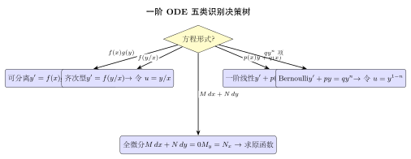
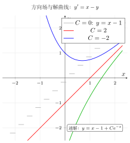
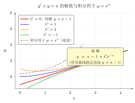
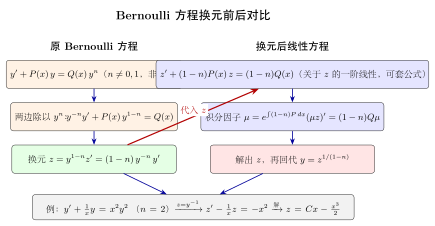

# 第23章 一阶微分方程

> **一例速记：5 类一阶 ODE 标准型 + 对应求解法**
>
> | 类型 | 标准形式 | 求解方法 |
> |------|----------|----------|
> | 可分离 | $y'=f(x)g(y)$ | 分离变量：$\frac{dy}{g(y)}=f(x)\,dx$，两边积分 |
> | 齐次 | $y'=f(y/x)$ | 令 $u=y/x$，化为可分离方程 |
> | 一阶线性 | $y'+p(x)y=q(x)$ | 积分因子 $\mu=e^{\int p\,dx}$，通解 $y=\frac{1}{\mu}\bigl[\int\mu q\,dx+C\bigr]$ |
> | Bernoulli | $y'+py=qy^n$ | 令 $u=y^{1-n}$，化为线性方程 |
> | 全微分 | $M\,dx+N\,dy=0$，$M_y=N_x$ | 求原函数 $u$，通解 $u(x,y)=C$ |

---

## 引入：解 $y' + 2y = e^x$

> **题目**：求方程 $y' + 2y = e^x$ 的通解。（一阶线性方程，$p(x)=2$，$q(x)=e^x$）

## 思维路径还原

> "看到 $y' + 2y = e^x$，右边不是零，这是**非齐次一阶线性方程**。
>
> **第一步：识别类型**。$y' + p(x)y = q(x)$ 的标准形式，$p(x)=2$（常数），$q(x)=e^x$。
>
> **第二步：计算积分因子**。$\mu = e^{\int p\,dx} = e^{\int 2\,dx} = e^{2x}$。
>
> **第三步：乘以积分因子**。两边乘 $\mu=e^{2x}$：
>
> $$e^{2x}y' + 2e^{2x}y = e^{2x}\cdot e^x = e^{3x}$$
>
> **第四步：识别左边为乘积导数**。注意 $(e^{2x}y)' = e^{2x}y' + 2e^{2x}y$，所以：
>
> $$(e^{2x}y)' = e^{3x}$$
>
> **第五步：两边积分**。
>
> $$e^{2x}y = \int e^{3x}\,dx = \frac{1}{3}e^{3x} + C$$
>
> **第六步：解出 $y$**。两边除以 $e^{2x}$：
>
> $$y = \frac{1}{3}e^x + Ce^{-2x}$$
>
> **验证**：$y' = \frac{1}{3}e^x - 2Ce^{-2x}$，代入 $y'+2y = \frac{1}{3}e^x - 2Ce^{-2x} + \frac{2}{3}e^x + 2Ce^{-2x} = e^x$。正确！
>
> **结构**：通解 $= \underbrace{Ce^{-2x}}_{\text{齐次通解}} + \underbrace{\frac{1}{3}e^x}_{\text{特解}}$，这正是非齐次方程通解结构定理的体现。"

---

## 学习目标

通过本章学习，你将能够：

- 理解微分方程的基本概念，包括阶、解、通解、特解
- 掌握可分离变量方程的求解方法
- 掌握一阶线性微分方程的通解公式和常数变易法
- 了解Bernoulli方程的变量代换技巧
- 理解全微分方程的判定条件和求解方法

---

## 23.1 微分方程的基本概念

### 23.1.1 微分方程的定义

**定义**（微分方程）：含有未知函数及其导数的方程称为**微分方程**。

若未知函数是一元函数，称为**常微分方程**；若未知函数是多元函数，称为**偏微分方程**。本章只讨论常微分方程。

**例子**：

- $\dfrac{dy}{dx} = 2x$ 是微分方程
- $y'' + 2y' + y = 0$ 是微分方程
- $\dfrac{\partial^2 u}{\partial x^2} + \dfrac{\partial^2 u}{\partial y^2} = 0$ 是偏微分方程

### 23.1.2 阶的概念

**定义**（阶）：微分方程中出现的未知函数导数的最高阶数称为该微分方程的**阶**。

- $y' = x^2$：一阶微分方程
- $y'' + y = 0$：二阶微分方程
- $y''' - 3y'' + 2y' = e^x$：三阶微分方程

一阶微分方程的一般形式为 $F(x, y, y') = 0$，或显式形式 $y' = f(x, y)$。

### 23.1.3 解、通解与特解

**定义**（解）：若函数 $y = \varphi(x)$ 代入微分方程后使之成为恒等式，则称 $y = \varphi(x)$ 是该微分方程的**解**。

**定义**（通解）：若微分方程的解中含有任意常数，且任意常数的个数等于微分方程的阶数，则称这个解为**通解**。

**定义**（特解）：不含任意常数的解称为**特解**。特解是通解在某个特定常数值下的具体形式。

> **例题 23.1** 验证 $y = Ce^{2x}$（$C$ 为任意常数）是微分方程 $y' = 2y$ 的通解。

**解**：将 $y = Ce^{2x}$ 代入方程。

左边：$y' = 2Ce^{2x}$

右边：$2y = 2Ce^{2x}$

左边 $=$ 右边，故 $y = Ce^{2x}$ 是方程的解。由于含有一个任意常数，且方程是一阶的，故为通解。 $\square$

### 23.1.4 初值问题

**定义**（初值问题）：求满足初始条件 $y(x_0) = y_0$ 的微分方程的解，称为**初值问题**，记作

$$\begin{cases} y' = f(x, y) \\ y(x_0) = y_0 \end{cases}$$

初值问题的解是满足初始条件的特解。

> **例题 23.2** 求初值问题 $\begin{cases} y' = 2y \\ y(0) = 3 \end{cases}$ 的解。

**解**：由例题 23.1，通解为 $y = Ce^{2x}$。

代入初始条件 $y(0) = 3$：$Ce^0 = 3$，故 $C = 3$。

特解为 $y = 3e^{2x}$。 $\square$

### 23.1.5 解的存在唯一性定理

初值问题是否一定有解？解是否唯一？这是微分方程理论中最基本的问题。

**定理 23.1**（Picard-Lindelöf 定理，解的存在唯一性定理）：考虑初值问题

$$\begin{cases} y' = f(x, y) \\ y(x_0) = y_0 \end{cases}$$

设函数 $f(x, y)$ 在矩形区域

$$R = \{(x, y) \mid |x - x_0| \leq a, \, |y - y_0| \leq b\}$$

上满足以下两个条件：

1. $f(x, y)$ 在 $R$ 上连续
2. $f(x, y)$ 在 $R$ 上关于 $y$ 满足 **Lipschitz 条件**：存在常数 $L > 0$，使得对 $R$ 内任意 $(x, y_1)$ 和 $(x, y_2)$，有

$$|f(x, y_1) - f(x, y_2)| \leq L|y_1 - y_2|$$

则初值问题在区间 $|x - x_0| \leq h = \min\left(a, \dfrac{b}{M}\right)$ 上存在**唯一**解，其中 $M = \max_{(x,y) \in R} |f(x, y)|$。

**注**：若 $f(x, y)$ 关于 $y$ 的偏导数 $f_y(x, y)$ 在 $R$ 上连续（从而有界），则 Lipschitz 条件自动满足——可取 $L = \max_{R} |f_y|$。这是因为由中值定理，$|f(x, y_1) - f(x, y_2)| = |f_y(x, \bar{y})| \cdot |y_1 - y_2| \leq L|y_1 - y_2|$。

**几何直观**：解的唯一性意味着在 $(x, y)$ 平面上，过点 $(x_0, y_0)$ 的积分曲线只有一条。等价地说，**不同的积分曲线不会相交**。若两条积分曲线在某点相交，则它们在该点具有相同的初值，由唯一性定理，它们必须是同一条曲线。

> **例题 23.3** 考虑初值问题 $\begin{cases} y' = x^2 + y^2 \\ y(0) = 0 \end{cases}$，验证其满足解的存在唯一性条件。

**解**：取 $f(x, y) = x^2 + y^2$，$x_0 = 0$，$y_0 = 0$。

在任意矩形区域 $R = \{(x, y) \mid |x| \leq a, |y| \leq b\}$ 上：

（1）$f(x, y) = x^2 + y^2$ 是多项式，在 $R$ 上显然连续。

（2）$f_y(x, y) = 2y$ 在 $R$ 上连续，故 $f$ 关于 $y$ 满足 Lipschitz 条件，Lipschitz 常数可取 $L = 2b$。

因此由 Picard-Lindelöf 定理，初值问题在 $x_0 = 0$ 附近存在唯一解。 $\square$

> **例题 23.4** 考虑初值问题 $\begin{cases} y' = 2\sqrt{|y|} \\ y(0) = 0 \end{cases}$，讨论其解的唯一性。

**解**：取 $f(x, y) = 2\sqrt{|y|}$，$x_0 = 0$，$y_0 = 0$。

$f(x, y) = 2\sqrt{|y|}$ 在 $y = 0$ 处连续但不满足关于 $y$ 的 Lipschitz 条件。事实上，

$$\frac{|f(x, y_1) - f(x, y_2)|}{|y_1 - y_2|} = \frac{2|\sqrt{|y_1|} - \sqrt{|y_2|}|}{|y_1 - y_2|}$$

当 $y_1 \to 0$、$y_2 = 0$ 时，上式 $= \dfrac{2}{\sqrt{|y_1|}} \to +\infty$，即 Lipschitz 常数不存在。

果然，该初值问题有无穷多个解。例如：

- $y_1(x) \equiv 0$（零解）
- $y_2(x) = x^2$（验证：$y_2' = 2x = 2\sqrt{x^2} = 2\sqrt{|y_2|}$，当 $x \geq 0$）
- 更一般地，对任意 $c \geq 0$，$y(x) = \begin{cases} 0, & x \leq c \\ (x - c)^2, & x > c \end{cases}$ 都是解

这说明 Lipschitz 条件不满足时，唯一性可能丧失。 $\square$

**奇解的概念**：若微分方程 $y' = f(x, y)$ 的某个特解 $y = \varphi(x)$ 不能由通解通过取任何特定常数值得到，则称 $y = \varphi(x)$ 为方程的**奇解**。奇解上的每一点都与通解的某条积分曲线相切。从存在唯一性定理的角度看，奇解通过的点恰好是 $f(x, y)$ 不满足 Lipschitz 条件的点。例如，方程 $y' = 2\sqrt{|y|}$ 的通解为 $y = (x - c)^2$（$c$ 为任意常数），而 $y = 0$ 是其奇解，它是所有抛物线 $y = (x - c)^2$ 的公切线（包络线）。

---

## 23.2 可分离变量方程

### 23.2.1 方程形式

**定义**：形如

$$\frac{dy}{dx} = f(x)g(y)$$

的方程称为**可分离变量方程**，其中 $f(x)$ 只含 $x$，$g(y)$ 只含 $y$。

### 23.2.2 求解方法

**步骤**：

1. 分离变量：将方程改写为 $\dfrac{dy}{g(y)} = f(x) \, dx$（设 $g(y) \neq 0$）
2. 两边积分：$\displaystyle\int \frac{dy}{g(y)} = \int f(x) \, dx$
3. 求出积分后得到通解

**注意**：若 $g(y_0) = 0$，则 $y = y_0$ 也是方程的解（常数解）。

### 23.2.3 例题详解

> **例题 23.5** 求方程 $\dfrac{dy}{dx} = xy$ 的通解。

**解**：这是可分离变量方程，$f(x) = x$，$g(y) = y$。

当 $y \neq 0$ 时，分离变量：

$$\frac{dy}{y} = x \, dx$$

两边积分：

$$\int \frac{dy}{y} = \int x \, dx$$

$$\ln|y| = \frac{x^2}{2} + C_1$$

$$|y| = e^{\frac{x^2}{2} + C_1} = e^{C_1} \cdot e^{\frac{x^2}{2}}$$

令 $C = \pm e^{C_1}$（$C \neq 0$），则 $y = Ce^{\frac{x^2}{2}}$。

当 $y = 0$ 时，显然也是方程的解，对应 $C = 0$。

因此通解为 $y = Ce^{\frac{x^2}{2}}$，$C$ 为任意常数。 $\square$

> **例题 23.6** 求初值问题 $\begin{cases} \dfrac{dy}{dx} = \dfrac{2x}{y} \\ y(0) = 2 \end{cases}$ 的解。

**解**：分离变量：$y \, dy = 2x \, dx$

两边积分：

$$\int y \, dy = \int 2x \, dx$$

$$\frac{y^2}{2} = x^2 + C$$

即 $y^2 = 2x^2 + C'$（$C' = 2C$）。

代入初始条件 $y(0) = 2$：$4 = 0 + C'$，故 $C' = 4$。

因此特解为 $y^2 = 2x^2 + 4$，即 $y = \sqrt{2x^2 + 4}$（取正根，因为 $y(0) = 2 > 0$）。 $\square$

> **例题 23.7** 求方程 $\dfrac{dy}{dx} = e^{x-y}$ 的通解。

**解**：改写为 $\dfrac{dy}{dx} = e^x \cdot e^{-y}$。

分离变量：$e^y \, dy = e^x \, dx$

两边积分：

$$\int e^y \, dy = \int e^x \, dx$$

$$e^y = e^x + C$$

通解为 $y = \ln(e^x + C)$，其中 $e^x + C > 0$。 $\square$

---

## 23.3 一阶线性方程

### 23.3.1 齐次方程

**定义**：形如

$$y' + P(x)y = 0$$

的方程称为**一阶齐次线性方程**。

**求解**：这是可分离变量方程。

$$\frac{dy}{y} = -P(x) \, dx$$

$$\ln|y| = -\int P(x) \, dx + C_1$$

$$y = Ce^{-\int P(x) \, dx}$$

其中 $C$ 为任意常数。

### 23.3.2 非齐次方程

**定义**：形如

$$y' + P(x)y = Q(x)$$

的方程称为**一阶非齐次线性方程**，其中 $Q(x) \not\equiv 0$。

### 23.3.3 常数变易法

**思想**：将齐次方程的通解 $y = Ce^{-\int P(x) \, dx}$ 中的常数 $C$ 换成 $x$ 的函数 $C(x)$，设

$$y = C(x) \cdot e^{-\int P(x) \, dx}$$

代入非齐次方程求出 $C(x)$。

**推导**：设 $y = C(x) \cdot e^{-\int P(x) \, dx}$，则

$$y' = C'(x) \cdot e^{-\int P(x) \, dx} + C(x) \cdot e^{-\int P(x) \, dx} \cdot (-P(x))$$

代入 $y' + P(x)y = Q(x)$：

$$C'(x) \cdot e^{-\int P(x) \, dx} - P(x) \cdot C(x) \cdot e^{-\int P(x) \, dx} + P(x) \cdot C(x) \cdot e^{-\int P(x) \, dx} = Q(x)$$

化简得：

$$C'(x) \cdot e^{-\int P(x) \, dx} = Q(x)$$

$$C'(x) = Q(x) \cdot e^{\int P(x) \, dx}$$

$$C(x) = \int Q(x) \cdot e^{\int P(x) \, dx} \, dx + C_0$$

### 23.3.4 通解公式

一阶线性方程 $y' + P(x)y = Q(x)$ 的通解为：

$$\boxed{y = e^{-\int P(x) \, dx} \left[ \int Q(x) \cdot e^{\int P(x) \, dx} \, dx + C \right]}$$

**结构分析**：

- 当 $Q(x) \equiv 0$ 时，通解退化为 $y = Ce^{-\int P(x) \, dx}$（齐次方程的通解）
- 非齐次方程的通解 $=$ 齐次方程的通解 $+$ 非齐次方程的一个特解

> **例题 23.8** 求方程 $y' + \dfrac{y}{x} = x^2$ 的通解。

**解**：这是一阶线性方程，$P(x) = \dfrac{1}{x}$，$Q(x) = x^2$。

计算 $\displaystyle\int P(x) \, dx = \int \frac{dx}{x} = \ln|x|$。

$$e^{\int P(x) \, dx} = e^{\ln|x|} = |x|$$

$$e^{-\int P(x) \, dx} = \frac{1}{|x|}$$

由通解公式：

$$y = \frac{1}{|x|} \left[ \int x^2 \cdot |x| \, dx + C \right]$$

在 $x > 0$ 时：

$$y = \frac{1}{x} \left[ \int x^3 \, dx + C \right] = \frac{1}{x} \left[ \frac{x^4}{4} + C \right] = \frac{x^3}{4} + \frac{C}{x}$$

通解为 $y = \dfrac{x^3}{4} + \dfrac{C}{x}$。 $\square$

> **例题 23.9** 求初值问题 $\begin{cases} y' - 2xy = x \\ y(0) = 1 \end{cases}$ 的解。

**解**：$P(x) = -2x$，$Q(x) = x$。

$$\int P(x) \, dx = \int (-2x) \, dx = -x^2$$

$$e^{\int P(x) \, dx} = e^{-x^2}, \quad e^{-\int P(x) \, dx} = e^{x^2}$$

通解：

$$y = e^{x^2} \left[ \int x \cdot e^{-x^2} \, dx + C \right]$$

计算 $\displaystyle\int x \cdot e^{-x^2} \, dx = -\frac{1}{2} e^{-x^2}$。

$$y = e^{x^2} \left[ -\frac{1}{2} e^{-x^2} + C \right] = -\frac{1}{2} + Ce^{x^2}$$

代入 $y(0) = 1$：$1 = -\dfrac{1}{2} + C$，故 $C = \dfrac{3}{2}$。

特解为 $y = -\dfrac{1}{2} + \dfrac{3}{2}e^{x^2}$。 $\square$

---

## 23.4 Bernoulli方程

### 23.4.1 方程形式

**定义**：形如

$$y' + P(x)y = Q(x)y^n \quad (n \neq 0, 1)$$

的方程称为**Bernoulli方程**。

当 $n = 0$ 或 $n = 1$ 时，方程退化为一阶线性方程。

### 23.4.2 变量代换法

**方法**：将方程两边除以 $y^n$：

$$y^{-n} y' + P(x) y^{1-n} = Q(x)$$

设 $z = y^{1-n}$，则 $z' = (1-n) y^{-n} y'$，即 $y^{-n} y' = \dfrac{z'}{1-n}$。

代入得：

$$\frac{z'}{1-n} + P(x) z = Q(x)$$

即：

$$z' + (1-n)P(x) z = (1-n)Q(x)$$

这是关于 $z$ 的一阶线性方程，可用通解公式求解。

> **例题 23.10** 求方程 $y' + \dfrac{y}{x} = x^2 y^2$ 的通解。

**解**：这是 Bernoulli 方程，$n = 2$，$P(x) = \dfrac{1}{x}$，$Q(x) = x^2$。

两边除以 $y^2$：

$$y^{-2} y' + \frac{1}{x} y^{-1} = x^2$$

设 $z = y^{-1}$，则 $z' = -y^{-2} y'$，即 $y^{-2} y' = -z'$。

代入：

$$-z' + \frac{z}{x} = x^2$$

即：

$$z' - \frac{z}{x} = -x^2$$

这是关于 $z$ 的一阶线性方程，$P(x) = -\dfrac{1}{x}$，$Q(x) = -x^2$。

$$\int P(x) \, dx = -\ln|x|, \quad e^{\int P(x) \, dx} = \frac{1}{|x|}$$

通解：

$$z = |x| \left[ \int (-x^2) \cdot \frac{1}{|x|} \, dx + C \right]$$

在 $x > 0$ 时：

$$z = x \left[ \int (-x) \, dx + C \right] = x \left[ -\frac{x^2}{2} + C \right] = -\frac{x^3}{2} + Cx$$

由 $z = y^{-1}$，得 $y = \dfrac{1}{z} = \dfrac{1}{Cx - \frac{x^3}{2}} = \dfrac{2}{2Cx - x^3}$。

通解为 $y = \dfrac{2}{2Cx - x^3}$（可将 $2C$ 记为新常数）。 $\square$

---

## 23.5 全微分方程

### 23.5.1 恰当方程的判定

考虑一阶微分方程的一般形式：

$$M(x, y) \, dx + N(x, y) \, dy = 0$$

**定义**（恰当方程）：若存在二元函数 $u(x, y)$，使得

$$du = M(x, y) \, dx + N(x, y) \, dy$$

则称原方程为**恰当方程**（或**全微分方程**）。此时方程的通解为 $u(x, y) = C$。

**定理**（恰当方程的判定）：设 $M(x, y)$ 和 $N(x, y)$ 在单连通区域 $D$ 上有连续的一阶偏导数，则方程 $M \, dx + N \, dy = 0$ 是恰当方程的充要条件是：

$$\boxed{\frac{\partial M}{\partial y} = \frac{\partial N}{\partial x}}$$

### 23.5.2 求解方法

若方程是恰当方程，则存在 $u(x, y)$ 使得 $\dfrac{\partial u}{\partial x} = M$，$\dfrac{\partial u}{\partial y} = N$。

**方法一**（偏积分法）：

1. 对 $M$ 关于 $x$ 积分：$u = \displaystyle\int M \, dx + \varphi(y)$
2. 对 $u$ 关于 $y$ 求偏导：$\dfrac{\partial u}{\partial y} = \dfrac{\partial}{\partial y} \int M \, dx + \varphi'(y) = N$
3. 解出 $\varphi(y)$，得到 $u(x, y)$

**方法二**（曲线积分法）：

$$u(x, y) = \int_{(x_0, y_0)}^{(x, y)} M \, dx + N \, dy$$

通常取 $(x_0, y_0) = (0, 0)$ 并沿折线积分。

> **例题 23.11** 求方程 $(2x + y) \, dx + (x + 2y) \, dy = 0$ 的通解。

**解**：$M = 2x + y$，$N = x + 2y$。

检验：$\dfrac{\partial M}{\partial y} = 1$，$\dfrac{\partial N}{\partial x} = 1$。

由于 $\dfrac{\partial M}{\partial y} = \dfrac{\partial N}{\partial x}$，这是恰当方程。

用偏积分法求 $u(x, y)$：

$$u = \int (2x + y) \, dx = x^2 + xy + \varphi(y)$$

对 $y$ 求偏导：

$$\frac{\partial u}{\partial y} = x + \varphi'(y) = N = x + 2y$$

故 $\varphi'(y) = 2y$，$\varphi(y) = y^2$。

因此 $u(x, y) = x^2 + xy + y^2$。

通解为 $x^2 + xy + y^2 = C$。 $\square$

### 23.5.3 积分因子简介

若方程 $M \, dx + N \, dy = 0$ 不是恰当方程，有时可以找到一个函数 $\mu(x, y)$，使得

$$\mu M \, dx + \mu N \, dy = 0$$

成为恰当方程。这样的 $\mu$ 称为**积分因子**。

**特殊情形**：

- 若 $\dfrac{\frac{\partial M}{\partial y} - \frac{\partial N}{\partial x}}{N}$ 仅是 $x$ 的函数 $g(x)$，则 $\mu = e^{\int g(x) \, dx}$
- 若 $\dfrac{\frac{\partial N}{\partial x} - \frac{\partial M}{\partial y}}{M}$ 仅是 $y$ 的函数 $h(y)$，则 $\mu = e^{\int h(y) \, dy}$

> **例题 23.12** 求方程 $y \, dx - x \, dy = 0$ 的通解。

**解**：$M = y$，$N = -x$。

检验：$\dfrac{\partial M}{\partial y} = 1$，$\dfrac{\partial N}{\partial x} = -1$，不相等，不是恰当方程。

计算 $\dfrac{\frac{\partial M}{\partial y} - \frac{\partial N}{\partial x}}{N} = \dfrac{1 - (-1)}{-x} = -\dfrac{2}{x}$，仅是 $x$ 的函数。

积分因子 $\mu = e^{\int -\frac{2}{x} \, dx} = e^{-2\ln|x|} = \dfrac{1}{x^2}$。

乘以积分因子：

$$\frac{y}{x^2} \, dx - \frac{1}{x} \, dy = 0$$

验证：$M_1 = \dfrac{y}{x^2}$，$N_1 = -\dfrac{1}{x}$。

$\dfrac{\partial M_1}{\partial y} = \dfrac{1}{x^2}$，$\dfrac{\partial N_1}{\partial x} = \dfrac{1}{x^2}$，相等。

用偏积分法：

$$u = \int \frac{y}{x^2} \, dx = -\frac{y}{x} + \varphi(y)$$

$$\frac{\partial u}{\partial y} = -\frac{1}{x} + \varphi'(y) = -\frac{1}{x}$$

故 $\varphi'(y) = 0$，$\varphi(y) = 0$。

通解为 $-\dfrac{y}{x} = C$，即 $y = Cx$。 $\square$

---

## 23.6 常微分方程组

### 23.6.1 向量形式与高阶方程化一阶系统

一阶常微分方程并不一定只有一个未知函数。更一般地，我们常写成向量形式：

$$
\frac{d\mathbf{x}}{dt}=f(\mathbf{x},t),\qquad \mathbf{x}\in\mathbb R^n.
$$

这就是**常微分方程组**。它的重要性在于：

- 实际系统往往同时跟踪多个状态变量
- 高阶方程可以统一改写为一阶系统
- Neural ODE、控制系统、动力系统都天然采用这种形式

例如二阶方程

$$
mx''+cx'+kx=0
$$

令 $x_1=x,\ x_2=x'$，则

$$
\begin{cases}
x_1' = x_2,\\
x_2' = -\dfrac{k}{m}x_1-\dfrac{c}{m}x_2.
\end{cases}
$$

这就把二阶方程转化为了二维一阶系统。

### 23.6.2 线性系统与矩阵指数

最基本的一阶系统是

$$
\frac{d\mathbf{x}}{dt}=A\mathbf{x},
$$

其中 $A$ 是常矩阵。它的解可写成

$$
\mathbf{x}(t)=e^{At}\mathbf{x}(0),
$$

这里

$$
e^{At}=I+At+\frac{(At)^2}{2!}+\frac{(At)^3}{3!}+\cdots
$$

称为**矩阵指数**。

若 $A=P\Lambda P^{-1}$ 可对角化，则

$$
e^{At}=Pe^{\Lambda t}P^{-1},
$$

而 $e^{\Lambda t}$ 只需对角元逐个指数化即可。

**特征值决定动态行为**：

- $\mathrm{Re}(\lambda)<0$：衰减，系统稳定
- $\mathrm{Re}(\lambda)>0$：增长，系统不稳定
- $\mathrm{Re}(\lambda)=0$：振荡或临界情况

> **例题 23.13** 求解系统
 $$
 \frac{d}{dt}
 \begin{bmatrix}
 x\\y
 \end{bmatrix}
 =
 \begin{bmatrix}
 0 & 1\\
 -2 & -3
 \end{bmatrix}
 \begin{bmatrix}
 x\\y
 \end{bmatrix}.
 $$

**解**：矩阵的特征方程为

$$
\lambda^2+3\lambda+2=0,
$$

解得 $\lambda_1=-1,\ \lambda_2=-2$，都为负，因此系统稳定。

把它理解成方程 $x''+3x'+2x=0$，则

$$
x(t)=C_1e^{-t}+C_2e^{-2t},
$$

再由 $y=x'$ 得

$$
y(t)=-C_1e^{-t}-2C_2e^{-2t}.
$$

这就是系统通解。$\square$

### 23.6.3 AI 应用：Neural ODE、数值求解与稳定性

Neural ODE 的真实形式并不是单个标量方程，而是高维系统：

$$
\frac{d\mathbf{h}(t)}{dt}=f_\theta(\mathbf{h}(t),t),
$$

其中 $\mathbf{h}(t)\in\mathbb R^n$ 是隐藏状态。

实际求解时，需要数值方法：

- **Euler 法**
  $$
  x_{n+1}=x_n+h f(x_n,t_n)
  $$
- **四阶 Runge-Kutta（RK4）**
  精度更高，但每一步计算更多
- **自适应步长方法**
  在简单区域用大步，在剧烈变化区用小步

这恰好对应深度学习里的工程权衡：

- 步数少，速度快，但误差可能大
- 步数多，精度高，但计算更慢

从 ResNet 角度看，

$$
h_{k+1}=h_k+f(h_k)
$$

就像对连续系统做一步 Euler 离散化。于是“层数很深的残差网络”可以看作“连续动力系统的离散近似”。

稳定性也与 Jacobian 特征值有关：若局部线性化后特征值实部过大，数值积分与训练都更容易不稳定。

---

## 几何示意

| 图示 | 说明 |
|------|------|
|  | **图 23-1**：5 类一阶 ODE 识别决策树——从方程形式出发，沿分支找到对应求解策略 |
|  | **图 23-2**：$y'=x-y$ 的方向场与解曲线族。箭头表示斜率场，彩色曲线是不同 $C$ 值的通解 $y=x-1+Ce^{-x}$，均趋向平衡线 $y=x-1$ |
|  | **图 23-3**：$y'+y=x$ 的解族。所有解渐近收敛到特解 $y=x-1$（$C=0$），积分因子 $\mu=e^x$ 将方程化为 $(\mu y)'=\mu x$ |
|  | **图 23-4**：Bernoulli 方程换元前后对比——换元 $z=y^{1-n}$ 将非线性方程线性化的完整流程 |

---

## 本章小结

1. **微分方程基本概念**：
   - 阶：导数的最高阶数
   - 通解：含有与阶数相同个数任意常数的解
   - 特解：满足初始条件的解

2. **可分离变量方程** $\dfrac{dy}{dx} = f(x)g(y)$：分离变量后两边积分。

3. **一阶线性方程** $y' + P(x)y = Q(x)$：
   - 通解公式：$y = e^{-\int P \, dx} \left[ \int Q \cdot e^{\int P \, dx} \, dx + C \right]$
   - 常数变易法：将齐次通解中的常数换成函数

4. **Bernoulli方程** $y' + P(x)y = Q(x)y^n$：令 $z = y^{1-n}$ 化为一阶线性方程。

5. **全微分方程** $M \, dx + N \, dy = 0$：
   - 恰当条件：$\dfrac{\partial M}{\partial y} = \dfrac{\partial N}{\partial x}$
   - 不恰当时可尝试找积分因子

6. **常微分方程组**：
   - 向量形式统一描述多状态系统
   - 高阶 ODE 可转化为一阶系统
   - 线性系统的动态由矩阵特征值决定

---

## 思考路标（条件反射）

> **见到以下特征，立即触发对应动作：**

1. **识别方程类型（5 类）**：第一步永远是判断方程形式——能分离变量？是 $y/x$ 型？有积分因子？含 $y^n$？$M_y=N_x$？一旦识别，套固定公式。

2. **可分离变量**：$y'=f(x)g(y)$——见到"$x$ 的函数"乘"$y$ 的函数"，立即分离：$\frac{dy}{g(y)}=f(x)\,dx$，两边积分。

3. **齐次方程换元 $u=y/x$**：见到 $y'=f(y/x)$ 或分子分母均为 $x,y$ 的同次多项式，令 $u=y/x$，$y=ux$，$y'=u+xu'$，化为可分离方程。

4. **一阶线性积分因子**：见到 $y'+p(x)y=q(x)$，立即算 $\mu=e^{\int p\,dx}$，乘以 $\mu$ 后左边自动变成 $(\mu y)'$，右边积分即可。

5. **Bernoulli 方程**：见到 $y'+py=qy^n$（$n\neq0,1$），立即令 $u=y^{1-n}$，化为线性方程 $u'+(1-n)pu=(1-n)q$。

6. **初值条件代入顺序**：先求通解（含任意常数 $C$），再将初值 $(x_0,y_0)$ 代入通解求 $C$，得到特解。绝不在积分过程中就"令 $C=$ 初值"。

7. **全微分恰当方程**：先验证 $M_y=N_x$（充要条件），再用偏积分法求原函数 $u$，通解 $u(x,y)=C$。

8. **Lipschitz 解的唯一性**：若 $f_y$ 在矩形域上连续有界，则初值问题局部唯一有解；若 $f_y$ 在初值点附近无界（如 $f=\sqrt{|y|}$ 在 $y=0$），唯一性可能丧失。

---

## 易错点（⚠ 红色警报）

1. **可分离 vs 齐次混淆**：$y'=\frac{y}{x}$ 既是可分离也是齐次（两种方法均可），但 $y'=\frac{x+y}{x}=1+\frac{y}{x}$ 是齐次而非可分离——须先判断能否直接分离，不能则考虑换元。

2. **积分因子忘乘到方程两边**：$\mu$ 必须同时乘以等号左右两边，否则方程改变。常见错误是只改写左边为 $(\mu y)'$ 而忘记右边变成 $\mu q(x)$。

3. **常数 $C$ 与初值代入顺序**：错误做法：积分时令积分常数直接等于初值。正确做法：保留常数 $C$ 完成积分，得通解后再代入初始条件求 $C$。

4. **全微分须先验恰当**：不验证 $M_y=N_x$ 就直接"求原函数"是无意义的。若条件不满足，需先找积分因子再变恰当方程。

5. **隐式解 vs 显式解**：全微分方程的通解 $u(x,y)=C$ 是隐式解，不要强行解出 $y$——有时无法显式表达，或解出后会损失部分解。正确做法是将隐式通解视为最终结果。

---

## 深度学习应用

### 概念回顾

一阶微分方程描述了变量随时间或空间的瞬时变化率，是连续动态系统的基本数学语言。

### 在深度学习中的应用

#### 1. Neural ODE（神经常微分方程）

传统神经网络可以看作离散的状态更新：$h_{t+1} = h_t + f(h_t, \theta)$（类似ResNet）。当层数趋向无穷、步长趋向零时，这变成了一阶ODE：

$$\frac{dh(t)}{dt} = f(h(t), t, \theta)$$

Neural ODE用神经网络参数化 $f$，通过ODE求解器进行前向传播，反向传播则使用伴随方法（adjoint method）。

**优势**：
- 内存效率：不需要存储中间层
- 自适应计算：求解器自动调整步长
- 连续时间建模：自然处理不规则时间序列

#### 2. Continuous Normalizing Flows

标准化流（Normalizing Flows）通过可逆变换将简单分布映射到复杂分布。连续版本使用ODE：

$$\frac{dz(t)}{dt} = f(z(t), t)$$

概率密度的变化由瞬时变化公式给出：

$$\frac{\partial \log p(z(t))}{\partial t} = -\text{tr}\left(\frac{\partial f}{\partial z}\right)$$

这避免了离散流中对Jacobian行列式的计算限制。

#### 3. 梯度流与优化动力学

梯度下降可以看作ODE的离散化。连续时间梯度流为：

$$\frac{d\theta}{dt} = -\nabla_\theta \mathcal{L}(\theta)$$

分析这个ODE有助于理解：
- 收敛速度
- 稳定性条件
- 隐式正则化效果

### 代码示例（Python/PyTorch）

```python
import torch
import torch.nn as nn
from torchdiffeq import odeint  # 需要安装 torchdiffeq

# 定义ODE的右端函数（神经网络）
class ODEFunc(nn.Module):
    def __init__(self, hidden_dim):
        super().__init__()
        self.net = nn.Sequential(
            nn.Linear(hidden_dim, 64),
            nn.Tanh(),
            nn.Linear(64, hidden_dim)
        )

    def forward(self, t, h):
        # dh/dt = f(h, t)
        return self.net(h)

# Neural ODE 层
class NeuralODE(nn.Module):
    def __init__(self, func, t_span):
        super().__init__()
        self.func = func
        self.t_span = t_span  # 例如 torch.tensor([0., 1.])

    def forward(self, h0):
        # 求解 ODE: dh/dt = f(h,t), h(0) = h0
        # 返回 h(t_span[-1])
        solution = odeint(self.func, h0, self.t_span)
        return solution[-1]  # 最终状态

# 使用示例
hidden_dim = 16
batch_size = 32

func = ODEFunc(hidden_dim)
neural_ode = NeuralODE(func, torch.tensor([0., 1.]))

# 初始状态
h0 = torch.randn(batch_size, hidden_dim)

# 前向传播（通过ODE求解器）
h1 = neural_ode(h0)
print(f"输入形状: {h0.shape}, 输出形状: {h1.shape}")

# 连续梯度流可视化
def gradient_flow_1d(loss_fn, theta0, t_span, num_points=100):
    """
    可视化一维参数空间中的梯度流
    """
    import matplotlib.pyplot as plt

    # 定义梯度流 ODE
    def grad_flow(t, theta):
        theta_tensor = torch.tensor([theta], requires_grad=True)
        loss = loss_fn(theta_tensor)
        loss.backward()
        return -theta_tensor.grad.item()

    # 简单的 Euler 方法求解
    dt = (t_span[1] - t_span[0]) / num_points
    trajectory = [theta0]
    theta = theta0

    for _ in range(num_points):
        theta = theta + dt * grad_flow(0, theta)
        trajectory.append(theta)

    return trajectory

# 示例：二次损失函数的梯度流
loss_fn = lambda theta: (theta - 2.0) ** 2  # 最优点在 theta=2
trajectory = gradient_flow_1d(loss_fn, theta0=0.0, t_span=[0, 5])
print(f"梯度流轨迹: 从 {trajectory[0]:.2f} 收敛到 {trajectory[-1]:.2f}")
```

### 延伸阅读

- Chen et al., "Neural Ordinary Differential Equations" (NeurIPS 2018) - Neural ODE 开创性论文
- Grathwohl et al., "FFJORD: Free-form Continuous Dynamics for Scalable Reversible Generative Models" (ICLR 2019)
- Kidger, "On Neural Differential Equations" (PhD Thesis, 2022) - 全面综述

---

## 练习题

**1.** ⭐ 求方程 $\dfrac{dy}{dx} = \dfrac{y}{x + y^2}$ 的通解。

（提示：将 $x$ 看作 $y$ 的函数，方程变为 $\dfrac{dx}{dy} = \dfrac{x + y^2}{y}$）

**2.** ⭐ 求初值问题 $\begin{cases} y' + y\tan x = \sin 2x \\ y(0) = 1 \end{cases}$ 的解。

**3.** ⭐ 求方程 $y' + xy = xy^3$ 的通解。

**4.** ⭐⭐ 验证 $(3x^2 + 6xy^2) \, dx + (6x^2 y + 4y^3) \, dy = 0$ 是恰当方程，并求其通解。

**5.** ⭐⭐ 求方程 $(y + xy) \, dx + (x + xy) \, dy = 0$ 的通解。

（提示：先化简，再判断是否需要积分因子）

**6.** ⭐⭐ 将方程
$$
x''+5x'+6x=0
$$
改写为一阶系统。

**7.** ⭐⭐⭐ 求解线性系统

$$
\frac{d}{dt}
\begin{bmatrix}
x\\y
\end{bmatrix} = \begin{bmatrix}
1 & 0\\
0 & -2
\end{bmatrix}
\begin{bmatrix}
x\\y
\end{bmatrix}.
$$

**8.** ⭐⭐⭐ 编程题：用 Euler 法与 RK4 分别求解初值问题
$$
x'=-x,\qquad x(0)=1,
$$
比较在同样步数下两者对 $x(1)=e^{-1}$ 的误差。

---

## 练习答案

<details>
<summary>点击展开答案</summary>

**1.** 原方程可改写为 $\dfrac{dx}{dy} = \dfrac{x}{y} + y$，即 $\dfrac{dx}{dy} - \dfrac{x}{y} = y$。

这是关于 $x$ 的一阶线性方程，$P(y) = -\dfrac{1}{y}$，$Q(y) = y$。

$$\int P(y) \, dy = -\ln|y|, \quad e^{\int P \, dy} = \frac{1}{|y|}$$

通解：

$$x = |y| \left[ \int y \cdot \frac{1}{|y|} \, dy + C \right]$$

在 $y > 0$ 时：

$$x = y \left[ \int dy + C \right] = y(y + C) = y^2 + Cy$$

通解为 $x = y^2 + Cy$。

---

**2.** $P(x) = \tan x$，$Q(x) = \sin 2x = 2\sin x \cos x$。

$$\int P(x) \, dx = \int \tan x \, dx = -\ln|\cos x| = \ln|\sec x|$$

$$e^{\int P \, dx} = |\sec x|, \quad e^{-\int P \, dx} = |\cos x|$$

在 $x$ 靠近 $0$ 时，$\cos x > 0$：

$$y = \cos x \left[ \int 2\sin x \cos x \cdot \sec x \, dx + C \right] = \cos x \left[ 2\int \sin x \, dx + C \right]$$

$$= \cos x \left[ -2\cos x + C \right] = -2\cos^2 x + C\cos x$$

代入 $y(0) = 1$：$-2 \cdot 1 + C \cdot 1 = 1$，故 $C = 3$。

特解为 $y = -2\cos^2 x + 3\cos x$。

---

**3.** 这是 Bernoulli 方程，$n = 3$。

两边除以 $y^3$：$y^{-3} y' + xy^{-2} = x$。

设 $z = y^{-2}$，则 $z' = -2y^{-3} y'$，即 $y^{-3} y' = -\dfrac{z'}{2}$。

$$-\frac{z'}{2} + xz = x \Rightarrow z' - 2xz = -2x$$

$P(x) = -2x$，$Q(x) = -2x$。

$$\int P \, dx = -x^2, \quad e^{\int P \, dx} = e^{-x^2}$$

$$z = e^{x^2} \left[ \int (-2x) e^{-x^2} \, dx + C \right] = e^{x^2} \left[ e^{-x^2} + C \right] = 1 + Ce^{x^2}$$

由 $z = y^{-2}$，得 $y^2 = \dfrac{1}{1 + Ce^{x^2}}$，即 $y = \pm\dfrac{1}{\sqrt{1 + Ce^{x^2}}}$。

---

**4.** $M = 3x^2 + 6xy^2$，$N = 6x^2 y + 4y^3$。

$$\frac{\partial M}{\partial y} = 12xy, \quad \frac{\partial N}{\partial x} = 12xy$$

相等，是恰当方程。

$$u = \int (3x^2 + 6xy^2) \, dx = x^3 + 3x^2 y^2 + \varphi(y)$$

$$\frac{\partial u}{\partial y} = 6x^2 y + \varphi'(y) = 6x^2 y + 4y^3$$

故 $\varphi'(y) = 4y^3$，$\varphi(y) = y^4$。

通解为 $x^3 + 3x^2 y^2 + y^4 = C$。

---

**5.** 原方程可化简为 $y(1 + x) \, dx + x(1 + y) \, dy = 0$。

$M = y(1 + x) = y + xy$，$N = x(1 + y) = x + xy$。

$$\frac{\partial M}{\partial y} = 1 + x, \quad \frac{\partial N}{\partial x} = 1 + y$$

不相等，不是恰当方程。

尝试分离变量：

$$y(1 + x) \, dx = -x(1 + y) \, dy$$

$$\frac{1 + x}{x} \, dx = -\frac{1 + y}{y} \, dy$$

$$\left(\frac{1}{x} + 1\right) dx = -\left(\frac{1}{y} + 1\right) dy$$

两边积分：

$$
\ln|x| + x = -\ln|y| - y + C
$$

整理得

$$
\ln|x| + \ln|y| + x + y = C
$$

即

$$
\ln|xy| + x + y = C.
$$

这就是通解。

---

**6.** 令 $x_1=x,\ x_2=x'$，则

$$
\begin{cases}
x_1' = x_2,\\
x_2' = -5x_2-6x_1.
\end{cases}
$$

写成矩阵形式为

$$
\frac{d}{dt}
\begin{bmatrix}
x_1\\x_2
\end{bmatrix}
=
\begin{bmatrix}
0 & 1\\
-6 & -5
\end{bmatrix}
\begin{bmatrix}
x_1\\x_2
\end{bmatrix}.
$$

---

**7.** 这是对角系统，方程可分开求：

$$
x'=x,\qquad y'=-2y.
$$

故通解为

$$
x(t)=C_1e^t,\qquad y(t)=C_2e^{-2t}.
$$

因此

$$
\begin{bmatrix}
x(t)\\y(t)
\end{bmatrix}
=
\begin{bmatrix}
C_1e^t\\C_2e^{-2t}
\end{bmatrix}.
$$

---

**8.** Euler 法一步更新为

$$
x_{n+1}=x_n-hx_n=(1-h)x_n.
$$

RK4 对该线性方程的单步精度更高，局部截断误差为 $O(h^5)$，而 Euler 仅为 $O(h^2)$。因此在相同步数下，RK4 对真解 $e^{-1}$ 的近似通常明显更准。编程时可直接计算两者在 $t=1$ 的数值解，再与 $e^{-1}$ 比较误差大小。

</details>
