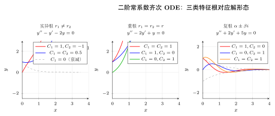
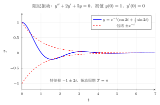
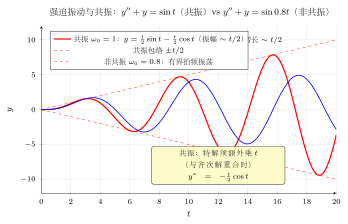
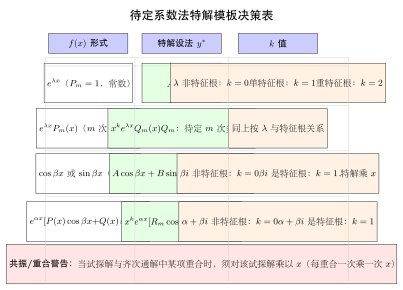

# 第24章 二阶线性微分方程

> **一例速记：特征方程 + 3 种根 + 非齐次待定系数**
>
> | 情形 | 特征根 | 齐次通解形式 |
> |------|--------|-------------|
> | 实异根 $r_1\neq r_2$ | $r^2+pr+q=0$，$\Delta>0$ | $y=C_1 e^{r_1 x}+C_2 e^{r_2 x}$ |
> | 重根 $r_1=r_2=r$ | $\Delta=0$ | $y=(C_1+C_2 x)e^{rx}$ |
> | 复根 $\alpha\pm\beta i$ | $\Delta<0$ | $y=e^{\alpha x}(C_1\cos\beta x+C_2\sin\beta x)$ |
>
> **非齐次方程**：通解 $=$ 齐次通解 $+$ 一个特解（待定系数法按 $f(x)$ 形式猜特解）
>
> - $f=e^{\lambda x}P_m(x)$：设 $y^*=x^k e^{\lambda x}Q_m$（$k=0,1,2$ 视 $\lambda$ 是否为特征根）
> - $f$ 含 $\cos/\sin$：必须同时设 $A\cos + B\sin$，若与齐次解重合再乘 $x$

---

## 引入：解 $y'' - 5y' + 6y = e^{4x}$

> **题目**：求方程 $y'' - 5y' + 6y = e^{4x}$ 的通解。（常系数非齐次二阶线性方程）

## 思维路径还原

> "看到 $y'' - 5y' + 6y = e^{4x}$，右边非零，这是**非齐次二阶常系数线性方程**。
>
> **第一步：解齐次方程**。写出特征方程：$r^2 - 5r + 6 = 0$。
>
> 分解：$(r-2)(r-3)=0$，特征根 $r_1=2$，$r_2=3$（实异根）。
>
> 齐次通解：$Y = C_1 e^{2x} + C_2 e^{3x}$。
>
> **第二步：求特解（待定系数法）**。$f(x)=e^{4x}$，对应 $\lambda=4$，$P_m=1$（零次多项式）。
>
> 问：$\lambda=4$ 是特征根吗？特征根是 $2$ 和 $3$，所以 $4$ 不是特征根，取 $k=0$。
>
> 设 $y^* = Ae^{4x}$。
>
> 计算：$(y^*)'' = 16Ae^{4x}$，$(y^*)' = 4Ae^{4x}$。
>
> 代入原方程：$16Ae^{4x} - 5\cdot 4Ae^{4x} + 6\cdot Ae^{4x} = e^{4x}$。
>
> $(16 - 20 + 6)A = 1$，即 $2A = 1$，故 $A = \dfrac{1}{2}$。
>
> 特解：$y^* = \dfrac{1}{2}e^{4x}$。
>
> **第三步：写通解**。通解 $=$ 齐次通解 $+$ 特解：
>
> $$y = C_1 e^{2x} + C_2 e^{3x} + \frac{1}{2}e^{4x}$$
>
> **验证**：$y'' - 5y' + 6y = (4C_1e^{2x}+9C_2e^{3x}+8e^{4x}) - 5(2C_1e^{2x}+3C_2e^{3x}+2e^{4x}) + 6(C_1e^{2x}+C_2e^{3x}+\frac{1}{2}e^{4x})$
>
> $= C_1(4-10+6)e^{2x} + C_2(9-15+6)e^{3x} + (8-10+3)e^{4x} = e^{4x}$。正确！"

---

## 学习目标

通过本章学习，你将能够：

- 理解二阶线性微分方程的结构，区分齐次与非齐次方程
- 掌握解的叠加原理和通解的结构定理
- 熟练运用特征方程法求解常系数齐次方程
- 掌握待定系数法求解常系数非齐次方程的特解
- 能够将弹簧振动和RLC电路问题转化为二阶微分方程求解

---

## 24.1 二阶线性方程的结构

### 24.1.1 齐次方程与非齐次方程

**定义**：二阶线性微分方程的一般形式为

$$y'' + P(x)y' + Q(x)y = f(x)$$

- 当 $f(x) \equiv 0$ 时，称为**二阶齐次线性方程**：$y'' + P(x)y' + Q(x)y = 0$
- 当 $f(x) \not\equiv 0$ 时，称为**二阶非齐次线性方程**

**术语**：与齐次方程 $y'' + P(x)y' + Q(x)y = 0$ 对应的非齐次方程称为其**对应的非齐次方程**，反之亦然。

### 24.1.2 解的叠加原理

**定理**（齐次方程解的叠加原理）：若 $y_1(x)$ 和 $y_2(x)$ 都是齐次方程 $y'' + P(x)y' + Q(x)y = 0$ 的解，则对任意常数 $C_1, C_2$，

$$y = C_1 y_1(x) + C_2 y_2(x)$$

也是该齐次方程的解。

**证明**：将 $y = C_1 y_1 + C_2 y_2$ 代入方程左边：

$$y'' + Py' + Qy = (C_1 y_1'' + C_2 y_2'') + P(C_1 y_1' + C_2 y_2') + Q(C_1 y_1 + C_2 y_2)$$

$$= C_1(y_1'' + Py_1' + Qy_1) + C_2(y_2'' + Py_2' + Qy_2) = C_1 \cdot 0 + C_2 \cdot 0 = 0$$

故 $y = C_1 y_1 + C_2 y_2$ 是方程的解。 $\square$

### 24.1.3 线性无关与Wronskian行列式

**定义**（线性无关）：两个函数 $y_1(x)$ 和 $y_2(x)$ 在区间 $I$ 上**线性无关**，如果 $\dfrac{y_1(x)}{y_2(x)} \neq$ 常数（在 $y_2 \neq 0$ 时）。

等价地，$y_1$ 和 $y_2$ 线性无关当且仅当：若 $C_1 y_1 + C_2 y_2 \equiv 0$，则必有 $C_1 = C_2 = 0$。

**定义**（Wronskian行列式）：对于两个可微函数 $y_1(x)$ 和 $y_2(x)$，定义其 **Wronskian行列式**为

$$W(y_1, y_2) = \begin{vmatrix} y_1 & y_2 \\ y_1' & y_2' \end{vmatrix} = y_1 y_2' - y_2 y_1'$$

**定理**：设 $y_1(x)$ 和 $y_2(x)$ 是齐次方程 $y'' + P(x)y' + Q(x)y = 0$ 的两个解，则：

1. 若 $W(y_1, y_2) \neq 0$（在某一点，从而在整个区间），则 $y_1, y_2$ 线性无关
2. 若 $y_1, y_2$ 线性无关，则 $W(y_1, y_2) \neq 0$

### 24.1.4 通解的结构定理

**定理**（齐次方程通解结构）：设 $y_1(x)$ 和 $y_2(x)$ 是齐次方程 $y'' + P(x)y' + Q(x)y = 0$ 的两个线性无关的解，则该方程的**通解**为

$$y = C_1 y_1(x) + C_2 y_2(x)$$

其中 $C_1, C_2$ 是任意常数。

**定理**（非齐次方程通解结构）：设 $y^*$ 是非齐次方程 $y'' + P(x)y' + Q(x)y = f(x)$ 的一个**特解**，$Y = C_1 y_1 + C_2 y_2$ 是对应齐次方程的**通解**，则非齐次方程的**通解**为

$$y = Y + y^* = C_1 y_1(x) + C_2 y_2(x) + y^*(x)$$

> **例题 24.1** 验证 $y_1 = e^x$ 和 $y_2 = e^{-x}$ 是方程 $y'' - y = 0$ 的两个线性无关解，并写出通解。

**解**：验证 $y_1 = e^x$ 是解：$y_1'' - y_1 = e^x - e^x = 0$。 ✓

验证 $y_2 = e^{-x}$ 是解：$y_2'' - y_2 = e^{-x} - e^{-x} = 0$。 ✓

计算Wronskian行列式：

$$W(y_1, y_2) = \begin{vmatrix} e^x & e^{-x} \\ e^x & -e^{-x} \end{vmatrix} = e^x \cdot (-e^{-x}) - e^{-x} \cdot e^x = -1 - 1 = -2 \neq 0$$

故 $y_1, y_2$ 线性无关，通解为 $y = C_1 e^x + C_2 e^{-x}$。 $\square$

---

## 24.2 常系数齐次方程

### 24.2.1 特征方程法

考虑**常系数齐次方程**：

$$y'' + py' + qy = 0$$

其中 $p, q$ 是常数。

**核心思想**：设 $y = e^{rx}$ 是方程的解，代入得：

$$r^2 e^{rx} + pr e^{rx} + q e^{rx} = 0$$

$$e^{rx}(r^2 + pr + q) = 0$$

由于 $e^{rx} \neq 0$，必有

$$\boxed{r^2 + pr + q = 0}$$

这称为原微分方程的**特征方程**，其根称为**特征根**。

### 24.2.2 三种情况

设特征方程的判别式 $\Delta = p^2 - 4q$。

**情况一：$\Delta > 0$，两个不相等实根 $r_1 \neq r_2$**

通解为：

$$\boxed{y = C_1 e^{r_1 x} + C_2 e^{r_2 x}}$$

> **例题 24.2** 求方程 $y'' - 5y' + 6y = 0$ 的通解。

**解**：特征方程为 $r^2 - 5r + 6 = 0$。

分解因式：$(r - 2)(r - 3) = 0$，得 $r_1 = 2$，$r_2 = 3$。

通解为 $y = C_1 e^{2x} + C_2 e^{3x}$。 $\square$

**情况二：$\Delta = 0$，两个相等实根 $r_1 = r_2 = r$**

此时只有一个解 $y_1 = e^{rx}$。需要找第二个线性无关解。

可以验证 $y_2 = xe^{rx}$ 也是方程的解（可用降阶法或直接代入验证）。

通解为：

$$\boxed{y = (C_1 + C_2 x) e^{rx}}$$

> **例题 24.3** 求方程 $y'' - 4y' + 4y = 0$ 的通解。

**解**：特征方程为 $r^2 - 4r + 4 = 0$，即 $(r - 2)^2 = 0$。

重根 $r = 2$。

通解为 $y = (C_1 + C_2 x) e^{2x}$。 $\square$

**情况三：$\Delta < 0$，共轭复根 $r_{1,2} = \alpha \pm \beta i$**

其中 $\alpha = -\dfrac{p}{2}$，$\beta = \dfrac{\sqrt{4q - p^2}}{2}$。

利用Euler公式 $e^{i\theta} = \cos\theta + i\sin\theta$，可得两个实值线性无关解：

$$y_1 = e^{\alpha x} \cos \beta x, \quad y_2 = e^{\alpha x} \sin \beta x$$

通解为：

$$\boxed{y = e^{\alpha x}(C_1 \cos \beta x + C_2 \sin \beta x)}$$

> **例题 24.4** 求方程 $y'' + 2y' + 5y = 0$ 的通解。

**解**：特征方程为 $r^2 + 2r + 5 = 0$。

$$r = \frac{-2 \pm \sqrt{4 - 20}}{2} = \frac{-2 \pm \sqrt{-16}}{2} = \frac{-2 \pm 4i}{2} = -1 \pm 2i$$

即 $\alpha = -1$，$\beta = 2$。

通解为 $y = e^{-x}(C_1 \cos 2x + C_2 \sin 2x)$。 $\square$

> **例题 24.5** 求初值问题 $\begin{cases} y'' + y = 0 \\ y(0) = 1, \ y'(0) = 0 \end{cases}$ 的解。

**解**：特征方程 $r^2 + 1 = 0$，得 $r = \pm i$（即 $\alpha = 0$，$\beta = 1$）。

通解为 $y = C_1 \cos x + C_2 \sin x$。

由 $y(0) = 1$：$C_1 = 1$。

$y' = -C_1 \sin x + C_2 \cos x$，由 $y'(0) = 0$：$C_2 = 0$。

特解为 $y = \cos x$。 $\square$

---

## 24.3 常系数非齐次方程

### 24.3.1 待定系数法

考虑**常系数非齐次方程**：

$$y'' + py' + qy = f(x)$$

根据通解结构定理，只需求出一个特解 $y^*$，再加上齐次方程的通解即可。

**待定系数法**的基本思想：根据 $f(x)$ 的形式，猜测特解 $y^*$ 的形式，代入方程确定待定系数。

### 24.3.2 类型一：$f(x) = e^{\lambda x} P_m(x)$

其中 $P_m(x)$ 是 $m$ 次多项式。

**特解形式**：设

$$y^* = x^k e^{\lambda x} Q_m(x)$$

其中 $Q_m(x)$ 是待定的 $m$ 次多项式，$k$ 的取值为：

- $k = 0$：若 $\lambda$ 不是特征根
- $k = 1$：若 $\lambda$ 是单特征根
- $k = 2$：若 $\lambda$ 是重特征根

> **例题 24.6** 求方程 $y'' - 3y' + 2y = e^{3x}$ 的一个特解。

**解**：特征方程 $r^2 - 3r + 2 = 0$，得 $r_1 = 1$，$r_2 = 2$。

$f(x) = e^{3x}$，这里 $\lambda = 3$，$P_m(x) = 1$（$m = 0$）。

由于 $\lambda = 3$ 不是特征根，取 $k = 0$。

设 $y^* = Ae^{3x}$。

代入方程：$9Ae^{3x} - 9Ae^{3x} + 2Ae^{3x} = e^{3x}$。

$2A = 1$，故 $A = \dfrac{1}{2}$。

特解为 $y^* = \dfrac{1}{2}e^{3x}$。 $\square$

> **例题 24.7** 求方程 $y'' - 2y' + y = xe^x$ 的一个特解。

**解**：特征方程 $r^2 - 2r + 1 = 0$，得重根 $r = 1$。

$f(x) = xe^x$，这里 $\lambda = 1$，$P_m(x) = x$（$m = 1$）。

由于 $\lambda = 1$ 是重特征根，取 $k = 2$。

设 $y^* = x^2(Ax + B)e^x = (Ax^3 + Bx^2)e^x$。

计算 $y^*{}'$ 和 $y^*{}''$（过程较繁，此处省略），代入方程后比较系数：

$6A = 1$，故 $A = \dfrac{1}{6}$，$B = 0$。

特解为 $y^* = \dfrac{1}{6}x^3 e^x$。 $\square$

### 24.3.3 类型二：$f(x) = e^{\alpha x}[P(x)\cos\beta x + Q(x)\sin\beta x]$

其中 $P(x), Q(x)$ 是多项式，设其最高次数为 $m$。

**特解形式**：设

$$y^* = x^k e^{\alpha x}[R_m(x)\cos\beta x + S_m(x)\sin\beta x]$$

其中 $R_m(x), S_m(x)$ 是待定的 $m$ 次多项式，$k$ 的取值为：

- $k = 0$：若 $\alpha + \beta i$ 不是特征根
- $k = 1$：若 $\alpha + \beta i$ 是特征根

> **例题 24.8** 求方程 $y'' + y = \cos x$ 的一个特解。

**解**：特征方程 $r^2 + 1 = 0$，得 $r = \pm i$。

$f(x) = \cos x$，这里 $\alpha = 0$，$\beta = 1$，$P(x) = 1$，$Q(x) = 0$。

由于 $\alpha + \beta i = i$ 是特征根，取 $k = 1$。

设 $y^* = x(A\cos x + B\sin x)$。

$y^*{}' = (A\cos x + B\sin x) + x(-A\sin x + B\cos x)$

$y^*{}'' = -2A\sin x + 2B\cos x - x(A\cos x + B\sin x)$

代入 $y'' + y = \cos x$：

$-2A\sin x + 2B\cos x = \cos x$

比较系数：$-2A = 0$，$2B = 1$，故 $A = 0$，$B = \dfrac{1}{2}$。

特解为 $y^* = \dfrac{x}{2}\sin x$。 $\square$

> **例题 24.9** 求方程 $y'' + 4y = \sin 2x$ 的通解。

**解**：特征方程 $r^2 + 4 = 0$，得 $r = \pm 2i$，齐次通解为 $Y = C_1\cos 2x + C_2\sin 2x$。

$f(x) = \sin 2x$，$\alpha = 0$，$\beta = 2$，$0 + 2i = 2i$ 是特征根，取 $k = 1$。

设 $y^* = x(A\cos 2x + B\sin 2x)$。

$y^*{}' = (A\cos 2x + B\sin 2x) + x(-2A\sin 2x + 2B\cos 2x)$

$y^*{}'' = -4A\sin 2x + 4B\cos 2x - 4x(A\cos 2x + B\sin 2x)$

代入 $y'' + 4y = \sin 2x$：

$-4A\sin 2x + 4B\cos 2x = \sin 2x$

比较系数：$-4A = 1$，$4B = 0$，故 $A = -\dfrac{1}{4}$，$B = 0$。

特解为 $y^* = -\dfrac{x}{4}\cos 2x$。

通解为 $y = C_1\cos 2x + C_2\sin 2x - \dfrac{x}{4}\cos 2x$。 $\square$

### 24.3.4 常数变易法

待定系数法只适用于 $f(x)$ 具有特殊形式的情况。对于一般的非齐次方程

$$y'' + P(x)y' + Q(x)y = f(x)$$

可以使用**常数变易法**（Variation of Parameters）来求特解。

**基本思想**：设齐次方程 $y'' + P(x)y' + Q(x)y = 0$ 的两个线性无关解为 $y_1(x)$ 和 $y_2(x)$，齐次通解为 $C_1 y_1 + C_2 y_2$。将常数 $C_1, C_2$ "变易"为未知函数 $C_1(x), C_2(x)$，设非齐次方程的特解为

$$y^* = C_1(x)\,y_1(x) + C_2(x)\,y_2(x)$$

**推导**：对 $y^*$ 求导：

$$y^*{}' = C_1' y_1 + C_1 y_1' + C_2' y_2 + C_2 y_2'$$

为简化计算，**附加条件**：

$$C_1' y_1 + C_2' y_2 = 0 \quad \cdots (*)$$

于是 $y^*{}' = C_1 y_1' + C_2 y_2'$。再求导：

$$y^*{}'' = C_1' y_1' + C_1 y_1'' + C_2' y_2' + C_2 y_2''$$

将 $y^*, y^*{}', y^*{}''$ 代入原方程 $y'' + Py' + Qy = f(x)$，利用 $y_1, y_2$ 分别满足齐次方程的条件消去含 $C_1, C_2$（不带撇）的项，得到：

$$C_1' y_1' + C_2' y_2' = f(x) \quad \cdots (**)$$

联立 $(*)$ 和 $(**)$，得到关于 $C_1'(x)$ 和 $C_2'(x)$ 的方程组：

$$\begin{cases} C_1' y_1 + C_2' y_2 = 0 \\ C_1' y_1' + C_2' y_2' = f(x) \end{cases}$$

由 Cramer 法则，其系数行列式恰好是 Wronskian 行列式 $W = y_1 y_2' - y_2 y_1' \neq 0$，解为：

$$C_1'(x) = -\frac{y_2(x)\,f(x)}{W(x)}, \quad C_2'(x) = \frac{y_1(x)\,f(x)}{W(x)}$$

分别积分即可求得 $C_1(x)$ 和 $C_2(x)$，从而得到特解。

> **例题 24.12** 用常数变易法求方程 $y'' + y = \dfrac{1}{\cos x}$ 的一个特解。

**解**：齐次方程 $y'' + y = 0$ 的通解为 $Y = C_1\cos x + C_2\sin x$。

取 $y_1 = \cos x$，$y_2 = \sin x$，则 $W = \cos x \cdot \cos x - \sin x \cdot (-\sin x) = 1$。

由公式：

$$C_1'(x) = -\frac{\sin x \cdot \frac{1}{\cos x}}{1} = -\tan x, \quad C_2'(x) = \frac{\cos x \cdot \frac{1}{\cos x}}{1} = 1$$

积分：

$$C_1(x) = -\int \tan x\,dx = \ln|\cos x|, \quad C_2(x) = \int 1\,dx = x$$

特解为 $y^* = \cos x \cdot \ln|\cos x| + x\sin x$。 $\square$

---

## 24.4 应用举例

### 24.4.1 弹簧振动问题

考虑一个质量为 $m$ 的物体悬挂在弹性系数为 $k$ 的弹簧下端。设 $x(t)$ 为物体相对于平衡位置的位移（向下为正）。

**无阻尼自由振动**：由Hooke定律和Newton第二定律：

$$m\frac{d^2x}{dt^2} = -kx$$

即

$$\frac{d^2x}{dt^2} + \omega^2 x = 0, \quad \omega = \sqrt{\frac{k}{m}}$$

通解为 $x = C_1\cos\omega t + C_2\sin\omega t = A\cos(\omega t - \varphi)$，这是**简谐振动**。

**有阻尼自由振动**：若存在与速度成正比的阻力 $-c\dfrac{dx}{dt}$：

$$m\frac{d^2x}{dt^2} + c\frac{dx}{dt} + kx = 0$$

**受迫振动**：若还有外力 $F(t) = F_0\cos\omega_0 t$：

$$m\frac{d^2x}{dt^2} + c\frac{dx}{dt} + kx = F_0\cos\omega_0 t$$

> **例题 24.10** 一弹簧振子，质量 $m = 1$ kg，弹性系数 $k = 4$ N/m，无阻尼。初始时物体在平衡位置下方 $0.1$ m 处静止释放。求运动规律。

**解**：方程为 $\dfrac{d^2x}{dt^2} + 4x = 0$，初始条件 $x(0) = 0.1$，$x'(0) = 0$。

特征方程 $r^2 + 4 = 0$，$r = \pm 2i$。

通解 $x = C_1\cos 2t + C_2\sin 2t$。

由 $x(0) = 0.1$：$C_1 = 0.1$。

$x' = -2C_1\sin 2t + 2C_2\cos 2t$，由 $x'(0) = 0$：$C_2 = 0$。

运动规律为 $x = 0.1\cos 2t$（单位：m），周期 $T = \pi$ s。 $\square$

### 24.4.2 RLC电路问题

在串联RLC电路中，设电容上的电荷为 $q(t)$，电流 $i = \dfrac{dq}{dt}$，外加电压为 $E(t)$。

由Kirchhoff电压定律：

$$L\frac{di}{dt} + Ri + \frac{q}{C} = E(t)$$

即

$$L\frac{d^2q}{dt^2} + R\frac{dq}{dt} + \frac{1}{C}q = E(t)$$

这是关于电荷 $q$ 的二阶线性微分方程。

> **例题 24.11** 一RLC串联电路，$L = 1$ H，$R = 2$ Ω，$C = 0.5$ F，外加电压 $E = 10$ V（直流）。初始时 $q(0) = 0$，$i(0) = 0$。求电荷 $q(t)$。

**解**：方程为 $\dfrac{d^2q}{dt^2} + 2\dfrac{dq}{dt} + 2q = 10$。

齐次方程的特征方程：$r^2 + 2r + 2 = 0$，$r = -1 \pm i$。

齐次通解：$Q = e^{-t}(C_1\cos t + C_2\sin t)$。

非齐次方程特解：设 $q^* = A$（常数），代入得 $2A = 10$，$A = 5$。

通解：$q = e^{-t}(C_1\cos t + C_2\sin t) + 5$。

由 $q(0) = 0$：$C_1 + 5 = 0$，$C_1 = -5$。

$q' = e^{-t}[(-C_1 + C_2)\cos t + (-C_1 - C_2)\sin t]$

由 $q'(0) = i(0) = 0$：$-C_1 + C_2 = 0$，$C_2 = C_1 = -5$。

$q(t) = e^{-t}(-5\cos t - 5\sin t) + 5 = 5[1 - e^{-t}(\cos t + \sin t)]$ 库仑。 $\square$

---

## 本章小结

1. **二阶线性方程的结构**：
   - 齐次方程 $y'' + Py' + Qy = 0$：通解为两个线性无关解的线性组合
   - 非齐次方程通解 $=$ 对应齐次方程通解 $+$ 特解
   - Wronskian行列式判断线性无关性

2. **常系数齐次方程** $y'' + py' + qy = 0$ 的特征方程法：

   | 判别式 | 特征根 | 通解形式 |
   |:---:|:---:|:---:|
   | $\Delta > 0$ | $r_1 \neq r_2$（实根） | $C_1 e^{r_1 x} + C_2 e^{r_2 x}$ |
   | $\Delta = 0$ | $r_1 = r_2 = r$（重根） | $(C_1 + C_2 x)e^{rx}$ |
   | $\Delta < 0$ | $r = \alpha \pm \beta i$（复根） | $e^{\alpha x}(C_1\cos\beta x + C_2\sin\beta x)$ |

3. **常系数非齐次方程的待定系数法**：
   - $f(x) = e^{\lambda x}P_m(x)$ 型：特解设为 $y^* = x^k e^{\lambda x}Q_m(x)$
   - $f(x) = e^{\alpha x}[P\cos\beta x + Q\sin\beta x]$ 型：特解设为 $y^* = x^k e^{\alpha x}[R_m\cos\beta x + S_m\sin\beta x]$
   - $k$ 值由 $\lambda$（或 $\alpha + \beta i$）是否为特征根决定

4. **应用**：
   - 弹簧振动：$m x'' + c x' + k x = F(t)$
   - RLC电路：$L q'' + R q' + \dfrac{1}{C}q = E(t)$

---

## 几何示意

| 图示 | 说明 |
|------|------|
|  | **图 24-1**：二阶常系数齐次 ODE 三类特征根对应的解形态。左：实异根（指数增减叠加）；中：重根（临界增长）；右：复根（衰减振荡） |
|  | **图 24-2**：阻尼振动 $y''+2y'+5y=0$ 的解。特征根 $-1\pm2i$，解为 $e^{-t}$ 调幅的振荡，衰减包络 $\pm e^{-t}$（红虚线） |
|  | **图 24-3**：共振（$\omega_0=1$，红色）与非共振（$\omega_0=0.8$，蓝色）对比。共振时振幅线性增长 $\sim t/2$，非共振时有界拍频 |
|  | **图 24-4**：待定系数法特解模板决策表——按 $f(x)$ 形式选择对应试探解形式，并按特征根重合次数确定 $k$ 值 |

---

## 思考路标（条件反射）

> **见到以下特征，立即触发对应动作：**

1. **齐次 vs 非齐次**：先看右端 $f(x)$ 是否为零。齐次：特征方程法直接给通解；非齐次：通解 $=$ 齐次通解 $+$ 特解，两步缺一不可。

2. **特征方程 $r^2+pr+q=0$**：看到常系数二阶齐次方程，立即写出特征方程并求根，再按判别式 $\Delta=p^2-4q$ 的正负零分三种情况。

3. **三种根对应通解**：
   - $r_1\neq r_2$（实异）：$y=C_1e^{r_1x}+C_2e^{r_2x}$
   - $r_1=r_2=r$（重根）：$y=(C_1+C_2x)e^{rx}$（重根须乘 $x$）
   - $r=\alpha\pm\beta i$（复根）：$y=e^{\alpha x}(C_1\cos\beta x+C_2\sin\beta x)$

4. **待定系数按 $f(x)$ 类型猜特解**：$f=e^{\lambda x}P_m(x)$ → 先查 $\lambda$ 是否为特征根，再设 $y^*=x^ke^{\lambda x}Q_m$。含 $\cos/\sin$ 则必须同时设两项。

5. **常数变易法**（$f$ 为一般函数时）：已知齐次基础解 $y_1,y_2$，设 $y^*=C_1(x)y_1+C_2(x)y_2$，联立方程组解出 $C_1',C_2'$ 再积分。

6. **Wronskian 判线性无关**：$W=y_1y_2'-y_2y_1'\neq0$ 等价于 $y_1,y_2$ 线性无关，是构成基础解系的充要条件。

7. **物理意义（振动/阻尼）**：$\alpha<0$ → 衰减；$\alpha=0$ → 等幅振荡；$\alpha>0$ → 发散增长。弹簧系统 $mx''+cx'+kx=F(t)$ 中，$c/2m=\alpha$，$k/m=\omega^2+\alpha^2$。

8. **共振**：强迫振动的外力频率等于系统固有频率 $\omega_0$ 时，特解与齐次通解中的振荡项重合，必须额外乘 $x$ 得到 $y^*\sim x\sin/\cos$，振幅随时间线性增大。

---

## 易错点（⚠ 红色警报）

1. **重根特解忘乘 $x$**：$\Delta=0$ 时只有一个独立解 $e^{rx}$，第二个解必须是 $xe^{rx}$。漏掉 $x$ 会导致通解只有一个参数，不是真正的通解。

2. **共振时特解须额外乘 $x$**：当 $f(x)=e^{\lambda x}P_m$ 且 $\lambda$ 恰为特征根（单根取 $k=1$，重根取 $k=2$）时，试探解必须乘以 $x^k$，否则代入方程后系数方程无解。

3. **$f(x)$ 含 $\cos+\sin$ 时必须同时设**：即使 $f$ 只含 $\cos\beta x$，特解也必须设为 $A\cos\beta x+B\sin\beta x$（两项同设），单独设一项通常无法满足方程。

4. **初值条件代入需先有完整通解**：须先写出"齐次通解 $+$ 特解"的完整通解，再代入初值求 $C_1,C_2$。不能仅对齐次部分用初值条件，也不能在求特解前就代入。

5. **复根 $r=\alpha\pm\beta i$ 对应实值通解**：注意 $\beta>0$，通解为 $e^{\alpha x}(C_1\cos\beta x+C_2\sin\beta x)$，而不是复指数 $e^{(\alpha+\beta i)x}$——考试中写复指数形式会被认为不是实值通解。

---

## 深度学习应用

### 概念回顾

二阶线性微分方程描述了包含加速度（二阶导数）的动态系统，如振动、电路等物理现象。其解的结构（齐次通解+特解）和特征方程法是求解的核心工具。

### 在深度学习中的应用

#### 1. 动量优化器的物理解释

带动量的梯度下降可以用二阶ODE描述。考虑优化问题 $\min_\theta \mathcal{L}(\theta)$：

**Heavy Ball 方法**（离散）：
$$\theta_{t+1} = \theta_t - \alpha \nabla \mathcal{L}(\theta_t) + \beta(\theta_t - \theta_{t-1})$$

**连续时间极限**（二阶ODE）：
$$\ddot{\theta} + \gamma \dot{\theta} + \nabla \mathcal{L}(\theta) = 0$$

这与有阻尼振动方程 $m\ddot{x} + c\dot{x} + kx = 0$ 结构相同！

- $\gamma$（阻尼系数）控制动量衰减
- $\nabla \mathcal{L}$（弹性力）驱动向最优点移动
- 欠阻尼 → 快速但可能振荡；过阻尼 → 稳定但缓慢

#### 2. Nesterov 加速梯度的 ODE 分析

Nesterov 加速梯度（NAG）的连续极限是：

$$\ddot{\theta} + \frac{3}{t}\dot{\theta} + \nabla \mathcal{L}(\theta) = 0$$

注意阻尼系数 $\frac{3}{t}$ 随时间减小！这解释了为什么 NAG 能达到 $O(1/t^2)$ 的加速收敛率（vs 普通梯度下降的 $O(1/t)$）。

#### 3. Physics-Informed Neural Networks (PINNs)

PINNs 将物理定律（通常是微分方程）作为约束嵌入神经网络训练：

对于二阶 ODE $y'' + py' + qy = f(x)$：

$$\mathcal{L}_{\text{physics}} = \|y''_\theta(x) + p \cdot y'_\theta(x) + q \cdot y_\theta(x) - f(x)\|^2$$

加上边界/初始条件损失：

$$\mathcal{L}_{\text{BC}} = \|y_\theta(x_0) - y_0\|^2 + \|y'_\theta(x_0) - v_0\|^2$$

总损失 $\mathcal{L} = \mathcal{L}_{\text{physics}} + \lambda \mathcal{L}_{\text{BC}}$

#### 4. 二阶 Neural ODE

扩展 Neural ODE 到二阶系统：

$$\ddot{h} = f(h, \dot{h}, t, \theta)$$

可以改写为一阶系统：
$$\frac{d}{dt}\begin{pmatrix} h \\ v \end{pmatrix} = \begin{pmatrix} v \\ f(h, v, t, \theta) \end{pmatrix}$$

这对建模物理系统（位置-速度）特别有效。

#### 5. DDIM 作为 ODE 采样器

扩散模型的采样过程既可以写成随机微分方程，也可以写成确定性的 ODE 轨迹。DDIM（Denoising Diffusion Implicit Models）选择的是后者。

直观上看：

- DDPM 更像“带噪声的随机演化”
- DDIM 更像“沿一条确定轨道回到数据分布”

在连续极限下，这条确定轨道可以理解为概率流 ODE 的数值求解。于是：

- 采样步数越多，数值解越精细
- 步数越少，速度更快，但误差更大
- 多步 ODE 求解器的思想自然进入扩散模型采样

这也是为什么扩散模型社区经常讨论“步数-质量”的数值分析式权衡。

### 代码示例（Python/PyTorch）

```python
import torch
import torch.nn as nn
import numpy as np

# ========== 1. 动量优化器的 ODE 视角 ==========

class MomentumODEOptimizer:
    """
    用 ODE 视角实现动量优化器
    方程: θ'' + γθ' + ∇L = 0
    等价于: v' = -γv - ∇L, θ' = v
    """
    def __init__(self, params, lr=0.01, momentum=0.9):
        self.params = list(params)
        self.lr = lr
        self.gamma = (1 - momentum) / lr  # 阻尼系数
        self.velocities = [torch.zeros_like(p) for p in self.params]

    def step(self):
        dt = self.lr  # 时间步长
        for i, p in enumerate(self.params):
            if p.grad is None:
                continue
            v = self.velocities[i]
            # Euler 更新: v' = -γv - ∇L
            v_new = v - dt * (self.gamma * v + p.grad)
            # θ' = v
            p.data = p.data + dt * v_new
            self.velocities[i] = v_new

    def zero_grad(self):
        for p in self.params:
            if p.grad is not None:
                p.grad.zero_()

# ========== 2. PINN 求解二阶 ODE ==========

class PINN_SecondOrderODE(nn.Module):
    """
    用 PINN 求解: y'' + 2y' + 5y = 0, y(0)=1, y'(0)=0
    解析解: y = e^{-x}(cos(2x) + 0.5*sin(2x))
    """
    def __init__(self):
        super().__init__()
        self.net = nn.Sequential(
            nn.Linear(1, 32),
            nn.Tanh(),
            nn.Linear(32, 32),
            nn.Tanh(),
            nn.Linear(32, 1)
        )

    def forward(self, x):
        return self.net(x)

    def compute_derivatives(self, x):
        """计算 y, y', y'' """
        x = x.requires_grad_(True)
        y = self.forward(x)

        # 一阶导数 y'
        y_x = torch.autograd.grad(
            y, x, grad_outputs=torch.ones_like(y),
            create_graph=True
        )[0]

        # 二阶导数 y''
        y_xx = torch.autograd.grad(
            y_x, x, grad_outputs=torch.ones_like(y_x),
            create_graph=True
        )[0]

        return y, y_x, y_xx

    def physics_loss(self, x):
        """物理损失: y'' + 2y' + 5y = 0"""
        y, y_x, y_xx = self.compute_derivatives(x)
        residual = y_xx + 2 * y_x + 5 * y
        return torch.mean(residual ** 2)

    def boundary_loss(self):
        """边界条件: y(0)=1, y'(0)=0"""
        x0 = torch.tensor([[0.0]])
        y, y_x, _ = self.compute_derivatives(x0)
        loss_y0 = (y - 1.0) ** 2
        loss_yx0 = y_x ** 2
        return loss_y0 + loss_yx0

# 训练 PINN
def train_pinn():
    model = PINN_SecondOrderODE()
    optimizer = torch.optim.Adam(model.parameters(), lr=1e-3)

    for epoch in range(2000):
        optimizer.zero_grad()

        # 配点采样
        x_colloc = torch.rand(100, 1) * 5  # [0, 5] 区间

        # 总损失
        loss_phys = model.physics_loss(x_colloc)
        loss_bc = model.boundary_loss()
        loss = loss_phys + 10 * loss_bc

        loss.backward()
        optimizer.step()

        if epoch % 500 == 0:
            print(f"Epoch {epoch}: Physics={loss_phys.item():.6f}, BC={loss_bc.item():.6f}")

    # 验证
    x_test = torch.linspace(0, 5, 100).reshape(-1, 1)
    y_pred = model(x_test).detach().numpy()
    y_exact = np.exp(-x_test.numpy()) * (np.cos(2*x_test.numpy()) + 0.5*np.sin(2*x_test.numpy()))

    error = np.mean(np.abs(y_pred - y_exact))
    print(f"平均绝对误差: {error:.6f}")

    return model

# ========== 3. 二阶 Neural ODE ==========

class SecondOrderNeuralODE(nn.Module):
    """
    二阶 Neural ODE: h'' = f(h, h', t)
    转化为一阶系统: [h, v]' = [v, f(h, v, t)]
    """
    def __init__(self, state_dim):
        super().__init__()
        # 输入: [h, v] 拼接, 输出: 加速度
        self.accel_net = nn.Sequential(
            nn.Linear(state_dim * 2, 64),
            nn.Tanh(),
            nn.Linear(64, state_dim)
        )
        self.state_dim = state_dim

    def forward(self, t, state):
        """
        state = [h, v], shape: (batch, 2*state_dim)
        返回 d[h,v]/dt = [v, f(h,v)]
        """
        h = state[:, :self.state_dim]
        v = state[:, self.state_dim:]

        # 加速度由神经网络计算
        hv = torch.cat([h, v], dim=1)
        accel = self.accel_net(hv)

        # d[h,v]/dt = [v, accel]
        return torch.cat([v, accel], dim=1)

# 使用示例
print("=== 动量优化器演示 ===")
# 简单的二次损失
param = torch.tensor([5.0], requires_grad=True)
opt = MomentumODEOptimizer([param], lr=0.1, momentum=0.9)

for i in range(20):
    loss = (param - 1.0) ** 2  # 最优点在 1.0
    loss.backward()
    opt.step()
    opt.zero_grad()
    if i % 5 == 0:
        print(f"  迭代 {i}: param = {param.item():.4f}")

print("\n=== PINN 求解 y'' + 2y' + 5y = 0 ===")
# model = train_pinn()  # 取消注释以运行

print("\n=== 二阶 Neural ODE 结构 ===")
ode_func = SecondOrderNeuralODE(state_dim=8)
state0 = torch.randn(16, 16)  # [h0, v0]
dstate = ode_func(0, state0)
print(f"状态维度: {state0.shape}, 导数维度: {dstate.shape}")
```

### 延伸阅读

- Su, Boyd, Candes, "A Differential Equation for Modeling Nesterov's Accelerated Gradient Method" (JMLR 2016)
- Raissi et al., "Physics-Informed Neural Networks" (JCP 2019)
- Norcliffe et al., "On Second Order Behaviour in Augmented Neural ODEs" (NeurIPS 2020)
- Betancourt et al., "The Geometric Foundations of Hamiltonian Monte Carlo" (2017) - 与二阶ODE相关的采样方法

---

## 抽象成方法（套路总结）

### 二阶线性 ODE 公式速查表

| 分类 | 标准形式 | 关键判别 | 通解结构 |
|---|---|---|---|
| **常系数齐次** | $y''+py'+qy=0$ | 特征方程 $r^2+pr+q=0$ | 由特征根三情形决定（见下表） |
| **常系数非齐次** | $y''+py'+qy=f(x)$ | $f(x)$ 形式决定特解法 | 通解 $=$ 齐次通解 $Y +$ 特解 $y^*$ |
| **变系数（Euler）** | $x^2y''+pxy'+qy=f(x)$ | 令 $x=e^t$（$t=\ln x$）换元 | 化为常系数 ODE 再求解 |
| **一般变系数** | $y''+P(x)y'+Q(x)y=f(x)$ | 已知齐次基础解 $y_1,y_2$ | 常数变易法求 $y^*$ |

#### 特征根三种情形

| 判别式 $\Delta=p^2-4q$ | 特征根 | 齐次通解 |
|---|---|---|
| $\Delta>0$ | 实异根 $r_1\neq r_2$ | $y=C_1e^{r_1x}+C_2e^{r_2x}$ |
| $\Delta=0$ | 重根 $r_1=r_2=r$ | $y=(C_1+C_2x)e^{rx}$ |
| $\Delta<0$ | 复根 $r=\alpha\pm\beta i$ | $y=e^{\alpha x}(C_1\cos\beta x+C_2\sin\beta x)$ |

#### 待定系数法特解模板

| $f(x)$ 形式 | 特解设法 | $k$ 值规则 |
|---|---|---|
| $e^{\lambda x}P_m(x)$ | $y^*=x^k e^{\lambda x}Q_m(x)$ | $\lambda$ 非特征根 $k=0$；单根 $k=1$；重根 $k=2$ |
| $e^{\alpha x}[P\cos\beta x+Q\sin\beta x]$，$\deg$ 最高为 $m$ | $y^*=x^ke^{\alpha x}[R_m(x)\cos\beta x+S_m(x)\sin\beta x]$ | $\alpha+\beta i$ 非特征根 $k=0$；是特征根 $k=1$ |

#### 常数变易法公式

已知齐次基础解 $y_1,y_2$（$W=y_1y_2'-y_2y_1'\neq0$），特解为 $y^*=C_1(x)y_1+C_2(x)y_2$，其中

$$C_1'=-\frac{y_2 f}{W},\quad C_2'=\frac{y_1 f}{W}$$

分别积分得 $C_1(x)$，$C_2(x)$。

#### Wronskian 判线性无关

$W(y_1,y_2)=y_1y_2'-y_2y_1'$；$W\neq0$ $\Leftrightarrow$ $y_1,y_2$ 线性无关 $\Leftrightarrow$ 构成基础解系。

### 解二阶常系数 ODE 标准 5 步流程

1. **识别类型**：有无 $f(x)$？常系数 vs Euler 方程？
2. **写特征方程**（齐次部分）：$r^2+pr+q=0$，解出 $r$，判别 $\Delta$。
3. **写齐次通解** $Y$：按三情形写 $C_1,C_2$ 结构。
4. **求特解** $y^*$（仅非齐次时需要）：待定系数法（$f$ 为特殊型）或常数变易法（一般 $f$）。
5. **写完整通解并代初值**：$y=Y+y^*$，代入 $y(x_0),y'(x_0)$ 求 $C_1,C_2$。

---

## 方法变形

### 变形 1：齐次常系数方程——三种情形的边界

**核心变式**：重根与复根分别是"恰好临界"的两种极端，与实异根差别只在 $\Delta$。

**变式**：方程 $y''+2ay'+a^2y=0$（$a$ 为实数），特征方程 $(r+a)^2=0$，永远是重根 $r=-a$。通解 $y=(C_1+C_2x)e^{-ax}$。当 $a>0$ 时解衰减，当 $a<0$ 时解增长，当 $a=0$ 时退化为 $y=C_1+C_2x$（多项式增长）。

**陷阱提醒**：看到 $y''-2ky'+k^2y=0$，重根 $r=k$，通解含 $xe^{kx}$ 项，不要漏掉。

### 变形 2：非齐次特解——待定系数 vs 常数变易法的选择

| 场景 | 优先选法 | 原因 |
|---|---|---|
| $f(x)=e^{\lambda x}P_m$，$P_m$ 为多项式 | 待定系数 | 设 $x^ke^{\lambda x}Q_m$ 代入比较系数，计算量最小 |
| $f(x)$ 含 $\cos/\sin$ | 待定系数 | 必须同时设两项 $R_m\cos+S_m\sin$，代入即可 |
| $f(x)$ 为一般函数（$\tan x$，$\ln x$，$1/x$…） | 常数变易 | 待定系数无法处理，只能用 $C_1',C_2'$ 方程组 |
| $f(x)=e^{\lambda x}P_m$ 且 $\lambda$ 为特征根 | 待定系数（加 $x^k$ 因子） | 多乘 $x$（单根）或 $x^2$（重根），再比较系数 |

**共振特解记法**：$f(x)=\cos\beta x$，且 $\beta i$ 是特征根 → $y^*=\frac{x}{2\beta}\sin\beta x$（振幅随 $x$ 线性增长）。

### 变形 3：Euler 方程换元

**Euler 方程**：$x^2y''+pxy'+qy=f(x)$（$x>0$）。

令 $x=e^t$（即 $t=\ln x$），设 $Y(t)=y(e^t)$，则

$$xy'=\dot Y,\quad x^2y''=\ddot Y-\dot Y$$

原方程化为常系数 ODE：$\ddot Y+(p-1)\dot Y+qY=f(e^t)$，按常系数方法求解后换回 $t=\ln x$。

**变式**：$x^2y''-3xy'+4y=0$（$x>0$）。换元后：$\ddot Y-4\dot Y+4Y=0$，特征根 $r=2$（重根），$Y=(C_1+C_2t)e^{2t}$，换回 $y=x^2(C_1+C_2\ln x)$。

### 变形 4：Wronskian 判线性无关的实际操作

直接按定义计算 $W(x)=y_1y_2'-y_2y_1'$：

- 若在某点 $W(x_0)\neq0$ → $y_1,y_2$ 线性无关（对满足 ODE 的解，$W$ 恒不为零或恒为零，只需验证一点）。
- 若验证 $W\equiv0$ → $y_1,y_2$ 线性相关，不能构成基础解系，需另找独立解。

**变式**：$y_1=\sin^2x$，$y_2=1-\cos 2x=2\sin^2x$，则 $y_2=2y_1$，$W\equiv0$，线性相关。

---

## 典型应用例题

### 例 1：齐次常系数方程——三种特征根分情形

> **题目**：分别求下列方程的通解：
> (a) $y''-y'-6y=0$；(b) $y''-6y'+9y=0$；(c) $y''+4y'+13y=0$。

**【思路】** 三题均为常系数齐次方程，直接写特征方程，按 $\Delta$ 分三情形。

**【解】**

**(a)** 特征方程 $r^2-r-6=0$，$(r-3)(r+2)=0$，$r_1=3,r_2=-2$（实异根，$\Delta>0$）。

$$y=C_1e^{3x}+C_2e^{-2x}$$

**(b)** 特征方程 $r^2-6r+9=0$，$(r-3)^2=0$，重根 $r=3$（$\Delta=0$）。

$$y=(C_1+C_2x)e^{3x}$$

**(c)** 特征方程 $r^2+4r+13=0$，$\Delta=16-52=-36<0$，$r=-2\pm3i$（$\alpha=-2,\beta=3$）。

$$y=e^{-2x}(C_1\cos3x+C_2\sin3x)$$

### 例 2：非齐次方程——共振情形（待定系数）

> **题目**：求方程 $y''+4y=3\sin2x$ 的通解。

**【思路】** 先看右端：$f(x)=3\sin2x$，$\alpha=0$，$\beta=2$。判断 $\alpha+\beta i=2i$ 是否为特征根。特征方程 $r^2+4=0$，$r=\pm2i$——**是特征根**，发生共振，取 $k=1$。

**【解】**

齐次通解：$Y=C_1\cos2x+C_2\sin2x$。

特解设 $y^*=x(A\cos2x+B\sin2x)$。

$y^{*\prime}=(A\cos2x+B\sin2x)+x(-2A\sin2x+2B\cos2x)$

$y^{*\prime\prime}=-4A\sin2x+4B\cos2x-4x(A\cos2x+B\sin2x)$

代入 $y''+4y=3\sin2x$：

$$-4A\sin2x+4B\cos2x=3\sin2x$$

比较系数：$-4A=3$，$4B=0$，得 $A=-\dfrac{3}{4}$，$B=0$。

特解 $y^*=-\dfrac{3x}{4}\cos2x$，振幅随 $x$ 线性增大（共振特征）。

$$\boxed{y=C_1\cos2x+C_2\sin2x-\frac{3x}{4}\cos2x}$$

### 例 3：Euler 方程换元

> **题目**：求 $x^2y''+xy'-y=x^2$（$x>0$）的通解。

**【思路】** Euler 方程，令 $x=e^t$（$t=\ln x$），换元后化为常系数 ODE。

**【解】**

令 $x=e^t$，$\dot Y=xy'$，$\ddot Y-\dot Y=x^2y''$，原方程变为

$$(\ddot Y-\dot Y)+\dot Y-Y=e^{2t}\implies\ddot Y-Y=e^{2t}$$

**齐次**：特征方程 $r^2-1=0$，$r=\pm1$，齐次通解 $Y_h=C_1e^t+C_2e^{-t}$。

**特解**：$\lambda=2$ 不是特征根，设 $Y^*=Ae^{2t}$。代入 $4Ae^{2t}-Ae^{2t}=e^{2t}$，$3A=1$，$A=\dfrac{1}{3}$。

$Y=C_1e^t+C_2e^{-t}+\dfrac{1}{3}e^{2t}$，换回 $t=\ln x$，即 $e^t=x$，$e^{-t}=1/x$，$e^{2t}=x^2$：

$$\boxed{y=C_1x+\frac{C_2}{x}+\frac{x^2}{3}}$$

---

## 自测题

**自测 1**　求方程 $y''+2y'-8y=0$ 的通解，并说明 $x\to+\infty$ 时解的行为。

> 💡 提示：特征方程 $r^2+2r-8=0$，$(r+4)(r-2)=0$，$r_1=-4,r_2=2$（实异根）。通解 $y=C_1e^{-4x}+C_2e^{2x}$。$x\to+\infty$ 时：若 $C_2\neq0$，$e^{2x}$ 项主导，解趋向 $+\infty$ 或 $-\infty$（发散）；仅当 $C_2=0$ 时解衰减至零。

**自测 2**　求初值问题 $\begin{cases}y''-4y'+4y=0\\y(0)=1,\;y'(0)=0\end{cases}$ 的特解。

> 💡 提示：特征方程 $(r-2)^2=0$，重根 $r=2$。通解 $y=(C_1+C_2x)e^{2x}$。由 $y(0)=1$：$C_1=1$。$y'=(C_2+(C_1+C_2x)\cdot2)e^{2x}\big\vert_{x=0}=C_2+2C_1=C_2+2$。由 $y'(0)=0$：$C_2=-2$。特解 $y=(1-2x)e^{2x}$。

**自测 3**　求方程 $y''+y=e^x\cos x$ 的一个特解。

> 💡 提示：$f(x)=e^x\cos x$，$\alpha=1$，$\beta=1$，$\alpha+\beta i=1+i$。特征方程 $r^2+1=0$，$r=\pm i$；$1+i$ 不是特征根，取 $k=0$。设 $y^*=e^x(A\cos x+B\sin x)$，计算 $y^{*\prime\prime}$，代入 $y''+y$，化简得 $e^x(2B\cos x-2A\sin x)=e^x\cos x$，故 $B=1/2$，$A=0$，特解 $y^*=\dfrac{e^x\sin x}{2}$。

**自测 4**　用常数变易法求 $y''+y=\tan x$（$x\in(-\pi/2,\pi/2)$）的一个特解。

> 💡 提示：齐次基础解 $y_1=\cos x$，$y_2=\sin x$，$W=1$。$C_1'=-\sin x\cdot\tan x=-\dfrac{\sin^2x}{\cos x}=\cos x-\sec x$，积分 $C_1=\sin x-\ln\vert\sec x+\tan x\vert$。$C_2'=\cos x\cdot\tan x=\sin x$，积分 $C_2=-\cos x$。特解 $y^*=(\sin x-\ln\vert\sec x+\tan x\vert)\cos x+(-\cos x)\sin x=-\cos x\ln\vert\sec x+\tan x\vert$。

**自测 5**　Euler 方程 $x^2y''-2y=3x$（$x>0$）求通解。

> 💡 提示：令 $x=e^t$，换元后 $\ddot Y-\dot Y-2Y=3e^t$（注意：$p=0$，$q=-2$，系数 $p-1=-1$）。特征方程 $r^2-r-2=(r-2)(r+1)=0$，$r_1=2,r_2=-1$。齐次通解 $Y_h=C_1e^{2t}+C_2e^{-t}$。特解：$\lambda=1$ 不是特征根，设 $Y^*=Ae^t$，代入 $A-A-2A=-2A=3$，$A=-3/2$，$Y^*=-\dfrac{3}{2}e^t$。换回 $e^t=x$：通解 $y=C_1x^2+C_2x^{-1}-\dfrac{3}{2}x$（即 $y=C_1x^2+\dfrac{C_2}{x}-\dfrac{3x}{2}$）。

---

## 融合版说明

本章 = **原版（严格大学教材 + 深度学习应用）** + **融合段（速记 / 套路 / 例题 / 自测）**：

| 段落 | 来源 | 价值 |
|---|---|---|
| 一例速记 + 引入 + 思维路径还原 | 融合段（前置） | 建立直觉 / 条件反射 |
| 学习目标 + 24.1–24.4 严格正文 | 原版 | 完整推导与定理 |
| 几何示意（图 24-1 到 24-4） | 配图 | 可视化三类特征根与共振 |
| 本章小结 | 原版 | 结构梳理 |
| 思考路标 + 易错点 | 融合两版 | 条件反射 / 避坑 |
| 深度学习应用 + PyTorch | 原版 | 动量优化器 / PINN / Neural ODE |
| **抽象成方法**（速查表 + 5 步流程） | 融合段（新增） | 5 张表 + 标准解题流程 |
| **方法变形**（4 类变体） | 融合段（新增） | 边界情形 / 共振 / Euler 换元 / Wronskian |
| **典型应用例题**（3 例） | 融合段（新增） | 三情形演练 / 共振 / Euler 换元 |
| **自测题**（5 题带提示） | 融合段（新增） | 额外验收 |
| 练习题 + 详解 | 原版 | 巩固训练 |

**适用节奏**：先速记建立直觉 → 看严格推导 → 用速查表套路 → 看建模例题 → 做练习题 → 自测验收。

---

## 练习题

**1.** ⭐ 求方程 $y'' - 4y' + 3y = 0$ 的通解。

**2.** ⭐ 求方程 $y'' + 6y' + 9y = 0$ 的通解。

**3.** ⭐ 求初值问题 $\begin{cases} y'' + 4y' + 13y = 0 \\ y(0) = 0, \ y'(0) = 6 \end{cases}$ 的解。

**4.** ⭐⭐ 求方程 $y'' - 2y' - 3y = e^{4x}$ 的通解。

**5.** ⭐⭐ 求方程 $y'' + 9y = 2\cos 3x$ 的通解。

**6.** ⭐⭐ 把动量优化器连续极限
$$
\ddot\theta+\gamma\dot\theta+\nabla L(\theta)=0
$$
与阻尼振动方程作类比，说明各项的物理意义。

**7.** ⭐⭐⭐ 解释为什么二阶 Neural ODE 总可以改写成一阶系统。

**8.** ⭐⭐⭐ 说明 DDIM 采样器为什么可以被看作 ODE 求解器，以及为什么步数会影响样本质量。

---

## 练习答案

<details>
<summary>点击展开答案</summary>

**1.** 特征方程 $r^2 - 4r + 3 = 0$，$(r-1)(r-3) = 0$，得 $r_1 = 1$，$r_2 = 3$。

通解为 $y = C_1 e^x + C_2 e^{3x}$。

---

**2.** 特征方程 $r^2 + 6r + 9 = 0$，$(r+3)^2 = 0$，重根 $r = -3$。

通解为 $y = (C_1 + C_2 x)e^{-3x}$。

---

**3.** 特征方程 $r^2 + 4r + 13 = 0$，$r = \dfrac{-4 \pm \sqrt{16-52}}{2} = \dfrac{-4 \pm 6i}{2} = -2 \pm 3i$。

通解 $y = e^{-2x}(C_1\cos 3x + C_2\sin 3x)$。

由 $y(0) = 0$：$C_1 = 0$。

$y = C_2 e^{-2x}\sin 3x$，$y' = C_2 e^{-2x}(-2\sin 3x + 3\cos 3x)$。

由 $y'(0) = 6$：$3C_2 = 6$，$C_2 = 2$。

特解为 $y = 2e^{-2x}\sin 3x$。

---

**4.** 特征方程 $r^2 - 2r - 3 = 0$，$(r-3)(r+1) = 0$，$r_1 = 3$，$r_2 = -1$。

齐次通解 $Y = C_1 e^{3x} + C_2 e^{-x}$。

$f(x) = e^{4x}$，$\lambda = 4$ 不是特征根，取 $k = 0$，设 $y^* = Ae^{4x}$。

代入：$16Ae^{4x} - 8Ae^{4x} - 3Ae^{4x} = e^{4x}$，$5A = 1$，$A = \dfrac{1}{5}$。

通解为 $y = C_1 e^{3x} + C_2 e^{-x} + \dfrac{1}{5}e^{4x}$。

---

**5.** 特征方程 $r^2 + 9 = 0$，$r = \pm 3i$。

齐次通解 $Y = C_1\cos 3x + C_2\sin 3x$。

$f(x) = 2\cos 3x$，$\alpha = 0$，$\beta = 3$，$3i$ 是特征根，取 $k = 1$。

设 $y^* = x(A\cos 3x + B\sin 3x)$。

$y^*{}' = (A\cos 3x + B\sin 3x) + x(-3A\sin 3x + 3B\cos 3x)$

$y^*{}'' = -6A\sin 3x + 6B\cos 3x - 9x(A\cos 3x + B\sin 3x)$

代入 $y'' + 9y = 2\cos 3x$：

$-6A\sin 3x + 6B\cos 3x = 2\cos 3x$

比较系数：$-6A = 0$，$6B = 2$，得 $A = 0$，$B = \dfrac{1}{3}$。

特解 $y^* = \dfrac{x}{3}\sin 3x$。

通解为 $y = C_1\cos 3x + C_2\sin 3x + \dfrac{x}{3}\sin 3x$。

---

**6.** 在类比中：

- $\ddot\theta$ 对应“惯性项”
- $\gamma\dot\theta$ 对应阻尼，控制速度衰减
- $\nabla L(\theta)$ 对应把系统拉向低损失区域的“回复力”

因此动量优化器可以理解为“带阻尼的小球在损失曲面上滚动”。

---

**7.** 任何二阶方程都可通过引入速度变量 $v=\dot h$ 改写为

$$
\begin{cases}
\dot h = v,\\
\dot v = f(h,v,t).
\end{cases}
$$

这样原本的二阶系统就变成了维度加倍的一阶系统。数值求解器和理论分析通常都更喜欢一阶形式，因此这是标准做法。

---

**8.** 因为 DDIM 在连续极限下沿着概率流 ODE 的确定性轨迹前进，所以每一步都像在做一次 ODE 数值积分。步数越多，离散轨迹越接近连续真解，样本通常越精细；步数减少则误差增大，但速度更快，因此会出现明显的“采样步数-样本质量”权衡。

</details>
