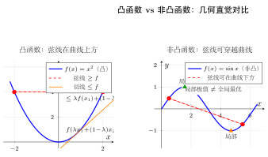
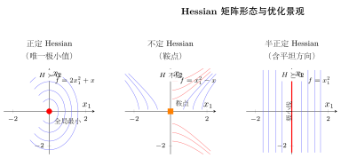
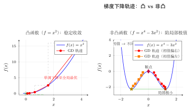

# 第25章 凸优化基础

> **一例速记：Hessian 判凸 + KKT 求约束极值**
>
> | 步骤 | 操作 | 结论 |
> |------|------|------|
> | 求 Hessian $H$ | 计算 $\nabla^2 f$ | $H\succeq 0\Rightarrow$ 凸；$H\succ 0\Rightarrow$ 严格凸 |
> | 一阶条件 | $f(y)\geq f(x)+\nabla f(x)^\top(y-x)$ | 切平面是全局下界 |
> | KKT | 驻点 + 原始/对偶可行 + 互补松弛 | 凸问题唯一全局最优 |

---

## 引入：判断 $f(x, y) = x^2 + 2y^2 - xy$ 是否为凸函数

> **题目**：求 $f(x,y)=x^2+2y^2-xy$ 的 Hessian 矩阵，并判断凸性。

## 思维路径还原

> "看到多元函数，判凸性要用 **Hessian 矩阵 + 半正定检验**。
>
> **第一步：求二阶偏导**。
>
> $$
> f_{xx}=2,\qquad f_{yy}=4,\qquad f_{xy}=f_{yx}=-1.
> $$
>
> **第二步：写出 Hessian 矩阵**。
>
> $$
> H=\nabla^2 f=\begin{pmatrix}2 & -1\\ -1 & 4\end{pmatrix}.
> $$
>
> **第三步：验证半正定（两种方法均可）**。
>
> *方法一（顺序主子式）*：$H_{11}=2>0$；$\det H=2\cdot4-(-1)^2=8-1=7>0$。
>
> 两个顺序主子式均正，故 $H$ 正定（强于半正定）。
>
> *方法二（特征值）*：特征多项式 $\lambda^2-6\lambda+7=0$，两根均正（$\lambda_{1,2}=3\pm\sqrt{2}>0$）。
>
> **第四步：得出结论**。Hessian 处处正定，$f$ 是**严格凸函数**。
>
> **AI 应用**：若把 $f(x,y)$ 看成某个二维参数的损失，则梯度下降可以稳定收敛到唯一全局最优点 $x=y=0$（无约束时）。Hessian 的特征值比（$\approx 4.41/1.59$）决定梯度下降的收敛速度：比值越大，越"椭圆"，需要更小学习率。"

---

## 学习目标

通过本章学习，你将能够：

- 判断一个集合或函数是否具有凸性（convexity）
- 理解凸函数的一阶/二阶判别条件与几何直觉
- 掌握 Jensen 不等式、对偶理论与 KKT 条件的基本用法
- 将 SVM、正则化、ELBO 等 AI 问题写成凸优化语言

> **依赖章节**：第 9 章（导数的应用）、第 18 章（偏导数、Hessian、Lagrange 乘子）
>
> **阅读提示**：本章默认你已具备基本线性代数知识，例如向量内积、矩阵转置与正定矩阵的直观概念。

---

## 25.1 凸集与凸函数

### 25.1.1 凸集的定义

在一维中，区间最大的特点是：只要取区间内两点，它们之间的整段线段仍然留在区间里。这个性质在高维空间中的推广，就是**凸集**。

**定义**：集合 $S \subseteq \mathbb{R}^n$ 称为凸集，若对任意 $x, y \in S$ 与任意 $\lambda \in [0,1]$，都有

$$
\lambda x + (1-\lambda)y \in S.
$$

也就是说，连接 $x$ 和 $y$ 的线段完全落在集合内部。

**常见凸集**：

- 区间、半空间、线性不等式组定义的多面体
- 欧氏球 $\{x \mid \|x\|_2 \leq r\}$
- 椭球 $\{x \mid (x-c)^\top A (x-c) \leq 1,\ A \succ 0\}$
- 范数球 $\{x \mid \|x\| \leq r\}$

**重要性质**：任意多个凸集的交集仍为凸集。这一点非常重要，因为优化中的可行域往往由多个约束同时定义。

> **例题 25.1** 证明集合 $S = \{x \in \mathbb{R}^n \mid Ax \leq b\}$ 是凸集。

**解**：任取 $x,y \in S$，则有 $Ax \leq b$ 与 $Ay \leq b$。对任意 $\lambda \in [0,1]$，

$$
A(\lambda x + (1-\lambda)y)
= \lambda Ax + (1-\lambda)Ay
\leq \lambda b + (1-\lambda)b = b.
$$

故 $\lambda x + (1-\lambda)y \in S$，因此 $S$ 是凸集。$\square$

### 25.1.2 凸函数的定义与几何直觉

**定义**：函数 $f: \mathbb{R}^n \to \mathbb{R}$ 在凸集 $C$ 上称为凸函数，若对任意 $x,y \in C$ 与任意 $\lambda \in [0,1]$，有

$$
f(\lambda x + (1-\lambda)y)
\leq \lambda f(x) + (1-\lambda)f(y).
$$

这意味着：函数图像上任意两点连成的弦线，始终在图像上方。

若上式在 $x \neq y$ 且 $\lambda \in (0,1)$ 时严格成立，则称为**严格凸函数**。

一维时，$f''(x) \geq 0$ 常被用来判断凸性；多维时，对应工具就是 Hessian 矩阵。

### 25.1.3 一阶与二阶判别条件

若 $f$ 可微，则它在凸集上为凸函数，当且仅当对任意 $x,y$，都有

$$
f(y) \geq f(x) + \nabla f(x)^\top (y-x).
$$

这就是**一阶条件**：切平面始终位于函数图像下方，因此是全局下界。

若 $f$ 二阶可导，则一个充分条件是

$$
\nabla^2 f(x) \succeq 0
$$

即 Hessian 半正定（positive semidefinite, PSD）。当 Hessian 处处正定时，函数是严格凸的。

> **例题 25.2** 判断 $f(x) = \|x\|_2^2 = x^\top x$ 的凸性。

**解**：

$$
\nabla f(x) = 2x,\qquad \nabla^2 f(x) = 2I.
$$

矩阵 $2I$ 的所有特征值都是 $2>0$，因此 $\nabla^2 f(x)$ 正定，故 $f$ 是严格凸函数。$\square$

> **例题 25.3** 判断 $f(x)=x\ln x$（$x>0$）的凸性。

**解**：

$$
f'(x)=\ln x+1,\qquad f''(x)=\frac{1}{x}>0 \quad (x>0).
$$

因此 $f(x)=x\ln x$ 在 $(0,+\infty)$ 上严格凸。这个函数在信息论和熵的推导中反复出现。$\square$

### 25.1.4 常见凸函数与保凸运算

**常见凸函数**：

- 线性函数与仿射函数
- 二次函数 $x^\top A x + b^\top x + c$（当 $A \succeq 0$）
- 范数 $\|x\|_1,\|x\|_2$
- `log-sum-exp`：$\log \sum_i e^{x_i}$
- 负熵函数 $-\sum_i p_i \log p_i$

**保凸运算**：

- 非负加权和
- 与仿射变换复合
- 逐点最大值
- 透视函数（perspective transform）

**非凸反例**：

- $\sin x$
- 深度网络的整体损失函数
- 带多个局部极小值的多峰函数

> ⚠️ **常见陷阱**
> 梯度为零并不 automatically 意味着已经找到最优解。对非凸函数，$\nabla f(x)=0$ 可能对应局部极值，也可能只是鞍点。凸性提供的是“驻点 = 全局最优”的额外保证。

---

## 25.2 Jensen 不等式与信息论

### 25.2.1 Jensen 不等式

对于凸函数 $f$，如果 $\lambda_i \geq 0$ 且 $\sum_i \lambda_i = 1$，则

$$
f\left(\sum_i \lambda_i x_i\right)
\leq \sum_i \lambda_i f(x_i).
$$

这就是**离散形式**的 Jensen 不等式。

若 $X$ 是随机变量，则连续形式写为

$$
f(\mathbb{E}[X]) \leq \mathbb{E}[f(X)].
$$

它告诉我们：先平均再过凸函数，通常比先过凸函数再平均更小。

> **例题 25.4** 用 Jensen 不等式证明 AM-GM 不等式。

**解**：对正数 $a,b$，取凸函数 $f(x)=-\ln x$。则

$$
-\ln \left(\frac{a+b}{2}\right)
\leq \frac{-\ln a - \ln b}{2}
= -\ln \sqrt{ab}.
$$

两边同时乘以 $-1$ 并指数化，得

$$
\frac{a+b}{2} \geq \sqrt{ab}.
$$

这就是 AM-GM 不等式。$\square$

### 25.2.2 KL 散度非负性

设 $p(x)$ 和 $q(x)$ 是两个概率密度，则

$$
\mathrm{KL}(p\|q)
= \int p(x)\ln \frac{p(x)}{q(x)}\,dx.
$$

由于 $-\ln t$ 是凸函数，对随机变量 $Z = \dfrac{q(X)}{p(X)}$ 应用 Jensen，不难得到

$$
\mathrm{KL}(p\|q)\geq 0.
$$

等号仅在 $p=q$（几乎处处）时成立。

> **例题 25.5** 用 Jensen 不等式证明 $\mathrm{KL}(p\|q)\geq 0$。

**解**：令 $f(t)=-\ln t$，它是凸函数。又因为在 $X\sim p$ 下，

$$
\mathbb{E}_p\left[\frac{q(X)}{p(X)}\right]
= \int p(x)\frac{q(x)}{p(x)}\,dx
= \int q(x)\,dx = 1.
$$

由 Jensen 不等式，

$$
-\ln \mathbb{E}_p\left[\frac{q(X)}{p(X)}\right]
\leq
\mathbb{E}_p\left[-\ln \frac{q(X)}{p(X)}\right].
$$

左边为 $-\ln 1 = 0$，右边正是 $\mathrm{KL}(p\|q)$，故

$$
0 \leq \mathrm{KL}(p\|q).
$$

$\square$

### 25.2.3 ELBO 的凸性视角

变分推断中，一个核心难点是边缘似然

$$
\log p(x) = \log \int p(x,z)\,dz
$$

难以直接计算。若引入近似分布 $q(z)$，则

$$
\log p(x)
= \log \int q(z)\frac{p(x,z)}{q(z)}\,dz
= \log \mathbb{E}_{q}\left[\frac{p(x,z)}{q(z)}\right].
$$

由于 $\log$ 是凹函数，由 Jensen 不等式得到

$$
\log p(x)
\geq \mathbb{E}_q[\log p(x,z)] - \mathbb{E}_q[\log q(z)].
$$

右边就是 ELBO（evidence lower bound）。这个推导说明：Jensen 不等式不是抽象技巧，而是 VAE 等现代生成模型的数学地基。

---

## 25.3 凸优化问题与 KKT 条件

### 25.3.1 标准形式与全局最优性

一个典型的约束优化问题写作

$$
\begin{aligned}
\min_x \quad & f(x) \\
\text{s.t.}\quad & g_i(x)\leq 0,\quad i=1,\dots,m, \\
& h_j(x)=0,\quad j=1,\dots,p.
\end{aligned}
$$

若目标函数 $f$ 和不等式约束 $g_i$ 都是凸函数，而等式约束 $h_j$ 是仿射函数，那么这就是一个**凸优化问题**。

凸优化的最重要性质是：

> 任何局部最优解都是全局最优解。

这也是为什么机器学习里即便最终问题常常是非凸的，人们仍然喜欢先寻找凸近似、凸松弛或局部凸子问题。

> **例题 25.6** 说明为什么在线性回归加 $L_2$ 正则化时，目标函数是凸的。

**解**：Ridge 回归的目标函数为

$$
f(w)=\frac{1}{2}\|Xw-y\|_2^2 + \frac{\lambda}{2}\|w\|_2^2.
$$

第一项是二次函数，其 Hessian 为 $X^\top X \succeq 0$；第二项 Hessian 为 $\lambda I \succeq 0$。两者之和仍为半正定，因此该目标函数是凸的；若 $\lambda>0$，则常常还是严格凸的。$\square$

### 25.3.2 Lagrange 对偶

定义 Lagrange 函数

$$
L(x,\lambda,\nu)
= f(x) + \sum_{i=1}^m \lambda_i g_i(x) + \sum_{j=1}^p \nu_j h_j(x),
$$

其中 $\lambda_i \geq 0$。

对偶函数定义为

$$
g(\lambda,\nu)=\inf_x L(x,\lambda,\nu).
$$

它给出了原问题最优值 $p^\star$ 的下界：

$$
g(\lambda,\nu)\leq p^\star.
$$

这叫做**弱对偶性**。当满足 Slater 条件等正则性假设时，常有

$$
d^\star = p^\star,
$$

这叫做**强对偶性**。

对偶问题的意义并不只在“换个写法”。在 SVM 中，对偶问题自然引出核技巧；在正则化问题中，对偶变量常对应约束的“影子价格”。

### 25.3.3 KKT 条件

在凸问题并满足适当约束资格条件时，最优解 $x^\star$ 与对偶变量 $(\lambda^\star,\nu^\star)$ 满足 KKT 条件：

1. 原始可行性（primal feasibility）
2. 对偶可行性（dual feasibility）：
   $$
   \lambda_i^\star \geq 0
   $$
3. 互补松弛（complementary slackness）：
   $$
   \lambda_i^\star g_i(x^\star)=0
   $$
4. 驻点条件（stationarity）：
   $$
   \nabla_x L(x^\star,\lambda^\star,\nu^\star)=0
   $$

> **例题 25.7** 求解
> $$
> \min_x \ x^2 \quad \text{s.t.}\ x\geq 1.
> $$

**解**：把约束写成 $g(x)=1-x\leq 0$。Lagrange 函数为

$$
L(x,\lambda)=x^2+\lambda(1-x),\qquad \lambda\geq 0.
$$

驻点条件：

$$
\frac{\partial L}{\partial x}=2x-\lambda=0
\quad \Rightarrow \quad \lambda=2x.
$$

原始可行要求 $x\geq 1$；互补松弛要求

$$
\lambda(1-x)=0.
$$

由于目标函数会把 $x$ 拉向 $0$，但约束强制 $x\geq 1$，故最优点应在边界 $x^\star=1$。此时 $\lambda^\star=2$，且所有 KKT 条件都满足。

所以最优解为 $x^\star=1$，最优值为 $1$。$\square$

> **例题 25.8** 在约束 $x+y=1$ 下最小化 $x^2+y^2$。

**解**：构造

$$
L(x,y,\nu)=x^2+y^2+\nu(x+y-1).
$$

驻点条件给出

$$
2x+\nu=0,\qquad 2y+\nu=0
\Rightarrow x=y.
$$

与约束 $x+y=1$ 联立得 $x=y=\frac12$，最优值为

$$
\left(\frac12\right)^2 + \left(\frac12\right)^2 = \frac12.
$$

$\square$

---

## 25.4 凸优化在 AI 中的应用

### 25.4.1 支持向量机（SVM）

软间隔 SVM 的原始问题可写成

$$
\begin{aligned}
\min_{w,b,\xi}\quad & \frac12\|w\|_2^2 + C\sum_{i=1}^n \xi_i \\
\text{s.t.}\quad & y_i(w^\top x_i + b)\geq 1-\xi_i,\quad \xi_i\geq 0.
\end{aligned}
$$

这是一个带线性约束的凸二次规划问题。它的几个关键结论都来自凸优化：

- 目标函数是凸的，因而不存在糟糕的局部极小值
- 对偶问题只依赖样本内积，因而可以使用核函数
- KKT 条件说明：只有位于间隔边界或违背间隔的样本会有非零对偶变量，这些样本就是支持向量

### 25.4.2 正则化的凸优化解释

许多正则化都可以看成“惩罚形式”和“约束形式”的互相转换：

$$
\min_w \ L(w)+\lambda\|w\|_2^2
\qquad \Longleftrightarrow \qquad
\min_w \ L(w)\ \text{s.t.}\ \|w\|_2^2 \leq r.
$$

从这个角度看：

- $L_2$ 正则化偏好小范数参数
- $L_1$ 正则化偏好稀疏解
- Elastic Net 是两种凸惩罚的加权和，因此仍然保持凸性

> **例题 25.9** 为什么说 Ridge 回归的惩罚形式与“限制参数范数”的约束形式本质等价？

**解**：考虑两个问题

$$
\min_w \ L(w)+\lambda\|w\|_2^2
\qquad\text{和}\qquad
\min_w \ L(w)\ \text{s.t.}\ \|w\|_2^2\le r.
$$

若约束问题在最优解处恰好落在边界 $\|w^\star\|_2^2=r$，则它的 KKT 条件可写成

$$
\nabla L(w^\star)+\lambda^\star \nabla \|w^\star\|_2^2=0,\qquad
\lambda^\star\ge 0.
$$

这与惩罚形式的一阶最优性条件完全同型。也就是说，对某个合适的半径 $r$，约束形式对应某个拉格朗日乘子 $\lambda^\star$；反过来，给定惩罚系数 $\lambda$，也能找到相应的有效约束半径。二者差别主要在“超参数是直接控制惩罚强度，还是间接控制可行域大小”。$\square$

### 25.4.3 深度学习里的“非凸现实”

神经网络训练问题整体上通常不是凸的，因为：

- 多层非线性组合破坏凸性
- 参数之间存在对称性和重参数化
- 损失面中大量临界点是鞍点而非局部最小值

但凸优化依然重要，原因至少有三点：

1. 局部近似：在当前点附近，Taylor 展开给出二次模型，是经典二阶方法的基础。
2. 子问题求解：如投影梯度、近端算法、约束优化子问题常是凸的。
3. 理论参照：理解凸问题，才能理解深度学习为何偏离凸世界、又如何借用凸工具。

### 25.4.4 代码示例：凸与非凸优化轨迹

```python
import numpy as np

def gd(f_grad, x0, lr=0.1, steps=20):
    x = float(x0)
    path = [x]
    for _ in range(steps):
        x = x - lr * f_grad(x)
        path.append(x)
    return path

# 凸函数 f(x) = x^2
convex_path = gd(lambda x: 2 * x, x0=4.0, lr=0.2)

# 非凸函数 g(x) = x^4 - 3x^2
nonconvex_path = gd(lambda x: 4 * x**3 - 6 * x, x0=0.4, lr=0.05)

print("convex:", np.round(convex_path, 4))
print("nonconvex:", np.round(nonconvex_path, 4))
```

**解释**：在凸函数上，梯度下降通常稳定地朝全局最优前进；而在非凸函数上，初值不同可能收敛到不同区域，甚至在鞍点附近徘徊。

> **例题 25.10** 使用上面的代码时，为什么同样从固定初值出发，凸函数与非凸函数的优化轨迹会表现出本质差异？

**解**：对凸函数 $f(x)=x^2$，梯度始终把参数拉向唯一全局最优点 $x=0$，因此轨迹单调、稳定，且不会被“局部地形”误导。对非凸函数 $g(x)=x^4-3x^2$，梯度场中同时存在多个驻点：两个局部极小值和一个位于原点附近的鞍点。于是更新方向会强烈依赖当前位置，稍微不同的初值就可能落入不同吸引域。这正是“凸优化里局部最优就是全局最优，而非凸优化则必须面对地形复杂性”的数值直观。$\square$

---

## 本章小结

1. **凸集**要求线段封闭，**凸函数**要求弦线在图像上方。
2. 对可微凸函数，切平面是全局下界；对二阶可导函数，Hessian 半正定是常用判据。
3. Jensen 不等式把凸性与概率、积分、信息论连接起来，是 KL 非负性和 ELBO 推导的核心工具。
4. 凸优化最大的礼物是：局部最优就是全局最优。
5. KKT 条件把原始约束、对偶变量和最优性条件统一到一套框架里。
6. SVM、正则化、变分推断都可以从凸优化视角获得更清晰的解释。

---

## 几何示意

| 图示 | 说明 |
|------|------|
|  | **图 25-1**：凸函数（$f=x^2$，弦线在曲线上方，切线在曲线下方）与非凸函数（$\sin x$，弦线可穿越曲线）的几何对比 |
|  | **图 25-2**：三种 Hessian 形态对应的等高线与优化景观。正定：椭圆等高线（唯一极小值）；不定：双曲线等高线（鞍点）；半正定：直线等高线（含平坦方向） |
|  | **图 25-3**：凸函数（$x^2$）上梯度下降单调稳定收敛至全局最优；非凸函数（$x^4-3x^2$）上不同初值落入不同局部极值，鞍点附近有驻留风险 |

---

## 思考路标（条件反射）

> **见到以下特征，立即触发对应动作：**

1. **凸集定义**：看到"集合"问题，立即问：任意两点连线是否全在集合内？等价于：$\lambda x+(1-\lambda)y\in S$ 对所有 $\lambda\in[0,1]$ 成立。

2. **凸函数定义**：见到函数凸性判断，先看维数——一维用 $f''\geq 0$，多维立即写 Hessian $H=\nabla^2 f$，验半正定。

3. **Jensen 不等式**：见到"$f(\mathbb{E}[X])$ 和 $\mathbb{E}[f(X)]$ 的大小关系"，立即用 Jensen。凸函数：$f(\mathbb{E}[X])\leq\mathbb{E}[f(X)]$。

4. **一阶判别（切线在下）**：若 $f$ 可微，凸等价于 $f(y)\geq f(x)+\nabla f(x)^\top(y-x)$。切平面是全局下界，因此梯度为零就是全局最优。

5. **二阶判别（Hessian 半正定）**：$\nabla^2 f\succeq 0$（所有特征值非负）。验证方法：顺序主子式非负，或特征值非负，或二次型 $v^\top Hv\geq 0$。

6. **凸优化全局最优**：见到"凸目标 + 凸约束（不等式）+ 仿射约束（等式）"，立即结论：任何局部最优都是全局最优，梯度下降不会被局部极小值卡住。

7. **KKT 条件**：约束优化问题，先写 Lagrange 函数 $L=f+\sum\lambda_i g_i+\sum\nu_j h_j$，然后四步验证：驻点 $\nabla_x L=0$、原始可行 $g_i\leq 0$、对偶可行 $\lambda_i\geq 0$、互补松弛 $\lambda_i g_i=0$。

8. **对偶**：遇到 SVM、最优运输等问题时，看原始问题是否难解——若对偶问题更简单（如只依赖内积），转到对偶问题求解。Slater 条件成立时强对偶性保证原始 = 对偶。

---

## 易错点（⚠ 红色警报）

1. **严格凸 vs 凸**：$H\succ 0$（正定）$\Rightarrow$ 严格凸；$H\succeq 0$（半正定）$\Rightarrow$ 凸但可能不严格凸（存在平坦方向）。严格凸保证唯一极小值，凸只保证极小值集合是凸集。

2. **Hessian 正定 vs 半正定**：实际应用中，Ridge 回归（加 $\lambda I$）把半正定变成正定，保证严格凸和唯一解。不要把两者混为一谈：$X^\top X$ 可能仅半正定（列相关时），加正则化后变正定。

3. **非凸函数有局部极小值**：梯度为零的点（驻点）不一定是极小值，也可能是鞍点或局部极大值。只有凸函数才能从"梯度为零"直接得到"全局最优"。

4. **约束最值需要 KKT，不能只令梯度为零**：有约束时，最优点未必在梯度为零处，而是在约束边界上。必须使用 Lagrange 乘子法和 KKT 条件。

5. **线性约束保持凸性，非线性等式约束不一定**：形如 $Ax=b$ 的等式约束构成仿射子空间，不破坏凸性；但非线性等式约束（如 $\|x\|_2=1$，单位球面）通常使可行域非凸，原问题变为非凸。

---

## 抽象成方法（套路总结）

### 判凸标准 3 步

| 场景 | 工具 | 结论条件 |
|------|------|----------|
| 一维函数 | $f''(x)$ | $f''\geq 0$ 凸；$f''>0$ 严格凸 |
| 多维可微 | Hessian $H=\nabla^2f$ | $H\succeq 0$ 凸；$H\succ 0$ 严格凸 |
| 保凸运算 | 非负加权和 / 仿射复合 / 逐点最大 | 无需重新验证 Hessian |

### KKT 条件标准 4 步

1. 写 Lagrange 函数 $L=f+\sum\lambda_i g_i+\sum\nu_j h_j$
2. 驻点条件：$\nabla_x L=0$
3. 对偶可行：$\lambda_i\geq 0$；互补松弛：$\lambda_i g_i(x^\star)=0$
4. 原始可行：$g_i(x^\star)\leq 0$，$h_j(x^\star)=0$

### Jensen 不等式 2 条记忆

- 凸函数：$f(\mathbb{E}[X])\leq\mathbb{E}[f(X)]$
- 凹函数（如 $\log$）：不等号反向 → 推导 ELBO 下界

---

## 方法变形

### 变形 1：Hessian 半正定但不正定（有平坦方向）

$f(x_1,x_2)=x_1^2$：Hessian $=\mathrm{diag}(2,0)$，半正定。它是凸函数，但 $x_2$ 方向任意值都是全局最优集合的一部分。Ridge 正则化把 $\lambda I$ 加上去，变成正定，得到唯一最优。

### 变形 2：约束有效与无效（互补松弛）

若无约束最优点 $x^\star_{\text{unconstrained}}$ 已满足所有约束，则 $\lambda_i=0$（约束无效），KKT 退化为无约束情形。否则最优点在边界，$\lambda_i>0$。判断"约束是否活跃"是 KKT 分情况讨论的核心。

### 变形 3：对偶转化简化计算

若原始问题维度高，对偶问题变量数 $=$ 约束个数。SVM 中原始变量 $w\in\mathbb{R}^d$，对偶变量 $\alpha\in\mathbb{R}^n$（样本数）。当 $n<d$ 时，对偶更快；对偶还自然引出核技巧（内积 $x_i^\top x_j$ 被核函数 $k(x_i,x_j)$ 替换）。

### 变形 4：非凸函题的局部凸近似

深度学习训练中，每次迭代在当前点用二次近似（信任域、$L$-平滑梯度界等），将局部凸化后更新参数。$L$-平滑条件 $f(y)\leq f(x)+\nabla f(x)^\top(y-x)+\frac{L}{2}\|y-x\|^2$ 给出梯度下降步长 $1/L$ 的安全上界。

---

## 典型应用例题

### 例 1：Hessian 正定判别 + 求无约束极小值

> **题目**：$f(w_1,w_2)=w_1^2+4w_2^2+2w_1w_2+3w_1+1$。（1）判断凸性；（2）求最小值点。

【思路】先求 Hessian 判凸，再令梯度为零解方程组。

【解】

(1) $\nabla^2 f=\begin{pmatrix}2&2\\2&8\end{pmatrix}$。顺序主子式：$2>0$，$\det=16-4=12>0$，故正定，$f$ 严格凸。

(2) 令 $\nabla f=0$：$2w_1+2w_2+3=0$，$2w_1+8w_2=0$。解得 $w_2=1/2$，$w_1=-2$。

【答案】$\boxed{(w_1^\star,w_2^\star)=(-2,\,1/2)}$，最小值 $f=-2$。

### 例 2：KKT 条件求约束优化

> **题目**：$\min_{x_1,x_2}\ (x_1-3)^2+(x_2-2)^2$，约束 $x_1+x_2\leq 4$，$x_1,x_2\geq 0$。

【思路】先检查无约束最优是否可行；若不可行，确定活跃约束后用 KKT。

【解】无约束最优点 $(3,2)$：$3+2=5>4$，违反约束，需考虑边界。

令 $\lambda_1$ 对应 $g_1=x_1+x_2-4\leq 0$，互补松弛：若 $g_1<0$ 则 $\lambda_1=0$。直觉上最优点在直线 $x_1+x_2=4$ 上（$\lambda_1>0$），且 $x_1,x_2>0$（$\lambda_2=\lambda_3=0$）。

KKT 驻点：$2(x_1-3)+\lambda_1=0$，$2(x_2-2)+\lambda_1=0$ → $x_1-3=x_2-2$ → $x_1=x_2+1$。

代入 $x_1+x_2=4$：$x_1=5/2$，$x_2=3/2$。$\lambda_1=2(3-5/2)=1>0$ 合法。

【答案】$\boxed{x^\star=(5/2,\,3/2)}$，最优值 $1/4+1/4=1/2$。

### 例 3：Jensen 不等式证明训练目标

> **题目**：设 $q(z)$ 是参数化分布，$p(x,z)$ 是联合模型。证明 $\log p(x)\geq \mathbb{E}_q[\log p(x,z)-\log q(z)]$（ELBO 下界），并说明等号条件。

【思路】把边缘似然写成对 $q$ 的期望，对凹函数 $\log$ 用 Jensen。

【解】

$$\log p(x)=\log\int q(z)\frac{p(x,z)}{q(z)}\,dz=\log\mathbb{E}_q\!\left[\frac{p(x,z)}{q(z)}\right].$$

因 $\log$ 是凹函数，Jensen 给出 $\log\mathbb{E}_q[Y]\geq\mathbb{E}_q[\log Y]$，故

$$\log p(x)\geq\mathbb{E}_q\!\left[\log\frac{p(x,z)}{q(z)}\right]=\mathbb{E}_q[\log p(x,z)]-\mathbb{E}_q[\log q(z)]=\mathrm{ELBO}.$$

等号成立当且仅当 $\dfrac{p(x,z)}{q(z)}$ 几乎处处为常数，即 $q(z)=p(z\mid x)$。

【答案】$\boxed{\log p(x)\geq\mathrm{ELBO}}$，等号在 $q=p(\cdot\mid x)$ 时成立。

---

## 自测题

**自测 1**　$f(x)=e^x-x$。判断凸性，求最小值。

> 提示：$f''=e^x>0$ 恒成立，严格凸。令 $f'=e^x-1=0$，$x^\star=0$，最小值 $f(0)=1$。

**自测 2**　$g(x)=x\ln x$（$x>0$）。证明 Jensen 不等式 $\mathbb{E}[X\ln X]\geq\mathbb{E}[X]\ln\mathbb{E}[X]$（负熵凸性）。

> 提示：$g''=1/x>0$，$g$ 严格凸，直接用 Jensen：$g(\mathbb{E}[X])\leq\mathbb{E}[g(X)]$。

**自测 3**　求解带等式约束问题：$\min_{x,y}\ x^2+y^2+xy$，约束 $x+2y=3$。

> 提示：Lagrange 法。$\nabla L=0$：$2x+y+\lambda=0$，$2y+x+2\lambda=0$。与约束联立解出 $x=1,y=1,\lambda=-3$。最优值 $1+1+1=3$。

**自测 4**　为什么 $L_1$ 正则化（Lasso）比 $L_2$ 正则化（Ridge）更倾向于产生稀疏解？用约束形式的凸优化几何直觉说明。

> 提示：约束形式中，$L_1$ 球（菱形，顶点在坐标轴）的"角点"在轴上，等高线最容易先碰到角点，导致某些坐标为零；$L_2$ 球（圆，无角点），解一般不恰好落在轴上。

**自测 5**　对软间隔 SVM：若某个样本 $i$ 的松弛变量 $\xi_i=0$，那么其对偶变量 $\alpha_i$ 的范围是什么？若 $0<\xi_i<1$（在间隔内），$\alpha_i$ 的范围又是什么？

> 提示：由 KKT 互补松弛：$\alpha_i(y_i(w^\top x_i+b)-1+\xi_i)=0$ 和 $\mu_i\xi_i=0$（$\mu_i=C-\alpha_i$）。$\xi_i=0$ 时，要么 $\alpha_i=0$（正确分类，不在边界上）；要么 $\alpha_i\in(0,C]$（在间隔边界上）。$0<\xi_i$ 时 $\mu_i=0$，即 $\alpha_i=C$。

---

## 练习题

**1.** ⭐ 判断集合 $S=\{x\in\mathbb{R}^2 \mid x_1+x_2\leq 1,\ x_1\geq 0,\ x_2\geq 0\}$ 是否为凸集。

**2.** ⭐ 证明 `log-sum-exp` 函数
$$
f(x)=\log\left(\sum_{i=1}^n e^{x_i}\right)
$$
是凸函数。

**3.** ⭐ 设 $f(x)=\max(0,1-yw^\top x)$，其中 $y\in\{-1,1\}$。证明它关于 $w$ 是凸函数。

**4.** ⭐⭐ 写出 Ridge 回归
$$
\min_w \frac12\|Xw-y\|_2^2 + \frac{\lambda}{2}\|w\|_2^2
$$
的一阶最优性条件。

**5.** ⭐⭐ 用 Jensen 不等式证明
$$
\mathbb{E}[X^2]\geq (\mathbb{E}[X])^2.
$$

**6.** ⭐⭐ 求解
$$
\min_x\ (x-2)^2 \quad \text{s.t.}\ x\geq 3.
$$

**7.** ⭐⭐⭐ 推导 Lasso 问题
$$
\min_w \frac12\|Xw-y\|_2^2 + \lambda \|w\|_1
$$
为何通常只能保证凸性，而不能像 Ridge 一样直接得到光滑闭式解。

**8.** ⭐⭐⭐ 编程题：实现投影梯度下降求解约束问题
$$
\min_x\ \|x-c\|_2^2 \quad \text{s.t.}\ \|x\|_2\leq 1
$$
并比较“每步投影”和“最后一次性裁剪”的效果差异。

---

## 练习答案

<details>
<summary>点击展开答案</summary>

**1.** 这是三个半空间的交集，而半空间都是凸集，凸集的交集仍为凸集，因此 $S$ 是凸集。

---

**2.** 令
$$
p_i = \frac{e^{x_i}}{\sum_j e^{x_j}},
$$
则
$$
\frac{\partial f}{\partial x_i}=p_i.
$$
进一步可得 Hessian
$$
\nabla^2 f(x)=\mathrm{diag}(p)-pp^\top.
$$
对任意向量 $v$，
$$
v^\top \nabla^2 f(x) v
= \sum_i p_i v_i^2 - \left(\sum_i p_i v_i\right)^2
= \mathrm{Var}_p(v_i)\geq 0.
$$
故 Hessian 半正定，$f$ 为凸函数。

---

**3.** 函数 $1-yw^\top x$ 关于 $w$ 是仿射函数，常数函数 $0$ 也是凸函数。两个凸函数的逐点最大值仍是凸函数，因此 hinge loss 关于 $w$ 凸。

---

**4.** 对目标函数求梯度：
$$
\nabla_w f(w)=X^\top(Xw-y)+\lambda w.
$$
一阶最优性条件为
$$
X^\top(Xw-y)+\lambda w=0.
$$
若 $X^\top X+\lambda I$ 可逆，则
$$
w^\star = (X^\top X + \lambda I)^{-1}X^\top y.
$$

---

**5.** 对凸函数 $f(x)=x^2$ 应用 Jensen 不等式：
$$
f(\mathbb{E}[X]) \leq \mathbb{E}[f(X)].
$$
即
$$
(\mathbb{E}[X])^2 \leq \mathbb{E}[X^2].
$$

---

**6.** 可行域是 $x\geq 3$。无约束最优点在 $x=2$，不可行，因此最优解落在边界 $x^\star=3$。最优值为
$$
(3-2)^2=1.
$$

---

**7.** Lasso 目标函数是“光滑二次项 + 非光滑 $L_1$ 项”的和，因此仍然是凸函数。但 $|w_i|$ 在 $w_i=0$ 处不可导，所以不能像 Ridge 那样直接通过把梯度设为零得到闭式解。通常需要次梯度、坐标下降、近端梯度等方法求解。

---

**8.** 约束 $\|x\|_2\leq 1$ 的投影公式为
$$
\Pi(x)=
\begin{cases}
x, & \|x\|_2\leq 1,\\
\dfrac{x}{\|x\|_2}, & \|x\|_2>1.
\end{cases}
$$
投影梯度下降每一步都先做梯度更新再投影，能保证迭代点始终可行；“最后一次性裁剪”则中间会离开可行域，因此并不等价，也不能保证沿着约束问题的真实下降方向行进。

</details>
