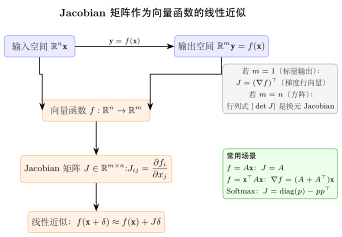
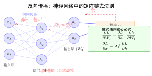
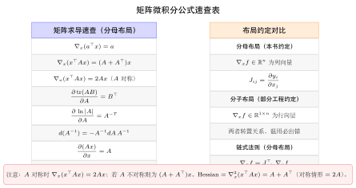

# 第26章 矩阵微积分

> **一例速记：二次型求导 + trace 技巧 + 反向传播公式**
>
> | 对象 | 求导结果 | 记忆口诀 |
> |------|---------|---------|
> | $\nabla_x(a^\top x)$ | $a$ | 线性项梯度 = 系数 |
> | $\nabla_x(x^\top Ax)$ | $(A+A^\top)x$（$A$ 对称时 $2Ax$） | 二次型，记住加转置 |
> | $\partial\,\mathrm{tr}(AX)/\partial X$ | $A^\top$ | trace 技巧核心公式 |
> | $\partial L/\partial W$（线性层） | $(\partial L/\partial y)\,x^\top$ | 上游梯度 $\times$ 输入转置 |

---

## 引入：求 $\frac{\partial}{\partial \mathbf{x}}(\mathbf{x}^\top A \mathbf{x})$

> **题目**：设 $A\in\mathbb{R}^{n\times n}$，$\mathbf{x}\in\mathbb{R}^n$，求二次型 $f(\mathbf{x})=\mathbf{x}^\top A\mathbf{x}$ 对 $\mathbf{x}$ 的梯度。

## 思维路径还原

> "见到 $\mathbf{x}^\top A\mathbf{x}$，这是**二次型对向量**求导。套用矩阵微积分公式：
>
> **直接公式**：$\nabla_\mathbf{x}(\mathbf{x}^\top A\mathbf{x})=(A+A^\top)\mathbf{x}$。
>
> 若 $A$ 对称（$A=A^\top$），则 $\nabla_\mathbf{x}(\mathbf{x}^\top A\mathbf{x})=2A\mathbf{x}$。
>
> **完整推导**（用分量方法验证）：第 $i$ 个分量
>
> $$
> f(\mathbf{x})=\sum_{j,k}A_{jk}x_jx_k,
> $$
>
> 对 $x_i$ 求偏导（$x_i$ 出现在 $j=i$ 和 $k=i$ 两类项中）：
>
> $$
> \frac{\partial f}{\partial x_i}
> =\sum_{k}A_{ik}x_k+\sum_{j}A_{ji}x_j
> =(A\mathbf{x})_i+(A^\top\mathbf{x})_i.
> $$
>
> 写成向量形式：$\nabla_\mathbf{x} f=(A+A^\top)\mathbf{x}$。
>
> **当 $A$ 对称时**：$A=A^\top$，故 $\nabla_\mathbf{x} f=2A\mathbf{x}$。
>
> **AI 应用（Hessian 是 $A$）**：Ridge 回归损失 $L(w)=\frac12\|Xw-y\|_2^2+\frac\lambda2\|w\|_2^2$ 中，$\nabla_w L=X^\top(Xw-y)+\lambda w$，对应 Hessian $H=X^\top X+\lambda I$。由于 $X^\top X$ 半正定，加 $\lambda I$ 后严格正定，因此 $L$ 是严格凸函数，梯度为零点即唯一全局最优解 $w^\star=(X^\top X+\lambda I)^{-1}X^\top y$。"

---

## 学习目标

通过本章学习，你将能够：

- 区分标量、向量、矩阵之间的不同求导对象
- 熟练使用线性层、二次型、迹与行列式的常见求导公式
- 理解反向传播（backpropagation）的矩阵链式法则
- 说明自动微分（automatic differentiation, AD）为何能高效计算梯度

> **依赖章节**：第 7-8 章（导数与求导法则）、第 18 章（偏导数、梯度、Jacobian）
>
> **前置知识**：矩阵乘法、转置、迹、逆矩阵、行列式

---

## 26.1 向量微积分基础

### 26.1.1 求导对象的类型学

一元微积分里只有“标量对标量”的导数，但机器学习里参数往往是向量和矩阵，因此需要更一般的求导记号。

常见情况如下：

1. **标量对标量**
   $$
   \frac{df}{dx}
   $$
2. **标量对向量**：得到梯度
   $$
   \nabla_x f = \frac{\partial f}{\partial x}
   = \begin{bmatrix}
   \frac{\partial f}{\partial x_1}\\
   \vdots\\
   \frac{\partial f}{\partial x_n}
   \end{bmatrix}
   $$
3. **向量对向量**：得到 Jacobian
   $$
   J_{ij} = \frac{\partial y_i}{\partial x_j}
   $$
4. **标量对矩阵**
   $$
   \left(\frac{\partial f}{\partial A}\right)_{ij}
   = \frac{\partial f}{\partial A_{ij}}
   $$

矩阵微积分的难点，通常不在于概念本身，而在于：

- 维度是否匹配
- 转置是否放对
- 采用的是哪一种布局约定

### 26.1.2 布局约定

不同教材对“梯度究竟写成行向量还是列向量”并不完全一致。本教程统一采用**分母布局（denominator layout）与列向量梯度**：

- 若 $x \in \mathbb{R}^n$，则 $\nabla_x f \in \mathbb{R}^n$，写成列向量
- Jacobian $J = \dfrac{\partial y}{\partial x}$ 的第 $(i,j)$ 元是 $\dfrac{\partial y_i}{\partial x_j}$

> ⚠️ **常见陷阱**
> 矩阵微积分里最常见的错误不是“不会求导”，而是默认了另一套布局约定，结果整道题只差一个转置。做题时必须先问自己：梯度到底写成列向量还是行向量？

---

## 26.2 常用矩阵求导公式

### 26.2.1 线性运算

若 $y = Ax$，其中 $A \in \mathbb{R}^{m\times n}$，$x \in \mathbb{R}^n$，则

$$
\frac{\partial (Ax)}{\partial x} = A.
$$

若 $f(x)=a^\top x$，则

$$
\nabla_x f = a.
$$

若 $f(x)=x^\top a$，由于它仍是标量，结果相同。

> **例题 26.1** 设 $f(x)=a^\top x+b$，求 $\nabla_x f$。

**解**：常数项 $b$ 对梯度没有贡献，线性项的梯度为系数向量，因此

$$
\nabla_x f = a.
$$

$\square$

### 26.2.2 二次型

设

$$
f(x)=x^\top A x.
$$

则

$$
\nabla_x f = (A+A^\top)x.
$$

特别地，当 $A$ 对称时，

$$
\nabla_x f = 2Ax.
$$

这是优化中最常出现的一条公式之一，因为平方误差、正则项、协方差能量函数等都可以写成二次型。

> **例题 26.2** 求
> $$
> f(x)=\|Ax-b\|_2^2
> $$
> 对 $x$ 的梯度。

**解**：先写成

$$
f(x)=(Ax-b)^\top(Ax-b)
=x^\top A^\top A x - 2b^\top A x + b^\top b.
$$

故

$$
\nabla_x f = 2A^\top A x - 2A^\top b
= 2A^\top(Ax-b).
$$

令梯度为零可得最小二乘正规方程

$$
A^\top A x = A^\top b.
$$

$\square$

### 26.2.3 迹技巧

对标量做矩阵求导时，**迹（trace）技巧**几乎是万能中介。因为任何标量都等于它自己的迹。

例如

$$
x^\top A x = \mathrm{tr}(x^\top A x)=\mathrm{tr}(Axx^\top).
$$

常用公式包括：

$$
\frac{\partial\, \mathrm{tr}(AB)}{\partial A}=B^\top,
$$

$$
\frac{\partial\, \mathrm{tr}(ABA^\top)}{\partial A}=A(B+B^\top).
$$

> **例题 26.3** 用迹技巧推导
> $$
> \frac{\partial\, \mathrm{tr}(X^\top A X)}{\partial X}.
> $$

**解**：将其改写为

$$
\mathrm{tr}(X^\top A X)=\mathrm{tr}(A X X^\top).
$$

套用二次型的矩阵形式，可得

$$
\frac{\partial\, \mathrm{tr}(X^\top A X)}{\partial X}
= (A+A^\top)X.
$$

当 $A$ 对称时，结果为 $2AX$。$\square$

### 26.2.4 行列式与逆矩阵

在高斯模型、协方差估计和 normalizing flow 中，常会遇到如下公式：

$$
\frac{\partial \ln |A|}{\partial A} = A^{-T},
$$

$$
\frac{\partial A^{-1}}{\partial t}
= -A^{-1}\frac{\partial A}{\partial t}A^{-1}.
$$

前者说明：对数行列式的梯度恰好是逆矩阵的转置；后者则说明逆矩阵对参数变化的敏感性。

> **例题 26.4** 证明当 $A$ 可逆时，
> $$
> \frac{\partial \ln|A|}{\partial A}=A^{-T}.
> $$

**解**：矩阵微分里有一个标准恒等式

$$
d\ln|A|=\mathrm{tr}(A^{-1}dA).
$$

另一方面，若把标量函数 $f(A)=\ln|A|$ 的微分写成

$$
df=\mathrm{tr}\!\left[\left(\frac{\partial f}{\partial A}\right)^\top dA\right],
$$

则与上式逐项对比可得

$$
\left(\frac{\partial f}{\partial A}\right)^\top=A^{-1}.
$$

因此

$$
\frac{\partial \ln|A|}{\partial A}=A^{-T}.
$$

$\square$

---

## 26.3 链式法则的矩阵形式

### 26.3.1 向量链式法则

设 $y=y(x)$，$f=f(y)$，则

$$
\nabla_x f
= \left(\frac{\partial y}{\partial x}\right)^\top \nabla_y f.
$$

这就是反向传播最核心的一步：**上游梯度乘以本地 Jacobian 的转置**。

在深度学习中，一个计算图由许多小节点构成。每个节点并不需要“知道整个网络”，它只需要：

1. 接收上游梯度
2. 计算自己的局部 Jacobian
3. 把梯度继续传给前面的节点

### 26.3.2 全连接层的反向传播

设线性层为

$$
y = Wx+b.
$$

若损失为 $L(y)$，则由链式法则可得

$$
\frac{\partial L}{\partial W}
= \frac{\partial L}{\partial y} x^\top,
$$

$$
\frac{\partial L}{\partial x}
= W^\top \frac{\partial L}{\partial y},
$$

$$
\frac{\partial L}{\partial b}
= \frac{\partial L}{\partial y}.
$$

这里最值得记住的是：参数梯度往往是**上游梯度与输入的外积**。

> **例题 26.5** 推导线性层 $y=Wx+b$ 的三个梯度。

**解**：记上游梯度为 $g=\dfrac{\partial L}{\partial y}$。

- 对 $b$：因为 $y$ 对 $b$ 的 Jacobian 是单位映射，所以
  $$
  \frac{\partial L}{\partial b}=g.
  $$
- 对 $x$：因为 $y=Wx+b$，所以
  $$
  \frac{\partial L}{\partial x}=W^\top g.
  $$
- 对 $W$：第 $(i,j)$ 个元素满足
  $$
  \frac{\partial y_i}{\partial W_{ij}} = x_j,
  $$
  因此
  $$
  \left(\frac{\partial L}{\partial W}\right)_{ij}=g_i x_j,
  $$
  即
  $$
  \frac{\partial L}{\partial W}=g x^\top.
  $$

$\square$

### 26.3.3 Softmax 的 Jacobian

设

$$
p_i = \frac{e^{z_i}}{\sum_j e^{z_j}}.
$$

则

$$
\frac{\partial p_i}{\partial z_j}
= p_i(\delta_{ij}-p_j).
$$

这表明 Softmax 的 Jacobian **不是对角矩阵**，因为各个输出分量彼此耦合。

> ⚠️ **常见陷阱**
> Softmax 的导数不是“对每个分量分别求 sigmoid 导数”。因为归一化分母依赖所有分量，所以当 $i\neq j$ 时，$\dfrac{\partial p_i}{\partial z_j}\neq 0$。

> **例题 26.6** 写出 Softmax 的 Jacobian 矩阵。

**解**：对

$$
p_i=\frac{e^{z_i}}{\sum_k e^{z_k}}
$$

求偏导。若 $i=j$，则

$$
\frac{\partial p_i}{\partial z_i}=p_i(1-p_i).
$$

若 $i\neq j$，则

$$
\frac{\partial p_i}{\partial z_j}=-p_ip_j.
$$

合并写成统一形式就是

$$
\frac{\partial p_i}{\partial z_j}=p_i(\delta_{ij}-p_j).
$$

因此 Jacobian 为

$$
J_{\mathrm{softmax}}(z)=\mathrm{diag}(p)-pp^\top.
$$

$\square$

> **例题 26.7** 设损失函数
> $$
> L(z,y)=-\sum_i y_i\log p_i,\qquad p=\mathrm{softmax}(z),
> $$
> 证明对 one-hot 标签有 $\nabla_z L = p-y$。

**解**：由链式法则，

$$
\frac{\partial L}{\partial z_j}
=\sum_i \frac{\partial L}{\partial p_i}\frac{\partial p_i}{\partial z_j}.
$$

而

$$
\frac{\partial L}{\partial p_i}=-\frac{y_i}{p_i},\qquad
\frac{\partial p_i}{\partial z_j}=p_i(\delta_{ij}-p_j).
$$

代入得

$$
\frac{\partial L}{\partial z_j}
=-\sum_i y_i(\delta_{ij}-p_j)
=-y_j+\left(\sum_i y_i\right)p_j.
$$

对 one-hot 标签，$\sum_i y_i=1$，故

$$
\frac{\partial L}{\partial z_j}=p_j-y_j.
$$

向量形式即

$$
\nabla_z L = p-y.
$$

$\square$

### 26.3.4 注意力的梯度框架

单头注意力可写成

$$
\mathrm{Attn}(Q,K,V)=\mathrm{softmax}\left(\frac{QK^\top}{\sqrt d}\right)V.
$$

虽然完整推导较长，但结构其实很清晰：

1. 先对输出关于 $V$ 求导，这是线性映射
2. 再对 Softmax 输出求导，需要 Softmax Jacobian
3. 最后对 $QK^\top$ 求导，把链式法则继续往回传

这也是理解 Transformer 反向传播的最短路径：把复杂模块拆成“矩阵乘法 + Softmax + 再一次矩阵乘法”。

---

## 26.4 自动微分原理

### 26.4.1 符号微分、数值微分与自动微分

**符号微分**：直接对表达式做代数求导。优点是精确，缺点是表达式可能爆炸。

**数值微分**：用有限差分近似

$$
f'(x)\approx \frac{f(x+h)-f(x)}{h}.
$$

优点是简单，缺点是同时受截断误差与浮点误差影响。

**自动微分（AD）**：把复合函数拆成基本运算，对每一步使用链式法则，因此在机器精度范围内能得到精确梯度。

### 26.4.2 前向模式与反向模式

前向模式（forward mode）适合输入维度小、输出维度大的场景；反向模式（reverse mode）适合输出标量、输入维度很大时使用。

神经网络训练通常属于：

- 输入参数很多
- 损失函数是一个标量

因此反向模式自动微分最合适。

### 26.4.3 PyTorch 中的 autograd

PyTorch 会在前向传播时记录计算图，在调用 `loss.backward()` 时根据图结构自动回溯梯度。

```python
import torch

x = torch.tensor([1.0, -2.0], requires_grad=True)
A = torch.tensor([[3.0, 1.0], [1.0, 2.0]])

loss = x @ A @ x
loss.backward()

print("loss =", loss.item())
print("grad =", x.grad)  # 应为 (A + A^T)x
```

对这里的对称矩阵 $A$，理论梯度为 $2Ax$。你可以用程序输出与手工结果对照，验证矩阵求导公式确实落在框架实现里。

> **例题 26.8** 如何用有限差分验证 autograd 给出的梯度是可信的？

**解**：以标量函数 $f(x)=x^\top A x$ 为例，先用 `backward()` 得到自动微分梯度 $g_{\text{ad}}$。然后对每个坐标方向 $e_i$ 计算中心差分

$$
g_{\text{fd},i}
=\frac{f(x+h e_i)-f(x-h e_i)}{2h}.
$$

当 $h$ 取一个足够小但又不至于触发浮点误差放大的数时，若

$$
\|g_{\text{fd}}-g_{\text{ad}}\|
$$

接近 0，就说明手推公式、数值近似和框架实现三者是一致的。实践中这类 gradient check 是排查反向传播实现错误的高效方法。$\square$

### 26.4.4 高阶自动微分与 Hessian-vector product

很多二阶方法并不真的显式构造整个 Hessian，因为那样代价太高。更常见的是计算

$$
Hv
$$

即 Hessian 与某个向量的乘积。自动微分允许我们以接近一阶梯度的成本获得这些量，从而支持：

- 二阶优化
- Fisher 信息矩阵近似
- Hessian 谱分析

---

## 本章小结

1. 矩阵微积分本质上仍然是链式法则，只是对象从标量扩展到向量和矩阵。
2. 二次型、迹、对数行列式是最常见的三个计算模板。
3. 线性层反向传播的关键公式是：
   $$
   \frac{\partial L}{\partial W} = \frac{\partial L}{\partial y}x^\top,\quad
   \frac{\partial L}{\partial x} = W^\top \frac{\partial L}{\partial y}.
   $$
4. Softmax 的 Jacobian 体现了归一化带来的分量耦合。
5. 自动微分不是数值近似，而是把链式法则系统化执行。

---

## 几何示意

| 图示 | 说明 |
|------|------|
|  | **图 26-1**：Jacobian 矩阵 $J\in\mathbb{R}^{m\times n}$ 作为向量函数 $f:\mathbb{R}^n\to\mathbb{R}^m$ 的线性近似。标量输出时退化为梯度（列向量）；方阵时行列式给出换元 Jacobian |
|  | **图 26-2**：神经网络中的矩阵链式法则。前向蓝色箭头传递激活值，反向红色虚线箭头传递梯度。参数梯度 $\partial L/\partial W=(\partial L/\partial y)x^\top$（上游梯度与输入的外积） |
|  | **图 26-3**：矩阵微积分常用公式速查表（分母布局）。左侧为导数公式，右侧为布局约定对比。混用布局约定是最常见的错误来源 |

---

## 思考路标（条件反射）

> **见到以下特征，立即触发对应动作：**

1. **标量对向量（梯度 $\nabla$）**：见到 $f(\mathbf{x})$ 对 $\mathbf{x}$ 求导，结果是列向量 $\nabla_\mathbf{x} f\in\mathbb{R}^n$（分母布局）。线性项：$\nabla(a^\top x)=a$；二次型：$\nabla(x^\top Ax)=(A+A^\top)x$。

2. **向量对向量（Jacobian $J$）**：$\mathbf{y}=f(\mathbf{x})$ 的 Jacobian $J_{ij}=\partial y_i/\partial x_j$，大小为 $m\times n$。链式法则：$\nabla_\mathbf{x} L=J^\top\nabla_\mathbf{y} L$（上游梯度乘 Jacobian 转置）。

3. **标量对矩阵**：$(\partial f/\partial A)_{ij}=\partial f/\partial A_{ij}$。常用：$\partial\,\mathrm{tr}(AX)/\partial X=A^\top$；$\partial\ln|A|/\partial A=A^{-T}$。

4. **trace 技巧**：任何标量都等于自身的 trace。$x^\top Ax=\mathrm{tr}(Axx^\top)$。用 trace 的循环不变性和线性性简化复杂矩阵导数。

5. **链式法则（矩阵版）**：上游梯度 $\times$ 本地 Jacobian 转置。线性层 $y=Wx+b$：$\partial L/\partial W=(\partial L/\partial y)x^\top$，$\partial L/\partial x=W^\top(\partial L/\partial y)$。

6. **反向传播**：计算图中，每个节点只需：①接收上游梯度；②乘以本地 Jacobian 转置；③传给前面节点。不需要知道整体网络结构。

7. **Layout 约定（分子布局 vs 分母布局）**：做题前必须确认约定。本书采用分母布局（梯度为列向量）。若参考其他资料，注意转置关系。

8. **Hessian**：$H=\nabla^2 f$，大小 $n\times n$。线性层损失 $L=\frac12\|Wx-b\|_2^2$ 的 Hessian 关于 $W$ 不是简单的 $XX^\top$——需要 Kronecker 积工具处理矩阵参数的高阶结构。

---

## 易错点（⚠ 红色警报）

1. **分子布局 vs 分母布局（行向量 vs 列向量）**：这是矩阵微积分最常见的错误。两种约定下 $\nabla_x f$ 互为转置。混用必然导致错误的链式法则顺序。做题前先明确约定，不要默默换算。

2. **链式法则的乘法顺序**：矩阵乘法不可交换。$\nabla_x L=J^\top_{y/x}\nabla_y L$（分母布局），不能随意把 $J^\top$ 移到右边。维度不匹配是发现顺序错误的最快检验方法。

3. **矩阵积导数不交换**：$\partial(AB)/\partial A\neq B^\top$（一般情形下）。$A$ 和 $B$ 都含参数时，必须用矩阵微分 $d(AB)=dA\cdot B+A\cdot dB$，再结合 trace 技巧读出梯度。

4. **$d(X^{-1})=-X^{-1}dX\,X^{-1}$**：逆矩阵的微分不是 $-X^{-2}dX$。推导方式：$d(XX^{-1})=dI=0$，故 $dX\cdot X^{-1}+X\cdot d(X^{-1})=0$，解出 $d(X^{-1})=-X^{-1}dX\,X^{-1}$。

5. **$X$ 对称时的修正**：若约束 $X=X^\top$，则 $\partial f/\partial X$ 需要对称化修正：非对角元的导数要乘以系数 2（因为 $X_{ij}=X_{ji}$ 是同一个自由度）。直接对不对称矩阵求导再对称化是正确做法。

---

## 练习题

**1.** ⭐ 计算
$$
\nabla_x (x^\top A x + b^\top x).
$$

**2.** ⭐ 设 $\sigma(x)=\dfrac{1}{1+e^{-x}}$，证明
$$
\sigma'(x)=\sigma(x)(1-\sigma(x)).
$$

**3.** ⭐ 设 $L=\dfrac12\|Wx-b\|_2^2$，求 $\dfrac{\partial L}{\partial W}$。

**4.** ⭐⭐ 证明
$$
\frac{\partial \ln|A|}{\partial A}=A^{-T}.
$$

**5.** ⭐⭐ 推导 Softmax 的 Jacobian 公式
$$
\frac{\partial p_i}{\partial z_j}=p_i(\delta_{ij}-p_j).
$$

**6.** ⭐⭐ 解释为什么交叉熵损失与 Softmax 组合后，输出层梯度可以简化为“预测减标签”。

**7.** ⭐⭐⭐ 说明 RNN 中梯度消失/爆炸为何与反复相乘的 Jacobian 或权重矩阵谱半径有关。

**8.** ⭐⭐⭐ 编程题：用有限差分验证 Autograd 在函数
$$
f(x)=x^\top A x
$$
上的梯度正确性，并比较不同步长下的误差。

---

## 练习答案

<details>
<summary>点击展开答案</summary>

**1.** 由二次型公式，
$$
\nabla_x(x^\top A x)=(A+A^\top)x.
$$
再加上线性项梯度 $b$，得
$$
\nabla_x (x^\top A x + b^\top x)=(A+A^\top)x+b.
$$

---

**2.** 设 $u=e^{-x}$，则 $\sigma(x)=\dfrac{1}{1+u}$。求导得
$$
\sigma'(x)=\frac{e^{-x}}{(1+e^{-x})^2}.
$$
另一方面，
$$
\sigma(x)(1-\sigma(x))
= \frac{1}{1+e^{-x}}\left(1-\frac{1}{1+e^{-x}}\right)
= \frac{e^{-x}}{(1+e^{-x})^2}.
$$
两式相同。

---

**3.** 记 $r=Wx-b$，则
$$
L=\frac12 r^\top r.
$$
对 $W$ 求导可得
$$
\frac{\partial L}{\partial W}=r x^\top = (Wx-b)x^\top.
$$

---

**4.** 可从微分恒等式
$$
d\ln|A| = \mathrm{tr}(A^{-1}dA)
$$
出发。利用 $\mathrm{tr}(A^{-1}dA)=\mathrm{tr}((A^{-T})^\top dA)$，按矩阵微分与内积对应关系即可读出梯度
$$
\frac{\partial \ln|A|}{\partial A}=A^{-T}.
$$

---

**5.** 写
$$
p_i = \frac{e^{z_i}}{S},\qquad S=\sum_k e^{z_k}.
$$
若 $i=j$，
$$
\frac{\partial p_i}{\partial z_i}
= \frac{e^{z_i}S-e^{z_i}e^{z_i}}{S^2}
= p_i(1-p_i).
$$
若 $i\neq j$，
$$
\frac{\partial p_i}{\partial z_j}
= -\frac{e^{z_i}e^{z_j}}{S^2}
= -p_i p_j.
$$
统一写为
$$
\frac{\partial p_i}{\partial z_j}=p_i(\delta_{ij}-p_j).
$$

---

**6.** 对 one-hot 标签 $y$ 的交叉熵
$$
L=-\sum_i y_i \log p_i
$$
与 Softmax 组合求导时，Softmax Jacobian 和对数导数会相互抵消，最终得到
$$
\frac{\partial L}{\partial z}=p-y.
$$
这也是分类模型训练中最常见的一条梯度公式。

---

**7.** RNN 反向传播会产生形如
$$
\prod_{t=1}^T J_t
$$
的 Jacobian 连乘。若这些矩阵的谱半径长期小于 $1$，梯度范数会指数级衰减；若长期大于 $1$，则会指数级放大。这就是梯度消失与爆炸的线性代数根源。

---

**8.** 有限差分可取
$$
\frac{f(x+h e_i)-f(x-h e_i)}{2h}
$$
近似第 $i$ 个偏导。步长太大时截断误差主导，步长太小时浮点舍入误差主导，因此误差不会随着 $h\to 0$ 单调减小。Autograd 的结果应与理论梯度 $(A+A^\top)x$ 高度一致。

</details>
