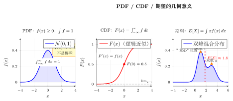
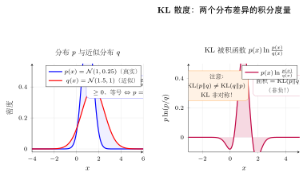

# 第27章 概率论中的微积分

## 学习目标

通过本章学习，你将能够：

- 从积分角度理解概率密度函数、CDF、期望和方差
- 掌握高斯积分、矩母函数、协方差矩阵等常见工具
- 理解熵、KL 散度、交叉熵的积分定义
- 说明重参数化技巧、REINFORCE、Monte Carlo 积分与 ELBO 的数学基础

> **依赖章节**：第 11-14 章（积分学）、第 19 章（重积分）、第 25 章（Jensen 不等式与凸性）

---

## 27.1 概率密度与积分

### 27.1.1 从频率到密度

离散情形里，我们用概率质量函数描述事件发生的概率；连续情形里，单点的概率通常为零，因此要用**概率密度函数（probability density function, PDF）** 来描述。

若随机变量 $X$ 的密度为 $f(x)$，则它必须满足：

$$
f(x)\geq 0,\qquad \int_{-\infty}^{+\infty} f(x)\,dx = 1.
$$

区间概率由积分给出：

$$
\mathbb{P}(a\leq X\leq b)=\int_a^b f(x)\,dx.
$$

累积分布函数（CDF）定义为

$$
F(x)=\mathbb{P}(X\leq x)=\int_{-\infty}^{x}f(t)\,dt.
$$

若 $f$ 足够光滑，则由微积分基本定理，

$$
F'(x)=f(x).
$$

### 27.1.2 常见分布的归一化

**均匀分布**：在区间 $[a,b]$ 上，

$$
f(x)=\frac{1}{b-a},\qquad x\in[a,b].
$$

显然

$$
\int_a^b \frac{1}{b-a}\,dx=1.
$$

**指数分布**：对 $\lambda>0$，

$$
f(x)=\lambda e^{-\lambda x},\qquad x\geq 0.
$$

它的归一化来自

$$
\int_0^\infty \lambda e^{-\lambda x}\,dx = 1.
$$

> **例题 27.1** 验证指数分布的归一化，并求 $\mathbb{E}[X]$。

**解**：

$$
\int_0^\infty \lambda e^{-\lambda x}\,dx
= \left[-e^{-\lambda x}\right]_0^\infty = 1.
$$

期望为

$$
\mathbb{E}[X]
= \int_0^\infty x\lambda e^{-\lambda x}\,dx
= \frac1\lambda.
$$

最后一步可用分部积分或 Gamma 函数完成。$\square$

### 27.1.3 高斯积分

高斯分布之所以重要，不只是因为它常见，还因为它的归一化常数与一个经典积分紧密相连：

$$
I=\int_{-\infty}^{+\infty} e^{-x^2}\,dx.
$$

直接算不容易，但可改求

$$
I^2=\int_{-\infty}^{+\infty}\int_{-\infty}^{+\infty} e^{-(x^2+y^2)}\,dx\,dy.
$$

转到极坐标：

$$
I^2 = \int_0^{2\pi}\int_0^\infty e^{-r^2}r\,dr\,d\theta
= 2\pi \cdot \frac12 = \pi,
$$

故

$$
I=\sqrt{\pi}.
$$

由此可知标准高斯分布

$$
\mathcal N(0,1):\quad
f(x)=\frac{1}{\sqrt{2\pi}}e^{-x^2/2}
$$

确实满足归一化条件。

> **例题 27.2** 证明一维高斯分布
> $$
> f(x)=\frac{1}{\sqrt{2\pi\sigma^2}}e^{-(x-\mu)^2/(2\sigma^2)}
> $$
> 的积分为 $1$。

**解**：令 $z=\dfrac{x-\mu}{\sigma}$，则 $dx=\sigma dz$。于是

$$
\int_{-\infty}^{+\infty}
\frac{1}{\sqrt{2\pi\sigma^2}}e^{-(x-\mu)^2/(2\sigma^2)}\,dx
= \int_{-\infty}^{+\infty}
\frac{1}{\sqrt{2\pi}}e^{-z^2/2}\,dz
=1.
$$

$\square$

---

## 27.2 期望、方差与矩

### 27.2.1 期望的积分定义

连续随机变量的期望定义为

$$
\mathbb{E}[X]=\int_{-\infty}^{+\infty} x f(x)\,dx.
$$

更一般地，若 $g$ 是可积函数，则

$$
\mathbb{E}[g(X)] = \int_{-\infty}^{+\infty} g(x)f(x)\,dx.
$$

这就是常说的 LOTUS（law of the unconscious statistician）。

### 27.2.2 方差与矩母函数

方差定义为

$$
\mathrm{Var}(X)=\mathbb{E}\left[(X-\mathbb{E}[X])^2\right].
$$

展开后得到熟悉的公式

$$
\mathrm{Var}(X)=\mathbb{E}[X^2]-(\mathbb{E}[X])^2.
$$

矩母函数（moment generating function, MGF）定义为

$$
M_X(t)=\mathbb{E}[e^{tX}] = \int e^{tx}f(x)\,dx.
$$

若它在 $t=0$ 附近存在，则

$$
M_X^{(n)}(0)=\mathbb{E}[X^n].
$$

> **例题 27.3** 求正态分布 $X\sim \mathcal N(\mu,\sigma^2)$ 的矩母函数。

**解**：计算

$$
M_X(t)=\mathbb{E}[e^{tX}]
= \int \frac{1}{\sqrt{2\pi\sigma^2}}
\exp\left(tx-\frac{(x-\mu)^2}{2\sigma^2}\right)\,dx.
$$

配方后可得

$$
M_X(t)=\exp\left(\mu t+\frac{\sigma^2 t^2}{2}\right).
$$

因此

$$
\mathbb{E}[X]=M'_X(0)=\mu,\qquad
\mathrm{Var}(X)=M''_X(0)-\mu^2=\sigma^2.
$$

$\square$

### 27.2.3 多变量期望与协方差

若 $(X,Y)$ 的联合密度为 $f(x,y)$，则

$$
\mathbb{E}[g(X,Y)] = \iint g(x,y)f(x,y)\,dx\,dy.
$$

边际密度通过对另一变量积分得到，例如

$$
f_X(x)=\int f(x,y)\,dy.
$$

在向量情形，协方差矩阵定义为

$$
\Sigma = \mathbb{E}[(X-\mu)(X-\mu)^\top].
$$

PCA 的数学本质，就是对协方差矩阵做特征分解，找到数据方差最大的方向。

---

## 27.3 信息论基础

### 27.3.1 熵与微分熵

离散熵定义为

$$
H(p)=-\sum_i p_i \log p_i.
$$

连续情形中，对应的量是**微分熵**

$$
h(f)=-\int f(x)\log f(x)\,dx.
$$

对高斯分布可推得

$$
h(\mathcal N(\mu,\sigma^2))
= \frac12 \log(2\pi e \sigma^2).
$$

它说明：方差固定时，高斯分布具有最大的熵，这也是“最大熵原理”的典型例子。

> **例题 27.4** 推导一维高斯分布 $\mathcal N(\mu,\sigma^2)$ 的微分熵。

**解**：由定义

$$
h(X)=-\mathbb E[\log f(X)].
$$

对高斯密度

$$
\log f(x)
=-\frac12\log(2\pi\sigma^2)-\frac{(x-\mu)^2}{2\sigma^2},
$$

所以

$$
h(X)=\frac12\log(2\pi\sigma^2)
+\frac{1}{2\sigma^2}\mathbb E[(X-\mu)^2].
$$

而 $\mathbb E[(X-\mu)^2]=\sigma^2$，故

$$
h(X)=\frac12\log(2\pi\sigma^2)+\frac12
=\frac12\log(2\pi e\sigma^2).
$$

$\square$

### 27.3.2 KL 散度与交叉熵

KL 散度定义为

$$
\mathrm{KL}(p\|q)
= \int p(x)\log \frac{p(x)}{q(x)}\,dx.
$$

它衡量“用 $q$ 近似 $p$ 时损失了多少信息”，但它**不是对称的**。

交叉熵定义为

$$
H(p,q)=-\int p(x)\log q(x)\,dx.
$$

两者满足

$$
H(p,q)=H(p)+\mathrm{KL}(p\|q).
$$

因此当真实分布 $p$ 固定时，最小化交叉熵等价于最小化 $\mathrm{KL}(p\|q)$。

> **例题 27.5** 解释为什么最大似然估计等价于最小化交叉熵。

**解**：设数据来自真实分布 $p_{\text{data}}$，模型分布为 $q_\theta$。最大化对数似然等价于最大化

$$
\mathbb{E}_{p_{\text{data}}}[\log q_\theta(x)].
$$

这又等价于最小化

$$
-\mathbb{E}_{p_{\text{data}}}[\log q_\theta(x)]
= H(p_{\text{data}}, q_\theta).
$$

而真实熵 $H(p_{\text{data}})$ 与 $\theta$ 无关，所以又等价于最小化

$$
\mathrm{KL}(p_{\text{data}}\|q_\theta).
$$

$\square$

---

## 27.4 换元、采样与梯度估计

### 27.4.1 换元公式与分布变换

若 $Y=g(X)$ 且 $g$ 可逆，则

$$
f_Y(y)=f_X(g^{-1}(y))
\left|\det \frac{d g^{-1}(y)}{dy}\right|.
$$

这就是概率分布版的换元公式，也是 normalizing flow 的数学核心。

> **例题 27.6** 简述 Box-Muller 变换为什么能把均匀分布变成高斯分布。

**解**：Box-Muller 先从二维均匀分布出发，通过极坐标换元构造半径与角度，再把半径分布调成 Rayleigh 分布，最终得到两个独立标准高斯变量。整个过程本质上就是“精心设计的 Jacobian 补偿”。$\square$

### 27.4.2 重参数化技巧

在 VAE 中，我们需要对

$$
\nabla_\theta \mathbb{E}_{q_\theta(z)}[f(z)]
$$

求梯度。直接对“参数化采样过程”求导很困难。若可写成

$$
z = \mu + \sigma \varepsilon,\qquad \varepsilon\sim \mathcal N(0,1),
$$

则期望可改写为

$$
\mathbb{E}_{\varepsilon\sim \mathcal N(0,1)}[f(\mu+\sigma\varepsilon)].
$$

此时梯度可以安全推进到期望内部。

> **例题 27.7** 为什么重参数化技巧通常比直接用 REINFORCE 求梯度方差更小？

**解**：重参数化把随机性改写为与参数无关的噪声

$$
z=\mu+\sigma\varepsilon,\qquad \varepsilon\sim\mathcal N(0,1),
$$

于是目标变成

$$
\nabla_\theta \mathbb E_{\varepsilon}[f(g_\theta(\varepsilon))].
$$

梯度作用在一个确定的可微计算图上，样本对梯度的影响连续且局部。相比之下，REINFORCE 使用

$$
f(z)\nabla_\theta \log p_\theta(z),
$$

它把整个函数值都当成权重乘到 score 上，样本波动会被直接放大，因此方差通常更高。直观地说，重参数化是在“路径上求导”，REINFORCE 是在“分布密度上求导”，前者更细腻，后者更粗糙。$\square$

### 27.4.3 REINFORCE 与 Leibniz 规则

若重参数化不可行，则常用 score function estimator：

$$
\nabla_\theta \mathbb{E}_{p_\theta(x)}[f(x)]
= \mathbb{E}_{p_\theta(x)}
\left[f(x)\nabla_\theta \log p_\theta(x)\right].
$$

它来自含参积分求导与对数求导技巧：

$$
\nabla_\theta p_\theta(x)
= p_\theta(x)\nabla_\theta \log p_\theta(x).
$$

这个公式是 REINFORCE、策略梯度等方法的理论起点。

> **例题 27.8** 推导 REINFORCE 公式。

**解**：

$$
\nabla_\theta \mathbb{E}_{p_\theta(x)}[f(x)]
= \nabla_\theta \int f(x)p_\theta(x)\,dx
= \int f(x)\nabla_\theta p_\theta(x)\,dx.
$$

再乘除同一个 $p_\theta(x)$：

$$
= \int f(x)p_\theta(x)\nabla_\theta \log p_\theta(x)\,dx
= \mathbb{E}_{p_\theta(x)}\left[f(x)\nabla_\theta \log p_\theta(x)\right].
$$

$\square$

---

## 27.5 高维积分的困境与出路

### 27.5.1 维度灾难

若在 $d$ 维空间每个坐标方向都取 $N$ 个网格点，则总点数为 $N^d$。即使 $N=10$，$d=100$ 时也完全不可计算。

更糟的是，高维空间的几何直觉与低维完全不同：

- 单位球体积随着维度增大迅速趋于 0
- 大部分体积集中在壳层附近
- 网格采样会极度浪费样本

### 27.5.2 Monte Carlo 积分

Monte Carlo 的核心思想是：把积分看成期望，然后用样本平均逼近：

$$
\mathbb{E}[f(X)] \approx \frac1N\sum_{i=1}^N f(x_i).
$$

最关键的优点是误差阶

$$
O(N^{-1/2})
$$

与维度基本无关。这也是它在深度学习和贝叶斯推断中如此重要的原因。

> **例题 27.9** 为什么重要性采样有机会比直接 Monte Carlo 积分更稳定？

**解**：若直接估计

$$
I=\int f(x)p(x)\,dx=\mathbb E_{p}[f(X)],
$$

则样本主要来自 $p$ 的高概率区域；一旦 $f(x)$ 的主要贡献集中在尾部，普通采样就会“很少抽到真正重要的点”。重要性采样改为从提议分布 $q$ 抽样：

$$
I=\mathbb E_q\left[f(X)\frac{p(X)}{q(X)}\right].
$$

只要 $q$ 更愿意覆盖对积分贡献大的区域，单个样本携带的信息就更均匀，估计方差就可能显著下降。当然，若 $q$ 选得很差，权重

$$
\frac{p(X)}{q(X)}
$$

会剧烈波动，方差反而会更大。$\square$

### 27.5.3 ELBO 与变分推断

贝叶斯推断里，后验分布

$$
p(z|x)=\frac{p(x,z)}{p(x)}
$$

的难点在于分母

$$
p(x)=\int p(x,z)\,dz
$$

通常不可直接计算。引入近似后验 $q_\phi(z|x)$ 后，由 Jensen 不等式得到

$$
\log p(x)\geq
\mathbb{E}_{q_\phi}[\log p(x,z)] - \mathbb{E}_{q_\phi}[\log q_\phi(z|x)].
$$

这就是 ELBO。最大化 ELBO 相当于最小化

$$
\mathrm{KL}(q_\phi(z|x)\|p(z|x)).
$$

> **例题 27.10** 从 Jensen 不等式出发，推导 VAE 中常见的 ELBO 形式。

**解**：从边缘似然出发：

$$
\log p(x)
=\log \int p(x,z)\,dz
=\log \int q_\phi(z|x)\frac{p(x,z)}{q_\phi(z|x)}\,dz.
$$

把积分看成关于 $q_\phi(z|x)$ 的期望：

$$
\log p(x)
=\log \mathbb E_{q_\phi(z|x)}
\left[\frac{p(x,z)}{q_\phi(z|x)}\right].
$$

由于 $\log$ 是凹函数，Jensen 不等式给出

$$
\log p(x)\ge
\mathbb E_{q_\phi(z|x)}[\log p(x,z)-\log q_\phi(z|x)].
$$

再将 $p(x,z)=p(x|z)p(z)$ 代入，得到

$$
\mathrm{ELBO}
=\mathbb E_{q_\phi(z|x)}[\log p(x|z)]
-\mathrm{KL}(q_\phi(z|x)\|p(z)).
$$

这正是 VAE 训练时使用的“重构项减去 KL 正则项”的标准形式。$\square$

---

## 本章小结

1. 概率密度的归一化、本质上就是积分等于 1。
2. 期望、方差、矩、协方差矩阵都可以写成积分形式。
3. 熵、KL 散度、交叉熵是信息论里的核心积分对象。
4. Jacobian 决定分布换元，重参数化技巧让随机采样重新变得可导。
5. 高维积分中，Monte Carlo 与变分推断是最重要的两条出路。

---

## 几何示意

| 图示 | 说明 |
|------|------|
|  | **图 27-1**：左：PDF 曲线下面积 $=1$（$f(x)$ 可大于 1，不是概率）；中：CDF 为 PDF 的积分，单调从 0 到 1，$F'(x)=f(x)$；右：期望是分布的"重心"，双峰分布中期望可落在两峰之间的低谷 |
|  | **图 27-2**：两个分布 $p$（窄高斯）与 $q$（宽高斯）的对比。KL 被积函数 $p\ln(p/q)$ 的面积即 $\mathrm{KL}(p\|q)$，始终非负；注意 $\mathrm{KL}(p\|q)\neq\mathrm{KL}(q\|p)$（非对称性） |

---

## 思考路标（条件反射）

> **见到以下特征，立即触发对应动作：**

1. **PDF 合法性检验**：见到函数 $f(x)$，验证 PDF 需检查两条：$f(x)\geq 0$（处处非负）和 $\int_{-\infty}^{+\infty}f(x)\,dx=1$（归一化）。两条缺一不可。

2. **CDF 与 PDF 的互化**：$F(x)=\int_{-\infty}^x f(t)\,dt$；反过来 $F'(x)=f(x)$（微积分基本定理）。见到区间概率 $P(a\leq X\leq b)=F(b)-F(a)$。

3. **期望 $E[X]=\int xf\,dx$**：连续随机变量的期望是"$x$ 乘以密度"的积分，是分布的"重心"。更一般地，$E[g(X)]=\int g(x)f(x)\,dx$（LOTUS 法则）。

4. **方差**：$\mathrm{Var}(X)=E[X^2]-(E[X])^2$。见到方差，优先用这个展开形式；Jensen 不等式保证 $E[X^2]\geq(E[X])^2$。

5. **KL 散度 $\int p\ln(p/q)$**：非负（Jensen 不等式），当且仅当 $p=q$ 时为零。最小化 KL 等价于最大化似然。注意 $\mathrm{KL}(p\|q)\neq\mathrm{KL}(q\|p)$（不对称）。

6. **矩**：$k$ 阶矩 $E[X^k]=\int x^kf(x)\,dx$。矩母函数 $M_X(t)=E[e^{tX}}$，对 $t$ 求 $k$ 阶导再令 $t=0$ 得第 $k$ 阶矩。

7. **特征函数**：$\varphi_X(t)=E[e^{itX}]$，对应 $f(x)$ 的 Fourier 变换。独立随机变量之和的特征函数是各自特征函数之积，是中心极限定理的核心工具。

8. **重要分布速查**：正态 $\mathcal{N}(\mu,\sigma^2)$：$f=\frac{1}{\sqrt{2\pi\sigma^2}}e^{-(x-\mu)^2/(2\sigma^2)}$；指数分布：$f=\lambda e^{-\lambda x}$，$E[X]=1/\lambda$；Gamma 分布：$f\propto x^{\alpha-1}e^{-x/\beta}$，是指数和 $\chi^2$ 分布的推广。

---

## 易错点（⚠ 红色警报）

1. **连续 vs 离散随机变量的积分 vs 求和**：离散用 $\sum$，连续用 $\int$。混用会导致归一化条件和期望公式形式错误。二者之间没有"直接类比"，要分别处理。

2. **PDF $f(x)$ 可以大于 1（不是概率）**：$f(x)$ 是概率**密度**，不是概率。$f(x)\Delta x$ 才近似是小区间 $[x,x+\Delta x]$ 的概率。例如均匀分布 $U[0,0.1]$ 的密度 $f=10>1$，完全合法。

3. **KL 不对称**：$\mathrm{KL}(p\|q)\neq\mathrm{KL}(q\|p)$。前向 KL（$p\|q$）倾向于 mode-covering，反向 KL（$q\|p$）倾向于 mode-seeking。VAE 使用反向 KL 作为正则项。

4. **期望 $\int xf\,dx$ 的收敛性**：期望不总存在——若 $\int|x|f(x)\,dx=+\infty$，期望没有定义（如 Cauchy 分布）。遇到重尾分布要特别检查收敛性。

5. **特征函数对应傅里叶变换**：$\varphi_X(t)=\int e^{itx}f(x)\,dx$ 是 $f(x)$ 的 Fourier 变换（差一个符号约定）。独立性可以通过特征函数相乘来验证，但不要把 MGF（$e^{tX}$）和特征函数（$e^{itX}$）混淆——前者实数参数，后者复数参数。

---

## 练习题

**1.** ⭐ 验证 Beta 分布
$$
f(x)=\frac{1}{B(\alpha,\beta)}x^{\alpha-1}(1-x)^{\beta-1},\quad x\in(0,1)
$$
的归一化条件。

**2.** ⭐ 用 Jensen 不等式证明
$$
\mathbb{E}[X^2]\geq (\mathbb{E}[X])^2.
$$

**3.** ⭐ 计算标准高斯分布的二阶矩 $\mathbb{E}[X^2]$。

**4.** ⭐⭐ 写出两个一维高斯分布
$$
\mathcal N(\mu_1,\sigma_1^2),\quad \mathcal N(\mu_2,\sigma_2^2)
$$
的 KL 散度闭式公式。

**5.** ⭐⭐ 为什么说前向 KL 和反向 KL 分别倾向于 mode-covering 与 mode-seeking？

**6.** ⭐⭐ 解释重参数化技巧与 REINFORCE 的方差差异为何通常很大。

**7.** ⭐⭐⭐ 编程题：比较普通 Monte Carlo 与重要性采样在估计尾部概率时的方差。

**8.** ⭐⭐⭐ 编程题：实现一个最小化版 VAE 的 ELBO，并观察 KL 项与重构项的平衡。

---

## 练习答案

点击展开答案

**1.** 因为 Beta 函数定义为
$$
B(\alpha,\beta)=\int_0^1 x^{\alpha-1}(1-x)^{\beta-1}\,dx,
$$
所以
$$
\int_0^1 f(x)\,dx
= \frac{1}{B(\alpha,\beta)}\int_0^1 x^{\alpha-1}(1-x)^{\beta-1}\,dx
=1.
$$

---

**2.** 对凸函数 $f(x)=x^2$ 直接应用 Jensen：
$$
(\mathbb{E}[X])^2 = f(\mathbb{E}[X]) \leq \mathbb{E}[f(X)] = \mathbb{E}[X^2].
$$

---

**3.** 对标准高斯密度 $\phi(x)=\dfrac{1}{\sqrt{2\pi}}e^{-x^2/2}$，
$$
\mathbb{E}[X^2]=\int x^2 \phi(x)\,dx = 1.
$$
可由分部积分或利用方差为 1 的已知事实得到。

---

**4.** 一维高斯 KL 为
$$
\mathrm{KL}(\mathcal N_1\|\mathcal N_2)
= \log\frac{\sigma_2}{\sigma_1}
+ \frac{\sigma_1^2+(\mu_1-\mu_2)^2}{2\sigma_2^2}
- \frac12.
$$

---

**5.** 前向 KL $\mathrm{KL}(p\|q)$ 会强烈惩罚“真实分布有质量而近似分布没覆盖”的区域，因此更倾向于覆盖所有 mode；反向 KL $\mathrm{KL}(q\|p)$ 会强烈惩罚“近似分布跑到真实分布低概率区域”，因此更倾向于集中在一个或少数高概率 mode 上。

---

**6.** 重参数化技巧把随机性外移到与参数无关的噪声上，因此梯度通过平滑函数传播，通常方差更低；REINFORCE 则直接用 $f(x)\nabla \log p_\theta(x)$ 做估计，往往受回报波动影响更大，因此方差更高。

---

**7.** 对稀有事件或尾部积分，普通 Monte Carlo 大多数样本贡献接近 0，而重要性采样通过把提议分布 $q$ 放到更有贡献的区域，可以显著减小估计方差。关键公式为
$$
\mathbb{E}_p[f(X)]
= \mathbb{E}_q\left[f(X)\frac{p(X)}{q(X)}\right].
$$

---

**8.** 最小版 VAE 的 ELBO 通常写成
$$
\mathbb{E}_{q_\phi(z|x)}[\log p_\theta(x|z)]
- \mathrm{KL}(q_\phi(z|x)\|p(z)).
$$
训练时若 KL 项过大，模型会过度贴近先验；若重构项独大，则潜变量结构会退化。实践中常通过 warmup 或 $\beta$-VAE 调整两者权重。

