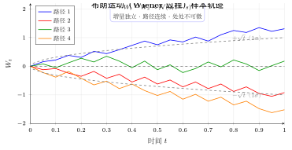
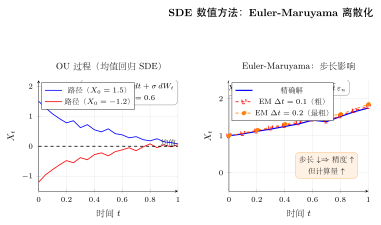

# 第28章 随机微分方程入门

> **一例速记：Itô 公式 + 几何布朗运动 + 反向 SDE**
>
> | 对象 | 公式 / 结论 | 记忆口诀 |
> |------|------------|---------|
> | 布朗运动增量 | $W_t-W_s\sim\mathcal{N}(0,t-s)$ | 增量正态，方差是时间差 |
> | Itô 规则 | $(dW)^2=dt$，$dW\cdot dt=0$ | 比普通微积分多一阶项 |
> | Itô 公式 | $df=f_t\,dt+f_x\,dX+\frac12 f_{xx}\sigma^2\,dt$ | 比链式法则多二阶修正 |
> | 几何布朗运动 | $S_t=S_0\exp[(\mu-\sigma^2/2)t+\sigma W_t]$ | 对数取 Itô 公式，注意漂移修正 $-\sigma^2/2$ |
> | 反向 SDE | $dx=[f-g^2\nabla_x\log p_t]\,dt+g\,d\bar{W}$ | 前向加噪→反向靠 score 导航 |

---

## 引入：$d(W_t^2)$ 为什么多了一项 $dt$？

> **题目**：$W_t$ 是标准布朗运动。用 Itô 公式计算 $d(W_t^2)$，并与普通链式法则对比。

先停下来想一想：普通链式法则给 $d(x^2)=2x\,dx$，但对布朗运动这样做会**漏掉一项**。为什么？

## 思维路径还原

> "看到 $W_t^2$，想到 $f(x)=x^2$，$f'=2x$，$f''=2$。
>
> **普通链式法则**：$d(W_t^2)\stackrel{?}{=}2W_t\,dW_t$——但这是错的！
>
> **Itô 公式登场**：$f(X_t,t)$，$dX=\mu\,dt+\sigma\,dW$。公式给出
>
> $$df=f_t\,dt+f_x\,dX+\frac12 f_{xx}(dX)^2.$$
>
> 对 $W_t$ 而言，$\mu=0$，$\sigma=1$，$(dW)^2=dt$（Itô 规则，不为零！）。
>
> $$d(W_t^2)=2W_t\,dW_t+\frac12\cdot 2\cdot(dW_t)^2=2W_t\,dW_t+dt.$$
>
> **两端取期望**：$\mathbb{E}[dW_t]=0$（Itô 积分期望为零），故 $\mathbb{E}[d(W_t^2)]=dt$，即 $\mathbb{E}[W_t^2]=t$。这与布朗运动方差定义 $\mathrm{Var}(W_t)=t$ 完全吻合。
>
> **多出 $dt$ 的物理直觉**：布朗路径的波动量级是 $\sqrt{dt}$，平方后变成 $dt$，是一阶量而非二阶小量，不可忽略。这是随机微积分与确定性微积分最根本的区别。"

---

## 学习目标

通过本章学习，你将能够：

- 区分确定性微分方程与随机微分方程（stochastic differential equation, SDE）
- 理解 Brownian 运动、Itô 积分与 Itô 公式的基本直觉
- 认识 Fokker-Planck 方程如何描述分布而非单条轨迹
- 理解扩散模型中前向 SDE、反向 SDE 与概率流 ODE 的关系

> **依赖章节**：第 23-24 章（ODE）、第 27 章（概率论中的微积分）
>
> **阅读提示**：本章重在建立直觉和工程连接，不追求测度论层面的严格构造。

---

## 28.1 随机过程基础

### 28.1.1 从 ODE 到 SDE

经典常微分方程写成

$$
\frac{dx}{dt}=f(x,t),
$$

它描述的是一条完全确定的轨迹：给定初值后，未来路径被唯一决定。

现实系统往往含有噪声，因此更合理的模型是

$$
dX_t = f(X_t,t)\,dt + g(X_t,t)\,dW_t,
$$

其中：

- $f$ 是漂移项（drift），描述平均趋势
- $g$ 是扩散项（diffusion），描述噪声强度
- $W_t$ 是 Brownian 运动（Wiener process）

### 28.1.2 Brownian 运动

Brownian 运动 $W_t$ 具有以下性质：

1. $W_0=0$
2. 对 $0\leq s<t$，增量 $W_t-W_s \sim \mathcal N(0,t-s)$
3. 不相交区间上的增量相互独立
4. 路径连续，但几乎处处不可微

它可以看作“随机游走在连续时间极限下的版本”。

### 28.1.3 二次变分与“$(dW)^2 = dt$”

Brownian 路径太粗糙，以至于经典微分法则不再直接适用。随机微积分里一个核心经验法则是：

$$
(dW_t)^2 = dt,\qquad dW_t\,dt=0,\qquad (dt)^2=0.
$$

它不是普通代数恒等式，而是对 Brownian 增量量级的浓缩表达。正因为有这条规则，Itô 公式会比普通链式法则多出一项二阶修正。

> **例题 28.1** 为什么说 Brownian 运动“处处连续但处处不可微”？

**解**：在极短时间步长 $\Delta t$ 上，Brownian 增量的标准差是 $\sqrt{\Delta t}$。若试图形成“导数”

$$
\frac{\Delta W}{\Delta t},
$$

其典型大小约为

$$
\frac{\sqrt{\Delta t}}{\Delta t}=\frac{1}{\sqrt{\Delta t}}\to \infty.
$$

这说明 Brownian 轨迹虽然连续，但局部波动太剧烈，几乎不可能拥有通常意义下的导数。$\square$

---

## 28.2 Itô 积分与 Itô 公式

### 28.2.1 为什么经典积分不够

对光滑曲线 $\gamma(t)$，积分

$$
\int f(t)\,d\gamma(t)
$$

可以按 Riemann-Stieltjes 方式理解。但对 Brownian 运动，由于路径总变差无限，经典构造会失效。因此需要专门定义 **Itô 积分**。

工程上可以把它理解为：在每个极小时间间隔里，用区间左端点的函数值乘以随机增量，再取极限。

### 28.2.2 Itô 公式

若过程满足

$$
dX_t = \mu(X_t,t)\,dt + \sigma(X_t,t)\,dW_t,
$$

且 $Y_t=f(X_t,t)$ 足够光滑，则

$$
dY_t = \left( \frac{\partial f}{\partial t} + \mu \frac{\partial f}{\partial x} + \frac12 \sigma^2 \frac{\partial^2 f}{\partial x^2} \right)dt + \sigma \frac{\partial f}{\partial x}dW_t.
$$

与经典链式法则相比，多出来的就是

$$
\frac12 \sigma^2 f_{xx}\,dt.
$$

### 28.2.3 一个最经典的例子：$d(W_t^2)$

取 $f(x)=x^2$，则 $f'(x)=2x$，$f''(x)=2$。对 $X_t=W_t$ 应用 Itô 公式，且此时 $\mu=0,\sigma=1$，得到

$$
d(W_t^2)=2W_t\,dW_t + dt.
$$

这正是随机微积分中最著名的一条公式之一。

> **例题 28.2** 用 Itô 公式推导 $d(W_t^2)$。

**解**：由上面的代入，直接得到

$$
d(W_t^2)=2W_t\,dW_t + \frac12 \cdot 2 \cdot dt
=2W_t\,dW_t+dt.
$$

对两边取期望，并注意 Itô 积分期望为 0，可得

$$
\mathbb E[W_t^2]=t.
$$

这也与 Brownian 运动的方差定义一致。$\square$

### 28.2.4 常见 SDE：几何 Brownian 与 OU 过程

**几何 Brownian 运动**

$$
dS_t = \mu S_t\,dt + \sigma S_t\,dW_t
$$

的显式解为

$$
S_t=S_0 \exp\left[\left(\mu-\frac{\sigma^2}{2}\right)t+\sigma W_t\right].
$$

它保证 $S_t>0$，常用于金融建模。

**Ornstein-Uhlenbeck（OU）过程**

$$
dX_t = -\theta X_t\,dt + \sigma\,dW_t
$$

则刻画“带噪声的均值回归”。在机器学习里，它经常作为扩散、噪声注入和连续时间稳定过程的基本原型。

> **例题 28.3** 求几何 Brownian 运动
> $$
> dS_t=\mu S_t\,dt+\sigma S_t\,dW_t
> $$
> 的显式解。

**解**：对 $S_t$ 取对数，令 $Y_t=\ln S_t$。由 Itô 公式，

$$
dY_t
=\frac{1}{S_t}dS_t-\frac12\frac{1}{S_t^2}(dS_t)^2
=\left(\mu-\frac{\sigma^2}{2}\right)dt+\sigma\,dW_t.
$$

两边从 $0$ 积到 $t$：

$$
Y_t-Y_0
=\left(\mu-\frac{\sigma^2}{2}\right)t+\sigma W_t.
$$

再指数化得到

$$
S_t
=S_0\exp\left[\left(\mu-\frac{\sigma^2}{2}\right)t+\sigma W_t\right].
$$

这也解释了为什么几何 Brownian 运动天然保持正值。$\square$

---

## 28.3 Fokker-Planck 方程：从轨迹到分布

SDE 描述的是单条随机轨迹，但我们很多时候更关心“所有粒子的分布如何演化”。这时对应的 PDE 就是 Fokker-Planck 方程。

对一维 SDE

$$
dX_t = \mu(X_t,t)\,dt + \sigma(X_t,t)\,dW_t,
$$

其密度 $p(x,t)$ 的演化满足

$$
\frac{\partial p}{\partial t}
= -\frac{\partial}{\partial x}(\mu p)
+ \frac12 \frac{\partial^2}{\partial x^2}(\sigma^2 p).
$$

它的含义是：

- 第一项由漂移引起，像“整体搬运”
- 第二项由扩散引起，像“热扩散”

### 28.3.1 平稳分布

若时间足够长后分布不再变化，则有

$$
\frac{\partial p}{\partial t}=0.
$$

这时 Fokker-Planck 方程退化为常微分方程，可用来寻找平稳分布。

对 OU 过程，平稳分布恰好是高斯分布，这使它成为理解扩散模型的一个理想玩具模型。

> **例题 28.4** 为什么 OU 过程会自然收敛到高斯型平稳分布？

**解**：漂移项 $-\theta X_t$ 会把状态拉回原点，扩散项 $\sigma dW_t$ 则不断注入噪声。两者平衡后，分布既不会无限扩张，也不会塌缩成点，而会稳定在一个以 0 为中心、方差有限的高斯分布上。严格推导可由 Fokker-Planck 方程完成。$\square$

---

## 28.4 扩散模型的数学框架

> ★**前沿速览（选读）**：以下内容旨在建立词汇表、了解全景，不要求首次学习时掌握；可先跳过，需要时再回看。

### 28.4.1 前向 SDE：不断加噪

扩散模型的前向过程可写成

$$
dx = f(x,t)\,dt + g(t)\,dW_t.
$$

在 DDPM 的常见设定中，

$$
f(x,t)=-\frac12 \beta(t)x,\qquad g(t)=\sqrt{\beta(t)}.
$$

它的作用是：随着时间推进，把真实数据分布逐渐扰动成接近标准高斯的噪声分布。

> **例题 28.5** 写出离散 DDPM 前向过程的单步闭式
> $$
> q(x_t\mid x_0).
> $$

**解**：离散扩散的单步更新常写成

$$
q(x_t\mid x_{t-1})
=\mathcal N\!\left(\sqrt{\alpha_t}\,x_{t-1},\ (1-\alpha_t)I\right),
\qquad \alpha_t=1-\beta_t.
$$

把这些高斯线性变换连乘后，可得

$$
q(x_t\mid x_0)
=\mathcal N\!\left(\sqrt{\bar\alpha_t}\,x_0,\ (1-\bar\alpha_t)I\right),
\qquad
\bar\alpha_t=\prod_{s=1}^t \alpha_s.
$$

等价地，可以直接写成采样形式

$$
x_t=\sqrt{\bar\alpha_t}\,x_0+\sqrt{1-\bar\alpha_t}\,\varepsilon,
\qquad \varepsilon\sim\mathcal N(0,I).
$$

这条闭式是扩散模型训练能高效随机抽取任意时刻噪声样本的关键。$\square$

### 28.4.2 反向 SDE：从噪声中恢复数据

Anderson 反向时间理论告诉我们，若已知每个时刻的 score function

$$
\nabla_x \log p_t(x),
$$

则可以写出反向 SDE：

$$
dx = \left[f(x,t)-g(t)^2 \nabla_x \log p_t(x)\right]dt + g(t)\,d\bar W_t.
$$

这就是“去噪生成”的核心。问题在于真实的 score 不知道，于是用神经网络 $s_\theta(x,t)$ 去拟合。

> **例题 28.6** 为什么反向 SDE 的漂移项里会出现
> $$
> -g(t)^2\nabla_x\log p_t(x) ?
> $$

**解**：前向扩散会把样本从高密度区域不断推向更模糊、更接近高斯噪声的分布。若要在时间反向时把轨迹“拉回来”，就必须知道当前点朝哪个方向更可能回到数据高密度区域。这个方向恰好由 score function

$$
\nabla_x\log p_t(x)
$$

给出，它总是指向对数密度上升最快的方向。系数 $g(t)^2$ 则反映了噪声强度越大，反向时需要补偿的漂移也越强。于是反向漂移并不是任意加上的修正项，而是由“抵消前向扩散 + 指回高密度区域”这两件事共同决定的。$\square$

### 28.4.3 Denoising Score Matching

在实践中，人们通常不直接训练网络输出 $\nabla_x\log p_t(x)$，而是训练它预测噪声 $\varepsilon$。这两者在高斯加噪设定下是等价的。

因此扩散模型训练的许多公式，看起来像“预测噪声”，本质上是在学习 score function。

### 28.4.4 概率流 ODE 与 DDIM

与反向 SDE 配对的，还有一个不含随机项的确定性 ODE：

$$
dx = \left[f(x,t)-\frac12 g(t)^2 \nabla_x \log p_t(x)\right]dt.
$$

它与原 SDE 拥有相同的边际分布，因此叫做**概率流 ODE（probability flow ODE）**。

DDIM 采样器正可以理解为对这条 ODE 的数值求解。这样一来：

- DDPM 更像随机采样
- DDIM 更像确定性积分

这也解释了“采样步数与质量之间的权衡”。

> **例题 28.7** 为什么 DDIM 可以被理解为 ODE 采样器？

**解**：因为在扩散模型的连续极限里，存在一条与原随机扩散过程共享同一边际分布的确定性 ODE。DDIM 通过在离散时间上选择特定更新路径，相当于对这条概率流 ODE 做数值积分，因此它是一个“确定性去噪采样器”。$\square$

---

## 28.5 SDE 与 AI 的前沿连接

### 28.5.1 Flow Matching

Flow Matching 直接学习一条从噪声分布到数据分布的连续向量场，绕开了部分 SDE 训练细节，但其思想仍与概率流 ODE 紧密相关。

### 28.5.2 Consistency Models

Consistency Models 的目标是减少多步积分的成本，让模型更接近“一步或少步直达终点”。这可以看作对 ODE/SDE 采样路径的进一步压缩。

### 28.5.3 Classifier-Free Guidance

条件生成里常用的 guidance，本质上是在 score function 上叠加一个方向修正，使采样过程更偏向指定条件。它并不是“拍脑袋加个系数”，而是对分布梯度的重新组合。

### 28.5.4 代码示例：模拟 Brownian 运动

```python
import numpy as np

def brownian_path(T=1.0, steps=1000):
    dt = T / steps
    dW = np.sqrt(dt) * np.random.randn(steps)
    W = np.concatenate([[0.0], np.cumsum(dW)])
    return W

path = brownian_path()
print("W(T) =", path[-1])
print("sample variance proxy =", np.var(np.diff(path)))
```

这个示例展示了 Brownian 增量的尺度大约是 $\sqrt{dt}$，而不是 $dt$。这是 Itô 公式中二阶修正项出现的根源。

> **例题 28.8** 如果把这个思路扩展成一个极简 1D 扩散实验，采样过程通常会呈现怎样的阶段性行为？

**解**：在训练完成后，从纯噪声开始反向迭代时，前几步主要负责把样本从“几乎各向同性的高斯噪声”拉回到大致正确的支撑区域，因此变化幅度大、结构粗；后几步则更多是在已有粗结构上细化局部位置和形状，因此看起来像“先搭轮廓，再补细节”。这也是为什么减少采样步数往往先损失细节，而不是立刻让样本完全失真。$\square$

---

## 本章小结

1. SDE 是“ODE + 噪声”。
2. Brownian 运动连续但不可微，导致经典链式法则失效。
3. Itô 公式比普通链式法则多出二阶修正项。
4. Fokker-Planck 方程描述的是分布的时间演化，而不是单条样本轨迹。
5. 扩散模型的前向/反向过程、本质上是 SDE 与 score function 的组合。
6. DDIM、概率流 ODE、Flow Matching 让扩散模型与数值微分方程紧密连接起来。

---

## 几何示意

| 图示 | 说明 |
|------|------|
|  | **图 28-1**：四条布朗运动样本轨迹，灰色虚线为 $\pm\sqrt{t}$（1 个标准差包络）。路径连续但极度不规则，无处可微；增量方差与时间成正比 $\mathrm{Var}(W_t-W_s)=t-s$ |
|  | **图 28-2**：左：OU 过程两条路径从不同初值均值回归到 0；右：Euler-Maruyama 方法在不同步长下的精度对比——步长越小越接近精确解，但计算量线性增加 |

---

## 思考路标（条件反射）

> **见到以下特征，立即触发对应动作：**

1. **随机过程 $X_t$**：看到"含时间的随机变量族"，区分确定性轨迹（ODE，给定初值后唯一确定）与随机轨迹（SDE，每次实现不同）。概率意义的"解"是分布族 $\{p_t(x)\}$。

2. **布朗运动**：$W_0=0$，增量独立，$W_t-W_s\sim\mathcal{N}(0,t-s)$，路径连续但处处不可微。这决定了 $dW_t$ 不是普通微分，需要专门的 Itô 积分理论。

3. **Itô 公式**：见到"对 $X_t$ 的函数 $f(X_t,t)$ 求微分"，立即套用：$df=f_t\,dt+f_x\,dX+\frac{1}{2}f_{xx}(dX)^2$。关键是 $(dX)^2=\sigma^2\,dt$（不为零！）。

4. **SDE 标准型**：$dX=\mu(X,t)\,dt+\sigma(X,t)\,dW$。$\mu$ 是漂移（确定性部分），$\sigma$ 是扩散（随机强度）。Euler-Maruyama 离散化：$X_{n+1}=X_n+\mu\Delta t+\sigma\sqrt{\Delta t}\,\varepsilon_n$。

5. **Itô vs Stratonovich**：两种随机积分约定。Itô 用左端点（前向适应），Stratonovich 用中点（更符合物理直觉，满足普通链式法则）。两者可相互转换，物理文献多用 Stratonovich，AI/概率文献多用 Itô。

6. **Black-Scholes**：几何 Brownian 运动 $dS=\mu S\,dt+\sigma S\,dW$ 的显式解 $S_t=S_0\exp[(\mu-\sigma^2/2)t+\sigma W_t]$。注意漂移修正项 $-\sigma^2/2$，这是 Itô 公式二阶项的贡献。

7. **OU 过程**：$dX=-\theta X\,dt+\sigma\,dW$，均值回归到 0，平稳分布为 $\mathcal{N}(0,\sigma^2/(2\theta))$。扩散模型中常用作噪声注入和正向过程的模板。

8. **Fokker-Planck**：SDE 的"密度视角"。$\partial p/\partial t=-\partial(\mu p)/\partial x+\frac{1}{2}\partial^2(\sigma^2 p)/\partial x^2$。它描述分布而非单条轨迹，平稳分布令 $\partial p/\partial t=0$ 求解。

---

## 易错点（⚠ 红色警报）

1. **Itô 公式中 $(dB)^2=dt$（不为零，区别于普通微积分）**：普通微积分里高阶小量 $(dx)^2\to 0$，但布朗运动的 $(dW)^2=dt$ 是一阶量，不能忽略。忘记这一项会导致 Itô 公式计算错误（少掉二阶修正项 $\frac{1}{2}\sigma^2 f_{xx}\,dt$）。

2. **Itô 积分非对称**：Itô 积分 $\int_0^T W_t\,dW_t=\frac{1}{2}W_T^2-\frac{1}{2}T\neq\frac{1}{2}W_T^2$（普通积分结果）。多出来的 $-\frac{1}{2}T$ 项正是 Itô 修正，不能用 Newton-Leibniz 公式直接类比。

3. **随机微分 $\neq$ 普通微分**：$dX=\mu\,dt+\sigma\,dW$ 是积分形式的简写，不代表路径可微。对 $X_t$ 的函数求"导数"必须用 Itô 公式，不能用普通链式法则。

4. **平稳性 vs 各态历经**：平稳分布（$\partial p/\partial t=0$）说明分布不再变化，但不代表单条轨迹会遍历所有状态（各态历经性）。两者是不同概念，在扩散模型的理论分析中不能混用。

5. **数值方法（Euler-Maruyama）的误差理解**：Euler-Maruyama 是强收敛阶 $1/2$、弱收敛阶 $1$ 的方法——前者控制路径误差，后者控制分布误差。步长减半不会使误差减半（强收敛阶仅 $1/2$）。需要更高阶方法（Milstein、RK SDE 格式）来提高精度。

---

## 抽象成方法（套路总结）

### SDE 核心 6 公式速查

| 对象 | 公式 | 备注 |
|------|------|------|
| 布朗增量 | $\Delta W\sim\mathcal{N}(0,\Delta t)$ | $\Delta W=\sqrt{\Delta t}\,\varepsilon$，$\varepsilon\sim\mathcal{N}(0,1)$ |
| Itô 规则 | $(dW)^2=dt$，$dW\,dt=0$，$(dt)^2=0$ | 三条代数规则，缺一不可 |
| Itô 公式 | $df=f_t\,dt+f_x\mu\,dt+(f_x\sigma+\frac12 f_{xx}\sigma^2\,dt)\,dW$（简写） | 对比普通链式法则多 $\frac12 f_{xx}\sigma^2\,dt$ |
| 几何布朗 | $S_t=S_0e^{(\mu-\sigma^2/2)t+\sigma W_t}$ | 取对数 + Itô 公式 |
| Fokker-Planck | $\partial_t p=-\partial_x(\mu p)+\frac12\partial_{xx}(\sigma^2 p)$ | 分布视角，$\partial_t p=0$ 求平稳 |
| 反向 SDE | $dx=[f-g^2\nabla_x\log p_t]\,dt+g\,d\bar{W}$ | score function 是"方向盘" |

### Itô 公式 5 步应用法

1. **识别 SDE**：写出 $dX=\mu\,dt+\sigma\,dW$，确认 $\mu,\sigma$
2. **选函数**：$Y=f(X_t,t)$，求 $f_t,f_x,f_{xx}$
3. **代入 Itô 公式**：$dY=f_t\,dt+f_x dX+\frac12 f_{xx}(dX)^2$
4. **展开 $(dX)^2=\sigma^2\,dt$**（Itô 规则，不为零）
5. **整理成 $a\,dt+b\,dW$ 标准形式**

---

## 方法变形

### 变形 1：Euler-Maruyama 数值离散化

连续 SDE $dX=\mu\,dt+\sigma\,dW$ → 离散步骤：
$$X_{n+1}=X_n+\mu(X_n,t_n)\Delta t+\sigma(X_n,t_n)\sqrt{\Delta t}\,\varepsilon_n,\quad\varepsilon_n\sim\mathcal{N}(0,1).$$
强收敛阶 $1/2$，弱收敛阶 1。步长减半，强误差仅减少 $1/\sqrt{2}$，不是减半。

### 变形 2：Itô vs Stratonovich 转换

Stratonovich 积分（中点规则）满足普通链式法则，物理文献常用。与 Itô 的关系：
$$\int f\,\circ\,dW=\int f\,dW+\frac12\int f'\sigma\,dt.$$
转换时加一个"修正漂移"$\frac12 \sigma\partial_x\sigma$。选哪种取决于应用背景，但结果等价。

### 变形 3：平稳分布求解

Fokker-Planck 令 $\partial_t p=0$，对一维 SDE $dX=-V'(X)\,dt+\sqrt{2}\,dW$（梯度流 + 噪声），平稳分布为 Boltzmann 分布：
$$p^\star(x)\propto e^{-V(x)}.$$
OU 过程 $dX=-\theta X\,dt+\sigma\,dW$ 的平稳分布：$\mathcal{N}(0,\sigma^2/(2\theta))$。

### 变形 4：Score Matching 与去噪等价

训练 score 网络 $s_\theta(x,t)\approx\nabla_x\log p_t(x)$ 时，直接最小化 Fisher 散度不可行（含未知 $p_t$）。用 denoising score matching 等价目标：
$$\mathcal{L}=\mathbb{E}_{t,x_0,\varepsilon}\!\left[\|s_\theta(x_t,t)+\varepsilon/\sqrt{1-\bar\alpha_t}\|^2\right].$$
预测噪声 $\varepsilon$ 与预测 score 在高斯加噪设定下完全等价，只差一个常数缩放。

---

## 典型应用例题

### 例 1：Itô 公式计算 $d(e^{W_t})$

> **题目**：$W_t$ 是标准布朗运动，$f(x)=e^x$。求 $d(e^{W_t})$ 并取期望。

【思路】$f'=f''=e^x$，对 $X_t=W_t$（$\mu=0,\sigma=1$）用 Itô 公式。

【解】$d(e^{W_t})=e^{W_t}\,dW_t+\frac12 e^{W_t}\,dt$。

取期望：$\frac{d}{dt}\mathbb{E}[e^{W_t}]=\frac12\mathbb{E}[e^{W_t}]$（Itô 积分期望为零）。

解 ODE：$\mathbb{E}[e^{W_t}]=e^{t/2}$。

【答案】$\boxed{d(e^{W_t})=e^{W_t}\,dW_t+\frac12 e^{W_t}\,dt}$，期望 $\mathbb{E}[e^{W_t}]=e^{t/2}$（正态 MGF 在 $t=1$ 处恰为此值）。

### 例 2：几何布朗运动的 Itô 推导

> **题目**：$dS=\mu S\,dt+\sigma S\,dW$，求 $\ln S_t$ 的 SDE 并得出 $S_t$ 的显式解。

【思路】令 $Y=\ln S$，Itô 公式。

【解】$f(S)=\ln S$，$f'=1/S$，$f''=-1/S^2$。

$$dY=\frac{1}{S}\,dS-\frac12\frac{1}{S^2}(dS)^2=\mu\,dt+\sigma\,dW-\frac12\sigma^2\,dt=\left(\mu-\frac{\sigma^2}{2}\right)dt+\sigma\,dW.$$

积分：$Y_t=Y_0+(\mu-\sigma^2/2)t+\sigma W_t$，指数化得：

$$\boxed{S_t=S_0\exp\left[\left(\mu-\frac{\sigma^2}{2}\right)t+\sigma W_t\right]}.$$

【注】漂移修正项 $-\sigma^2/2$ 纯粹来自 Itô 公式的二阶项，普通链式法则会漏掉。

### 例 3：OU 过程的平稳分布

> **题目**：OU 过程 $dX=-\theta X\,dt+\sigma\,dW$（$\theta>0$）。写出其 Fokker-Planck 方程，并求平稳分布。

【思路】直接代入 Fokker-Planck，令 $\partial_t p=0$ 求解。

【解】Fokker-Planck：$\partial_t p=\theta\partial_x(xp)+\frac{\sigma^2}{2}\partial_{xx}p$。

令 $\partial_t p=0$：$\theta\partial_x(xp)+\frac{\sigma^2}{2}\partial_{xx}p=0$，即 $\theta xp+\frac{\sigma^2}{2}\partial_x p=C$（$C=0$ 由边界条件）。

解 ODE $\frac{d\ln p}{dx}=-\frac{2\theta}{\sigma^2}x$，得 $p(x)\propto e^{-\theta x^2/\sigma^2}$。

【答案】$\boxed{p^\star(x)=\mathcal{N}\!\left(0,\frac{\sigma^2}{2\theta}\right)}$。方差随噪声增强而增大、随回归力增强而减小，直觉完全一致。

---

## 自测题

**自测 1**　用 Itô 公式计算 $d(W_t^3)$，并验证 $\mathbb{E}[W_t^3]=0$。

> 💡 提示：$f=x^3$，$f'=3x^2$，$f''=6x$。$d(W_t^3)=3W_t^2\,dW_t+3W_t\,dt$。期望：$\mathbb{E}[W_t^3]=3\int_0^t\mathbb{E}[W_s]\,ds=0$（布朗运动期望为零）。

**自测 2**　DDPM 前向步 $q(x_t|x_0)=\mathcal{N}(\sqrt{\bar\alpha_t}x_0,(1-\bar\alpha_t)I)$。当 $\bar\alpha_T\to 0$ 时，$q(x_T|x_0)$ 趋向何分布？为什么这对生成模型有意义？

> 💡 提示：$\bar\alpha_T\to 0$ 时，均值 $\to 0$，方差 $\to I$，即 $x_T\sim\mathcal{N}(0,I)$（纯噪声）。生成时从标准高斯采样开始，沿反向 SDE 去噪，使模型无需显式知道数据支撑。

**自测 3**　几何布朗运动 $S_t=S_0e^{(\mu-\sigma^2/2)t+\sigma W_t}$。求 $\mathbb{E}[S_t]$ 和 $\mathrm{Var}(S_t)$。

> 💡 提示：$W_t\sim\mathcal{N}(0,t)$，用对数正态分布公式：$\mathbb{E}[S_t]=S_0 e^{\mu t}$，$\mathrm{Var}(S_t)=S_0^2 e^{2\mu t}(e^{\sigma^2 t}-1)$。漂移修正 $-\sigma^2/2$ 使得期望增长速率是 $\mu$ 而不是 $\mu-\sigma^2/2$。

**自测 4**　为什么说 DDIM 采样是对"概率流 ODE"的数值积分，而 DDPM 采样是对"反向 SDE"的数值积分？区别在哪里？

> 💡 提示：概率流 ODE 去掉了随机项 $g\,d\bar W$，仅保留确定性漂移，因此同一初始值出发轨迹唯一（确定性）。反向 SDE 保留随机项，同一噪声输入每次生成结果不同（随机性）。两者边际分布相同，但轨迹统计性质不同；ODE 允许用更大步长，步数少、速度快。

**自测 5**　Euler-Maruyama 对 $dX=-\theta X\,dt+\sigma\,dW$ 做离散化，步长 $\Delta t$。写出迭代格式，并说明什么条件下数值方法是稳定的。

> 💡 提示：$X_{n+1}=(1-\theta\Delta t)X_n+\sigma\sqrt{\Delta t}\,\varepsilon_n$。稳定性要求漂移项系数 $\vert 1-\theta\Delta t\vert<1$，即 $\Delta t<2/\theta$。步长过大导致系数绝对值超过 1，数值解发散（即使真实解稳定）。

---

## 练习题

**1.** ⭐ 通过模拟验证 Brownian 运动在时间长度 $\Delta t$ 上的增量方差约为 $\Delta t$。

**2.** ⭐ 用 Itô 公式求 $d(e^{W_t})$。

**3.** ⭐ 写出 OU 过程
$$
dX_t=-\theta X_t\,dt+\sigma\,dW_t
$$
对应的 Fokker-Planck 方程。

**4.** ⭐⭐ 解释 DDPM 前向过程为什么在很多小步下可以写成单步高斯叠加。

**5.** ⭐⭐ 为什么扩散模型训练需要学习 score function，而不是直接学习数据分布本身？

**6.** ⭐⭐ 编程题：比较 Euler-Maruyama 与更小步长离散化对同一个一维 SDE 的采样误差。

**7.** ⭐⭐⭐ 解释 Classifier-Free Guidance 为什么可以看作对条件/无条件 score 的线性组合。

**8.** ⭐⭐⭐ 编程题：实现一个极简 1D 扩散过程，从高斯混合数据出发完成“加噪-去噪”实验。

---

## 练习答案

<details>
<summary>点击展开答案</summary>

**1.** 若用离散近似
$$
\Delta W_k = \sqrt{\Delta t}\,\varepsilon_k,\qquad \varepsilon_k\sim\mathcal N(0,1),
$$
则
$$
\mathrm{Var}(\Delta W_k)=\Delta t.
$$
用程序重复采样即可验证样本方差会接近这个理论值。

---

**2.** 对 $f(x)=e^x$，有 $f'(x)=e^x$，$f''(x)=e^x$。Itô 公式给出
$$
d(e^{W_t})
= e^{W_t}dW_t + \frac12 e^{W_t}dt.
$$

---

**3.** 对 OU 过程，$\mu(x,t)=-\theta x$，$\sigma(x,t)=\sigma$，因此
$$
\frac{\partial p}{\partial t}
= -\frac{\partial}{\partial x}(-\theta x p)
+ \frac{\sigma^2}{2}\frac{\partial^2 p}{\partial x^2}.
$$

---

**4.** 因为每一步加噪都是线性变换加高斯噪声，而高斯分布在线性变换与加法下封闭，所以多步叠加后仍是高斯。只不过其均值和方差会按照时间步累计变化。

---

**5.** 直接学习高维数据分布 $p_t(x)$ 很困难，而 score
$$
\nabla_x \log p_t(x)
$$
提供了“在当前位置朝哪里移动能到更高概率区域”的局部方向信息。反向 SDE/ODE 正是依赖这个方向场来逐步去噪。

---

**6.** Euler-Maruyama 是 SDE 最常见的离散方法：
$$
X_{n+1}=X_n+\mu(X_n,t_n)\Delta t+\sigma(X_n,t_n)\sqrt{\Delta t}\,\varepsilon_n.
$$
减小 $\Delta t$ 会降低离散误差，但会增加计算成本。SDE 采样器的“步数-质量”权衡，与 ODE 数值积分的思想一脉相承。

---

**7.** Classifier-Free Guidance 常写成
$$
s_{\text{guided}}
= (1+w)s_{\text{cond}} - w s_{\text{uncond}}.
$$
这本质上是在无条件 score 的基础上，沿着“条件信息带来的额外梯度方向”做放大，因此可以理解为对条件分布梯度的控制性修正。

---

**8.** 极简 1D 扩散实验通常包括：
1. 从简单的一维数据分布采样，例如双峰高斯混合；
2. 按时间逐步加噪，得到 $(x_t,t)$；
3. 训练一个小网络预测噪声或 score；
4. 从纯噪声反向积分回去，观察能否恢复双峰结构。

这个实验的重点不是生成质量，而是帮助理解“加噪-学方向-反向去噪”这条完整链路。

</details>
