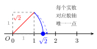

# 实数与无理数

有理数看似已经"填满"了数轴，但古希腊数学家毕达哥拉斯学派的传说揭示了一个令人震惊的事实：边长为 $1$ 的正方形，其对角线长度 $\sqrt{2}$ **无法用任何分数表示**。这迫使数的概念再一次扩张——引入无理数，最终形成**实数系**。本节梳理实数的结构，理解无理数的来源与识别方式，并建立实数与数轴的完整对应。

## 一、概念特征：怎么一眼认出

**无理数（Irrational Number）** 是无限不循环小数，不能写成 $\dfrac{p}{q}$（$p, q$ 为整数，$q \neq 0$）的形式。常见类型：

- 开方开不尽的数：$\sqrt{2},\, \sqrt{3},\, \sqrt{5},\, \sqrt[3]{2},\, \sqrt[3]{5}$（凡是 $\sqrt[n]{a}$ 不能化为整数或有限小数/循环小数的）
- 圆周率：$\pi = 3.14159265\ldots$（无限不循环）
- 自然对数底：$e = 2.71828\ldots$（高中内容，初中作为例子了解）
- 构造的无周期小数：$0.1010010001\ldots$（相邻两段 $1$ 之间的 $0$ 个数递增，没有周期）

**实数（Real Number）** 是有理数与无理数的并集：

$$\text{实数} = \text{有理数} \cup \text{无理数}$$

**关键负判断（以下均是有理数，不是无理数）**：
- $\sqrt{4} = 2$（整数）；$\sqrt{9} = 3$；$\sqrt{0.25} = 0.5$
- $0.\overline{3} = 0.333\ldots = \dfrac{1}{3}$（循环小数 = 有理数）
- $\dfrac{22}{7}$（分数，有理数，只是 $\pi$ 的近似值）

## 二、定义与核心命题

### 1. 无理数的严格判断依据

一个数是无理数，当且仅当它是**无限不循环小数**。

判断步骤：
1. 能否写成整数或分数（有限小数、循环小数）？能 $\Rightarrow$ 有理数。
2. 是开方结果？检查被开方数是否是完全平方数（或完全立方数）。是 $\Rightarrow$ 有理数；否 $\Rightarrow$ 无理数。
3. 是 $\pi$ 或明确声明无周期的小数 $\Rightarrow$ 无理数。

### 2. 实数与数轴的一一对应

**定理（基本事实）**：实数与数轴上的点**一一对应**——每个实数对应数轴上唯一的点；数轴上每个点对应唯一的实数。

这意味着数轴上不仅有有理数的点，还有无数无理数的点；有理数的点在数轴上"稠密"（任意两个有理数之间还有有理数），但并不"填满"数轴；无理数点填补了其余的"空隙"。

在数轴上用 $\bullet$ 标记整数点；用构造法（如等腰直角三角形的斜边）可以在数轴上精确标出 $\sqrt{2}$：以原点为一端、$1$ 为另一端作边长为 $1$ 的正方形，斜边 $= \sqrt{2}$，以原点为圆心画弧，交正半轴于点 $\sqrt{2}$。

### 3. 实数的运算

有理数的所有运算法则（加减乘除、乘方、绝对值、大小比较）在实数范围内**完全成立**，形式不变。无理数的加减乘除结果可能是有理数（如 $\sqrt{2} \times \sqrt{2} = 2$），也可能仍是无理数（如 $\sqrt{2} + \sqrt{3}$）。

### 4. 估算无理数的大小

利用"夹逼"：找两个整数 $n$ 和 $n+1$ 使得 $n^2 < a < (n+1)^2$，则 $n < \sqrt{a} < n+1$。可进一步精确到一位小数：在 $[n, n+1]$ 内找 $m$ 使 $m^2 < a < (m+0.1)^2$，等等。

## 三、推导：为什么要引入无理数

**$\sqrt{2}$ 为什么不是有理数？**（反证法，了解思路）

假设 $\sqrt{2} = \dfrac{p}{q}$（$p, q$ 为整数，$q \neq 0$，且 $\dfrac{p}{q}$ 已是最简分数，即 $p, q$ 互质）。则

$$2 = \frac{p^2}{q^2} \Rightarrow p^2 = 2q^2.$$

$p^2$ 是偶数，故 $p$ 是偶数，设 $p = 2k$，则 $4k^2 = 2q^2$，即 $q^2 = 2k^2$，$q^2$ 也是偶数，故 $q$ 也是偶数。但这与"$p, q$ 互质"矛盾——两者都是偶数，至少有公因数 $2$。矛盾！故 $\sqrt{2}$ 不能表示为分数，是无理数。

**为什么要让实数和数轴"一一对应"？** 直觉上感觉数轴上有好多点，有理数点之间有"空隙"（比如 $\sqrt{2}$ 在 $1$ 和 $2$ 之间，但不是有理数）。要让数轴真正成为"连续"的数的模型，必须用实数（有理数 + 无理数）填满所有点。这是数学严格化的要求，也是微积分和几何测量的基础。

**循环小数为什么是有理数？** 设 $x = 0.\overline{3} = 0.333\ldots$，则 $10x = 3.333\ldots = 3 + x$，故 $9x = 3$，$x = \dfrac{1}{3}$。任何循环小数都可以用类似方法化为分数，因此是有理数。无限**不循环**小数没有这样的方法，故不是有理数。

## 四、典型应用

### 例 1　判断有理数与无理数

判断以下各数哪些是无理数，哪些是有理数：$\sqrt{4}$，$\sqrt{5}$，$\pi$，$0.333\ldots$，$\dfrac{22}{7}$，$0.1010010001\ldots$（相邻两 $1$ 间 $0$ 的个数依次递增）。

【思路】逐一按定义判断：能化为整数或分数的是有理数；无限不循环的是无理数。

**解**：
- $\sqrt{4} = 2$，整数，**有理数**；
- $\sqrt{5}$ 是开方开不尽的数（$2^2 = 4 < 5 < 9 = 3^2$，$5$ 不是完全平方数），**无理数**；
- $\pi = 3.14159\ldots$，无限不循环小数，**无理数**；
- $0.333\ldots = 0.\overline{3} = \dfrac{1}{3}$，循环小数，**有理数**；
- $\dfrac{22}{7}$ 是分数，**有理数**（注意：$\dfrac{22}{7} \approx 3.1429 \neq \pi$，它只是 $\pi$ 的近似值）；
- $0.1010010001\ldots$ 小数部分无周期（$0$ 的个数不断增加，不形成循环节），**无理数**。

### 例 2　估算无理数的大小

估算 $\sqrt{20}$ 在哪两个相邻整数之间，并精确到小数点后一位。

【思路】先夹逼到相邻整数，再逐步细化到小数。

**解**：

**第一步**：$4^2 = 16 < 20 < 25 = 5^2$，故 $4 < \sqrt{20} < 5$。

**第二步**：在 $[4, 5]$ 内细化。试 $4.4^2 = 19.36 < 20$，$4.5^2 = 20.25 > 20$，故 $4.4 < \sqrt{20} < 4.5$。

**第三步**：四舍五入，取 $\sqrt{20} \approx 4.5$（精确到十分位）。

也可以记 $\sqrt{20} = 2\sqrt{5}$，$\sqrt{5} \approx 2.236$，故 $\sqrt{20} \approx 4.472$，同样在 $4$ 与 $5$ 之间。

### 例 3　含根号的实数大小比较

比较 $\sqrt{6} + 1$ 与 $\sqrt{7}$ 的大小。

【思路】直接估算或两边平方（注意两边均为正数时平方不改变大小关系）。

**解**：

估算：$\sqrt{6} \approx 2.449$，故 $\sqrt{6} + 1 \approx 3.449$；$\sqrt{7} \approx 2.646$。

由于 $3.449 > 2.646$，所以 $\sqrt{6} + 1 > \sqrt{7}$。

（验证：若要严格比较，可比较两者的平方：$(\sqrt{6}+1)^2 = 6 + 2\sqrt{6} + 1 = 7 + 2\sqrt{6} > 7 = (\sqrt{7})^2$，由于两边均为正数，故 $\sqrt{6}+1 > \sqrt{7}$。）

## 五、易错点 & 反例

1. **$\sqrt{9} = 3$，是有理数，不是无理数。** 反例：有人看到根号就认为是无理数，其实只有开方开不尽的数才是无理数。$\sqrt{1}, \sqrt{4}, \sqrt{9}, \sqrt{16}, \sqrt{25}, \ldots$ 都是整数（有理数）。

2. **$0.333\ldots$（无限循环小数）是有理数。** 循环小数可化为分数：$0.\overline{3} = \dfrac{1}{3}$，$0.\overline{142857} = \dfrac{1}{7}$，等等。"无限"不代表"无理"，关键是"是否循环"。

3. **$\dfrac{22}{7}$ 是有理数，不是 $\pi$。** $\dfrac{22}{7} = 3.142857142857\ldots$（循环）是 $\pi$ 的常用近似分数，但 $\pi$ 本身是无理数。考题中经常用 $\dfrac{22}{7}$ 混淆考生。

4. **$\sqrt{2} \times \sqrt{2} = 2$，两个无理数的乘积可以是有理数。** 反例：$\sqrt{2} \times \sqrt{3} = \sqrt{6}$ 仍是无理数；$\sqrt{2} \times \sqrt{2} = 2$ 是有理数。无理数之间的运算结果要具体分析，不能笼统地说"无理数 $+/-/\times/\div$ 无理数仍是无理数"。

5. **实数的大小比较中，不能凭"有根号就大/小"来判断。** 例如 $\sqrt{2} < 2$，$\sqrt{9} = 3 > \sqrt{8}$，要通过估算或平方比较（注意两边均正时才能平方）。

6. **无理数的小数表示没有周期，不能"看出"规律后当循环小数。** 例如 $\pi = 3.14159265358979\ldots$ 中虽然前几位 $9, 2, 6, 5$ 出现，但不是周期性循环。

## 六、思路自测题

1. 下列各数中，哪些是无理数？哪些是有理数？  
   $-\dfrac{\pi}{2}$，$\sqrt{0.04}$，$\sqrt[3]{8}$，$-\sqrt{11}$，$3.14$，$0.010110111\ldots$（每段 $1$ 后面 $0$ 的个数递增）。  
   💡 提示：$\sqrt{0.04} = 0.2$（有理数）；$\sqrt[3]{8} = 2$（有理数）；$3.14$ 是有限小数（有理数）；$-\dfrac{\pi}{2}$ 是 $\pi$ 乘以有理数（仍是无理数）；$0.010110111\ldots$ 看是否循环。

2. 用"夹逼"方法估算 $\sqrt{30}$ 所在的相邻整数区间，并精确到小数点后一位。  
   💡 提示：先找 $n$ 使 $n^2 < 30 < (n+1)^2$，再在 $[n, n+1]$ 中以 $0.1$ 为步长检验。

3. 比较大小：(1) $\sqrt{3} + 2$ 与 $\sqrt{3} + \sqrt{5}$；(2) $2\sqrt{3}$ 与 $3\sqrt{2}$（提示：平方比较）。  
   💡 提示：(1) 因为 $\sqrt{5} > 2$（因为 $5 > 4$），直接比较 $2$ 与 $\sqrt{5}$ 大小即可；(2) 两正数比大小可以比较它们的平方 $(2\sqrt{3})^2 = 12$，$(3\sqrt{2})^2 = 18$。

4. 实数 $a$ 满足 $(\sqrt{5} - 2)a = 1$。不用计算器，求 $a$ 的值，并说明 $a$ 是有理数还是无理数。  
   💡 提示：$a = \dfrac{1}{\sqrt{5}-2}$，分母有理化（乘以 $\sqrt{5}+2$）得 $a = \sqrt{5}+2$；再判断 $\sqrt{5}+2$ 是有理数还是无理数（无理数加有理数的结论）。
