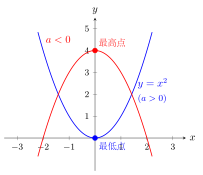
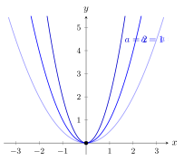
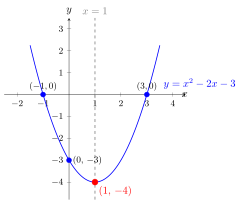

# 二次函数的概念与图象

> **一例速记**：  
> $y = x^2 - 2x - 3$（$a = 1 > 0$）：图象是一条**开口向上**的抛物线；  
> 对称轴 $x = -\dfrac{-2}{2 \times 1} = 1$；顶点 $(1, -4)$；图象关于直线 $x = 1$ 左右对称。  
> 口诀：$a > 0$ 开口向上，顶点是最低点；$a < 0$ 开口向下，顶点是最高点。

---

## 一、引入：生活中的抛物线

一个球被竖直上抛，忽略空气阻力，球的高度 $y$（米）与时间 $x$（秒）满足：

$$y = -5x^2 + 20x$$

又比如：某商场降价促销，降价幅度 $x$ 元时，利润 $y = -x^2 + 50x + 200$（元）。

这两个例子中，$y$ 与 $x$ 的关系都是"$y$ 等于含 $x^2$ 项的多项式"——这类函数，叫做**二次函数**。

---

## 二、二次函数的定义

**定义**：形如

$$\boxed{y = ax^2 + bx + c \quad (a \neq 0)}$$

的函数，叫做 $x$ 的**二次函数**（quadratic function）。其中：
- $a$ 叫做**二次项系数**（决定开口方向和宽窄）；
- $b$ 叫做**一次项系数**；
- $c$ 叫做**常数项**（即 $x = 0$ 时的函数值，纵轴截距）。

**核心条件**：$a \neq 0$——缺少这个条件，$x^2$ 项消失，就不再是二次函数了。

**判断方法**：看最高次项是否恰好是 $x$ 的二次项，且系数不为零。

### 哪些是二次函数？

| 函数 | 是否二次函数 | 理由 |
|------|-------------|------|
| $y = x^2$ | ✓ 是 | $a = 1 \neq 0$，$b = 0$，$c = 0$ |
| $y = (x-1)^2$ | ✓ 是 | 展开得 $y = x^2 - 2x + 1$，$a = 1$ |
| $y = \dfrac{1}{x^2}$ | ✗ 不是 | 含 $x^{-2}$ 次项，不是整式 |
| $y = 2x^2 + 1$ | ✓ 是 | $a = 2 \neq 0$ |
| $y = 0 \cdot x^2 + 3x$ | ✗ 不是 | $a = 0$，最高次为一次 |
| $y = x^3 - x^2$ | ✗ 不是 | 最高次为三次，不是二次函数 |

---

## 三、二次函数的图象——抛物线

**结论**：二次函数 $y = ax^2 + bx + c$ 的图象是一条**抛物线**（parabola）。

抛物线的两个基本特征：

1. **对称性**：抛物线关于某条竖直线（对称轴）左右对称；
2. **顶点**：对称轴与抛物线的交点，是抛物线的最高点或最低点。

### 开口方向

$a$ 的符号决定抛物线开口方向：

- **$a > 0$**：开口**向上**，顶点是**最低点**（函数有最小值）；
- **$a < 0$**：开口**向下**，顶点是**最高点**（函数有最大值）。

**口诀**：$a$ 正上开，$a$ 负下开；$|a|$ 越大开口越窄，$|a|$ 越小开口越宽。

### 对称轴公式

$$x = -\frac{b}{2a}$$

对称轴是一条**平行于 $y$ 轴**（即垂直于 $x$ 轴）的直线，不是一个点。写对称轴时要写"$x = \ldots$"的形式。

### 顶点坐标

顶点的横坐标就是对称轴的方程值，纵坐标把横坐标代回原式求得：

$$\text{顶点} = \left(-\frac{b}{2a},\ \frac{4ac - b^2}{4a}\right)$$

**实用记法**：顶点纵坐标 $k = \dfrac{4ac - b^2}{4a}$，但考试中直接把 $x = -\dfrac{b}{2a}$ 代回原式计算更稳妥，不容易出错。

---

## 四、图象画法（列表描点法）

画二次函数图象的步骤：

**第一步：找对称轴** $x = -\dfrac{b}{2a}$

**第二步：找顶点** $(h, f(h))$，$h = -\dfrac{b}{2a}$

**第三步：列表取关键 5 点**（顶点 + 对称轴两侧各 2 点，左右对称）

**第四步：描点** → **连线**（平滑曲线，注意两端无限延伸，不要封口）

**示例**：画 $y = x^2 - 2x - 3$ 的图象。

对称轴：$x = -\dfrac{-2}{2} = 1$

顶点：$y = 1 - 2 - 3 = -4$，顶点 $(1, -4)$

列表（以对称轴 $x = 1$ 为中心，向两侧各取 2 个点）：

| $x$ | $-1$ | $0$ | $1$（顶点）| $2$ | $3$ |
|-----|------|-----|-----------|-----|-----|
| $y$ | $0$ | $-3$ | $-4$ | $-3$ | $0$ |

注意：$x = -1$ 和 $x = 3$ 关于 $x = 1$ 对称，$y$ 值相等（都是 $0$）；$x = 0$ 和 $x = 2$ 关于 $x = 1$ 对称，$y$ 值相等（都是 $-3$）——这正是对称性的体现。

---

## 五、三种特殊情形

### 情形 1：$y = ax^2$（最简形式）

- $b = 0$，$c = 0$；
- 顶点在**原点** $(0, 0)$；
- 对称轴为 **$y$ 轴**（即 $x = 0$）；
- 图象关于 $y$ 轴对称。

示例：$y = 2x^2$，$y = -\dfrac{1}{3}x^2$。

### 情形 2：$y = a(x-h)^2$（顶点在 $x$ 轴上）

- $c = 0$ 时的顶点式写法；
- 顶点为 $(h, 0)$，落在 **$x$ 轴**上；
- 对称轴 $x = h$。

示例：$y = (x - 2)^2$，顶点 $(2, 0)$，对称轴 $x = 2$。

### 情形 3：$y = ax^2 + k$（顶点在 $y$ 轴上）

- $b = 0$；
- 顶点为 $(0, k)$，落在 **$y$ 轴**上；
- 对称轴为 $y$ 轴（$x = 0$）。

示例：$y = x^2 + 3$，顶点 $(0, 3)$；$y = -2x^2 - 1$，顶点 $(0, -1)$。

---

## 六、典型例题

### 例 1　判断哪些是二次函数

判断下列函数哪些是二次函数：

（1）$y = x^2$；（2）$y = (x-1)^2$；（3）$y = \dfrac{1}{x^2}$；（4）$y = 2x^2 + 1$

**解**：

（1）$y = x^2 = 1 \cdot x^2 + 0 \cdot x + 0$，$a = 1 \neq 0$，是二次函数。

（2）$y = (x-1)^2 = x^2 - 2x + 1$，$a = 1 \neq 0$，是二次函数。

（3）$y = \dfrac{1}{x^2} = x^{-2}$，含负指数，不是整式，**不是**二次函数。

（4）$y = 2x^2 + 1$，$a = 2 \neq 0$，是二次函数。

**答**：（1）（2）（4）是二次函数，（3）不是。

---

### 例 2　求开口方向、对称轴、顶点

求 $y = 2x^2 - 4x + 1$ 的开口方向、对称轴和顶点坐标。

**【思路】** $a = 2 > 0$ → 开口向上；对称轴 $x = -\dfrac{b}{2a}$；顶点代入求 $y$。

**解**：

这里 $a = 2$，$b = -4$，$c = 1$。

**开口方向**：$a = 2 > 0$，开口向上。

**对称轴**：$x = -\dfrac{b}{2a} = -\dfrac{-4}{2 \times 2} = -\dfrac{-4}{4} = 1$

即对称轴为直线 $x = 1$。

**顶点**：把 $x = 1$ 代入原式：

$$y = 2 \times 1^2 - 4 \times 1 + 1 = 2 - 4 + 1 = -1$$

顶点坐标为 $(1, -1)$。

**答**：开口向上；对称轴 $x = 1$；顶点 $(1, -1)$。

---

### 例 3　利用图象交点求对称轴

已知抛物线与 $x$ 轴的交点为 $(1, 0)$ 和 $(3, 0)$，求对称轴。

**【思路】** 抛物线关于对称轴对称，两个 $x$ 轴交点关于对称轴对称 → 对称轴过两交点横坐标的**中点**。

**解**：

两交点横坐标为 $x_1 = 1$，$x_2 = 3$。

由对称性，对称轴经过这两点的中点：

$$x = \frac{x_1 + x_2}{2} = \frac{1 + 3}{2} = 2$$

**答**：对称轴为 $x = 2$。

**【补充说明】** 这是对称性的直接应用：两个关于对称轴对称的点，横坐标的平均值就是对称轴的方程值。  
一般公式：若抛物线与 $x$ 轴交于 $(x_1, 0)$ 和 $(x_2, 0)$，则对称轴为 $x = \dfrac{x_1 + x_2}{2}$。

---

## 七、易错点归纳

**易错 1**：忘记 $a \neq 0$ 的条件。

二次函数的核心要求是最高次项系数不为零。若 $a = 0$，则 $x^2$ 项消失，变成一次函数或常数函数。

**易错 2**：对称轴公式写错符号。

$x = -\dfrac{b}{2a}$，注意前面有**负号**。$b = -4$ 时，$x = -\dfrac{-4}{2a} = \dfrac{4}{2a}$，不是 $-\dfrac{4}{2a}$。

**易错 3**：对称轴写成"点"而非"直线"。

对称轴是**直线**，应写 "$x = 1$"，不能只写 "$1$" 或 "顶点为 $1$"。

**易错 4**：顶点纵坐标计算错误。

最稳妥的做法是把 $x = -\dfrac{b}{2a}$ 代回**原函数式**，直接计算 $y$ 值，不要死记顶点纵坐标公式。

**易错 5**：描点时表格不对称。

列表时要确保各点关于对称轴**一一对应**，利用对称性可以减少计算量（左边算的 $y$ 值，右边对称位置直接填写相同值）。

---

## 八、自测题

**自测 1**（☆）

判断下列函数是否为二次函数：

（1）$y = x^2 - 3x + 2$；（2）$y = (2x + 1)(x - 3)$；（3）$y = x^3 - x^2$；（4）$y = -\dfrac{1}{2}x^2$。

> 💡 提示：展开后看 $a$（$x^2$ 项系数）是否为零；(3) 最高次是 3 次，排除。

---

**自测 2**（☆）

求 $y = -3x^2 + 6x - 2$ 的开口方向、对称轴和顶点坐标。

> 💡 提示：$a = -3 < 0$ → 开口向下；对称轴 $x = -\dfrac{6}{2 \times (-3)} = 1$；代 $x = 1$ 求顶点 $y$。

---

**自测 3**（☆☆）

已知抛物线与 $x$ 轴交于 $(-2, 0)$ 和 $(4, 0)$，求对称轴，并判断顶点在 $y$ 轴的哪一侧。

> 💡 提示：对称轴 $x = \dfrac{-2 + 4}{2} = 1$；$x = 1 > 0$，顶点在 $y$ 轴**右侧**。

---

**自测 4**（☆☆）

已知二次函数 $y = ax^2 + bx + c$ 的图象经过原点，请问 $c$ 等于多少？若还经过 $(1, 3)$，能确定 $a, b$ 的值吗？为什么？

> 💡 提示：经过原点 $(0, 0)$ → 代入得 $c = 0$；经过 $(1, 3)$ → 得 $a + b = 3$，一个方程两个未知量，无法唯一确定 $a, b$（还需要第三个条件）。

---

**回头看一眼"一例速记"**：

> $y = x^2 - 2x - 3$：$a = 1 > 0$，开口向上；  
> 对称轴 $x = -\dfrac{-2}{2} = 1$；顶点 $(1, -4)$（代 $x = 1$ 得 $y = 1 - 2 - 3 = -4$）。  
> 口诀：$a$ 正上开，顶点最低；对称轴 $x = -\dfrac{b}{2a}$，注意负号；顶点纵坐标代回原式算，别死记公式。
