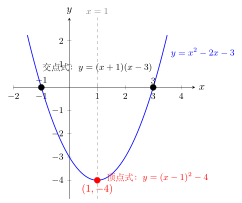
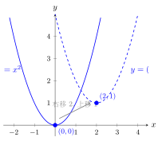

# 二次函数的三种形式

> **一例速记**：  
> 一般式 $y = ax^2 + bx + c$ → 顶点式 $y = a(x-h)^2 + k$ → 交点式 $y = a(x-x_1)(x-x_2)$。  
> **形式选对，解题秒杀**。  
> 见 $x$ 轴交点 → 交点式；见顶点 → 顶点式；只给三个普通点 → 一般式。

---

## 一、引入：同一条抛物线，三种写法

> 已知抛物线经过 $(-1, 0)$、$(3, 0)$、$(0, -3)$ 三个点，求解析式。用三种形式各试一次。

先停下来，想一想：三个点给了我们哪些信息？

- $(-1, 0)$ 和 $(3, 0)$：这两个点的纵坐标都是 $0$，也就是说它们在 **$x$ 轴上**——这两个点正好是抛物线与 $x$ 轴的交点！
- $(0, -3)$：纵坐标为 $-3$，$x = 0$，这是抛物线与 **$y$ 轴的交点**（即纵截距为 $-3$）。

三个点，三种信息，三种解法——我们逐一展开。

---

## 二、思维路径还原（解题者的内心独白）

> 题目给了三个点：$(-1, 0)$、$(3, 0)$、$(0, -3)$。我要求二次函数的解析式。
>
> **已知条件分析**：三个点提供三个条件；但有意思的是，前两个点正好是 $x$ 轴上的点——它们是 $y = 0$ 的解。这不是偶然，是出题人给的线索：**$(-1, 0)$ 和 $(3, 0)$ 是抛物线与 $x$ 轴的交点**！
>
> **方法 1：一般式**——设 $y = ax^2 + bx + c$，代入三个点列三元方程组，求 $a, b, c$。
>
> 代 $(-1, 0)$：$a - b + c = 0$ …… ①  
> 代 $(3, 0)$：$9a + 3b + c = 0$ …… ②  
> 代 $(0, -3)$：$c = -3$ …… ③  
>
> 由③得 $c = -3$；代入①：$a - b - 3 = 0$，得 $a - b = 3$ …… ④  
> 代入②：$9a + 3b - 3 = 0$，得 $9a + 3b = 3$，即 $3a + b = 1$ …… ⑤  
> ④＋⑤：$4a = 4$，得 $a = 1$；代入④：$b = a - 3 = -2$。  
>
> 解析式：$y = x^2 - 2x - 3$。**过程最繁琐，需解三元方程组。**
>
> **方法 2：交点式**——注意到 $(-1, 0)$ 和 $(3, 0)$ 是 $x$ 轴交点，立刻设 $y = a(x - x_1)(x - x_2)$。
>
> $x_1 = -1$，$x_2 = 3$，所以 $y = a(x - (-1))(x - 3) = a(x+1)(x-3)$。  
> 代入第三点 $(0, -3)$：$-3 = a(0+1)(0-3) = a \cdot 1 \cdot (-3) = -3a$。  
> 解得 $a = 1$。  
>
> 解析式：$y = (x+1)(x-3) = x^2 - 2x - 3$。**只代一个点，一步解 $a$，最快！**
>
> **方法 3：顶点式**——顶点式需要顶点 $(h, k)$，但题目没有直接给顶点。  
> 可先由 $x_1 = -1$，$x_2 = 3$ 推对称轴：$h = \dfrac{-1 + 3}{2} = 1$；  
> 再代 $x = 1$：$k = f(1) = a(1+1)(1-3) = a \cdot 2 \cdot (-2) = -4a$。  
> 但 $a$ 还未知，还需用第三点 $(0, -3)$ 再定 $a$……相比方法 2 并不简洁。
>
> 设 $y = a(x-1)^2 + k$，代 $(0, -3)$：$-3 = a - k$ + 额外步骤……  
>
> **关键反射确立**：
> - 见 $x$ 轴交点 → **交点式最快**（已知 $x_1, x_2$，代一个点解 $a$）；
> - 见顶点 → **顶点式最快**（已知 $h, k$，代一个点解 $a$）；
> - 都没有，只给三个普通点 → **一般式**（解三元方程组，步骤最多）。

---

## 三、三种形式详解

### 一般式

$$\boxed{y = ax^2 + bx + c \quad (a \neq 0)}$$

- **已知信息**：任意三个不同点（不要求有什么特殊位置）；
- **待定系数**：$a, b, c$ 三个——需要三个条件列三元方程组；
- **优势**：通用，任意情形均可用；
- **劣势**：计算量最大；
- **特殊读取**：
  - $c$ 就是**纵截距**（令 $x = 0$ 即得 $y = c$）；
  - 对称轴 $x = -\dfrac{b}{2a}$，顶点纵坐标 $\dfrac{4ac - b^2}{4a}$。

### 顶点式

$$\boxed{y = a(x-h)^2 + k \quad (a \neq 0)}$$

- **已知信息**：顶点 $(h, k)$ + 另外一个点；
- **待定系数**：$a, h, k$ 三个——但若顶点已知则 $h, k$ 已知，只需一个条件求 $a$；
- **优势**：顶点信息直接读取，求最值极便捷；
- **劣势**：需要知道顶点坐标；
- **特殊读取**：
  - 顶点 $(h, k)$ 直接读出；
  - 对称轴 $x = h$；
  - $a > 0$ 时最小值 $k$，$a < 0$ 时最大值 $k$。

**记忆关键**：顶点式中 $x$ 旁边减的是顶点横坐标，外面加的是顶点纵坐标。  
即 $y = a(x - h)^2 + k$ 的顶点是 $(h, k)$，**注意 $h$ 前面是负号**——$(x - h)$ 里的 $h$ 是顶点的 $x$ 坐标，不要写反符号。

### 交点式

$$\boxed{y = a(x-x_1)(x-x_2) \quad (a \neq 0)}$$

- **适用条件**：抛物线与 $x$ 轴有**两个交点** $x_1, x_2$（即 $\Delta > 0$）；
- **已知信息**：两个 $x$ 轴交点 $x_1, x_2$ + 另外一个点；
- **待定系数**：只需代一个点求 $a$；
- **优势**：$x$ 轴交点信息直接代入，最简洁；
- **劣势**：要求有 $x$ 轴交点且已知；
- **特殊读取**：
  - 令 $y = 0$ 即得 $x = x_1$ 或 $x = x_2$；
  - 对称轴 $x = \dfrac{x_1 + x_2}{2}$。

---

## 四、适用情形对照表

| 形式 | 公式 | 已知条件 | 代点次数 |
|------|------|----------|----------|
| **一般式** | $y = ax^2 + bx + c$ | 任意三个点 | 代 3 个点，解三元方程组 |
| **顶点式** | $y = a(x-h)^2 + k$ | 顶点 $(h, k)$ + 一个点 | 代 1 个点解 $a$ |
| **交点式** | $y = a(x-x_1)(x-x_2)$ | 两个 $x$ 轴交点 + 一个点 | 代 1 个点解 $a$ |

**选形式的黄金法则**：哪个形式用已知信息最多，就选哪个——剩余待定的系数越少越好。

---

## 五、形式互换

### 一般式 → 顶点式（配方法）

将 $y = ax^2 + bx + c$ 配方为 $y = a(x-h)^2 + k$：

$$h = -\frac{b}{2a}, \quad k = c - \frac{b^2}{4a} = \frac{4ac - b^2}{4a}$$

**配方步骤示例**：$y = x^2 - 4x + 1$

$$y = (x^2 - 4x) + 1 = (x^2 - 4x + 4) - 4 + 1 = (x-2)^2 - 3$$

顶点 $(2, -3)$，对称轴 $x = 2$。

**配方技巧**：提取 $a$ 后，括号内凑完全平方数；加了多少就减多少，保持等式不变。

### 一般式 → 交点式（求根）

将 $y = ax^2 + bx + c$ 改写为 $y = a(x - x_1)(x - x_2)$，需要先解方程 $ax^2 + bx + c = 0$：
- 若 $\Delta > 0$：有两不等实根 $x_1, x_2$，可以写交点式；
- 若 $\Delta = 0$：$x_1 = x_2$，只有一个切点，$y = a(x - x_1)^2$；
- 若 $\Delta < 0$：无实根，**不能**写成交点式。

---

## 六、方法变形

### 变形 1：平移规律（顶点式视角）

$y = a(x-h)^2 + k$ 是 $y = ax^2$ 经过**平移**得到的：
- 向右平移 $h$ 个单位（$h > 0$ 时右移，$h < 0$ 时左移）；
- 向上平移 $k$ 个单位（$k > 0$ 时上移，$k < 0$ 时下移）。

**口诀**：括号里减正数 = 右移；加正数 = 左移；加在外面正数 = 上移，负数 = 下移。  
**注意**：$y = (x - 2)^2$ 是 $y = x^2$ 向**右**移 2（括号里减 2），不是左移！

| 变换 | 原式 | 结果 |
|------|------|------|
| 右移 $h$（$h > 0$） | $y = ax^2$ | $y = a(x-h)^2$ |
| 上移 $k$（$k > 0$） | $y = ax^2$ | $y = ax^2 + k$ |
| 右移 $h$，上移 $k$ | $y = ax^2$ | $y = a(x-h)^2 + k$ |

### 变形 2：快速识别三种形式

- 看到 $(x - 2)^2$ 这种完全平方项 → 顶点式（顶点在括号里和常数项里）；
- 看到 $(x - 1)(x - 3)$ 这种两因式相乘 → 交点式（括号里是 $x$ 轴交点）；
- 看到 $ax^2 + bx + c$ 展开形式 → 一般式。

---

## 七、思考路标（条件反射训练）

每一条，读到"看到就秒反应"的程度：

1. **见"已知两个 $x$ 轴交点"** → 立刻设交点式 $y = a(x - x_1)(x - x_2)$，代第三点解 $a$，一步搞定。

2. **见"已知顶点"** → 立刻设顶点式 $y = a(x - h)^2 + k$（$h, k$ 已知），代另一点解 $a$。

3. **见"只给三个普通点"** → 设一般式，代三点列三元方程组，步骤最多但必须用。

4. **求最值 / 最高点 / 最低点** → 顶点式（顶点直接给出最值点）。

5. **求与 $x$ 轴交点** → 交点式（$x_1, x_2$ 直接读出）；或令一般式 $y = 0$ 解方程。

6. **配方** = 一般式 → 顶点式的桥梁（手动配方，每步加减相同值）。

7. **交点式能否写出？** → 先验证 $\Delta \geq 0$；$\Delta < 0$ 时无实根，不能写交点式。

8. **平移问题** → 转成顶点式，平移 = 改变 $h$（左右移）和 $k$（上下移）。

---

## 八、应用例题

### 例 1　用交点式求解析式

已知抛物线与 $x$ 轴交于 $(-1, 0)$ 和 $(3, 0)$，且经过点 $(0, -3)$，求解析式。

**【思路】** 已知两个 $x$ 轴交点 → 交点式最快。

**解**：

设 $y = a(x + 1)(x - 3)$（$a \neq 0$）。

代入点 $(0, -3)$：

$$-3 = a(0 + 1)(0 - 3) = a \cdot 1 \cdot (-3) = -3a$$

解得 $a = 1$。

解析式为：

$$y = (x + 1)(x - 3) = x^2 - 2x - 3$$

**验证**：代入 $(-1, 0)$：$y = (-1+1)(-1-3) = 0 \cdot (-4) = 0$ ✓；代入 $(3, 0)$：$y = (3+1)(3-3) = 4 \cdot 0 = 0$ ✓；代入 $(0,-3)$：$y = 1 \cdot (-3) = -3$ ✓。

**答**：$y = x^2 - 2x - 3$。

---

### 例 2　用顶点式求解析式

已知抛物线的顶点为 $(1, 4)$，且经过点 $(0, 3)$，求解析式。

**【思路】** 已知顶点 → 顶点式最快，$h = 1$，$k = 4$ 已知，代一个点解 $a$。

**解**：

设 $y = a(x - 1)^2 + 4$（$a \neq 0$）。

代入点 $(0, 3)$：

$$3 = a(0 - 1)^2 + 4 = a \cdot 1 + 4 = a + 4$$

解得 $a = -1$。

解析式为：

$$y = -(x - 1)^2 + 4$$

**验证**：代入 $(0, 3)$：$y = -(0-1)^2 + 4 = -1 + 4 = 3$ ✓；顶点为 $(1, 4)$，$a = -1 < 0$，开口向下，顶点是最高点，最大值为 $4$ ✓。

**答**：$y = -(x-1)^2 + 4$。

展开得 $y = -x^2 + 2x + 3$（一般式）。

---

### 例 3　一般式配方为顶点式

将 $y = x^2 - 4x + 1$ 化为顶点式，并写出顶点和对称轴。

**【思路】** 配方：把含 $x$ 的项凑成完全平方数。

**解**：

$$y = x^2 - 4x + 1$$

$$= (x^2 - 4x + 4) - 4 + 1$$

$$= (x - 2)^2 - 3$$

这就是顶点式 $y = (x - 2)^2 - 3$，其中 $a = 1$，$h = 2$，$k = -3$。

顶点坐标：$(2, -3)$。

对称轴：$x = 2$。

**关键步骤说明**：

- 第二步：在 $x^2 - 4x$ 后面加上 $\left(\dfrac{4}{2}\right)^2 = 4$（配方），同时在后面减去 $4$（等式平衡）；
- 凑完全平方数的规则：系数 $-4$ 的一半的平方 = $(-2)^2 = 4$。

**答**：顶点式 $y = (x-2)^2 - 3$；顶点 $(2, -3)$；对称轴 $x = 2$。

---

## 九、自测题

**自测 1**（☆）

已知抛物线与 $x$ 轴交于 $(2, 0)$ 和 $(5, 0)$，且经过点 $(0, 10)$，求解析式。

> 💡 提示：用交点式，设 $y = a(x-2)(x-5)$，代 $(0, 10)$ 解 $a$。

---

**自测 2**（☆）

已知抛物线顶点为 $(-2, 3)$，且经过点 $(0, 7)$，求解析式（写成顶点式）。

> 💡 提示：设 $y = a(x+2)^2 + 3$，代 $(0, 7)$ 解 $a$：$7 = 4a + 3$，得 $a = 1$。

---

**自测 3**（☆☆）

将 $y = 2x^2 - 8x + 5$ 化为顶点式，写出顶点坐标和对称轴。

> 💡 提示：提因数 $2$：$y = 2(x^2 - 4x) + 5$；括号内配方 $x^2 - 4x + 4 = (x-2)^2$；注意加了 $2 \times 4 = 8$，要减回去：$y = 2(x-2)^2 + 5 - 8 = 2(x-2)^2 - 3$。

---

**自测 4**（☆☆）

已知抛物线经过 $(-1, 0)$、$(0, -2)$、$(1, 0)$ 三个点，用两种方法求解析式（一般式法和交点式法），结果应一致。

> 💡 提示：交点式 $y = a(x+1)(x-1) = a(x^2 - 1)$，代 $(0, -2)$：$-2 = a(0-1) = -a$，得 $a = 2$；一般式代三点验证。

---

**自测 5**（☆☆☆）

已知抛物线 $y = a(x - 3)^2 + 1$ 经过点 $(1, -3)$：

（1）求 $a$ 的值；（2）将解析式化为一般式；（3）判断该抛物线与 $x$ 轴有几个交点（用 $\Delta$ 判断）。

> 💡 提示：（1）代 $(1, -3)$：$-3 = a(1-3)^2 + 1 = 4a + 1$，得 $a = -1$；（2）展开得 $y = -(x^2-6x+9)+1 = -x^2+6x-8$；（3）$\Delta = 36 - 32 = 4 > 0$，两个交点。

---

**回头看一眼"一例速记"**：

> 见 $x$ 轴交点 → 交点式 $y = a(x-x_1)(x-x_2)$，代一点解 $a$；  
> 见顶点 → 顶点式 $y = a(x-h)^2 + k$，代一点解 $a$；  
> 只给普通三点 → 一般式，解三元方程组。  
> **选对形式，计算量从三元方程组降为一个一元方程。**
