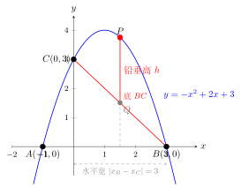
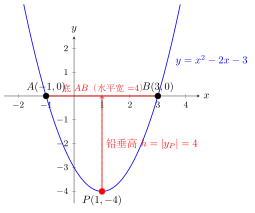

# 二次函数中三角形面积——铅垂高法

> **一例速记**：
>
> 二次函数图象上三角形面积的中考套路：**铅垂高 $\times$ 水平宽 $\div 2$**。
>
> $$S_{\triangle} = \frac{1}{2} \cdot |x_B - x_C| \cdot h$$
>
> 其中 $|x_B - x_C|$ 是底边两端点的**横坐标之差**（水平宽），$h$ 是动点到底所在直线的"铅垂高"（通过动点作 $x$ 轴垂线，与底直线交点之间的纵向距离）。
>
> 见"抛物线上动点 + 两定点围成三角形面积最值" → **铅垂高法**，铅垂高是关于动点横坐标的二次函数，再求二次函数最值。

---

## 一、引入题

> 抛物线 $y = -x^2 + 2x + 3$ 与 $x$ 轴交于 $A, B$ 两点（$A$ 在左，$B$ 在右），与 $y$ 轴交于 $C$。$P$ 是抛物线在**第一象限**内的动点。求 $\triangle PBC$ 面积的最大值。

这道题初看有点绕——$P$ 在曲线上动，三角形的"高"也随之变化，直接用面积公式需要点到直线的距离公式（初中不要求）。**铅垂高法**绕开了这个障碍。

---

## 二、思维路径还原（解题者的内心独白）

> "先把题目的基本信息搞清楚——找出 $A, B, C$ 的坐标。
>
> **求抛物线与 $x$ 轴的交点**（令 $y = 0$）：
>
> $$-x^2 + 2x + 3 = 0 \implies x^2 - 2x - 3 = 0 \implies (x+1)(x-3) = 0$$
>
> $x = -1$ 或 $x = 3$，所以 $A(-1, 0)$，$B(3, 0)$。
>
> **求抛物线与 $y$ 轴的交点**（令 $x = 0$）：
>
> $y = 0 + 0 + 3 = 3$，所以 $C(0, 3)$。
>
> **现在 $P$ 在第一象限抛物线上动**。第一象限要求 $x > 0, y > 0$，又要在抛物线上：$y = -x^2 + 2x + 3$，令 $y > 0$：$-x^2 + 2x + 3 > 0 \implies x^2 - 2x - 3 < 0 \implies (x+1)(x-3) < 0 \implies -1 < x < 3$。结合 $x > 0$，得 $0 < x < 3$。
>
> 设 $P(t, -t^2 + 2t + 3)$，其中 $0 < t < 3$。
>
> **求 $\triangle PBC$ 的面积——用铅垂高法。**
>
> **为什么不用"底 $\times$ 高 \div 2"中的"普通高"？** 因为底 $BC$ 不是水平或垂直的，$P$ 到 $BC$ 的距离需要点到直线距离公式，初中不方便。铅垂高法是个聪明的替代。
>
> **铅垂高法的思路**：以 $BC$ 为底，过 $P$ 向 $x$ 轴作垂线，垂线与直线 $BC$ 交于点 $Q$。那么 $|PQ|$ 就是铅垂高（$P$ 和 $Q$ 横坐标相同，只差纵坐标），而水平宽是 $|x_B - x_C|$。
>
> **但等一等——这里的"底"是 $BC$，不是水平线，直接用 $|x_B - x_C|$ 对吗？**
>
> 让我来验证一下。$B(3, 0)$，$C(0, 3)$，直线 $BC$：斜率 $= \dfrac{3 - 0}{0 - 3} = -1$，直线方程 $y = -x + 3$。
>
> 过 $P(t, -t^2 + 2t + 3)$ 作 $x$ 轴垂线，交直线 $BC$ 于 $Q$：$Q$ 的横坐标也是 $t$，代入直线方程得 $Q(t, -t + 3)$。
>
> 铅垂高 $h = |y_P - y_Q| = |(-t^2 + 2t + 3) - (-t + 3)| = |-t^2 + 3t| = |t(3 - t)|$。
>
> 因为 $0 < t < 3$，所以 $t > 0$ 且 $3 - t > 0$，故 $h = t(3 - t)$（非负，不需绝对值）。
>
> **"水平宽"怎么算？** $BC$ 两端点横坐标 $x_B = 3$，$x_C = 0$，水平宽 $= |3 - 0| = 3$。
>
> 但这里要小心——铅垂高法中"水平宽"等于 $|x_B - x_C|$ 这一结论，本质上是利用了"底 $BC$ 上的射影宽度"。让我从面积公式的角度确认：
>
> $S_{\triangle PBC} = \frac{1}{2} |x_B(y_C - y_P) + x_C(y_P - y_B) + x_P(y_B - y_C)|$（坐标面积公式）
>
> $= \frac{1}{2} |3(3 - y_P) + 0(y_P - 0) + t(0 - 3)|$
>
> $= \frac{1}{2} |9 - 3y_P - 3t|$
>
> $= \frac{3}{2} |3 - y_P - t|$
>
> 代入 $y_P = -t^2 + 2t + 3$：
>
> $= \frac{3}{2} |3 - (-t^2 + 2t + 3) - t| = \frac{3}{2} |t^2 - 3t| = \frac{3}{2} t(3-t)$（$0 < t < 3$）
>
> 这与铅垂高法结果一致：$S = \frac{1}{2} \times 3 \times t(3-t) = \frac{3}{2}t(3-t)$。完全吻合！铅垂高法是正确的。
>
> **现在求最大值。** $S = \frac{3}{2}(3t - t^2) = -\frac{3}{2}(t^2 - 3t) = -\frac{3}{2}\left(t - \frac{3}{2}\right)^2 + \frac{3}{2} \cdot \frac{9}{4}$
>
> $= -\frac{3}{2}\left(t - \frac{3}{2}\right)^2 + \frac{27}{8}$
>
> 这是关于 $t$ 的开口向下二次函数，当 $t = \dfrac{3}{2}$ 时取最大值 $\dfrac{27}{8}$。
>
> 验证 $t = \dfrac{3}{2} \in (0, 3)$ ✓（在定义域内）。
>
> **关键反射**：见"二次函数图象上三角形面积最值" → **铅垂高法**：选定底（两定点连线）→ 过动点作 $x$ 轴垂线 → 交底于 $Q$ → 铅垂高 $= |y_P - y_Q|$ → 代入二次函数最值方法。最终面积是动点参数 $t$ 的二次函数，配方求最值。"

---

## 三、抽象成方法

### 铅垂高法核心步骤（5 步）

1. **选底**：以两个定点（位置固定的点）的连线作为三角形的底；

2. **找底的直线方程**：用两点坐标写出底所在直线的方程 $y = kx + b$；

3. **过动点作垂线**：设动点 $P(t, y(t))$（$y(t)$ 是抛物线方程），过 $P$ 作 $x$ 轴垂线，与底直线交于 $Q(t, kt + b)$；

4. **求铅垂高**：$h = |y_P - y_Q| = |y(t) - (kt + b)|$（两点横坐标相同，纵坐标相减）；

5. **代入面积公式**：

   $$S = \frac{1}{2} \times |x_{底右} - x_{底左}| \times h = \frac{1}{2} \times \text{水平宽} \times h(t)$$

   $h(t)$ 是关于 $t$ 的二次函数（或一次），再用**顶点法**求最值。

### 为什么铅垂高法成立？

从坐标面积公式出发，三角形面积 $= \frac{1}{2}|x_B(y_C - y_P) + x_C(y_P - y_B) + x_P(y_B - y_C)|$，整理后恰好等于 $\frac{1}{2} \times |x_B - x_C| \times |y_P - y_Q|$（其中 $Q$ 是底直线上横坐标为 $x_P$ 的点）。因此，**铅垂高法是坐标面积公式的等价变形**，不是近似，而是精确等式。

### 水平宽 vs 铅垂高

| 量 | 含义 | 计算方式 |
|---|---|---|
| **水平宽** | 底边两端点横坐标之差的绝对值 | $\vert x_B - x_C\vert$（固定值，与 $t$ 无关） |
| **铅垂高** | 动点与底直线在同一横坐标处的纵坐标之差 | $\vert y(t) - (kt + b)\vert$（含 $t$ 的函数） |

---

## 四、方法变形

### 变形 1：底为水平线（$y = 0$ 即 $x$ 轴）时的简化

若底边在 $x$ 轴上（如 $B(-1, 0)$，$C(3, 0)$），直线方程 $y = 0$，铅垂高就退化为**动点纵坐标** $|y_P|$，水平宽为 $|x_C - x_B|$：

$$S = \frac{1}{2} \times |x_C - x_B| \times |y_P|$$

此时无需作 $Q$ 点，直接用动点纵坐标即可。这是铅垂高法的最简形式。

### 变形 2：存在性反求——给定面积求动点位置

**题型**：在引入题中，是否存在第一象限内的点 $P$，使 $\triangle PBC$ 面积等于 $3$？若存在，求 $P$ 的坐标。

**解法**：令面积等式：

$$\frac{3}{2}t(3 - t) = 3 \implies t(3 - t) = 2 \implies 3t - t^2 = 2 \implies t^2 - 3t + 2 = 0$$

$$\implies (t - 1)(t - 2) = 0 \implies t = 1 \text{ 或 } t = 2$$

两值均在 $(0, 3)$ 内，故存在两个这样的点。

- $t = 1$：$P(1, -1 + 2 + 3) = P(1, 4)$
- $t = 2$：$P(2, -4 + 4 + 3) = P(2, 3)$

**验证**：$P(1, 4)$ 时，铅垂高 $= 1 \times (3-1) = 2$，面积 $= \frac{1}{2} \times 3 \times 2 = 3$ ✓

### 变形 3：底为斜线时的完整流程

**题型**：动点 $P$ 在曲线上，底边 $BC$ 不水平。

**解法**：不要担心——步骤一样，只需在第 3 步把 $Q$ 的纵坐标用底的直线方程算出来。例如，底直线 $y = -x + 3$，横坐标为 $t$ 的点 $Q$ 的纵坐标就是 $-t + 3$，铅垂高 $= |y_P - (-t + 3)|$。

---

## 五、思考路标（条件反射训练）

读每一条，练到"看到就秒反应"：

1. **见"抛物线上三角形面积"** → 立刻想**铅垂高法**。不要想点到直线距离公式（那是高中工具）。

2. **选底** → 以两个**定点**（坐标固定）的连线作底，另一顶点是**动点**。这样水平宽是常数，只有铅垂高含 $t$。

3. **过动点作 $x$ 轴垂线** → 与底直线交于 $Q(t, kt + b)$，铅垂高 $= |y_P - y_Q|$（纵坐标差绝对值）。

4. **铅垂高化简** → $|y_P - y_Q|$ 代入两点坐标后，去绝对值（在定义域内确认符号），得到关于 $t$ 的表达式。

5. **水平宽 $\times$ 铅垂高 $\div 2$** → 面积 $S(t)$ 是关于 $t$ 的二次函数，**配方**求最值（顶点法）。

6. **存在性反求** → 给定面积 $S_0$，令 $S(t) = S_0$ 解方程，验证 $t$ 在合法范围内，代入抛物线方程求 $P$ 坐标。

---

## 六、应用例题

### 例 1　基础面积最值（引入题完整解）

**题**：抛物线 $y = -x^2 + 2x + 3$ 与 $x$ 轴交于 $A(-1,0), B(3,0)$，与 $y$ 轴交于 $C(0,3)$。$P$ 是抛物线在第一象限内的动点。求 $\triangle PBC$ 面积的最大值。

【思路】以 $BC$ 为底，用铅垂高法，铅垂高是 $t$ 的二次函数，再求最值。

**解**：

设 $P(t, -t^2 + 2t + 3)$，$0 < t < 3$（第一象限约束）。

直线 $BC$：经过 $B(3, 0), C(0, 3)$，方程为 $y = -x + 3$。

过 $P$ 作 $x$ 轴垂线，交直线 $BC$ 于 $Q(t, -t + 3)$。

铅垂高：

$$h = y_P - y_Q = (-t^2 + 2t + 3) - (-t + 3) = -t^2 + 3t = t(3 - t)$$

（$0 < t < 3$ 时，$t > 0$，$3 - t > 0$，故 $h > 0$，不需绝对值。）

水平宽：$|x_B - x_C| = |3 - 0| = 3$。

面积：

$$S = \frac{1}{2} \times 3 \times t(3 - t) = \frac{3}{2}(3t - t^2)$$

配方：

$$S = -\frac{3}{2}t^2 + \frac{9}{2}t = -\frac{3}{2}\left(t - \frac{3}{2}\right)^2 + \frac{3}{2} \cdot \frac{9}{4} = -\frac{3}{2}\left(t - \frac{3}{2}\right)^2 + \frac{27}{8}$$

开口向下，当 $t = \dfrac{3}{2} \in (0, 3)$ 时取最大值。

$$S_{\max} = \frac{27}{8}$$

此时 $P\!\left(\dfrac{3}{2},\ -\dfrac{9}{4} + 3 + 3\right) = P\!\left(\dfrac{3}{2}, \dfrac{15}{4}\right)$。

**答**：$\triangle PBC$ 面积的最大值为 $\dfrac{27}{8}$，此时 $P = \left(\dfrac{3}{2}, \dfrac{15}{4}\right)$。

---

### 例 2　存在性反求

**题**：同上题，是否存在点 $P$ 使 $\triangle PBC$ 面积等于 $3$？若存在，求出所有满足条件的 $P$ 的坐标。

【思路】令 $S(t) = 3$，解关于 $t$ 的方程，验证 $t \in (0, 3)$，再求 $P$ 的纵坐标。

**解**：

由例 1，$S = \dfrac{3}{2}t(3 - t)$，令 $S = 3$：

$$\frac{3}{2}t(3 - t) = 3 \implies t(3 - t) = 2 \implies -t^2 + 3t - 2 = 0 \implies t^2 - 3t + 2 = 0$$

$$(t - 1)(t - 2) = 0 \implies t = 1 \text{ 或 } t = 2$$

两值均在 $(0, 3)$ 内，均满足要求。

对应 $P$ 的纵坐标：

- $t = 1$：$y = -1 + 2 + 3 = 4$，$P_1(1, 4)$；
- $t = 2$：$y = -4 + 4 + 3 = 3$，$P_2(2, 3)$。

**验证**（$t = 1$）：铅垂高 $h = 1 \times (3 - 1) = 2$，$S = \frac{1}{2} \times 3 \times 2 = 3$ ✓

**答**：存在两个满足条件的点：$P_1(1, 4)$ 和 $P_2(2, 3)$。

---

### 例 3　底边在 $x$ 轴上的简化情形

**题**：抛物线 $y = x^2 - 2x - 3$ 与 $x$ 轴交于 $A, B$（$A$ 在左，$B$ 在右）。$P$ 是抛物线在 $x$ 轴**下方**的动点。求 $\triangle PAB$ 面积的最大值。

【思路】底 $AB$ 在 $x$ 轴上，铅垂高直接是动点纵坐标的绝对值。

**解**：

**求 $A, B$ 坐标**：令 $y = 0$，$x^2 - 2x - 3 = 0$，$(x-3)(x+1) = 0$，$x = -1$ 或 $x = 3$。故 $A(-1, 0)$，$B(3, 0)$，水平宽 $= 4$。

**配方**：$y = (x-1)^2 - 4$，顶点 $(1, -4)$，开口向上。

抛物线在 $x$ 轴下方（$y < 0$）的部分对应 $-1 < x < 3$，设 $P(t, t^2 - 2t - 3)$，$-1 < t < 3$。

底 $AB$ 在 $x$ 轴上，铅垂高 $= |y_P| = |t^2 - 2t - 3|$。

$P$ 在 $x$ 轴下方时 $y_P < 0$，故 $|y_P| = -(t^2 - 2t - 3) = -t^2 + 2t + 3$。

面积：

$$S = \frac{1}{2} \times 4 \times (-t^2 + 2t + 3) = 2(-t^2 + 2t + 3) = -2(t^2 - 2t - 3)$$

$$= -2[(t-1)^2 - 4] = -2(t-1)^2 + 8$$

当 $t = 1 \in (-1, 3)$ 时，$S_{\max} = 8$，此时 $P(1, 1 - 2 - 3) = P(1, -4)$（即顶点）。

**答**：$\triangle PAB$ 面积的最大值为 $8$，此时 $P$ 在抛物线顶点 $(1, -4)$ 处。

---

## 七、自测题

**自测 1**　抛物线 $y = x^2 - 4x + 3$ 与 $x$ 轴交于 $A, B$（$A$ 在左，$B$ 在右），$C$ 为顶点。$P$ 是抛物线上 $A$ 和 $B$ 之间（不含端点）的动点。求 $\triangle PAB$ 面积的最大值。

> 💡 提示：$A(1,0), B(3,0)$，水平宽 $= 2$。顶点 $C(2,-1)$——注意 $C$ 在 $x$ 轴下方，$P$ 也在 $x$ 轴下方（$1 < t < 3$ 时 $y < 0$）。铅垂高 $= |y_P| = -(t^2 - 4t + 3)$，设 $t \in (1, 3)$。$S = \frac{1}{2} \times 2 \times [-(t^2-4t+3)] = -(t-2)^2+1$，最大值 $1$，在 $t=2$ 时取得，$P(2,-1)$（即顶点）。

**自测 2**　抛物线 $y = -x^2 + 4x$ 上有动点 $P$，直线 $l$ 经过 $(0, 0)$ 和 $(4, 0)$。$P$ 在直线 $l$ 上方时，求 $\triangle P(0,0)(4,0)$ 面积的最大值。

> 💡 提示：底为 $(0,0)$ 到 $(4,0)$ 的 $x$ 轴线段，水平宽 $= 4$。铅垂高 $= y_P = -t^2+4t$（$P$ 在 $x$ 轴上方，$0 < t < 4$）。$S = \frac{1}{2} \times 4 \times (-t^2+4t) = 2(-t^2+4t) = -2(t-2)^2+8$，最大值 $8$，在 $t=2$，$P(2,4)$。

**自测 3**　抛物线 $y = x^2 - 2x - 8$ 与 $x$ 轴交于 $A, B$，$P$ 为抛物线 $x$ 轴下方部分的动点。设 $P$ 的横坐标为 $t$，写出 $\triangle PAB$ 面积 $S$ 关于 $t$ 的表达式，并求最大值。

> 💡 提示：令 $y=0$，$(x-4)(x+2)=0$，$A(-2,0), B(4,0)$，水平宽 $=6$，$t \in (-2, 4)$。铅垂高 $= |y| = -(t^2-2t-8) = -t^2+2t+8$（$P$ 在 $x$ 轴下方时 $y < 0$）。$S = \frac{1}{2} \times 6 \times (-t^2+2t+8) = 3(-t^2+2t+8) = -3(t-1)^2+27$。$S_{\max} = 27$，在 $t=1$，$P(1, 1-2-8)=P(1,-9)$。

**自测 4**　在自测 3 中，是否存在点 $P$ 使 $\triangle PAB$ 面积等于 $24$？若存在，求 $P$ 坐标。

> 💡 提示：令 $S = 24$：$-3(t-1)^2+27=24$，$(t-1)^2=1$，$t=0$ 或 $t=2$（均在 $(-2,4)$ 内）。$t=0$：$P(0,-8)$；$t=2$：$P(2,4-4-8)=P(2,-8)$。验证：$t=0$ 时铅垂高 $= |-8| = 8$，$S = \frac{1}{2} \times 6 \times 8 = 24$ ✓。两点均满足。

**自测 5**　（综合）抛物线 $y = -x^2 + 2x + 8$ 与 $x$ 轴交于 $A(-2,0), B(4,0)$（需验证），与 $y$ 轴交于 $C$。$P$ 是第一象限内抛物线上的动点。求 $\triangle PAC$ 面积的最大值，并求此时 $P$ 的坐标。

> 💡 提示：$C(0,8)$。直线 $AC$：过 $A(-2,0), C(0,8)$，斜率 $=4$，方程 $y=4x+8$。设 $P(t, -t^2+2t+8)$，第一象限要求 $0 < t < 4$（令 $y > 0$，$-x^2+2x+8>0$，$(x-4)(x+2)<0$，$-2<x<4$，结合 $x>0$ 得 $0<t<4$）。铅垂高 $= |y_P - (4t+8)| = |{-t^2+2t+8 - 4t - 8}| = |-t^2-2t| = t^2+2t = t(t+2)$（$0<t<4$ 时 $y_P < 4t+8$ 需验证：差 $= -t^2-2t < 0$，故 $|差| = t^2+2t$）。水平宽 $= |x_A - x_C| = |-2-0| = 2$。$S = \frac{1}{2} \times 2 \times t(t+2) = t(t+2) = t^2+2t$。这是关于 $t$ 的**开口向上二次函数**（无最大值），但 $t \in (0,4)$ 是有界区间，最大值在端点附近取。由于端点开区间，取 $t \to 4^-$：$S \to 4 \times 6 = 24$（不可取得）。因此在 $(0,4)$ 内 $S$ 无最大值（趋向但不等于 $24$）。——本题说明：**底的选取很重要**，若选 $BC$ 为底，铅垂高关于 $t$ 可能是开口向下的二次函数，才能有最大值。

---

**回头看一眼"一例速记"**：

> $S_{\triangle} = \dfrac{1}{2} \cdot \text{水平宽} \cdot \text{铅垂高}$
>
> **铅垂高 = 动点纵坐标 $-$ 底直线在同一 $x$ 处的纵坐标**（绝对值）
>
> **水平宽 = 底两端点横坐标之差**（绝对值）
>
> 铅垂高是关于动点参数 $t$ 的函数（通常是二次）→ 再用**顶点法**求最值。
>
> **"铅垂高法"= 绕开点到直线距离公式的中考利器。**

如果你现在能徒手写出引入题的完整解（从求 $A, B, C$ 到配方求最大值），并解出存在性反求题，说明你已掌握了这一套路。
