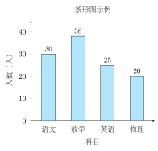
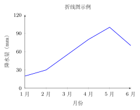
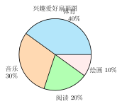
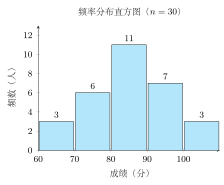

# 常见统计图表

---

## 一、概念特征：一眼认图

中学统计中常用四种统计图表，每种都有鲜明的外形特征：

- **条形图**：一排**等宽的矩形柱**，高低代表数量；
- **折线图**：数据点用**折线段依次连接**，强调变化趋势；
- **扇形图**（饼图）：整个**圆分成若干扇形**，每扇形对应一个类别的占比；
- **频率分布直方图**：类似条形图，但矩形**之间无间隔**，横轴为连续区间，纵轴常为频率/组距。

"选哪种图"是中考高频考点：比较类别数量选条形，看变化趋势选折线，看各部分占比选扇形，分析大量数据分布选直方图。

---

## 二、四种统计图的对比

| 图 | 外形 | 横轴 | 纵轴 | 主要用途 | 核心优势 |
|---|---|---|---|---|---|
| **条形图** | 等宽矩形柱（有间隔）| 类别名称 | 频数或数量 | 比较各类别的数量大小 | 直观比较，一眼看出最大/最小 |
| **折线图** | 数据点 + 折线段 | 时间或顺序变量 | 数量或指标值 | 反映数据随时间（或顺序）的变化趋势 | 清晰展现增减趋势和波动 |
| **扇形图** | 圆分扇形，各扇形角度不同 | 无（类别标注在扇形旁）| 无（用扇形面积比表示百分比）| 展示各部分占总体的百分比 | 直观反映构成比例，总和 = 100% |
| **频率分布直方图** | 等宽矩形柱（无间隔）| 连续数据区间 $[a, b)$ | 频率/组距（或频率、频数）| 大量数据按区间分组，展示分布形态 | 反映数据的集中/分散状况 |

四种统计图示例：

---

## 三、频率分布直方图的画法

频率分布直方图是四种图中**作图步骤最复杂**的，也是中考重点。

**基本术语**：
- **极差**：数据中最大值与最小值之差，$\text{极差} = x_{\max} - x_{\min}$；
- **组数**：将数据分成几组（通常 5-10 组，视数据规模而定）；
- **组距**：每组的区间长度，$\text{组距} = \dfrac{\text{极差}}{\text{组数}}$；
- **频数**：落在某组区间内的数据个数；
- **频率**：某组频数占总数据个数的比例，$\text{频率} = \dfrac{\text{频数}}{\text{总数据个数}}$；
- **频率/组距**：每组频率除以组距，是频率分布直方图纵轴最规范的取值（可使各矩形面积之和 $= 1$）。

**作图步骤**：

**第一步：求极差。**  
$\text{极差} = x_{\max} - x_{\min}$

**第二步：确定组数与组距。**  
根据数据总量和极差，选定合适的组数，计算组距：$d = \dfrac{\text{极差}}{\text{组数}}$

**第三步：划分区间（左闭右开）。**  
$[x_{\min},\ x_{\min}+d),\ [x_{\min}+d,\ x_{\min}+2d),\ \ldots$  
注意：每个区间为**左闭右开** $[a, b)$，即左端点属于本组，右端点属于下一组（最后一组通常为左右都闭）。

**第四步：统计频数，计算频率。**  
逐一将数据归入对应区间，统计每组频数；  
频率 $= \dfrac{\text{各组频数}}{\text{数据总个数}}$，所有组频率之和 $= 1$。

**第五步：画矩形。**  
横轴标各区间端点，纵轴标频率/组距（或频率），在每个区间上画对应高度的矩形，**矩形之间不留间隔**。

**关键性质**：每个矩形的面积 $= $ 频率/组距 $\times$ 组距 $= $ 频率；所有矩形面积之和 $= 1$。

---

## 四、典型例题

### 例 1　扇形图读数

> **题目**：某班共 50 名同学，数学期末成绩的扇形图显示"90分以上"占 $60\%$，"60-90分"占 $32\%$，"60分以下"占 $8\%$。  
> （1）求"90分以上"的同学有多少人？  
> （2）验证扇形图各部分百分比之和是否为 100%。

**【思路】** 扇形图中，某部分的人数 $=$ 总人数 $\times$ 该部分百分比。各部分百分比之和应为 100%。

**解**：

（1）$90$ 分以上人数 $= 50 \times 60\% = 50 \times 0.6 = 30$（人）

（2）各部分百分比之和：$60\% + 32\% + 8\% = 100\%$ ✓

**答**：$90$ 分以上的同学有 $30$ 人；各部分百分比之和为 $100\%$，符合扇形图性质。

---

### 例 2　频率分布直方图

> **题目**：某校 50 名同学参加体能测试（立定跳远），成绩（单位：cm）如下：
>
> 170, 175, 180, 185, 165, 190, 178, 182, 168, 172,  
> 188, 176, 184, 169, 193, 177, 183, 171, 186, 174,  
> 163, 191, 179, 185, 167, 181, 173, 188, 176, 192,  
> 166, 180, 174, 189, 162, 183, 177, 170, 185, 164,  
> 178, 186, 172, 190, 168, 184, 175, 183, 169, 187
>
> 请完成频率分布直方图的制作过程（分 5 组）。

**【思路】** 按步骤：极差 → 组距 → 区间划分 → 频数统计 → 频率计算 → 画图描述。

**解**：

**第一步：求极差。**  
最大值 $x_{\max} = 193$，最小值 $x_{\min} = 162$。  
极差 $= 193 - 162 = 31$（cm）

**第二步：确定组数与组距。**  
取组数 $= 6$（覆盖区间 $[160, 196)$，组距 $d = 6$）。

**第三步：划分区间（左闭右开）。**  
$[160,166),\ [166,172),\ [172,178),\ [178,184),\ [184,190),\ [190,196)$

**第四步：统计频数，计算频率。**

| 区间 | 频数 | 频率 | 频率/组距 |
|------|------|------|-----------|
| $[160, 166)$ | 5 | $\dfrac{5}{50} = 0.10$ | $\dfrac{0.10}{6} \approx 0.0167$ |
| $[166, 172)$ | 10 | $\dfrac{10}{50} = 0.20$ | $\dfrac{0.20}{6} \approx 0.0333$ |
| $[172, 178)$ | 12 | $\dfrac{12}{50} = 0.24$ | $\dfrac{0.24}{6} = 0.0400$ |
| $[178, 184)$ | 13 | $\dfrac{13}{50} = 0.26$ | $\dfrac{0.26}{6} \approx 0.0433$ |
| $[184, 190)$ | 7  | $\dfrac{7}{50} = 0.14$  | $\dfrac{0.14}{6} \approx 0.0233$ |
| $[190, 196)$ | 3  | $\dfrac{3}{50} = 0.06$  | $\dfrac{0.06}{6} = 0.0100$ |
| **合计** | **50** | **1.00** | — |

**第五步：描述直方图形态。**  
各矩形高度（频率/组距）如上表。成绩主要集中在 $[172, 184)$ 区间，呈近似对称的单峰分布（峰值在 $[178, 184)$ 组）。

**答**：频率之和为 $1$，数据分布向中间集中，呈近似正态分布形态。

---

### 例 3　图表选择

> **题目**：下列场景各适合用哪种统计图？请选择并说明理由。
>
> （1）分析某城市 2018–2024 年每年的年降水量变化；  
> （2）展示某班同学最喜欢的课外活动（读书、运动、游戏、音乐）各占的百分比；  
> （3）比较五个城市 2024 年的平均气温高低；  
> （4）分析某次考试 100 名同学成绩的分布情况（是否集中、是否偏态）。

**【思路】** 抓关键词："变化趋势"→折线图；"百分比/占比"→扇形图；"各类别高低比较"→条形图；"分布形态"→频率分布直方图。

**解**：

（1）关键词：**年份顺序** + **变化**。选**折线图**——横轴为年份，折线的高低起伏直接反映年降水量的增减趋势。

（2）关键词：**各部分占总体的百分比**。选**扇形图**——四类活动合计 100%，扇形面积比即为人数比例，直观展示构成。

（3）关键词：**比较各城市数量大小**，各城市是独立类别。选**条形图**——每个城市一根柱，高度表示气温，便于直观比较。

（4）关键词：**大量数据（100 人）的分布形态**，需要看数据是否集中、是否有偏态。选**频率分布直方图**——将成绩分区间统计频率，直方图形态直接反映分布特征。

**答**：（1）折线图；（2）扇形图；（3）条形图；（4）频率分布直方图。

---

## 五、易错点 & 反例

**易错 1**：扇形图各扇形百分比之和不等于 100%。

扇形图对应一个整体，各部分合起来必须等于 100%（= 360°）。若题目给出扇形图并让你求某一扇形的百分比，可以用"100% 减去其余已知部分之和"来计算。

**易错 2**：频率分布直方图区间用左闭右开，但边界处理出错。

区间约定为 $[a, b)$，意味着 $a$ 归入本组，$b$ 归入下一组。边界上的数据只属于其中一个区间，不能重复计算。

**反例**：若某区间为 $[170, 175)$，则成绩恰好为 $175$ 的同学归入下一组 $[175, 180)$，不归入 $[170, 175)$。

**易错 3**：混淆"频数"与"频率"。

- 频数：绝对数量（几个数据落在该区间内），单位是"个"；
- 频率：相对比例（无单位，介于 0 和 1 之间），$\text{频率} = \dfrac{\text{频数}}{\text{总个数}}$。

频率随总数变化，用于不同总量之间的比较；频数是原始计数。

**易错 4**：频率分布直方图中矩形之间留了间隔。

频率分布直方图的矩形**必须紧靠**，不留间隔——这强调数据是连续分组的，不同于条形图（类别是离散的，柱之间有间隔）。

**易错 5**：选图时用扇形图描述"变化趋势"。

扇形图只能反映**某一时刻**各部分的构成比例，不能反映随时间的**变化趋势**。描述趋势必须用折线图。

---

## 六、思路自测题

**自测 1**（☆）

下列叙述正确的是（　　）

A. 扇形图中各扇形面积之和可以不等于圆面积  
B. 频率分布直方图纵轴只能表示频率，不能表示频率/组距  
C. 频率分布直方图中，每个矩形面积等于该组的频率  
D. 条形图中，各矩形柱之间必须紧靠，不留间隔

> 💡 提示：扇形图各部分加起来是整体，面积之和 = 圆面积（A 错）；纵轴可以是频率/组距（B 错）；各矩形面积 = 频率/组距 × 组距 = 频率（C 对）；条形图柱之间有间隔，是频率分布直方图无间隔（D 错）。答案选 C。

---

**自测 2**（☆）

某班 40 名同学的兴趣爱好调查结果如下：喜欢体育的 16 人，喜欢音乐的 12 人，喜欢阅读的 8 人，喜欢绘画的 4 人。

（1）若用扇形图表示，"喜欢体育"对应的扇形角度是多少度？  
（2）各类别所占百分比分别是多少？

> 💡 提示：某类百分比 = 该类人数 / 总人数；扇形角度 = 百分比 × 360°。体育：$\frac{16}{40} = 40\%$，角度 $= 40\% \times 360° = 144°$。

---

**自测 3**（☆☆）

20 名同学的数学成绩如下（单位：分）：

$$72,\ 85,\ 91,\ 63,\ 78,\ 88,\ 74,\ 82,\ 95,\ 69,$$
$$80,\ 76,\ 84,\ 93,\ 67,\ 79,\ 86,\ 71,\ 88,\ 75$$

以 $[60,70),\ [70,80),\ [80,90),\ [90,100]$ 为区间，分别求各区间的频数和频率，并说明哪个区间人数最多。

> 💡 提示：逐一将成绩归入各区间，统计频数，再除以 20 得频率。$[60,70)$：63,67,69 → 3 人；$[70,80)$：72,74,75,76,78,79 → 6 人；$[80,90)$：80,82,84,85,86,88,88 → 7 人；$[90,100]$：91,93,95 → 3 人。最多的是 $[80,90)$。

---

**自测 4**（☆☆）

小红统计了她每周各科作业用时（小时）：语文 3，数学 5，英语 4，物理 3，化学 2，生物 1。她想用这组数据制作统计图。

（1）若想比较各科作业用时的多少，选哪种图？  
（2）若想展示数学作业用时占所有作业总用时的百分比，选哪种图？请计算该百分比。

> 💡 提示：（1）比较各类别数量 → 条形图；（2）展示占比 → 扇形图，总用时 $= 3+5+4+3+2+1=18$ 小时，数学占 $\frac{5}{18} \approx 27.8\%$。
