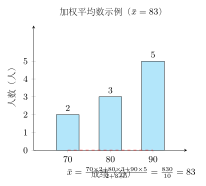
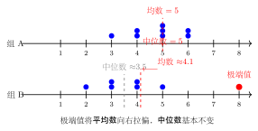

# 数据的集中趋势：平均数、中位数、众数

---

## 一、概念特征：三种"代表值"各有侧重

描述一组数据的**集中趋势**（即数据整体的"中心"在哪里），有三种常用指标：

- **平均数 $\bar{x}$**：将所有数据"均摊"后每人得到的值——最常用，但容易被极端值"拉偏"；
- **中位数**：将数据从小到大排列后，位于正中间的那个数——稳健，不受极端值影响；
- **众数**：出现次数最多的数——反映"最普遍"或"最流行"的值。

三者都是数据的**代表值**，但侧重不同，选用时需结合实际意义和数据特征。

---

## 二、定义与计算法则

### 2.1 平均数

**定义**：$n$ 个数据的算术平均数等于它们的总和除以数据个数。

$$\bar{x} = \frac{x_1 + x_2 + \cdots + x_n}{n} = \frac{\displaystyle\sum_{i=1}^{n} x_i}{n}$$

**计算要点**：
1. 把所有数据相加，得到总和；
2. 总和 $\div$ 数据个数，即为平均数。

**例**：数据 $3, 5, 8, 5, 9$，共 5 个：

$$\bar{x} = \frac{3 + 5 + 8 + 5 + 9}{5} = \frac{30}{5} = 6$$

### 2.2 加权平均数

当各个数据有不同的**重要程度（权重）**时，使用加权平均数：

$$\bar{x} = \frac{x_1 w_1 + x_2 w_2 + \cdots + x_n w_n}{w_1 + w_2 + \cdots + w_n}$$

其中 $w_i$ 是 $x_i$ 的权重（可以是次数、比重等）。

**例**：若某数据中，数值 70 出现 2 次，数值 80 出现 3 次，数值 90 出现 5 次，则加权平均数为：

$$\bar{x} = \frac{70 \times 2 + 80 \times 3 + 90 \times 5}{2 + 3 + 5} = \frac{140 + 240 + 450}{10} = \frac{830}{10} = 83$$

### 2.3 中位数

**定义**：将 $n$ 个数据从小到大（或从大到小）排列后，位于正中间位置的数。

**计算步骤**：
1. 将数据**从小到大排列**；
2. 若数据个数为**奇数** $n$，中位数是第 $\dfrac{n+1}{2}$ 个数；
3. 若数据个数为**偶数** $n$，中位数是第 $\dfrac{n}{2}$ 个数和第 $\dfrac{n}{2}+1$ 个数的**平均值**。

**例（奇数个）**：数据 $3, 5, 5, 8, 9$（已排序，5 个），中位数 = 第 3 个数 $= 5$。

**例（偶数个）**：数据 $3, 5, 5, 8, 9, 11$（已排序，6 个），中位数 $= \dfrac{5+8}{2} = 6.5$。

### 2.4 众数

**定义**：数据中**出现次数最多**的数（可以有多个，也可以没有）。

**计算步骤**：统计每个数值出现的次数，出现次数最多的就是众数。

**例**：数据 $3, 5, 8, 5, 9$，数值 5 出现 2 次，其余各出现 1 次，众数 $= 5$。

**特殊情形**：
- 若有两个数值都出现最多次，则有**两个众数**；
- 若每个数值出现次数相同，则**没有众数**（或认为每个数都是众数，视具体情境）。

---

## 三、三者的推导与意义

### 为什么平均数容易被"拉偏"？

平均数的计算中，每个数据都对求和有贡献。若其中有一个**极端大值**（outlier），它会使总和大幅增大，从而把平均数拉高——即使大多数数据其实集中在较低水平。

**反例**：数据 $1, 2, 2, 3, 42$，平均数 $= \dfrac{50}{5} = 10$，但实际上 4 个数据都在 $3$ 以下，$10$ 并不能代表"典型水平"。

### 为什么中位数和众数对极端值稳健？

- **中位数**只依赖排序中间位置的数值，极端值再大，中位数也不变；
- **众数**只看频率最高的值，一个特别大的值通常只出现一次，不影响众数。

---

## 四、三者的对比

| 名称 | 计算方法 | 抗干扰性（对极端值）| 优点 | 缺点 | 适用场景 |
|------|----------|---------------------|------|------|----------|
| **平均数** | 求和 ÷ 个数 | 弱——易受极端值影响 | 充分利用所有数据 | 极端值会导致失真 | 数据分布较均匀、没有极端值时；描述整体水平 |
| **中位数** | 排序取正中间 | 强——不受极端值影响 | 稳健，反映"中间水平" | 不利用全部数据的信息 | 收入分布（高收入拉平均）、偏态分布；避免极端值干扰时 |
| **众数** | 出现次数最多 | 强——不受极端值影响 | 反映"最常见"的值 | 可能不唯一；有时信息量少 | 关心最普遍值时，如服装尺码销量、投票选项等 |

**一句话口诀**：数据均匀用平均；有大小极端用中位；关心最多出现用众数。

---

## 五、典型例题

### 例 1　基础计算三个量

> **题目**：已知一组数据：$3, 5, 8, 5, 9$，求平均数、中位数和众数。

**【思路】** 平均数：求和除以个数；中位数：排序取中间；众数：找频率最高的数。

**解**：

**平均数**：

$$\bar{x} = \frac{3 + 5 + 8 + 5 + 9}{5} = \frac{30}{5} = 6$$

**中位数**：

将数据从小到大排列：$3, 5, 5, 8, 9$（共 5 个，奇数个）

中位数为第 $\dfrac{5+1}{2} = 3$ 个数 $= 5$

**众数**：

数值 $5$ 出现了 $2$ 次，其他数值各出现 $1$ 次，故众数 $= 5$。

**答**：平均数为 $6$，中位数为 $5$，众数为 $5$。

---

### 例 2　加权平均数——学期总成绩

> **题目**：某学生本学期数学成绩如下：平时成绩 70 分、期中考试 80 分、期末考试 90 分。学校规定三项的权重分别为 $2:3:5$，求该学生本学期数学的加权平均成绩。

**【思路】** 权重 $2:3:5$ 表示平时、期中、期末的重要程度比例。代入加权平均公式。

**解**：

设平时成绩权重 $w_1 = 2$，期中 $w_2 = 3$，期末 $w_3 = 5$。

$$\bar{x} = \frac{70 \times 2 + 80 \times 3 + 90 \times 5}{2 + 3 + 5}$$

$$= \frac{140 + 240 + 450}{10} = \frac{830}{10} = 83 \text{（分）}$$

**答**：该学生本学期数学的加权平均成绩为 $83$ 分。

**【延伸】** 注意：如果用普通平均数 $\dfrac{70+80+90}{3} = 80$ 分，与加权平均数不同。加权平均数中期末考试权重最大（50%），把成绩往上拉了，故结果 83 > 80。

---

### 例 3　选拔题——选哪个指标

> **题目**：某公司要招聘一名对反应速度要求较高的操作员。甲、乙两名候选人各完成了 5 次测试，反应时间（单位：毫秒）如下：
>
> - 甲：$120, 118, 121, 119, 122$
> - 乙：$100, 108, 125, 145, 122$
>
> 分别计算两人反应时间的平均数和中位数，并说明公司应优先考虑哪位候选人，理由是什么？

**【思路】** 操作员要求"稳定快速"，不仅要看平均速度，更要看是否稳定（不出现偶尔极慢的情况）。中位数反映中间水平；平均数受极端值影响。

**解**：

**甲的计算**：

平均数：$\bar{x}_{\text{甲}} = \dfrac{120+118+121+119+122}{5} = \dfrac{600}{5} = 120$（毫秒）

排序：$118, 119, 120, 121, 122$，中位数 $= 120$（毫秒）

**乙的计算**：

平均数：$\bar{x}_{\text{乙}} = \dfrac{100+108+125+145+122}{5} = \dfrac{600}{5} = 120$（毫秒）

排序：$100, 108, 122, 125, 145$，中位数 $= 122$（毫秒）

**对比分析**：

两人平均数均为 $120$ 毫秒，看平均数无法区分。但观察数据：

- 甲的 5 次成绩集中在 $118$–$122$ 之间，非常稳定；
- 乙有一次 $145$ 毫秒（明显偏慢），一次 $100$ 毫秒（很快），波动很大；乙的中位数 $122 > $ 甲的中位数 $120$，说明乙"中间水平"也略慢于甲。

公司需要稳定的反应速度，应**优先考虑甲**——甲的成绩稳定，不会出现极端偏慢的情形。

**答**：两人平均数均为 $120$ 毫秒，但甲更稳定（成绩集中），乙波动大，公司应选**甲**。

---

## 六、易错点 & 反例

**易错 1**：偶数个数据的中位数忘记取中间两数的平均值。

若有 $6$ 个数据，中位数 $=$ 第 $3$ 个与第 $4$ 个数的**平均值**，不是直接取其中一个。

**反例**：数据 $1, 3, 5, 7, 9, 11$，中位数 $= \dfrac{5+7}{2} = 6$，而非 $5$ 或 $7$。

**易错 2**：求中位数前忘记排序。

若不排序就直接取第 $\lceil n/2 \rceil$ 个数，会得到错误结果。**排序是求中位数的必要步骤。**

**反例**：数据 $9, 3, 7, 1, 5$，不排序直接取第 3 个是 $7$，但排序后 $1,3,5,7,9$ 的中位数是 $5$。

**易错 3**：众数可能不唯一，也可能不存在，不要强行给出一个。

若数据 $1, 2, 3, 4, 5$ 每个数各出现一次，**没有众数**（或说没有唯一众数）。若 $1,1,2,2,3$，则众数有两个：$1$ 和 $2$。

**易错 4**：平均数被极端值"拉偏"时，仍用平均数描述"典型水平"。

例：全班成绩 $10$ 人，9 人得了 $60$ 分，1 人得了 $150$ 分（满分外加），平均数 $= 69$，但用 $69$ 描述"典型水平"显然不合理，此时应改用中位数 $60$。

**易错 5**：加权平均数中分母用权重总和，而非数据个数。

$$\bar{x} = \frac{\sum x_i w_i}{\sum w_i}$$

分母是**权重之和**，不是数据个数（除非每个权重都是 1）。

---

## 七、思路自测题

**自测 1**（☆）

数据 $4, 6, 8, 6, 9, 7, 6, 5$ 共 8 个，求平均数、中位数和众数。

> 💡 提示：排序后为 $4,5,6,6,6,7,8,9$，8 个数（偶数），中位数 $= \frac{6+6}{2} = 6$；众数 $= 6$（出现 3 次最多）；平均数 $= \frac{4+5+6+6+6+7+8+9}{8} = \frac{51}{8} = 6.375$。

---

**自测 2**（☆）

某班 10 名同学的语文成绩依次为（已从小到大排列）：

$$55,\ 62,\ 70,\ 73,\ 76,\ 80,\ 84,\ 88,\ 91,\ 95$$

（1）求平均数；（2）求中位数；（3）若加入 1 名成绩为 $20$ 分的同学，平均数和中位数各有何变化？

> 💡 提示：原 10 人平均数 $= 774/10 = 77.4$；中位数 $= (76+80)/2 = 78$。加入 20 分后共 11 人，新平均数 $= 794/11 \approx 72.2$（被极端值拉低）；新中位数 $= $ 第 6 个数 $= 80$（基本不变）。说明中位数对极端值更稳健。

---

**自测 3**（☆☆）

某工厂工人月工资如下（单位：元）：

| 月工资（元）| 3000 | 4000 | 5000 | 8000 | 30000 |
|------------|------|------|------|------|-------|
| 人数 | 8 | 15 | 12 | 3 | 2 |

（1）用加权平均公式计算平均工资；  
（2）求中位数（该厂共 40 名工人，数据已从小到大排列）；  
（3）若向外界宣传"本厂员工平均工资 $X$ 元"，你认为用平均数还是中位数更合理？为什么？

> 💡 提示：平均工资 $= \frac{3000\times8+4000\times15+5000\times12+8000\times3+30000\times2}{40} = \frac{24000+60000+60000+24000+60000}{40} = \frac{228000}{40} = 5700$ 元；中位数在第 20、21 个，均为 4000 元，中位数 = 4000 元。宣传"大多数工人"水平时，中位数 4000 更合理，因为 2 名高管的 30000 把平均数拉到了 5700，远超大多数工人实际工资。

---

**自测 4**（☆☆）

某服装店统计了一周内各码 T 恤的销售量：S 码 15 件，M 码 38 件，L 码 52 件，XL 码 30 件，XXL 码 5 件。

（1）求这组数据的众数是哪个码？  
（2）如果店主想加大进货量，应重点关注哪个指标（平均数/中位数/众数），为什么？

> 💡 提示：L 码销量最高（52 件），众数 = L 码；进货要关注**众数**——最畅销的码就是最需要备货的，平均数对尺码没有直接意义（尺码是分类变量，不适合求平均）。
