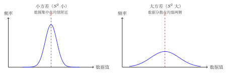

# 数据的离散程度：方差

---

## 一、概念特征：数据稳不稳？

集中趋势（平均数、中位数、众数）描述了数据的"中心"在哪里，但两组平均数相同的数据，**分布可能截然不同**：

- 组 A：$8, 8, 8, 8, 8$，平均数 $= 8$；
- 组 B：$2, 5, 8, 11, 14$，平均数 $= 8$。

组 A 极其稳定，组 B 波动很大——光看平均数无法区分。描述数据**波动（离散）程度**，需要引入新的量：**极差**和**方差**。

---

## 二、定义与运算法则

### 2.1 极差

**定义**：数据中**最大值与最小值之差**。

$$\text{极差} = x_{\max} - x_{\min}$$

极差是最简单的离散度量，但只考虑了两个极端值，忽略了中间数据的分布情况。

**例**：数据 $1, 10, 10, 10, 10$，极差 $= 10 - 1 = 9$，但其实 4 个数据都是 $10$，整体很集中。极差高估了离散程度。

### 2.2 方差

**定义**：方差 $S^2$ 衡量数据围绕平均数的**平均偏差的平方**。

$$\boxed{S^2 = \frac{1}{n}\left[(x_1 - \bar{x})^2 + (x_2 - \bar{x})^2 + \cdots + (x_n - \bar{x})^2\right] = \frac{1}{n}\sum_{i=1}^{n}(x_i - \bar{x})^2}$$

**计算步骤**：

1. 计算平均数 $\bar{x}$；
2. 计算每个数据与平均数的差 $(x_i - \bar{x})$；
3. 将各差值**平方** $(x_i - \bar{x})^2$；
4. 求这些平方的**平均值**，即为方差 $S^2$。

**方差的意义**：
- $S^2$ **越小** → 数据越**集中**，波动越小，越**稳定**；
- $S^2$ **越大** → 数据越**分散**，波动越大，越不稳定。

**方差的单位**：方差的单位是原数据单位的**平方**（如数据单位是"分"，方差单位是"分²"）。

### 2.3 标准差

**定义**：标准差 $S$ 是方差的**算术平方根**：

$$S = \sqrt{S^2} = \sqrt{\frac{1}{n}\sum_{i=1}^{n}(x_i - \bar{x})^2}$$

标准差与原数据**同单位**，在实际中比方差更直观（例如，数据单位是"cm"，标准差也是"cm"，方差是"cm²"）。

---

## 三、为什么用平方而不用绝对值

直觉上，用各数据与平均数之差的绝对值均值 $\dfrac{1}{n}\sum|x_i - \bar{x}|$ 也能描述离散程度，为何要用平方？

原因有三：
1. **平方运算更易于推导和化简**：后续更高层次的统计理论（如最小二乘法）依赖方差的代数性质；
2. **平方放大了大偏差的影响**：$(x_i - \bar{x})^2$ 对离均值较远的点惩罚更大，更敏感地反映"异常偏差"；
3. **数学上更方便**：平方的导数比绝对值的导数处处存在（绝对值在 0 处不可导）。

---

## 四、用样本估计总体

统计的核心应用之一是：**已知样本的统计量，推断总体的统计量**。

**基本原则**：
- **样本平均数 $\bar{x}$** 作为**总体平均数**的估计量；
- **样本方差 $S^2$** 作为**总体方差**的估计量（中学阶段不区分样本方差与总体方差的修正系数 $\frac{1}{n}$ vs $\frac{1}{n-1}$）。

**样本容量越大**，估计越精确：

$$\text{样本容量} \uparrow \Rightarrow \text{估计误差} \downarrow$$

**实际应用**：当对全体零件、商品或产品进行全面检测不可行（成本高、具破坏性）时，抽样测量，用样本统计量推断总体的质量情况。

---

## 五、典型例题

### 例 1　基础计算——平均数和方差

> **题目**：计算数据 $1, 2, 3, 4, 5$ 的平均数和方差。

**【思路】** 按步骤：先求平均数，再逐步求各偏差的平方，最后平均。

**解**：

**第一步：平均数。**

$$\bar{x} = \frac{1+2+3+4+5}{5} = \frac{15}{5} = 3$$

**第二步：各数据与平均数的偏差。**

| $x_i$ | $x_i - \bar{x}$ | $(x_i - \bar{x})^2$ |
|-------|-----------------|----------------------|
| 1 | $1 - 3 = -2$ | $(-2)^2 = 4$ |
| 2 | $2 - 3 = -1$ | $(-1)^2 = 1$ |
| 3 | $3 - 3 = 0$ | $0^2 = 0$ |
| 4 | $4 - 3 = 1$ | $1^2 = 1$ |
| 5 | $5 - 3 = 2$ | $2^2 = 4$ |

**第三步：方差。**

$$S^2 = \frac{4 + 1 + 0 + 1 + 4}{5} = \frac{10}{5} = 2$$

**标准差**：$S = \sqrt{2} \approx 1.41$

**答**：平均数 $\bar{x} = 3$，方差 $S^2 = 2$，标准差 $S = \sqrt{2}$。

---

### 例 2　稳定性比较——甲乙射击

> **题目**：甲、乙两人各进行了 5 次射击，成绩如下（单位：环）：
>
> - 甲：$7, 8, 8, 9, 8$
> - 乙：$5, 8, 9, 9, 9$
>
> 分别计算两人的平均成绩和方差，判断谁的成绩更稳定。

**【思路】** 先比较平均数（看谁打得准），再比较方差（看谁打得稳）。方差小 = 更稳定。

**解**：

**甲的计算**：

$$\bar{x}_{\text{甲}} = \frac{7+8+8+9+8}{5} = \frac{40}{5} = 8 \text{（环）}$$

各偏差平方：$(7-8)^2=1,\ (8-8)^2=0,\ (8-8)^2=0,\ (9-8)^2=1,\ (8-8)^2=0$

$$S^2_{\text{甲}} = \frac{1+0+0+1+0}{5} = \frac{2}{5} = 0.4$$

**乙的计算**：

$$\bar{x}_{\text{乙}} = \frac{5+8+9+9+9}{5} = \frac{40}{5} = 8 \text{（环）}$$

各偏差平方：$(5-8)^2=9,\ (8-8)^2=0,\ (9-8)^2=1,\ (9-8)^2=1,\ (9-8)^2=1$

$$S^2_{\text{乙}} = \frac{9+0+1+1+1}{5} = \frac{12}{5} = 2.4$$

**对比**：

$$\bar{x}_{\text{甲}} = \bar{x}_{\text{乙}} = 8 \text{（环）}，\quad S^2_{\text{甲}} = 0.4 < S^2_{\text{乙}} = 2.4$$

两人平均成绩相同，但甲的方差更小，说明甲的成绩更集中、更稳定。

**答**：甲的平均成绩为 $8$ 环，方差 $0.4$；乙的平均成绩为 $8$ 环，方差 $2.4$。甲的方差较小，成绩更稳定，应选甲参加比赛。

---

### 例 3　用样本估计总体

> **题目**：某工厂生产一批轴承，从中随机抽取 10 个测量直径（单位：cm），数据如下：
>
> $$5.02,\ 4.98,\ 5.01,\ 4.99,\ 5.00,\ 5.03,\ 4.97,\ 5.01,\ 4.99,\ 5.00$$
>
> （1）求样本的平均数和方差；  
> （2）用样本统计量估计这批轴承总体的平均直径和方差。

**【思路】** 先计算样本统计量；再用"样本估计总体"原则直接对应。

**解**：

**（1）样本平均数**：

$$\bar{x} = \frac{5.02+4.98+5.01+4.99+5.00+5.03+4.97+5.01+4.99+5.00}{10}$$

$$= \frac{50.00}{10} = 5.00 \text{（cm）}$$

**样本方差**（以 $\bar{x} = 5.00$ 为基准）：

| $x_i$ | $x_i - \bar{x}$ | $(x_i - \bar{x})^2$ |
|--------|-----------------|----------------------|
| 5.02 | $+0.02$ | $0.0004$ |
| 4.98 | $-0.02$ | $0.0004$ |
| 5.01 | $+0.01$ | $0.0001$ |
| 4.99 | $-0.01$ | $0.0001$ |
| 5.00 | $0$ | $0$ |
| 5.03 | $+0.03$ | $0.0009$ |
| 4.97 | $-0.03$ | $0.0009$ |
| 5.01 | $+0.01$ | $0.0001$ |
| 4.99 | $-0.01$ | $0.0001$ |
| 5.00 | $0$ | $0$ |

$$S^2 = \frac{0.0004+0.0004+0.0001+0.0001+0+0.0009+0.0009+0.0001+0.0001+0}{10} = \frac{0.0030}{10} = 0.0003 \text{（cm}^2\text{）}$$

标准差 $S = \sqrt{0.0003} \approx 0.017$ cm。

**（2）估计总体**：

- 估计这批轴承的总体**平均直径** $\approx \bar{x} = 5.00$ cm；
- 估计这批轴承的总体**方差** $\approx S^2 = 0.0003$ cm²。

**答**：样本平均直径为 $5.00$ cm，样本方差为 $0.0003$ cm²；估计这批轴承总体的平均直径约为 $5.00$ cm，总体方差约为 $0.0003$ cm²。

---

## 六、易错点 & 反例

**易错 1**：方差公式中用 $|x_i - \bar{x}|$ 而非 $(x_i - \bar{x})^2$。

方差中一定是**偏差的平方**，不是绝对值。用绝对值是另一种统计量（平均绝对偏差），与方差是不同的量。

**反例**：数据 $1, 3, 5$，平均数 $= 3$，偏差分别为 $-2, 0, 2$。

- 方差 $= \dfrac{(-2)^2 + 0^2 + 2^2}{3} = \dfrac{8}{3}$；
- 平均绝对偏差 $= \dfrac{|-2|+|0|+|2|}{3} = \dfrac{4}{3}$（两者不同，方差更大）。

**易错 2**：方差的单位是原数据单位的平方，不是原单位。

若成绩数据单位为"分"，则方差单位为"分²"，标准差才是"分"。题目中不要把方差的单位写成原始单位。

**易错 3**：计算方差前忘记先求平均数。

方差公式中的 $\bar{x}$ 必须先正确计算，再代入。若平均数算错，方差必然也错。

**易错 4**：比较两组数据的稳定性时，平均数不等就直接用方差比较。

**严格来说**，直接用方差比较稳定性，前提是两组数据的**量纲（单位）和均值水平相近**。中学题目中通常保证平均数相同或题目明确指出比较稳定性，但需注意这一前提。

**易错 5**：把样本统计量当作总体统计量的精确值。

用样本估计总体时，样本统计量是**估计值**，有误差——样本容量越大，误差越小，但仍不是精确值（除非做普查）。

---

## 七、思路自测题

**自测 1**（☆）

数据 $2, 4, 6, 8, 10$，求平均数和方差。

> 💡 提示：平均数 $= (2+4+6+8+10)/5 = 6$；偏差平方分别为 $(2-6)^2=16,\ (4-6)^2=4,\ (6-6)^2=0,\ (8-6)^2=4,\ (10-6)^2=16$；方差 $= (16+4+0+4+16)/5 = 40/5 = 8$。

---

**自测 2**（☆）

已知数据 $x_1, x_2, x_3, x_4, x_5$ 的平均数为 $4$，方差为 $2$。现将每个数据都加上 $3$，变为 $x_1+3, x_2+3, \ldots, x_5+3$，求新数据的平均数和方差。

> 💡 提示：每个数据加同一个常数 $c$，新平均数 $= $ 旧平均数 $+ c = 4 + 3 = 7$；偏差 $(x_i + 3) - (\bar{x}+3) = x_i - \bar{x}$ 不变，所以**方差不变**，仍为 $2$。

---

**自测 3**（☆☆）

甲、乙两名学生各进行了 6 次百米跑训练，成绩（单位：秒）如下：

- 甲：$13.8,\ 14.0,\ 13.9,\ 14.1,\ 14.0,\ 13.8$
- 乙：$13.2,\ 14.5,\ 13.8,\ 14.3,\ 14.0,\ 13.8$

（1）计算两人的平均成绩；  
（2）计算两人的方差（可保留一位小数）；  
（3）若选一人参加比赛，应选谁？说明理由。

> 💡 提示：甲平均 $= (13.8+14.0+13.9+14.1+14.0+13.8)/6 = 83.6/6 \approx 13.93$ 秒；乙平均 $= 83.6/6 \approx 13.93$ 秒（两人平均相同）。计算各偏差平方求方差；甲方差明显小于乙，故甲更稳定，应选甲。

---

**自测 4**（☆☆）

某食品厂生产袋装食品，标注每袋净重 $250$ g。从一批产品中随机抽取 $8$ 袋称重，结果（单位：g）如下：

$$248,\ 252,\ 251,\ 249,\ 250,\ 253,\ 248,\ 251$$

（1）求样本平均重量和样本方差；  
（2）用样本估计总体：这批食品平均每袋净重约为多少克？方差约为多少？  
（3）若生产标准规定净重的方差不得超过 $3$ g²，该批产品是否达标？

> 💡 提示：平均数 $= (248+252+251+249+250+253+248+251)/8 = 2002/8 = 250.25$ g；各偏差平方：$(-2.25)^2=5.0625,\ (1.75)^2=3.0625,\ (0.75)^2=0.5625,\ (-1.25)^2=1.5625,\ (-0.25)^2=0.0625,\ (2.75)^2=7.5625,\ (-2.25)^2=5.0625,\ (0.75)^2=0.5625$；方差 $\approx 23.5/8 \approx 2.9$ g² $< 3$ g²，达标。
