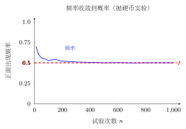

# 用频率估计概率

> **一例速记**：
> 做大量试验，记录事件 $A$ 发生的次数 $m$ 和总次数 $n$，则**频率** $= \dfrac{m}{n}$。当 $n$ 足够大时，频率稳定在概率附近，可用频率**估计**概率：$P(A) \approx \dfrac{m}{n}$。

---

## 一、引入：当古典概型不够用时

有些随机事件，无法直接列举出所有"等可能"结果来用公式 $P(A) = \dfrac{m}{n}$。

比如：

- 将一枚图钉随手抛出，落地后"尖朝上"的概率是多少？
- 这批零件出现次品的概率是多少？
- 这片森林里某种树木被虫害影响的概率是多少？

这些事件的结果无法列举成有限个等可能的情形，**古典概型公式不直接适用**。

这时候，我们转向另一种思路：**做大量试验，用实验数据来估计概率**。

---

## 二、频率的定义

在 $n$ 次重复试验中，若事件 $A$ 共发生了 $m$ 次，则称

$$\text{频率} = \frac{m}{n}$$

为事件 $A$ 在这 $n$ 次试验中的**频率**（也叫**相对频率**）。

**注意**：
- $m$ 是事件 $A$ 实际发生的次数（**频数**）；
- $n$ 是总试验次数；
- 频率 $\dfrac{m}{n}$ 一定满足 $0 \leq \dfrac{m}{n} \leq 1$。

**频率和概率的区别**：

| | 频率 $\dfrac{m}{n}$ | 概率 $P(A)$ |
|---|---|---|
| 来源 | 实验数据，来自**实际试验** | 理论值，反映事件**客观规律** |
| 变化性 | 每次试验后会变化 | 固定不变（客观存在）|
| 关系 | 当 $n$ 很大时，频率趋向于概率 | 频率的"极限"（理论值）|

---

## 三、大数定律（直观版）

**大数定律**（直观描述）：

> 在相同条件下，重复进行大量试验，事件 $A$ 出现的频率 $\dfrac{m}{n}$ 会随着试验次数 $n$ 的增大而**趋近于**事件 $A$ 的概率 $P(A)$。

换句话说：**试验次数越多，频率越稳定，越接近概率的真实值**。

**经典验证——抛硬币实验**：

历史上有多位数学家亲自做过大量抛硬币实验：

| 实验者 | 总抛次数 $n$ | 正面次数 $m$ | 频率 $\dfrac{m}{n}$ |
|---|---|---|---|
| 布丰（Buffon） | 4040 | 2048 | 0.5069 |
| 皮尔逊（Pearson） | 12000 | 6019 | 0.5016 |
| 皮尔逊（Pearson） | 24000 | 12012 | 0.5005 |

可以看到，随着试验次数增多，频率越来越接近理论概率 $0.5$。

---

## 四、用频率估计概率的方法

**方法步骤**：

1. **设计试验**：确保试验条件与研究问题一致，且每次试验相互独立；
2. **大量重复试验**：试验次数 $n$ 越大，估计越准确（一般要求 $n$ 足够大，如几百次以上）；
3. **记录频率**：统计事件 $A$ 发生的次数 $m$，计算频率 $\dfrac{m}{n}$；
4. **用频率近似代替概率**：$P(A) \approx \dfrac{m}{n}$。

**使用场景**：
- 理论概率难以直接计算（如形状不规则的物体落地方向）；
- 总体很大且概率未知（如工厂产品次品率、疾病发生率）；
- 需要通过实验数据验证理论概率（如验证骰子是否均匀）。

---

## 五、典型例题

### 例 1　频率 → 估计概率

某工厂对一批零件进行质量检验：随机抽取 1000 个零件进行检测，发现有 30 个次品。

（1）次品出现的频率是多少？

（2）估计这批零件中次品的概率。

（3）若整批零件共 50000 个，估计其中大约有多少个次品？

**解**：

（1）次品频率 $= \dfrac{30}{1000} = 0.03 = 3\%$。

（2）由于抽取了足够多的样本（1000 个），用频率估计概率：

$$P(\text{次品}) \approx \frac{30}{1000} = 0.03$$

（3）估计次品数 $\approx 50000 \times 0.03 = 1500$ 个。

**答**：次品频率为 3%，估计次品概率约为 $0.03$，整批零件中约有 $1500$ 个次品。

---

### 例 2　实验设计——图钉实验

小明将一枚图钉随机抛出，落地后有两种状态："尖朝上"或"尖朝侧面"。他反复试验了 200 次，结果如下：

| 抛出次数 $n$ | 尖朝上次数 $m$ | 频率 $\dfrac{m}{n}$ |
|---|---|---|
| 50 | 27 | 0.54 |
| 100 | 52 | 0.52 |
| 150 | 76 | 0.507 |
| 200 | 103 | 0.515 |

（1）随着试验次数增加，频率的变化有何规律？

（2）用 200 次试验的结果，估计"尖朝上"的概率。

**解**：

（1）从表格可以看出：随着抛出次数 $n$ 增大，频率 $\dfrac{m}{n}$ 逐渐趋向稳定，波动越来越小，大约稳定在 $0.51$ 左右。这验证了**大数定律**：试验次数越多，频率越接近概率。

（2）用 200 次试验的频率估计概率：

$$P(\text{尖朝上}) \approx \frac{103}{200} = 0.515$$

**答**：估计图钉"尖朝上"的概率约为 $0.515$（约 51.5%）。

**注**：由于图钉形状不规则，"尖朝上"和"尖朝侧面"并不等可能，不能用古典概型直接算 $\dfrac{1}{2}$，必须通过实验来估计。

---

### 例 3　标记重捕法估计种群数量

生物学家对某湖泊中的鱼群数量进行调查，采用**标记重捕法**：

第一次：从湖中捕获 $100$ 条鱼，做标记后全部放回湖中，等待鱼群充分混合。

第二次：重新从湖中捕获 $200$ 条鱼，其中有 $5$ 条带有标记。

请估计该湖泊中的鱼的总数量。

**【思路】** 关键假设：放回湖中后，标记鱼和非标记鱼均匀混合，被再次捕获的概率相同——即"标记鱼占总数的比例"等于"第二次捕获中标记鱼占本次捕获的比例"。

**解**：

设湖中鱼的总数为 $N$ 条。

第一次放回 $100$ 条标记鱼，则标记鱼占总数的比例为 $\dfrac{100}{N}$。

第二次捕获 $200$ 条中有 $5$ 条标记鱼，标记鱼占本次捕获的频率为 $\dfrac{5}{200}$。

用频率估计概率（即用比例等式）：

$$\frac{100}{N} \approx \frac{5}{200}$$

解方程：

$$100 \times 200 = 5 \times N$$

$$N = \frac{100 \times 200}{5} = \frac{20000}{5} = 4000 \text{（条）}$$

**答**：估计该湖泊中大约有 $4000$ 条鱼。

**理解标记重捕法的逻辑**：

标记重捕法本质上是"用样本中标记鱼的频率，估计总体中标记鱼的概率（比例）"——这正是"用频率估计概率"思想的一个重要应用。其数学模型为：

$$\frac{\text{标记鱼总数}}{\text{总鱼数}} \approx \frac{\text{第二次捕获中的标记鱼数}}{\text{第二次捕获总数}}$$

即 $\dfrac{M}{N} \approx \dfrac{k}{n}$，其中 $M$ 是第一次放回的标记鱼数，$N$ 是总鱼数，$n$ 是第二次捕获总数，$k$ 是第二次捕获中的标记鱼数。由此解得 $N \approx \dfrac{Mn}{k}$。

---

## 六、易错点与注意事项

**易错点 1**：**频率不等于概率**。频率是实验结果（会随每次试验变化），概率是客观固定值。只能说"用频率**估计**概率"，不能说"频率就是概率"。

**易错点 2**：**少量试验的频率不能可靠估计概率**。抛 10 次硬币可能 8 次正面（频率 0.8），但这不能说明正面概率是 0.8——只有大量试验后频率才趋于稳定。

**易错点 3**：**标记重捕法的前提假设**。假设标记鱼在湖中均匀混合，若鱼群有聚集习惯、标记影响鱼的行为，估计会出现偏差。现实应用中需注意这些前提条件是否满足。

**易错点 4**：**频率一定在 $[0, 1]$ 之间**。若计算出频率大于 1，说明计算有误（如把频率和频数搞混，分子分母弄反等）。

---

## 七、自测题

**自测 1**（☆）

某射手打靶训练，射击 500 次，命中靶心 420 次。

（1）命中靶心的频率是多少？

（2）用频率估计该射手命中靶心的概率。

（3）若该射手再射击 100 次，估计约命中靶心多少次？

---

**自测 2**（☆）

小红做了一个"掷图钉"试验，记录了每个阶段的数据：

| 掷出次数 | 尖朝上次数 | 频率 |
|---|---|---|
| 100 | 37 | $a$ |
| 300 | 108 | $b$ |
| 500 | 186 | $c$ |
| 1000 | 376 | $d$ |

（1）计算 $a, b, c, d$ 的值；

（2）随试验次数增大，频率的变化趋势是什么？

（3）估计图钉"尖朝上"的概率（用 1000 次试验结果）。

---

**自测 3**（☆☆）

用标记重捕法估计某草地中蚱蜢的数量：第一次捕获 50 只蚱蜢，全部做标记后放回。一段时间后，第二次捕获 80 只，其中有 4 只带标记。

（1）估计该草地中蚱蜢的总数量；

（2）若第二次捕获 80 只中有 8 只带标记，估计结果会如何变化？

> 💡 提示：用公式 $N \approx \dfrac{Mn}{k}$，其中 $M = 50$，$n = 80$，$k$ 分别为 4 和 8。

---

**自测 4**（☆☆）

古典概型和频率估计是求概率的两种方法。判断以下各情形应用哪种方法，并说明理由：

（1）掷一枚均匀正六面骰子，求点数为质数的概率；

（2）一个形状不规则的石头随机落地，求"平面朝上"的概率；

（3）袋中 3 红 5 蓝，随机摸一个，求摸到红球的概率；

（4）调查某市居民中近视眼比例。

