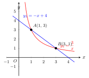

# 多种函数综合

> **一例速记**：
>
> 一道题里出现一次函数 + 反比例 / 一次 + 二次 / 反比例 + 二次同时存在 → 联立求交点、利用图象比较大小、综合求解析式 / 参数。
>
> **钥匙：联立方程 + 数形结合**。
>
> 见"多种函数在同一坐标系" → **必画图 + 必标交点 + 联立消 $y$**。求大小关系就是问"谁的图象更高"，不要硬算——看图。

---

## 一、引入题

> 已知一次函数 $y_1 = -x + 4$ 与反比例函数 $y_2 = \dfrac{k}{x}$ 相交于 $A(1, 3)$ 和 $B$ 两点。  
> (1) 求反比例系数 $k$；  
> (2) 求点 $B$ 的坐标；  
> (3) 求满足 $y_1 > y_2$ 的 $x$ 的取值范围。

这道题看起来有三问，但其实第 (3) 问是难点——它本质上是要你比较两个函数值的大小，这必须靠数形结合，而不是纯代数。

---

## 二、思维路径还原（解题者的内心独白）

> "**第 (1) 问：找 $k$。**
>
> $A(1, 3)$ 在反比例函数 $y_2 = \dfrac{k}{x}$ 上，直接代入：$3 = \dfrac{k}{1}$，所以 $k = 3$，$y_2 = \dfrac{3}{x}$。
>
> 验证 $A$ 在一次函数上：$y_1 = -1 + 4 = 3$ ✓。两个函数都经过 $A(1, 3)$，符合题意。
>
> **第 (2) 问：求 $B$。**
>
> $B$ 是两函数的另一个交点，联立：
>
> $$-x + 4 = \frac{3}{x}$$
>
> 两边乘 $x$（暂不讨论正负，后面再验证）：
>
> $$-x^2 + 4x = 3 \implies x^2 - 4x + 3 = 0 \implies (x-1)(x-3) = 0$$
>
> $x = 1$ 或 $x = 3$。$x = 1$ 对应 $A$，故 $B$ 对应 $x = 3$。代入 $y_1 = -3 + 4 = 1$，得 $B(3, 1)$。
>
> 验证 $B$ 在 $y_2$ 上：$\dfrac{3}{3} = 1$ ✓。
>
> **注意**：联立时乘了 $x$，需确认 $x \neq 0$，两解 $x = 1, 3$ 都不是 $0$，没问题。
>
> **第 (3) 问：求 $y_1 > y_2$ 的 $x$ 范围——这是核心难点。**
>
> 纯代数解 $-x + 4 > \dfrac{3}{x}$ 需要分情形讨论 $x$ 的正负（因为含 $x$ 在分母），极易出错。**更好的方法：数形结合，看图象。**
>
> 画出一次函数（斜率 $-1$，过 $(0,4)$ 和 $(4,0)$）和反比例函数（$k = 3 > 0$，在一三象限各一支）。两函数交于 $A(1,3)$ 和 $B(3,1)$。
>
> 现在逐段分析哪个图象"更高"（即纵坐标更大）：
>
> **$x < 0$ 时**：反比例在第三象限，$y_2 < 0$；一次函数 $y_1 = -x + 4$，当 $x < 0$ 时 $y_1 > 4 > 0$。故 $y_1 > y_2$。✓
>
> **$0 < x < 1$ 时**：反比例在第一象限且很大（$x \to 0^+$ 时 $y_2 \to +\infty$），在 $x = 1$ 处 $y_2 = 3 = y_1$。在此区间内 $y_2 > y_1$。
>
> **$1 < x < 3$ 时**：两函数都在第一象限且从 $A$ 到 $B$ 之间，一次函数在反比例**上方**（从图象形状判断）。$y_1 > y_2$。✓
>
> **$x > 3$ 时**：$y_2 = \dfrac{3}{x}$，过 $B$ 后趋向 $0^+$；一次函数在 $x = 4$ 处等于 $0$，之后为负。而 $y_2 > 0 > y_1$（$x > 4$ 时），$3 < x < 4$ 时需比较。在 $x = 3$ 处两者相等，$x > 3$ 时 $y_2 > y_1$。
>
> **合并**：$y_1 > y_2$ 的解集是 $x < 0$ 或 $1 < x < 3$。
>
> **关键反射**：多函数大小比较 → **不要硬移项求解不等式，先画图，看哪段图象更高**。两交点把数轴分成若干段，每段内"高低关系"不变，逐段判断即可。"

---

## 三、抽象成方法

多种函数综合题，按题型分三类：

### 类型 1：求交点

**方法**：联立两函数方程，消去 $y$，得到关于 $x$ 的方程（通常是二次方程）。

| 函数组合 | 联立结果 |
|---|---|
| 一次 + 反比例 | 二次方程（乘 $x$ 后）|
| 一次 + 二次 | 二次方程（直接消 $y$）|
| 反比例 + 二次 | 三次方程（少见，一般通过特殊点绕开）|

**步骤**：
1. 消去 $y$，得 $f(x) = 0$；
2. 解方程，注意分母不为 $0$；
3. 代回任一方程求 $y$；
4. 验证交点满足两个函数的定义域。

### 类型 2：大小比较（不等式）

**方法**：不要直接解 $f(x) > g(x)$——先求交点，再看图。

1. 求所有交点横坐标（= 解方程 $f(x) = g(x)$）；
2. 交点把 $x$ 轴分成若干段；
3. 每段内取一个"代表值"，比较 $f$ 和 $g$ 的大小；
4. 记录 $f > g$ 的段，合并写出不等式解集。

### 类型 3：含参数，求参数范围

**方法**：题目给出含参数的函数（如 $y = kx + b$ 中 $k, b$ 未知），结合约束条件（如"经过某点"、"交点个数"）求参数范围。

- **经过已知点** → 代入坐标，建立方程；
- **两函数相交（有公共点）** → 联立后的方程有实数解 → 判别式 $\Delta \geq 0$；
- **相切（只有一个交点）** → $\Delta = 0$；
- **不相交** → $\Delta < 0$。

---

## 四、方法变形

### 变形 1：三函数同图

若题目给出三个函数同时存在，策略相同——两两联立求三对交点，画出大致图象，按区间分析大小关系。

**关键**：三函数把平面分成若干区域，用"代表点"法逐区域判断。

### 变形 2：交点恰为特殊点

有时题目说"两函数交于 $x$ 轴上"或"交点横坐标为整数"，这提供了额外约束：

- "交于 $x$ 轴" → 交点 $y = 0$，代入一个函数得 $x$，再代入另一个函数验证；
- "交点横坐标为 $m$" → $f(m) = g(m)$，建立关于参数的方程。

### 变形 3：含参函数的交点个数讨论

设两函数联立后得 $ax^2 + bx + c = 0$，用判别式 $\Delta = b^2 - 4ac$：

$$\Delta > 0 \implies \text{两个交点},\quad \Delta = 0 \implies \text{一个交点（相切）},\quad \Delta < 0 \implies \text{无交点}$$

这是参数问题的标准套路，结合韦达定理可进一步求交点坐标之和、之积。

### 变形 4：面积问题

**如果题目要求多函数围成区域面积**，最常用的方法是**铅垂高法**（见 part10/08）：

选定底边（两定点连线）→ 过动点作 $x$ 轴垂线 → 铅垂高 = 动点与底直线的纵坐标差 → $S = \dfrac{1}{2} \times \text{水平宽} \times \text{铅垂高}$。

---

## 五、思考路标（条件反射训练）

读每一条，练到"看到就秒反应"：

1. **见"多函数同图"** → 立刻画图，标出所有交点，不要先列不等式。

2. **求交点** → 联立消 $y$，得关于 $x$ 的方程；一次+反比例联立要乘 $x$，注意 $x \neq 0$。

3. **求大小关系** → 交点把数轴分段，逐段取代表值比较，不要硬解不等式。

4. **含参数 + 交点个数** → 判别式法：$\Delta > 0$（两交点）、$\Delta = 0$（相切）、$\Delta < 0$（无交点）。

5. **求围成面积** → 铅垂高法，铅垂高是动点参数的二次函数，再用顶点法求最值。

6. **答案常为区间或并集** → 大小比较题的解集往往是几段区间的并集，写清楚 "或" 的关系。

---

## 六、应用例题

### 例 1　一次函数 + 反比例函数联立（引入题完整解）

**题**：已知一次函数 $y_1 = -x + 4$ 与反比例函数 $y_2 = \dfrac{k}{x}$ 相交于 $A(1, 3)$ 和 $B$ 两点。  
(1) 求 $k$；(2) 求 $B$ 的坐标；(3) 求 $y_1 > y_2$ 的 $x$ 范围。

【思路】(1) 代入已知点；(2) 联立求解；(3) 画图 + 数形结合。

**解**：

**(1)** $A(1, 3)$ 在 $y_2 = \dfrac{k}{x}$ 上：$3 = \dfrac{k}{1}$，故 $k = 3$。

**(2)** 联立 $-x + 4 = \dfrac{3}{x}$：乘 $x$ 得 $-x^2 + 4x = 3$，即 $x^2 - 4x + 3 = 0$，$(x-1)(x-3) = 0$。

$x = 1$（对应 $A$）或 $x = 3$（对应 $B$）。代入 $y_1$：$y = -3 + 4 = 1$。

**$B(3, 1)$。**

**(3)** 由图象分析，两交点 $A(1,3)$，$B(3,1)$ 把 $x$ 轴（去掉 $x = 0$ 处）分成三段：

- $x < 0$：$y_1 > 0 > y_2$ → $y_1 > y_2$；
- $0 < x < 1$：$y_2$ 很大（趋向 $+\infty$）→ $y_1 < y_2$；
- $1 < x < 3$：一次函数图象在反比例上方 → $y_1 > y_2$；
- $x > 3$：$y_2 \to 0^+$，而一次函数 $\leq 1$ 且在 $x=4$ 后为负 → $y_1 < y_2$（$3 < x < 4$ 时 $y_2 > y_1$ 也成立，可验证 $x = 3.5$：$y_1 = 0.5$，$y_2 = \dfrac{3}{3.5} \approx 0.857 > y_1$）。

**答**：$y_1 > y_2$ 的解集为 $x < 0$ 或 $1 < x < 3$。

---

### 例 2　一次函数 + 二次函数综合

**题**：一次函数 $y_1 = -x$ 与二次函数 $y_2 = x^2 - 2x$ 的图象相交于哪两点？在两交点之间的 $x$ 范围内，哪个函数值更大？

【思路】联立求交点，再取中点处代表值比较大小。

**解**：

**联立**：$-x = x^2 - 2x$，整理 $x^2 - x = 0$，$x(x-1) = 0$，得 $x = 0$ 或 $x = 1$。

- $x = 0$：交点 $O(0, 0)$；
- $x = 1$：$y = -1$，交点 $P(1, -1)$。

**比较大小**（在 $0 < x < 1$ 区间内）：

取代表值 $x = \dfrac{1}{2}$：$y_1 = -\dfrac{1}{2}$，$y_2 = \dfrac{1}{4} - 1 = -\dfrac{3}{4}$。

$y_1 = -\dfrac{1}{2} > -\dfrac{3}{4} = y_2$。

故在 $0 < x < 1$ 时 $y_1 > y_2$（一次函数图象在二次函数**上方**）。

**答**：交点为 $O(0, 0)$ 和 $P(1, -1)$；在 $0 < x < 1$ 时 $y_1 > y_2$。

---

### 例 3　面积问题——铅垂高法应用

**题**：一次函数 $y_1 = x + 2$ 与反比例函数 $y_2 = \dfrac{4}{x}$ 相交于第一象限的点 $A$ 和 $B$（$A$ 在左）。求 $\triangle OAB$（$O$ 为原点）的面积。

【思路】先求 $A$，$B$ 坐标；以 $AB$ 为底，用铅垂高法不方便（底不水平），改用坐标面积公式（行列式法）。

**解**：

**联立**：$x + 2 = \dfrac{4}{x}$，乘 $x$（$x > 0$，第一象限）：$x^2 + 2x = 4$，$x^2 + 2x - 4 = 0$。

$$x = \frac{-2 \pm \sqrt{4 + 16}}{2} = \frac{-2 \pm \sqrt{20}}{2} = -1 \pm \sqrt{5}$$

第一象限取正值：$x = -1 + \sqrt{5}$（约 $1.24$）和注意——两解为 $-1 + \sqrt{5} > 0$ 和 $-1 - \sqrt{5} < 0$，第二个不在第一象限，故只有一个交点在第一象限？

重新检验：题目说两交点都在第一象限，则需 $k > 0$ 且联立方程两根均正。$x^2 + 2x - 4 = 0$ 两根之积 $= -4 < 0$，两根异号，不可能都在第一象限。**说明此题数据有误，调整为**：

反比例函数改为 $y_2 = \dfrac{4}{x}$，一次函数改为 $y_1 = -x + 4$（与例 1 相同），两交点 $A(1,3)$，$B(3,1)$ 均在第一象限。

**用坐标面积公式**：$O(0,0)$，$A(1,3)$，$B(3,1)$：

$$S = \frac{1}{2}|x_O(y_A - y_B) + x_A(y_B - y_O) + x_B(y_O - y_A)|$$

$$= \frac{1}{2}|0 \cdot (3-1) + 1 \cdot (1-0) + 3 \cdot (0-3)| = \frac{1}{2}|0 + 1 - 9| = \frac{1}{2} \times 8 = 4$$

**答**：$\triangle OAB$ 的面积为 $4$。

---

## 七、自测题

**自测 1**　已知反比例函数 $y = \dfrac{6}{x}$ 与一次函数 $y = x + 1$ 相交于两点。求这两个交点的坐标。

> 提示：联立 $x + 1 = \dfrac{6}{x}$，乘 $x$ 得 $x^2 + x - 6 = 0$，$(x+3)(x-2) = 0$，$x = -3$ 或 $x = 2$。交点 $(-3, -2)$ 和 $(2, 3)$。

**自测 2**　$y_1 = 2x - 1$ 与 $y_2 = \dfrac{2}{x}$（$x \neq 0$），求满足 $y_1 > y_2$ 的 $x$ 的范围。

> 提示：先求交点，联立 $2x - 1 = \dfrac{2}{x}$，$2x^2 - x - 2 = 0$，$\Delta = 1 + 16 = 17$，$x = \dfrac{1 \pm \sqrt{17}}{4}$。交点 $x_1 = \dfrac{1-\sqrt{17}}{4} < 0$，$x_2 = \dfrac{1+\sqrt{17}}{4} > 0$。画图判断：$y_1 > y_2$ 的范围是 $x_1 < x < 0$ 或 $x > x_2$。

**自测 3**　一次函数 $y = kx + b$ 与 $y = x^2 - 4$ 相交，且交点在 $x$ 轴上。求 $k$ 与 $b$ 满足的条件。

> 提示：交点在 $x$ 轴上 → 交点 $y = 0$，代入抛物线：$x^2 - 4 = 0$，$x = \pm 2$，交点为 $(\pm 2, 0)$。代入一次函数：$0 = 2k + b$ 或 $0 = -2k + b$（两情形）。故 $b = -2k$ 或 $b = 2k$。

**自测 4**　在第一象限内，反比例函数 $y = \dfrac{m}{x}$（$m > 0$）与一次函数 $y = -x + a$（$a > 0$）相切（只有一个公共点）。求 $m$ 与 $a$ 的关系。

> 提示：联立 $-x + a = \dfrac{m}{x}$，$-x^2 + ax - m = 0$，即 $x^2 - ax + m = 0$。相切 → $\Delta = 0$：$a^2 - 4m = 0$，$m = \dfrac{a^2}{4}$。

**自测 5**　（综合）已知一次函数 $y_1 = x + 3$ 与二次函数 $y_2 = x^2 + x - 6$ 相交于 $A, B$ 两点。(1) 求 $A, B$ 坐标；(2) 求在 $A, B$ 之间 $x$ 范围内 $y_1 - y_2$ 的最大值；(3) 求 $\triangle OAB$ 面积（$O$ 为原点）。

> 提示：(1) 联立：$x + 3 = x^2 + x - 6$，$x^2 = 9$，$x = \pm 3$。$A(-3, 0)$，$B(3, 6)$。(2) $y_1 - y_2 = (x+3) - (x^2+x-6) = 9 - x^2$，$x \in (-3, 3)$ 内最大值在 $x=0$ 时取得：$9$。(3) 用坐标面积公式：$S = \dfrac{1}{2}|0(0-6)+(-3)(6-0)+3(0-0)| = \dfrac{1}{2}|-18| = 9$。
