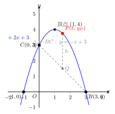

# 二次函数与几何综合

> **一例速记**：
>
> 二次函数压轴题"标配三件套"——**抛物线 + 直线 + 动点**。核心套路：
>
> $$\text{先求基本元素（交点）} \to \text{铅垂高求面积} \to \text{分类讨论几何条件}$$
>
> 见"二次函数 + 几何" → 铅垂高法（面积）+ 距离公式（等腰/直角）+ 中点公式（平行四边形）。**分类讨论是拿满分的关键，不分类必然漏情形。**

---

## 一、引入题

> 抛物线 $y = -x^2 + 2x + 3$ 与 $x$ 轴交于 $A$（左）、$B$（右）两点，与 $y$ 轴交于 $C$。$P$ 是抛物线在线段 $BC$ 上方的动点（含 $B, C$ 端点之间的弧段）。  
> (1) 求 $A$、$B$、$C$ 的坐标，以及直线 $BC$ 的解析式；  
> (2) 求 $\triangle PBC$ 面积的最大值（呼应 part10/08 铅垂高法）；  
> (3) 是否存在点 $P$ 使 $\triangle OPC$（$O$ 为原点）是等腰三角形？若存在，求出所有满足条件的 $P$ 的坐标。

---

## 二、思维路径还原（解题者的内心独白）

> "**(1) 先把坐标求出来，这是解整道题的基础。**
>
> 令 $y = 0$ 求与 $x$ 轴交点：
>
> $$-x^2 + 2x + 3 = 0 \implies x^2 - 2x - 3 = 0 \implies (x+1)(x-3) = 0$$
>
> $x = -1$ 或 $x = 3$。$A$ 在左，$B$ 在右，故 $A(-1, 0)$，$B(3, 0)$。
>
> 令 $x = 0$ 求与 $y$ 轴交点：$y = 3$，故 $C(0, 3)$。
>
> 直线 $BC$：经过 $B(3, 0)$ 和 $C(0, 3)$，斜率 $= \dfrac{3-0}{0-3} = -1$，截距 $3$，方程 $y = -x + 3$。
>
> **(2) 求 $\triangle PBC$ 面积最大值——用铅垂高法（不要用点到直线距离公式）。**
>
> $P$ 是抛物线在 $B$ 和 $C$ 之间的弧段上的动点。$B(3,0)$ 对应 $x=3$，$C(0,3)$ 对应 $x=0$，所以 $P$ 的 $x$ 坐标范围是 $0 \leq t \leq 3$（端点时 $P$ 就是 $B$ 或 $C$，面积为 $0$，所以最大值在内部取）。
>
> 设 $P(t, -t^2+2t+3)$，$0 < t < 3$。
>
> 以 $BC$ 为底边，过 $P$ 作 $x$ 轴垂线，交直线 $BC$ 于 $Q(t, -t+3)$。
>
> 铅垂高：$h = y_P - y_Q = (-t^2+2t+3) - (-t+3) = -t^2 + 3t$。
>
> 当 $0 < t < 3$ 时：$-t^2 + 3t = t(3-t) > 0$（两因子均正），无需绝对值。
>
> 水平宽：$|x_B - x_C| = |3 - 0| = 3$。
>
> $$S = \frac{1}{2} \times 3 \times t(3-t) = \frac{3}{2}(3t - t^2)$$
>
> 配方：$S = -\dfrac{3}{2}\!\left(t - \dfrac{3}{2}\right)^2 + \dfrac{27}{8}$。
>
> 当 $t = \dfrac{3}{2} \in (0, 3)$ 时 $S$ 取最大值 $\dfrac{27}{8}$。
>
> **(3) 等腰三角形——必须分三种情形。**
>
> $\triangle OPC$ 的三个顶点：$O(0,0)$，$P(t, -t^2+2t+3)$，$C(0,3)$。
>
> 先算固定边长：$OC = 3$（$O$ 到 $C$ 的距离，纵坐标差，因为 $x$ 坐标相同）。
>
> 等腰三角形有三种情形（哪两边相等）：
>
> **情形 1**：$OP = OC$，即 $OP = 3$。
>
> $OP^2 = t^2 + (-t^2+2t+3)^2 = 9$。
>
> 设 $u = -t^2 + 2t + 3$（即 $y_P$），则 $t^2 + u^2 = 9$。
>
> 直接展开：$t^2 + (−t^2+2t+3)^2 = 9$。
>
> 令 $f(t) = (-t^2+2t+3)^2 = t^4 - 4t^3 - 2t^2 + 12t + 9$（展开较繁）。
>
> 换个思路：$t^2 + (-t^2+2t+3)^2 = 9$，令 $s = -t^2+2t+3$，则 $t^2 + s^2 = 9$，但 $s$ 和 $t$ 关联，需代回数值试算。
>
> 用数值法：$t = \dfrac{3}{2}$ 时 $y_P = -\dfrac{9}{4}+3+3 = \dfrac{15}{4}$，$OP^2 = \dfrac{9}{4} + \dfrac{225}{16} = \dfrac{36+225}{16} = \dfrac{261}{16} \neq 9$。
>
> 此方程较复杂，设 $P$ 的坐标为 $(t, y_P)$，$OP^2 = t^2 + y_P^2 = 9$，结合 $y_P = -t^2+2t+3$，代入展开后解。
>
> **情形 2**：$OP = PC$。
>
> $PC^2 = (t-0)^2 + (y_P - 3)^2 = t^2 + (-t^2+2t)^2$。令 $OP = PC$，即 $t^2 + y_P^2 = t^2 + (-t^2+2t)^2$，化简得 $y_P^2 = (-t^2+2t)^2$，即 $|y_P| = |t^2-2t|$。
>
> 代入 $y_P = -t^2+2t+3$：
> - $-t^2+2t+3 = -(t^2-2t)$（即 $= -t^2+2t$）→ $3 = 0$，矛盾，无解；
> - $-t^2+2t+3 = t^2-2t$ → $2t^2 - 4t - 3 = 0$ → $t = \dfrac{4 \pm \sqrt{16+24}}{4} = \dfrac{4 \pm \sqrt{40}}{4} = 1 \pm \dfrac{\sqrt{10}}{2}$。
>
> 验证两值是否在 $P$ 的动点范围内（$P$ 在抛物线 $BC$ 弧段，$0 \leq t \leq 3$）：$1 + \dfrac{\sqrt{10}}{2} \approx 1 + 1.58 = 2.58$ ✓，$1 - \dfrac{\sqrt{10}}{2} \approx -0.58$ ✗（不在 $[0,3]$）。
>
> 故 $t = 1 + \dfrac{\sqrt{10}}{2}$，$y_P = -t^2+2t+3$。
>
> **情形 3**：$OC = PC$，即 $PC = 3$。
>
> $PC^2 = t^2 + (y_P - 3)^2 = t^2 + (-t^2+2t)^2 = 9$。
>
> $t^2 + t^2(t-2)^2 = 9$，$t^2[1 + (t-2)^2] = 9$，解这个方程……
>
> **关键反射**：等腰三角形 → 必分三情形（$AB=AC$，$AB=BC$，$AC=BC$）→ 每种情形列方程 → 解方程 → 检验是否在题目要求的范围内。不分类，必漏情形。"

---

## 三、抽象成方法

### 4 类常考几何条件

**类型 1：三角形面积**

用**铅垂高法**（最适合初中，见 part10/08）：

$$S = \frac{1}{2} \times |x_{\text{底右}} - x_{\text{底左}}| \times |y_P - y_Q|$$

其中 $Q$ 是底边直线上与 $P$ 横坐标相同的点。铅垂高 $h = |y_P - y_Q|$ 是关于动点参数 $t$ 的二次函数，用顶点法求最值。

**类型 2：等腰三角形**（3 情形分类讨论）

三个顶点 $M$、$N$、$P$ 中，设 $P$ 为动点，分三种等腰情形：

| 情形 | 等腰条件 | 建立方程 |
|---|---|---|
| $PM = PN$（$P$ 为等腰顶点）| $\vert PM\vert ^2 = \vert PN\vert ^2$ | 直接用距离公式，展开化简 |
| $PM = MN$（$M$ 为等腰顶点）| $\vert PM\vert ^2 = \vert MN\vert ^2$ | 同上，$\vert MN\vert$ 是常数 |
| $PN = MN$（$N$ 为等腰顶点）| $\vert PN\vert ^2 = \vert MN\vert ^2$ | 同上 |

**类型 3：直角三角形**（3 情形分类讨论）

直角在哪个顶点，那两条边互相垂直：

| 情形 | 直角条件 | 建立方程 |
|---|---|---|
| 直角在 $P$ | $\overrightarrow{PM} \cdot \overrightarrow{PN} = 0$ | $(x_M - x_P)(x_N - x_P) + (y_M - y_P)(y_N - y_P) = 0$ |
| 直角在 $M$ | $\overrightarrow{MP} \cdot \overrightarrow{MN} = 0$ | 同上，换顶点 |
| 直角在 $N$ | $\overrightarrow{NP} \cdot \overrightarrow{NM} = 0$ | 同上，换顶点 |

**类型 4：平行四边形**（3 情形分类讨论）

四点 $A$、$B$、$C$、$P$ 构成平行四边形，关键条件：**对角线互相平分**（两对角线的中点相同）。

按"哪两点是对角"分三种配对：$AB$ 和 $CP$ 为对角线，$AC$ 和 $BP$ 为对角线，$AP$ 和 $BC$ 为对角线。

每种情形：中点坐标公式得方程 → 解 $P$ 的坐标 → 验证 $P$ 在抛物线上。

---

## 四、方法变形

### 变形 1：含参抛物线 + 几何

题目给出 $y = ax^2 + bx + c$ 中某些参数未知，结合几何条件（如"三角形面积为某值"、"直角三角形"）求参数。

**策略**：先用几何条件建立关于参数的方程，联立抛物线性质（顶点、对称轴、判别式）求解。

### 变形 2：多动点（$P$ 和 $Q$ 同时动）

若 $P$ 在抛物线上，$Q$ 在直线上，且满足某种关系（如 $PQ$ 平行于 $y$ 轴，或 $PQ$ 长度最短），则用参数 $t$ 表达两点坐标，把目标量化为关于 $t$ 的函数。

### 变形 3：等腰直角三角形（综合条件）

等腰直角 = **等腰 + 直角同时满足**。

最简洁方法：直角顶点是斜边的中点，且到斜边两端距离相等。

- 若 $P$ 为直角顶点（斜边 $MN$ 固定）：$P$ 在 $MN$ 中垂线上，且 $PM \perp PN$（自动满足，只需列中垂线条件）；
- 若 $M$ 为直角顶点：$PM \perp MN$ 且 $PM = MN$（两条件同时列方程）。

---

## 五、思考路标（条件反射训练）

1. **见"抛物线 + 几何综合"** → 第一步永远是：求所有基本元素（交点坐标）！不要直接上面积公式或等腰条件。

2. **求面积最值** → 铅垂高法 → 选底（两定点）→ 铅垂高是 $t$ 的二次函数 → 配方求最值。

3. **见"等腰三角形"** → 立刻写下三种情形：哪两边相等？每种对应一个方程。

4. **见"直角三角形"** → 立刻写下三种情形：直角在哪个顶点？每种用向量点积 = 0 列方程。

5. **见"平行四边形"** → 立刻写下三种情形：哪两点是对角？每种用对角线中点公式列方程。

6. **综合题先求基本元素，再分小问逐一处理** → 不要直接跳到第 (3) 问，缺少 (1) 的基础很容易出错。

---

## 六、应用例题

### 例 1　引入题完整解（面积 + 等腰三角形）

**题**：（同引入题）抛物线 $y = -x^2 + 2x + 3$ 交 $x$ 轴于 $A(-1,0)$、$B(3,0)$，交 $y$ 轴于 $C(0,3)$。$P$ 为弧段 $BC$ 上（$0 < t < 3$）的动点。  
(1) 求直线 $BC$ 的解析式；  
(2) 求 $\triangle PBC$ 面积最大值。

**解**：

**(1)** $B(3,0)$，$C(0,3)$，斜率 $= \dfrac{3-0}{0-3} = -1$，截距 $3$。直线 $BC$：$y = -x + 3$。

**(2)** 设 $P(t, -t^2+2t+3)$，$0 < t < 3$。过 $P$ 作 $x$ 轴垂线交 $BC$ 于 $Q(t, -t+3)$。

铅垂高：$h = (-t^2+2t+3) - (-t+3) = -t^2+3t = t(3-t) > 0$（在 $(0,3)$ 内）。

水平宽：$|x_B - x_C| = 3$。

$$S = \frac{1}{2} \times 3 \times t(3-t) = \frac{3}{2}(3t - t^2) = -\frac{3}{2}\!\left(t - \frac{3}{2}\right)^2 + \frac{27}{8}$$

当 $t = \dfrac{3}{2}$ 时，$S_{\max} = \dfrac{27}{8}$，此时 $P\!\left(\dfrac{3}{2},\, \dfrac{15}{4}\right)$。

**答**：直线 $BC$：$y = -x + 3$；面积最大值 $\dfrac{27}{8}$。

---

### 例 2　抛物线 + 直角三角形存在性

**题**：抛物线 $y = x^2 - 2x - 3$ 与 $x$ 轴交于 $A(-1,0)$ 和 $B(3,0)$。在抛物线上是否存在点 $P$，使 $\triangle PAB$ 是以 $AB$ 为斜边的直角三角形？若存在，求出 $P$ 的坐标。

【思路】以 $AB$ 为斜边的直角三角形，直角必在 $P$，且 $PA \perp PB$。设 $P(t, t^2-2t-3)$ 在抛物线上，用向量点积 = 0。

**解**：

设 $P(t, t^2-2t-3)$，$A(-1,0)$，$B(3,0)$。直角在 $P$：

$$\overrightarrow{PA} = (-1-t,\, -(t^2-2t-3)) = (-1-t,\, -t^2+2t+3)$$

$$\overrightarrow{PB} = (3-t,\, -(t^2-2t-3)) = (3-t,\, -t^2+2t+3)$$

$\overrightarrow{PA} \cdot \overrightarrow{PB} = 0$：

$$(-1-t)(3-t) + (-t^2+2t+3)^2 = 0$$

先展开 $(-1-t)(3-t) = -3 + t - 3t + t^2 = t^2 - 2t - 3$。

令 $u = -t^2+2t+3$，注意 $u = -(t^2-2t-3)$，所以 $u^2 = (t^2-2t-3)^2$。

$$t^2-2t-3 + u^2 = 0 \implies (t^2-2t-3)(1 + 1) = 0 ??$$

等等，让我重新整理：$(-1-t)(3-t) = t^2 - 2t - 3$，以及 $(-t^2+2t+3)^2 = (t^2-2t-3)^2$。

$$t^2-2t-3 + (t^2-2t-3)^2 = 0 \implies (t^2-2t-3)[1 + (t^2-2t-3)] = 0$$

令 $v = t^2-2t-3$：$v(1+v) = 0$，故 $v = 0$ 或 $v = -1$。

- $v = 0$：$t^2-2t-3 = 0$，$(t-3)(t+1)=0$，$t = 3$ 或 $t = -1$。对应的 $P = B$ 或 $P = A$，退化（$P$ 与端点重合），**舍去**。
- $v = -1$：$t^2-2t-3 = -1$，$t^2-2t-2 = 0$，$t = 1 \pm \sqrt{3}$。

$t = 1 + \sqrt{3} \approx 2.73$：$y = -1$，$P(1+\sqrt{3}, -1)$。

$t = 1 - \sqrt{3} \approx -0.73$：$y = -1$，$P(1-\sqrt{3}, -1)$。

验证（以 $t = 1+\sqrt{3}$ 为例）：$PA^2 = (t+1)^2 + 1 = (2+\sqrt{3})^2 + 1 = 4+4\sqrt{3}+3+1 = 8+4\sqrt{3}$；$PB^2 = (3-t)^2 + 1 = (2-\sqrt{3})^2 + 1 = 4-4\sqrt{3}+3+1 = 8-4\sqrt{3}$；$PA^2 + PB^2 = 16 = AB^2$ ✓（$AB = 4$）。

**答**：存在两点 $P_1(1+\sqrt{3},\, -1)$ 和 $P_2(1-\sqrt{3},\, -1)$，使 $\triangle PAB$ 是以 $AB$ 为斜边的直角三角形。

---

### 例 3　抛物线 + 平行四边形存在性

**题**：抛物线 $y = x^2 - 4x + 3$ 与 $x$ 轴交于 $A(1,0)$、$B(3,0)$，与 $y$ 轴交于 $C(0,3)$。在抛物线上是否存在点 $P$（不与 $A$、$B$、$C$ 重合），使 $A$、$B$、$C$、$P$ 四点构成平行四边形？若存在，求出 $P$。

【思路】平行四边形对角线互相平分，分三种配对（哪两点对角），逐一列中点方程。

**解**：

设 $P(t, t^2-4t+3)$ 在抛物线上，$t \neq 0, 1, 3$（不与 $A, B, C$ 重合）。

$A(1,0)$，$B(3,0)$，$C(0,3)$，中间先算 $AB$，$AC$，$BC$ 各中点：$AB$ 中点 $(2, 0)$，$AC$ 中点 $\left(\dfrac{1}{2}, \dfrac{3}{2}\right)$，$BC$ 中点 $\left(\dfrac{3}{2}, \dfrac{3}{2}\right)$。

**情形 1**：$AP$、$BC$ 为对角线（$A, P$ 对角），中点相等：

$$\frac{1+t}{2} = \frac{3}{2},\quad \frac{0 + (t^2-4t+3)}{2} = \frac{3}{2}$$

第一个方程：$t = 2$。第二个：$t^2-4t+3 = 3$，$t^2-4t=0$，$t=0$ 或 $t=4$。矛盾（$t$ 不能同时为 $2$ 和 $0$ 或 $4$）。**无解**。

**情形 2**：$BP$、$AC$ 为对角线，中点相等：

$$\frac{3+t}{2} = \frac{1}{2},\quad \frac{0+(t^2-4t+3)}{2} = \frac{3}{2}$$

$t = -2$，$t^2-4t+3 = 3$，$t^2-4t = 0$，$t=0$ 或 $t=4$。矛盾。**无解**。

**情形 3**：$CP$、$AB$ 为对角线，中点相等：

$$\frac{0+t}{2} = \frac{1+3}{2} = 2,\quad \frac{3+(t^2-4t+3)}{2} = \frac{0+0}{2} = 0$$

$t = 4$，$3 + t^2-4t+3 = 0$：代入 $t=4$：$3 + 16 - 16 + 3 = 6 \neq 0$。**无解**。

对三种情形均无满足条件的 $P$，故**不存在**使 $A, B, C, P$ 构成平行四边形的抛物线上的点。

（注：这是合理的，因为 $A, B, C$ 的位置关系本身限制了这一可能性——读者可用面积法验证。）

---

## 七、自测题

**自测 1**　抛物线 $y = -x^2 + 4x$ 与 $x$ 轴交于 $O(0,0)$、$A(4,0)$，顶点 $V(2,4)$。$P$ 是弧段 $OA$（$0 < t < 4$）上的动点。求 $\triangle POA$ 面积的最大值。

> 提示：底 $OA$ 在 $x$ 轴，水平宽 $=4$，铅垂高 $= y_P = -t^2+4t$。$S = \dfrac{1}{2} \times 4 \times (-t^2+4t) = 2(-t^2+4t) = -2(t-2)^2 + 8$，最大值 $8$，在 $t=2$，$P=V(2,4)$。

**自测 2**　（等腰）抛物线 $y = x^2 - 2x$ 上是否存在点 $P$，使 $\triangle POA$（$O(0,0)$，$A(2,0)$）是等腰三角形，且 $P$ 不在 $x$ 轴上？

> 提示：三种情形。情形 1（$PO=PA$）：$P$ 在 $OA$ 中垂线 $x=1$ 上，$t=1$，$y=1-2=-1$，$P(1,-1)$，验证 $PO=PA=\sqrt{1+1}=\sqrt{2}$ ✓。情形 2（$PO=OA=2$）：$t^2+(t^2-2t)^2=4$，展开解。情形 3（$PA=OA=2$）：$(t-2)^2+(t^2-2t)^2=4$，展开解。各情形仔细求解。

**自测 3**　（直角）抛物线 $y = x^2$ 上是否存在点 $P$，使 $\triangle PAB$（$A(-1,1)$，$B(1,1)$）是直角三角形？

> 提示：注意 $A, B$ 都在抛物线上。三种直角顶点情形。直角在 $P$：$\overrightarrow{PA} \cdot \overrightarrow{PB} = 0$，$(-1-t)(1-t)+(1-t^2)^2 = 0$，$(t^2-1)+(1-t^2)^2=0$，令 $u=t^2-1$：$u+u^2=0$，$u(1+u)=0$，$u=0$（$t=\pm 1$，即 $A, B$，退化）或 $u=-1$，$t^2=0$，$t=0$，$P(0,0)=O$（原点）。验证 $\angle OPA = 90°$：$\overrightarrow{OA}=(-1,1)$，$\overrightarrow{OB}=(1,1)$，点积 $=-1+1=0$ ✓。故 $P(0,0)$ 使 $\triangle PAB$ 直角在 $P$（即 $O$）。

**自测 4**　（平行四边形）抛物线 $y = x^2 - 2x - 3$ 交 $x$ 轴于 $A(-1,0)$、$B(3,0)$，交 $y$ 轴于 $C(0,-3)$。在抛物线上是否存在点 $P$，使四边形 $ABPC$ 是平行四边形？

> 提示：$ABPC$ 的顶点依次为 $A, B, P, C$。对角线 $AP$ 和 $BC$ 互相平分：$\dfrac{-1+t}{2}=\dfrac{3+0}{2}=\dfrac{3}{2}$，$t=4$，代入抛物线 $y=16-8-3=5$，$P(4,5)$。验证另一对角线 $BP$ 和 $AC$ 中点：$BP$ 中点 $=\left(\dfrac{3+4}{2},\dfrac{0+5}{2}\right)=\left(\dfrac{7}{2},\dfrac{5}{2}\right)$；$AC$ 中点 $=\left(\dfrac{-1+0}{2},\dfrac{0-3}{2}\right)=\left(-\dfrac{1}{2},-\dfrac{3}{2}\right)$。不相等，所以 $ABPC$ 不是平行四边形（顺序不对）。重新按"对角线互相平分"分三种配对仔细检查。

**自测 5**　（综合）抛物线 $y = -x^2 + 4x - 3$ 与 $x$ 轴交于 $A(1,0)$、$B(3,0)$，顶点 $V(2,1)$。$P$ 是抛物线上 $A$ 和 $B$ 之间的动点。  
(1) 求 $\triangle PAB$ 面积的最大值；  
(2) 是否存在 $P$ 使 $\triangle PVA$ 是等腰三角形（$VA = $ 某已知值）？

> 提示：(1) 底 $AB$ 在 $x$ 轴，水平宽 $=2$，铅垂高 $= y_P = -t^2+4t-3$（$1<t<3$ 时 $>0$）。$S = \dfrac{1}{2} \times 2 \times (-t^2+4t-3) = -(t-2)^2+1$，最大值 $1$，$P=V(2,1)$。(2) $V(2,1)$，$A(1,0)$，$VA = \sqrt{1+1}=\sqrt{2}$。三种情形：$VP=VA$，$AP=VA$，$VP=AP$。分别建立方程求解。
