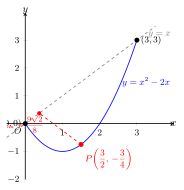

# 函数图象上的动点问题

> **一例速记**：
>
> 动点 $P$ 在抛物线 $y = x^2 - 2x$ 上（$0 \leq x \leq 3$），求 $P$ 到直线 $y = x$ 的距离最大值。
>
> **钥匙**：设 $P(t, t^2 - 2t)$，用点到直线距离公式 $d = \dfrac{|t - (t^2-2t)|}{\sqrt{2}} = \dfrac{-t^2 + 3t}{\sqrt{2}}$（$0 \leq t \leq 3$ 时分子非负），再配方求最大值 $\dfrac{9\sqrt{2}}{8}$（在 $t = \dfrac{3}{2}$ 时取得）。
>
> 见"动点在曲线上 + 求最值" → 立刻**设参数 $t$ 表达坐标 → 把几何量化为关于 $t$ 的函数 → 二次函数顶点法**。**动 → 静用参数 $t$**。

---

## 一、引入题

> 抛物线 $y = x^2 - 2x$，$P$ 是抛物线上 $0 \leq x \leq 3$ 段的动点。求 $P$ 到直线 $y = x$ 的距离的最大值，并求此时 $P$ 的坐标。

初看这道题，$P$ 在曲线上"动"，距离也随之变化，既不能直接代入，也难以凭直觉判断最远点在哪里。**突破口**：用参数 $t$ 把"动"的 $P$ 写成一个坐标，再把距离表达为 $t$ 的函数。

---

## 二、思维路径还原（解题者的内心独白）

> "$P$ 在抛物线 $y = x^2 - 2x$ 上，自然可以**设 $P(t, t^2 - 2t)$**，其中 $0 \leq t \leq 3$（题目给出的 $x$ 范围）。
>
> 我要求 $P$ 到直线 $y = x$（即 $x - y = 0$）的距离。
>
> **点到直线的距离公式**：点 $(x_0, y_0)$ 到直线 $ax + by + c = 0$ 的距离是
>
> $$d = \frac{|ax_0 + by_0 + c|}{\sqrt{a^2 + b^2}}$$
>
> 直线 $x - y = 0$ 中 $a = 1, b = -1, c = 0$，故
>
> $$d = \frac{|t - (t^2 - 2t)|}{\sqrt{1^2 + (-1)^2}} = \frac{|t - t^2 + 2t|}{\sqrt{2}} = \frac{|-t^2 + 3t|}{\sqrt{2}}$$
>
> 在 $0 \leq t \leq 3$ 范围内，$-t^2 + 3t = t(3 - t)$，因为 $t \geq 0$ 且 $3 - t \geq 0$，所以乘积 $\geq 0$，绝对值可以去掉：
>
> $$d(t) = \frac{-t^2 + 3t}{\sqrt{2}} = \frac{1}{\sqrt{2}}\left(-t^2 + 3t\right)$$
>
> 这是关于 $t$ 的二次函数！开口向下（$-t^2$ 的系数 $< 0$），有最大值在顶点处取得。
>
> 配方（或用顶点公式）：
>
> $$-t^2 + 3t = -\!\left(t^2 - 3t\right) = -\!\left(t - \frac{3}{2}\right)^2 + \frac{9}{4}$$
>
> 所以
>
> $$d(t) = \frac{1}{\sqrt{2}}\left[-\left(t - \frac{3}{2}\right)^2 + \frac{9}{4}\right]$$
>
> **检验 $t = \dfrac{3}{2}$ 是否在 $[0, 3]$ 内**：$0 \leq \dfrac{3}{2} \leq 3$ ✓，在定义域内，可以取到。
>
> 最大距离：$d_{\max} = \dfrac{1}{\sqrt{2}} \cdot \dfrac{9}{4} = \dfrac{9}{4\sqrt{2}} = \dfrac{9\sqrt{2}}{8}$。
>
> 对应点：$t = \dfrac{3}{2}$，$y = \left(\dfrac{3}{2}\right)^2 - 2 \cdot \dfrac{3}{2} = \dfrac{9}{4} - 3 = -\dfrac{3}{4}$，故 $P\!\left(\dfrac{3}{2}, -\dfrac{3}{4}\right)$。
>
> **关键反射**：见"动点在曲线上 + 求距离/面积/周长等最值" → 先**设参数**固定坐标，再**把目标量化为参数的函数**，再**二次函数配方求最值**，最后**检验参数是否在定义域内**。动 → 静，靠参数；最值 → 靠二次函数顶点法。"

---

## 三、抽象成方法

### 动点问题的 4 步标准流程

**第 1 步：设参数——把动点的坐标用一个字母 $t$ 表达**

- 动点在曲线 $y = f(x)$ 上 → 设 $P(t, f(t))$；
- 范围：题目给出 $x$ 的区间，就是 $t$ 的定义域；
- 如果曲线方程是隐函数（如圆），可用参数方程表达。

**第 2 步：几何量代数化——把要求最值的量用 $t$ 的表达式写出来**

| 常见几何量 | 代数表达思路 |
|---|---|
| $P$ 到定直线 $ax+by+c=0$ 的距离 | $d = \dfrac{|at + b \cdot f(t) + c|}{\sqrt{a^2+b^2}}$ |
| $P$ 到定点 $A(x_0, y_0)$ 的距离 | $|PA|^2 = (t - x_0)^2 + (f(t) - y_0)^2$（先平方避根号） |
| $P$ 与两定点围成的三角形面积 | 铅垂高法（参见 part10/08） |
| 周长（$P$ 与两定点连线之和） | 将军饮马（对称点）思想 |

**第 3 步：化为关于 $t$ 的函数——通常是二次函数**

- 整理代数表达式，凑出 $at^2 + bt + c$ 的形式；
- 若出现根号（如距离未平方），先判断在定义域内能否去掉绝对值，再配方。

**第 4 步：求最值并检验**

- 配方（顶点法）或直接用顶点坐标公式 $t^* = -\dfrac{b}{2a}$；
- **必须检验** $t^*$ 是否在题目给定的范围内；
- 若 $t^*$ 不在范围内，最值在区间端点处取得（端点代入比较大小）；
- 最后把 $t^*$ 代回曲线方程，算出 $P$ 的实际坐标。

---

## 四、方法变形

### 变形 1：目标量是距离平方（避根号）

若题目求"$P$ 到定点 $A$ 的最短距离"，先令 $d^2 = (t - x_0)^2 + (f(t) - y_0)^2$，化为关于 $t$ 的函数求最小值，最后开方得 $d$。平方后通常是二次（有时是四次，中考一般不出现）。

**示例**：求抛物线 $y = x^2$ 上到点 $A(1, 0)$ 距离最短的点。

设 $P(t, t^2)$，则

$$d^2 = (t - 1)^2 + t^4$$

这是四次函数，中考不考。但若曲线是一次或二次，$d^2$ 一般是二次，方便处理。

### 变形 2：目标量是三角形面积

若 $P$ 与两个定点 $A, B$ 围成三角形，面积最值用**铅垂高法**（参见 part10/08）：以 $AB$ 为底，过 $P$ 作 $x$ 轴垂线，铅垂高是 $t$ 的二次函数，再求最大值。

### 变形 3：目标量是两段路径之和（折线最短）

若题目求 "$P$ 在曲线上，使 $|PA| + |PB|$ 最小"（$A, B$ 是定点），用**将军饮马**思想：

- 把 $A$（或 $B$）关于曲线所在直线（如 $x$ 轴）作对称点 $A'$；
- $|PA| + |PB| \geq |A'B|$，等号在 $P$ 是 $A'B$ 与曲线的交点时成立。
- 注意：此思想要求曲线是直线（$x$ 轴、$y$ 轴等），若曲线是抛物线，需用参数法直接求。

### 变形 4：定义域端点处取得最值

若顶点 $t^* = -\dfrac{b}{2a}$ 落在区间 $[m, n]$ 之外，则：

- 函数在区间内单调（无顶点），最值在端点取得；
- 代入 $t = m$ 和 $t = n$ 比较大小。

---

## 五、思考路标（条件反射训练）

读每一条，练到"看到就秒反应"：

1. **见"动点 $P$ 在曲线上"** → 第一步必写 $P(t, f(t))$，确定 $t$ 的范围（定义域），把"动"化为"静态参数"。

2. **见"求距离最值"** → 用点到直线距离公式（或点到点距离的平方），整理为关于 $t$ 的二次函数，配方求顶点。

3. **见"求面积最值"** → 铅垂高法：以两定点连线为底，铅垂高是 $t$ 的函数，面积 $= \dfrac{1}{2} \times \text{水平宽} \times h(t)$。

4. **求完最值必检验 $t^*$ 是否在 $[m, n]$ 内** → 落在内部取顶点值；落在外部取端点值（比较两端点哪个更大/小）。

5. **面对距离公式含根号** → 先去绝对值（在定义域内判断符号），得到多项式，再配方；或用距离的平方化二次，最后开方。

6. **"两路之和最短"** → 曲线是直线时用将军饮马（轴对称）；曲线是抛物线时必用参数法，化为 $t$ 的函数再求最小值。

---

## 六、应用例题

### 例 1　距离最大值（引入题完整解）

**题**：抛物线 $y = x^2 - 2x$，$P$ 是抛物线上 $0 \leq x \leq 3$ 段的动点。求 $P$ 到直线 $y = x$ 的距离的最大值，并求此时 $P$ 的坐标。

【思路】设 $P(t, t^2 - 2t)$，$0 \leq t \leq 3$，用点到直线距离公式化为关于 $t$ 的二次函数，配方求最大值，检验顶点在定义域内。

**解**：

设 $P(t,\ t^2 - 2t)$，$0 \leq t \leq 3$。

直线 $y = x$ 即 $x - y = 0$，点到直线距离：

$$d = \frac{|t - (t^2 - 2t)|}{\sqrt{1^2 + (-1)^2}} = \frac{|-t^2 + 3t|}{\sqrt{2}}$$

在 $0 \leq t \leq 3$ 时，$t \geq 0$ 且 $3 - t \geq 0$，故 $-t^2 + 3t = t(3-t) \geq 0$，绝对值去掉：

$$d(t) = \frac{-t^2 + 3t}{\sqrt{2}}$$

配方：

$$-t^2 + 3t = -\!\left(t - \frac{3}{2}\right)^2 + \frac{9}{4}$$

故

$$d(t) = \frac{1}{\sqrt{2}}\left[-\left(t - \frac{3}{2}\right)^2 + \frac{9}{4}\right]$$

开口向下，$t = \dfrac{3}{2} \in [0, 3]$ 时取最大值：

$$d_{\max} = \frac{1}{\sqrt{2}} \cdot \frac{9}{4} = \frac{9}{4\sqrt{2}} = \frac{9\sqrt{2}}{8}$$

对应 $P$ 的纵坐标：$y = \left(\dfrac{3}{2}\right)^2 - 2 \cdot \dfrac{3}{2} = \dfrac{9}{4} - 3 = -\dfrac{3}{4}$。

**答**：$P$ 到直线 $y = x$ 距离的最大值为 $\dfrac{9\sqrt{2}}{8}$，此时 $P = \left(\dfrac{3}{2},\ -\dfrac{3}{4}\right)$。

---

### 例 2　三角形面积最大值

**题**：抛物线 $y = -x^2 + 4x$ 与 $x$ 轴交于 $A(0,0)$、$B(4,0)$，$P$ 是抛物线上（不含端点）的动点。求 $\triangle PAB$ 面积的最大值，并指出此时 $P$ 的坐标。

【思路】$AB$ 在 $x$ 轴上，铅垂高即为 $P$ 的纵坐标，面积是 $t$ 的二次函数，求最大值。

**解**：

设 $P(t,\ -t^2 + 4t)$，$0 < t < 4$（$P$ 在抛物线上，不含端点 $A, B$）。

因为 $0 < t < 4$ 时 $y = -t^2 + 4t = t(4-t) > 0$，$P$ 在 $x$ 轴上方。

底 $|AB| = 4$（水平宽），铅垂高 $= y_P = -t^2 + 4t$（底直线 $y = 0$，铅垂高就是纵坐标）。

面积：

$$S = \frac{1}{2} \times 4 \times (-t^2 + 4t) = 2(-t^2 + 4t) = -2(t^2 - 4t) = -2(t-2)^2 + 8$$

开口向下，$t = 2 \in (0, 4)$ 时 $S_{\max} = 8$。

对应 $P$：$y = -4 + 8 = 4$，故 $P(2, 4)$（即抛物线顶点）。

**答**：$\triangle PAB$ 面积最大值为 $8$，此时 $P = (2,4)$（抛物线顶点）。

---

### 例 3　动点与定点的距离最值

**题**：已知抛物线 $y = x^2 + 1$，$P$ 是抛物线上 $-2 \leq x \leq 1$ 段的动点，$A(0, 3)$ 是定点。求 $|PA|$ 的最小值。

【思路】设 $P(t, t^2+1)$，$-2 \leq t \leq 1$，先对 $|PA|^2$ 配方求最小，再开方。

**解**：

设 $P(t,\ t^2 + 1)$，$-2 \leq t \leq 1$。

$$|PA|^2 = (t - 0)^2 + (t^2 + 1 - 3)^2 = t^2 + (t^2 - 2)^2$$

展开：

$$= t^2 + t^4 - 4t^2 + 4 = t^4 - 3t^2 + 4$$

令 $u = t^2$（$u \in [0, 4]$，因为 $t \in [-2, 1]$ 时 $t^2 \in [0, 4]$）：

$$|PA|^2 = u^2 - 3u + 4 = \left(u - \frac{3}{2}\right)^2 + 4 - \frac{9}{4} = \left(u - \frac{3}{2}\right)^2 + \frac{7}{4}$$

$u = \dfrac{3}{2} \in [0, 4]$ 时，$|PA|^2$ 取最小值 $\dfrac{7}{4}$，故 $|PA|_{\min} = \dfrac{\sqrt{7}}{2}$。

$u = t^2 = \dfrac{3}{2}$ → $t = \pm\dfrac{\sqrt{6}}{2}$，均在 $[-2, 1]$ 内（$\dfrac{\sqrt{6}}{2} \approx 1.22 > 1$，$t = \dfrac{\sqrt{6}}{2}$ 不在范围内！$t = -\dfrac{\sqrt{6}}{2} \approx -1.22 \in [-2, 1]$ ✓）。

故仅 $t = -\dfrac{\sqrt{6}}{2}$ 合法，对应 $P\!\left(-\dfrac{\sqrt{6}}{2},\ \dfrac{3}{2} + 1\right) = P\!\left(-\dfrac{\sqrt{6}}{2},\ \dfrac{5}{2}\right)$。

**答**：$|PA|$ 的最小值为 $\dfrac{\sqrt{7}}{2}$，此时 $P = \left(-\dfrac{\sqrt{6}}{2},\ \dfrac{5}{2}\right)$。

---

## 七、自测题

**自测 1**　抛物线 $y = x^2 - 4x + 3$，$P$ 是抛物线上 $1 \leq x \leq 4$ 段的动点。求 $P$ 到直线 $y = 0$（$x$ 轴）的距离的最大值。

> 💡 提示：设 $P(t, t^2 - 4t + 3)$，$1 \leq t \leq 4$。距离 $d = |t^2 - 4t + 3|$。在 $t \in [1, 4]$ 中，$t^2 - 4t + 3 = (t-1)(t-3)$，$t \in [1,3]$ 时 $\leq 0$，$t \in [3, 4]$ 时 $\geq 0$。$d(t) = |t^2 - 4t + 3|$，在 $[1,3]$ 上 $d = -(t^2-4t+3) = -t^2+4t-3$，顶点 $t = 2$，$d_{\max} = -4+8-3 = 1$；在 $[3,4]$ 上 $d = t^2-4t+3$，在 $t = 4$ 时 $d = 3$（端点最大）。综合：$d_{\max} = 3$，在 $P(4, 3)$ 时取得。

**自测 2**　抛物线 $y = -x^2 + 2x + 3$ 与 $x$ 轴交于 $A(-1, 0), B(3, 0)$，与 $y$ 轴交于 $C(0,3)$。$P$ 是抛物线上第一象限内的动点。求 $\triangle PAC$ 面积的最大值。

> 💡 提示：以 $AC$ 为底。直线 $AC$ 经过 $A(-1,0), C(0,3)$，斜率 $= 3$，方程 $y = 3x + 3$。设 $P(t, -t^2+2t+3)$，$0 < t < 3$。过 $P$ 作垂线交 $AC$ 于 $Q(t, 3t+3)$，铅垂高 $h = |(-t^2+2t+3)-(3t+3)| = |-t^2-t| = t^2+t = t(t+1)$（$0 < t < 3$ 时 $y_P - y_Q = -t^2-t < 0$，取绝对值）。水平宽 $= |x_A - x_C| = 1$。$S = \frac{1}{2} \times 1 \times t(t+1) = \frac{1}{2}(t^2+t)$，这是关于 $t$ 的开口向上二次函数，在 $(0,3)$ 内单调递增，最大值趋近于但不可取得（开区间）。若题改为 $0 < t \leq 3$（含 $B$，但 $B$ 在 $x$ 轴上不属第一象限），则 $S_{\max}$ 在 $t = 3$ 时为 $\frac{1}{2} \times 12 = 6$。**提示注意**：底的选取影响铅垂高是否为开口向下（有限最大值），选 $AB$ 或 $BC$ 为底可以得到关于 $t$ 的开口向下二次函数，从而有最大值。

**自测 3**　抛物线 $y = x^2 - 2x - 3$，$P$ 是 $-1 \leq x \leq 3$ 段上的动点，$A(1, 0)$ 是定点。求 $|PA|^2$ 的最小值，并指出此时 $P$ 的坐标。

> 💡 提示：设 $P(t, t^2-2t-3)$，$t \in [-1, 3]$。$|PA|^2 = (t-1)^2 + (t^2-2t-3)^2$。注意 $t^2-2t-3 = (t-1)^2-4$，令 $u = (t-1)^2 \geq 0$，则 $|PA|^2 = u + (u-4)^2 = u^2 - 7u + 16 = (u - \frac{7}{2})^2 + 16 - \frac{49}{4} = (u - \frac{7}{2})^2 + \frac{15}{4}$，$u \in [0, 4]$（因 $t \in [-1,3]$，$(t-1)^2$ 的范围是 $[0, 4]$）。$u = \frac{7}{2} \in [0,4]$，故 $|PA|^2_{\min} = \frac{15}{4}$，$|PA|_{\min} = \frac{\sqrt{15}}{2}$。对应 $t - 1 = \pm\sqrt{\frac{7}{2}}$，即 $t = 1 \pm \frac{\sqrt{14}}{2}$，两值均在 $[-1,3]$ 内，有两个对应点。

**自测 4**　（综合）抛物线 $y = -x^2 + 2x + 8$ 与 $x$ 轴交于 $A(-2, 0), B(4, 0)$。$P$ 是抛物线在 $x$ 轴上方（不含端点）的动点。是否存在 $P$ 使 $|PA| + |PB| < 10$？若存在，求满足条件的 $P$ 的 $x$ 坐标范围。

> 💡 提示：设 $P(t, -t^2+2t+8)$，$-2 < t < 4$。$|PA| + |PB|$ 不方便直接最小化（不是直线上的将军饮马问题，因为 $A, B$ 不在曲线两侧的直线上）。可以先求 $|PA|^2$ 和 $|PB|^2$ 验证是否恒 $\geq$ 某值，或者先求 $|PA| + |PB|$ 的最小值。思路：$|PA|^2 = (t+2)^2 + (-t^2+2t+8)^2$，$|PB|^2 = (t-4)^2 + (-t^2+2t+8)^2$，分别展开后较复杂。**简化提示**：当 $P$ 在顶点 $(1, 9)$ 时，$|PA| = \sqrt{9+81} = \sqrt{90} = 3\sqrt{10} \approx 9.49 < 10$（单个距离已接近 $10$，$|PA| + |PB|$ 会很大）。说明此路存在条件需要认真计算，本题主要训练参数化思路，计算量较大，中考中通常会简化数字。

---

**回头看一眼"一例速记"**：

> 见"动点在曲线上 + 求最值" → 三步：
>
> **第一步**：设 $P(t, f(t))$，确定 $t$ 的范围；
>
> **第二步**：把目标量（距离/面积/周长）用 $t$ 的代数式表达；
>
> **第三步**：化为关于 $t$ 的二次函数 → 配方求最值 → 检验 $t^*$ 在定义域内。
>
> **"动 → 静用参数 $t$"——动点问题的核心口诀。**

如果你现在能不看笔记写出引入题（$P$ 到直线 $y = x$ 距离最大值）和例 2（三角形面积最大值）的完整解，说明你已掌握这一套路。
