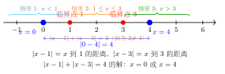

# 含绝对值与分段函数题型

> **一例速记**：
>
> 解方程 $|x - 1| + |x - 3| = 4$。临界点 $x = 1, x = 3$ 把数轴分成三段：
>
> - $x < 1$：$(1-x)+(3-x)=4$ → $x=0$ ✓
> - $1 \leq x \leq 3$：$(x-1)+(3-x)=2=4$，矛盾，**无解**
> - $x > 3$：$(x-1)+(x-3)=4$ → $x=4$ ✓
>
> 答：$x = 0$ 或 $x = 4$。
>
> 见"含绝对值 / 分段" → **先找临界点 → 按临界点把数轴分段 → 每段去绝对值 / 代入分段式 → 解方程 + 检验是否在该段内**。

---

## 一、引入题

> 解方程 $|x - 1| + |x - 3| = 4$。

这道题有两个绝对值，不能直接拆开（不知道哪个为正哪个为负）。但我们可以**找临界点**，把数轴分成几段，在每段内绝对值的符号已知，就能去掉绝对号，变成普通方程。

---

## 二、思维路径还原（解题者的内心独白）

> "含两个绝对值——$|x-1|$ 的临界点是 $x=1$（内部表达式 $x-1$ 在此处变号）；$|x-3|$ 的临界点是 $x=3$。
>
> 两个临界点 $1$ 和 $3$ 把数轴分成三段：$x < 1$，$1 \leq x \leq 3$，$x > 3$。
>
> **在每段内，绝对值内部的表达式的符号是固定的，可以去绝对号。**
>
> ---
>
> **情形 1：$x < 1$**
>
> $x - 1 < 0$ → $|x-1| = -(x-1) = 1-x$
>
> $x - 3 < 0$ → $|x-3| = -(x-3) = 3-x$
>
> 方程变为：$(1-x) + (3-x) = 4$ → $4 - 2x = 4$ → $x = 0$
>
> 检验：$x = 0$ 满足 $x < 1$ ✓，是合法解。
>
> ---
>
> **情形 2：$1 \leq x \leq 3$**
>
> $x - 1 \geq 0$ → $|x-1| = x-1$
>
> $x - 3 \leq 0$ → $|x-3| = 3-x$
>
> 方程变为：$(x-1) + (3-x) = 4$ → $2 = 4$，矛盾！
>
> 这个情形无解——在 $1 \leq x \leq 3$ 内，$|x-1| + |x-3|$ 恒等于 $(x-1)+(3-x) = 2$，而方程要求等于 $4$，永远不能成立。
>
> ---
>
> **情形 3：$x > 3$**
>
> $x - 1 > 0$ → $|x-1| = x-1$
>
> $x - 3 > 0$ → $|x-3| = x-3$
>
> 方程变为：$(x-1) + (x-3) = 4$ → $2x - 4 = 4$ → $x = 4$
>
> 检验：$x = 4$ 满足 $x > 3$ ✓，是合法解。
>
> ---
>
> **合并**：$x = 0$ 或 $x = 4$。
>
> **几何直觉**（验证）：$|x-1| + |x-3|$ 在数轴上的意义是 $x$ 到 $1$ 的距离加上 $x$ 到 $3$ 的距离。$1$ 和 $3$ 之间（$1 \leq x \leq 3$）时，两段距离之和恒为 $|3-1| = 2$（因为 $x$ 在两点之间，两段距离之和就等于两点间的距离）。要使之等于 $4 > 2$，$x$ 必须在 $1$ 的左边或 $3$ 的右边，且多出来的 $4 - 2 = 2$ 分别由 $x$ 到最近的临界点的额外距离贡献。
>
> **关键反射**：含绝对值方程 → 找临界点 → 分段讨论 → 每段解方程 → 验证。含分段函数 → 先判断 $x$ 所在段 → 代入该段的解析式。"

---

## 三、抽象成方法

### 含绝对值方程 / 不等式的标准流程（5 步）

**第 1 步：找临界点**

每个绝对值 $|g(x)|$ 的临界点是 $g(x) = 0$ 的解。$n$ 个绝对值至多有 $n$ 个临界点，把数轴分成至多 $n + 1$ 段。

| 绝对值个数 | 临界点数 | 分段数 |
|---|---|---|
| 1 个 $\vert ax + b\vert$ | 1 个 | 2 段 |
| 2 个 $\vert ax+b\vert , \vert cx+d\vert$ | 2 个（一般情形） | 3 段 |
| $n$ 个 | $\leq n$ 个 | $\leq n+1$ 段 |

**第 2 步：按临界点分段，确定每段内各绝对值的符号**

在每一段内，$g(x)$ 不变号（单调），所以绝对值的拆法固定。

**第 3 步：在每段内去绝对号，化为普通方程 / 不等式**

$|g(x)| = \begin{cases} g(x), & g(x) \geq 0 \\ -g(x), & g(x) < 0 \end{cases}$

**第 4 步：在每段内解方程 / 不等式，得到候选解**

**第 5 步：检验候选解是否在该段的范围内**

不在范围内的解**舍去**，最后合并所有情形的有效解（方程取并集，不等式取各段的交集后合并）。

---

### 分段函数的求值与解方程

**求函数值**：先判断 $x$ 属于哪一段的定义域，代入该段的解析式。

**解方程 $f(x) = c$**：逐段令 $f(x) = c$，解出 $x$，验证 $x$ 在该段范围内（类似含绝对值的处理）。

**画图象**：按各段分别画，注意**分界点处的开闭**（空心圆 $\circ$ 表示不包含，实心点 $\bullet$ 表示包含）。

---

## 四、方法变形

### 变形 1：含一个绝对值（2 段讨论）

**题型**：$|2x - 3| = 5$。

临界点 $x = \dfrac{3}{2}$，分两段：

**情形 1：$x \geq \dfrac{3}{2}$**（$2x - 3 \geq 0$）

$2x - 3 = 5$ → $x = 4$ ✓（$4 \geq \dfrac{3}{2}$）

**情形 2：$x < \dfrac{3}{2}$**（$2x - 3 < 0$）

$-(2x - 3) = 5$ → $-2x + 3 = 5$ → $x = -1$ ✓（$-1 < \dfrac{3}{2}$）

答：$x = 4$ 或 $x = -1$。

**快捷公式**：$|ax + b| = c$（$c > 0$）等价于 $ax + b = c$ 或 $ax + b = -c$，直接解两个方程（适用于单绝对值方程，不用分段讨论）。

### 变形 2：含绝对值的不等式

**题型**：$|2x - 1| < 5$。

**方法一（分段讨论）**：临界点 $x = \dfrac{1}{2}$。

- $x < \dfrac{1}{2}$：$-(2x-1) < 5$ → $1-2x < 5$ → $x > -2$，结合 $x < \dfrac{1}{2}$，得 $-2 < x < \dfrac{1}{2}$；
- $x \geq \dfrac{1}{2}$：$2x - 1 < 5$ → $x < 3$，结合 $x \geq \dfrac{1}{2}$，得 $\dfrac{1}{2} \leq x < 3$；
- 合并：$-2 < x < 3$。

**方法二（公式）**：$|ax + b| < c$（$c > 0$）等价于 $-c < ax + b < c$，即 $\dfrac{-c - b}{a} < x < \dfrac{c - b}{a}$（$a > 0$ 时）。

$|2x - 1| < 5$ → $-5 < 2x - 1 < 5$ → $-4 < 2x < 6$ → $-2 < x < 3$。

### 变形 3：绝对值的数轴几何解释

$|x - a|$ 在数轴上表示**$x$ 到 $a$ 的距离**。利用几何意义可快速判断答案范围：

- $|x - a| = r$：$x$ 到 $a$ 的距离等于 $r$ → $x = a \pm r$（两个点）；
- $|x - a| < r$：$x$ 到 $a$ 的距离小于 $r$ → $a - r < x < a + r$（区间内）；
- $|x - a| + |x - b| = \text{常数}$：若常数 $>|b-a|$，有两个解（在区间外各一个）；若常数 $= |b-a|$，有无穷多解（$[a,b]$ 整段）；若常数 $< |b-a|$，无解。

### 变形 4：分段函数与绝对值函数的关系

含绝对值的函数本质上是分段函数：

$$|x - a| = \begin{cases} x - a, & x \geq a \\ a - x, & x < a \end{cases}$$

处理分段函数时，如果分界点不是绝对值的临界点而是题目直接给出的，解法相同：**先判断 $x$ 在哪段，再代入对应公式**。

---

## 五、思考路标（条件反射训练）

读每一条，练到"看到就秒反应"：

1. **见 $|ax + b|$** → 立刻想到**数轴距离**意义，找临界点 $x = -\dfrac{b}{a}$，这是符号变号的分界。

2. **含一个绝对值** → **2 情形**：$\geq 0$ 和 $< 0$（或用公式 $= \pm c$ 直接拆）。

3. **含两个绝对值 $|g_1(x)|, |g_2(x)|$** → **按 2 个临界点把数轴分 3 段**，逐段讨论。

4. **解每段方程后必检验** → 解必须落在该段的范围内，否则舍去。不检验是最常见的失分点。

5. **含绝对值不等式** → 单个绝对值用夹逼公式（$|u| < c$ → $-c < u < c$）；多个绝对值同样分段讨论，每段解不等式，最后取各段有效解的并集。

6. **分段函数求值** → **先看 $x$ 属于哪段**，代入那一段的式子，不要把所有段的公式都代一遍。

---

## 六、应用例题

### 例 1　含两个绝对值的方程（引入题完整解）

**题**：解方程 $|x - 1| + |x - 3| = 4$。

【思路】两个临界点 $x = 1, x = 3$，分三段讨论，逐段解方程并检验。

**解**：

临界点：$x = 1$（$|x-1|$ 变号）和 $x = 3$（$|x-3|$ 变号），将数轴分为三段。

**情形 1：$x < 1$**

$$|x-1| = 1-x,\quad |x-3| = 3-x$$

$$方程：(1-x)+(3-x)=4 \implies 4-2x=4 \implies x=0$$

验证：$0 < 1$ ✓，$x = 0$ 合法。

**情形 2：$1 \leq x \leq 3$**

$$|x-1| = x-1,\quad |x-3| = 3-x$$

$$方程：(x-1)+(3-x)=4 \implies 2=4，矛盾$$

此情形无解。

**情形 3：$x > 3$**

$$|x-1| = x-1,\quad |x-3| = x-3$$

$$方程：(x-1)+(x-3)=4 \implies 2x-4=4 \implies x=4$$

验证：$4 > 3$ ✓，$x = 4$ 合法。

**答**：$x = 0$ 或 $x = 4$。

---

### 例 2　分段函数求值与解方程

**题**：已知 $f(x) = \begin{cases} x^2 - 1, & x \geq 1 \\ 2x + 1, & x < 1 \end{cases}$。

(1) 求 $f(2)$、$f(0)$、$f(-3)$；

(2) 解方程 $f(x) = 3$；

(3) 是否存在 $x$ 使 $f(x) = -2$？若存在求 $x$，若不存在说明理由。

【思路】求值先判断 $x$ 的范围，再代入对应段。解方程分段令 $f(x) = c$ 各自求解并检验。

**解**：

**(1)**

- $f(2)$：$2 \geq 1$，用第一段：$f(2) = 4 - 1 = 3$；
- $f(0)$：$0 < 1$，用第二段：$f(0) = 0 + 1 = 1$；
- $f(-3)$：$-3 < 1$，用第二段：$f(-3) = -6 + 1 = -5$。

**(2)** 解 $f(x) = 3$，分两段：

**段 1：$x \geq 1$**：$x^2 - 1 = 3$ → $x^2 = 4$ → $x = \pm 2$，验证：$x = 2 \geq 1$ ✓，$x = -2 < 1$ ✗（舍去）。

**段 2：$x < 1$**：$2x + 1 = 3$ → $x = 1$，验证：$1 < 1$？不满足（不含 $1$）✗（舍去）。

答：$f(x) = 3$ 的解为 $x = 2$。

**(3)** 分两段：

**段 1：$x \geq 1$**：$x^2 - 1 = -2$ → $x^2 = -1$，无实数解。

**段 2：$x < 1$**：$2x + 1 = -2$ → $x = -\dfrac{3}{2}$，验证：$-\dfrac{3}{2} < 1$ ✓。

答：存在 $x = -\dfrac{3}{2}$ 使 $f(x) = -2$。

---

### 例 3　含绝对值不等式

**题**：解不等式 $|2x - 1| < 5$。

【思路】单绝对值不等式，用夹逼公式 $|u| < c \iff -c < u < c$（$c > 0$），再解三项不等式。

**解**：

$$|2x - 1| < 5 \iff -5 < 2x - 1 < 5$$

各项加 $1$：

$$-4 < 2x < 6$$

各项除以 $2$：

$$-2 < x < 3$$

**答**：不等式的解集为 $(-2,\ 3)$，即 $-2 < x < 3$。

**验证**（取 $x = 0$）：$|2 \times 0 - 1| = 1 < 5$ ✓；（取 $x = -2$）：$|-4-1| = 5 \not< 5$ ✗（端点不满足严格不等号）✓。

---

## 七、自测题

**自测 1**　解方程 $|3x + 2| = 7$。

> 💡 提示：单绝对值，直接拆成两个方程：$3x + 2 = 7$ 或 $3x + 2 = -7$。解得 $x = \dfrac{5}{3}$ 或 $x = -3$。

**自测 2**　解方程 $|x + 2| + |x - 4| = 8$。

> 💡 提示：临界点 $x = -2$ 和 $x = 4$，分三段。**段 1（$x < -2$）**：$(-(x+2)) + (-(x-4)) = -2x + 2 = 8$，$x = -3$ ✓。**段 2（$-2 \leq x \leq 4$）**：$(x+2) + (-(x-4)) = 6 = 8$，矛盾，无解。**段 3（$x > 4$）**：$(x+2)+(x-4)=2x-2=8$，$x=5$ ✓。答：$x = -3$ 或 $x = 5$。

**自测 3**　已知 $f(x) = \begin{cases} -x + 3, & x \geq 2 \\ x^2 - 1, & x < 2 \end{cases}$，解方程 $f(x) = 0$。

> 💡 提示：分两段。**段 1（$x \geq 2$）**：$-x + 3 = 0$，$x = 3 \geq 2$ ✓。**段 2（$x < 2$）**：$x^2 - 1 = 0$，$x = \pm 1$，验证：$1 < 2$ ✓，$-1 < 2$ ✓，两者都是合法解。故 $f(x) = 0$ 的解为 $x = -1$，$x = 1$，$x = 3$（共三个）。

**自测 4**　解不等式 $|x - 3| + |x + 1| \geq 6$。

> 💡 提示：临界点 $x = -1$ 和 $x = 3$，分三段。**段 1（$x < -1$）**：$(-(x-3))+(-(x+1)) = -2x+2 \geq 6$，$-2x \geq 4$，$x \leq -2$，结合 $x < -1$ 得 $x \leq -2$。**段 2（$-1 \leq x \leq 3$）**：$(-(x-3))+(x+1) = 4 \geq 6$，矛盾，无解。**段 3（$x > 3$）**：$(x-3)+(x+1) = 2x-2 \geq 6$，$x \geq 4$，结合 $x > 3$ 得 $x \geq 4$。合并：$x \leq -2$ 或 $x \geq 4$，即 $(-\infty, -2] \cup [4, +\infty)$。

---

**回头看一眼"一例速记"**：

> 含绝对值 / 分段题型的核心口诀：
>
> **"临界点分段，每段去绝号，解后必检验，合并得全解。"**
>
> 数轴几何意义：$|x - a|$ = $x$ 到点 $a$ 的距离。两距离之和 $|x-a| + |x-b|$：
>
> - $x$ 在 $[a, b]$ 之间 → 恒等于 $|b - a|$（两点间距离）；
> - $x$ 在区间外 → 随 $x$ 远离而增大。
>
> **"绝对值 = 距离 = 分段" 三位一体，灵活切换。**

如果你能不看笔记，完整解出引入题（两绝对值方程）、例 2（分段函数解方程）和例 3（绝对值不等式），说明你真正掌握了这类题型的分析框架。
