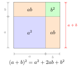

# 完全平方与平方差公式

> **一例速记**：  
> 完全平方：$(a \pm b)^2 = a^2 \pm 2ab + b^2$  
> 平方差：$(a+b)(a-b) = a^2 - b^2$  
> 看到"两项的平方" → 完全平方；看到"和乘以差" → 平方差。记住这两个条件反射，本章的题九成可以秒杀。

---

## 一、引入：一道展开题

> **题目**：化简 $(2x + 3y)^2 - (2x - 3y)(2x + 3y)$。

请先停下来，自己暴力展开试一试。

如果用整式乘法硬算，$(2x+3y)^2$ 要展开成四项（每项乘每项），$(2x-3y)(2x+3y)$ 同样要展开成四项，最后再合并……前后写下来大概 10 步，还容易算错符号。

**但如果你认出了公式，全程不超过 30 秒。**

让我们来还原一个"会做这道题的人"脑子里到底在想什么。

---

## 二、思维路径还原（解题者的内心独白）

> "$(2x+3y)^2$ —— 一眼看到两项**和的平方**，条件反射：**完全平方公式**。令 $a = 2x$，$b = 3y$，直接套：
>
> $(2x+3y)^2 = (2x)^2 + 2 \cdot 2x \cdot 3y + (3y)^2 = 4x^2 + 12xy + 9y^2$
>
> $(2x-3y)(2x+3y)$ —— 一个是 $2x+3y$ 的和，另一个是 $2x-3y$ 的差，两者相乘，条件反射：**平方差公式**。令 $a = 2x$，$b = 3y$：
>
> $(2x-3y)(2x+3y) = (2x)^2 - (3y)^2 = 4x^2 - 9y^2$
>
> 现在合并：原式 $= (4x^2 + 12xy + 9y^2) - (4x^2 - 9y^2)$
>
> 注意减号后面有括号，括号内每项变号：$= 4x^2 + 12xy + 9y^2 - 4x^2 + 9y^2$
>
> 合并同类项：$= 12xy + 18y^2$
>
> 整个过程没有展开四对，两步写完。关键在于**看到 $(\cdot)^2$ 立即想完全平方，看到 $(\cdot+\cdot)(\cdot-\cdot)$ 立即想平方差**——这不是技巧，是**条件反射**。"

把这段内心独白读两遍，感受每一步判断是怎么自然冒出来的。你会发现难点不在计算，在于**识别**：认出当前式子属于哪种公式的形态。

---

## 三、抽象成方法

### 完全平方公式

$$\boxed{(a+b)^2 = a^2 + 2ab + b^2}$$

$$\boxed{(a-b)^2 = a^2 - 2ab + b^2}$$

**三项结构**：首项平方 + 末项平方 ± 2 倍乘积。

- **首项**：第一个因子（如 $2x$）取平方 → $4x^2$  
- **末项**：第二个因子（如 $3y$）取平方 → $9y^2$  
- **中项**：$2 \times$ 首项 $\times$ 末项，符号与原式括号内的 $\pm$ **一致**

**如何推导（不是凭空背）**：用多项式乘法展开：

$$
(a+b)^2 = (a+b)(a+b) = a^2 + ab + ba + b^2 = a^2 + 2ab + b^2
$$

$$
(a-b)^2 = (a-b)(a-b) = a^2 - ab - ba + b^2 = a^2 - 2ab + b^2
$$

公式不是规定，是计算的**简写**。每次用公式前，都可以在脑中"想象"展开过程来验证。

### 平方差公式

$$\boxed{(a+b)(a-b) = a^2 - b^2}$$

**两项结构**：前项平方减去后项平方。

**口诀**："和乘以差，等于平方差。"

**推导**：

$$
(a+b)(a-b) = a^2 - ab + ab - b^2 = a^2 - b^2
$$

中间的 $-ab + ab = 0$，正是这两项的"自我消除"让公式如此简洁。

### 识别要点对比

| 形态 | 公式类型 | 判断条件 |
|------|----------|----------|
| $(\text{两项})^2$ | 完全平方 | 括号内两项，整体取平方 |
| $(\text{两项和})(\text{两项差})$ | 平方差 | 两个括号，括号内形式相同、符号相反 |

---

## 四、方法变形

### 变形 1：三项完全平方（扩展）

$$
(a + b + c)^2 = a^2 + b^2 + c^2 + 2ab + 2bc + 2ca
$$

把 $(a+b+c)$ 看成 $((a+b)+c)$，然后套完全平方：

$$
((a+b)+c)^2 = (a+b)^2 + 2(a+b)c + c^2 = a^2+2ab+b^2+2ac+2bc+c^2
$$

记忆规律：每个字母的平方各一项，每两个字母的乘积各一项再乘 2，共 $3 + 3 = 6$ 项。

### 变形 2：平方差逆用（为因式分解做铺垫）

$$a^2 - b^2 \to (a+b)(a-b)$$

看到两个完全平方数（或式）相减，立刻想把它写成"和×差"的形式。这是 **part2/07** 的核心内容，本章先记住这个方向。

### 变形 3：数字计算中的应用

当两个数相差不大、且乘积难算时，凑成"和差积"模式用平方差简化：

$$98 \times 102 = (100 - 2)(100 + 2) = 100^2 - 2^2 = 10000 - 4 = 9996$$

$$99^2 = (100 - 1)^2 = 10000 - 200 + 1 = 9801$$

**关键意识**：见到接近整十、整百的数，先想"能不能凑成 $a \pm b$ 的形式？"

---

## 五、思考路标（条件反射训练）

下面每一条都要读到"不用想，看到就知道该干什么"的程度：

1. **见 $(\text{两项})^2$** → 立刻写完全平方公式，三项展开（不要手动展开）。
2. **见 $(\text{两项和}) \cdot (\text{相同两项的差})$** → 立刻写平方差公式，两项相减（中间不过渡）。
3. **见展开结果有三项且中间项是两端项平方根乘积的 2 倍** → 这是完全平方展开式，可以逆向折叠成 $(\cdot \pm \cdot)^2$。
4. **见接近整十/整百的两数相乘** → 凑 $(n-k)(n+k) = n^2 - k^2$，用平方差简便计算。
5. **见 $a^2 + b^2$ 但无 $2ab$ 项，且题目给了 $a+b$ 或 $a-b$** → 用 $(a+b)^2 = a^2 + 2ab + b^2$ 变形求 $a^2+b^2$，即 $a^2+b^2 = (a+b)^2 - 2ab$。
6. **见两个括号都含 $a$ 和 $b$，一个 $+$ 一个 $-$** → 不要急着乘，先确认是不是平方差，如果是，直接写 $a^2-b^2$。
7. **展开完全平方时看到结果有四项** → 必定算错了（完全平方展开只有三项，$(-ab)$ 和 $ab$ 会合并）。

---

## 六、应用例题

**例 1**　用平方差公式简便计算 $99 \times 101$。

**【思路】** 见到 $99$ 和 $101$，注意到 $99 = 100 - 1$，$101 = 100 + 1$，这是 $(100-1)(100+1)$ 的形式，触发平方差公式。

$$
99 \times 101 = (100 - 1)(100 + 1) = 100^2 - 1^2 = 10000 - 1 = 9999
$$

**例 2**　已知 $a + b = 5$，$ab = 6$，求 $a^2 + b^2$。

**【思路】** 题目给了 $a+b$ 和 $ab$，要求 $a^2+b^2$。见到"$a^2+b^2$，已知 $a+b$，联系 $2ab$"，条件反射：用完全平方公式变形。

$$
(a+b)^2 = a^2 + 2ab + b^2
$$

所以：

$$
a^2 + b^2 = (a+b)^2 - 2ab = 5^2 - 2 \times 6 = 25 - 12 = 13
$$

**例 3**　化简 $(x + 2y)^2 - (x - 2y)^2$。

**【思路】** 看到两个完全平方相减，令 $u = x+2y$，$v = x-2y$，这就是 $u^2 - v^2$，触发平方差公式。

$$
(x+2y)^2 - (x-2y)^2 = \bigl[(x+2y) + (x-2y)\bigr]\bigl[(x+2y) - (x-2y)\bigr]
$$

$$
= (2x)(4y) = 8xy
$$

**验证思路**：也可以分别展开再相减：

$$
(x+2y)^2 = x^2 + 4xy + 4y^2, \quad (x-2y)^2 = x^2 - 4xy + 4y^2
$$

$$
\text{差} = (x^2+4xy+4y^2) - (x^2-4xy+4y^2) = 8xy \quad \checkmark
$$

用平方差公式的方式更快——这是"把完全平方当成一个整体，再用平方差"的复合运用。

---

## 七、思路自测题

做题之前，先在脑中过一遍第五节的路标，再动笔。

**自测 1**　用完全平方公式展开：$(3a - 2b)^2$。

> 💡 提示：令 $x = 3a$，$y = 2b$，套 $(x-y)^2 = x^2 - 2xy + y^2$。注意 $2 \times 3a \times 2b = 12ab$，中项带负号。

**自测 2**　用平方差公式计算 $103 \times 97$。

> 💡 提示：$103 = 100 + 3$，$97 = 100 - 3$，套 $(a+b)(a-b) = a^2 - b^2$，$a = 100$，$b = 3$。

**自测 3**　化简：$(2m + n)^2 + (2m - n)^2$。

> 💡 提示：分别展开两个完全平方，再相加，合并同类项。注意中项一正一负，会消掉。

**自测 4**　已知 $x - y = 3$，$xy = 4$，求 $x^2 + y^2$。

> 💡 提示：用 $(x-y)^2 = x^2 - 2xy + y^2$，变形得 $x^2+y^2 = (x-y)^2 + 2xy$。代入数值计算。

---

**回头看一眼"一例速记"**：

> 完全平方：$(a \pm b)^2 = a^2 \pm 2ab + b^2$  
> 平方差：$(a+b)(a-b) = a^2 - b^2$  
> 见 $(\cdot)^2$ → 完全平方；见 $(\cdot+\cdot)(\cdot-\cdot)$ → 平方差。

如果现在你能在三秒内写出两个公式、并且能说出每个公式的"触发条件"——那本章，你拿下了。
