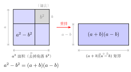

# 完全平方与平方差公式的逆用与变形

> **一例速记**：  
> $a^2 - b^2$ 立刻看作 $(a+b)(a-b)$ —— 把"展开式"逆向**还原**成"乘积式"；  
> $a^2 \pm 2ab + b^2$ 立刻折叠成 $(a \pm b)^2$。  
> 这是因式分解的"小种子"，也是中考填空题的"加速器"。  
> **上一章是正向展开，本章是逆向折叠**——方向相反，本质是同一件事的两面。

---

## 一、引入：一道"逆向"题

> **题目**：已知 $x^2 - y^2 = 12$，$x - y = 2$，求 $x + y$。

请先停下来，试着自己解解看。

直接联立两个方程解 $x$ 和 $y$？从 $x - y = 2$ 得 $x = y + 2$，代入 $x^2 - y^2 = 12$，会得到 $(y+2)^2 - y^2 = 12$，展开后是 $4y + 4 = 12$，所以 $y = 2$，$x = 4$，最后 $x + y = 6$。

这能做，但算了六七步。

**如果你认出了公式，三行搞定。**

---

## 二、思维路径还原（解题者的内心独白）

> "$x^2 - y^2 = 12$——看到两个平方相减，条件反射：这是**平方差**的展开式。  
>
> 平方差公式正向是 $(x+y)(x-y) = x^2 - y^2$，**逆用就是** $x^2 - y^2 = (x+y)(x-y)$。  
>
> 所以 $x^2 - y^2 = 12$ 可以改写成 $(x+y)(x-y) = 12$。  
>
> 题目给了 $x - y = 2$，正好是乘积里的一个因子——**整体代入**：$(x+y) \cdot 2 = 12$，立得 $x + y = 6$。  
>
> 关键步骤只有两步：逆用平方差 + 整体代入。  
>
> 推广：类似地，$a^2 + 2ab + b^2 = (a+b)^2$，$a^2 - 2ab + b^2 = (a-b)^2$，也是展开式的逆向折叠。  
>
> 见到 $a^2 \pm 2ab + b^2$ 时，不要去计算，直接在心里说'完全平方，折叠'，立刻写 $(a \pm b)^2$。  
>
> 这是中考填空、选择题最常出的'快速变形'——一眼看穿，一步写出。"

读完这段内心独白，你会发现本章的核心只有一件事：**把正向公式翻转过来用**。正向是展开，逆向是折叠（因式分解）。知道展开，就知道折叠；知道折叠，就能把复杂式子变简单。

---

## 三、抽象成方法

### 逆用三类公式

**类型 1：平方差逆用**

$$\boxed{a^2 - b^2 = (a+b)(a-b)}$$

识别条件：**两个完全平方式相减**。只要看到"某式的平方减去另一式的平方"，立刻拆成"（和）×（差）"。

**类型 2：完全平方和逆用**

$$\boxed{a^2 + 2ab + b^2 = (a+b)^2}$$

识别条件：**三项**，首末两项是完全平方，中间项恰好是两端项的 $2$ 倍乘积，且符号为正。

**类型 3：完全平方差逆用**

$$\boxed{a^2 - 2ab + b^2 = (a-b)^2}$$

识别条件：同上，但中间项为负。

**识别口诀**：
- 两项且一减一 → 先试平方差；
- 三项且两端平方、中间是 $2$ 倍乘积 → 完全平方折叠。

### 配方法（凑完全平方）

有时候式子本身**不是**完全平方，但可以通过加减同一个量，把它"凑"成完全平方。

**基本恒等式**（配方的来源）：

$$
a^2 + b^2 = (a+b)^2 - 2ab = (a-b)^2 + 2ab
$$

**用途**：已知 $a+b$ 和 $ab$，求 $a^2+b^2$；或已知 $a-b$ 和 $ab$，求 $a^2+b^2$。

---

## 四、方法变形（重要！）

### 变形 1：已知"和与积"，求"平方和"

**题型**：已知 $x + y = s$，$xy = p$，求 $x^2 + y^2$。

**方法**：

$$
x^2 + y^2 = (x+y)^2 - 2xy = s^2 - 2p
$$

代入数字即可，一步出结果。不需要解出 $x$ 和 $y$。

**例**：$x + y = 3$，$xy = 1$，则 $x^2 + y^2 = 9 - 2 = 7$。

### 变形 2：已知"和与积"，求"差的绝对值"

**题型**：已知 $x+y = s$，$xy = p$，求 $|x-y|$。

**方法**：

$$
(x-y)^2 = (x+y)^2 - 4xy = s^2 - 4p
$$

$$
|x - y| = \sqrt{s^2 - 4p}
$$

（要求 $s^2 \geq 4p$，即两数为实数时必须满足的条件。）

### 变形 3：已知"倒数和"，求"平方倒数和"

**题型**：已知 $x + \dfrac{1}{x} = k$，求 $x^2 + \dfrac{1}{x^2}$。

**方法**：对已知条件两边**平方**，利用完全平方公式：

$$
\left(x + \frac{1}{x}\right)^2 = x^2 + 2 \cdot x \cdot \frac{1}{x} + \frac{1}{x^2} = x^2 + 2 + \frac{1}{x^2}
$$

所以：

$$
x^2 + \frac{1}{x^2} = \left(x + \frac{1}{x}\right)^2 - 2 = k^2 - 2
$$

**例**：$x + \dfrac{1}{x} = 3$，则 $x^2 + \dfrac{1}{x^2} = 9 - 2 = 7$。

### 变形 4：逐步升次（平方后再平方）

**题型**：已知 $x + \dfrac{1}{x} = k$，求 $x^4 + \dfrac{1}{x^4}$。

**方法**：先求 $x^2 + \dfrac{1}{x^2} = k^2 - 2$，再平方：

$$
x^4 + \frac{1}{x^4} = \left(x^2 + \frac{1}{x^2}\right)^2 - 2 = (k^2-2)^2 - 2
$$

---

## 五、思考路标（条件反射训练）

下面每一条，读到"看到就秒反应"的程度：

1. **见 $a^2 - b^2$**（两个平方式相减）→ 立刻写 $(a+b)(a-b)$，不要展开，直接折叠。
2. **见 $a^2 + b^2$，且题目给了 $a+b$ 和 $ab$** → 用 $(a+b)^2 - 2ab$ 求之，一步出结论。
3. **见 $a^2 + b^2$，且题目给了 $a-b$ 和 $ab$** → 用 $(a-b)^2 + 2ab$ 求之。
4. **见 $(a-b)^2$，要求 $a^2+b^2$** → $(a-b)^2 = a^2-2ab+b^2$，变形得 $a^2+b^2 = (a-b)^2+2ab$。
5. **见 $x + \dfrac{1}{x}$，问 $x^2 + \dfrac{1}{x^2}$** → 对 $x+\dfrac{1}{x}$ **两边平方**，再减去 $2$。
6. **见 $a^2 - b^2 = k$ 且另给 $a-b$（或 $a+b$）** → 逆用平方差 $(a+b)(a-b) = k$，整体代入求另一个。
7. **见 $a^4 - b^4$（两个四次方相减）** → 先平方差一次得 $(a^2+b^2)(a^2-b^2)$，再对 $a^2-b^2$ 再用一次平方差，层层因式分解。

---

## 六、应用例题

**例 1**　化简 $(x+y)^2 - (x-y)^2$。

**【思路】** 看到两个平方式相减，令 $u = x+y$，$v = x-y$，这是 $u^2 - v^2$，触发平方差逆用：

$$
(x+y)^2 - (x-y)^2 = \bigl[(x+y)+(x-y)\bigr]\bigl[(x+y)-(x-y)\bigr]
$$

$$
= (2x)(2y) = 4xy
$$

**结论**：$(x+y)^2 - (x-y)^2 = 4xy$。这是一个常用结论，记住它。

---

**例 2**　已知 $x + y = 3$，$xy = 1$，求 $x^2 + y^2$，$|x-y|$，$x^3 + y^3$。

**【思路】**

**(i) 求 $x^2+y^2$**：用"和与积"公式：

$$
x^2 + y^2 = (x+y)^2 - 2xy = 9 - 2 = 7
$$

**(ii) 求 $|x-y|$**：

$$
(x-y)^2 = (x+y)^2 - 4xy = 9 - 4 = 5
$$

$$
|x-y| = \sqrt{5}
$$

**(iii) 求 $x^3+y^3$**：用立方和公式（此时可预先展开）：

$$
x^3 + y^3 = (x+y)(x^2 - xy + y^2) = (x+y)\bigl[(x^2+y^2) - xy\bigr] = 3 \times (7-1) = 18
$$

**说明**：三问都用了"已知 $x+y, xy$，整体代入"的方法，根本没有解出 $x$ 和 $y$ 各是多少。这正是整体代入的威力。

---

**例 3**　因式分解 $a^4 - 16$。

**【思路】** 看到 $a^4 - 16 = (a^2)^2 - 4^2$，两个平方相减，触发平方差逆用：

$$
a^4 - 16 = (a^2 + 4)(a^2 - 4)
$$

$a^2 - 4$ 仍是两个平方相减（$a^2 - 2^2$），继续用平方差：

$$
a^2 - 4 = (a+2)(a-2)
$$

$a^2 + 4$ 不能再分（实数范围内，两个平方相加不等于零，不能因式分解）。

所以：

$$
a^4 - 16 = (a^2+4)(a+2)(a-2)
$$

**规律**：遇到 $a^{2n} - b^{2n}$ 型，先用一次平方差，再对可分解的部分继续用，直到所有因子不可分解为止。

---

## 七、思路自测题

做之前，先默念第五节路标一遍。

**自测 1**　化简：$(2a+b)^2 - (2a-b)^2$。

> 💡 提示：令 $u = 2a+b$，$v = 2a-b$，这是 $u^2-v^2$，用平方差逆用。$u+v = 4a$，$u-v = 2b$，结果为 $8ab$。

**自测 2**　已知 $x - y = 4$，$xy = 3$，求 $x^2 + y^2$。

> 💡 提示：$x^2+y^2 = (x-y)^2 + 2xy$。代入 $(x-y)^2 = 16$，$2xy = 6$，求和。

**自测 3**　已知 $x + \dfrac{1}{x} = 4$，求 $x^2 + \dfrac{1}{x^2}$ 和 $x^4 + \dfrac{1}{x^4}$。

> 💡 提示：$x^2+\dfrac{1}{x^2} = \left(x+\dfrac{1}{x}\right)^2 - 2 = 16-2 = 14$；再对 $14$ 平方减 $2$ 得 $x^4+\dfrac{1}{x^4}$。

**自测 4**　因式分解 $4m^4 - n^4$。

> 💡 提示：$4m^4 = (2m^2)^2$，$n^4 = (n^2)^2$，先用一次平方差，再对 $2m^2-n^2$ 看能否继续（这里 $2m^2-n^2 = (\sqrt{2}m+n)(\sqrt{2}m-n)$，若只在整式范围内，分解到 $(2m^2+n^2)(2m^2-n^2)$ 即可，再视情况展开 $2m^2-n^2$）。

**自测 5**　已知 $x^2 - y^2 = 20$，$x + y = 5$，求 $x - y$。

> 💡 提示：平方差逆用 $x^2-y^2 = (x+y)(x-y)$，代入 $x+y=5$，直接求 $x-y$。

---

**回头看一眼"一例速记"**：

> $a^2 - b^2$ → $(a+b)(a-b)$；$a^2 \pm 2ab + b^2$ → $(a \pm b)^2$。  
> 见两平方相减 → 平方差逆用；见三项且中间是 $2$ 倍乘积 → 完全平方折叠。

如果现在你能在看到 $a^4-16$ 时立刻想到"两次平方差"，在看到"$x+y, xy$"时立刻想到"$(x+y)^2 - 2xy$"——那本章，你拿下了。
