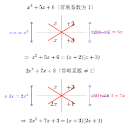

# 十字相乘法

> **一例速记**：  
> $x^2 + 5x + 6 = (x+2)(x+3)$  
> 看十字：$\begin{array}{cc} x & +2 \\ x & +3 \end{array}$ → 交叉积之和 $x \cdot 3 + x \cdot 2 = 3x + 2x = 5x$ ✓ → 分解完成  
> 见 $x^2 + bx + c$，立刻问：**"哪两个数，积是 $c$、和是 $b$？"** 答出来就分解完毕。

---

## 一、引入：一道二次三项式题

**题目**：因式分解 $x^2 + 7x + 12$。

这是一个**二次三项式**——最高次是 $2$，有三项。

你可能会问：这不像平方差（只有两项），也不像完全平方（需要严格的首末是平方、中间是 2 倍积）。那它能分解吗？怎么分解？

如果硬试，你可能会猜 $(x + a)(x + b) = x^2 + (a+b)x + ab$，然后一个个代数字尝试……这样做可以，但慢，而且容易乱。

**十字相乘法**给了你一套有条不紊的搜索策略，把"盲目猜试"变成**系统筛选**，5 秒内找到答案。

让我们先看一个"会做这道题的人"脑子里到底在想什么。

---

## 二、思维路径还原（解题者的内心独白）

> "$x^2 + 7x + 12$ —— 三项，最高次是 $2$，首项系数是 $1$，这是**标准型 $x^2 + bx + c$**。
>
> 如果能分解，设结果是 $(x + p)(x + q)$，展开：
>
> $(x+p)(x+q) = x^2 + (p+q)x + pq$
>
> 比较系数：$p + q = 7$，$pq = 12$。
>
> 任务变成：**找两个整数 $p, q$，使积是 $12$、和是 $7$**。
>
> 列出 $12$ 的所有正整数因数对：$(1, 12)$，$(2, 6)$，$(3, 4)$……
>
> 逐一检验和：$1 + 12 = 13$（不对），$2 + 6 = 8$（不对），$3 + 4 = 7$ ✓ 命中！
>
> 所以 $p = 3$，$q = 4$，答案是 $(x+3)(x+4)$。
>
> 关键反射：见到 $x^2 + bx + c$，立刻不想别的，只问：**'积等于 $c$、和等于 $b$'的两个数是谁？**
>
> 找到了，直接写结果；找不到，说明这个多项式在整数范围内不可分解。
>
> 整个过程不超过 10 秒——慢的不是方法，是对因数对的熟悉程度。"

把这段内心独白读两遍。你会发现关键不在"公式"，在于**把"因式分解"问题转化成"找两个数"问题**——这是十字相乘法的核心思想。

---

## 三、抽象成方法

### $x^2 + bx + c$ 型（首项系数为 $1$）

**方法**：找两个数 $p, q$，使

$$p \cdot q = c \qquad \text{且} \qquad p + q = b$$

则

$$x^2 + bx + c = (x + p)(x + q)$$

**十字图示**（直观展示交叉相乘求中间项）：

$$\begin{array}{cc} x & p \\ x & q \end{array} \quad \xrightarrow{\text{交叉相乘后相加}} \quad xq + xp = (p+q)x = bx$$

左列两个 $x$ 相乘得首项 $x^2$，右列 $p \cdot q$ 得常数项 $c$，交叉相乘之和 $xq + xp$ 得中间项 $bx$。三个条件全部由一张"十字"覆盖——这就是"**十字相乘**"名字的来源。

---

### $ax^2 + bx + c$ 型（首项系数 $a \neq 1$）

当 $a \neq 1$ 时，设分解结果为 $(a_1 x + c_1)(a_2 x + c_2)$，展开：

$$(a_1 x + c_1)(a_2 x + c_2) = a_1 a_2 \, x^2 + (a_1 c_2 + a_2 c_1)x + c_1 c_2$$

需要同时满足：

$$a_1 a_2 = a, \quad c_1 c_2 = c, \quad a_1 c_2 + a_2 c_1 = b$$

**搜索策略**：

1. 将 $a$ 拆成两个整数之积的所有方案（$a = a_1 \times a_2$）
2. 将 $c$ 拆成两个整数之积的所有方案（$c = c_1 \times c_2$）
3. 逐一检验 $a_1 c_2 + a_2 c_1$ 是否等于 $b$

**十字图示**：

$$\begin{array}{cc} a_1 x & c_1 \\ a_2 x & c_2 \end{array} \quad \xrightarrow{\text{交叉相乘后相加}} \quad a_1 x \cdot c_2 + a_2 x \cdot c_1 = (a_1 c_2 + a_2 c_1)x$$

**示例**：$2x^2 + 5x + 3$

- $a = 2$：拆法只有 $1 \times 2$
- $c = 3$：拆法有 $1 \times 3$ 或 $3 \times 1$

检验 $a_1 c_2 + a_2 c_1$：

| $a_1$ | $a_2$ | $c_1$ | $c_2$ | $a_1 c_2 + a_2 c_1$ |
|-------|-------|-------|-------|----------------------|
| $1$   | $2$   | $1$   | $3$   | $1 \cdot 3 + 2 \cdot 1 = 5$ ✓ |

$\Rightarrow 2x^2 + 5x + 3 = (x + 1)(2x + 3)$

---

## 四、方法变形

### 变形 1：$c < 0$（常数项为负）

常数项为负，说明 $p, q$ **一正一负**（因为两数之积为负）。

**示例**：$x^2 - x - 6$

找 $p, q$：$pq = -6$，$p + q = -1$。

因为 $pq < 0$，两数异号；因为 $p + q = -1 < 0$，绝对值较大的那个为负。

枚举 $6$ 的因数对（含正负搭配）：$(2, -3)$ → 积 $-6$ ✓，和 $-1$ ✓

$$x^2 - x - 6 = (x + 2)(x - 3)$$

---

### 变形 2：$b < 0, c > 0$（中间项为负，常数项为正）

常数项为正说明两数**同号**；中间项为负说明两数之和为负，所以两数都是**负数**。

**示例**：$x^2 - 5x + 6$

找 $p, q$：$pq = 6$，$p + q = -5$，两数同负。

负因数对：$(-2, -3)$ → 积 $6$ ✓，和 $-5$ ✓

$$x^2 - 5x + 6 = (x - 2)(x - 3)$$

---

### 变形 3：含两个字母（把一个字母当系数）

**示例**：$x^2 + 3xy + 2y^2$

把 $y$ 看成"常数"，按 $x$ 排列：$x^2 + 3y \cdot x + 2y^2$，这是 $x^2 + bx + c$ 型，其中 $b = 3y$，$c = 2y^2$。

找 $p, q$：$pq = 2y^2$，$p + q = 3y$。

试 $p = y$，$q = 2y$：$pq = 2y^2$ ✓，$p + q = 3y$ ✓

$$x^2 + 3xy + 2y^2 = (x + y)(x + 2y)$$

---

### 变形 4：先提公因式，再十字相乘

**示例**：$2x^2 + 10x + 12$

- 先提公因式：$\gcd(2, 10, 12) = 2$

$$2x^2 + 10x + 12 = 2(x^2 + 5x + 6)$$

- 再对括号内用十字相乘：找 $pq = 6$，$p + q = 5$ → $p = 2$，$q = 3$

$$= 2(x+2)(x+3)$$

**原则永远是**：**先提公因式，再十字相乘**。

---

## 五、思考路标（条件反射训练）

以下每一条都要读到"不用想，看到就知道下一步"的程度：

1. **见三项二次式 $x^2 + bx + c$**（首项系数为 $1$）→ 立刻找"积是 $c$、和是 $b$"的两个整数，找到就写 $(x+p)(x+q)$。

2. **见三项二次式 $ax^2 + bx + c$**（$a \neq 1$）→ 拆 $a$ 和 $c$，画十字图，枚举 $a_1 c_2 + a_2 c_1 = b$ 的组合。

3. **$c > 0, b > 0$** → 两个数都是**正数**（同正，和为正，积为正）。

4. **$c > 0, b < 0$** → 两个数都是**负数**（同负，和为负，积为正）。

5. **$c < 0$** → 两个数**一正一负**（积为负）；再看 $b$ 的正负决定哪个绝对值大。

6. **枚举完所有因数对都找不到** → 说明此多项式在**整数范围内不可分解**（可能需要配方法或求根公式确认）。

7. **含字母系数（如 $x^2 + 3xy + 2y^2$）** → 把其中一个字母当"常数"，对另一个字母用十字相乘。

8. **任何情况开始前** → 先看有无公因式，有则先提，再对括号内的式子用十字相乘。

---

## 六、应用例题

**例 1**　因式分解 $x^2 - 8x + 15$。

**【思路】** 三项，首项系数为 $1$，标准型。$b = -8$，$c = 15$。$c > 0, b < 0$ → 两数同负。

找 $p, q$：$pq = 15$，$p + q = -8$，两数同负。

负因数对：$(-3, -5)$ → 积 $15$ ✓，和 $-8$ ✓

$$x^2 - 8x + 15 = (x-3)(x-5)$$

验证：$(x-3)(x-5) = x^2 - 5x - 3x + 15 = x^2 - 8x + 15$ ✓

---

**例 2**　因式分解 $2x^2 + 7x + 3$。

**【思路】** 三项，首项系数 $a = 2 \neq 1$，需拆系数。$a = 2 = 1 \times 2$，$c = 3 = 1 \times 3$。

画十字，枚举 $a_1 c_2 + a_2 c_1$：

| $a_1$ | $a_2$ | $c_1$ | $c_2$ | 交叉和 |
|-------|-------|-------|-------|--------|
| $1$   | $2$   | $1$   | $3$   | $1 \cdot 3 + 2 \cdot 1 = 5 \neq 7$ |
| $1$   | $2$   | $3$   | $1$   | $1 \cdot 1 + 2 \cdot 3 = 7$ ✓ |

$a_1 = 1, a_2 = 2, c_1 = 3, c_2 = 1$：

$$2x^2 + 7x + 3 = (1 \cdot x + 3)(2 \cdot x + 1) = (x+3)(2x+1)$$

验证：$(x+3)(2x+1) = 2x^2 + x + 6x + 3 = 2x^2 + 7x + 3$ ✓

---

**例 3**　因式分解 $3x^2 + 2x - 1$。

**【思路】** $a = 3$，$b = 2$，$c = -1$。$c < 0$ → $c_1, c_2$ 一正一负。$a = 3 = 1 \times 3$，$c = -1 = 1 \times (-1)$ 或 $(-1) \times 1$。

枚举：

| $a_1$ | $a_2$ | $c_1$ | $c_2$ | 交叉和 |
|-------|-------|-------|-------|--------|
| $1$   | $3$   | $1$   | $-1$  | $1 \cdot (-1) + 3 \cdot 1 = 2$ ✓ |

$\Rightarrow 3x^2 + 2x - 1 = (x + 1)(3x - 1)$

验证：$(x+1)(3x-1) = 3x^2 - x + 3x - 1 = 3x^2 + 2x - 1$ ✓

---

## 七、思路自测题

做题前，先判断 $c$ 的符号，确定两数同号还是异号；再看 $b$ 的符号，缩小搜索范围。

**自测 1**　因式分解 $x^2 + 8x + 15$。

> 💡 提示：$c = 15 > 0$，$b = 8 > 0$ → 两数同正。枚举 $15$ 的正因数对：$(1, 15)$、$(3, 5)$，哪对和为 $8$？

**自测 2**　因式分解 $x^2 - 3x - 10$。

> 💡 提示：$c = -10 < 0$ → 两数一正一负。$b = -3$ → 绝对值大的为负。枚举 $10$ 的因数对配正负：$(-5, +2)$，检验积与和。

**自测 3**　因式分解 $2x^2 - 5x + 2$。

> 💡 提示：$a = 2$，$c = 2$，$b = -5 < 0$，$c > 0$ → $c_1, c_2$ 同负（或同正后看符号）。拆 $a = 1 \times 2$，$c = (-1) \times (-2)$，检验交叉和。

**自测 4**　因式分解 $x^2 + 2xy - 3y^2$。

> 💡 提示：把 $y$ 看作常数，$c = -3y^2 < 0$ → 两项（含 $y$）一正一负。找积 $-3y^2$、和 $2y$ 的两项：$3y$ 与 $-y$，验证后写结果。

**自测 5**　因式分解 $6x^2 + 5x - 6$。

> 💡 提示：$a = 6$（可拆成 $1 \times 6$ 或 $2 \times 3$），$c = -6$（有多种拆法），$c < 0$ → $c_1, c_2$ 异号。需逐一枚举组合，检验交叉和是否等于 $5$。这道题考验枚举耐心——正是十字相乘的真实挑战。

---

**回头看一眼"一例速记"**：

> $x^2 + 5x + 6 = (x+2)(x+3)$  
> 找积 $6$、和 $5$ 的两整数 → $2, 3$→ 写 $(x+2)(x+3)$  
> **$c > 0, b > 0$ → 同正；$c > 0, b < 0$ → 同负；$c < 0$ → 异号。**

如果现在你能在不看笔记的情况下，说出 $x^2 + bx + c$ 和 $ax^2 + bx + c$ 两种类型的搜索策略，并做完五道自测——那十字相乘法，你拿下了。
