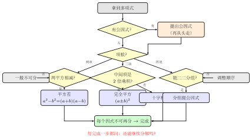

# 综合因式分解思路

> **一例速记**：  
> 因式分解"三步走"决策树：  
> ① 先看**公因式**（提出来）→  
> ② 看括号内**项数**：两项试平方差，三项试完全平方或十字相乘，四项试分组 →  
> ③ 每分解一步，**问一句"还能继续吗？"直到不能为止**。  
> 顺序不能颠倒，"提公因式"永远第一步。

---

## 一、引入：一道综合分解题

> **题目**：因式分解 $2a^3 - 8a$。

请先停下来，试着自己做做看。

如果你直接上手，可能想到：$-8a$ 让人联想到什么？还是说先从 $2a^3$ 着手？不确定从哪里下刀，容易漏掉步骤，或者做到一半停住。

**有了决策树，30 秒内可以做完，而且不会漏步骤。**

---

## 二、思维路径还原（解题者的内心独白）

> "$2a^3 - 8a$——来了，先走决策树第一步。  
>
> **第一步：能提公因式吗？**  
> 看系数：$2$ 和 $8$，最大公因数 $= 2$。  
> 看字母：$a^3$ 和 $a$，最低次幂 $= a^1$。  
> 公因式 $= 2a$。提出来：  
>
> $$2a^3 - 8a = 2a(a^2 - 4)$$
>
> **第二步：括号内能继续吗？** 括号内是 $a^2 - 4$，两项，看项数。  
> 两项 → 试平方差：$a^2 = a^2$，$4 = 2^2$，两个完全平方相减 ✓  
> 平方差公式逆用：$a^2 - 4 = (a+2)(a-2)$。  
>
> **第三步：检查每个因式，还能继续吗？**  
> - $2a$：已经是单项式，不可再分 ✓  
> - $(a+2)$：一次式，不可再分 ✓  
> - $(a-2)$：一次式，不可再分 ✓  
>
> 所有因式都"不能再分"，完成！  
>
> $$2a^3 - 8a = 2a(a+2)(a-2)$$
>
> 关键反射：**每分解一步，都要问一次'还能继续吗？'** 不问这句话，就容易停在 $2a(a^2-4)$ 没有完成分解。"

读完这段内心独白，你会发现全程只做了三件事：提公因式 → 用平方差 → 检查到底。三步有序，不慌乱，不遗漏。

---

## 三、抽象成方法——因式分解决策树

拿到任何需要因式分解的多项式，按以下决策树依次走：

```
拿到多项式
     │
     ▼
① 有无公因式？
     │
     ├── 有 → 提出公因式，再对括号内的式子从①重新走
     │
     └── 无（或已提出）→ 看括号内的项数
                │
                ├── 两项
                │     ├── 两个完全平方相减 → 平方差：a² - b² = (a+b)(a-b)
                │     └── 两个完全平方相加 → 整数范围内一般不可分解
                │
                ├── 三项
                │     ├── 首末是完全平方 + 中间是2倍乘积 → 完全平方公式
                │     └── 一般二次三项式 → 十字相乘法
                │
                └── 四项及以上
                      ├── 两两分组（前两后两提公因式）
                      └── 三一分组（三项凑平方差 + 一项）
     │
     ▼
② 对每个因式，重复①——问"还能继续吗？"
     │
     ▼
③ 所有因式"不能再分"→ 完成
```

**"分解到底"原则**：因式分解的结果，要求每个因式在**整数（有理数）范围内不能继续分解**。如果某个因式还能用平方差、公式、十字相乘或分组再分，就必须继续，直到所有因式都是"原子"为止。



---

## 四、方法变形（决策树之外的补充技巧）

### 变形 1：多次使用决策树（逐层分解）

有些多项式需要多次走决策树才能彻底分解完毕。

**例**：$a^4 - 16$

- 两项，$a^4 = (a^2)^2$，$16 = 4^2$，平方差一次：

$$a^4 - 16 = (a^2 + 4)(a^2 - 4)$$

- 检查 $(a^2 + 4)$：两个平方相加，整数范围内不可分解 ✓
- 检查 $(a^2 - 4)$：$a^2 - 2^2$，还是平方差！继续：

$$a^2 - 4 = (a + 2)(a - 2)$$

- 最终结果：

$$\boxed{a^4 - 16 = (a^2 + 4)(a+2)(a-2)}$$

**规律**：见到 $a^{2n} - b^{2n}$ 型，连续使用平方差，直到所有因子不能再分为止。

### 变形 2：添项拆项（高级技巧）

对于形如 $x^4 + 4$ 这类"两个平方相加"的式子（整数范围内通常不可分解），有时可以用**添项拆项**制造平方差：

$$
x^4 + 4 = x^4 + 4x^2 + 4 - 4x^2 = (x^2 + 2)^2 - (2x)^2
$$

这样就变成了平方差：

$$
= (x^2 + 2 + 2x)(x^2 + 2 - 2x)
$$

**注意**：此技巧在初中中考中属于拓展内容，正式解题时优先用标准决策树。

### 变形 3：换元法（处理高次式）

当多项式的次数较高，但结构上有规律时，可以**换元**降次后用决策树。

**例**：$x^4 - 5x^2 + 4$

令 $y = x^2$，原式变成 $y^2 - 5y + 4$（标准二次三项式）：

十字相乘：找两数积 $= 4$，和 $= -5$，即 $-1$ 和 $-4$：

$$y^2 - 5y + 4 = (y - 1)(y - 4)$$

换回 $y = x^2$：

$$= (x^2 - 1)(x^2 - 4)$$

检查：$x^2 - 1 = (x+1)(x-1)$，$x^2 - 4 = (x+2)(x-2)$，继续分解：

$$\boxed{x^4 - 5x^2 + 4 = (x+1)(x-1)(x+2)(x-2)}$$

---

## 五、思考路标（条件反射训练）

下面每一条，读到"看到就秒反应"的程度：

1. **拿到任何多项式，第一反应是公因式** → 系数找 GCD，字母取最低次幂，先提再说，绝不跳过。

2. **提完公因式，立刻看括号内项数** → 两项走平方差路线，三项走完全平方或十字相乘路线，四项走分组路线，不要混淆。

3. **两项且相减，立刻问"都是完全平方吗？"** → $a^2 - b^2 = (a+b)(a-b)$；若两项相加（$a^2 + b^2$），整数范围内一般无法分解，不要强行拆。

4. **三项且首末是完全平方，立刻检查中间项** → 若中间项 $= 2\sqrt{\text{首项}} \cdot \sqrt{\text{末项}}$，是完全平方公式；否则用十字相乘。

5. **四项，立刻尝试二二分组** → 前两后两各提公因式，看括号是否相同；若不相同，重新排列项的顺序或改用三一分组。

6. **每完成一次分解步骤，必须问"还能继续吗？"** → 这一问是防止半途而废的关键。不问这句话，就会停在 $2a(a^2-4)$ 这样"分了一半"的地方。

7. **系数有公因数时，公因式优先** → 如 $6x^2 - 24 = 6(x^2-4) = 6(x+2)(x-2)$；忘记提公因式会让后续计算复杂很多倍。

8. **见到 $a^2 + b^2$ 型（两个完全平方相加）** → 整数（有理数）范围内一般不可分解，不要与 $a^2 - b^2$ 混淆；如果题目有特殊结构（如添项）才可能分解。

---

## 六、应用例题

### 例 1：决策树第一步 + 平方差

因式分解 $3x^2 - 12$。

**【思路】**：启动决策树。

**第一步**：公因式？系数 GCD $(3, 12) = 3$，无字母公因式。提出 $3$：

$$3x^2 - 12 = 3(x^2 - 4)$$

**第二步**：括号内 $x^2 - 4$ 是两项，$x^2 = x^2$，$4 = 2^2$，平方差：

$$x^2 - 4 = (x + 2)(x - 2)$$

**第三步**：$3$、$(x+2)$、$(x-2)$ 均不可继续分解 ✓

$$\boxed{3x^2 - 12 = 3(x+2)(x-2)}$$

---

### 例 2：换元法 + 十字相乘 + 多次平方差

因式分解 $x^4 - 5x^2 + 4$。

**【思路】**：无公因式。三项，次数较高，令 $y = x^2$ 换元。

换元后：$y^2 - 5y + 4$，标准二次三项式，用十字相乘：

找两数：积 $= 4$，和 $= -5$，试 $(-1) \times (-4) = 4$，$(-1) + (-4) = -5$ ✓

$$y^2 - 5y + 4 = (y - 1)(y - 4)$$

换回 $y = x^2$：

$$(x^2 - 1)(x^2 - 4)$$

**检查每个因式**：
- $x^2 - 1 = (x+1)(x-1)$（平方差）
- $x^2 - 4 = (x+2)(x-2)$（平方差）

最终：

$$\boxed{x^4 - 5x^2 + 4 = (x+1)(x-1)(x+2)(x-2)}$$

---

### 例 3：分组分解（调整顺序 + 继续分解）

因式分解 $a^3 - a + 2a^2 - 2$。

**【思路】**：先整理项的排列（按次数从高到低）：$a^3 + 2a^2 - a - 2$。

**第一步**：无整体公因式。四项，尝试二二分组：

$$= (a^3 + 2a^2) + (-a - 2)$$

$$= a^2(a + 2) + (-1)(a + 2)$$

$$= a^2(a + 2) - (a + 2)$$

$$= (a + 2)(a^2 - 1)$$

**第二步**：检查每个因式：
- $(a + 2)$：一次式，不可再分 ✓
- $(a^2 - 1)$：$a^2 - 1^2$，平方差！

$$a^2 - 1 = (a + 1)(a - 1)$$

最终：

$$\boxed{a^3 - a + 2a^2 - 2 = (a+2)(a+1)(a-1)}$$

**关键**：排列顺序 → 分组 → 合并 → 继续检查，每一步都按决策树走。

---

## 七、思路自测题

做题前，先在心里默念一遍决策树：提公因式 → 看项数 → 两项试平方差，三项试完全平方或十字，四项试分组 → 每步问"还能继续吗？"

**自测 1**　因式分解 $2x^3 - 18x$。

> 提示：先提公因式 $2x$，括号内 $x^2 - 9$ 是平方差，继续分解。

**自测 2**　因式分解 $x^4 - 1$。

> 提示：$x^4 - 1 = (x^2)^2 - 1^2$，先平方差一次；检查两个因子是否还能分解。

**自测 3**　因式分解 $x^4 - 13x^2 + 36$。

> 提示：令 $y = x^2$，换元后十字相乘，再换回，最后对每个因子检查。

**自测 4**　因式分解 $3a^2 - 3b^2 + 6a + 6b$。

> 提示：先提公因式 $3$；括号内四项，分组或提 $(a+b)$ 为公因式；合并后是否还有平方差？

**自测 5**　因式分解 $a^2 b - ab^2 - a + b$。

> 提示：提公因式 $ab$ 出来一部分？不行的话，四项重新排列，分组：$(a^2b - a) + (-ab^2 + b) = a(ab-1) - b(ab-1) = (a-b)(ab-1)$。

---

**回头看一眼"一例速记"**：

> ① 提公因式 → ② 看项数走对应方法 → ③ 每步问"还能继续吗？"  
>
> 决策树的三句口诀：**第一步永远提公因式；看项数选方法；分解到底不停手**。  
>
> 如果现在你能在看到 $2a^3 - 8a$ 时，立刻想到"提 $2a$，再平方差"——决策树，你装进大脑了。
