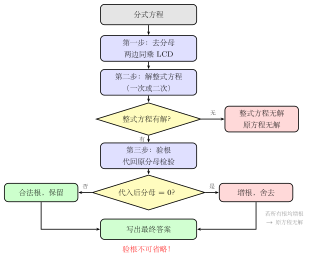

# 分式方程及增根

> **一例速记**：  
> 解分式方程"三步走"：① 去分母（两边同乘最简公分母）② 解整式方程 ③ **代回原方程验根**（必须！）  
> **增根**：去分母后算出来、但代回让原分母 = 0 的"假根"——直接舍弃。

---

## 一、引入：增根从哪来

> **题目**：解方程 $\dfrac{1}{x-2} = \dfrac{3}{x-2} - 2$。

请先在草稿纸上试一试，看你能不能发现这道题的陷阱。

把两边同乘 $(x-2)$，得到 $1 = 3 - 2(x-2)$，整理后解出 $x=3$。代回原方程——分母 $x-2=1\neq 0$，分式有意义，方程两边也相等，答案 $x=3$ 是正确的。

**但如果题目变成 $\dfrac{1}{x-2} = \dfrac{3}{x-2} - 1$，会发生什么？**

同乘 $(x-2)$：$1 = 3 - (x-2)$，整理得 $x-2=2$，于是 $x=4$——等等，先别写答案。代回去：分母 $x-2=2$，没问题，方程成立，$x=4$ 有效。

**再换一道**：解 $\dfrac{2}{x-2} = \dfrac{4}{x-2} - 2$。

同乘 $(x-2)$：$2 = 4 - 2(x-2)$，整理得 $2(x-2) = 2$，即 $x-2=1$，所以 $x=3$？等等——代回验算：$\dfrac{2}{3-2} = \dfrac{4}{3-2} - 2$，即 $2 = 4-2 = 2$，成立。这还是对的。

**最危险的例子**：解 $\dfrac{1}{x-2} = \dfrac{3}{x-2} - 2$（用本章开头那道）。

如果你去掉分母，结果恰好是 $x=2$，那代回分母 $x-2=0$——原方程无意义了！这个 $x=2$ 是去分母时"多引入"的，它满足整式方程，但**不满足原来的分式方程**。这种假根就叫**增根**。

**增根的核心危险**：它看起来像合法解，但代入原方程分母 = 0，分式无意义，必须舍弃。**不验根就写答案，是分式方程最常见的失分点。**

---

## 二、思维路径还原（解题者的内心独白）

下面是解方程 $\dfrac{1}{x-2} = \dfrac{3}{x-2} - 2$ 的完整思维过程：

> 拿到这道方程，分母都是 $x-2$，含有未知数 $x$——这是分式方程，要用三步走。
>
> **第一步：找最简公分母，去分母。**  
> 两个分式的分母都是 $x-2$，最简公分母 LCD = $x-2$。  
> 两边同乘 $(x-2)$（注意：$x \neq 2$）：
> $$1 \cdot (x-2) \cdot \frac{1}{x-2} = \frac{3}{x-2} \cdot (x-2) - 2 \cdot (x-2)$$
> 化简得：$1 = 3 - 2(x-2)$。
>
> **第二步：解整式方程。**  
> $1 = 3 - 2x + 4 = 7 - 2x$  
> $2x = 6$，所以 $x = 3$。
>
> **第三步：验根——这步不能省。**  
> 把 $x=3$ 代回**原方程的分母** $x-2 = 3-2 = 1 \neq 0$。  
> 分母不为零，分式有意义。继续验方程：  
> 左边 $= \dfrac{1}{3-2} = 1$；右边 $= \dfrac{3}{3-2} - 2 = 3-2 = 1$。两边相等。  
> $x=3$ 是合法解。
>
> 假设我算出的是 $x=2$：代回分母 $x-2 = 0$，原方程分母为零，无意义。$x=2$ 是增根，必须舍去，原方程无解。
>
> 反思：为什么会出现增根？因为"两边同乘 $(x-2)$"是对任意 $x$ 都成立的代数操作，但若 $x=2$ 使 $(x-2)=0$，乘以零这一步实际上是在两边同乘 $0$，等式仍成立但已失去约束力。所以去分母引入了原本不该存在的解——**增根**。

---

## 三、抽象成方法

### 解分式方程的三步标准流程

**第一步：去分母**

找所有分母的**最简公分母（LCD）**，两边同乘 LCD，将分式方程化为整式方程。

$$\text{分式方程} \xrightarrow{\text{两边} \times \text{LCD}} \text{整式方程}$$

注意：去分母时每一项都要乘以 LCD，包括不含分式的整数项。

**第二步：解整式方程**

去分母后得到的通常是一元一次方程或一元二次方程，按正常步骤解出所有根。

**第三步：验根（必须！）**

将每个根代回**原分式方程的所有分母**：

- 若某分母 $= 0$ → 该根是**增根**，**舍去**；
- 若所有分母 $\neq 0$ → 代入验方程两边是否相等，相等则保留。

> **警告**：验根不是"可选项"，而是分式方程解法的**必要组成部分**。缺少验根，解答不完整。

### 增根的本质

**增根**是去分母操作引入的额外解。它使 LCD = 0，去分母时"乘以零"这一步消除了约束，导致原本无意义的情形被错误地算作解。

**增根 = 让原分母为零的解**。因此，找增根的捷径是：令每个分母 = 0，解出对应的 $x$ 值——这些就是潜在增根，若它们恰好是第二步解出来的，则必须舍去。

---

## 四、方法变形

### 变形 1：含参分式方程——求使方程有增根的参数值

**题型**：方程含参数 $m$，问"$m$ 取何值时方程有增根"。

**策略**：先找出分母为零的 $x$ 值（即潜在增根），代入整式方程（去分母后），求使等式成立的 $m$。

**例**：$\dfrac{m}{x-1} - 1 = 0$ 中，若方程有增根，求 $m$。

分母 $x-1=0$ 时 $x=1$，所以潜在增根是 $x=1$。把 $x=1$ 代入去分母后的整式方程 $m - (x-1) = 0$（即 $m=x-1$），得 $m = 0$。故当 $m=0$ 时，方程有增根 $x=1$。

（验证：$m=0$ 时方程变为 $-1=0$，无解，$x=1$ 确为增根而非合法解，结论成立。）

### 变形 2：分式应用题——行程问题

行程问题最常见的列方程模型：

$$\text{时间} = \frac{\text{路程}}{\text{速度}}$$

当题目给"往返时间差"或"两段路程时间差"时，两项相减列方程，分母含速度（含未知数），就构成分式方程。

**例**：某人骑车上山速度 $v$，下山速度是上山的 2 倍（即 $2v$）。上山路程 12 km，下山路程相同，下山比上山少用 1 小时。求上山速度 $v$。

$$\frac{12}{v} - \frac{12}{2v} = 1$$

去分母（乘以 $2v$，$v > 0$ 所以验根只需 $v > 0$）：$24 - 12 = 2v$，解得 $v = 6$ km/h。验根：$v=6>0$，有意义。

### 变形 3：分式应用题——工程问题

$$\frac{1}{A \text{ 完成时间}} + \frac{1}{B \text{ 完成时间}} = \frac{1}{\text{合作完成时间}}$$

设未知完成时间，通分后解分式方程，别忘验根（时间必须大于 0）。

### 变形 4：整体换元简化分式方程

当方程中同一个分式结构反复出现时，令整体为新变量，先解新变量，再回代。

**例**：$\dfrac{x+1}{x-1} + \dfrac{x-1}{x+1} = \dfrac{10}{3}$。

令 $t = \dfrac{x+1}{x-1}$，则 $\dfrac{x-1}{x+1} = \dfrac{1}{t}$，方程变为 $t + \dfrac{1}{t} = \dfrac{10}{3}$，两边乘以 $3t$：$3t^2 - 10t + 3 = 0$，解得 $t = 3$ 或 $t = \dfrac{1}{3}$，再分别回代求 $x$（同时检验分母不为零）。

---

## 五、思考路标（条件反射训练）

每一条，读到"看到就秒反应"的程度：

1. **见"分母含未知数"** → 分式方程 → 立刻三步走，**绝不忘验根**。
2. **解出根之后** → 代回**原方程分母**（不是化简后的方程），看是否为零。
3. **分母为零的根** → 增根，**直接舍去**，原方程无解（若所有根均增根）或取剩余合法根。
4. **含参题问"有增根"** → 令分母 = 0 得潜在增根，代入整式方程求参数。
5. **行程题"...比...多用 $k$ 小时"** → 时间差 = $k$，分别写 $\dfrac{\text{路程}}{\text{速度}}$，列差方程。
6. **工程题"合作完成"** → $\dfrac{1}{a} + \dfrac{1}{b} = \dfrac{1}{T}$，$T$ 为合作时间。
7. **同一分式重复出现** → 整体换元，设新变量 $t$，解后回代，验根在 $t$ 回代 $x$ 之后做。
8. **去分母时** → **每一项**（包括整数项）都乘以 LCD，不能漏项。

---

## 六、应用例题

### 例 1　标准三步走

解方程 $\dfrac{x}{x-3} - \dfrac{2}{x-3} = 1$。

**【思路】** 两个分式同分母 $x-3$，LCD = $x-3$。

**第一步**：两边同乘 $(x-3)$（注意 $x \neq 3$）：

$$x - 2 = x - 3$$

**第二步**：整理整式方程：$x - 2 = x - 3 \Rightarrow -2 = -3$。

这是矛盾，无解。

**第三步**：无需验根（整式方程本身无解，不存在需要验的根）。

**答**：方程无解。

**点评**：去分母后得到矛盾等式，说明整式方程本身无解，这和增根是不同情况——增根是算出了解但代回无效，此处是压根没有解。

---

### 例 2　含参题求增根对应的参数

若方程 $\dfrac{2x}{x-1} + \dfrac{a}{x-1} = 3$ 有增根，求 $a$ 的值。

**【思路】** 分母 $x-1=0$ 时 $x=1$，潜在增根是 $x=1$。

"有增根"意味着：去分母后解出来的根恰好是 $x=1$。

**第一步**：两边同乘 $(x-1)$：$2x + a = 3(x-1)$，即 $2x + a = 3x - 3$，整理得 $x = a + 3$。

**令** $x = a+3 = 1$，解得 $a = -2$。

**验证**：$a=-2$ 时方程为 $\dfrac{2x}{x-1} - \dfrac{2}{x-1} = 3$，即 $\dfrac{2(x-1)}{x-1} = 3$，化简（约去 $x-1$，此时 $x \neq 1$）得 $2=3$，矛盾——说明 $x=1$ 是增根，方程无合法解，结论成立。

**答**：$a = -2$。

---

### 例 3　行程应用题

某人骑车从甲地到乙地，全程 60 km。去时顺风速度为 $v$ km/h，返回时逆风速度比去时少 10 km/h（即 $v-10$ km/h）。已知返回比去时多用 1 小时，求去时速度 $v$。

**【思路】** 时间 = 路程 ÷ 速度，时间差列方程：

$$\frac{60}{v-10} - \frac{60}{v} = 1$$

**第一步**：LCD = $v(v-10)$（$v > 0$ 且 $v > 10$，因为速度必须正），两边同乘：

$$60v - 60(v-10) = v(v-10)$$

$$600 = v^2 - 10v$$

$$v^2 - 10v - 600 = 0$$

**第二步**：分解 $(v-30)(v+20) = 0$，解得 $v = 30$ 或 $v = -20$。

**第三步**：验根。$v=-20$ 不满足速度 $>10$ 的实际含义（速度不能为负），舍去。$v=30$ 满足 $v>10$，代入分母：$v-10=20\neq 0$，$v=30\neq 0$，有效。

**答**：去时速度 $v = 30$ km/h。

---

## 七、思路自测题

**自测 1**（☆）

解方程 $\dfrac{3}{x+2} = 1$。

> 💡 提示：两边同乘 $(x+2)$，解出 $x$，验证 $x+2 \neq 0$。

---

**自测 2**（☆☆）

解方程 $\dfrac{x}{x-1} - \dfrac{1}{x+1} = \dfrac{2}{x^2-1}$。

> 💡 提示：$x^2-1=(x-1)(x+1)$，LCD = $(x-1)(x+1)$，两边同乘，展开整理。注意 $x \neq \pm 1$，验根必须代回原分母。

---

**自测 3**（☆☆）

若方程 $\dfrac{x+3}{x-1} + \dfrac{k}{x-1} = 2$ 有增根，求 $k$。

> 💡 提示：增根令分母 = 0，得 $x=1$；代入去分母后的整式方程求 $k$。

---

**自测 4**（☆☆）

甲独做一件工作需 6 小时，乙独做需 $x$ 小时。两人合作 2 小时后，剩余工作由乙单独完成，再用了 2 小时才完成。求乙独做全部工作所需时间 $x$。

> 💡 提示：合作 2 小时完成 $2 \times \left(\dfrac{1}{6} + \dfrac{1}{x}\right)$，剩余部分 $= 1 - 2\left(\dfrac{1}{6}+\dfrac{1}{x}\right)$，由乙用 2 小时完成，即剩余 $= \dfrac{2}{x}$，列方程后去分母求解，验根 $x > 0$。

---

**自测 5**（☆☆☆）

解方程 $\dfrac{x-1}{x+1} - \dfrac{x+1}{x-1} = \dfrac{-4x}{x^2-1}$。

> 💡 提示：LCD = $(x+1)(x-1) = x^2-1$（$x \neq \pm 1$），两边同乘通分，注意左边两项展开后合并，验根必须检验 $x=1$ 和 $x=-1$ 是否为增根。
