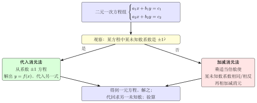

# 代入消元法与加减消元法

上一节知道了方程组的解就是"两条直线的交点"，但怎么把那个交点精确算出来？关键思路是**消元**：把二元（两个未知数）变成一元（一个未知数），再用一元一次方程的方法求解。消元有两种主要路径：**代入消元法**和**加减消元法**。本节系统掌握这两种方法，并学会在不同题型中选择更高效的那一个。

## 一、概念特征：怎么一眼认出

### 消元的核心思想

解方程组的关键障碍是"两个未知数"——只要把其中一个未知数消掉，剩下的方程就是我们熟悉的一元一次方程。两种消元法路径不同，本质目标相同：

| 方法 | 思路 | 适用信号 |
|---|---|---|
| **代入消元法** | 从一个方程解出 $x$（或 $y$），代入另一方程 | 某方程中某未知数系数为 $\pm 1$ |
| **加减消元法** | 两方程相加或相减，使某未知数消失 | 某未知数的系数相同或相反 |

两种方法都能解任意二元一次方程组，但选择合适的方法可以大幅减少计算量。

## 二、定义与核心工具

### 1. 代入消元法

**操作步骤**：

1. 从方程组中选**含系数 $\pm 1$ 的那个未知数**的方程（这样解出来的式子不会有分数）；
2. 把该方程整理为"$x = \text{含 }y$ 的表达式"或"$y = \text{含 }x$ 的表达式"；
3. 把这个表达式**代入另一个方程**（不是代回原来那个方程！），得到一元一次方程；
4. 解该一元一次方程得到一个未知数的值；
5. 把结果代回步骤 2 的表达式，求出另一个未知数；
6. 检验：把 $(x, y)$ 代入原方程组的两个方程验证。

**适用信号**：看到某个方程含有系数为 $1$ 或 $-1$ 的未知数，例如 $y = 2x - 1$，或 $x - 3y = 5$（$x$ 系数为 $1$）。直接整理即可，不会产生分数。

### 2. 加减消元法

**操作步骤**：

1. 选定要**消去**的未知数（选系数关系更简单的那个）；
2. 若两方程中该未知数的系数**相同**，则两方程相减；若系数**互为相反数**，则两方程相加；
3. 若系数既不相同也不相反，则先将一个（或两个）方程乘以适当的倍数，使目标未知数的系数相同或相反；
4. 相加或相减后得到一元一次方程，求解；
5. 把结果代入两方程中**任意一个**，求另一未知数；
6. 检验。

**适用信号**：看到两方程中同一未知数的系数相同（如都有 $2x$）、相反（如 $2x$ 和 $-2x$），或一个是另一个的整数倍（如 $2x$ 和 $6x$，后者乘以 $\frac{1}{3}$ 变成前者）。

## 三、推导：两种方法的逻辑基础

**代入法的依据**：等式性质——方程 1 成立，则可以把方程 1 中的 $y$ 用 $x$ 的表达式替换，代入方程 2 后方程 2 仍成立。这是"等量代换"的直接应用。

**加减法的依据**：等式性质——若 $a = b$ 且 $c = d$，则 $a \pm c = b \pm d$。两个方程各自成立，则两个方程相加（或相减）后得到的新方程仍然成立。用这个新方程消去一个未知数，剩下的是一元方程。

两种方法在本质上都是**对等式进行等价变换**，每一步都有等式性质作为依据，不是"随意凑"出来的。

## 四、典型应用

### 例 1　代入法（含现成的 $y$ 等于表达式）

解方程组 $\begin{cases} y = 2x - 1 & \cdots(1)\\ 3x + 2y = 12 & \cdots(2) \end{cases}$。

【思路】方程 $(1)$ 已经是 "$y = \ldots$" 的形式，直接把 $y = 2x - 1$ 代入方程 $(2)$，消去 $y$，得到关于 $x$ 的一元一次方程。解出 $x$ 后再代回 $(1)$ 求 $y$。

**解**：

将 $(1)$ 代入 $(2)$：

$$3x + 2(2x - 1) = 12.$$

去括号：

$$3x + 4x - 2 = 12.$$

合并同类项，移项：

$$7x = 14 \implies x = 2.$$

将 $x = 2$ 代入 $(1)$：

$$y = 2 \times 2 - 1 = 3.$$

故方程组的解为 $\begin{cases} x = 2 \\ y = 3 \end{cases}$。

**检验**：代入 $(2)$：$3 \times 2 + 2 \times 3 = 6 + 6 = 12$，成立。

### 例 2　加减法（直接相减消元）

解方程组 $\begin{cases} 2x + 3y = 7 & \cdots(1)\\ 2x - y = 3 & \cdots(2) \end{cases}$。

【思路】两方程中 $x$ 的系数均为 $2$（相同），两式相减可消去 $x$，得到只含 $y$ 的一元方程。相减时注意符号：$(1)$ 减 $(2)$，对应项逐一相减。

**解**：

$(1) - (2)$（两方程相减）：

$$(2x + 3y) - (2x - y) = 7 - 3.$$
$$2x + 3y - 2x + y = 4.$$
$$4y = 4 \implies y = 1.$$

将 $y = 1$ 代入 $(2)$：

$$2x - 1 = 3 \implies 2x = 4 \implies x = 2.$$

故方程组的解为 $\begin{cases} x = 2 \\ y = 1 \end{cases}$。

**检验**：代入 $(1)$：$2 \times 2 + 3 \times 1 = 4 + 3 = 7$，成立。

### 例 3　加减法 + 倍乘（系数既不相同也不相反）

解方程组 $\begin{cases} 3x + 5y = 8 & \cdots(1)\\ 5x - 3y = 2 & \cdots(2) \end{cases}$。

【思路】两方程的 $x$ 系数为 $3$ 和 $5$，$y$ 系数为 $5$ 和 $-3$，既不相同也不互反，需要先倍乘。若选择消去 $x$：$(1) \times 5$、$(2) \times 3$ 后 $x$ 系数均为 $15$，再相减；若选择消去 $y$：$(1) \times 3$、$(2) \times 5$ 后 $y$ 系数为 $15$ 和 $-15$，再相加。两种路径均可，此处选消去 $y$（相加比相减更不容易出符号错误）。

**解**：

$(1) \times 3$：

$$9x + 15y = 24. \quad \cdots (3)$$

$(2) \times 5$：

$$25x - 15y = 10. \quad \cdots (4)$$

$(3) + (4)$（$y$ 系数 $+15$ 和 $-15$ 互为相反数，相加消去 $y$）：

$$9x + 25x + 15y - 15y = 24 + 10.$$
$$34x = 34 \implies x = 1.$$

将 $x = 1$ 代入 $(1)$：

$$3 \times 1 + 5y = 8 \implies 5y = 5 \implies y = 1.$$

故方程组的解为 $\begin{cases} x = 1 \\ y = 1 \end{cases}$。

**检验**：代入 $(2)$：$5 \times 1 - 3 \times 1 = 5 - 3 = 2$，成立。

## 五、易错点 & 反例

1. **代入法：解出 $y$ 后，要代入"另一个方程"，而不是代回"原来那个方程"。**
   反例：从方程 $(1)$ 解出 $y = 2x - 1$，又代回方程 $(1)$，得到 $y = 2x - 1$，这是恒等式，$x$ 无法确定——等于什么都没做。必须代入**方程 $(2)$**。

2. **加减法：方程相减时，减号必须作用于整个方程（每一项都要变号），不能只减第一项。**
   反例：$(2x + 3y = 7)$ 减 $(2x - y = 3)$，右边应为 $7 - 3 = 4$；左边 $2x - 2x = 0$，$3y - (-y) = 4y$（注意减去 $-y$ 得 $+y$，不能写成 $3y - y = 2y$）。正确结果是 $4y = 4$。

3. **倍乘时只能乘以"数"，不能乘以"含未知数的式子"。**
   等式性质 2 要求乘以非零数，若乘以 $x$ 之类含未知数的量，会引入 $x^2$ 从而改变方程的类型，得到错误结论。

4. **代入法中，解出 $y$ 代入后展开括号要仔细，尤其前面有负号时。**
   反例：$y = 2x - 1$，代入 $-2y$ 时：$-2y = -2(2x-1) = -4x + 2$（不是 $-4x - 2$）。括号前的负号使括号内每项变号。

5. **加减消元后，求到一个未知数，代回时选哪个方程都可以，但建议选系数更简单的那个，减少计算量。**
   没有说"必须代回方程 1"，根据系数的简繁选择，例如若方程 2 系数更简单，代回方程 2 求另一未知数更方便。

6. **最终结果必须是一个有序实数对 $(x, y)$，不能只写出 $x$ 的值而漏掉 $y$，或只写 $y$ 而漏掉 $x$。**
   方程组的解必须同时给出两个未知数的值，格式写成 $\begin{cases} x = \ldots \\ y = \ldots \end{cases}$ 或"解为 $x = \ldots$，$y = \ldots$"。

## 六、思路自测题

1. 用代入消元法解方程组 $\begin{cases} x = 3y - 2 \\ 2x + y = 9 \end{cases}$。  
   💡 提示：第一个方程已经是 "$x = \ldots$" 的形式，直接将 $x = 3y - 2$ 代入第二个方程，得到关于 $y$ 的一元方程；解出 $y$ 后再代回第一个方程求 $x$；最后代入两个方程验证。

2. 用加减消元法解方程组 $\begin{cases} 3x + 2y = 16 \\ 3x - y = 7 \end{cases}$。  
   💡 提示：两方程 $x$ 系数均为 $3$，两式相减可消去 $x$；相减时右边 $16 - 7 = 9$，左边 $2y - (-y) = 3y$；解出 $y$ 后代回任一方程求 $x$。

3. 选择合适的方法解方程组 $\begin{cases} 2x - 3y = 1 \\ 4x + y = 9 \end{cases}$，并说明为什么选这种方法。  
   💡 提示：观察系数：$y$ 在第二方程系数为 $1$，可以从第二方程整理出 $y = 9 - 4x$ 再代入第一方程（代入法），或者将第一方程乘以 $1$、第二方程乘以 $3$ 让 $y$ 系数变为 $-3$ 和 $3$ 后相加（加减法）——两种都可以，说明你选择的理由（如哪种步骤更简洁）。

4. 解方程组 $\begin{cases} \dfrac{x}{2} + \dfrac{y}{3} = 2 \\[6pt] \dfrac{x}{3} - \dfrac{y}{2} = -1 \end{cases}$。  
   💡 提示：先去分母——第一个方程两边乘以 $6$，第二个方程两边乘以 $6$，将含分数的方程化为整数系数；再观察系数关系，选择代入法或加减法（加减法：第一式乘以 $3$、第二式乘以 $2$ 后相加可消去 $y$）。
