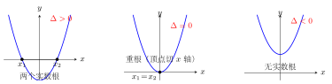

# 求根公式与判别式

配方法解一元二次方程的威力在于它的**普适性**——对任何一元二次方程都能用。把配方法应用到一般形式 $ax^2 + bx + c = 0$，就能推导出一个"万能公式"，只需代入系数就能直接求根。这个公式配上**判别式 $\Delta$**，让我们在动手解方程之前就能预判根的个数与类型。

---

## 一、概念特征：求根公式从哪来

一元二次方程的**求根公式**：

若 $ax^2 + bx + c = 0$（$a \neq 0$），则

$$x = \frac{-b \pm \sqrt{b^2 - 4ac}}{2a}$$

其中 $\pm$ 表示两个根：

$$x_1 = \frac{-b + \sqrt{b^2 - 4ac}}{2a}, \quad x_2 = \frac{-b - \sqrt{b^2 - 4ac}}{2a}$$

**核心地位**：求根公式与直接开平方法、因式分解法、配方法并列为四大解法，但它最通用——**任何**一元二次方程（只要有实数根）都能用求根公式解。

---

## 二、定义与核心工具

### 1. 求根公式的推导

从一般形式 $ax^2 + bx + c = 0$（$a \neq 0$）出发，用配方法推导：

**第一步：移常数项**

$$ax^2 + bx = -c$$

**第二步：两边除以 $a$（使二次项系数为 1）**

$$x^2 + \frac{b}{a}x = -\frac{c}{a}$$

**第三步：配方**（两边加 $\left(\dfrac{b}{2a}\right)^2$）

$$x^2 + \frac{b}{a}x + \left(\frac{b}{2a}\right)^2 = -\frac{c}{a} + \frac{b^2}{4a^2}$$

左边折叠为完全平方：

$$\left(x + \frac{b}{2a}\right)^2 = \frac{b^2 - 4ac}{4a^2}$$

**第四步：开方**

当 $b^2 - 4ac \geq 0$ 时：

$$x + \frac{b}{2a} = \pm \frac{\sqrt{b^2 - 4ac}}{2|a|}$$

注意 $4a^2 = (2a)^2$，所以 $\sqrt{4a^2} = 2|a|$。

**第五步：整理**

$$x = \frac{-b \pm \sqrt{b^2 - 4ac}}{2a}$$

（当 $a > 0$ 时 $2|a| = 2a$；当 $a < 0$ 时 $2|a| = -2a$，但 $\pm$ 号已经把两种情形都包含，最终形式一致。）

### 2. 判别式 $\Delta$

定义**判别式**：

$$\Delta = b^2 - 4ac$$

$\Delta$ 是根号内的表达式，它的正负号决定了方程有几个实数根：

| $\Delta$ 的符号 | 方程根的情况 | 说明 |
|:---:|:---:|:---:|
| $\Delta > 0$ | 两个**不相等**的实数根 $x_1 \neq x_2$ | 根号内正数，开方有两个不同值 |
| $\Delta = 0$ | 两个**相等**的实数根 $x_1 = x_2$ | 根号内为零，$x = \dfrac{-b}{2a}$（重根） |
| $\Delta < 0$ | **无实数根** | 根号内为负数，实数范围内无意义 |

**几何意义（呼应 part10 二次函数）**：二次函数 $y = ax^2 + bx + c$ 的图像是抛物线，令 $y = 0$ 就是求方程 $ax^2 + bx + c = 0$ 的根，即**抛物线与 $x$ 轴的交点**：

- $\Delta > 0$：抛物线与 $x$ 轴有**两个**交点
- $\Delta = 0$：抛物线与 $x$ 轴**相切**（恰好一个交点，即顶点在 $x$ 轴上）
- $\Delta < 0$：抛物线与 $x$ 轴**不相交**（整条曲线在 $x$ 轴上方或下方）

这三种情形在学完 part10 后会有直观图像支撑，现在先建立代数直觉。

### 3. 使用求根公式的步骤

1. **化标准形式**：把方程整理为 $ax^2 + bx + c = 0$，明确 $a, b, c$（注意符号！）
2. **计算 $\Delta$**：$\Delta = b^2 - 4ac$
3. **判断根的情况**：若 $\Delta < 0$，无实数根，结束；否则继续
4. **代入公式**：$x = \dfrac{-b \pm \sqrt{\Delta}}{2a}$
5. **化简**：约分，整理根号

---

## 三、典型例题

### 例 1　用求根公式解方程

解方程 $2x^2 - 3x - 1 = 0$。

**【思路】** 系数是 $a = 2$，$b = -3$，$c = -1$。先算 $\Delta$，再代公式。

**解**：

$a = 2$，$b = -3$，$c = -1$。

$$\Delta = b^2 - 4ac = (-3)^2 - 4 \times 2 \times (-1) = 9 + 8 = 17$$

$\Delta = 17 > 0$，方程有两个不相等的实数根。

$$x = \frac{-b \pm \sqrt{\Delta}}{2a} = \frac{-(-3) \pm \sqrt{17}}{2 \times 2} = \frac{3 \pm \sqrt{17}}{4}$$

所以：

$$x_1 = \frac{3 + \sqrt{17}}{4}, \quad x_2 = \frac{3 - \sqrt{17}}{4}$$

**点评**：$b = -3$ 是负数，$-b = -(-3) = 3$，**符号绝不能出错**。$c = -1$ 代入 $-4ac$ 时：$-4 \times 2 \times (-1) = +8$，两负相消。

---

### 例 2　用判别式判断根的情况

不解方程，判断方程 $x^2 + 2x + 3 = 0$ 的根的情况。

**【思路】** 只需算 $\Delta$，不用代入公式。

**解**：

$a = 1$，$b = 2$，$c = 3$。

$$\Delta = b^2 - 4ac = 4 - 4 \times 1 \times 3 = 4 - 12 = -8$$

$\Delta = -8 < 0$，方程**无实数根**。

**点评**：$\Delta < 0$ 时不必继续计算，直接结论"无实数根"。不要写"根为 $\dfrac{-2 \pm \sqrt{-8}}{2}$"——根号内为负数，实数范围内无意义。

---

### 例 3　含参题：用 $\Delta$ 求参数范围

方程 $x^2 + 2x + m = 0$ 有两个不相等的实数根，求 $m$ 的范围。

**【思路】** "有两个不相等实数根"等价于 $\Delta > 0$，解不等式求 $m$。

**解**：

$a = 1$，$b = 2$，$c = m$。

$$\Delta = b^2 - 4ac = 4 - 4m$$

要使方程有两个不相等实数根，需 $\Delta > 0$：

$$4 - 4m > 0 \implies 4 > 4m \implies m < 1$$

**答**：$m < 1$ 时，方程有两个不相等的实数根。

**追问**：$m = 1$ 时呢？$\Delta = 0$，方程有两个相等的实数根 $x_1 = x_2 = \dfrac{-2}{2} = -1$，即方程为 $(x+1)^2 = 0$。

**追问**：$m > 1$ 时呢？$\Delta < 0$，无实数根。

---

## 四、易错点总结

**易错 1：$-b$ 的符号**

求根公式是 $\dfrac{-b \pm \sqrt{\Delta}}{2a}$，注意是 $-b$，不是 $b$。当 $b < 0$ 时，$-b > 0$，容易搞反。

| 题目中 | $b =$ | $-b =$ |
|:---:|:---:|:---:|
| $x^2 - 5x + 6 = 0$ | $-5$ | $+5$ |
| $2x^2 + 7x - 3 = 0$ | $+7$ | $-7$ |

**易错 2：计算 $\Delta$ 时 $b^2$ 的符号**

$b^2$ 永远 $\geq 0$。即使 $b < 0$，$b^2 = (-b)^2 > 0$：

- $b = -3$ 时，$b^2 = (-3)^2 = 9$，**不是** $-9$。

**易错 3：$\Delta = 0$ 是重根，不是无根**

$\Delta = 0$ 时有两个相等的实数根 $x_1 = x_2 = \dfrac{-b}{2a}$，这叫**重根**，不是"无解"。

**易错 4：先化标准形式**

方程 $3x^2 = 2x + 1$ 不能直接看出 $c = 0$；必须先移项：$3x^2 - 2x - 1 = 0$，此时 $a = 3$，$b = -2$，$c = -1$。

---

## 五、方法选择策略

四种解法各有适用场景：

| 方法 | 适用条件 | 速度 |
|:---:|:---:|:---:|
| 直接开平方 | 方程形如 $(\cdot)^2 = k$ | 最快 |
| 因式分解 | 整数系数，能十字相乘或提公因式 | 快 |
| 配方法 | $b$ 为偶数，$a = 1$ 时最快 | 中等 |
| **求根公式** | **任何情形，万能** | 稳定 |

实战口诀：**先试因式分解；不行就求根公式**。配方法在推导和二次函数最值时更有价值。

---

## 六、自测题

**自测 1**（☆）

用求根公式解方程 $x^2 - 5x + 6 = 0$。

> 💡 提示：先算 $\Delta = 25 - 24 = 1$，代入公式，结果是整数。

---

**自测 2**（☆）

计算判别式，判断方程 $3x^2 - 2x + 1 = 0$ 根的情况。

> 💡 提示：$\Delta = 4 - 12 = -8 < 0$。

---

**自测 3**（☆☆）

用求根公式解方程 $3x^2 + 5x - 2 = 0$。

> 💡 提示：$a = 3$，$b = 5$，$c = -2$。$\Delta = 25 + 24 = 49$，$\sqrt{49} = 7$。

---

**自测 4**（☆☆）

方程 $x^2 - kx + k = 0$ 有两个相等的实数根，求 $k$。

> 💡 提示："两个相等实数根"等价于 $\Delta = 0$；$\Delta = k^2 - 4k = k(k-4) = 0$。

---

**自测 5**（☆☆☆）

方程 $(m+1)x^2 - 2x + 1 = 0$ 有实数根，求 $m$ 的范围。

> 💡 提示：注意"有实数根"包含 $\Delta \geq 0$ 和 $m + 1 \neq 0$（若 $m = -1$，方程退化为一次方程，另行讨论）两个条件，分类讨论。
