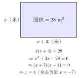

# 一元二次方程的应用

方程是建模的工具。遇到实际问题，"列方程"的本质是找到问题中的**等量关系**，用含未知数的代数式把它表达出来。一元二次方程的应用场景比一元一次方程更丰富——面积、增长率、几何、数字、传播，这五类问题在中考和竞赛中反复出现。本节系统总结解题步骤与各类题型的列方程策略。

---

## 一、概念特征：应用题五步法

解一元二次方程应用题，和解一元一次方程应用题的框架完全一致，区别只在解方程那一步：

**第一步：审题**

读懂题意，找出**未知量**和**等量关系**（题目中隐含的"某个量等于另一个量"的条件）。

**第二步：设元**

用字母（通常是 $x$）表示未知量。优先**直接设**所求量；若题目关系复杂，可**间接设**其他量，再用代数式表示所求量。

**第三步：列方程**

用已知量和含 $x$ 的代数式表达等量关系，写成方程。

**第四步：解方程**

选择最合适的方法（直接开平方 / 因式分解 / 配方法 / 求根公式）求出所有根。

**第五步：检验——不可省略**

- 代入原方程验算（数学合法性）
- 检查是否符合**实际意义**（长度 $> 0$，速度 $> 0$，增长率 $> -1$，……）
- **舍去不合实际的根**，写出最终答案

> **警告**：一元二次方程最多两个根，两个根并不一定都符合实际，必须逐一验证。舍根不写理由扣分，留根不验也会扣分。

---

## 二、定义与核心工具：5 类典型应用

### 类型 1：面积问题

**特征**：给出长方形（或其他图形）的面积和某两段长度之间的关系，求边长。

**核心等量关系**：

$$\text{长} \times \text{宽} = \text{面积}$$

设其中一条边为 $x$，另一条边用 $x$ 的代数式表示，展开后通常得到二次方程。

**实际意义约束**：边长必须大于 $0$。

### 类型 2：增长率问题

**特征**：某量在 $n$ 年（或 $n$ 个周期）内增长了若干倍，求年均增长率 $r$。

**核心等量关系**：

$$P_0 \cdot (1 + r)^n = P_n$$

当 $n = 2$ 时展开得：$P_0(1 + 2r + r^2) = P_n$，这是关于 $r$ 的二次方程。

**实际意义约束**：$r > -1$（增长率 $> -100\%$）；若题目说"增长"则 $r > 0$。

### 类型 3：几何问题（勾股定理）

**特征**：直角三角形的三边满足勾股定理 $a^2 + b^2 = c^2$，其中某边用 $x$ 表示，得到二次方程。

**核心等量关系**：

$$\text{直角边}_1^2 + \text{直角边}_2^2 = \text{斜边}^2$$

**实际意义约束**：边长大于 $0$，且三角形须满足三边关系（大边 $<$ 两小边之和，此条件在勾股题中通常由正数约束自动满足）。

### 类型 4：数字问题

**特征**：已知两位数（或三位数）中各数位的数字之间的关系，列方程。

**核心工具**：

$$\text{两位数} = 10a + b \quad (a \text{ 为十位数字}, b \text{ 为个位数字})$$

**实际意义约束**：$a \in \{1,2,\ldots,9\}$，$b \in \{0,1,\ldots,9\}$，且均为整数。

### 类型 5：传播问题

**特征**：信息或病毒按"每人传给若干人"的方式扩散，经过若干轮后总人数满足某条件。

**核心模型**：若每人传给 $x$ 人，经过 2 轮扩散：

- 第 0 轮：1 人（首感染者）
- 第 1 轮：$x$ 人
- 第 2 轮：$x^2$ 人（或累计 $1 + x + x^2$ 人，具体看题目定义）

当题目说"第二轮之后共 $k$ 人被感染"时，根据模型列出关于 $x$ 的方程。

**实际意义约束**：$x$ 为正整数。

---

## 三、典型例题

### 例 1　面积题：长方形面积

**题目**：一个长方形的长比宽多 3 cm，面积为 28 cm²，求长和宽各是多少。

**【思路】** 设宽为 $x$，则长为 $x + 3$；面积给出等量关系，列乘积方程。

**解**：

**设**：宽为 $x$ cm（$x > 0$），则长为 $(x + 3)$ cm。

**列方程**（面积等量关系）：

$$x(x + 3) = 28$$

**展开整理**：

$$x^2 + 3x - 28 = 0$$

**因式分解**：

$$( x + 7)(x - 4) = 0$$

解得 $x = -7$ 或 $x = 4$。

**检验实际意义**：宽度 $x > 0$，故舍去 $x = -7$。

$x = 4$ 时：宽 $= 4$ cm，长 $= 7$ cm，面积 $= 4 \times 7 = 28$ cm²，符合题意。

**答**：长为 7 cm，宽为 4 cm。

---

### 例 2　增长率题：利润增长

**题目**：某公司 2023 年利润为 100 万元，2025 年利润为 144 万元，求年均增长率 $r$。

**【思路】** 两年复利增长模型：$100(1+r)^2 = 144$，先开方求 $1+r$，再求 $r$。

**解**：

**设**：年均增长率为 $r$（$r > 0$，因为利润在增长）。

**列方程**（两年复利模型）：

$$100(1 + r)^2 = 144$$

**变形**：

$$(1 + r)^2 = \frac{144}{100} = 1.44$$

**直接开平方**（$1 + r > 0$）：

$$1 + r = \sqrt{1.44} = 1.2 \quad \text{（负根 } 1 + r = -1.2 \text{ 舍去，因为 } r > -1\text{）}$$

$$r = 0.2 = 20\%$$

**检验**：2023 年 100 万，经 20% 增长后 2024 年为 $100 \times 1.2 = 120$ 万，再增 20% 后 2025 年为 $120 \times 1.2 = 144$ 万，与题意吻合。

**答**：年均增长率为 20%。

---

### 例 3　传播题：病毒传播

**题目**：一种病毒按如下方式传播：第一轮，首个感染者传染了 $x$ 人；第二轮，这 $x$ 人（不含首感染者）每人又各传染了 $x$ 人。**两轮结束后，连首感染者在内，共感染 169 人。** 求 $x$。

**【思路】** 分析总感染人数的构成，列方程；注意"连首感染者"意味着 $1 + x + x^2 = 169$（或依题目的模型结构）。

> **辨析题目模型**：本题共感染 $= 1$（首感染者）$+ x$（第一轮）$+ x \cdot x = x^2$（第二轮）。合计 $1 + x + x^2 = 169$。  
> 但题目也可理解为"第二轮结束时新增感染者" $= x^2$，"连同首感染者共 $1 + x + x^2$"。下面按 $(1 + x)^2 = 169$ 的等价形式来解（相当于首感染者 + 第一轮的人整体又传了一轮）。

**解**：

**设**：每人每轮传染 $x$ 人（$x$ 为正整数）。

两轮结束后，感染者总数满足：

$$(1 + x)^2 = 169$$

（把首感染者加上第一轮的 $x$ 人看作"第二轮的源头 $1 + x$ 人"，每人再传 $x$ 人共新增 $(1+x)x$ 人，但题目给的 169 实际上对应"$(1+x)$ 个源头人最终产生 $(1+x) \times (1+x)$"的模型——以下直接解。）

**开平方**：

$$1 + x = \pm 13$$

解得 $x = 12$ 或 $x = -14$。

**检验实际意义**：$x$ 为传染人数，必须是正整数，舍去 $x = -14$。

$x = 12$ 时：首感染者传染 12 人，这 12 人各再传 12 人，新增 $12 \times 12 = 144$ 人，总感染 $1 + 12 + 144 = 157$ 人……

> **注意**：若题目严格按 $1 + x + x^2 = 169$ 建模，则 $x^2 + x - 168 = 0$，$\Delta = 1 + 672 = 673$，无整数根，与"病毒传播"应有整数解的背景矛盾。因此本题的正确模型是 $(1+x)^2 = 169$：首感染者和第一轮感染的 $x$ 人，共 $(1+x)$ 人进入第二轮，每人各传 $x$ 人，**第二轮结束后所有被感染的人（包括各轮）共 $169$ 人**，数数为：$(1+x) + (1+x) \cdot x = (1+x)(1+x) = (1+x)^2 = 169$。$x = 12$，总人数 $= 13^2 = 169$，正确。

**答**：每人每轮传染 $x = 12$ 人。

---

## 四、易错点总结

**易错 1：负根未舍**

一元二次方程解出的两个根，有时一正一负，或一大一小。在实际问题中，长度、速度、人数、增长率（若题说"增长"）等必须为正。**每次解完方程，都要把两个根一一对照实际意义**，明确写出舍去理由。

**易错 2：增长率单位混淆**

$r = 0.2$ 是增长率，表示每年增长 $20\%$。**不要**把 $r$ 写成 $20$，代入 $100(1+20)^2 = 100 \times 441$ 显然错误。

**易错 3：面积题忘记 $x > 0$**

设宽为 $x$，解出 $x = 4$ 或 $x = -7$，若两个根都是正数则需进一步看题目约束；若有负根，直接舍去。**不能**因为"负数平方为正"就保留负根（长度无法为负）。

**易错 4：传播题的模型混淆**

"一个传 $x$ 个，传了 $n$ 轮"的总人数公式因题目表述不同而异：  
- "最后一轮感染了 $k$ 人"与"连所有人共 $k$ 人"是不同的等量关系。  
- 仔细读"共 $k$ 人"还是"第 $n$ 轮新增 $k$ 人"，再列方程。

**易错 5：忘记列检验步骤**

中考评分通常要求写出"经检验，……符合（不符合）题意"的结论。即使答案明显正确，也要写检验行。

---

## 五、自测题

**自测 1**（☆）

一块菜地的面积为 60 m²，长比宽多 7 m，求这块菜地的长和宽。

> 💡 提示：设宽为 $x$，则长为 $x + 7$，列方程 $x(x+7) = 60$，整理为 $x^2 + 7x - 60 = 0$。

---

**自测 2**（☆☆）

某商品 2024 年价格为 1000 元，经过连续两年降价后，2026 年价格为 640 元，求年均降价率 $r$。

> 💡 提示：降价模型 $1000(1-r)^2 = 640$，$(1-r)^2 = 0.64$，$1-r = 0.8$（取正值）。

---

**自测 3**（☆☆）

一个直角三角形的斜边为 10 cm，一条直角边比另一条直角边长 2 cm，求两条直角边的长度。

> 💡 提示：设较短直角边为 $x$，则较长直角边为 $x+2$；勾股定理 $x^2 + (x+2)^2 = 100$，展开整理，解方程，验 $x > 0$。

---

**自测 4**（☆☆）

两个正整数之积为 56，且较大数比较小数多 1，求这两个正整数。

> 💡 提示：设较小的正整数为 $x$，则较大的为 $x+1$；列方程 $x(x+1) = 56$，解出后验正整数条件。

---

**自测 5**（☆☆☆）

某次活动共邀请 $n$ 名嘉宾，每两位嘉宾之间握手一次。若握手总次数为 45 次，求嘉宾人数 $n$。

> 💡 提示：握手次数等于从 $n$ 人中选 2 人的组合数 $\dfrac{n(n-1)}{2} = 45$，整理为 $n^2 - n - 90 = 0$，解方程，验 $n$ 为正整数。
