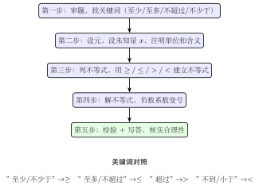

# 不等式的应用

不等式应用题与方程应用题的框架相同：审题、设元、列式、求解、检验。最大的区别在于，不等式应用题的关键词不是"等于"，而是"**至少/至多/不少于/不超过**"等表示范围的词语。翻译准确，后续计算便水到渠成；翻译失误，结果则南辕北辙。

## 一、概念特征：怎么一眼认出

**不等式应用题的识别标志**：题目中出现"至少、至多、不少于、不超过、不低于、不大于、超过、小于"等表示大小范围的词语，而非"等于、恰好"等确定值的词语。

**核心翻译表**（必须熟记）：

| 文字表述 | 数学符号 | 记忆方式 |
|---------|---------|---------|
| 至少 $n$ / 不少于 $n$ / 不低于 $n$ | $\geq n$ | 含等号，$n$ 本身也满足 |
| 至多 $n$ / 不超过 $n$ / 不大于 $n$ | $\leq n$ | 含等号，$n$ 本身也满足 |
| 大于 $n$ / 超过 $n$ / 多于 $n$ | $> n$ | 不含 $n$，严格大于 |
| 小于 $n$ / 不到 $n$ / 少于 $n$ | $< n$ | 不含 $n$，严格小于 |

**"至少"和"超过"的区别**（高频易混）：
- "至少 5 人"→ $\geq 5$，5 人也满足
- "超过 5 人"→ $> 5$，至少 6 人（人数为整数时）

## 二、定义与核心工具

### 解不等式应用题的标准五步

**第一步：审题**，找出题目中表示不等关系的关键词，明确"谁大谁小"或"谁在某个范围内"。

**第二步：设元**，与方程应用题一样，选取合适的未知量 $x$，并注明单位和含义。

**第三步：列不等式**，用关键词对应的不等号建立不等式（注意：有时需要列不等式组）。

**第四步：解不等式**，按标准步骤求出解集。

**第五步：检验并回答**，关注实际意义的限制：
- 人数、件数等必须是**非负整数**
- 长度、重量等必须是**正数**
- 如果解集包含小数但实际需要整数，要**取整**（根据题意取最小整数或最大整数）

### 取整的方向

解出不等式解集后，若需取整数值：

| 题意 | 取整方向 | 示例 |
|-----|---------|------|
| "至少"、"最少"几件 | **向上取整**（$\lceil \cdot \rceil$）| 解得 $x \geq 3.2$，实际至少 $4$ 件 |
| "至多"、"最多"几件 | **向下取整**（$\lfloor \cdot \rfloor$）| 解得 $x \leq 7.8$，实际最多 $7$ 件 |

## 三、推导：为什么这样建模

**为什么用不等式而不用方程？** 等式描述的是"恰好等于"的确定关系，不等式描述的是"满足某个范围"的约束关系。现实中大量问题是约束类型的（预算不超过多少、速度不低于多少），因此需要不等式工具。

**为什么要单独处理实际意义？** 不等式解集是连续区间（如 $x \geq 3.2$），但现实变量常常是离散的（不能买 $3.2$ 个人）。解集给出数学上的范围，实际意义要求我们在这个范围内选取合法的整数值。

**为什么解完要验证？** 列不等式时可能漏掉隐含条件（如 $x > 0$ 或 $x$ 为整数），验证步骤帮助筛除不合实际的解。

## 四、典型应用

### 例 1　购票问题

某景区成人票 $30$ 元，儿童票 $15$ 元，团队总票款**不超过** $200$ 元。团队至少有 $10$ 张票，其中成人 $4$ 人，求儿童最多可以购几张票？

【思路】找到约束条件：总费用不超过 $200$，总人数至少 $10$。设儿童票 $x$ 张，建立不等式。

**解**：

设购儿童票 $x$ 张，则成人票 $4$ 张，总张数为 $x + 4$。

**条件 1**（票款不超过 $200$）：

$$30 \times 4 + 15x \leq 200$$

$$120 + 15x \leq 200$$

$$15x \leq 80$$

$$x \leq \frac{80}{15} = 5.\overline{3}$$

**条件 2**（总张数至少 $10$）：

$$x + 4 \geq 10 \;\Rightarrow\; x \geq 6$$

联立两条件：$x \leq 5.\overline{3}$ 且 $x \geq 6$——两个解集无交集（$6 > 5.\overline{3}$），**无解**！

**结论**：在成人 $4$ 人、总票数至少 $10$ 张的前提下，$200$ 元的预算**不足**，不能同时满足两个条件。

（实际解题中，此类"无解"结论本身就是答案——说明该购票方案不可行。）

### 例 2　通讯套餐比较

某运营商提供两种套餐：
- **套餐 A**：月租 $30$ 元，含 $100$ 分钟，超出部分每分钟 $0.3$ 元
- **套餐 B**：月租 $40$ 元，含 $200$ 分钟，超出部分每分钟 $0.25$ 元

若每月通话时间**超过** $100$ 分钟，问通话多少分钟时选套餐 B 比套餐 A 更合算？

【思路】设月通话 $t$ 分钟（$t > 100$），分别计算两套餐费用，列"B 的费用 $<$ A 的费用"的不等式。

**解**：

设月通话 $t$ 分钟（$t > 100$）。

套餐 A 的月费用：

$$\text{费用}_A = 30 + 0.3(t - 100) = 30 + 0.3t - 30 = 0.3t$$

套餐 B 的月费用（分两种情况）：

- 若 $100 < t \leq 200$：$\text{费用}_B = 40$（超出 $0$ 到 $100$ 分钟，未超过含量，仍是月租 $40$ 元）

  **注**：套餐 B 含 $200$ 分钟，$t \leq 200$ 时不产生超额费用：$\text{费用}_B = 40$。

  解 $\text{费用}_B < \text{费用}_A$：$40 < 0.3t$，即 $t > \dfrac{40}{0.3} = 133.\overline{3}$。

  结合 $100 < t \leq 200$，得 $133.\overline{3} < t \leq 200$，取整数分钟：$t \geq 134$ 分钟。

- 若 $t > 200$：$\text{费用}_B = 40 + 0.25(t - 200) = 0.25t - 10$。

  解 $0.25t - 10 < 0.3t$：$-10 < 0.05t$，$t > -200$（对 $t > 200$ 恒成立）✓。

**结论**：每月通话超过 $100$ 分钟时，

- 通话在 $134$ 分钟到 $200$ 分钟之间：选**套餐 B** 更合算；
- 通话超过 $200$ 分钟：选**套餐 B** 也更合算。

综合：通话时间**超过 $133$ 分钟（即至少 $134$ 分钟）时**，套餐 B 更合算。

### 例 3　方案优选（多约束 + 整数解）

某工厂生产 A、B 两款产品，每件 A 利润 $50$ 元，每件 B 利润 $80$ 元。今日计划至少生产 $30$ 件，其中 A 不少于 $10$ 件，B 不少于 $8$ 件，且总件数不超过 $40$ 件。问 A 生产多少件时，总利润最大？

【思路】设 A 产品 $x$ 件，则 B 产品为总件数 $-x$ 件，建立约束不等式组，再在可行范围内求利润最大值。

**解**：

设生产 A 产品 $x$ 件，则 B 产品为 $(n - x)$ 件（其中 $n$ 为总件数）。

因为希望最大化利润，令总件数尽可能多，取 $n = 40$（总件数上限）。则 B 产品 $= 40 - x$ 件。

**约束条件**：

$$\begin{cases} x \geq 10 & \text{（A 不少于 10 件）} \\ 40 - x \geq 8 & \text{（B 不少于 8 件）} \\ x + (40 - x) = 40 \geq 30 & \text{（自然满足）} \end{cases}$$

由 $40 - x \geq 8$：$x \leq 32$。

解不等式组：$10 \leq x \leq 32$，$x$ 为正整数。

**总利润**：

$$W = 50x + 80(40 - x) = 50x + 3200 - 80x = 3200 - 30x$$

$W$ 是关于 $x$ 的**减函数**（$x$ 越大，利润越小，因为 B 的利润更高），故 $x$ 取**最小值** $x = 10$ 时，利润最大：

$$W_{\max} = 3200 - 30 \times 10 = 3200 - 300 = 2900 \text{ 元}$$

**答**：A 产品生产 $10$ 件（同时生产 B 产品 $30$ 件）时，总利润最大，为 $2900$ 元。

## 五、易错点 & 反例

1. **关键词翻译错误**：
   - "超过 10 人"错译为 $\geq 10$——实为 $> 10$，即至少 $11$ 人。
   - "不低于 80 分"错译为 $> 80$——实为 $\geq 80$，$80$ 分也满足。

2. **忽略实际意义的整数限制**：
   - 解得 $x \geq 3.2$ 但问"至少需要几件"——应取 $4$ 件（向上取整），不能直接写 $3.2$。

3. **超额部分计算基准搞错**：
   - 套餐含 $100$ 分钟，用了 $t$ 分钟，超出部分是 $t - 100$（不是 $t$）。

4. **漏掉隐含约束**：
   - 设商品数量 $x$ 时，忘记 $x$ 必须是非负整数；
   - 应用题中物品数量、人数等变量存在额外下界（如 $x \geq 1$）。

5. **最大/最小方向判断失误**：
   - 解集给出的是一个范围，"最多"取解集上界，"最少"取解集下界，方向要与题意一致。

## 六、思路自测题

**题 1**　某商店出售 A 商品每件 $25$ 元，规定购买 $10$ 件以上（不含 $10$ 件）可享受折扣，折扣后每件 $20$ 元。小明预算 $300$ 元，且希望买尽可能多的 A 商品，他最多能买几件？

> 💡 提示：先算按正价最多买 $\lfloor 300 \div 25 \rfloor = 12$ 件，再算按折扣价（需超 $10$ 件）最多买 $\lfloor 300 \div 20 \rfloor = 15$ 件，但折扣条件是超 $10$ 件，取 $11 \leq$ 件数 $\leq 15$，最多 $15$ 件。比较两种方案的件数，选最多的。

**题 2**　某次考试满分 $100$ 分。小华前三次成绩分别为 $85, 90, 78$ 分，第四次考试至少要考几分，才能使四次平均分不低于 $85$ 分？

> 💡 提示：设第四次 $x$ 分，$(85 + 90 + 78 + x) \div 4 \geq 85$，即 $253 + x \geq 340$，$x \geq 87$。由于成绩为整数且不超过 $100$，第四次至少需考 $87$ 分。

**题 3**　一辆货车限载重量为 $5$ 吨，已装货物 $1.5$ 吨，还需装若干件每件重 $200$ 千克的货物，最多还能装几件？

> 💡 提示：设还能装 $x$ 件，$1.5 + 0.2x \leq 5$，$0.2x \leq 3.5$，$x \leq 17.5$，取整数最多装 $17$ 件（向下取整，因为不能超重）。

**题 4**　两个工程队承接同一项工程：甲队每天工程量为 $\dfrac{1}{10}$，乙队每天工程量为 $\dfrac{1}{15}$。若合作完成，工期要**少于** $8$ 天。问在这 $8$ 天中，乙队至少工作几天？（甲队全程工作）

> 💡 提示：设乙工作 $d$ 天，甲工作 $8$ 天。总工程量 $= \dfrac{8}{10} + \dfrac{d}{15} \geq 1$（需完成整个工程）。$\dfrac{d}{15} \geq 1 - \dfrac{4}{5} = \dfrac{1}{5}$，$d \geq 3$。乙至少工作 $3$ 天。
