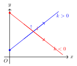
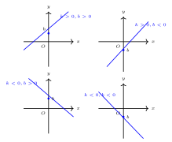
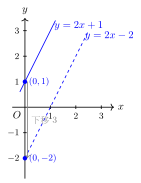

# 一次函数图象与性质

> **一例速记**：  
> $y = 2x - 1$（$k = 2 > 0$，$b = -1 < 0$）：图象是一条**向右上倾斜**的直线，$y$ 随 $x$ 增大而**增大**；  
> 与 $y$ 轴交于 $(0, -1)$，与 $x$ 轴交于 $\left(\dfrac{1}{2}, 0\right)$；图象经过**第一、三、四**象限。  
> 口诀：$k > 0$ 右上倾，$b < 0$ 下移，绕开第二象限。

---

## 一、引入：什么是一次函数？

一辆汽车以 $60$ km/h 的速度匀速行驶，已行驶时间为 $x$ 小时，路程 $y = 60x$（km）。

又比如：租用场地，固定费用 $200$ 元，每小时另收 $30$ 元，租用 $x$ 小时的总费用 $y = 30x + 200$。

这两个例子中，$y$ 与 $x$ 的关系都是"$y$ 等于 $x$ 的一次式"——这类函数，我们叫它**一次函数**。

---

## 二、一次函数的定义

**定义**：形如

$$\boxed{y = kx + b \quad (k \neq 0)}$$

的函数，叫做 $x$ 的**一次函数**（linear function）。其中 $k$ 叫做**斜率**（或一次项系数），$b$ 叫做**纵截距**（常数项）。

**两种特殊情形**：

- $b = 0$ 时：$y = kx$（$k \neq 0$），称为**正比例函数**。这是一次函数的特殊情况。
- $k = 0$ 时：$y = b$，是一个常数——这**不是**一次函数（称为常数函数），所以 $k \neq 0$ 是必要条件。

**注意**：$k \neq 0$ 是一次函数定义的核心条件，不能忘记！

---

## 三、一次函数的图象

**结论**：一次函数 $y = kx + b$ 的图象是一条**直线**。

**画图方法（两点法）**：直线由两点确定，取两个特殊点：

- 令 $x = 0$，得 $y = b$，点 $(0, b)$（直线与 $y$ 轴的交点）；
- 令 $y = 0$，得 $x = -\dfrac{b}{k}$，点 $\left(-\dfrac{b}{k}, 0\right)$（直线与 $x$ 轴的交点）。

连接这两点，画直线，即得图象。

**示例**：画 $y = 2x - 4$ 的图象。

令 $x = 0$：$y = -4$，点 $(0, -4)$；令 $y = 0$：$2x = 4$，$x = 2$，点 $(2, 0)$。  
过 $(0, -4)$ 和 $(2, 0)$ 画直线，即为 $y = 2x - 4$ 的图象。

---

## 四、截距

**截距**：直线与坐标轴的交点横/纵坐标。

- **纵截距**：直线与 $y$ 轴的交点的纵坐标，即令 $x = 0$ 得到的 $y$ 值。  
  对 $y = kx + b$，纵截距 $= b$。
- **横截距**：直线与 $x$ 轴的交点的横坐标，即令 $y = 0$ 得到的 $x$ 值。  
  对 $y = kx + b$，令 $kx + b = 0$，得横截距 $= -\dfrac{b}{k}$（$k \neq 0$）。

**记忆**：纵截距就是 $b$；横截距是 $-\dfrac{b}{k}$（负的 $\dfrac{b}{k}$）。

---

## 五、一次函数的性质（按 $k$ 的符号）

一次函数的核心性质由 $k$ 的符号决定：

### $k > 0$（斜率为正）

- 图象**从左下到右上**倾斜（向右上方延伸）；
- $y$ 随 $x$ 的增大而**增大**——称为**单调递增**；
- 即：$x_1 < x_2$ 时，$f(x_1) < f(x_2)$。

### $k < 0$（斜率为负）

- 图象**从左上到右下**倾斜（向右下方延伸）；
- $y$ 随 $x$ 的增大而**减小**——称为**单调递减**；
- 即：$x_1 < x_2$ 时，$f(x_1) > f(x_2)$。

**口诀**：$k$ 正升，$k$ 负降（$k$ 正则函数递增，$k$ 负则函数递减）。

---

## 六、图象经过的象限（按 $k$、$b$ 双重符号）

判断一次函数图象经过哪些象限，需要同时看 $k$ 和 $b$ 的符号：

| $k$ 的符号 | $b$ 的符号 | 倾斜方向 | 纵截距位置 | 经过象限 |
|-----------|-----------|---------|-----------|---------|
| $k > 0$ | $b > 0$ | 右上倾 | $y$ 轴正半轴上 | 第一、二、三象限 |
| $k > 0$ | $b < 0$ | 右上倾 | $y$ 轴负半轴上 | 第一、三、四象限 |
| $k > 0$ | $b = 0$ | 右上倾，过原点 | 原点 | 第一、三象限 |
| $k < 0$ | $b > 0$ | 右下倾 | $y$ 轴正半轴上 | 第一、二、四象限 |
| $k < 0$ | $b < 0$ | 右下倾 | $y$ 轴负半轴上 | 第二、三、四象限 |
| $k < 0$ | $b = 0$ | 右下倾，过原点 | 原点 | 第二、四象限 |

**记忆技巧**：
- $k > 0$：图象向右上，必过一、三象限；$b > 0$ 则还过二象限，$b < 0$ 则还过四象限；
- $k < 0$：图象向右下，必过二、四象限；$b > 0$ 则还过一象限，$b < 0$ 则还过三象限；
- $b = 0$：图象过原点，只过对角的两个象限（一三或二四）。

---

## 七、平移规律

已知一次函数 $y = kx + b$，若对图象进行平移：

**上下平移**：将图象**向上**平移 $m$ 个单位（$m > 0$），得到新函数：
$$y = kx + b + m$$
即把常数项加上 $m$（$b$ 变大）。向下平移 $m$ 单位则减去 $m$：$y = kx + b - m$。

**左右平移**：将图象**向左**平移 $m$ 个单位，得到新函数：
$$y = k(x + m) + b = kx + km + b$$
即把 $x$ 替换为 $x + m$。向右平移 $m$ 单位则 $x$ 替换为 $x - m$：$y = k(x - m) + b$。

**规律口诀**：
- 上加下减（纵截距变化）；
- 左加右减（$x$ 里面加减，注意是替换 $x$，不是改变 $b$）。

**示例**：$y = 2x + 1$ 向下平移 $3$ 单位：$y = 2x + 1 - 3 = 2x - 2$。

斜率 $k = 2$ 不变，$b$ 从 $1$ 变为 $-2$。

---

## 八、应用例题

### 例 1　判断图象经过的象限

判断 $y = -2x + 3$ 图象经过哪些象限。

**【思路】** 看 $k$ 和 $b$ 的符号，查表。

**解**：$k = -2 < 0$，$b = 3 > 0$。

由表格，$k < 0$，$b > 0$：图象经过**第一、二、四**象限。

**验证**：
- 纵截距 $b = 3 > 0$：直线与 $y$ 轴交于 $(0, 3)$，在第一、二象限分界处偏正；
- 横截距 $= -\dfrac{b}{k} = -\dfrac{3}{-2} = \dfrac{3}{2} > 0$：直线与 $x$ 轴交于 $\left(\dfrac{3}{2}, 0\right)$，在正半轴。
- 图象从左上（第二象限）到右下（第四象限），经过 $y$ 轴上方的点，因此过第一、二、四象限。✓

---

### 例 2　由两点求 $k$、$b$

已知一次函数图象经过 $(1, 0)$ 和 $(0, -2)$，求函数解析式。

**【思路】** 设 $y = kx + b$，代入两点，列方程组求解。

**解**：设 $y = kx + b$。

代入 $(0, -2)$：$-2 = k \cdot 0 + b$，得 $b = -2$。

代入 $(1, 0)$：$0 = k \cdot 1 + b = k - 2$，得 $k = 2$。

故函数解析式为 $y = 2x - 2$。

**验证**：代入 $(1, 0)$：$2 \times 1 - 2 = 0$ ✓；代入 $(0, -2)$：$2 \times 0 - 2 = -2$ ✓。

---

### 例 3　平移变换

将 $y = 2x + 1$ 向下平移 $3$ 个单位，得到新直线的函数解析式，并判断新直线经过哪些象限。

**【思路】** 向下平移 $m = 3$，新函数的常数项减 $3$。

**解**：

原函数 $y = 2x + 1$，向下平移 $3$ 单位：

$$y = 2x + 1 - 3 = 2x - 2$$

新函数 $k = 2 > 0$，$b = -2 < 0$：由表格，经过**第一、三、四**象限。

---

## 九、易错点总结

**易错点 1：$k \neq 0$ 是一次函数的必要条件**

若 $k = 0$，则 $y = b$ 是常数函数（水平直线），不是一次函数。判断时要先确认 $k$ 是否可能为零（特别是含参数时）。

**易错点 2：$k$ 的符号决定"增减"，$b$ 的符号决定"截距位置"**

这两个信息**互相独立**，都要看。判断象限时必须同时考虑 $k$ 和 $b$，不能只看一个。

**易错点 3：平移方向与公式里加减的关系**

向上平移 → 常数项加正数；向下平移 → 常数项减正数。向左平移 → $x$ 换为 $(x + m)$；向右平移 → $x$ 换为 $(x - m)$。口诀"左加右减"指的是 $x$ 的括号里，与直觉相反，要特别小心。

**易错点 4：正比例函数 $y = kx$ 也是一次函数**

$b = 0$ 时，一次函数退化为正比例函数，图象过原点，只经过第一、三象限（$k > 0$）或第二、四象限（$k < 0$），不经过其他象限。

---

## 十、思考路标（条件反射训练）

1. **见 $y = kx + b$** → 立刻看 $k$ 的符号：正则递增（右上倾），负则递减（右下倾）。
2. **见"经过哪些象限"** → 看 $k, b$ 双重符号，查对照表。
3. **见两个点求一次函数** → 设 $y = kx + b$，列方程组，解 $k, b$（用"待定系数法"，详见下一章）。
4. **见"平移"** → 上下平移改 $b$，左右平移改 $x$。注意"左加右减"。
5. **见截距** → 纵截距直接读 $b$；横截距代 $y = 0$ 求 $x = -\dfrac{b}{k}$。
6. **见"正比例函数"** → $b = 0$，$y = kx$，图象过原点，判断象限只需看 $k$ 符号。

---

## 十一、自测题

**自测 1**（☆）

判断 $y = 3x - 5$ 图象经过哪些象限。

> 💡 提示：$k = 3 > 0$，$b = -5 < 0$，查象限对照表。

---

**自测 2**（☆）

写出 $y = -x + 4$ 的纵截距和横截距。

> 💡 提示：纵截距 $= b = 4$；横截距令 $y = 0$ 求 $x$：$-x + 4 = 0$，$x = 4$。

---

**自测 3**（☆☆）

一次函数图象经过 $(2, 3)$ 和 $(-1, -3)$，求函数解析式。

> 💡 提示：设 $y = kx + b$，代入两点列方程组，解 $k$ 和 $b$。

---

**自测 4**（☆☆）

将 $y = -3x + 2$ 向左平移 $1$ 个单位，得到新直线解析式，并判断新直线经过哪些象限。

> 💡 提示：向左平移 $1$ 单位，把 $x$ 换为 $x + 1$：$y = -3(x+1) + 2 = -3x - 1$。新函数 $k = -3 < 0$，$b = -1 < 0$，查表。

---

**回头看一眼"一例速记"**：

> $y = kx + b$（$k \neq 0$）——图象是直线；$k > 0$ 右上倾递增，$k < 0$ 右下倾递减；  
> 纵截距 $= b$，横截距 $= -\dfrac{b}{k}$；  
> 判断象限：$k$、$b$ 双重符号一起看，不能只顾一头。
