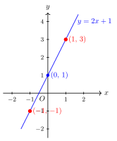

# 待定系数法求一次函数解析式

> **一例速记**：  
> 设 $y = kx + b$，代入两个已知点 → 列二元一次方程组 → 解出 $k, b$ → 写出解析式。  
> **两点定一线**：确定一条直线，只需已知它上面的两个点。

---

## 一、引入：一道看似很直接的题

> 已知一次函数图象经过 $(1, 3)$ 和 $(-1, -1)$，求函数解析式。

先停下来，想一想你会怎么做。

直接猜？试着套公式？——一次函数 $y = kx + b$ 有两个未知量 $k$ 和 $b$，光凭一个条件根本不够，至少要有两个条件才能把两个未知量都确定下来。

而两个点，恰好提供了两个条件——这就是这道题的解题入口。

---

## 二、思维路径还原（解题者的内心独白）

> 题目给了两个点 $(1, 3)$ 和 $(-1, -1)$，还告诉我这是**一次函数**。
>
> **已知条件分析**：函数类型（一次函数 $y = kx + b$）已知，但 $k$ 和 $b$ 未知；两个点的坐标已知。  
> 两个未知量 + 两个条件 = 可以列方程组来解。
>
> **第一步：设**——既然是一次函数，就设 $y = kx + b$。这一步看起来是废话，但必须写，因为它明确了"我要求的是什么"。
>
> **第二步：代点列方程组**——把两个点分别代入 $y = kx + b$：  
> 代入 $(1, 3)$（即 $x = 1$ 时 $y = 3$）：$3 = k \cdot 1 + b$，整理得 $k + b = 3$ …… ①  
> 代入 $(-1, -1)$（即 $x = -1$ 时 $y = -1$）：$-1 = k \cdot (-1) + b$，整理得 $-k + b = -1$ …… ②
>
> **第三步：解方程组**——①和②联立：  
> ① + ②：$(k + b) + (-k + b) = 3 + (-1)$，得 $2b = 2$，所以 $b = 1$。  
> 代回①：$k + 1 = 3$，得 $k = 2$。
>
> **第四步：写解析式**——$k = 2$，$b = 1$，所以函数解析式为 $y = 2x + 1$。
>
> **第五步：验证**——代回两点：  
> $x = 1$：$y = 2 \times 1 + 1 = 3$ ✓；$x = -1$：$y = 2 \times (-1) + 1 = -1$ ✓。
>
> **关键反射确立**：见到"已知两点 + 函数类型，求解析式"——立刻设通式 $y = kx + b$，代两点列方程组，解出 $k, b$。  
> 这个套路叫**待定系数法**：先"待定"（暂时不知道）系数 $k$ 和 $b$，用条件把它们"确定"下来。

---

## 三、抽象成方法

### 待定系数法的本质

**待定系数法**：根据函数的类型（通式结构）先把解析式"形式上写出来"，系数留作未知数；再利用已知条件（点的坐标、截距、斜率等）建立方程或方程组，求出这些未知系数。

### 一次函数的 4 步流程

$$\text{设} \xrightarrow{\text{写通式}} \text{代} \xrightarrow{\text{代入已知点}} \text{解} \xrightarrow{\text{解方程组}} \text{写（含验证）}$$

**第 1 步——设**：写出函数通式。
- 一次函数：设 $y = kx + b$（$k \neq 0$）
- 正比例函数：设 $y = kx$（$k \neq 0$）——只有 1 个待定系数
- 反比例函数：设 $y = \dfrac{k}{x}$（$k \neq 0$）——只需 1 个点
- 二次函数：设 $y = ax^2 + bx + c$（$a \neq 0$）——需要 3 个点

**第 2 步——代**：将已知条件（通常是已知点的坐标）代入通式，**有几个待定系数，就需要代几个点**。

一次函数有 $k$、$b$ 两个待定系数 → 需要代入 **2 个点**。

**第 3 步——解**：由代入得到的方程（组），解出所有待定系数。

**第 4 步——写**：将求出的系数代回通式，写出完整解析式；再将题目中的已知点代入验证（验证步骤在考试中可写可不写，但养成习惯更好）。

---

## 四、方法变形

### 变形 1：正比例函数——只需 1 个点

正比例函数 $y = kx$（$b = 0$），只有一个待定系数 $k$。已知一个点 $(x_0, y_0)$（$x_0 \neq 0$），代入即得 $k = \dfrac{y_0}{x_0}$。

**示例**：正比例函数过 $(3, 6)$，求解析式。

设 $y = kx$，代入 $(3, 6)$：$6 = 3k$，解得 $k = 2$。解析式为 $y = 2x$。

### 变形 2：已知斜率 $k$——只需 1 个点求 $b$

若题目直接给出斜率（$k$ 已知），则通式 $y = kx + b$ 中只剩 $b$ 未知，代入 1 个点即可求 $b$。

**示例**：斜率 $k = 3$，图象过 $(1, 7)$，求解析式。

已知 $k = 3$，设 $y = 3x + b$，代入 $(1, 7)$：$7 = 3 \times 1 + b$，得 $b = 4$。解析式为 $y = 3x + 4$。

### 变形 3：平行 + 一个点

"与直线 $y = mx + n$ 平行"→ 两平行线**斜率相同**，即 $k = m$；再用一个已知点求 $b$。

**示例**：与 $y = 2x - 3$ 平行，且经过 $(0, 5)$，求解析式。

平行 → $k = 2$；代入 $(0, 5)$：$5 = 2 \times 0 + b$，得 $b = 5$。解析式为 $y = 2x + 5$。

### 变形 4：利用截距信息

- 若已知**纵截距**为 $b_0$（直线过 $(0, b_0)$）→ 直接有 $b = b_0$，再用一个点求 $k$。
- 若已知**横截距**为 $a_0$（直线过 $(a_0, 0)$）→ 代入 $x = a_0$，$y = 0$，列方程 $k a_0 + b = 0$。

**示例**：直线纵截距为 $-3$，过 $(2, 1)$，求解析式。

纵截距为 $-3$ → $b = -3$，设 $y = kx - 3$；代入 $(2, 1)$：$1 = 2k - 3$，得 $k = 2$。解析式为 $y = 2x - 3$。

---

## 五、思考路标（条件反射训练）

每一条，读到"看到就秒反应"的程度：

1. **见"求一次函数解析式"** → 立刻设 $y = kx + b$，待定系数法，**不要直接猜**。

2. **见"两个已知点"** → 列二元一次方程组：代两点，两式联立解 $k, b$。

3. **见"图象与坐标轴交点"** → 提示截距！  
   与 $y$ 轴交于 $(0, ?)$ → 纵截距，直接有 $b$；  
   与 $x$ 轴交于 $(?, 0)$ → 代入 $y = 0$ 得横截距，建立关于 $k, b$ 的方程。

4. **见"与某直线平行"** → 平行线斜率相同，$k$ 已知，只需一点求 $b$。

5. **见"正比例函数"** → $b = 0$，通式简化为 $y = kx$，一个点即可定 $k$。

6. **见"纵截距"（$y$ 轴交点）** → $b$ 直接读出，代入 $b$ 后只用一点求 $k$。

7. **列方程组时** → 两式相加或相减，选择消去哪个未知数，优先消去计算较繁的那个。

8. **最后一步** → 把求出的 $k, b$ 代回原式，再代入题目的已知点**验证**，确保无误。

---

## 六、应用例题

### 例 1　基础两点法（完整示范）

已知一次函数图象经过 $(1, 3)$ 和 $(-1, -1)$，求函数解析式。

**【思路】** 两点 + 一次函数 → 设 $y = kx + b$，代两点，列方程组。

**解**：

设一次函数解析式为 $y = kx + b$。

代入 $(1, 3)$：
$$3 = k + b \quad \cdots \text{①}$$

代入 $(-1, -1)$：
$$-1 = -k + b \quad \cdots \text{②}$$

①＋②：$2b = 2$，得 $b = 1$。

代入①：$k + 1 = 3$，得 $k = 2$。

因此，函数解析式为 $\boxed{y = 2x + 1}$。

**验证**：$x = 1$ 时，$y = 3$ ✓；$x = -1$ 时，$y = -1$ ✓。

---

### 例 2　利用截距求解析式

直线与 $x$ 轴交于 $(2, 0)$，与 $y$ 轴交于 $(0, -4)$，求一次函数解析式。

**【思路】** 两个截距就是两个已知点：$(2, 0)$ 和 $(0, -4)$。直接用两点法。

**解**：

设一次函数解析式为 $y = kx + b$。

代入 $(0, -4)$（纵截距）：
$$-4 = k \cdot 0 + b \quad \Rightarrow \quad b = -4$$

代入 $(2, 0)$（横截距）：
$$0 = 2k + b = 2k - 4 \quad \Rightarrow \quad k = 2$$

因此，函数解析式为 $\boxed{y = 2x - 4}$。

**【补充说明】** 纵截距点 $(0, b)$ 代入后，$b$ 的值直接读出，省去了解方程组的步骤——遇到图象过 $y$ 轴交点（纵截距已知）时，优先利用这个简化。

**验证**：$x = 2$ 时，$y = 4 - 4 = 0$ ✓；$x = 0$ 时，$y = -4$ ✓。

---

### 例 3　平行 + 一点

已知一次函数图象与 $y = 3x + 1$ 平行，且经过 $(0, 5)$，求函数解析式。

**【思路】** 平行 → 斜率相同 → $k = 3$ 已知；过 $(0, 5)$ 是纵截距 → $b = 5$。

**解**：

"与 $y = 3x + 1$ 平行"→ 斜率相同，$k = 3$（注意：平行线 $b$ 不同，否则两线重合）。

设解析式为 $y = 3x + b$。

代入 $(0, 5)$：
$$5 = 3 \times 0 + b \quad \Rightarrow \quad b = 5$$

因此，函数解析式为 $\boxed{y = 3x + 5}$。

**验证**：$k = 3 \neq 0$ ✓（是一次函数）；$b = 5 \neq 1$（与原直线 $b = 1$ 不同，确实平行不重合）✓；过 $(0, 5)$ ✓。

---

## 七、自测题

**自测 1**（☆）

已知一次函数过 $(0, 3)$ 和 $(2, 7)$，求函数解析式。

> 💡 提示：$(0, 3)$ 是纵截距，直接得 $b = 3$；再代 $(2, 7)$ 求 $k$。

---

**自测 2**（☆）

正比例函数图象过 $(-2, 6)$，求函数解析式。

> 💡 提示：设 $y = kx$（$b = 0$），代入 $(-2, 6)$，解 $k$。

---

**自测 3**（☆☆）

已知一次函数过 $(3, 1)$ 和 $(-1, 5)$，求函数解析式，并判断图象经过哪些象限。

> 💡 提示：列方程组：$\begin{cases} k + b = 1 \text{ (等等，代 }x=3) \\ \ldots \end{cases}$，解出 $k, b$ 后，查象限对照表。

---

**自测 4**（☆☆）

已知一次函数与 $y = -2x + 4$ 平行，且图象与 $x$ 轴交于 $(3, 0)$，求函数解析式。

> 💡 提示：平行 → $k = -2$；过 $(3, 0)$ 代入求 $b$：$0 = -2 \times 3 + b$。

---

**自测 5**（☆☆☆）

已知直线 $y = kx + b$ 经过第一、二、三象限，且满足 $k + b = 2$，你能确定这是哪条直线吗？若不能，给出 $k, b$ 的符号约束。

> 💡 提示：经过第一、二、三象限 → 查对照表，$k > 0$ 且 $b > 0$。结合 $k + b = 2$，$k, b$ 均为正数但不能唯一确定（无穷多解满足条件）。

---

**回头看一眼"一例速记"**：

> 设 $y = kx + b$ → 代入两点列方程组 → 解出 $k, b$ → 写解析式并验证。  
> 两点定一线，待定系数法的核心：先"设"通式，再用条件"定"系数。  
> 变形口诀：见平行取 $k$，见纵截距取 $b$，见正比例省 $b$，见一个点够时只设一个未知量。
