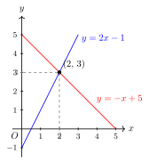
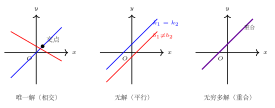
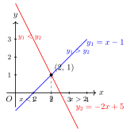

# 一次函数与方程（组）的几何意义

> **一例速记**：
>
> **代数 ↔ 几何** 桥梁：
>
> - 方程 $kx + b = 0$ 的解 $=$ 直线 $y = kx + b$ 与 $x$ 轴交点的横坐标
> - 方程组的解 $=$ 两条直线的**交点坐标**
> - 不等式 $kx + b > 0$ 的解集 $=$ 图象在 $x$ 轴**上方**的 $x$ 范围

---

## 一、引入题

> 用图象法解方程组 $\begin{cases} y = 2x - 1 \\ y = -x + 5 \end{cases}$。

请先尝试直接代数解法，再对比下面的几何思路，感受两种方法的联系。

---

## 二、思维路径还原（解题者的内心独白）

> "题目要求解方程组 $\begin{cases} y = 2x - 1 \\ y = -x + 5 \end{cases}$，先用代数做一遍，再用图象理解它。
>
> **代数解法**：两个方程的右边都等于 $y$，联立得 $2x - 1 = -x + 5$，移项：$3x = 6$，所以 $x = 2$，代回：$y = 2(2) - 1 = 3$。解是 $x = 2, y = 3$，即点 $(2, 3)$。
>
> **换一个角度看**：每个方程 $y = 2x - 1$ 和 $y = -x + 5$ 都是一条直线。一条直线上所有的点 $(x, y)$ 满足第一个方程；另一条直线上所有的点满足第二个方程。
>
> **方程组的解**，是**同时满足两个方程**的点——那就是两条直线的**公共点**！
>
> 两条直线在平面上相交，交点的坐标 $(x_0, y_0)$ 同时在两条线上，既满足 $y_0 = 2x_0 - 1$，又满足 $y_0 = -x_0 + 5$——这正是方程组的解！
>
> 所以图象法：画出 $y = 2x - 1$（经过 $(0, -1)$ 和 $(1, 1)$）和 $y = -x + 5$（经过 $(0, 5)$ 和 $(5, 0)$），找到交点 $(2, 3)$，就是方程组的解。
>
> **再往下想**：如果两条直线**平行**（斜率相同，截距不同）呢？平行线没有交点 → 方程组**无解**。如果两条直线**重合**呢？所有点都是交点 → 方程组有**无穷多解**。
>
> 还有一个方向：**方程 $f(x) = 0$ 的解**，就是函数 $y = f(x)$ 图象与 $x$ 轴（即 $y = 0$）的交点横坐标。同理，**不等式 $f(x) > 0$ 的解集**就是图象在 $x$ 轴上方的 $x$ 区间。
>
> **关键反射**：
> - 见方程组 → 想两直线，交点 $=$ 解
> - 见方程 $f(x) = 0$ → 想图象与 $x$ 轴的交点
> - 见不等式 $f(x) > g(x)$ → 想哪段 $x$ 让图象 $f$ 在图象 $g$ 的上方
> - 两个方向都能用：代数解 → 几何交点；几何交点 → 代数解"

---

## 三、抽象成方法

### 代数 ↔ 几何 核心对应关系

| 代数对象 | 几何对应 |
|---|---|
| 方程 $kx + b = 0$ 的解 | 直线 $y = kx + b$ 与 $x$ 轴交点的横坐标 |
| 方程组 $\begin{cases} y = k_1 x + b_1 \\ y = k_2 x + b_2 \end{cases}$ 的解 | 两条直线的**交点坐标** $(x_0, y_0)$ |
| 不等式 $kx + b > 0$ 的解集 | 直线 $y = kx + b$ 在 $x$ 轴**上方**的 $x$ 范围 |
| 不等式 $k_1 x + b_1 > k_2 x + b_2$ 的解集 | 直线 $y_1 = k_1 x + b_1$ 在直线 $y_2 = k_2 x + b_2$ **上方**的 $x$ 范围 |
| 方程组**无解** | 两直线**平行**（$k_1 = k_2$，$b_1 \neq b_2$）|
| 方程组**无穷多解** | 两直线**重合**（$k_1 = k_2$，$b_1 = b_2$）|

### 解的个数与直线位置关系对照

给定两条直线 $y = k_1 x + b_1$ 和 $y = k_2 x + b_2$：

| 情形 | 斜率关系 | 截距关系 | 方程组解的个数 | 几何含义 |
|---|---|---|---|---|
| 唯一解 | $k_1 \neq k_2$ | 任意 | $1$ 个 | 两直线相交 |
| 无解 | $k_1 = k_2$ | $b_1 \neq b_2$ | $0$ 个 | 两直线平行 |
| 无穷多解 | $k_1 = k_2$ | $b_1 = b_2$ | 无穷多 | 两直线重合 |

### 图象法解方程的操作步骤

1. **画直线**：每条方程画一条直线（取两个点：令 $x = 0$ 求 $y$ 截距，再取另一点）
2. **找交点**：图象上找到两线相交的点（准确读取坐标）
3. **写答案**：交点 $(x_0, y_0)$ 即方程组的解 $x = x_0$，$y = y_0$
4. **代回验证**：将 $(x_0, y_0)$ 代入两个方程，核对均成立

---

## 四、方法变形

### 变形 1：判断方程组解的个数

不需要真正画图，只需比较两直线的斜率 $k_1, k_2$ 与截距 $b_1, b_2$：

- $k_1 \neq k_2$ → **唯一解**（两直线必然相交）
- $k_1 = k_2$ 且 $b_1 \neq b_2$ → **无解**（平行，永不相交）
- $k_1 = k_2$ 且 $b_1 = b_2$ → **无穷多解**（两式其实是同一个方程，重合）

**注意**：比较 $k$ 时，先把方程化为 $y = kx + b$ 的标准形式。

### 变形 2：图象法解不等式

解 $f(x) > g(x)$（两个一次函数之差的不等式）：

1. 分别画 $y = f(x)$ 和 $y = g(x)$ 两条直线
2. 找两线交点 $x_0$（解 $f(x_0) = g(x_0)$）
3. 根据图象，判断 $x > x_0$ 还是 $x < x_0$ 时，$f(x)$ 的图象在 $g(x)$ 上方
4. 那个区间就是不等式的解集

### 变形 3：反向应用——由交点反推参数

题目给出"两直线交于点 $(a, b)$"，则 $(a, b)$ 同时满足两条直线的方程，代入可求参数。

---

## 五、思考路标（条件反射训练）

读每一条，练到"看到就秒反应"：

1. **见方程组 $\begin{cases} y = f(x) \\ y = g(x) \end{cases}$** → 想象**两条直线**，代数解 $=$ 几何上的**交点坐标**；两个方向都能跑。

2. **见方程 $kx + b = 0$ 求解** → 等价于求直线 $y = kx + b$ 与 $x$ 轴的交点横坐标，代入 $y = 0$ 即可。

3. **见不等式 $f(x) > g(x)$** → 转化为"哪段 $x$ 让直线 $f$ 在直线 $g$ **上方**"，找交点后看图象的左右位置。

4. **见"方程组无解"** → 立刻想**两直线平行**，即 $k_1 = k_2$，$b_1 \neq b_2$；可以不解方程组，直接比较系数判断。

5. **见"方程组无穷多解"** → 立刻想**两直线重合**，两个方程是同一方程的倍数，$k_1 = k_2$ 且 $b_1 = b_2$。

6. **见图象交点 + 题问参数** → 交点坐标代入含参方程，解参数——这是"形 → 数"的典型反向应用。

7. **数形结合是中考填空 / 选择题的加速器**：正面代数算法繁琐时，先画粗略草图定性判断，节省时间。

---

## 六、应用例题

### 例 1　图象法解方程组

用图象法解方程组 $\begin{cases} y = 2x - 1 \\ y = -x + 5 \end{cases}$。

【思路】画两条直线，找交点。

**解**：

**画 $y = 2x - 1$**：

令 $x = 0$：$y = -1$，得点 $(0, -1)$；令 $x = 1$：$y = 1$，得点 $(1, 1)$。

**画 $y = -x + 5$**：

令 $x = 0$：$y = 5$，得点 $(0, 5)$；令 $x = 5$：$y = 0$，得点 $(5, 0)$。

**找交点**：

代数验证——联立 $2x - 1 = -x + 5$，得 $3x = 6$，$x = 2$，$y = 3$。

两条直线的交点为 $(2, 3)$。

**验证**：

代入方程 1：$y = 2(2) - 1 = 3$ ✓

代入方程 2：$y = -2 + 5 = 3$ ✓

**答**：方程组的解为 $x = 2$，$y = 3$。

---

### 例 2　已知交点求参数

直线 $l_1: y = 2x + a$ 与直线 $l_2: y = -x + 1$ 相交于点 $(b, 0)$（即 $y$ 坐标为 $0$ 的点）。求 $a$ 的值。

【思路】$(b, 0)$ 是两线的交点，同时满足两个方程；$y = 0$ 代入 $l_2$ 先求 $b$，再代入 $l_1$ 求 $a$。

**解**：

点 $(b, 0)$ 在 $l_2: y = -x + 1$ 上，代入 $y = 0$：

$$0 = -b + 1 \implies b = 1$$

所以交点为 $(1, 0)$。

点 $(1, 0)$ 在 $l_1: y = 2x + a$ 上，代入：

$$0 = 2(1) + a \implies a = -2$$

**答**：$a = -2$。

**验证**：$l_1: y = 2x - 2$，$l_2: y = -x + 1$，联立 $2x - 2 = -x + 1$，得 $x = 1, y = 0$，交点 $(1, 0)$ ✓

---

### 例 3　图象法解不等式

已知 $y_1 = x - 1$，$y_2 = -2x + 5$。

（1）解方程 $y_1 = y_2$；（2）解不等式 $y_1 > y_2$；（3）解不等式 $y_1 < y_2$。

【思路】先找两直线交点（解方程），再根据图象判断不等式的解集。

**解**：

**（1）** 解 $y_1 = y_2$，即 $x - 1 = -2x + 5$：

$$3x = 6 \implies x = 2$$

两直线交于 $x = 2$（此时 $y_1 = y_2 = 1$，交点 $(2, 1)$）。

**（2）** 解 $y_1 > y_2$，即 $x - 1 > -2x + 5$：

分析图象：$y_1 = x - 1$（斜率 $+1$，向右上）；$y_2 = -2x + 5$（斜率 $-2$，向右下）。

交点为 $x = 2$：
- $x > 2$ 时：$y_1 = x - 1$ 的值比 $y_2 = -2x + 5$ 大（斜率更大的直线在交点右侧更高）
- $x < 2$ 时：$y_1 < y_2$

代数验证：$x - 1 > -2x + 5 \Rightarrow 3x > 6 \Rightarrow x > 2$ ✓

$y_1 > y_2$ 的解集为 $\boxed{x > 2}$。

**（3）** 同理，$y_1 < y_2$ 的解集为 $\boxed{x < 2}$。

**小结**：三个问题的分界点都是 $x = 2$（两直线交点的横坐标）。

---

## 七、自测题

**自测 1**　不解方程组，判断下列方程组解的个数：

（1）$\begin{cases} y = 3x + 2 \\ y = 3x - 1 \end{cases}$；（2）$\begin{cases} y = x + 4 \\ y = -2x + 1 \end{cases}$；（3）$\begin{cases} 2x - y = 3 \\ 4x - 2y = 6 \end{cases}$。

> 💡 提示：（1）斜率相同 $k = 3$，截距不同（2 和 $-1$），平行，**无解**；（2）斜率不同（$1$ 和 $-2$），相交，**唯一解**；（3）化标准形：第二个方程除以 $2$ 得 $2x - y = 3$，与第一个完全相同，**无穷多解**（重合）。

**自测 2**　直线 $y = kx + 2$ 与直线 $y = -3x + b$ 交于点 $(-1, 5)$，求 $k, b$ 的值。

> 💡 提示：将 $(-1, 5)$ 代入两方程：$5 = -k + 2 \Rightarrow k = -3$；$5 = 3 + b \Rightarrow b = 2$。

**自测 3**　已知 $y_1 = 2x - 3$，$y_2 = -x + 3$。（1）解方程 $y_1 = y_2$；（2）求满足 $y_1 < y_2$ 的 $x$ 的范围。

> 💡 提示：（1）$2x - 3 = -x + 3 \Rightarrow 3x = 6 \Rightarrow x = 2$；（2）$2x - 3 < -x + 3 \Rightarrow 3x < 6 \Rightarrow x < 2$。

**自测 4**　方程组 $\begin{cases} y = ax - 3 \\ y = 2x + b \end{cases}$ 无解，且两直线都过点 $(c, 1)$。求 $a$，$b$，$c$ 的值。

> 💡 提示：无解 → 平行 → $a = 2$，$b \neq -3$。过 $(c, 1)$：代入 $y = 2x - 3$：$1 = 2c - 3$，$c = 2$；代入 $y = 2x + b$：$1 = 4 + b$，$b = -3$。但 $b = -3$ 与无解条件 $b \neq -3$ 矛盾——说明两线不能同时过同一点且平行（否则重合），题目设置值需满足：若确定 $a = 2$，则 $b \neq -3$ 且同时过某公共点不可能（平行线没有公共点），检查题意为"各自"过某点而非共同过。

**自测 5**　一次函数 $y_1 = 2x + m$ 与 $y_2 = -x + n$ 交于 $x$ 轴上的点。求 $m, n$ 满足的关系式，并说明交点坐标。

> 💡 提示：交于 $x$ 轴上的点意味着交点 $y$ 坐标为 $0$，即 $y = 0$。由 $y_1 = 0$：$x = -\dfrac{m}{2}$；由 $y_2 = 0$：$x = n$。两式相等：$-\dfrac{m}{2} = n$，即 $m + 2n = 0$。交点为 $(n, 0)$（即 $\left(-\dfrac{m}{2}, 0\right)$）。
