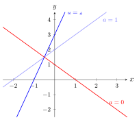

# 含参一次函数

> **一例速记**：
>
> 含参一次函数 $y = (k-1)x + 2k - 3$——看到参数立刻问 3 个问题：
>
> ① 何时是**一次函数**？（令 $x$ 的系数 $\neq 0$，即 $k \neq 1$）
>
> ② 图象**经过哪些象限**？（按 $k-1$ 与 $2k-3$ 的符号分类讨论）
>
> ③ 是否**经过定点**？（整理 $y = k(\ldots) + (\ldots)$，令 $k$ 的系数 $= 0$，找固定点）

---

## 一、引入题

> 函数 $y = (k-2)x + 2k$，当 $k$ 为何值时：
>
> （1）函数是一次函数？（2）图象经过点 $(1, 8)$？（3）图象经过哪些象限（以某个 $k$ 值为例）？

请先停下来自己尝试，再读下面的思路还原。

---

## 二、思维路径还原（解题者的内心独白）

> "函数 $y = (k-2)x + 2k$——一看就是含参函数，$k$ 是参数，$x$ 是变量。
>
> **第一问：什么时候是一次函数？**
>
> 一次函数要求 $y = kx + b$ 中 $x$ 的系数**不为零**。这里 $x$ 的系数是 $k - 2$，所以需要 $k - 2 \neq 0$，即 $k \neq 2$。
>
> 当 $k = 2$ 时，函数退化为 $y = 0 \cdot x + 4 = 4$——常函数（水平直线），不再是一次函数。
>
> **结论**：$k \neq 2$ 时是一次函数。
>
> **第二问：图象经过点 $(1, 8)$？**
>
> 点在图象上 → 坐标满足方程。代入 $x = 1, y = 8$：
>
> $8 = (k-2)(1) + 2k = k - 2 + 2k = 3k - 2$
>
> $3k = 10$，$k = \dfrac{10}{3}$。
>
> 验证：$k = \dfrac{10}{3} \neq 2$，确实是一次函数 ✓。
>
> **第三问：图象经过哪些象限？**
>
> 一次函数图象经过的象限由**斜率 $k_{\text{slope}} = k - 2$** 和**截距 $b = 2k$** 的符号决定。
>
> 我需要分情形讨论（$k - 2$ 和 $2k$ 各有正负零三种情形，但要排除 $k = 2$）：
>
> 设 $a = k - 2$（斜率），$B = 2k$（截距）。$B = 2k = 2(a + 2) = 2a + 4$。
>
> **情形一：$k > 2$**（即 $a > 0$，$B = 2k > 4 > 0$）：斜率正、截距正 → 经过第一、二、三象限。
>
> **情形二：$0 < k < 2$**（即 $a = k - 2 < 0$，$B = 2k > 0$）：斜率负、截距正 → 经过第一、二、四象限。
>
> **情形三：$k = 0$**（即 $a = -2 < 0$，$B = 0$）：斜率负、截距零 → 经过第二、四象限（正比例函数方向，但斜率为负）。
>
> **情形四：$k < 0$**（即 $a = k - 2 < 0$，$B = 2k < 0$）：斜率负、截距负 → 经过第二、三、四象限。
>
> **关键反射**：
>
> 见含参一次函数 → 第一时间列出 3 个检查项：是否一次（系数 $\neq 0$）、过特定点（代入求参）、过哪些象限（分类讨论双重符号）。
>
> 验证总要回头：求出参数后代回检查是否满足'一次函数'前提。"

---

## 三、抽象成方法

### 含参一次函数的 4 类标准问题

**第 1 类：判断是否为一次函数**

一次函数要求 $y = kx + b$ 形式，$x$ 的系数**严格不为零**。

- 给定含参函数 $y = (m + n)x + c$，令 $m + n \neq 0$ → 解出 $m$ 的禁止值。
- 若参数使系数为零，函数退化为常函数（$y = c$），不是一次函数。
- **特别警惕**：$y = (k-1)x^2 + (k+1)x + 1$ 要是一次函数，需要**二次项系数为零** $k - 1 = 0$ **且**一次项系数不为零——这样才从"二次降为一次"。

**第 2 类：图象经过某点**

将已知点 $(x_0, y_0)$ 代入函数解析式，得到关于参数的方程，解出参数，并回代验证是否满足"是一次函数"的前提。

**步骤**：
1. 代入 $x = x_0, y = y_0$
2. 整理为关于参数的方程，解参数
3. 验证参数是否使 $x$ 系数 $\neq 0$

**第 3 类：图象经过哪些象限**

一次函数图象经过的象限由**斜率**（$x$ 的系数）和 **$y$ 轴截距**（常数项）的符号决定：

| 斜率 | 截距 | 经过象限 |
|---|---|---|
| $> 0$ | $> 0$ | 一、二、三 |
| $> 0$ | $= 0$ | 一、三（过原点） |
| $> 0$ | $< 0$ | 一、三、四 |
| $< 0$ | $> 0$ | 一、二、四 |
| $< 0$ | $= 0$ | 二、四（过原点） |
| $< 0$ | $< 0$ | 二、三、四 |

含参时，斜率和截距都含参数，需要**按参数的取值范围分情形讨论**，每种情形对应一个象限组合。

分情形的关键节点：令斜率等于零（找临界 $k$ 值），令截距等于零（找另一临界 $k$ 值），以这两个值为分界点分若干区间讨论。

**第 4 类：过定点问题**

若对**任意参数值**函数图象都经过某个固定点，该点叫**定点**。

**方法**：将函数整理为 $y = k \cdot f(x) + g(x)$ 的形式（$k$ 是参数，$f(x), g(x)$ 不含 $k$），令 $f(x) = 0$，解出 $x$ 的值，代回求 $y$，得定点 $(x_0, g(x_0))$。

**直觉**：定点是"当 $k$ 的系数为零时，$k$ 对 $y$ 没有贡献"的点——无论 $k$ 取什么值，该点的 $y$ 值始终是 $g(x_0)$。

---

## 四、方法变形

### 变形 1：含参函数的平行条件

两条直线 $y = (m + 1)x + 3$ 与 $y = 3x - 1$ 平行，则斜率相等：

$$m + 1 = 3 \implies m = 2$$

还需验证截距不同：$3 \neq -1$（不重合）✓，故 $m = 2$ 时两线平行。

**注意**：如果求出参数后两线重合（截距也相等），说明设平行导致了矛盾——实际情况是重合，不是平行。

### 变形 2：截距含参——$x$ 轴 / $y$ 轴截距的范围

若 $y = kx + 2k - 1$，$x$ 轴截距为 $x = -\dfrac{b}{k} = -\dfrac{2k-1}{k}$，当参数 $k$ 变化时，截距也变化。题目可要求"截距大于 $0$"等条件，此时转化为关于 $k$ 的不等式。

---

## 五、思考路标（条件反射训练）

读每一条，练到"看到就秒反应"：

1. **见含参一次函数** → 第一件事：确认 **$x$ 的系数是否含参**。若含参，令系数 $\neq 0$ 求出参数的禁止值；若系数恒非零，可直接分析性质。

2. **见"图象经过某点 $(a, b)$"** → 立刻**代入坐标**，得到关于参数的方程，解参数，**验证**是否满足一次函数的前提（系数 $\neq 0$）。

3. **见"图象经过哪些象限"** → 分两步：①斜率符号决定单调性（正 → 左下右上，负 → 左上右下）；②截距符号决定与 $y$ 轴交点在 $x$ 轴上方还是下方。**两个符号都要看**，然后按照参数取值**分情形**。

4. **见"对任意 $k$ 恒过定点"** → 整理函数为 $y = k \cdot f(x) + g(x)$，令 $f(x) = 0$，解出 $x$ 即定点横坐标，代入求 $y$。这是"让 $k$ 的系数消失"的技巧。

5. **含参题答案多为分类讨论格式**：不同参数区间对应不同结论，答案写成"当 … 时，…；当 … 时，…"的分条形式，不能合并成一句话。

6. **验证总要回头**：求出参数后，代回原函数检查是否仍满足"一次函数"定义（$x$ 系数 $\neq 0$），以及是否符合题意（如经过的点确实在图象上）。

---

## 六、应用例题

### 例 1　含参经过点

函数 $y = (2k + 1)x + k - 3$ 的图象经过点 $(1, 5)$，求 $k$ 的值，并判断此时函数是否为一次函数。

【思路】代入 $(1, 5)$，解出 $k$，再验证 $x$ 系数是否非零。

**解**：

将 $x = 1, y = 5$ 代入：

$$5 = (2k + 1)(1) + k - 3 = 2k + 1 + k - 3 = 3k - 2$$

$$3k = 7 \implies k = \frac{7}{3}$$

**验证**：$k = \dfrac{7}{3}$ 时，$x$ 的系数 $= 2k + 1 = \dfrac{14}{3} + 1 = \dfrac{17}{3} \neq 0$，是一次函数 ✓。

**答**：$k = \dfrac{7}{3}$ 时，函数为 $y = \dfrac{17}{3}x + \dfrac{7}{3} - 3 = \dfrac{17}{3}x - \dfrac{2}{3}$，是一次函数。

---

### 例 2　过定点

证明：无论 $k$ 取何实数值，函数 $y = kx + 2k - 1$ 的图象都经过同一个定点，并求出该定点坐标。

【思路】将函数整理为含 $k$ 的形式，令 $k$ 的"系数"为零，求定点。

**解**：

整理：

$$y = kx + 2k - 1 = k(x + 2) + (-1)$$

这是关于 $k$ 的一次式（当 $x \neq -2$ 时）。

要使 $y$ 与 $k$ 无关（无论 $k$ 取何值 $y$ 都固定），令 $k$ 的系数为零：

$$x + 2 = 0 \implies x = -2$$

代入求 $y$：

$$y = k(-2) + 2k - 1 = -2k + 2k - 1 = -1$$

所以，无论 $k$ 取何值，点 $(-2, -1)$ 恒在图象上。

**证明**：对任意 $k$，代入 $x = -2$：$y = k(-2) + 2k - 1 = -1$，恒成立 ✓。

**答**：定点为 $(-2, -1)$。

---

### 例 3　两直线平行求参数

已知直线 $y = (m + 1)x - 2$ 与直线 $y = 3x + 1$ 平行，求 $m$ 的值。

【思路】平行 → 斜率相等且截距不等；截距已明显不同，直接令斜率相等即可。

**解**：

两直线平行，则斜率相等：

$$m + 1 = 3 \implies m = 2$$

**验证截距**：当 $m = 2$ 时，$l_1: y = 3x - 2$；$l_2: y = 3x + 1$。截距分别为 $-2$ 和 $1$，不相等，故两线平行（不重合）✓。

**答**：$m = 2$ 时，两直线平行。

---

### 补充例 4　图象经过象限的完整讨论

函数 $y = (k - 1)x + 2k - 3$（$k \neq 1$）的图象经过哪些象限？（按 $k$ 的取值范围分类讨论）

【思路】斜率 $= k - 1$，截距 $= 2k - 3$。令各为零求临界值：$k = 1$（已排除）和 $k = \dfrac{3}{2}$。

**解**：

- **斜率** $a = k - 1$：$k > 1$ 时 $a > 0$；$k < 1$ 时 $a < 0$（$k = 1$ 已排除）。
- **截距** $b = 2k - 3$：$k > \dfrac{3}{2}$ 时 $b > 0$；$k = \dfrac{3}{2}$ 时 $b = 0$；$k < \dfrac{3}{2}$ 时 $b < 0$。

综合分情形（$k \neq 1$）：

| 参数范围 | 斜率符号 | 截距符号 | 经过象限 |
|---|---|---|---|
| $k > \dfrac{3}{2}$ | $+$（$k > 1$，故 $k > \dfrac{3}{2}$ 时 $k > 1$ 也成立） | $+$ | 一、二、三 |
| $k = \dfrac{3}{2}$ | $+$（$\dfrac{3}{2} > 1$） | $0$ | 一、三（过原点） |
| $1 < k < \dfrac{3}{2}$ | $+$ | $-$ | 一、三、四 |
| $k < 1$ | $-$ | $2k - 3 < -1 < 0$，即 $-$ | 二、三、四 |

**注意**：$k < 1$ 时必然 $2k - 3 < 2(1) - 3 = -1 < 0$，截距恒负，无需再分。

**答**：
- $k > \dfrac{3}{2}$ 时，图象经过第一、二、三象限；
- $k = \dfrac{3}{2}$ 时，图象经过第一、三象限（过原点的正斜率直线）；
- $1 < k < \dfrac{3}{2}$ 时，图象经过第一、三、四象限；
- $k < 1$ 时，图象经过第二、三、四象限。

---

## 七、自测题

**自测 1**　函数 $y = (a - 3)x + a^2 - 9$。（1）何时为一次函数？（2）何时图象过原点？

> 💡 提示：（1）$a - 3 \neq 0 \Rightarrow a \neq 3$；（2）过原点时截距为零：$a^2 - 9 = 0 \Rightarrow a = \pm 3$，但 $a \neq 3$（需一次函数），故 $a = -3$（验证：斜率 $= -3 - 3 = -6 \neq 0$ ✓）。

**自测 2**　函数 $y = (k + 2)x + 3k - 6$ 的图象经过第二象限，求 $k$ 的取值范围。

> 💡 提示：过第二象限需要**斜率 $< 0$ 且截距 $> 0$**（情形：一、二、四象限），**或斜率 $> 0$ 且截距 $> 0$**（情形：一、二、三象限），**或斜率 $< 0$ 且截距 $= 0$**（情形：二、四象限）。综合：截距 $3k - 6 > 0$ 时（$k > 2$）无论斜率符号都过二象限；截距 $\leq 0$（$k \leq 2$）时，需斜率 $< 0$（$k < -2$）。故 $k < -2$ 或 $k > 2$。（需排除 $x$ 系数为零：$k = -2$ 时恰好斜率为零，退化为 $y = -12$，不过二象限。）

**自测 3**　证明：对任意实数 $k$，函数 $y = (2k + 1)x - 3k + 2$ 的图象恒经过某定点，并求该定点。

> 💡 提示：整理为 $y = k(2x - 3) + (x + 2)$，令 $2x - 3 = 0 \Rightarrow x = \dfrac{3}{2}$，代入：$y = 0 + \dfrac{3}{2} + 2 = \dfrac{7}{2}$，定点为 $\left(\dfrac{3}{2}, \dfrac{7}{2}\right)$。

**自测 4**　直线 $y = (m^2 - 1)x + m + 1$（$m \neq \pm 1$）与直线 $y = 2x - 3$ 平行，求 $m$ 的值。

> 💡 提示：平行要求斜率相等：$m^2 - 1 = 2 \Rightarrow m^2 = 3 \Rightarrow m = \pm\sqrt{3}$。两值均满足 $m \neq \pm 1$，验证截距不等：当 $m = \sqrt{3}$ 时截距 $= \sqrt{3} + 1 \neq -3$ ✓；当 $m = -\sqrt{3}$ 时截距 $= -\sqrt{3} + 1 \neq -3$ ✓。故 $m = \sqrt{3}$ 或 $m = -\sqrt{3}$。

**自测 5**　函数 $y = (k^2 - k)x + k - 2$ 的图象经过 $(-1, 3)$，求 $k$ 的值，并判断此时函数是否为一次函数。

> 💡 提示：代入 $x = -1, y = 3$：$3 = -(k^2 - k) + k - 2 = -k^2 + k + k - 2 = -k^2 + 2k - 2$，即 $k^2 - 2k + 5 = 0$，判别式 $\Delta = 4 - 20 = -16 < 0$，**无实数解**——即不存在实数 $k$ 使函数图象经过 $(-1, 3)$。
