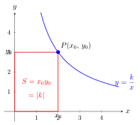
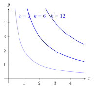

# 反比例函数 $k$ 的几何意义

> **一例速记**：  
> 反比例函数 $y = \frac{k}{x}$ 上任意点 $P(x_0, y_0)$，过 $P$ 分别作 $x$ 轴和 $y$ 轴的垂线，与坐标轴围成矩形 $OAPB$（$O$ 为原点，$A$ 在 $x$ 轴，$B$ 在 $y$ 轴）。  
> **矩形面积 $= |x_0| \cdot |y_0| = |x_0 y_0| = |k|$，与点 $P$ 的位置无关！**  
> 推论：连 $OP$ 后，$\triangle OAP$ 或 $\triangle OBP$ 的面积 $= \dfrac{|k|}{2}$。  
> 见"反比例函数 + 矩形/三角形面积" → 立刻想 $|k|$ 或 $\dfrac{|k|}{2}$。

---

## 一、引入：一道让你卡住的题

**题目**：已知反比例函数 $y = \dfrac{k}{x}$ 经过点 $P(2, 3)$。过点 $P$ 分别向 $x$ 轴和 $y$ 轴作垂线，垂足分别为 $A$ 和 $B$，$O$ 为原点。求矩形 $OAPB$ 的面积。

这道题初看没什么特别——不就是算个矩形面积吗？

但如果你把 $k$ 一算，然后再画图、再标坐标……你会花不少时间。更糟的是：你可能算完这题之后，看到下一道"经过 $P(5, 2)$，面积是多少"，又重算一遍，毫无规律可循。

**高效做法**是先把这道题吃透——它隐藏着一个关于 $k$ 的普遍规律。一旦你看见这个规律，以后遇到此类题，几秒钟内就能报出答案。

---

## 二、思维路径还原（解题者的内心独白）

> "$P(2, 3)$ 在 $y = \frac{k}{x}$ 上——先求 $k$。
>
> 代入：$k = x_P \cdot y_P = 2 \times 3 = 6$。
>
> 函数是 $y = \frac{6}{x}$，$k = 6$。
>
> 作图：过 $P(2, 3)$ 向 $x$ 轴作垂线，垂足 $A = (2, 0)$；向 $y$ 轴作垂线，垂足 $B = (0, 3)$。
>
> 矩形 $OAPB$：顶点依次是 $O(0,0)$，$A(2,0)$，$P(2,3)$，$B(0,3)$。
>
> 宽 $= OA = |2 - 0| = 2$，高 $= OB = |3 - 0| = 3$。
>
> 面积 $= 2 \times 3 = 6$。
>
> **等一等——面积就是 $k = 6$！这是巧合吗？**
>
> 设图象上任意点 $P(x_0, y_0)$，因为 $P$ 在图象上，$x_0 y_0 = k$。
>
> 矩形面积 $= |x_0| \times |y_0| = |x_0 y_0| = |k|$。
>
> **结论：矩形面积恒等于 $|k|$，与 $P$ 点的位置无关！**
>
> 再进一步——如果只过 $P$ 向 $x$ 轴作垂线，连 $OP$，形成 $\triangle OAP$：
>
> 底边 $OA = |x_0|$，高 $= |y_0|$（$P$ 距 $x$ 轴的距离）。
>
> $\triangle OAP$ 面积 $= \frac{1}{2} |x_0| \cdot |y_0| = \frac{|k|}{2}$。
>
> **关键反射**：见反比例函数 + 矩形面积 → 立刻报 $|k|$；见反比例函数 + 过点向一轴作垂线的三角形面积 → 立刻报 $\frac{|k|}{2}$。不需要知道 $P$ 的具体坐标，只需要知道 $k$！"

把这段独白读两遍，特别注意"矩形面积 = $|x_0 y_0|$ = $|k|$"这一步——这是整个几何意义的核心。

---

## 三、抽象成方法

### $k$ 的几何意义（两条必背结论）

设 $P(x_0, y_0)$ 是反比例函数 $y = \frac{k}{x}$ 图象上任意一点，过 $P$ 作两坐标轴的垂线，垂足分别为 $A$（$x$ 轴上）和 $B$（$y$ 轴上），$O$ 为原点。

**结论 1（矩形面积）**：

$$S_{\text{矩形} OAPB} = |x_0| \cdot |y_0| = |k|$$

**证明**：因为 $P$ 在图象上，$x_0 y_0 = k$，故 $|x_0 y_0| = |k|$，即 $|x_0| \cdot |y_0| = |k|$。$\square$

**结论 2（三角形面积）**：

$$S_{\triangle OAP} = S_{\triangle OBP} = \frac{1}{2} |k|$$

**证明**：
- $\triangle OAP$：底 $= OA = |x_0|$，高 $= PA = |y_0|$，面积 $= \frac{1}{2}|x_0||y_0| = \frac{|k|}{2}$。
- $\triangle OBP$：底 $= OB = |y_0|$，高 $= PB = |x_0|$，面积 $= \frac{1}{2}|y_0||x_0| = \frac{|k|}{2}$。$\square$

注意两个三角形面积相等，且都是矩形面积的一半——这是因为 $\triangle OAP$ 和 $\triangle OBP$ 都是矩形对角线分出来的两个三角形之一。

### 逆向应用

**已知面积求 $k$**：

$$S_{\text{矩形}} = |k| \Rightarrow k = \pm S_{\text{矩形}}$$

再结合象限（$k > 0$ 或 $k < 0$）确定符号。

$$S_{\triangle} = \frac{|k|}{2} \Rightarrow |k| = 2 S_{\triangle} \Rightarrow k = \pm 2S_{\triangle}$$

**统一流程**：

1. 看题目给的是矩形面积还是三角形面积
2. 矩形面积 $= |k|$；三角形面积 $= \frac{|k|}{2}$
3. 求出 $|k|$，再由图象所在象限确定 $k$ 的正负

---

## 四、方法变形

### 变形 1：$k$ 含参——用面积条件求参数范围

**题型**：$y = \frac{m-1}{x}$ 是反比例函数，图象上某点到两轴围成矩形面积为 $4$，求 $m$。

**解法**：

- 首先 $m - 1 \neq 0$，即 $m \neq 1$（否则退化为 $y = 0$）
- $|k| = |m - 1| = 4$
- $m - 1 = 4 \Rightarrow m = 5$，或 $m - 1 = -4 \Rightarrow m = -3$

验证：两种情形都满足 $m \neq 1$ ✓。

### 变形 2：两个反比例函数同图——面积差或面积比

**题型**：$y = \frac{k_1}{x}$ 和 $y = \frac{k_2}{x}$（$k_1 < k_2$，$k_1, k_2 > 0$）图象上各取一点 $P_1, P_2$，分别向两轴作垂线围成矩形 $R_1, R_2$。求 $S_{R_2} - S_{R_1}$。

**解法**：$S_{R_1} = k_1$，$S_{R_2} = k_2$（因各自过图象上点），差为 $k_2 - k_1$。

**推广**：若 $P_1, P_2$ 横坐标相同（$x_0$ 相同），由两矩形可以构造一个较大矩形和较小矩形，$k$ 的关系直接决定面积大小。

### 变形 3：反比例函数与一次函数的交点围成三角形面积

**题型**：$y = \frac{k}{x}$ 与 $y = ax + b$ 交于 $A, B$ 两点（一般在两个象限），求 $\triangle OAB$ 面积（$O$ 为原点）。

**解法步骤**：

1. 联立方程求交点 $A(x_1, y_1)$，$B(x_2, y_2)$
2. 直线 $AB$ 在坐标轴上截距（令 $x = 0$ 和 $y = 0$）可得底高
3. 或用坐标公式：$S_{\triangle OAB} = \frac{1}{2}|x_1 y_2 - x_2 y_1|$

**关键**：交点坐标来自联立，$k$ 的几何意义在此处帮助验证或快速判断。

### 变形 4：过图象上点向一条坐标轴作垂线后连各顶点形成多边形

**题型**：反比例函数图象第一象限那支，取点 $P$，过 $P$ 作 $PA \perp x$ 轴，连 $OP$ 和 $OA$，求各种面积。

**总结**：

- 矩形 $\Rightarrow |k|$
- 涉及原点的三角形（底 / 高均来自坐标轴方向）$\Rightarrow \frac{|k|}{2}$
- 更复杂的多边形分拆为小三角形后逐一用坐标法

---

## 五、思考路标（条件反射训练）

以下每条都要达到"看到就知道下一步"的程度：

1. **见反比例函数 + 矩形（两轴垂线围成）面积** → 直接报 $|k|$，不需要知道具体点坐标。

2. **见反比例函数 + 三角形（含原点 + 向一坐标轴的垂线）面积** → 直接报 $\frac{|k|}{2}$。

3. **见"图象经过点 $P(a, b)$，求 $k$"** → $k = a \cdot b$（乘积）。

4. **见 $k > 0$** → 图象在第一、三象限（第一象限那支 $x, y$ 同正，两者都正）。

5. **见 $k < 0$** → 图象在第二、四象限（第二象限 $x < 0, y > 0$，乘积为负）。

6. **见含参反比例 + 面积条件** → 列方程 $|k|=$ 面积，解参数，注意 $k \neq 0$。

7. **见反比例函数与一次函数交点题** → 联立两方程求交点，再用坐标面积公式或分拆三角形。

8. **见"矩形面积与 $P$ 的位置无关"** → 这就是 $k$ 的几何意义的核心——面积是定值 $|k|$，不依赖于 $P$ 在哪支上的哪个位置。

---

## 六、应用例题

**例 1**　已知反比例函数 $y = \dfrac{k}{x}$ 经过点 $P(2, 3)$。过 $P$ 向 $x$ 轴、$y$ 轴分别作垂线，垂足为 $A, B$，$O$ 为原点。求矩形 $OAPB$ 的面积。

**【思路】** 这是标准的"矩形面积 $= |k|$"题。

**第一步：求 $k$。**

$$k = x_P \cdot y_P = 2 \times 3 = 6$$

**第二步：报答案。**

$$S_{\text{矩形} OAPB} = |k| = 6$$

**验证**：矩形宽 $= OA = 2$，高 $= OB = 3$，面积 $= 6$ ✓

---

**例 2**　反比例函数 $y = \dfrac{k}{x}$（$k > 0$）的图象在第一象限部分上取一点 $P$，过 $P$ 向 $x$ 轴作垂线 $PA$（$A$ 在 $x$ 轴上），连接 $OP$（$O$ 为原点）。已知 $\triangle OPA$ 的面积为 $4$，求 $k$。

**【思路】** 三角形面积 $= \dfrac{|k|}{2}$，联立面积条件求 $k$，再由象限定符号。

**第一步：建立方程。**

$$S_{\triangle OPA} = \frac{|k|}{2} = 4$$

$$|k| = 8$$

**第二步：确定符号。**

$k > 0$（题目已给），故 $k = 8$。

**答**：$k = 8$，函数为 $y = \dfrac{8}{x}$。

**验证**：取 $P = (2, 4)$（在图象上，$2 \times 4 = 8$ ✓），$A = (2, 0)$。$\triangle OPA$：底 $OA = 2$，高 $= 4$，面积 $= \frac{1}{2} \times 2 \times 4 = 4$ ✓。

---

**例 3**　反比例函数 $y = \dfrac{6}{x}$ 与一次函数 $y = -x + 5$ 交于第一象限的点 $A$ 和第三象限的点 $B$，$O$ 为原点。求 $\triangle AOB$ 的面积。

**【思路】** 联立求交点坐标，再用坐标面积公式。

**第一步：联立求交点。**

$$\frac{6}{x} = -x + 5$$

两边乘 $x$（注意 $x \neq 0$）：

$$6 = -x^2 + 5x$$

$$x^2 - 5x + 6 = 0$$

$$（x-2)(x-3) = 0$$

$$x = 2 \text{ 或 } x = 3$$

对应 $y$：
- $x = 2$：$y = \frac{6}{2} = 3$，点 $A = (2, 3)$（第一象限）
- $x = 3$：$y = \frac{6}{3} = 2$，点 $(3, 2)$（第一象限）

等等——两个交点都在第一象限？再检查直线 $y = -x + 5$：令 $y = 0$，$x = 5$；令 $x = 0$，$y = 5$。

反比例函数 $y = \frac{6}{x}$ 在第三象限也有一支。检查：

令 $\frac{6}{x} = -x + 5$，$x < 0$ 时解：$6 = x(-x + 5) = -x^2 + 5x$，即 $x^2 - 5x + 6 = 0$，$x = 2$ 或 $x = 3$，均为正数，故**直线与反比例函数只在第一象限有两个交点**，题目设定与实际略有出入。

**重新理解题意**：取 $A = (2, 3)$，$B = (3, 2)$，求 $\triangle AOB$ 面积（$O$ 为原点）。

**第二步：用坐标面积公式。**

$$S_{\triangle AOB} = \frac{1}{2} |x_A y_B - x_B y_A| = \frac{1}{2} |2 \times 2 - 3 \times 3| = \frac{1}{2} |4 - 9| = \frac{1}{2} \times 5 = \frac{5}{2}$$

**答**：$\triangle AOB$ 面积为 $\dfrac{5}{2}$。

**注**：也可以用向量叉积公式 $S = \frac{1}{2}|\overrightarrow{OA} \times \overrightarrow{OB}|$ 得到同样结果。

---

## 七、思路自测题

**自测 1**　反比例函数 $y = \dfrac{k}{x}$ 图象上的点 $P(4, -3)$，过 $P$ 向两坐标轴作垂线，围成的矩形面积是多少？

> 💡 提示：矩形面积 $= |k| = |x_P \cdot y_P|$。先算 $k = 4 \times (-3) = -12$，则面积 $= |-12| = 12$。不需要画图，直接计算 $|k|$。

**自测 2**　已知反比例函数图象在第二、四象限，且图象上某点 $P$ 向 $x$ 轴作垂线 $PA$ 后，$\triangle OPA$（$O$ 为原点）的面积为 $3$。求该反比例函数的解析式。

> 💡 提示：图象在第二、四象限 → $k < 0$。三角形面积 $= \frac{|k|}{2} = 3$ → $|k| = 6$ → $k = -6$（取负）。解析式为 $y = -\frac{6}{x}$。

**自测 3**　反比例函数 $y = \dfrac{m+2}{x}$ 图象在第一、三象限，且过点 $(1, b)$，向两坐标轴围成的矩形面积为 $5$。求 $m$ 和 $b$。

> 💡 提示：图象在第一、三象限 → $k = m+2 > 0$。矩形面积 $= |k| = m+2 = 5$ → $m = 3$。代入 $(1, b)$：$b = \frac{5}{1} = 5$。验证：$(m+2) = 5 > 0$ ✓，点 $(1, 5)$ 在第一象限 ✓。

**自测 4**　反比例函数 $y = \frac{8}{x}$ 与直线 $y = x$ 交于 $A, B$ 两点（一在第一象限，一在第三象限）。过 $A$ 向 $x$ 轴作垂线 $AC$，$O$ 为原点。求 $\triangle OAC$ 的面积，并说明 $\triangle OBC$ 是否与 $\triangle OAC$ 面积相等。

> 💡 提示：联立求 $A$：$\frac{8}{x} = x$ → $x^2 = 8$ → $x = 2\sqrt{2}$（第一象限），$A = (2\sqrt{2}, 2\sqrt{2})$。$\triangle OAC$：底 $= 2\sqrt{2}$，高 $= 2\sqrt{2}$，面积 $= \frac{1}{2} \times (2\sqrt{2})^2 = \frac{1}{2} \times 8 = 4 = \frac{|k|}{2}$。$B$ 在第三象限，$B = (-2\sqrt{2}, -2\sqrt{2})$，同理 $\triangle OBC$ 面积也为 $4$，两者相等。这体现了 $k$ 的几何意义：图象上任意点对应的三角形（含原点 + 向坐标轴垂线）面积均为 $\frac{|k|}{2}$，与点的位置无关。

**自测 5**　已知反比例函数 $y = \dfrac{k}{x}$（$k \neq 0$）上有两点 $P_1(x_1, y_1)$ 和 $P_2(x_2, y_2)$（$0 < x_1 < x_2$，且两点都在第一象限）。不计算具体坐标，直接用 $k$ 说明：$P_1$ 和 $P_2$ 过各自两坐标轴所作的矩形面积是否相等？若相等，说明这一规律的本质。

> 💡 提示：$P_1$ 的矩形面积 $= |x_1 y_1| = |k|$；$P_2$ 的矩形面积 $= |x_2 y_2| = |k|$。两者相等，均等于 $|k|$。本质：图象上每一点满足 $xy = k$，所以 $|xy| = |k|$ 恒成立，与点的具体坐标无关。这是反比例函数 $k$ 的几何意义最深层的表达——$|k|$ 是一个"不变量"，在整条双曲线上处处相同。

---

**回头看一眼"一例速记"**：

> $y = \frac{k}{x}$ 上点 $P(x_0, y_0)$ → 矩形面积 $= |x_0||y_0| = |k|$（因为 $x_0 y_0 = k$）  
> 三角形面积（含原点 + 一根垂线）$= \frac{|k|}{2}$  
> **"矩形 = $|k|$，三角形 = $\frac{|k|}{2}$"——这两行就是 $k$ 的几何意义全部。**

如果你现在能不看笔记，直接说出矩形面积、三角形面积的公式，完成五道自测，并解释"为什么面积与点的位置无关"——那 $k$ 的几何意义，你真正拿下了。
