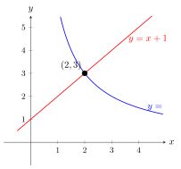

# 反比例函数的应用

## 一、概念特征：识别反比例关系的信号

在实际问题中，以下信号意味着出现了反比例关系：

1. **两个量的乘积是常数**：$x \cdot y = k$（$k \neq 0$）
2. **"一个量增大，另一个量成比例减小"**的描述
3. **已知量 = 另外两量之商**（如速度 = 路程 / 时间，若路程固定，速度与时间成反比）
4. **物理公式中的倒数关系**：$I = \frac{U}{R}$、$p = \frac{F}{S}$ 等

**识别到反比例后的通用步骤**：

1. 写出反比例函数模型：$y = \frac{k}{x}$
2. 代入已知点（一组已知的 $x$ 和 $y$ 值）求 $k$
3. 用解析式求其他量，或讨论图象性质
4. 注意实际约束（如长、宽、电流必须为正数）

---

## 二、定义与建模方法

### 反比例函数建模三步

**步骤 1：识别两变量**

确认哪两个量在变化，哪个是自变量 $x$，哪个是因变量 $y$。

**步骤 2：验证乘积为常数**

检验：在各种情形下，$x \cdot y$ 是否始终为同一常数 $k$。
若是，则 $y = \frac{k}{x}$。

**步骤 3：写出解析式并注明定义域**

实际问题中变量有范围限制：

- 长度、面积、时间、电流等通常 $> 0$
- 有时有额外整数限制（如人数必须是正整数）

---

## 三、为什么反比例关系如此常见（本质推导）

**乘积恒定原理**：

若两个量 $x$ 和 $y$ 满足 $xy = c$（常数），则一个量的变化必然引起另一个量的"相反"变化：

$$x \uparrow \Rightarrow y = \frac{c}{x} \downarrow \qquad x \downarrow \Rightarrow y = \frac{c}{x} \uparrow$$

在物理中，许多守恒定律或定义式天然具有这种结构：

- **等面积矩形**：面积 $= $ 长 $\times$ 宽 $= $ 常数，故长与宽成反比
- **欧姆定律（固定电压）**：$U = IR$，若 $U$ 固定，$I = \frac{U}{R}$，电流 $I$ 与电阻 $R$ 成反比
- **匀速运动（固定路程）**：$s = vt$，若 $s$ 固定，$v = \frac{s}{t}$，速度 $v$ 与时间 $t$ 成反比

---

## 四、典型应用

**例 1（几何类）**　长方形面积为 $24$，长为 $x$（cm），宽为 $y$（cm）。写出 $y$ 关于 $x$ 的函数关系式，并说明 $x$ 的取值范围。当 $x = 6$ 时 $y$ 是多少？

**【思路】** 两量之积为常数，反比例函数。

**建立模型**：

$$xy = 24 \Rightarrow y = \frac{24}{x}$$

**定义域**：$x > 0$（长度为正），且实际上还需要 $y > 0$，由 $\frac{24}{x} > 0$ 自动满足。

$$x \in (0, +\infty)$$

**求 $x = 6$ 时 $y$**：

$$y = \frac{24}{6} = 4 \text{ cm}$$

**图象分析**：$k = 24 > 0$，图象在第一象限（因 $x > 0$），$y$ 随 $x$ 增大而减小——长增大，宽减小，符合直觉。

---

**例 2（电学类）**　某导线两端电压为 $U = 12\text{ V}$（伏），通过导线的电流 $I$（安）与导线电阻 $R$（欧）满足欧姆定律 $U = IR$。

(1) 写出 $I$ 关于 $R$ 的函数关系式；

(2) 当 $R = 4 \text{ Ω}$ 时，$I = ?$；

(3) 若要使电流不超过 $3 \text{ A}$，电阻 $R$ 的范围是什么？

**【思路】** 电压固定，电流与电阻成反比。

**(1) 建立模型**：

由 $U = IR$，$I = \frac{U}{R} = \frac{12}{R}$（$R > 0$）。

**(2) 代入 $R = 4$**：

$$I = \frac{12}{4} = 3 \text{ A}$$

**(3) 求 $R$ 的范围**：

$$I \leq 3 \Rightarrow \frac{12}{R} \leq 3$$

因为 $R > 0$，两边乘 $R$ 不变号：

$$12 \leq 3R \Rightarrow R \geq 4$$

**答**：电阻 $R \geq 4 \text{ Ω}$。

**物理直觉**：电阻越大，电流越小——反比例函数的递减性与物理直觉一致。

---

**例 3（综合类）**　反比例函数 $y = \dfrac{k}{x}$ 与一次函数 $y = x + 2$ 交于两点 $A, B$，其中 $A$ 在第一象限，$B$ 在第三象限。已知 $\triangle AOB$ 的面积为 $6$（$O$ 为原点），求 $k$ 的值。

**【思路】** 利用交点关系和面积公式，建立关于 $k$ 的方程。

**第一步：联立求交点。**

$$\frac{k}{x} = x + 2 \Rightarrow k = x(x + 2) = x^2 + 2x$$

$$x^2 + 2x - k = 0$$

设两根为 $x_1, x_2$（对应 $A, B$ 的横坐标）。

由韦达定理：

$$x_1 + x_2 = -2, \qquad x_1 x_2 = -k$$

因为 $A$ 在第一象限（$x_1 > 0$），$B$ 在第三象限（$x_2 < 0$），所以 $x_1 x_2 < 0$，即 $-k < 0$，故 $k > 0$。

**第二步：求交点坐标。**

$A(x_1, y_1)$ 在直线 $y = x + 2$ 上，$y_1 = x_1 + 2$；
$B(x_2, y_2)$ 在直线上，$y_2 = x_2 + 2$。

**第三步：用坐标面积公式。**

$$S_{\triangle AOB} = \frac{1}{2}|x_1 y_2 - x_2 y_1|$$

$$= \frac{1}{2}|x_1(x_2 + 2) - x_2(x_1 + 2)|$$

$$= \frac{1}{2}|x_1 x_2 + 2x_1 - x_1 x_2 - 2x_2|$$

$$= \frac{1}{2}|2x_1 - 2x_2|$$

$$= |x_1 - x_2|$$

已知面积为 $6$：

$$|x_1 - x_2| = 6$$

**第四步：用韦达定理表达 $|x_1 - x_2|$。**

$$(x_1 - x_2)^2 = (x_1 + x_2)^2 - 4x_1 x_2 = (-2)^2 - 4(-k) = 4 + 4k$$

$$|x_1 - x_2| = \sqrt{4 + 4k} = 2\sqrt{1 + k}$$

由 $|x_1 - x_2| = 6$：

$$2\sqrt{1 + k} = 6 \Rightarrow \sqrt{1 + k} = 3 \Rightarrow 1 + k = 9 \Rightarrow k = 8$$

**验证**：$k = 8 > 0$ ✓；$x^2 + 2x - 8 = 0$，$(x + 4)(x - 2) = 0$，$x_1 = 2$，$x_2 = -4$。
$A = (2, 4)$（第一象限 ✓），$B = (-4, -2)$（第三象限 ✓）。
$S_{\triangle AOB} = |x_1 - x_2| = |2 - (-4)| = 6$ ✓。

**答**：$k = 8$。

---

## 五、易错点 & 反例

**易错 1：忽略实际定义域。**

$y = \frac{24}{x}$ 在数学上定义域是 $x \neq 0$，但在"长方形长与宽"的实际情境中，必须加 $x > 0$（且 $y > 0$）。

反例：若你说"当 $x = -3$ 时 $y = -8$"，数学上成立，但几何上长度不能为负。

**易错 2：$k$ 的正负与象限。**

$k > 0$ 时图象在第一、三象限；$k < 0$ 时在第二、四象限。若实际问题中 $x, y$ 同号（如都大于零），则自然处于第一象限，$k > 0$。

**易错 3：两量成反比 vs 两量的比为常数。**

"$\frac{y}{x} = k$"是正比例（$y = kx$），"$xy = k$"是反比例（$y = \frac{k}{x}$）。字面很像，意思完全相反。

**易错 4：解不等式时乘以含 $x$ 的分母，忘记 $x > 0$ 的条件。**

$\frac{12}{R} \leq 3$，若 $R > 0$，两边乘 $R$ 不等号方向不变；若不确定 $R$ 的符号，需分类讨论。实际问题中 $R > 0$ 通常已知，但要明确说出来。

**易错 5：综合题用面积公式时符号错误。**

$S_{\triangle AOB} = \frac{1}{2}|x_1 y_2 - x_2 y_1|$——注意是行列式的绝对值，$x_1 y_2 - x_2 y_1$ 可能为负，必须取绝对值。

---

## 六、思路自测题

**自测 1**　已知某物体以匀速行驶，路程 $s = 120$ km（固定）。设速度为 $v$（km/h），行驶时间为 $t$（h）。

(1) 写出 $t$ 关于 $v$ 的函数关系式，注明定义域。

(2) 若行驶时间不超过 $4$ h，速度 $v$ 至少是多少？

> 💡 提示：$s = vt = 120$，故 $t = \frac{120}{v}$，$v > 0$。$t \leq 4$：$\frac{120}{v} \leq 4$，$v > 0$ 时两边乘 $v$ → $120 \leq 4v$ → $v \geq 30$ km/h。

**自测 2**　反比例函数 $y = \dfrac{k}{x}$ 图象经过点 $(3, -4)$。

(1) 求 $k$ 的值；

(2) 判断点 $(-6, 2)$ 是否在图象上；

(3) 图象在哪两个象限？每支上单调性如何？

> 💡 提示：$k = 3 \times (-4) = -12$。验证 $(-6) \times 2 = -12 = k$ ✓，在图象上。$k = -12 < 0$ → 第二、四象限；$k < 0$ 时每支上 $y$ 随 $x$ 增大而增大（单调递增）。

**自测 3**　已知电压 $U$ 固定，电流 $I$（A）与电阻 $R$（Ω）满足 $I = \frac{U}{R}$。测得 $R = 3$ Ω 时 $I = 4$ A。

(1) 求 $U$ 的值；

(2) 写出 $I$ 关于 $R$ 的函数，画出它的图象大致位置（说明哪个象限，单调性）；

(3) 若将电阻增大到原来的 $2$ 倍，电流变为原来的几倍？

> 💡 提示：$U = IR = 3 \times 4 = 12$ V。$I = \frac{12}{R}$，$R > 0$，图象在第一象限，单调递减。$R$ 变 $2$ 倍：$I' = \frac{12}{2R} = \frac{1}{2} \cdot \frac{12}{R} = \frac{I}{2}$，电流变为原来的 $\frac{1}{2}$ 倍。

**自测 4**　反比例函数 $y = \dfrac{k}{x}$ 与一次函数 $y = 2x - 3$ 交于 $A(1, -1)$ 处。

(1) 求 $k$；

(2) 验证 $A(1, -1)$ 是否同时在两个函数图象上；

(3) 过 $A$ 向 $x$ 轴作垂线，$\triangle OAC$（$O$ 为原点，$C$ 为垂足）面积是多少？用 $k$ 的几何意义验证。

> 💡 提示：$k = 1 \times (-1) = -1$。验证：在 $y = 2x - 3$ 上代 $x = 1$：$y = 2 - 3 = -1$ ✓。$\triangle OAC$：底 $OC = 1$，高 $= 1$（$A$ 到 $x$ 轴距离），面积 $= \frac{1}{2}$。用 $k$ 验证：$\frac{|k|}{2} = \frac{1}{2}$ ✓，两种方法一致。
