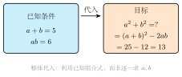

# 何时换元

**一例速记**

$$x^4 - 13x^2 + 36 = 0$$

> 看到 $x^4 = (x^2)^2$，令 $y = x^2$，原式变成 $y^2 - 13y + 36 = 0$——二次方程，秒解。

---

## 一、换元不是高考专属

很多初中生听到"换元法"，第一反应是："那不是高考才用的东西吗？"

这是一个根深蒂固的误区。事实上，你早就在用换元了，只是没意识到。

当你解 $x^4 - 5x^2 + 4 = 0$ 时，你大概会这么想："$x^4$ 就是 $(x^2)^2$，如果我把 $x^2$ 看成一个整体……"——你已经在换元了。当你解 $x + \sqrt{x-1} = 3$ 时，你可能令 $t = \sqrt{x-1}$——这也是换元。当你化简 $\frac{x^2+1}{x} + \frac{x}{x^2+1}$ 时，你把分式看成一个整体——还是换元。

**换元的本质非常朴素**：给复杂的表达式起一个短名字，用新字母（$y$、$t$、$u$ 等）代替它，让方程变简单，最后再把新字母换回来。

仅此而已。它不神秘，是一种"重命名"操作。

关键在于：**何时该换元？换哪一块？**

---

## 二、识别"该换元"的 5 类信号

学会换元的核心，是练出"看到 X 立刻想到换元"的直觉。下面是 5 类信号，初中代数里 90% 的换元题都由此触发。

### 信号 1：方程出现高次 + $x^k$ 的重复结构

**特征**：方程最高次是 4 次或 6 次，且 $x^2$（或 $x^3$）作为一个整体反复出现。

**示例**：$x^4 - 5x^2 + 4 = 0$

注意到 $x^4 = (x^2)^2$，方程里只有 $x^4$ 和 $x^2$ 两种项，没有 $x^3$ 或 $x$。这是信号：令 $y = x^2$，方程化为

$$y^2 - 5y + 4 = 0$$

这是关于 $y$ 的普通一元二次方程，立刻可以因式分解。

**记住**：凡是"$f(x^2)$ 型"的偶次方程，优先考虑令 $y = x^2$。

### 信号 2：方程含根号

**特征**：方程里出现 $\sqrt{\text{某个含 }x\text{ 的式子}}$，直接处理根号很麻烦。

**示例**：$x + \sqrt{x - 1} = 3$

令 $t = \sqrt{x-1}$（注意 $t \geq 0$）。则 $x = t^2 + 1$，代入：

$$t^2 + 1 + t = 3 \implies t^2 + t - 2 = 0 \implies (t+2)(t-1) = 0$$

解得 $t = -2$（舍，因为 $t \geq 0$）或 $t = 1$，回代得 $x - 1 = 1$，即 $x = 2$。

**记住**：遇根号 → 令新字母等于根号整体，同时附加"新字母 $\geq 0$"的限制。

### 信号 3：分式方程含相同的分式结构

**特征**：分子和分母都是含 $x$ 的式子，且同一个复杂分式在方程中出现不止一次（或以"一个分式 + 它的倒数"形式出现）。

**示例**：$\frac{x^2+1}{x} + \frac{x}{x^2+1} = \frac{5}{2}$

令 $u = \frac{x^2+1}{x}$（注意 $x \neq 0$），则 $\frac{x}{x^2+1} = \frac{1}{u}$，方程化为

$$u + \frac{1}{u} = \frac{5}{2}$$

两边乘以 $2u$：$2u^2 - 5u + 2 = 0$，因式分解 $(2u-1)(u-2) = 0$，解得 $u = \frac{1}{2}$ 或 $u = 2$，再回代求 $x$。

**记住**：看到"某分式 + 它的倒数"型 → 换元。

### 信号 4：多元方程组含对称组合

**特征**：方程组中两个未知数 $x, y$ 以"$x+y$"和"$xy$"的形式出现，而非分别出现。

**示例**：

$$\begin{cases} x + y = 5 \\ xy = 6 \end{cases}$$

令 $s = x + y = 5$，$p = xy = 6$，则 $x, y$ 是方程 $t^2 - st + p = 0$（即 $t^2 - 5t + 6 = 0$）的两根，因式分解得 $t = 2$ 或 $t = 3$，所以 $\{x, y\} = \{2, 3\}$。

这其实是韦达定理的"逆用"——先用换元理清结构，再用韦达得出结果。

**记住**：$x+y$ 和 $xy$ 已知（或是题目核心） → 韦达换元。

### 信号 5：代数式含明显的重复块

**特征**：一个代数式（不一定是方程）中，某个较复杂的子式反复出现，视觉上有明显的"重复块"。

**示例**：$(x^2 + 1)^2 - 2(x^2 + 1) - 8$

令 $y = x^2 + 1$，原式化为

$$y^2 - 2y - 8 = (y-4)(y+2) = (x^2 - 3)(x^2 + 3)$$

一步因式分解完成。

**记住**：看到"同一个括号或块出现多次" → 立刻换元，哪怕是化简因式分解题。

---

## 三、换元的三步操作

无论哪类信号触发，换元的操作流程永远是三步：

**第一步：识别整体**

盯着式子，找出"如果我把这一块看成一个新变量，方程会不会变简单？"这一块就是要换元的整体。整体的特征是：它在方程中反复出现，或者换掉它之后次数降低。

**第二步：用新字母替换**

选一个简洁的字母（$y$、$t$、$u$、$k$ 均可，注意不要和原题字母冲突），令"新字母 = 整体"，写明这个关系。同时，**立刻标注新变量的取值范围**（如 $t = \sqrt{x-1}$ 则 $t \geq 0$；$y = x^2$ 则 $y \geq 0$）。

**第三步：解新方程，然后回代**

对新变量列的方程一般比原方程简单得多（降次或去根号）。解出新变量后，**必须回代还原原变量**，不能停在新变量的解上。回代后还要检验是否满足原方程（含根号、分式方程尤其要检验）。

> "换元 = 给整体起名 → 解名字的方程 → 把名字换回来"

---

## 四、一个完整的换元演示

**例题**：求解 $x^4 - 13x^2 + 36 = 0$。

下面是思维路径还原——解题者的内心独白：

> 拿到这道方程，我先看它的结构：最高次 4 次，有 $x^4$ 项和 $x^2$ 项，没有 $x^3$ 或 $x$ 项——这是信号 1：偶次 + 只含 $x^2$ 的幂，换元降次。
>
> 令 $y = x^2$（因为 $x^4 = (x^2)^2 = y^2$），注意 $y \geq 0$。
>
> 原方程变成：
> $$y^2 - 13y + 36 = 0$$
>
> 这是关于 $y$ 的标准一元二次方程。找两个数乘积 $36$、和 $13$：$4 \times 9 = 36$，$4 + 9 = 13$。完美。
>
> 因式分解：$(y - 4)(y - 9) = 0$，解得 $y_1 = 4$ 或 $y_2 = 9$。
>
> 两个解都 $\geq 0$，满足 $y \geq 0$ 的限制，不需要舍去。
>
> 回代：$y = x^2$，所以
> $$x^2 = 4 \implies x = \pm 2$$
> $$x^2 = 9 \implies x = \pm 3$$
>
> 答：$x = 2,\ x = -2,\ x = 3,\ x = -3$，共 4 个解。

**验证**（以 $x=2$ 为例）：$16 - 13 \times 4 + 36 = 16 - 52 + 36 = 0$。正确。

**总结**：这道题不换元，直接硬算很麻烦（四次方程一般无公式）；换元后立刻变成"两个二次方程"，轻松解决。

---

## 五、易错点

换元这个工具威力大，但用不好会出低级错误。以下三点是最常见的"翻车现场"：

**易错点 1：换元后忘记回代**

求的是 $x$，却把 $y$ 的解当成最终答案交卷。这是换元最高频的错误。

处理方法：解完关于 $y$ 的方程后，**在草稿纸上醒目写一行"回代：$y = ??? \Rightarrow x = ???$"**，养成习惯。

**易错点 2：不检查新变量的取值范围**

以 $y = x^2$ 为例，$y$ 必须 $\geq 0$。如果解出 $y = -3$，这个解无效，对应的 $x$ 不存在，必须舍去。

以 $t = \sqrt{x-1}$ 为例，$t \geq 0$。解出 $t = -2$ 必须舍弃。

**每次换元，先写范围，别等算完再想。**

**易错点 3：换元前后表达式不等价**

换元 $t = \sqrt{x-1}$ 意味着 $x = t^2 + 1$，这一步是等价变换（$t \geq 0$ 时），回代不会引入增根。但有时换元后的变换不是等价的，回代结果需要**代入原方程验证**，而不是直接信任。

含根号的方程尤其如此——方程 $\sqrt{x-1} = x - 3$ 两边平方得到的新方程可能引入增根。

---

## 六、自检 checklist

解题前，对题目问以下四个问题：

**☑ 题目里是否有"重复的结构 / 块"？**
——相同的括号、相同的分式、相同次数的幂，出现不止一次？

**☑ 给这个结构起个新字母后，方程是否变简单（降次或消根号）？**
——如果变复杂了，换错了地方，换回来重选。

**☑ 新方程的解是否能回代回原方程？**
——算完新变量后，立刻回代还原 $x$，不要在新变量的解上停下来。

**☑ 新变量是否有附加的范围限制？**
——$y = x^2$ 时 $y \geq 0$；$t = \sqrt{...}$ 时 $t \geq 0$；$u = \frac{1}{x}$ 时 $x \neq 0$（即 $u$ 存在）。

四个问题都检查过，就可以放心提交答案了。

---

## 七、自测题

**第 1 题**（☆）

解方程：$x^4 - 10x^2 + 9 = 0$。

💡 提示：令 $y = x^2$，化为关于 $y$ 的二次方程，求解后回代。注意 $y \geq 0$。

---

**第 2 题**（☆☆）

解方程：$\sqrt{x + 3} + x = 3$。

💡 提示：令 $t = \sqrt{x+3}$（$t \geq 0$），写出 $x = t^2 - 3$，代入原方程整理，解关于 $t$ 的方程后回代，检验。

---

**第 3 题**（☆☆）

化简因式分解：$(2x^2 - 3)^2 - 5(2x^2 - 3) + 6$。

💡 提示：令 $y = 2x^2 - 3$，原式化为 $y^2 - 5y + 6$，因式分解后回代 $y = 2x^2 - 3$。

---

**第 4 题**（☆☆☆）

已知 $\begin{cases} x + y = 3 \\ xy = 1 \end{cases}$，求 $x^3 + y^3$ 的值（不允许直接解出 $x, y$）。

💡 提示：令 $s = x+y = 3$，$p = xy = 1$。利用 $x^3 + y^3 = (x+y)(x^2 - xy + y^2) = (x+y)\bigl[(x+y)^2 - 3xy\bigr]$，代入 $s$ 和 $p$ 直接计算。
