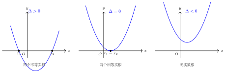

# 判别式与韦达定理

**一例速记**

$$x^2 + 3x - 5 = 0 \quad \text{两根为 } x_1, x_2$$

> 不解方程，直接由韦达：$x_1 + x_2 = -3$，$x_1 x_2 = -5$。
> 于是 $x_1^2 + x_2^2 = (x_1 + x_2)^2 - 2x_1 x_2 = 9 + 10 = 19$。

---

## 一、判别式与韦达定理——一元二次方程的"双子星"

一元二次方程 $ax^2 + bx + c = 0$（$a \neq 0$）有两个最重要的工具，它们几乎出现在每道与二次方程有关的题目里：

**判别式** $\Delta = b^2 - 4ac$：在不解出根的情况下，告诉你**根存在吗？几个？相等吗？**

**韦达定理**（根与系数关系）：

$$x_1 + x_2 = -\frac{b}{a}, \quad x_1 x_2 = \frac{c}{a}$$

在不解出 $x_1, x_2$ 具体值的情况下，告诉你**两根的和与积**，从而推导出一切"两根的对称表达式"。

这两个工具是"双子星"：判别式回答"根有没有、有几个"，韦达回答"根是什么关系"。很多题需要联合使用。

---

## 二、判别式的三种情形

对方程 $ax^2 + bx + c = 0$（$a \neq 0$，系数均为实数）：

| $\Delta$ 的值 | 根的情况 | 几何意义（$y = ax^2 + bx + c$ 图象与 $x$ 轴的关系） |
|:---:|---|---|
| $\Delta > 0$ | 两个**不相等**实根 $x_1 \neq x_2$ | 图象与 $x$ 轴有**两个交点** |
| $\Delta = 0$ | 两个**相等**实根 $x_1 = x_2 = -\dfrac{b}{2a}$ | 图象与 $x$ 轴有**一个切点**（即相切） |
| $\Delta < 0$ | **无实根**（有两个共轭复数根，初中不要求） | 图象与 $x$ 轴**无交点** |

**几何直觉**：$\Delta$ 的大小控制抛物线"是否能碰到 $x$ 轴，以及碰到几次"。$\Delta = b^2 - 4ac$ 越大，意味着两个根差距越大（根的间距 $= \frac{\sqrt{\Delta}}{|a|}$）；$\Delta = 0$ 是"将将碰到一点"的临界情形；$\Delta < 0$ 则抛物线整体在 $x$ 轴上方（$a > 0$）或下方（$a < 0$）。

---

## 三、韦达定理与常用变形

### 基本结论

设 $x_1, x_2$ 是 $ax^2 + bx + c = 0$（$a \neq 0$）的两根，则：

$$x_1 + x_2 = -\frac{b}{a}, \quad x_1 x_2 = \frac{c}{a}$$

**为什么成立？** 由求根公式，$x_{1,2} = \frac{-b \pm \sqrt{b^2-4ac}}{2a}$，直接相加相乘化简即得。韦达定理是求根公式的"提炼"版本。

### 三个核心变形公式

掌握这三个变形，能解决 80% 的韦达题：

**变形 1：两根平方和**

$$x_1^2 + x_2^2 = (x_1 + x_2)^2 - 2x_1 x_2$$

**推导**：$(x_1 + x_2)^2 = x_1^2 + 2x_1 x_2 + x_2^2$，移项得 $x_1^2 + x_2^2 = (x_1 + x_2)^2 - 2x_1 x_2$。

**变形 2：两根倒数和**

$$\frac{1}{x_1} + \frac{1}{x_2} = \frac{x_1 + x_2}{x_1 x_2}$$

（前提：$x_1, x_2 \neq 0$，即 $c \neq 0$。）

**推导**：通分 $\frac{x_2 + x_1}{x_1 x_2}$，分子分母均用韦达代入。

**变形 3：两根差的平方**

$$(x_1 - x_2)^2 = (x_1 + x_2)^2 - 4x_1 x_2 = \Delta / a^2$$

**推导**：$(x_1 - x_2)^2 = (x_1 + x_2)^2 - 4x_1 x_2$，再代入韦达结论。

更直接地，由求根公式 $x_1 - x_2 = \frac{\sqrt{\Delta}}{a}$（或 $-\frac{\sqrt{\Delta}}{a}$），平方得 $(x_1 - x_2)^2 = \frac{\Delta}{a^2}$。

---

## 四、何时用判别式，何时用韦达

学了两个工具，关键是知道**分别在什么信号下触发**。

### 用判别式的信号

- 题目明确问"方程有几个实数根？"
- 题目问"方程是否有（实数）根？有没有两个不同的根？"
- 题目问"$m$ 取何值时方程恰有两个相等实根？"（令 $\Delta = 0$）
- 题目问"$m$ 取什么范围时方程有两个不相等实根？"（令 $\Delta > 0$）
- 已知一个含参方程，问参数的取值条件（根的存在性）

**判别式 = 根存在性的开关**。

### 用韦达定理的信号

- 题目说"设 $x_1, x_2$ 是方程的两根"，然后问一个**关于 $x_1, x_2$ 的对称表达式**（如 $x_1^2 + x_2^2$、$x_1^3 + x_2^3$、$\frac{1}{x_1} + \frac{1}{x_2}$ 等）
- 题目条件不让你"解出 $x_1, x_2$"（因为式子有参数，解不出具体值）
- 题目给出"两根满足某关系"（如 $x_1 = 3x_2$），让你求参数值

**韦达 = 绕开"求根"直接利用根的关系**。

> 口诀：问"根存在吗" → 判别式；问"根的表达式等于多少" → 韦达。

---

## 五、典型应用

### 例 1：判别 $2x^2 - 3x + 1 = 0$ 的根的情况

【思路】直接计算判别式（$a = 2,\, b = -3,\, c = 1$）：

$$\Delta = (-3)^2 - 4 \times 2 \times 1 = 9 - 8 = 1 > 0$$

结论：方程有两个不相等的实根。

顺手求出根：$x_{1,2} = \frac{3 \pm 1}{4}$，即 $x_1 = 1$，$x_2 = \frac{1}{2}$。

验证韦达：$x_1 + x_2 = 1 + \frac{1}{2} = \frac{3}{2} = -\frac{-3}{2} = \frac{b \text{ 的相反数}}{a}$ ✓；$x_1 x_2 = \frac{1}{2} = \frac{c}{a}$ ✓。

---

### 例 2：已知 $x^2 + 3x - 5 = 0$ 的两根 $x_1, x_2$，求 $x_1^2 + x_2^2$

【思路】题目只需要"两根的对称表达式"，用韦达定理，不需要解出 $x_1, x_2$（信号：典型韦达题）。

由韦达（$a = 1,\, b = 3,\, c = -5$）：

$$x_1 + x_2 = -\frac{3}{1} = -3, \quad x_1 x_2 = \frac{-5}{1} = -5$$

用变形 1：

$$x_1^2 + x_2^2 = (x_1 + x_2)^2 - 2x_1 x_2 = (-3)^2 - 2 \times (-5) = 9 + 10 = 19$$

答：$x_1^2 + x_2^2 = 19$。

**对比**：若真的解出 $x_1, x_2 = \frac{-3 \pm \sqrt{29}}{2}$，再平方相加，计算量大得多，且容易出错。韦达定理完全绕开了这条弯路。

---

### 例 3：方程 $x^2 - mx + 4 = 0$ 有两个不相等实根，求 $m$ 的取值范围

【思路】"两个不相等实根" → 判别式 $> 0$（信号：含参方程的根存在性条件）。

$a = 1,\, b = -m,\, c = 4$：

$$\Delta = (-m)^2 - 4 \times 1 \times 4 = m^2 - 16 > 0$$

解不等式：$m^2 > 16 \Rightarrow m > 4$ 或 $m < -4$。

答：$m$ 的取值范围是 $m > 4$ 或 $m < -4$（即 $m \in (-\infty, -4) \cup (4, +\infty)$）。

**几何直觉**：$m$ 控制抛物线 $y = x^2 - mx + 4$ 的"腰部弯曲程度"——$|m|$ 足够大时，抛物线开口足以跨过 $x$ 轴两次；$|m| \leq 4$ 时，抛物线"跨不过去"，与 $x$ 轴相切或无交点。

---

## 六、易错点

**易错点 1：韦达定理的前提——方程必须是一元二次方程，且 $a \neq 0$**

方程 $ax^2 + bx + c = 0$ 中，$a = 0$ 时退化为一次方程，此时 $x_1 + x_2 = -\frac{b}{a}$ 无意义。

含参方程（如 $(m-1)x^2 + 2x - 1 = 0$）使用韦达定理前，**必须先检验 $m \neq 1$**（确保是二次方程）。

**易错点 2：韦达只给"对称表达式"，单独求根还得解方程**

已知 $x_1 + x_2 = 5$，$x_1 x_2 = 6$，你可以求出 $x_1^2 + x_2^2 = 13$，但**不能用韦达直接得出 $x_1 = 2, x_2 = 3$**（还需要解方程 $t^2 - 5t + 6 = 0$）。

韦达给的是"对称量"的值，不是每个根的值。

**易错点 3：含参时韦达结果含参，结论要分情况**

例：方程 $x^2 - (m+1)x + m = 0$ 的两根之积为 $m$（$= \frac{c}{a}$）。若题目进一步问"两根均为正数的条件"，需要：
1. $\Delta \geq 0$（有实根）
2. $x_1 x_2 = m > 0$（乘积为正）
3. $x_1 + x_2 = m + 1 > 0$（和为正）

三个条件取交集，不能只看其中一个。

**易错点 4：判别式计算符号错误**

$\Delta = b^2 - 4ac$ 中，$b^2$ 总是非负的，$4ac$ 的符号取决于 $a$ 和 $c$ 的正负。

例如 $a = 1, c = -5$：$4ac = 4 \times 1 \times (-5) = -20$，所以 $\Delta = b^2 - (-20) = b^2 + 20 > 0$，方程必有两个不相等实根，无论 $b$ 取何值。

---

## 七、自测题

**第 1 题**（☆）

判断方程 $x^2 + 4x + 4 = 0$ 根的情况，说出 $\Delta$ 的值，并写出根。

💡 提示：$\Delta = 4^2 - 4 \times 1 \times 4 = ?$；当 $\Delta = 0$ 时，方程有两个相等实根 $x = -\frac{b}{2a}$。

---

**第 2 题**（☆☆）

已知 $x^2 - 5x + 3 = 0$ 的两根为 $x_1, x_2$，求 $\frac{1}{x_1} + \frac{1}{x_2}$ 的值（不解方程）。

💡 提示：$\frac{1}{x_1} + \frac{1}{x_2} = \frac{x_1 + x_2}{x_1 x_2}$，分子分母各用韦达定理代入。

---

**第 3 题**（☆☆）

已知 $x^2 - 6x + k = 0$ 有两个不相等正实根，求 $k$ 的取值范围。

💡 提示：需要同时满足三个条件：（1）$\Delta > 0$；（2）$x_1 + x_2 = 6 > 0$（自动满足）；（3）$x_1 x_2 = k > 0$。把 (1)(3) 联立求 $k$ 的范围。

---

**第 4 题**（☆☆☆）

已知方程 $x^2 + px + q = 0$ 的两根 $x_1, x_2$ 满足 $x_1 - x_2 = 1$，$x_1^2 - x_2^2 = 3$。求 $p, q$ 的值。

💡 提示：注意 $x_1^2 - x_2^2 = (x_1 + x_2)(x_1 - x_2)$，已知 $x_1 - x_2 = 1$，立刻得到 $x_1 + x_2$；再由韦达 $x_1 + x_2 = -p$，$x_1 x_2 = q$，联立求解。
