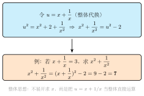

# 整体思想

> **一例速记**：已知 $x^2 + 3x = 5$，求 $x^2 + 3x + 1$。
> 不解方程，直接代入：$5 + 1 = \mathbf{6}$。
> 这就是整体思想——把 $x^2 + 3x$ 当作一个整体，直接用。

---

## 一、整体思想：把"一团"看作"一个"

代数中经常出现这样的局面：题目给的条件是一个**组合式**（比如 $x^2 + 3x$、$x + \frac{1}{x}$、$x + y$），而题目要求的也是与这个组合式高度相关的表达式。此时，如果拆开一个个变量去硬解，往往计算量大、容易出错；但如果把那个组合式**当作一个整体**来处理，往往一步到位。

**整体思想的核心**：不去追究"组合式里的每个变量究竟是多少"，而是直接把**整个组合式当成一个已知量**来用。

### 整体思想与换元的区别

这两种方法容易混淆，但本质不同：

| | 换元（见 toolkit 01） | 整体思想 |
|---|---|---|
| 做法 | 给整体起一个新名字，如令 $t = x^2 + 3x$ | **不起新名字**，直接利用整体 |
| 适用 | 需要进一步运算（解新方程、化简新式） | 整体直接代入或直接平方变形 |
| 举例 | $x^4 - 5x^2 + 4 = 0$，令 $y = x^2$ | 已知 $x^2 + 3x = 5$，直接用这个等式 |

一句话区别：**换元是给整体起名字再操作；整体思想是不起名字、直接用**。两者经常配合使用，但意识到这个区别，能让你在选择时更清晰。

---

## 二、整体思想的 4 类应用

### 1. 整体代入

**场景**：已知的条件是某个代数式的值，要求的式子里恰好含有这个代数式。

**例**：已知 $x^2 + 3x = 5$，求 $x^2 + 3x + 1$ 的值。

分析：$x^2 + 3x + 1 = \underbrace{(x^2 + 3x)}_{\text{整体 }= 5} + 1 = 5 + 1 = 6$。

根本不需要解出 $x$，把 $x^2 + 3x$ 当作整体，直接替换为 5，计算结束。

**推广**：如果已知 $x^2 + 3x = 5$，求 $2x^2 + 6x - 3$，则

$$2x^2 + 6x - 3 = 2(x^2 + 3x) - 3 = 2 \times 5 - 3 = 7.$$

关键一步是把 $2x^2 + 6x$ 改写成 $2(x^2 + 3x)$，把整体凑出来。

---

### 2. 整体平移

**场景**：函数图象的平移变换中，把自变量里的"偏移"当成一个整体看，直接写出图象变化规律，而不展开计算。

**例**：函数 $y = (x - 2)^2 + 1$ 由 $y = x^2$ 变换而来。

整体思想看法：把 $x - 2$ 看作一个整体，$(x-2)^2$ 就是把 $x^2$ 中的"自变量"从 $x$ 换成了 $x - 2$，图象**整体右移 2**；再加 1，图象**整体上移 1**。

不需要展开 $(x-2)^2 + 1 = x^2 - 4x + 5$，因为展开后反而看不出图象特征了。整体不拆，顶点立刻就是 $(2, 1)$。

**推广**：$y = a(x - h)^2 + k$（顶点式）的图象，就是 $y = ax^2$ 整体平移——**右移 $h$，上移 $k$**（$h < 0$ 时左移，$k < 0$ 时下移）。顶点坐标 $(h, k)$ 直接读出，无需展开。

---

### 3. 整体平方（倒数和的变形）

**场景**：已知"某量 + 其倒数"的值，求"某量的平方 + 其倒数的平方"。

**例**：已知 $x + \dfrac{1}{x} = 3$，求 $x^2 + \dfrac{1}{x^2}$。

直接分别求 $x$ 的值再平方，会解出两个无理数，计算繁琐。整体思想：

$$\left(x + \frac{1}{x}\right)^2 = x^2 + 2 \cdot x \cdot \frac{1}{x} + \frac{1}{x^2} = x^2 + 2 + \frac{1}{x^2}$$

因此

$$x^2 + \frac{1}{x^2} = \left(x + \frac{1}{x}\right)^2 - 2 = 3^2 - 2 = \mathbf{7}.$$

把 $\left(x + \frac{1}{x}\right)$ 看作整体，平方后整理，整个过程不需要求 $x$ 的具体值。

**常用变形公式**（以 $s = x + \frac{1}{x}$ 为整体）：

$$x^2 + \frac{1}{x^2} = s^2 - 2, \qquad x^3 + \frac{1}{x^3} = s^3 - 3s, \qquad x - \frac{1}{x} = \pm\sqrt{s^2 - 4}.$$

---

### 4. 整体消元（方程组中整体处理）

**场景**：方程组中有多个未知数，但题目要求的是某几个未知数的组合，不是每个变量单独的值。

**例**：已知

$$\begin{cases} x + y + z = 10 \\ 2(x + y) = z + 4 \end{cases}$$

求 $z$ 的值。

整体思想：把 $x + y$ 当作一个整体，记它整体出现在两个方程中。由第二式得 $x + y = \frac{z + 4}{2}$，代入第一式：

$$\frac{z + 4}{2} + z = 10 \implies z + 4 + 2z = 20 \implies z = \frac{16}{3}.$$

无需分别求出 $x$、$y$ 的值，把 $x + y$ 当作一个量来消元，步骤更少。

**与韦达定理（toolkit 03）的联系**：韦达定理给出的 $x_1 + x_2$、$x_1 x_2$ 本身就是整体——不去单独求 $x_1, x_2$，而是把"和""积"当作整体，配合整体代入，就能得出 $x_1^2 + x_2^2$、$x_1^3 + x_2^3$ 等对称式的值。

---

## 三、识别"用整体"的信号

以下几条信号，任意出现一条，都值得优先考虑整体思想：

1. **条件是组合式**：题目给的已知不是单独的 $x$ 或 $y$，而是 $x + y$、$xy$、$x + \frac{1}{x}$、$x^2 + y^2$ 等组合。
2. **要求的也是组合式**：题目要求的答案形式与条件形式高度相关，不是"解出 $x$"而是"求某组合式的值"。
3. **解出单独变量很困难**：比如 $x + \frac{1}{x} = 3$，解出 $x$ 是无理数，但题目却问 $x^2 + \frac{1}{x^2}$——整体更快。
4. **题目里出现多余的等量关系**：条件比未知数多，但并不需要一一解方程，只需用某个已知组合去"凑"目标式。
5. **函数图象题**：看到 $y = f(x - h) + k$ 形式，整体处理平移，不展开。

---

## 四、演示题：已知 $x^2 - 3x + 1 = 0$，求 $\dfrac{x^4 + 1}{x^2}$

**题目**：已知实数 $x$ 满足 $x^2 - 3x + 1 = 0$，求 $\dfrac{x^4 + 1}{x^2}$ 的值。

> 拿到题先看条件：$x^2 - 3x + 1 = 0$，这是个一元二次方程。能解出 $x$ 吗？当然能，但 $x = \frac{3 \pm \sqrt{5}}{2}$ 是无理数，代入 $\frac{x^4 + 1}{x^2}$ 计算会非常繁琐。
>
> 再看目标式 $\frac{x^4 + 1}{x^2}$，能不能化简？把分子、分母分别处理：
> $$\frac{x^4 + 1}{x^2} = \frac{x^4}{x^2} + \frac{1}{x^2} = x^2 + \frac{1}{x^2}.$$
> 好，目标变成了 $x^2 + \frac{1}{x^2}$，这是"倒数和的平方"结构——整体平方信号！
>
> 现在我需要 $x + \frac{1}{x}$。由条件 $x^2 - 3x + 1 = 0$ 两边除以 $x$（注意 $x \neq 0$，因为若 $x = 0$ 代入原式得 $1 = 0$ 矛盾）：
> $$x - 3 + \frac{1}{x} = 0 \implies x + \frac{1}{x} = 3.$$
> 把 $x + \frac{1}{x}$ 当作整体，平方：
> $$\left(x + \frac{1}{x}\right)^2 = x^2 + 2 + \frac{1}{x^2} = 9$$
> $$x^2 + \frac{1}{x^2} = 9 - 2 = 7.$$
> 答：$\dfrac{x^4 + 1}{x^2} = \mathbf{7}$。全程未解出 $x$ 的具体值。

**解题要点回顾**：

1. 先化简目标式（约分）：$\frac{x^4+1}{x^2} \to x^2 + \frac{1}{x^2}$；
2. 条件整体化（除以 $x$）：$x^2 - 3x + 1 = 0 \to x + \frac{1}{x} = 3$；
3. 整体平方变形：$(x + \frac{1}{x})^2 - 2 = x^2 + \frac{1}{x^2} = 7$。

---

## 五、思考路标

看到以下特征，立刻触发相应反应：

1. **见 $x + \frac{1}{x}$ 或 $x - \frac{1}{x}$ 这类倒数和/差** → 想平方变形，得 $x^2 + \frac{1}{x^2}$；想立方变形，得 $x^3 + \frac{1}{x^3}$。
2. **见两根"和" $x_1 + x_2$、"积" $x_1 x_2$ 已知** → 结合韦达定理（toolkit 03），把 $x_1^2 + x_2^2$、$x_1^2 x_2^2$、$\frac{1}{x_1} + \frac{1}{x_2}$ 等一律用整体代入表达。
3. **见一元二次方程 $ax^2 + bx + c = 0$，但问的是"某代数式的值"而非"$x$ 的值"** → 先把方程变形（移项、除以 $x$、除以 $x^2$），凑出目标式里的整体结构。
4. **见函数式 $y = f(x - h) + k$** → 整体看平移，不展开，顶点 / 对称轴直接读出。
5. **见目标式比条件"高出一次"**（如条件含 $x$，目标含 $x^2$）→ 平方整体；见"低一次"→ 对称凑整。
6. **见方程组中某几个未知数的和/差出现在多处** → 把该和/差整体消元，减少运算步骤。

---

## 六、典型应用 3 例

### 例 1：整体代入（变形凑结构）

**题目**：已知 $a - b = 2$，求 $(a - b)^2 - 2(b - a) + 1$ 的值。

【思路】注意到 $b - a = -(a - b)$，所以：
$$(a - b)^2 - 2(b - a) + 1 = (a - b)^2 + 2(a - b) + 1 = \big[(a-b) + 1\big]^2 = (2 + 1)^2 = \mathbf{9}.$$

把 $a - b$ 整体代入 $2$，得答案。关键一步：识别出完全平方结构。

---

### 例 2：整体平方 + 韦达（见 toolkit 03）

**题目**：方程 $x^2 - 5x + 3 = 0$ 的两根为 $x_1, x_2$，求 $\dfrac{1}{x_1} + \dfrac{1}{x_2}$ 与 $x_1^2 + x_2^2$ 的值。

【思路】由韦达定理：$x_1 + x_2 = 5$，$x_1 x_2 = 3$。

$$\frac{1}{x_1} + \frac{1}{x_2} = \frac{x_1 + x_2}{x_1 x_2} = \frac{5}{3}.$$

$$x_1^2 + x_2^2 = (x_1 + x_2)^2 - 2x_1 x_2 = 25 - 6 = \mathbf{19}.$$

全程整体处理，无需求出 $x_1, x_2$ 的具体值。

---

### 例 3：整体消元（方程组中整体处理）

**题目**：设 $a + b = 3$，$ab = 1$，求 $a^3 b - 2a^2 b^2 + ab^3$ 的值。

【思路】先提因式：
$$a^3 b - 2a^2 b^2 + ab^3 = ab(a^2 - 2ab + b^2) = ab(a - b)^2.$$

已知 $ab = 1$；需要 $(a - b)^2 = (a + b)^2 - 4ab = 9 - 4 = 5$。

所以答案 $= 1 \times 5 = \mathbf{5}$。

整体识别：$ab$ 和 $(a + b)^2$ 都可以直接用整体代入，无需解 $a, b$。

---

## 七、自测题

**第 1 题**：已知 $m^2 + 2m = 7$，求 $m^2 + 2m + 4$ 的值。

💡 提示：把 $m^2 + 2m$ 当作整体，直接代入。

---

**第 2 题**：已知 $x + \dfrac{1}{x} = 4$，求 $x^2 + \dfrac{1}{x^2}$ 和 $x^3 + \dfrac{1}{x^3}$ 的值。

💡 提示：先平方整体得 $x^2 + \frac{1}{x^2}$，再乘以整体（$(x + \frac{1}{x})(x^2 - 1 + \frac{1}{x^2})$）得立方和。

---

**第 3 题**：方程 $2x^2 - 6x + 1 = 0$ 的两根为 $x_1, x_2$，求 $(x_1 - x_2)^2$ 的值。

💡 提示：用韦达定理（toolkit 03）得 $x_1 + x_2 = 3$，$x_1 x_2 = \frac{1}{2}$，再用 $(x_1 - x_2)^2 = (x_1 + x_2)^2 - 4 x_1 x_2$。

---

**第 4 题**：已知实数 $x$ 满足 $x^2 + x - 1 = 0$，求 $x^3 + 2x^2 + 1$ 的值。

💡 提示：由条件 $x^2 = 1 - x$，把 $x^3$ 写成 $x \cdot x^2$，再用整体代入消去 $x^2$，最终化为关于 $x$ 的一次式，再次利用条件。
