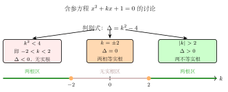

# 参数与含参讨论

## 一例速记

$$kx + 2 = 3x - 1 \xrightarrow{\text{整理}} (k-3)x = -3 \xrightarrow{k \neq 3} x = \dfrac{-3}{k-3}$$

一眼看出：方程是否有解，取决于 $x$ 的系数 $k-3$ 是否为零。**含参讨论的第一步，永远是分离参数所在的系数**。

---

## 一、含参问题——中考代数压轴必考

翻开近五年的陕西中考数学卷，代数压轴题里几乎每年都有这样一种题型：方程或不等式里出现了 $k$、$m$、$a$ 这样的字母，题目要求你求这个字母的取值范围，或者分类讨论不同取值下的结论。

这就是**含参问题**——参数（parameter）是题目里以字母形式出现的"未确定的常数"。它不是你要求的未知数 $x$，而是一个悬在题目里的"可调旋钮"。

**含参问题的三种常见问法**：

1. **求范围型**：例如"求 $k$ 的取值范围，使方程有解"、"求 $m$ 的值，使不等式有整数解"
2. **分类讨论型**：例如"对实数 $a$ 分情况讨论，解不等式 $ax > 2$"
3. **根的条件型**：例如"已知方程 $x^2 - (k+2)x + 2k = 0$ 有两个正根，求 $k$ 的范围"

含参问题之所以是压轴题，是因为它需要**同时驾驭参数和未知数两层逻辑**，一不小心就会漏情况或者讨论方向搞反。本篇提供一套可靠的处理框架。

---

## 二、含参问题的 3 类策略

### 策略一：直接代入策略

**适用场合**：参数只出现在常数项，不影响方程的次数和不等号方向。

**做法**：把参数当作已知数，按正常流程求解，得到"含参的解"，最后再看解的合法性。

**例**：解方程 $x^2 + mx + 2m = 0$（$m$ 为常数）

直接用求根公式，$\Delta = m^2 - 8m$，得

$$x = \frac{-m \pm \sqrt{m^2 - 8m}}{2}$$

含参的解已经写出，再反过来看：当 $\Delta \geq 0$（即 $m \leq 0$ 或 $m \geq 8$）时有实数解，否则无实数解。

这种策略的好处是**流程标准**，不容易漏掉步骤；缺点是得到的含参解可能很复杂。

---

### 策略二：参数分离策略

**适用场合**：参数可以被"分离"到等式一侧，使得参数 = 某个关于 $x$ 的表达式，再结合该表达式的值域求范围。

**做法**：通过移项，把含参的部分单独放在一侧，另一侧只含 $x$，从而把"求参数范围"转化为"求关于 $x$ 的函数的值域"。

**例**：要使方程 $x^2 - kx + k - 1 = 0$ 在 $0 \leq x \leq 2$ 范围内有实数根，求 $k$ 的范围。

移项分离参数：$k(x - 1) = x^2 - 1 = (x-1)(x+1)$

- 若 $x \neq 1$，两边除以 $(x-1)$：$k = x + 1$
- $x \in [0, 2]$ 且 $x \neq 1$ 时，$x + 1 \in [1, 3] \setminus \{2\}$
- 若 $x = 1$，代入方程验证：$1 - k + k - 1 = 0$，恒成立，所以 $x = 1$（对应 $k = 2$）也是解。

综合：$k \in [1, 3]$。

---

### 策略三：分类讨论策略

**适用场合**：参数出现在影响方程类型（一次/二次）或不等号方向的位置，必须按参数的正负/零三类分情形。

**做法**：找到参数的"关键值"（使系数为零、使判别式为零、使方程次数改变的值），以此为界点把参数范围划分成若干区间，分别讨论。

含参一次方程：关键值 = 使 $x$ 系数为零的参数值

含参不等式：关键值 = 使不等号系数为零的参数值（正负影响不等号方向）

含参二次方程：关键值 = $\Delta = 0$ 时的参数值 + 使最高次系数为零的参数值

---

## 三、参数分离的核心套路——含参一次方程

### 完整演示

**例题**：对于实数 $k$，方程 $kx + 2 = 3x - 1$ 何时有解？何时无解？

**解题过程**：

移项整理，把含 $x$ 的项归到左边：

$$kx - 3x = -1 - 2 \implies (k-3)x = -3$$

现在看 $x$ 的系数 $k - 3$：

> "看到方程 $(k-3)x = -3$，$x$ 的系数是 $k-3$，这是个含参的系数——**参数藏在系数里，这是含参一次方程最典型的结构**。
>
> 下一步：系数是否为零？
>
> **若 $k - 3 \neq 0$**，即 $k \neq 3$，两边除以 $k-3$：$x = \dfrac{-3}{k-3}$，方程有唯一解。
>
> **若 $k - 3 = 0$**，即 $k = 3$，方程变为 $0 \cdot x = -3$，即 $0 = -3$，矛盾，方程无解。
>
> 两种情况都要写，缺一不可。"

**结论**：

$$\begin{cases} k \neq 3 & \text{时，方程有唯一解 } x = \dfrac{-3}{k-3} \\ k = 3 & \text{时，方程无解} \end{cases}$$

所以方程有解的条件是 $k \neq 3$。

### 规律总结

含参一次方程的处理模板：

$$ax = b \xrightarrow{\text{讨论}} \begin{cases} a \neq 0: & x = \dfrac{b}{a} \quad \text{（唯一解）} \\ a = 0, b = 0: & \text{无穷多解（恒等式）} \\ a = 0, b \neq 0: & \text{无解（矛盾方程）} \end{cases}$$

当 $a, b$ 含参时，关键值就是使 $a = 0$ 的参数值。

---

## 四、含参一元二次方程的 4 个讨论维度

含参一元二次方程形如 $ax^2 + bx + c = 0$，其中 $a$、$b$、$c$ 含参数。处理时按以下 4 个维度依次讨论：

### 维度 1：是否是二次方程

**问**：$a$ 是否为零？

- 若 $a \neq 0$：是二次方程，进行后续讨论
- 若 $a = 0$：退化为一次（或零次）方程，按含参一次方程处理

**典型场景**：方程 $(m-2)x^2 + 3x - 1 = 0$

先问：$m - 2 = 0$（即 $m = 2$）时，方程变为 $3x - 1 = 0$，解为 $x = \dfrac{1}{3}$；$m \neq 2$ 时，才是二次方程，继续讨论维度 2-4。

---

### 维度 2：判别式正负——根的存在性

对于 $a \neq 0$ 的情形，判别式 $\Delta = b^2 - 4ac$ 决定根的数目：

$$\Delta > 0 \implies \text{两个不相等实根} \qquad \Delta = 0 \implies \text{两个相等实根} \qquad \Delta < 0 \implies \text{无实根}$$

如果题目要求"有实数根"，则条件是 $\Delta \geq 0$；要求"有两个不同实根"，则条件是 $\Delta > 0$。

---

### 维度 3：根的范围——韦达定理组合

若已知方程有实数根（$\Delta \geq 0$），韦达定理给出根的对称信息：

$$x_1 + x_2 = -\frac{b}{a} \qquad x_1 x_2 = \frac{c}{a}$$

利用这两个量加上 $\Delta$ 的符号，可以判断根的位置：

| 目标 | 条件 |
|---|---|
| 两根同号正 | $x_1 + x_2 > 0$ 且 $x_1 x_2 > 0$ 且 $\Delta \geq 0$ |
| 两根同号负 | $x_1 + x_2 < 0$ 且 $x_1 x_2 > 0$ 且 $\Delta \geq 0$ |
| 两根异号 | $x_1 x_2 < 0$（此时 $\Delta > 0$ 自动满足）|
| 根都大于某值 $t$ | $x_1 + x_2 > 2t$ 且 $x_1 x_2 > t^2$ 且 $\Delta \geq 0$ |

**注意**：$x_1 x_2 > 0$ 不能单独保证两根都正，还需要结合 $x_1 + x_2 > 0$，因为两根都负时积也是正的。

---

### 维度 4：根的实际意义

在应用题中，根往往有额外约束（正整数、正数、整数等），需要在维度 2-3 得到的参数范围基础上，再加上实际意义的限制条件。

**例**：某工程问题最终列出方程 $x^2 - (k+1)x + k = 0$，且 $x$ 代表天数（应为正整数）。

用韦达：$x_1 + x_2 = k+1$，$x_1 x_2 = k$。

实际意义要求：$x_1 > 0$，$x_2 > 0$，且 $x_1, x_2$ 为正整数。

先保证 $x_1 x_2 = k > 0$ 且 $x_1 + x_2 = k+1 > 0$，再逐一验算整数解。

---

## 五、含参不等式的演示

**题目**：对实数常数 $k$，解不等式 $kx > 3 - x$。

> "拿到不等式，先整理到标准形式：$kx + x > 3$，即 $(k+1)x > 3$。
>
> $x$ 的系数是 $k+1$，里面含参数 $k$——这决定了除以系数时不等号是否要翻转。
>
> **讨论 $k+1$ 的正负**是核心。找关键值：$k + 1 = 0 \Rightarrow k = -1$。
>
> **情形一：$k > -1$**（即 $k+1 > 0$）：两边除以 $k+1$，不等号方向不变：
> $$x > \frac{3}{k+1}$$
>
> **情形二：$k < -1$**（即 $k+1 < 0$）：两边除以 $k+1$，不等号**方向反转**：
> $$x < \frac{3}{k+1}$$
>
> **情形三：$k = -1$**（即 $k+1 = 0$）：不等式变为 $0 \cdot x > 3$，即 $0 > 3$，这是假命题，所以不等式**无解**。"

**综合结论**：

$$\begin{cases} k > -1 & \text{时，解集为} \left\{x \mid x > \dfrac{3}{k+1}\right\} \\[6pt] k < -1 & \text{时，解集为} \left\{x \mid x < \dfrac{3}{k+1}\right\} \\[6pt] k = -1 & \text{时，无解} \end{cases}$$

含参不等式的结论必须写清三种情形，漏掉任何一种都是不完整的解答。

---

## 六、思考路标

看到题目出现字母常数时，脑子里要立刻启动以下流程：

**路标 1**：见含参一次方程 $f(k) \cdot x = g(k)$，立刻问：**$f(k) = 0$ 时参数是什么值？** 以此为界分类。

**路标 2**：见含参不等式，$x$ 的系数含参 → 立刻找 **"系数为零"的参数关键值** → 分正/零/负三情形，注意负时翻转不等号。

**路标 3**：见含参二次方程 $(ax^2 + bx + c = 0, a$ 含参$)$ → 先问 **"最高次系数是否为零"**，分是/否两大情形，是则退化为低次讨论。

**路标 4**：题目问"有两个正根"、"根都大于某值" → 立刻写出**三个条件联立**：$\Delta \geq 0$（或 $> 0$）+ $x_1 + x_2 > 0$ + $x_1 x_2 > 0$，缺一不可。

**路标 5**：参数分离适用于 **"求参数取值使某式成立"** 类题型 → 把参数单独移到一边，得"$k = $ 关于 $x$ 的函数"，再结合 $x$ 的约束求函数值域即得 $k$ 的范围。

**路标 6**：含参问题的答案必须按分类写出每一情形，不能只写一种情形后说"类似地"——每种情形对应的解集可能完全不同。

---

## 七、典型应用例题

### 例 1：含参一次方程的完整讨论

**题目**：已知方程 $\dfrac{m+1}{x-2} + \dfrac{m}{x+1} = 1$ 关于 $x$ 有解，求 $m$ 的范围。

**思路**：

先去分母，乘以 $(x-2)(x+1)$：

$$(m+1)(x+1) + m(x-2) = (x-2)(x+1)$$

展开：$(m+1)x + (m+1) + mx - 2m = x^2 - x - 2$

整理：$(2m+1)x + (m+1-2m) = x^2 - x - 2$

即 $x^2 - (2m+2)x + (-m-3) = 0$

这是一个关于 $x$ 的二次方程（最高次系数为 1，不含参数，所以是二次方程）。

要有解，需 $\Delta \geq 0$：

$$\Delta = (2m+2)^2 + 4(m+3) = 4m^2 + 8m + 4 + 4m + 12 = 4m^2 + 12m + 16$$

$$\Delta = 4(m^2 + 3m + 4) = 4\left[\left(m + \frac{3}{2}\right)^2 + \frac{7}{4}\right] > 0$$

恒成立！方程恒有两个实数根，但要检验是否为增根（$x = 2$ 或 $x = -1$ 使原式分母为零）。

代入检验：若 $x = 2$，原方程分母含 $x-2 = 0$，要排除；若 $x = -1$，分母含 $x+1 = 0$，也要排除。

分别代入 $x^2 - (2m+2)x + (-m-3) = 0$ 求解增根时对应的 $m$ 值，并从答案中剔除。

最终结论：排除使 $x = 2$ 或 $x = -1$ 成为根的 $m$ 值，其余所有 $m$ 都满足方程有解。

---

### 例 2：含参二次方程——两正根条件

**题目**：方程 $x^2 - (k+1)x + k - 2 = 0$ 有两个正实数根，求 $k$ 的范围。

**思路**：

方程最高次系数为 1（不含参），所以它永远是二次方程。

由韦达定理：$x_1 + x_2 = k + 1$，$x_1 x_2 = k - 2$。

两正根的三个条件：

$$\begin{cases} \Delta \geq 0 \\ x_1 + x_2 > 0 \\ x_1 x_2 > 0 \end{cases}$$

逐一计算：

**$\Delta \geq 0$**：$(k+1)^2 - 4(k-2) \geq 0 \Rightarrow k^2 + 2k + 1 - 4k + 8 \geq 0 \Rightarrow k^2 - 2k + 9 \geq 0$

配方：$(k-1)^2 + 8 \geq 0$，恒成立，无约束。

**$x_1 + x_2 > 0$**：$k + 1 > 0 \Rightarrow k > -1$

**$x_1 x_2 > 0$**：$k - 2 > 0 \Rightarrow k > 2$

三条件取交集：$k > 2$。

**答**：$k > 2$，即 $k \in (2, +\infty)$。

---

### 例 3：参数分离求范围

**题目**：若不等式 $mx^2 + mx + 1 > 0$ 对一切实数 $x$ 恒成立，求 $m$ 的范围。

**思路**：

> "这道题的 $m$ 既出现在二次项系数，也出现在一次项系数——参数影响了方程次数，必须先讨论 $m$ 是否为零。
>
> **若 $m = 0$**：不等式变为 $1 > 0$，恒成立，$m = 0$ 满足。
>
> **若 $m \neq 0$**：$mx^2 + mx + 1 > 0$ 对所有 $x$ 恒成立，说明抛物线 $y = mx^2 + mx + 1$ 全在 $x$ 轴上方。
>
> 条件：$m > 0$（开口向上）且 $\Delta < 0$（与 $x$ 轴无交点）。
>
> $\Delta = m^2 - 4m < 0 \Rightarrow m(m-4) < 0 \Rightarrow 0 < m < 4$
>
> 结合 $m > 0$，得 $0 < m < 4$。"

合并两情形：$m = 0$ 也满足，所以最终 $m \in [0, 4)$。

---

## 八、自测题

**第 1 题**：对实数 $k$，方程 $(2k-1)x = k+3$，分三情形讨论方程的解。

💡 提示：令 $2k - 1 = 0$ 找关键值，再分 $k = \frac{1}{2}$、$k \neq \frac{1}{2}$ 两情形，后者再看右端是否为零。

**第 2 题**：解含参不等式 $(k-3)x < 2k - 6$（$k$ 为常数）。

💡 提示：注意右端 $2k - 6 = 2(k-3)$，整理后 $(k-3)x < 2(k-3)$，按 $k > 3$、$k = 3$、$k < 3$ 三情形讨论。

**第 3 题**：方程 $x^2 + (m-2)x + m - 5 = 0$ 有两个不相等的负实数根，求 $m$ 的范围。

💡 提示：写出三条件 $\Delta > 0$，$x_1 + x_2 < 0$，$x_1 x_2 > 0$（注意：两负根，积为正，和为负），用韦达定理代入，解不等式组取交集。

**第 4 题**：已知实数 $a$，若方程 $ax^2 + 2x + 1 = 0$ 有实数解，求 $a$ 的范围。

💡 提示：先讨论 $a = 0$（退化为一次，有解）；再讨论 $a \neq 0$（二次方程，需 $\Delta = 4 - 4a \geq 0$，即 $a \leq 1$）；合并两段结果取并集。
